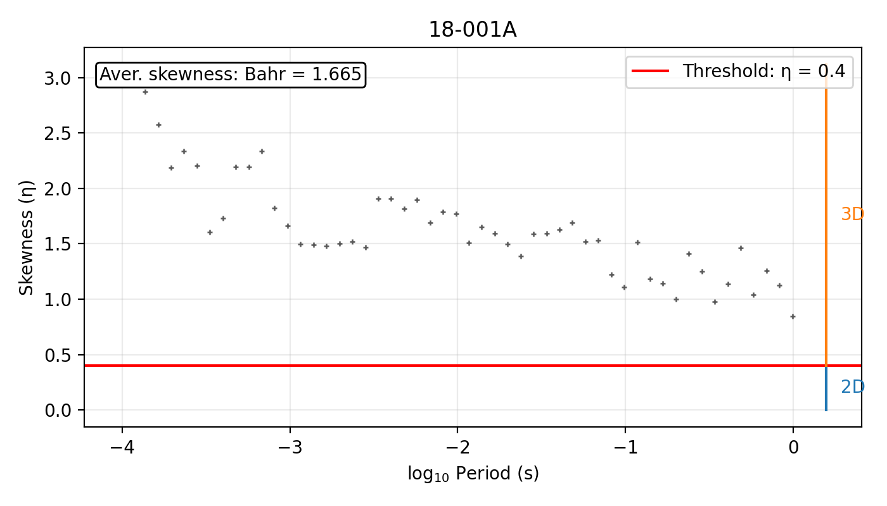
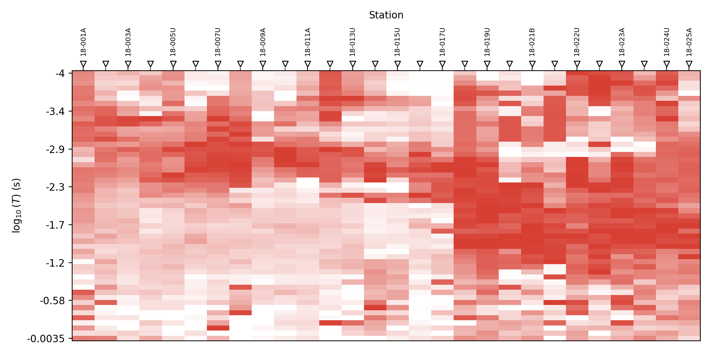
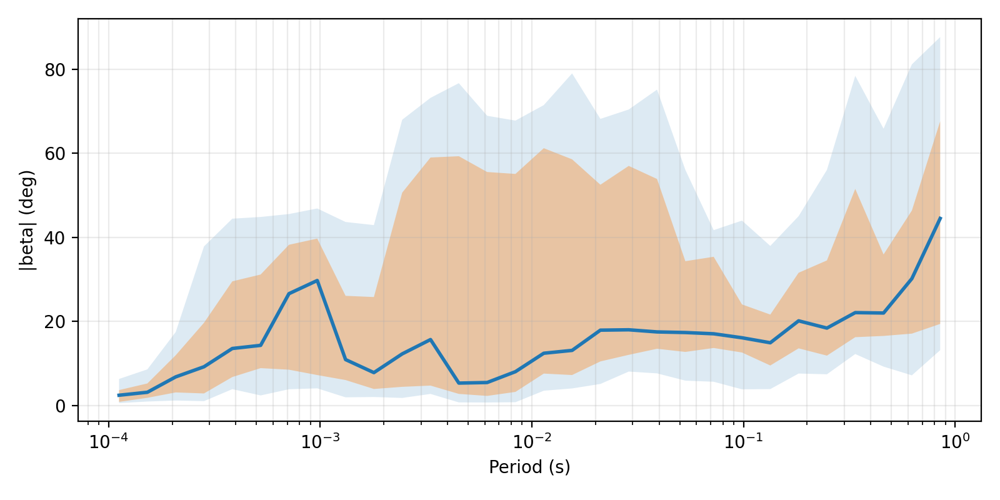
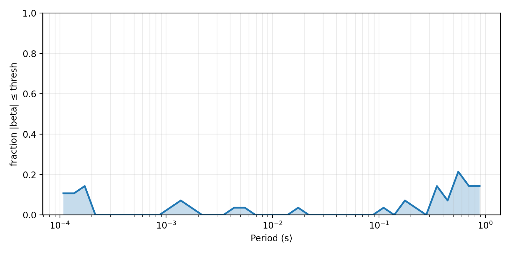
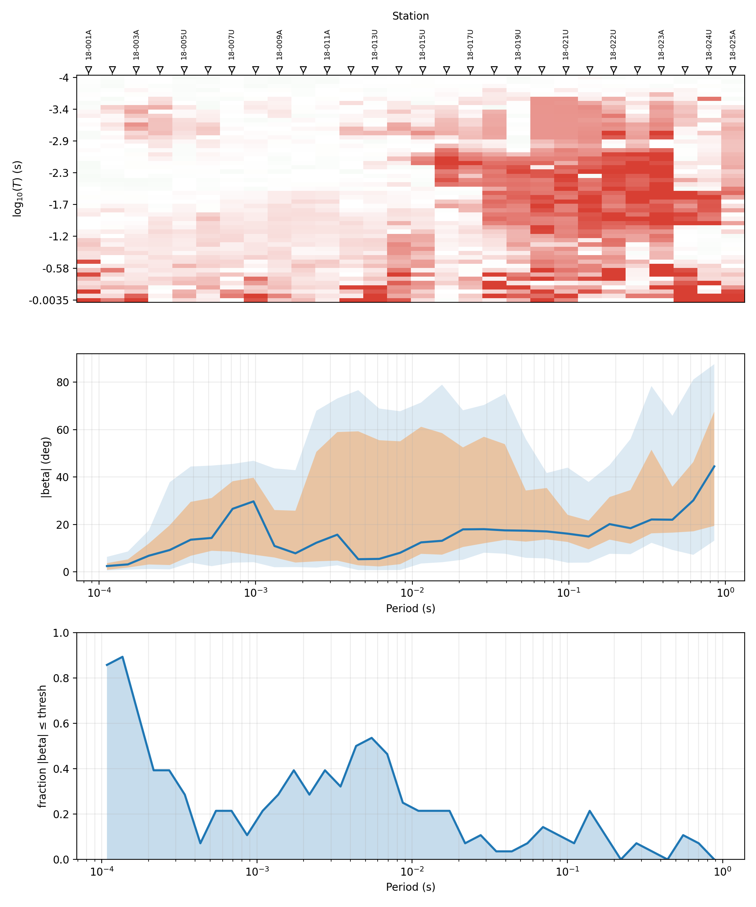

.. _emtools_skew:

Skew Diagnostics
================

``pycsamt.emtools.skew`` documents how far an impedance tensor departs
from a simple 1-D or 2-D response. It gives two complementary views of
skew:

* Bahr skewness, written :math:`\eta`, computed directly from the
  complex impedance tensor ``Z``.
* Phase-tensor skew, written :math:`\beta`, computed through the
  phase-tensor table and reported in degrees.

Use skew diagnostics before 2-D preparation, dimensionality decisions,
strike interpretation, frequency masking, and inversion setup. A low
skew band supports a 1-D/2-D approximation. A high skew band warns that
the tensor may contain 3-D structure, galvanic distortion, local noise,
or component geometry that should not be forced into a simple 2-D
workflow without more checks.

Full signatures and parameter defaults are maintained in the
:doc:`API reference <../../api/emtools>`. This page explains how to use
the public workflow functions through ``pycsamt.emtools``.

Two Skew Measures
-----------------

Bahr skewness is computed from impedance invariants. In pyCSAMT it is
available through ``bahr_skewness`` and accepts either a tensor block of
shape ``(n_freq, 2, 2)`` or a flattened block of shape ``(n_freq, 4)``.

.. math::

   \eta =
   \sqrt{
      \frac{|Z_{xx}+Z_{yy}|^2 + |Z_{xy}-Z_{yx}|^2}
           {|Z_{xx}-Z_{yy}|^2 + |Z_{xy}+Z_{yx}|^2}
   }

Phase-tensor skew starts from the phase tensor itself, built from the
real and imaginary parts of the same impedance tensor,

.. math::

   \Phi = X^{-1} Y, \qquad X = \mathrm{Re}(Z), \quad Y = \mathrm{Im}(Z),

and the skew angle is then the Caldwell-Bibby-Bahr invariant

.. math::

   \beta = \frac{1}{2}\operatorname{atan2}\!\bigl(
   \Phi_{xy} + \Phi_{yx},\ \Phi_{xx} - \Phi_{yy}\bigr),

reported in degrees. ``skew_table`` returns the same table produced by
the phase-tensor workflow, including ``station``, ``freq``, ``period``,
``beta``, and ``skew`` — in this module ``skew`` is just an alias for
``beta``, kept because that is the column name the masking and voting
helpers below were written against.

The two measures are related but not interchangeable. Bahr
:math:`\eta` is a direct invariant of ``Z``. Phase-tensor
:math:`\beta` depends on the real and imaginary impedance parts through
the phase tensor. They can agree that a station is non-2-D while ranking
the severity differently.

Workflow Map
------------

.. list-table::
   :header-rows: 1
   :widths: 28 36 36

   * - Goal
     - Use this
     - Result
   * - Compute a station-frequency skew table
     - ``skew_table``
     - A ``pandas.DataFrame`` with one row per station and frequency.
   * - Compute Bahr skew from a Z block
     - ``bahr_skewness``
     - A one-dimensional array of :math:`\eta` values.
   * - Mask rows above a skew threshold
     - ``mask_by_skew``
     - A ``Sites`` object where rejected Z/tipper rows are ``NaN``.
   * - Keep one contiguous low-skew run per station
     - ``keep_longest_low_skew``
     - A station-wise band mask.
   * - Bridge short gaps inside low-skew runs
     - ``close_skew_gaps``
     - A less fragmented station-wise mask.
   * - Keep a survey-wide low-skew band
     - ``select_low_skew_band``
     - A shared frequency band selected by station vote.
   * - Plot skew quality across the line
     - ``plot_skew_traffic_psection``,
       ``plot_skew_percentile_ribbon``, ``plot_skew_vote_band``
     - Pseudo-section, period ribbon, and vote-curve views.
   * - Plot Bahr skew for one station
     - ``plot_skewness``
     - A single-station :math:`\eta` plot against a threshold.

Loading The Survey
------------------

Load once with ``ensure_sites`` and reuse the same raw object for
diagnostics and before/after checks.

.. code-block:: python
   :linenos:

   from pathlib import Path

   from pycsamt.emtools import ensure_sites

   edi_dir = Path("data/AMT/WILLY_DATA/L18PLT")
   sites = ensure_sites(edi_dir, recursive=True, verbose=0)

Most masking functions default to ``inplace=False``. That means the
returned ``Sites`` object is masked, while ``sites`` remains available
for comparison.

Phase-Tensor Skew Table
-----------------------

Start with ``skew_table``. It summarizes :math:`\beta` at every
station-frequency row.

.. code-block:: python
   :linenos:

   from pycsamt.emtools import ensure_sites, skew_table
   sites = ensure_sites("data/AMT/WILLY_DATA/L18PLT", recursive=True)
   table = skew_table(sites)
   print(table.columns)
   print(table[["station", "freq", "period", "beta", "skew"]].head())
   print(table["skew"].abs().describe())
   station_summary = (
       table.assign(abs_skew=table["skew"].abs())
       .groupby("station", as_index=False)
       .agg(
           n_freq=("freq", "size"),
           median_abs_skew=("abs_skew", "median"),
           max_abs_skew=("abs_skew", "max"),
       )
       .sort_values("median_abs_skew")
   )
   print(station_summary.head())
   print(station_summary.tail())

.. code-block:: text

   Index(['station', 'freq', 'period', 's1', 's2', 'theta', 'alpha', 'beta',
          'skew', 'ellipt'],
         dtype='object')
      station     freq    period       beta       skew
   0  18-001A  10400.0  0.000096 -56.700714 -56.700714
   1  18-001A   8707.0  0.000115 -54.693184 -54.693184
   2  18-001A   7289.0  0.000137 -51.452210 -51.452210
   3  18-001A   6102.0  0.000164 -61.983725 -61.983725
   4  18-001A   5108.0  0.000196 -60.874439 -60.874439
   count    1484.000000
   mean       44.536824
   std        25.198206
   min         0.353578
   25%        23.593647
   50%        40.992429
   75%        66.994007
   max        89.910303
   Name: skew, dtype: float64
       station  n_freq  median_abs_skew  max_abs_skew
   14  18-015U      53        22.459269     73.709036
   16  18-017U      53        22.912833     88.315919
   15  18-016A      53        23.525350     87.383364
   8   18-009A      53        25.288856     77.805353
   9   18-010U      53        26.006304     88.810111
       station  n_freq  median_abs_skew  max_abs_skew
   26  18-024U      53        63.853268     89.878126
   22  18-022U      53        65.349813     89.438099
   17  18-018A      53        66.547818     89.385210
   23  18-022V      53        66.787861     89.910303
   24  18-023A      53        67.022970     89.760407

Interpret ``skew`` and ``beta`` as angles in degrees. A common strict
phase-tensor threshold is around ``3`` to ``6`` degrees. Real CSAMT
survey lines can be much larger. When every station is above a strict
threshold, do not blindly mask the whole survey. First inspect the
distribution and decide whether the threshold is appropriate for the
question being asked.

Bahr Skewness
-------------

Use ``bahr_skewness`` when you want an independent skew measure computed
directly from impedance.

.. code-block:: python
   :linenos:

   import numpy as np
   from pycsamt.emtools import bahr_skewness, ensure_sites
   sites = ensure_sites("data/AMT/WILLY_DATA/L18PLT", recursive=True)
   # Example: use the first station in the loaded Sites collection.
   station = next(iter(sites))
   z = station.z
   freq = station.freq
   eta = bahr_skewness(z)
   period = 1.0 / freq
   print(np.nanmin(eta), np.nanmedian(eta), np.nanmax(eta))
   print(period[:5], eta[:5])

.. code-block:: text

   0.8461749951030751 1.5856487464775848 2.9879890035270154
   [9.61538462e-05 1.14850121e-04 1.37193031e-04 1.63880695e-04
    1.95771339e-04] [2.97741225 2.987989   2.86896122 2.57559637 2.18481788]

The classic Bahr threshold often used as a 2-D/3-D guide is
``eta = 0.4``. Treat that as a diagnostic boundary, not an automatic
editing rule. Large :math:`\eta` can reflect genuine 3-D structure, but
it can also reflect noise, distortion, or component problems.

Bahr Skew Plot
--------------

``plot_skewness`` plots Bahr :math:`\eta` against log-period and draws
the threshold line.

.. code-block:: python
   :linenos:

   import matplotlib.pyplot as plt

   from pycsamt.emtools import ensure_sites, plot_skewness

   sites = ensure_sites("data/AMT/WILLY_DATA/L18PLT", recursive=True)
   station = next(iter(sites))

   fig, ax = plt.subplots(figsize=(7, 4))
   plot_skewness(
       station.freq,
       station.z,
       threshold=0.4,
       ax=ax,
       title=str(getattr(station, "name", "station")),
   )
   fig.tight_layout()
   fig.savefig("bahr_skewness_18-001A.png", dpi=200)
   plt.close(fig)

Use this plot when you need to explain one station concretely. Use the
survey-wide phase-tensor plots below when the question is line-scale
dimensionality.

Masking By Skew
---------------

``mask_by_skew`` applies a phase-tensor skew threshold row by row. Every
mode reduces to the same shape — keep the row unless :math:`\beta`
crosses a one-sided or two-sided bound — but which side of
:math:`\beta` gets rejected changes with the mode:

.. list-table::
   :header-rows: 1
   :widths: 16 26 58

   * - Mode
     - Keep rule
     - Use it to
   * - ``"abs_gt"`` (default)
     - :math:`|\beta| \le \text{thresh}`
     - reject rows too skewed in either direction — the usual symmetric
       threshold.
   * - ``"gt"``
     - :math:`\beta \le \text{thresh}`
     - reject only large *positive* skew, keeping large negative skew.
   * - ``"lt"``
     - :math:`\beta \ge \text{thresh}`
     - reject only large *negative* skew, keeping large positive skew.
   * - ``"abs_lt"``
     - :math:`|\beta| \ge \text{thresh}`
     - the inverse of the default: keep only the strongly skewed rows,
       useful for isolating high-skew examples rather than removing
       them.

``"gt"`` and ``"lt"`` are asymmetric on purpose. They let a survey
tolerate skew of one sign — say, from a known distortion direction —
while still rejecting the other.

.. code-block:: python
   :linenos:

   from pycsamt.emtools import ensure_sites, mask_by_skew

   sites = ensure_sites("data/AMT/WILLY_DATA/L18PLT", recursive=True)

   masked = mask_by_skew(
       sites,
       thresh=6.0,
       mode="abs_gt",
       also="both",
       inplace=False,
   )

``also`` controls which data blocks are masked:

* ``"z"`` masks only impedance rows.
* ``"tipper"`` masks only tipper rows.
* ``"both"`` masks impedance and tipper rows at the same rejected
  frequencies.

The three non-default modes from the table above, in the same order:

.. code-block:: python
   :linenos:

   from pycsamt.emtools import mask_by_skew

   # Keep only rows with skew <= +6 degrees.
   keep_not_greater = mask_by_skew(sites, thresh=6.0, mode="gt")

   # Keep only rows with skew >= -6 degrees.
   keep_not_less = mask_by_skew(sites, thresh=-6.0, mode="lt")

   # Keep rows where absolute skew is at least 6 degrees.
   # This is unusual for inversion preparation, but useful for isolating
   # high-skew examples in diagnostics.
   keep_high_skew = mask_by_skew(sites, thresh=6.0, mode="abs_lt")

Because masking writes ``NaN`` into rejected tensor rows, always verify
how many usable rows remain before sending the result to an inversion or
plotting workflow.

Counting Surviving Rows
-----------------------

A simple count helper is often enough for documentation and QC tables.

.. code-block:: python
   :linenos:

   import numpy as np
   from pycsamt.emtools import ensure_sites, mask_by_skew
   raw = ensure_sites("data/AMT/WILLY_DATA/L18PLT", recursive=True)
   masked = mask_by_skew(raw, thresh=6.0, also="z", inplace=False)
   rows = []
   for station in masked:
       z = station.z
       good = np.isfinite(z).all(axis=(1, 2))
       rows.append(
           {
               "station": getattr(station, "name", ""),
               "n_total": int(z.shape[0]),
               "n_kept": int(good.sum()),
               "kept_fraction": float(good.mean()),
           }
       )
   print(rows[:5])

.. code-block:: text

   [{'station': '18-001A', 'n_total': 53, 'n_kept': 2, 'kept_fraction': 0.03773584905660377}, {'station': '18-002U', 'n_total': 53, 'n_kept': 1, 'kept_fraction': 0.018867924528301886}, {'station': '18-003A', 'n_total': 53, 'n_kept': 1, 'kept_fraction': 0.018867924528301886}, {'station': '18-004A', 'n_total': 53, 'n_kept': 2, 'kept_fraction': 0.03773584905660377}, {'station': '18-005U', 'n_total': 53, 'n_kept': 3, 'kept_fraction': 0.05660377358490566}]

This count is the sanity check that prevents a silent all-``NaN`` result
from moving downstream. If strict thresholds keep too little data, return
to the skew distribution and decide whether a looser survey-specific
threshold is justified.

Longest Low-Skew Run
--------------------

``keep_longest_low_skew`` is stricter than row-by-row masking. For each
station, it finds the longest contiguous frequency run satisfying
``abs(skew) <= thresh`` and masks everything else.

.. code-block:: python
   :linenos:

   from pycsamt.emtools import ensure_sites, keep_longest_low_skew

   sites = ensure_sites("data/AMT/WILLY_DATA/L18PLT", recursive=True)

   banded = keep_longest_low_skew(
       sites,
       thresh=6.0,
       min_len=3,
       pad=1,
       also="both",
       fallback="keep_all",
       inplace=False,
   )

``min_len`` is important. If a station has only one or two isolated
low-skew rows, you probably do not want to call that a usable band.
``pad`` expands the selected run by a few neighboring frequencies.

The fallback controls what happens when no acceptable run exists:

* ``fallback="keep_all"`` preserves the station rather than destroying
  it. This is safer for exploratory diagnostics, but it can make a
  failed threshold look like a fully accepted station unless you count
  rows.
* ``fallback="drop_all"`` masks the station completely when no run
  passes. This is stricter and should be used only when downstream code
  can handle missing stations or all-``NaN`` rows.

Closing Small Gaps
------------------

``close_skew_gaps`` fills short interior gaps inside a low-skew mask.
It is useful when one or two noisy frequency samples break an otherwise
continuous band.

.. code-block:: python
   :linenos:

   from pycsamt.emtools import close_skew_gaps, ensure_sites

   sites = ensure_sites("data/AMT/WILLY_DATA/L18PLT", recursive=True)

   gap_closed = close_skew_gaps(
       sites,
       thresh=6.0,
       max_gap=1,
       also="both",
       inplace=False,
   )

Set ``max_gap=0`` to disable gap closing. Increase it cautiously. A
large value can bridge unrelated good segments and create a band that no
longer represents a genuinely continuous low-skew interval.

Survey-Wide Low-Skew Band
-------------------------

``select_low_skew_band`` looks for frequencies supported by a fraction
of stations. It first builds each station's own accepted band exactly as
``keep_longest_low_skew`` would — the longest contiguous
:math:`|\beta| \le \text{thresh}` run, extended by ``pad`` — and only
then projects every station's band onto a shared union frequency grid
:math:`G` and votes:

.. math::

   \mathrm{keep}(f) =
   \frac{1}{N}\sum_{n=1}^{N} \mathbf{1}\bigl[f \in \mathrm{band}_n\bigr]
   \ \ge\ \text{frac}, \qquad f \in G,

where :math:`N` is the number of stations and :math:`\mathrm{band}_n`
is station :math:`n`'s own accepted run. A frequency survives only if
it falls inside the *contiguous* accepted band of at least a
``frac``-fraction of stations — not merely inside any low-skew row,
which is the weaker condition the vote-band plot below checks.

.. code-block:: python
   :linenos:

   from pycsamt.emtools import ensure_sites, select_low_skew_band

   sites = ensure_sites("data/AMT/WILLY_DATA/L18PLT", recursive=True)

   shared = select_low_skew_band(
       sites,
       thresh=6.0,
       frac=0.6,
       min_len=3,
       pad=0,
       also="both",
       inplace=False,
   )

Use this function when you need one common frequency band for a line,
for example before a shared inversion setup or a line-scale
dimensionality statement. It can be much stricter than a plot showing
the raw fraction of low-skew rows, because it votes on station-specific
contiguous bands rather than isolated pointwise passes.

Traffic-Light Pseudo-Section
----------------------------

``plot_skew_traffic_psection`` colors each station-period cell by
absolute phase-tensor skew:

* green: ``abs(beta) <= t1``;
* amber: ``t1 < abs(beta) <= t2``;
* red: ``abs(beta) > t2``.

.. code-block:: python
   :linenos:

   import matplotlib.pyplot as plt

   from pycsamt.emtools import ensure_sites, plot_skew_traffic_psection

   sites = ensure_sites("data/AMT/WILLY_DATA/L18PLT", recursive=True)

   fig, ax = plt.subplots(figsize=(10, 5))
   plot_skew_traffic_psection(
       sites,
       t1=3.0,
       t2=6.0,
       axis_y="logperiod",
       ax=ax,
   )
   fig.tight_layout()
   fig.savefig("skew_traffic_psection_l18plt.png", dpi=200)
   plt.close(fig)

For highly skewed surveys, strict ``t1=3`` and ``t2=6`` may make the
whole line red. That is still useful: it tells you the textbook
thresholds are not identifying a usable 2-D band. For explanatory
figures, you may also plot survey-specific relaxed thresholds, but label
them clearly.

Percentile Ribbon
-----------------

``plot_skew_percentile_ribbon`` summarizes the whole line by period. It
plots median absolute skew and percentile bands through the period axis.

.. code-block:: python
   :linenos:

   import matplotlib.pyplot as plt

   from pycsamt.emtools import ensure_sites, plot_skew_percentile_ribbon

   sites = ensure_sites("data/AMT/WILLY_DATA/L18PLT", recursive=True)

   fig, ax = plt.subplots(figsize=(8, 4))
   plot_skew_percentile_ribbon(
       sites,
       n_bins=30,
       q_lo=25.0,
       q_hi=75.0,
       extra=(10.0, 90.0),
       ax=ax,
   )
   fig.tight_layout()
   fig.savefig("skew_percentile_ribbon_l18plt.png", dpi=200)
   plt.close(fig)

Use this plot to answer: "Is there any period range where the line as a
whole becomes less skewed?" A consistently high ribbon means the line
does not have a clean low-skew window under the chosen metric.

Vote-Band Plot
--------------

``plot_skew_vote_band`` bins the survey in log-period, and within each
bin :math:`b` a station is counted as passing if a majority of *its own*
rows in that bin are low-skew:

.. math::

   \mathrm{pass}_n(b) =
   \frac{1}{|R_{n,b}|}\sum_{f \in R_{n,b}} \mathbf{1}\bigl[|\beta(f)| \le
   \text{thresh}\bigr] \; > \; 0.5,

   \qquad
   \mathrm{vote}(b) = \frac{1}{N}\sum_{n=1}^{N} \mathbf{1}\bigl[
   \mathrm{pass}_n(b)\bigr],

where :math:`R_{n,b}` is station :math:`n`'s rows falling in bin
:math:`b`. This is a *pointwise* vote — it never checks whether a
station's low-skew rows in neighboring bins are contiguous, which is
exactly what ``select_low_skew_band`` requires above. A period range can
therefore look well-supported here while still failing the stricter
survey-wide band selection.

.. code-block:: python
   :linenos:

   import matplotlib.pyplot as plt

   from pycsamt.emtools import ensure_sites, plot_skew_vote_band

   sites = ensure_sites("data/AMT/WILLY_DATA/L18PLT", recursive=True)

   fig, ax = plt.subplots(figsize=(8, 4))
   plot_skew_vote_band(
       sites,
       thresh=6.0,
       n_bins=40,
       ax=ax,
   )
   fig.tight_layout()
   fig.savefig("skew_vote_band_l18plt.png", dpi=200)
   plt.close(fig)

Treat this plot as diagnostic rather than a substitute for
``select_low_skew_band``: a high vote here says many stations are
individually low-skew somewhere in the bin, not that they share one
continuous band.

Suggested Interpretation Pattern
--------------------------------

A robust skew review usually follows this sequence:

.. code-block:: python
   :linenos:

   import matplotlib.pyplot as plt

   from pycsamt.emtools import (
       ensure_sites,
       plot_skew_percentile_ribbon,
       plot_skew_traffic_psection,
       plot_skew_vote_band,
       skew_table,
   )

   sites = ensure_sites("data/AMT/WILLY_DATA/L18PLT", recursive=True)
   table = skew_table(sites)

   print(table["skew"].abs().describe())

   fig, axes = plt.subplots(3, 1, figsize=(10, 12))
   plot_skew_traffic_psection(sites, t1=3.0, t2=6.0, ax=axes[0])
   plot_skew_percentile_ribbon(sites, ax=axes[1])
   plot_skew_vote_band(sites, thresh=6.0, ax=axes[2])
   fig.tight_layout()
   fig.savefig("skew_review_panels_l18plt.png", dpi=200)
   plt.close(fig)

.. code-block:: text

   count    1484.000000
   mean       44.536824
   std        25.198206
   min         0.353578
   25%        23.593647
   50%        40.992429
   75%        66.994007
   max        89.910303
   Name: skew, dtype: float64

Read the outputs together:

* The table gives exact station-frequency values.
* The traffic-light pseudo-section shows where high skew is located.
* The percentile ribbon shows whether skew improves at some periods.
* The vote-band plot shows whether enough stations pass the threshold at
  the same period.

Only after those checks should you choose ``mask_by_skew``,
``keep_longest_low_skew``, ``close_skew_gaps``, or
``select_low_skew_band``.

Pitfalls
--------

High skew is not automatically bad data. It may be the geologic signal.
Use skew masks as interpretation tools, not as a reflexive cleaning
step.

Do not compare Bahr :math:`\eta` and phase-tensor :math:`\beta` as if
they have the same units. :math:`\eta` is dimensionless; :math:`\beta`
is an angle in degrees.

Beware of fallback behavior in ``keep_longest_low_skew``. If
``fallback="keep_all"``, a station that fails the threshold completely
can return with all rows preserved. Count the surviving rows and inspect
the skew table.

Use ``also="z"`` when only impedance should drive downstream processing.
Use ``also="both"`` when tipper rows must stay aligned with impedance
masking.

Worked Example
--------------

The example uses the L18PLT survey to compare phase-tensor skew and
Bahr skewness, apply skew-based masks, keep contiguous low-skew bands,
close small gaps, vote on a shared low-skew band, and generate the
traffic-light, percentile-ribbon, vote-band, and Bahr-skew figures.

Open the rendered gallery page here:
:ref:`sphx_glr_examples_emtools_plot_skew.py`.
