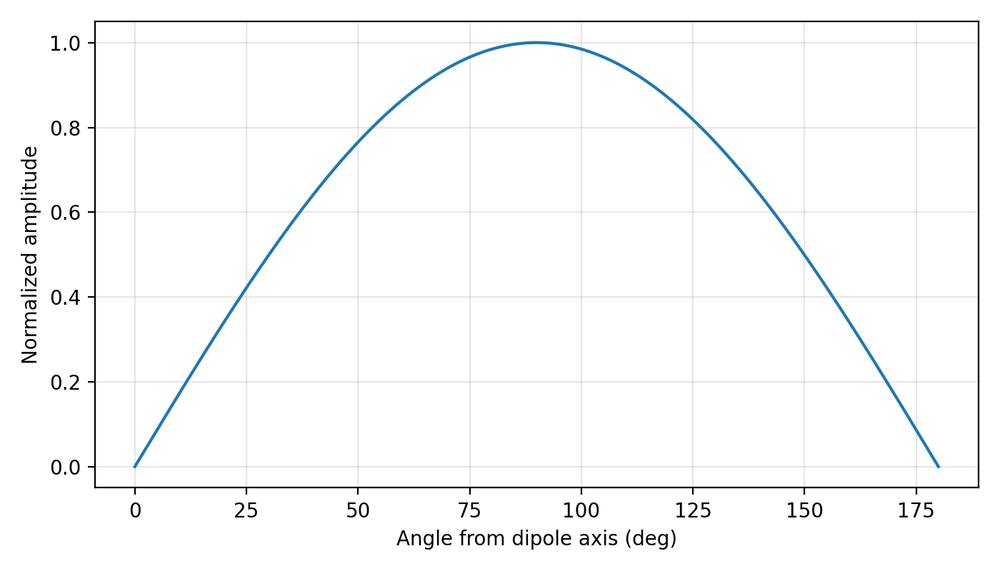
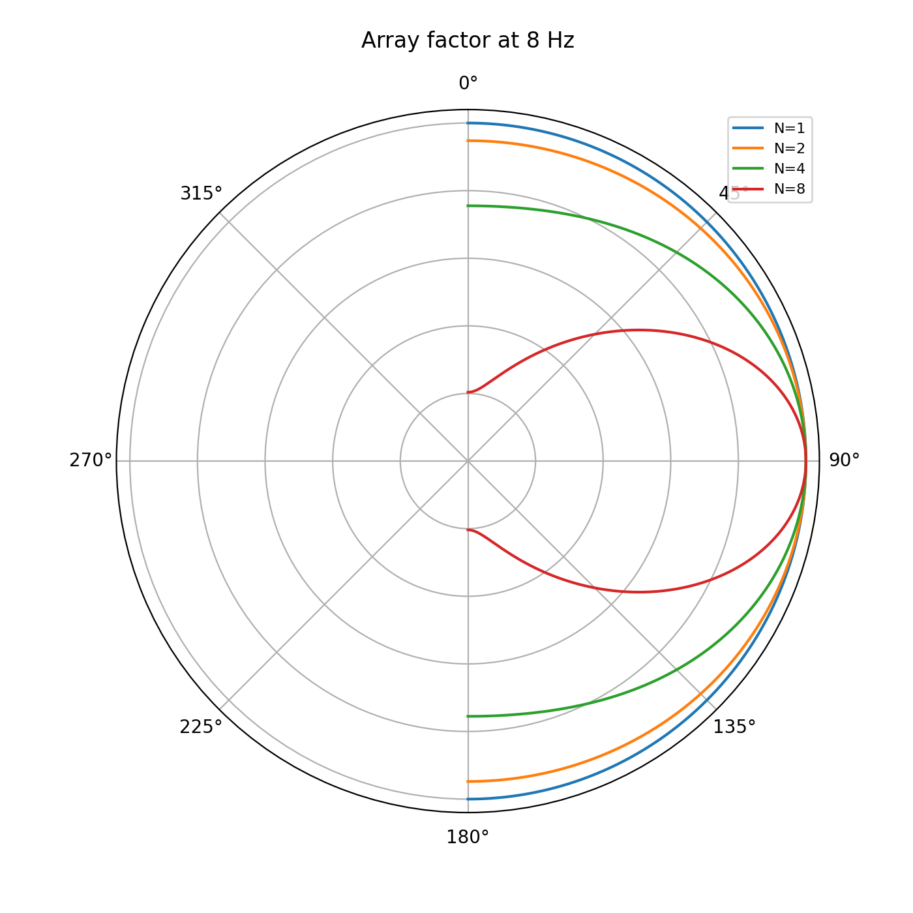
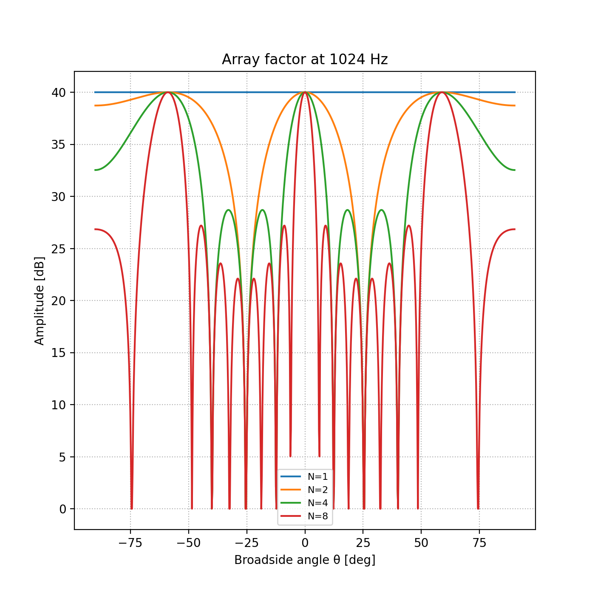
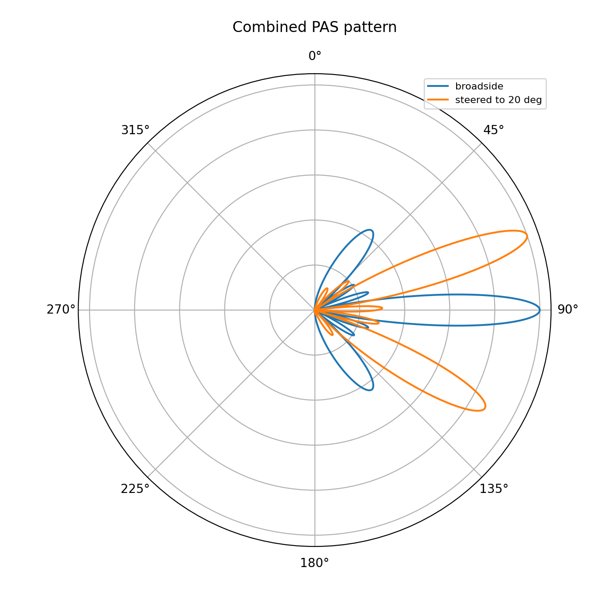
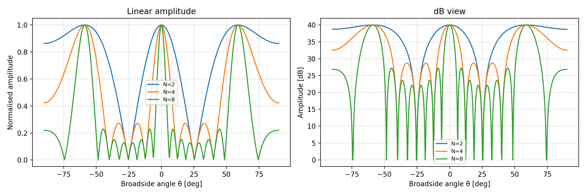
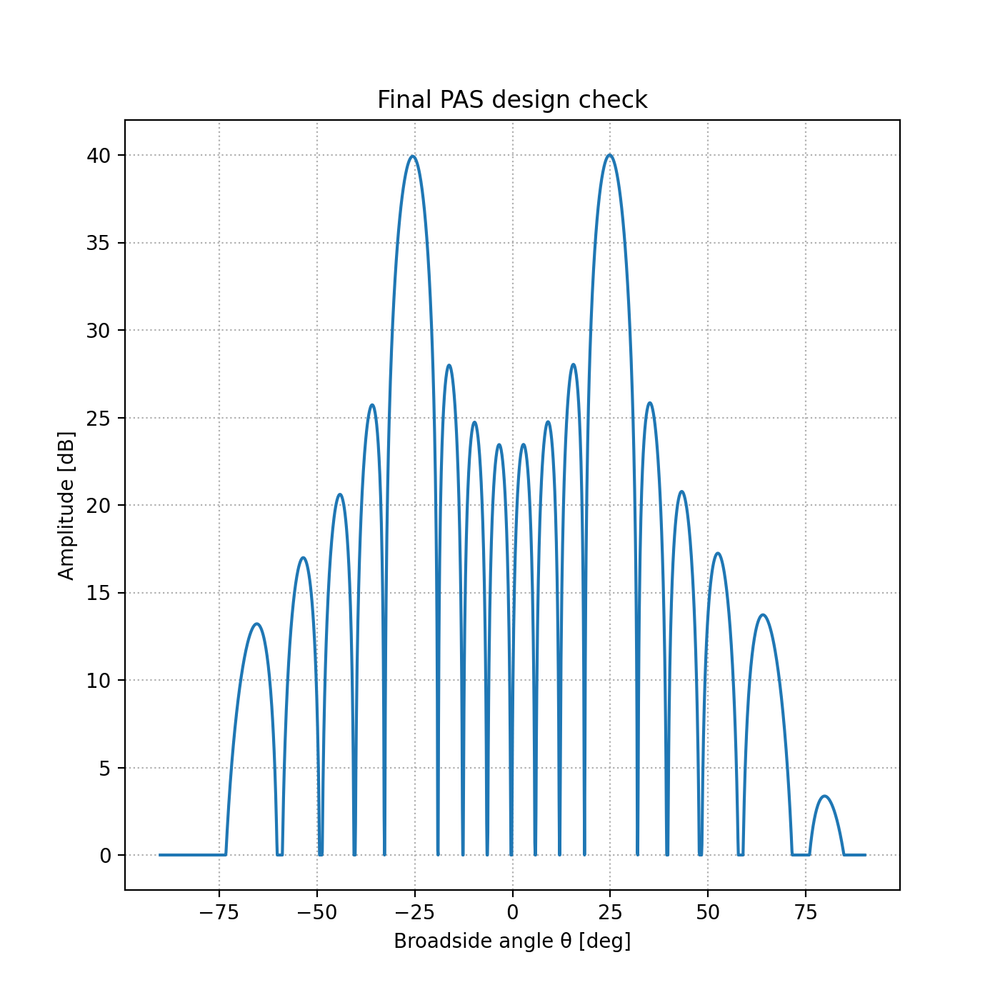

.. _emtools_source_array:

Phased-Array Source Design
==========================

``pycsamt.emtools.source_array`` is the transmitter-design module in
``emtools``. Unlike most pages in this section, it does not load EDI
files or operate on ``Sites`` objects. It implements formulas for a
:term:`phased-array source` (PAS): a line of controlled-source
audio-frequency magnetotelluric dipoles whose relative phases can steer
and narrow the transmitted beam.

The traditional source is a :term:`single-dipole antenna source`,
abbreviated SDAS. The phased-array source combines ``N`` co-linear SDAS
elements with spacing ``d`` and inter-element phase shift ``beta``. The
module helps you answer practical design questions:

* What wavelength should be used at CSAMT frequencies?
* How directional is one finite-length dipole?
* How much does an ``N``-element array narrow the beam?
* Which phase shift steers the beam to the area of interest?
* Are there unwanted :term:`grating lobes <grating lobe>`?
* How much SNR gain is expected from coherent arraying?

Full function signatures and parameter defaults are maintained in the
:doc:`API reference <../../api/emtools>`. The examples below use the
public two-level imports from ``pycsamt.emtools``.

Concepts And Angles
-------------------

The module uses two related angle conventions:

.. list-table::
   :header-rows: 1
   :widths: 30 35 35

   * - Symbol
     - Used by
     - Meaning
   * - ``theta_deg``
     - ``sdas_element_pattern``
     - Angle from the dipole axis. ``0`` and ``180`` degrees are along
       the dipole; ``90`` degrees is broadside.
   * - ``theta_b_deg``
     - ``array_factor``, ``pas_pattern``, ``plot_radiation_pattern``
     - Broadside angle. ``0`` degrees is perpendicular to the array;
       ``-90`` and ``+90`` degrees are end-fire directions.
   * - ``theta_m_deg``
     - ``beam_steer``
     - Desired main-lobe broadside angle.

This distinction matters. The element pattern is written in the dipole
axis convention, while the array factor is written in the broadside
convention. ``pas_pattern`` handles the conversion internally.

Workflow Map
------------

.. list-table::
   :header-rows: 1
   :widths: 24 38 38

   * - Task
     - Use this
     - Output
   * - Compute propagation wavenumber
     - ``wavenumber``
     - Earth or free-space wavenumber ``k`` in ``m^-1``.
   * - Model one finite SDAS dipole
     - ``sdas_element_pattern``
     - Normalized amplitude pattern versus dipole-axis angle.
   * - Model array interference
     - ``array_factor``
     - Normalized :term:`array factor` versus broadside angle.
   * - Combine element and array effects
     - ``pas_pattern``
     - Total PAS amplitude pattern.
   * - Steer the main beam
     - ``beam_steer``
     - Inter-element phase shift ``beta`` in radians.
   * - Check all beam solutions
     - ``steering_angles``
     - Target beam and any grating-lobe angles.
   * - Estimate single-source directivity
     - ``sdas_directivity``
     - Dimensionless :term:`directivity` from numerical integration.
   * - Estimate coherent SNR gain
     - ``snr_gain_db``
     - Gain in decibels, ``20 log10(N)``.
   * - Plot patterns
     - ``plot_radiation_pattern``
     - Polar or Cartesian pattern figure.

Earth Wavenumber
----------------

For CSAMT transmitter design, use the effective earth wavenumber when a
representative half-space resistivity is known:

.. math::

   k_\mathrm{earth} = \sqrt{\frac{\pi f \mu_0}{\rho}}

If ``rho`` is omitted, ``wavenumber`` returns the free-space value
``2*pi*f/c``. That can be useful as a reference, but it is usually the
wrong scale for CSAMT array geometry.

.. code-block:: python
   :linenos:

   import numpy as np
   from pycsamt.emtools import wavenumber
   freq = 8.0      # Hz
   rho = 300.0     # ohm.m
   k_earth = wavenumber(freq, rho=rho)
   k_free = wavenumber(freq)
   wavelength_earth = 2.0 * np.pi / k_earth
   wavelength_free = 2.0 * np.pi / k_free
   print(f"earth wavelength: {wavelength_earth:,.0f} m")
   print(f"free-space wavelength: {wavelength_free:,.0f} m")

.. code-block:: text

   earth wavelength: 19,365 m
   free-space wavelength: 37,474,057 m

Use the earth wavelength to judge whether the chosen element spacing is
small, moderate, or large in wavelengths:

.. code-block:: pycon

   >>> d = 2000.0
   >>> print(f"d / earth wavelength = {d / wavelength_earth:.3f}")
   d / earth wavelength = 0.103

A physical spacing that is small at low frequency can become larger than
one wavelength at a high CSAMT frequency. That is when side lobes and
grating lobes become much more important.

Single-Dipole Element Pattern
-----------------------------

``sdas_element_pattern`` computes the finite-length SDAS element pattern:

.. math::

   F(\theta) =
   \left|
   \frac{\cos(k l \cos\theta / 2) - \cos(k l / 2)}
        {\sin\theta}
   \right|

Here ``theta`` is measured from the dipole axis. Along the dipole axis
the response is a null. Broadside to the dipole the normalized response
is usually the maximum.

.. code-block:: python
   :linenos:

   import matplotlib.pyplot as plt
   import numpy as np

   from pycsamt.emtools import sdas_element_pattern, wavenumber

   freq = 8.0
   rho = 300.0
   length = 1000.0
   k = wavenumber(freq, rho=rho)

   theta = np.linspace(0.0, 180.0, 721)
   element = sdas_element_pattern(theta, l=length, k=k)

   print(element[0], element[360], element[-1])

   fig, ax = plt.subplots(figsize=(7, 4))
   ax.plot(theta, element)
   ax.set_xlabel("Angle from dipole axis (deg)")
   ax.set_ylabel("Normalized amplitude")
   ax.grid(True, alpha=0.3)
   fig.tight_layout()
   fig.savefig("sdas_element_pattern.png", dpi=200)
   plt.close(fig)

.. code-block:: text

   0.0 1.0 0.0

Set ``normalize=False`` when you need the unnormalized formula value,
for example before computing directivity or comparing absolute pattern
shape for different lengths.

Array Factor
------------

``array_factor`` models interference among ``N`` equally spaced
co-linear source elements. The :term:`array factor` is the part of the
radiation pattern caused by geometry and phase shifts alone:

.. math::

   AF_n =
   \frac{\sin(N \psi / 2)}
        {N \sin(\psi / 2)}

.. math::

   \psi = k d \sin(\theta_b) + \beta

The angle ``theta_b`` is measured from broadside. With ``beta=0``, the
main lobe is broadside at ``theta_b = 0``.

.. code-block:: python
   :linenos:

   import numpy as np

   from pycsamt.emtools import array_factor, plot_radiation_pattern, wavenumber

   freq = 8.0
   rho = 300.0
   d = 2000.0
   k = wavenumber(freq, rho=rho)

   theta_b = np.linspace(-90.0, 90.0, 721)
   patterns = [
       array_factor(theta_b, N=1, d=d, k=k),
       array_factor(theta_b, N=2, d=d, k=k),
       array_factor(theta_b, N=4, d=d, k=k),
       array_factor(theta_b, N=8, d=d, k=k),
   ]

   plot_radiation_pattern(
       theta_b,
       patterns,
       labels=["N=1", "N=2", "N=4", "N=8"],
       title="Array factor at 8 Hz",
   )
   plt.gcf().savefig("array_factor_8hz.png", dpi=200)
   plt.close(plt.gcf())

At low frequency, a kilometer-scale array may be much smaller than one
earth wavelength. It can still narrow the beam, but it may not form
sharp nulls. Recompute the pattern at the high end of the frequency
sweep before trusting a design.

High-Frequency Check
--------------------

The same physical layout can behave very differently at higher
frequency.

.. code-block:: python
   :linenos:

   import numpy as np

   from pycsamt.emtools import array_factor, plot_radiation_pattern, wavenumber

   rho = 300.0
   d = 2000.0
   freq = 1024.0
   k = wavenumber(freq, rho=rho)
   wavelength = 2.0 * np.pi / k

   theta_b = np.linspace(-90.0, 90.0, 721)
   patterns = [array_factor(theta_b, N=n, d=d, k=k) for n in (1, 2, 4, 8)]

   print(f"d / wavelength = {d / wavelength:.3f}")

   plot_radiation_pattern(
       theta_b,
       patterns,
       labels=["N=1", "N=2", "N=4", "N=8"],
       polar=False,
       log_scale=True,
       title="Array factor at 1024 Hz",
   )
   plt.gcf().savefig("array_factor_1024hz.png", dpi=200)
   plt.close(plt.gcf())

.. code-block:: text

   d / wavelength = 1.168

When ``d / wavelength`` approaches or exceeds ``1``, :term:`grating
lobes <grating lobe>` are likely. A design that looks clean at low
frequency can radiate strongly in unintended directions at high
frequency.

Beam Steering
-------------

``beam_steer`` computes the inter-element phase shift required to steer
the main lobe:

.. math::

   \beta = -k d \sin(\theta_m)

Use ``steering_angles`` immediately after ``beam_steer``. The array
factor is periodic in :math:`\psi`, so the same main-lobe condition
:math:`\psi = kd\sin\theta_b+\beta = 0` that fixes the target angle is
also satisfied whenever :math:`\psi` is any other multiple of
:math:`2\pi`:

.. math::

   kd\sin\theta_n + \beta = 2\pi n, \qquad n = 0, \pm1, \pm2, \dots,
   \qquad
   \theta_n = \arcsin\!\left(\frac{2\pi n - \beta}{kd}\right),

keeping only the integers :math:`n` for which the argument of
:math:`\arcsin` stays in :math:`[-1, 1]` — a real broadside angle. Every
extra solution besides the intended :math:`\theta_m` is a
:term:`grating lobe`: a second, equally strong main lobe pointed
somewhere you did not design for. ``steering_angles`` reveals whether
the requested beam has any of these additional solutions.

.. code-block:: python
   :linenos:

   import numpy as np
   from pycsamt.emtools import (
       array_factor,
       beam_steer,
       steering_angles,
       wavenumber,
   )
   freq = 1024.0
   rho = 300.0
   d = 2000.0
   N = 4
   target_angle = 20.0
   k = wavenumber(freq, rho=rho)
   beta = beam_steer(target_angle, d=d, k=k)
   theta_b = np.linspace(-90.0, 90.0, 1801)
   af = array_factor(theta_b, N=N, d=d, k=k, beta=beta)
   peak_angle = theta_b[np.argmax(af)]
   all_lobes = steering_angles(N=N, d=d, k=k, beta=beta, n_range=3)
   print(f"beta = {beta:.4f} rad")
   print(f"peak angle = {peak_angle:.2f} deg")
   print(f"all steering-angle solutions = {all_lobes}")

.. code-block:: text

   beta = -2.5110 rad
   peak angle = 20.00 deg
   all steering-angle solutions = [-30.917035  20.      ]

The peak angle should match the target angle on a fine angular grid. If
``steering_angles`` returns multiple values, the design has grating-lobe
directions that deserve explicit review.

Combined PAS Pattern
--------------------

``pas_pattern`` multiplies the single-dipole element pattern by the
array factor. This is the practical radiation pattern for the phased
array.

.. code-block:: python
   :linenos:

   import numpy as np

   from pycsamt.emtools import (
       beam_steer,
       pas_pattern,
       plot_radiation_pattern,
       wavenumber,
   )

   theta_b = np.linspace(-90.0, 90.0, 721)
   freq = 1024.0
   rho = 300.0
   d = 2000.0
   length = 1000.0
   N = 4

   k = wavenumber(freq, rho=rho)
   beta = beam_steer(20.0, d=d, k=k)

   broadside = pas_pattern(theta_b, N=N, d=d, k=k, beta=0.0, l=length)
   steered = pas_pattern(theta_b, N=N, d=d, k=k, beta=beta, l=length)

   plot_radiation_pattern(
       theta_b,
       [broadside, steered],
       labels=["broadside", "steered to 20 deg"],
       title="Combined PAS pattern",
   )
   plt.gcf().savefig("combined_pas_pattern.png", dpi=200)
   plt.close(plt.gcf())

Use ``pas_pattern`` for design figures. Use ``array_factor`` alone when
you want to isolate what the array geometry contributes independently of
the finite dipole element pattern.

Directivity
-----------

``sdas_directivity`` treats the element pattern as a radiation
intensity, :math:`U(\theta) = F(\theta)^2`, and applies the standard
antenna definition of directivity — peak intensity over the intensity
averaged across all directions:

.. math::

   D_0 = \frac{4\pi\,U_{\max}}{P_\mathrm{rad}}, \qquad
   P_\mathrm{rad} = \int_0^{2\pi}\!\!\int_0^{\pi}
   U(\theta)\sin\theta \, d\theta \, d\phi
   = 2\pi \int_0^{\pi} U(\theta)\sin\theta\, d\theta,

evaluated numerically over ``n_theta`` samples in :math:`\theta`. A
perfectly omnidirectional source has :math:`U(\theta)` constant, which
drives :math:`D_0 \to 1`; a larger value means more of the radiated
power is concentrated near the peak direction rather than spread evenly
in :math:`4\pi` steradians.

.. code-block:: python
   :linenos:

   from pycsamt.emtools import sdas_directivity, wavenumber
   freq = 1024.0
   rho = 300.0
   k = wavenumber(freq, rho=rho)
   for length in (500.0, 1000.0, 2000.0, 5000.0):
       directivity = sdas_directivity(length, k=k, n_theta=2000)
       print(f"length={length:7.0f} m  directivity={directivity:.3f}")

.. code-block:: text

   length=    500 m  directivity=1.544
   length=   1000 m  directivity=1.703
   length=   2000 m  directivity=3.039
   length=   5000 m  directivity=2.985

Do not assume that a longer dipole is always better. Once length becomes
a significant fraction of wavelength, directivity can change
non-monotonically with frequency and length.

SNR Gain
--------

``snr_gain_db`` returns the coherent PAS gain relative to one SDAS:

.. math::

   G_\mathrm{dB} = 20 \log_{10}(N)

.. code-block:: python
   :linenos:

   from pycsamt.emtools import snr_gain_db
   for n_elem in (1, 2, 4, 8, 16):
       print(f"N={n_elem:2d}: {snr_gain_db(n_elem):5.2f} dB")

.. code-block:: text

   N= 1:  0.00 dB
   N= 2:  6.02 dB
   N= 4: 12.04 dB
   N= 8: 18.06 dB
   N=16: 24.08 dB

This is the ideal coherent-array gain. It does not guarantee that all
extra energy reaches the intended area. If grating lobes are present, a
large fraction of the gain can be radiated into an unintended direction.

Plotting Patterns
-----------------

``plot_radiation_pattern`` accepts one pattern or a stack/list of
patterns. It can draw polar plots for quick design review or Cartesian
dB plots for side-lobe inspection.

.. code-block:: python
   :linenos:

   import matplotlib.pyplot as plt
   import numpy as np

   from pycsamt.emtools import array_factor, plot_radiation_pattern, wavenumber

   theta_b = np.linspace(-90.0, 90.0, 721)
   k = wavenumber(1024.0, rho=300.0)
   d = 2000.0

   patterns = [array_factor(theta_b, N=n, d=d, k=k) for n in (2, 4, 8)]

   fig, axes = plt.subplots(1, 2, figsize=(12, 4))

   plot_radiation_pattern(
       theta_b,
       patterns,
       labels=["N=2", "N=4", "N=8"],
       polar=False,
       ax=axes[0],
       title="Linear amplitude",
   )

   plot_radiation_pattern(
       theta_b,
       patterns,
       labels=["N=2", "N=4", "N=8"],
       polar=False,
       log_scale=True,
       db_floor=-40.0,
       ax=axes[1],
       title="dB view",
   )
   fig.tight_layout()
   fig.savefig("source_array_pattern_views.png", dpi=200)
   plt.close(fig)

Use the dB view when side lobes matter. A weak-looking side lobe on a
linear-amplitude plot may still be too strong for a field design.

Design Checklist
----------------

For a concrete PAS design, keep the calculation explicit:

.. code-block:: python
   :linenos:

   import numpy as np

   from pycsamt.emtools import (
       beam_steer,
       pas_pattern,
       plot_radiation_pattern,
       snr_gain_db,
       steering_angles,
       wavenumber,
   )

   freq = 1024.0
   rho = 300.0
   N = 8
   d = 2000.0
   length = 1000.0
   target_angle = 25.0
   theta_b = np.linspace(-90.0, 90.0, 1801)

   k = wavenumber(freq, rho=rho)
   wavelength = 2.0 * np.pi / k
   beta = beam_steer(target_angle, d=d, k=k)
   lobes = steering_angles(N=N, d=d, k=k, beta=beta, n_range=4)
   pattern = pas_pattern(theta_b, N=N, d=d, k=k, beta=beta, l=length)

   print(f"earth wavelength = {wavelength:.1f} m")
   print(f"d / wavelength = {d / wavelength:.3f}")
   print(f"beta = {beta:.4f} rad")
   print(f"steering-angle solutions = {lobes}")
   print(f"ideal coherent SNR gain = {snr_gain_db(N):.2f} dB")

   plot_radiation_pattern(
       theta_b,
       pattern,
       polar=False,
       log_scale=True,
       title="Final PAS design check",
   )
   plt.gcf().savefig("final_pas_design_check.png", dpi=200)
   plt.close(plt.gcf())

.. code-block:: text

   earth wavelength = 1711.6 m
   d / wavelength = 1.168
   beta = -3.1028 rad
   steering-angle solutions = [-25.6707  25.    ]
   ideal coherent SNR gain = 18.06 dB

Review the output in this order:

* ``d / wavelength`` tells you whether grating lobes are physically
  plausible.
* ``steering_angles`` tells you where all main-lobe solutions are.
* The radiation pattern shows main-lobe width and side-lobe strength.
* ``snr_gain_db`` tells you the ideal coherent gain from element count.

Common Pitfalls
---------------

Do not design from free-space wavelength at CSAMT frequencies. Use
``wavenumber(freq, rho=...)`` when a representative resistivity is
available.

Do not check only one frequency. A layout with modest spacing at low
frequency can have ``d / wavelength > 1`` at the high end of the sweep.

Do not treat SNR gain as directional selectivity. ``snr_gain_db(8)`` is
about ``18`` dB, but grating lobes can send much of that coherent energy
away from the intended target.

Do not mix the angle conventions. ``sdas_element_pattern`` uses angle
from the dipole axis; ``array_factor`` and ``pas_pattern`` use broadside
angle.

Worked Example
--------------

The example walks through the single-dipole pattern, earth versus
free-space wavenumber, low- and high-frequency array factors, beam
steering, grating-lobe detection, combined PAS patterns, directivity,
SNR gain, and one concrete 8-element design.

Open the rendered gallery page here:
:ref:`sphx_glr_examples_emtools_plot_source_array.py`.
