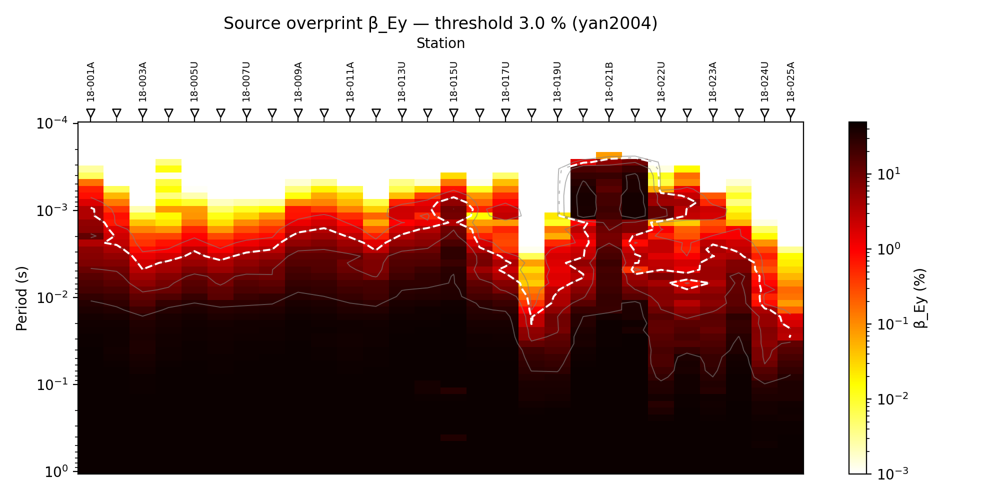
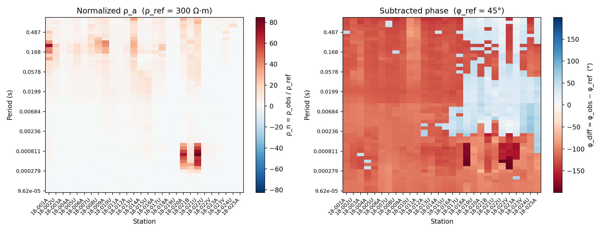

.. _emtools_source_effects:

Source Effects And Near-Field Correction
========================================

``pycsamt.emtools.source_effects`` helps diagnose when the artificial
CSAMT transmitter is influencing the measured response. Natural-source
MT interpretation assumes a plane-wave source. CSAMT does not have that
luxury: the transmitter has a finite offset from each receiver, and the
offset can control whether a station-frequency row behaves like
:term:`near field`, :term:`transition field`, or :term:`far field`.

The module contains two related but independent families of tools:

* Yan and Fu / Da et al. :term:`source overprint` diagnostics, based on the
  ground-wave to surface-wave amplitude ratio :math:`\beta_{Ey}`.
* Wang and Lin normalized-response and near-field correction tools,
  based on skin-depth field zones and an equatorial horizontal electric
  dipole correction factor.

Full function signatures and parameter defaults are maintained in the
:doc:`API reference <../../api/emtools>`. This guide uses the public
two-level imports from ``pycsamt.emtools``.

Why Offset Matters
------------------

Every source-effect calculation needs a source-receiver offset ``r``.
Standard EDI files usually do not store the CSAMT transmitter geometry,
so you must provide the offset explicitly unless your station objects
already carry an attribute such as ``source_offset``, ``offset``, or
``dist``.

The offset can be supplied as a scalar or as a station dictionary:

.. code-block:: python
   :linenos:

   source_offset = 2000.0

   source_offset_by_station = {
       "18-001A": 1800.0,
       "18-002A": 1950.0,
       "18-003A": 2100.0,
   }

Use a scalar only when the same representative offset is justified for
all stations. For field processing, prefer a station dictionary derived
from transmitter and receiver coordinates.

Workflow Map
------------

.. list-table::
   :header-rows: 1
   :widths: 28 36 36

   * - Goal
     - Use this
     - Output
   * - Evaluate pure overprint beta
     - ``overprint_beta``
     - :math:`\beta_{Ey}` in percent for arrays or scalars.
   * - Build per-frequency overprint table
     - ``detect_source_overprint``
     - Long-form table with ``beta_pct``, ``kr``, and flags.
   * - Summarize overprint by station
     - ``source_overprint_table``
     - Station table with max/mean beta, fraction flagged, and slopes.
   * - Plot beta pseudo-section
     - ``plot_overprint_section``
     - Station-period map of :math:`\beta_{Ey}`.
   * - Normalize response
     - ``normalize_response``
     - Apparent-resistivity ratio, phase residual, field zone, and ``kr``.
   * - Correct near-field response
     - ``correct_near_field``
     - ``Sites`` object with impedance divided by the near-field factor.
   * - Plot normalized response
     - ``plot_normalized_response``
     - Two-panel pseudo-section of normalized resistivity and phase.

Loading A Survey
----------------

Load the survey once with ``ensure_sites``. Keep the raw object unchanged
while you inspect source effects and test correction settings.

.. code-block:: python
   :linenos:

   from pycsamt.emtools import ensure_sites

   sites = ensure_sites("data/AMT/WILLY_DATA/L18PLT", recursive=True)
   source_offset = 2000.0

The examples below use ``2000.0`` meters only as a concrete processing
example. In a real CSAMT project, replace it with measured geometry.

Overprint Beta
--------------

``overprint_beta`` is the pure mathematical interface. It does not need
EDI files. It evaluates the Yan and Fu ground-wave to surface-wave ratio
and returns :math:`\beta_{Ey}` in percent. In this workflow,
:term:`source overprint` means the finite transmitter contribution is
large enough to bias a plane-wave interpretation.

The measured field at the receiver is the sum of a ground wave that
travels directly through the earth from the source and a surface wave
guided along the air-earth interface; a plane-wave (natural-source MT)
interpretation is only valid once the ground wave dominates. Yan & Fu
(2004, eq. 6) quantify that balance as the ratio of how sharply each
term varies near the receiver:

.. math::

   \beta_{Ey} =
   \left|\frac{\partial^2 P}{\partial z^2}\right|
   \Big/
   \left|\frac{\partial^3 N}{\partial x^2\,\partial z}\right|,
   \qquad
   P = \frac{e^{-k_1 r_3}}{r_3}, \qquad
   N = I_0(p)\,K_0(q),

where :math:`P` is the Sommerfeld ground-wave term, :math:`r_3` is the
3-D distance from the dipole source to the evaluation point, :math:`N`
is the Foster surface-wave term built from modified Bessel functions
:math:`I_0` and :math:`K_0`, and :math:`k_1 = \sqrt{i\omega\mu_0/\rho}`
is the complex earth wavenumber. ``overprint_beta`` evaluates the
required partial derivatives by central finite differences rather than
a closed-form expression, which is why it needs a half-space
resistivity, not just an offset — the same offset can sit deep in the
near field over resistive ground and comfortably in the far field over
conductive ground.

.. code-block:: python
   :linenos:

   import numpy as np
   from pycsamt.emtools import BETA_THRESH_PCT, overprint_beta
   freq = np.logspace(-1, 3, 60)
   rho = 300.0
   for offset in (500.0, 2000.0, 8000.0):
       beta_pct = overprint_beta(rho=rho, freq=freq, offset=offset)
       contaminated = freq[beta_pct > BETA_THRESH_PCT]
       if contaminated.size:
           print(
               f"offset={offset:g} m: beta>{BETA_THRESH_PCT:g}% "
               f"up to {contaminated.max():.3g} Hz"
           )

.. code-block:: text

   offset=500 m: beta>3% up to 1e+03 Hz
   offset=2000 m: beta>3% up to 392 Hz
   offset=8000 m: beta>3% up to 27.6 Hz

``BETA_THRESH_PCT`` is ``3.0``. Values above that threshold indicate
potential source overprint under the Yan and Fu criterion. The threshold
is useful, but the exact result depends strongly on ``rho``, frequency,
and offset.

Per-Frequency Overprint Detection
---------------------------------

``detect_source_overprint`` applies ``overprint_beta`` to every
station-frequency row using apparent resistivity computed from the
observed impedance tensor. Alongside ``beta_pct``, it reports ``kr``,
a dimensionless field-zone parameter that recurs throughout this page:

.. math::

   kr = |k_1|\, r = \frac{r}{\delta_\mathrm{Bostick}}, \qquad
   |k_1| = \sqrt{\frac{\omega\mu_0}{\rho_a}},

the source-receiver offset measured in Bostick skin depths at that
frequency. Small ``kr`` means the offset is well inside one skin depth
— the near field, where ``beta_pct`` is expected to be large — while
large ``kr`` means the offset is many skin depths away, deep in the far
field where ``beta_pct`` should be small. The output below shows
exactly that pattern: ``kr`` starts around ``65`` at the highest
frequency and ``beta_pct`` is vanishingly small.

.. code-block:: python
   :linenos:

   from pycsamt.emtools import detect_source_overprint, ensure_sites
   sites = ensure_sites("data/AMT/WILLY_DATA/L18PLT", recursive=True)
   detail = detect_source_overprint(
       sites,
       source_offset=2000.0,
       beta_threshold=3.0,
   )
   print(detail.head())
   print(detail["beta_pct"].describe())
   print(detail["overprint_flag"].value_counts())

.. code-block:: text

      station  freq_hz  period_s  ...         kr      beta_pct  overprint_flag
   0  18-001A  10400.0  0.000096  ...  65.313194  2.893811e-17           False
   1  18-001A   8707.0  0.000115  ...  57.126799  8.278746e-15           False
   2  18-001A   7289.0  0.000137  ...  50.931906  5.904384e-13           False
   3  18-001A   6102.0  0.000164  ...  40.883790  5.793214e-10           False
   4  18-001A   5108.0  0.000196  ...  32.557630  1.670487e-07           False
   [5 rows x 8 columns]
   count    1.484000e+03
   mean     2.321404e+01
   std      2.174905e+01
   min      1.008563e-38
   25%      7.988633e-02
   50%      1.701784e+01
   75%      4.876054e+01
   max      4.999804e+01
   Name: beta_pct, dtype: float64
   overprint_flag
   True     944
   False    540
   Name: count, dtype: int64

The returned table has one row per station and frequency:

.. code-block:: text

   station, freq_hz, period_s, offset_m, rho_a_ohmm,
   kr, beta_pct, overprint_flag

Rows with unknown offset keep the station and frequency information, but
``kr`` and ``beta_pct`` are ``NaN``. That is intentional: source-effect
diagnostics cannot be inferred honestly without geometry.

Station-Level Summary
---------------------

``source_overprint_table`` summarizes the long-form table by station. It
adds maximum and mean :math:`\beta`, the number and fraction of flagged
rows, and a low-/high-frequency slope comparison inspired by Da et al.
(2016). ``f_split`` splits each station's rows into a low-frequency and
a high-frequency group, and each group gets its own ordinary
least-squares slope of log-apparent-resistivity against log-frequency:

.. math::

   \mathrm{lf\_slope} = \frac{d\log_{10}\rho_a}{d\log_{10}f}
   \bigg|_{f < f_\mathrm{split}}, \qquad
   \mathrm{hf\_slope} = \frac{d\log_{10}\rho_a}{d\log_{10}f}
   \bigg|_{f \ge f_\mathrm{split}}, \qquad
   \mathrm{slope\_delta} = \mathrm{lf\_slope} - \mathrm{hf\_slope}.

A source sitting over a resistive body radiates differently than one
over a conductor, and that difference shows up as a change in slope
between the two bands rather than as a single anomalous value — a
strongly negative ``slope_delta`` (low-frequency slope much shallower
than high-frequency slope) is the Da et al. signature of a resistivity
contrast beneath the source dipole itself, distinct from a genuine
subsurface target under the receiver.

.. code-block:: python
   :linenos:

   from pycsamt.emtools import ensure_sites, source_overprint_table
   sites = ensure_sites("data/AMT/WILLY_DATA/L18PLT", recursive=True)
   summary = source_overprint_table(
       sites,
       source_offset=2000.0,
       beta_threshold=3.0,
       f_split=50.0,
   )
   cols = [
       "station",
       "beta_max_pct",
       "beta_mean_pct",
       "n_overprint",
       "overprint_frac",
       "lf_slope",
       "hf_slope",
       "slope_delta",
       "overprint_flag",
   ]
   print(summary[cols].sort_values("overprint_frac", ascending=False).head())

.. code-block:: text

       station  beta_max_pct  beta_mean_pct  ...  hf_slope  slope_delta  overprint_flag
   20  18-021B     49.992100      29.888614  ...  0.071821    -0.115000            True
   21  18-021U     49.996806      30.257094  ...  0.268957    -0.598151            True
   14  18-015U     49.902471      29.096502  ... -0.443341     1.169621            True
   0   18-001A     49.994860      26.105160  ... -0.319272     0.165193            True
   19  18-020A     49.997356      27.507910  ...  0.334994    -1.132669            True
   [5 rows x 9 columns]

``f_split`` separates low- and high-frequency bands for slope analysis.
Choose it from the actual survey frequency range. If the split falls
outside the sampled range, one of the slope columns will be ``NaN``.

Overprint Pseudo-Section
------------------------

``plot_overprint_section`` maps :math:`\beta_{Ey}` across station and
period. It can contour key beta levels, including the 3 percent
threshold.

.. code-block:: python
   :linenos:

   import matplotlib.pyplot as plt

   from pycsamt.emtools import ensure_sites, plot_overprint_section

   sites = ensure_sites("data/AMT/WILLY_DATA/L18PLT", recursive=True)

   fig, ax = plt.subplots(figsize=(10, 5))
   plot_overprint_section(
       sites,
       source_offset=2000.0,
       beta_threshold=3.0,
       beta_levels=(1.0, 3.0, 10.0, 30.0),
       period_axis=True,
       log_y=True,
       ax=ax,
   )
   fig.tight_layout()
   fig.savefig("source_overprint_section_l18plt.png", dpi=200)
   plt.close(fig)

Use this plot to see whether source contamination is localized to
specific stations, periods, or broad regions of the line. If most of the
plot sits above the threshold, the assumed offset may place much of the
survey outside a clean far-field regime.

Normalized Response
-------------------

``normalize_response`` implements the Wang and Lin view of source
effects. It computes:

.. math::

   \rho_n = \rho_\mathrm{obs} / \rho_\mathrm{ref}

.. math::

   \phi_\mathrm{diff} = \phi_\mathrm{obs} - \phi_\mathrm{ref}

It also classifies each row using the :term:`skin depth` relation
:math:`\delta = 503\sqrt{\rho_a/f}` and the source offset:

* ``near`` when ``r / delta < 0.5`` (:term:`near field`);
* ``transition`` when ``0.5 <= r / delta < 4`` (:term:`transition field`);
* ``far`` when ``r / delta >= 4`` (:term:`far field`).

.. code-block:: python
   :linenos:

   from pycsamt.emtools import ensure_sites, normalize_response
   sites = ensure_sites("data/AMT/WILLY_DATA/L18PLT", recursive=True)
   norm = normalize_response(
       sites,
       rho_ref=300.0,
       source_offset=2000.0,
       comp="det",
       phi_ref_deg=45.0,
   )
   print(norm.head())
   print(norm["zone"].value_counts(dropna=False))
   print(norm[["station", "freq_hz", "rho_n", "phi_diff_deg", "zone", "kr"]].head())

.. code-block:: text

      station  freq_hz  period_s  ...  phi_diff_deg  zone         kr
   0  18-001A  10400.0  0.000096  ...   -104.871322   far  46.210224
   1  18-001A   8707.0  0.000115  ...   -105.705417   far  40.418207
   2  18-001A   7289.0  0.000137  ...   -106.709024   far  36.035211
   3  18-001A   6102.0  0.000164  ...   -107.090701   far  28.925994
   4  18-001A   5108.0  0.000196  ...   -112.671464   far  23.035091
   [5 rows x 11 columns]
   zone
   far           603
   transition    468
   near          413
   Name: count, dtype: int64
      station  freq_hz     rho_n  phi_diff_deg zone         kr
   0  18-001A  10400.0  0.256661   -104.871322  far  46.210224
   1  18-001A   8707.0  0.280878   -105.705417  far  40.418207
   2  18-001A   7289.0  0.295813   -106.709024  far  36.035211
   3  18-001A   6102.0  0.384325   -107.090701  far  28.925994
   4  18-001A   5108.0  0.507310   -112.671464  far  23.035091

Use ``comp="det"`` for a determinant-style response, or ``"xy"`` /
``"yx"`` when a specific off-diagonal component is the interpretation
target.

Normalized-Response Plot
------------------------

``plot_normalized_response`` draws the normalized resistivity and
subtracted phase as two side-by-side pseudo-sections.

.. code-block:: python
   :linenos:

   import matplotlib.pyplot as plt

   from pycsamt.emtools import ensure_sites, plot_normalized_response

   sites = ensure_sites("data/AMT/WILLY_DATA/L18PLT", recursive=True)

   fig, axes = plt.subplots(1, 2, figsize=(13, 5))
   plot_normalized_response(
       sites,
       rho_ref=300.0,
       source_offset=2000.0,
       comp="det",
       phi_ref_deg=45.0,
       axes=axes,
   )
   fig.tight_layout()
   fig.savefig("source_normalized_response_l18plt.png", dpi=200)
   plt.close(fig)

The left panel answers whether apparent resistivity is high or low
relative to the reference half-space. The right panel answers whether
phase is above or below the reference phase. Read both panels alongside
the field-zone column from ``normalize_response``.

Near-Field Correction
---------------------

``correct_near_field`` divides each :term:`impedance tensor` row by a complex
near-field factor:

.. math::

   Z_\mathrm{corrected} = Z_\mathrm{observed} / F(p)

.. math::

   F(p) = 1 - 3/p^2 + 3/p^3, \qquad
   p = k_1 r = kr\,\frac{1+i}{\sqrt2},

the equatorial horizontal-electric-dipole transfer-function ratio,
where :math:`k_1` is the same complex earth wavenumber used above and
:math:`p` is simply that wavenumber times the offset — a complex
version of the ``kr`` field-zone parameter, with :math:`|p| = kr`. The
factor tends toward ``1`` in the far field, where :math:`p` is large
and the correction term vanishes. In the near field, where :math:`p` is
small, dividing by :math:`3/p^3` can make ``F`` very large, so the
correction can strongly change apparent resistivity.

.. code-block:: python
   :linenos:

   from pycsamt.emtools import correct_near_field, ensure_sites

   sites = ensure_sites("data/AMT/WILLY_DATA/L18PLT", recursive=True)

   corrected = correct_near_field(
       sites,
       source_offset=2000.0,
       inplace=False,
   )

Use ``inplace=False`` while testing. If a correction changes a station by
orders of magnitude, treat that as a diagnostic result, not just a
processed output. It means the raw response was far from the plane-wave
assumption under the supplied offset.

Comparing Before And After
--------------------------

You can compare source-effect diagnostics before and after correction
without reaching into private helpers. For example, compare normalized
response tables:

.. code-block:: python
   :linenos:

   from pycsamt.emtools import (
       correct_near_field,
       ensure_sites,
       normalize_response,
   )
   raw = ensure_sites("data/AMT/WILLY_DATA/L18PLT", recursive=True)
   corrected = correct_near_field(raw, source_offset=2000.0, inplace=False)
   before = normalize_response(raw, rho_ref=300.0, source_offset=2000.0)
   after = normalize_response(corrected, rho_ref=300.0, source_offset=2000.0)
   joined = before.merge(
       after,
       on=["station", "freq_hz"],
       suffixes=("_raw", "_corrected"),
   )
   joined["rho_n_ratio"] = joined["rho_n_corrected"] / joined["rho_n_raw"]
   print(
       joined[
           ["station", "freq_hz", "zone_raw", "rho_n_raw", "rho_n_corrected", "rho_n_ratio"]
       ].head()
   )

.. code-block:: text

      station  freq_hz zone_raw  rho_n_raw  rho_n_corrected  rho_n_ratio
   0  18-001A  10400.0      far   0.256661         0.256665     1.000015
   1  18-001A   8707.0      far   0.280878         0.280884     1.000022
   2  18-001A   7289.0      far   0.295813         0.295822     1.000031
   3  18-001A   6102.0      far   0.384325         0.384347     1.000059
   4  18-001A   5108.0      far   0.507310         0.507369     1.000115

This style keeps the comparison in public tables and is easier to
document than extracting impedance arrays directly.

Combining The Two Diagnostics
-----------------------------

The Yan/Fu beta flag and Wang/Lin field-zone label come from different
physical arguments. Agreement between them is a strong warning that
source geometry is controlling part of the response.

.. code-block:: python
   :linenos:

   from pycsamt.emtools import (
       detect_source_overprint,
       ensure_sites,
       normalize_response,
   )
   sites = ensure_sites("data/AMT/WILLY_DATA/L18PLT", recursive=True)
   beta = detect_source_overprint(sites, source_offset=2000.0)
   zones = normalize_response(sites, rho_ref=300.0, source_offset=2000.0)
   merged = beta.merge(
       zones[["station", "freq_hz", "zone", "kr"]],
       on=["station", "freq_hz"],
       how="left",
   )
   print(merged.groupby("zone")["overprint_flag"].mean())
   print(merged.groupby("zone")["beta_pct"].describe())

.. code-block:: text

   zone
   far           0.104478
   near          1.000000
   transition    1.000000
   Name: overprint_flag, dtype: float64
               count       mean        std  ...        50%        75%        max
   zone                                     ...
   far         603.0   0.763099   1.397676  ...   0.003908   0.796716   5.785135
   near        413.0  49.569662   0.497681  ...  49.797164  49.934040  49.998036
   transition  468.0  28.882940  14.214307  ...  30.364481  43.199542  47.934809
   [3 rows x 8 columns]

If ``near`` and ``transition`` rows are usually overprint-flagged while
``far`` rows are mostly unflagged, the two methods are telling a
consistent story. If they disagree, inspect the assumed offset,
reference resistivity, and frequency range.

Choosing Offsets
----------------

For real processing, offsets should come from survey geometry. A useful
pattern is to build a station dictionary and pass it to every function:

.. code-block:: python
   :linenos:

   from pycsamt.emtools import (
       detect_source_overprint,
       normalize_response,
       source_overprint_table,
   )

   offset_by_station = {
       "18-001A": 1800.0,
       "18-002A": 1900.0,
       "18-003A": 2050.0,
       # Continue for the full line.
   }

   detail = detect_source_overprint(sites, source_offset=offset_by_station)
   summary = source_overprint_table(sites, source_offset=offset_by_station)
   norm = normalize_response(sites, source_offset=offset_by_station)

Keep the same offset dictionary across all source-effect diagnostics so
the beta table, normalized-response table, field zones, and correction
are comparable.

Suggested Review Sequence
-------------------------

Use this sequence before applying a correction:

.. code-block:: python
   :linenos:

   from pycsamt.emtools import (
       detect_source_overprint,
       normalize_response,
       source_overprint_table,
   )
   detail = detect_source_overprint(sites, source_offset=2000.0)
   summary = source_overprint_table(sites, source_offset=2000.0, f_split=50.0)
   norm = normalize_response(sites, rho_ref=300.0, source_offset=2000.0)
   print(detail["overprint_flag"].mean())
   print(summary.sort_values("overprint_frac", ascending=False).head())
   print(norm["zone"].value_counts(dropna=False))

.. code-block:: text

   0.6361185983827493
       station  n_freq  offset_m  ...  hf_slope  slope_delta  overprint_flag
   20  18-021B      53    2000.0  ...  0.071821    -0.115000            True
   21  18-021U      53    2000.0  ...  0.268957    -0.598151            True
   14  18-015U      53    2000.0  ... -0.443341     1.169621            True
   0   18-001A      53    2000.0  ... -0.319272     0.165193            True
   19  18-020A      53    2000.0  ...  0.334994    -1.132669            True
   [5 rows x 11 columns]
   zone
   far           603
   transition    468
   near          413
   Name: count, dtype: int64

Then plot:

.. code-block:: python
   :linenos:

   import matplotlib.pyplot as plt

   from pycsamt.emtools import plot_normalized_response, plot_overprint_section

   fig, ax = plt.subplots(figsize=(10, 5))
   plot_overprint_section(sites, source_offset=2000.0, ax=ax)
   fig.tight_layout()
   fig.savefig("source_review_overprint_section_l18plt.png", dpi=200)
   plt.close(fig)

   fig, axes = plt.subplots(1, 2, figsize=(13, 5))
   plot_normalized_response(
       sites,
       rho_ref=300.0,
       source_offset=2000.0,
       axes=axes,
   )
   fig.tight_layout()
   fig.savefig("source_review_normalized_response_l18plt.png", dpi=200)
   plt.close(fig)

.. grid:: 2
   :gutter: 2

   .. grid-item::

      .. image:: ../../images/user_guide/emtools/user-guide-emtools-source-effects-14-01.png
         :width: 100%

   .. grid-item::

      .. image:: ../../images/user_guide/emtools/user-guide-emtools-source-effects-14-02.png
         :width: 100%

Correct only after the diagnostics show that correction is scientifically
justified and after the offset geometry has been checked.

Pitfalls
--------

Do not invent the source offset from the impedance. The offset is survey
geometry and should come from field records or transmitter/receiver
coordinates.

Do not interpret a representative scalar offset as a final result for a
line with varying transmitter distance. A scalar is fine for examples or
sensitivity tests; station-specific offsets are better for processing.

Do not treat near-field correction as harmless smoothing. It changes the
impedance tensor and can alter apparent resistivity by large factors in
near-field rows.

Do not use the Da et al. slope columns without checking ``f_split``. A
split outside the sampled frequency range produces undefined low- or
high-frequency slopes.

Worked Example
--------------

The example uses the L18PLT survey with an explicitly stated
representative offset. It demonstrates the pure beta formula, per-row
overprint detection, station summaries, overprint pseudo-sections,
normalized response, near-field correction, and comparison between the
two independent source-effect diagnostics.

Open the rendered gallery page here:
:ref:`sphx_glr_examples_emtools_plot_source_effects.py`.
