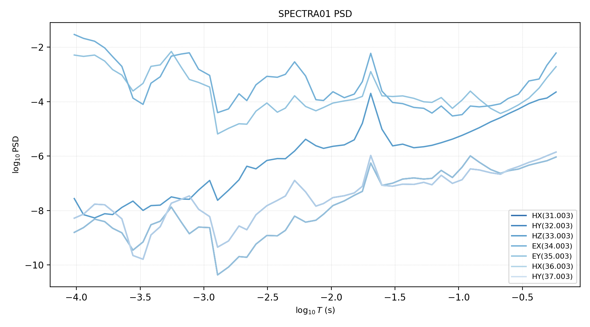
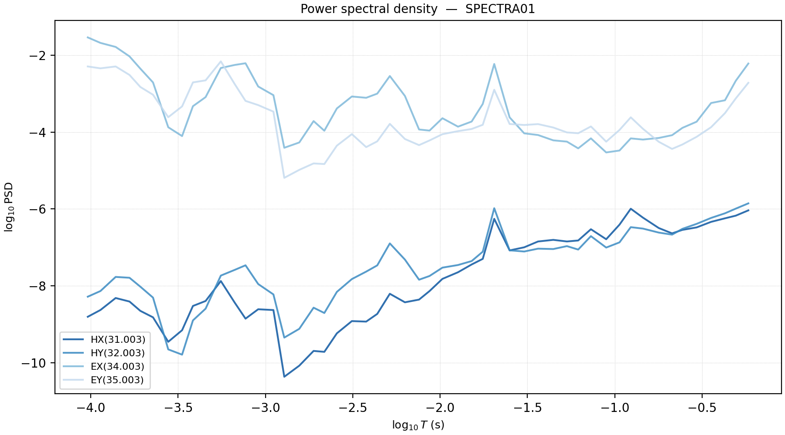
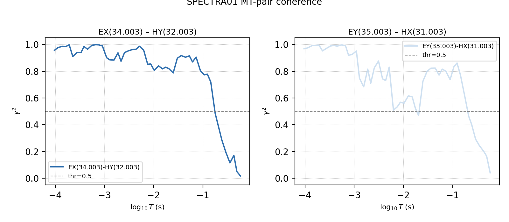
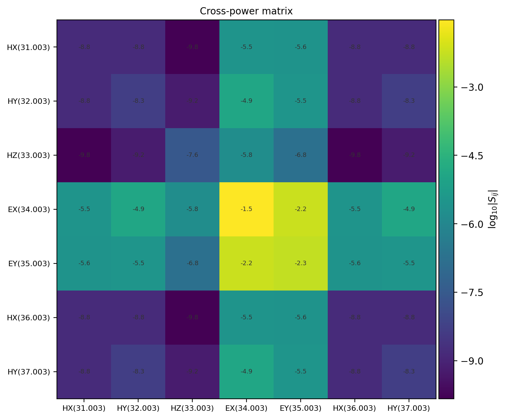
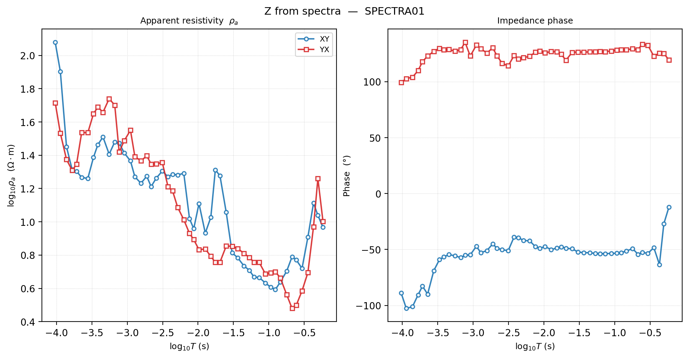
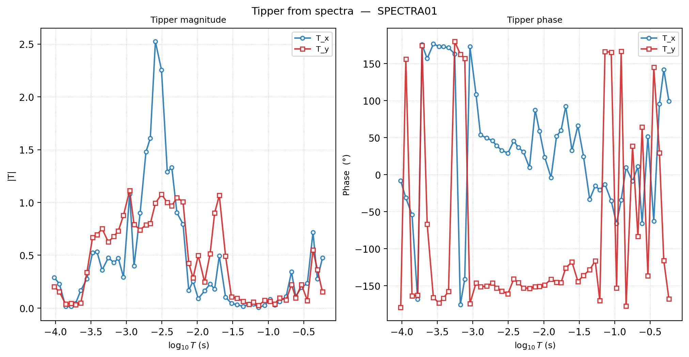

.. _emtools_spectra:

Cross-Spectra Analysis
======================

``pycsamt.emtools.spectra`` works below the processed impedance tensor.
Most ``emtools`` workflows start from an EDI ``Z`` tensor. This module
starts from the raw cross-power spectral matrix stored in a
``pycsamt.seg.spectra.Spectra`` object: one complex Hermitian
``(n_channel, n_channel)`` matrix for each frequency in an EDI
``>=SPECTRASECT`` block.

Use this module when you need to inspect spectra before they become
impedance and tipper estimates:

* channel power spectral density (PSD);
* inter-channel squared coherence;
* coherence-derived SNR;
* frequency-band selection from coherence;
* the full cross-power matrix at one frequency;
* impedance and tipper recovered from spectra;
* PSD and coherence pseudo-sections across multiple spectra stations.

Full function signatures and parameter defaults are maintained in the
:doc:`API reference <../../api/emtools>`. The analysis and plotting
functions are exported through the public ``pycsamt.emtools`` namespace.
The ``Spectra`` container itself lives in ``pycsamt.seg.spectra``.

When To Use This Page
---------------------

Use ``spectra`` tools only when your EDI file contains a
``>=SPECTRASECT`` block. Many EDI files contain only final impedance and
tipper estimates. Those files are valid for most pyCSAMT workflows, but
they do not contain the raw cross-power matrices required here.

The bundled spectra examples are under ``data/MT/SPECTRA/``:

.. code-block:: text

   data/MT/SPECTRA/spectra01.edi
   data/MT/SPECTRA/spectra02.edi

They are de-identified field spectra files. Their identifying metadata
was sanitized, while the numeric spectra blocks were kept for
documentation and examples.

Workflow Map
------------

.. list-table::
   :header-rows: 1
   :widths: 26 36 38

   * - Task
     - Use this
     - Output
   * - Compute coherence cube
     - ``coherence_matrix``
     - Array with shape ``(n_freq, n_chan, n_chan)``.
   * - Build PSD table
     - ``psd_table``
     - Tidy table with station, frequency, channel, and PSD.
   * - Build coherence table
     - ``coherence_table``
     - Tidy table with channel pairs and squared coherence.
   * - Estimate SNR from coherence
     - ``snr_table``
     - Coherence table plus ``snr`` and ``snr_db``.
   * - Restrict frequency band
     - ``band_select``
     - New ``Spectra`` object sliced to ``[f_min, f_max]``.
   * - Create coherence mask
     - ``mask_low_coherence``
     - Boolean mask of frequencies that pass coherence criteria.
   * - Summarize spectra
     - ``spectra_summary``
     - Per-frequency table with PSD and mean coherence.
   * - Plot single-station spectra
     - ``plot_psd``, ``plot_coherence``, ``plot_spectra_matrix``
     - PSD curves, pairwise coherence, and matrix image.
   * - Recover transfer functions
     - ``plot_z_from_spectra``, ``plot_tipper_from_spectra``
     - Apparent resistivity/phase and induction tipper from spectra.
   * - Plot station sections
     - ``plot_psd_section``, ``plot_coherence_section``
     - Station-period pseudo-sections from multiple spectra objects.

Loading Spectra
---------------

Load spectra with ``Spectra.from_file``. This is the one required
three-level import on this page because ``Spectra`` is a segmentation
container, not an ``emtools`` function.

.. code-block:: python
   :linenos:

   from pathlib import Path

   from pycsamt.seg.spectra import Spectra

   spectra_dir = Path("data/MT/SPECTRA")
   sp1 = Spectra.from_file(spectra_dir / "spectra01.edi")
   sp2 = Spectra.from_file(spectra_dir / "spectra02.edi")

   print(sp1.name, sp1.n_freq, sp1.n_chan)
   print(sp1.freq.min(), sp1.freq.max())
   print(sp1.id_to_chtype)

.. code-block:: text

   SPECTRA01 51 7
   1.72 10400.0
   {'31.003': 'HX', '32.003': 'HY', '33.003': 'HZ', '34.003': 'EX', '35.003': 'EY', '36.003': 'HX', '37.003': 'HY'}

A ``Spectra`` object exposes the core arrays used by this module:

.. code-block:: python
   :linenos:

   print(sp1.freq.shape)       # frequency vector
   print(sp1.S.shape)          # cross-power matrix: (n_freq, n_chan, n_chan)
   print(sp1.bw.shape)         # bandwidth metadata
   print(sp1.avgt.shape)       # averaging-time metadata
   print(sp1.chan_ids)         # channel identifiers

.. code-block:: text

   (51,)
   (51, 7, 7)
   (51,)
   (51,)
   ['31.003', '32.003', '33.003', '34.003', '35.003', '36.003', '37.003']

The matrix ``sp1.S[k]`` is the full channel-by-channel cross-power
matrix at one frequency.

Coherence Matrix
----------------

``coherence_matrix`` computes squared coherence for every channel pair:

.. math::

   \gamma^2_{ij}
   =
   \frac{|S_{ij}|^2}{S_{ii} S_{jj}}

The result is real-valued and bounded between 0 and 1.

.. code-block:: python
   :linenos:

   import numpy as np

   from pycsamt.emtools import coherence_matrix

   coh = coherence_matrix(sp1)

   print(coh.shape)
   print(np.nanmin(coh), np.nanmax(coh))
   print(np.diagonal(coh, axis1=1, axis2=2)[0])

.. code-block:: text

   (51, 7, 7)
   3.26311824218168e-06 1.0
   [1. 1. 1. 1. 1. 1. 1.]

The diagonal is 1 because each channel is perfectly coherent with
itself. The off-diagonal values are the useful ones for judging whether
two channels carry a stable relationship at a given frequency.

PSD Table
---------

``psd_table`` extracts the diagonal of the cross-power matrix as a tidy
table. It accepts one ``Spectra`` object, a list of spectra, or a
dictionary of station names to spectra.

.. code-block:: python
   :linenos:

   from pycsamt.emtools import psd_table

   psd = psd_table(sp1)
   print(psd.head())

   psd_norm = psd_table({"spectra01": sp1, "spectra02": sp2}, normalize=True)
   print(psd_norm.groupby(["station", "channel"])["psd"].max().head())

.. code-block:: text

      station     freq    period     channel           psd
   0  SPECTRA01  10400.0  0.000096  HX(31.003)  1.561000e-09
   1  SPECTRA01   8800.0  0.000114  HX(31.003)  2.342000e-09
   2  SPECTRA01   7200.0  0.000139  HX(31.003)  4.808000e-09
   3  SPECTRA01   6000.0  0.000167  HX(31.003)  3.892000e-09
   4  SPECTRA01   5200.0  0.000192  HX(31.003)  2.224000e-09
   station    channel
   spectra01  EX(34.003)    1.0
              EY(35.003)    1.0
              HX(31.003)    1.0
              HX(36.003)    1.0
              HY(32.003)    1.0
   Name: psd, dtype: float64

Expected columns:

.. code-block:: text

   station, freq, period, channel, psd

Set ``normalize=True`` when you want to compare channel shapes rather
than absolute units. Electric and magnetic channels often have very
different physical units and raw PSD magnitudes.

Coherence Table
---------------

``coherence_table`` converts the coherence cube into a tidy table. By
default it includes all upper-triangle channel pairs. Pass ``pairs`` to
focus on physically meaningful pairs.

.. code-block:: python
   :linenos:

   from pycsamt.emtools import coherence_table

   # Example channel-index pairs used by the bundled spectra example:
   # EX-HY and EY-HX.
   mt_pairs = [(3, 1), (4, 0)]

   coherence = coherence_table(sp1, pairs=mt_pairs)
   print(coherence.head())
   print(coherence.groupby("pair")["coherence"].describe())

.. code-block:: text

      station     freq    period  ...        ch_j                   pair coherence
   0  SPECTRA01  10400.0  0.000096  ...  HY(32.003)  EX(34.003)-HY(32.003)  0.956060
   1  SPECTRA01   8800.0  0.000114  ...  HY(32.003)  EX(34.003)-HY(32.003)  0.976360
   2  SPECTRA01   7200.0  0.000139  ...  HY(32.003)  EX(34.003)-HY(32.003)  0.986516
   3  SPECTRA01   6000.0  0.000167  ...  HY(32.003)  EX(34.003)-HY(32.003)  0.985696
   4  SPECTRA01   5200.0  0.000192  ...  HY(32.003)  EX(34.003)-HY(32.003)  0.997629

   [5 rows x 7 columns]
                          count      mean       std  ...       50%       75%       max
   pair                                              ...
   EX(34.003)-HY(32.003)   51.0  0.797033  0.270587  ...  0.900658  0.959647  0.998137
   EY(35.003)-HX(31.003)   51.0  0.728161  0.244365  ...  0.798813  0.938283  0.996734

   [2 rows x 8 columns]

Expected columns:

.. code-block:: text

   station, freq, period, ch_i, ch_j, pair, coherence

Use channel indices after checking ``sp.id_to_chtype``. Spectra files can
carry duplicate reference channels or project-specific channel ordering.

Coherence-Derived SNR
---------------------

``snr_table`` estimates SNR from squared coherence:

.. math::

   \mathrm{SNR} = \frac{\gamma^2}{1 - \gamma^2}

.. math::

   \mathrm{SNR}_{dB} = 10\log_{10}(\mathrm{SNR})

.. code-block:: python
   :linenos:

   from pycsamt.emtools import snr_table

   mt_pairs = [(3, 1), (4, 0)]

   snr = snr_table(sp1, pairs=mt_pairs)
   print(snr[["station", "freq", "pair", "coherence", "snr", "snr_db"]].head())
   print(snr.groupby("pair")["snr_db"].mean())

.. code-block:: text

      station     freq                   pair  coherence         snr     snr_db
   0  SPECTRA01  10400.0  EX(34.003)-HY(32.003)   0.956060   21.758405  13.376271
   1  SPECTRA01   8800.0  EX(34.003)-HY(32.003)   0.976360   41.301034  16.159609
   2  SPECTRA01   7200.0  EX(34.003)-HY(32.003)   0.986516   73.161532  18.642828
   3  SPECTRA01   6000.0  EX(34.003)-HY(32.003)   0.985696   68.909149  18.382769
   4  SPECTRA01   5200.0  EX(34.003)-HY(32.003)   0.997629  420.809415  26.240854
   pair
   EX(34.003)-HY(32.003)    9.044718
   EY(35.003)-HX(31.003)    6.879817
   Name: snr_db, dtype: float64

This is not the same table as the impedance-error SNR used in
``remove_noise``. In this spectra workflow, SNR is derived from channel
coherence before transfer functions are estimated.

Band Selection
--------------

``band_select`` returns a new ``Spectra`` object restricted to a
frequency interval. It slices all spectra arrays and metadata together.

.. code-block:: python
   :linenos:

   from pycsamt.emtools import band_select

   high_band = band_select(sp1, f_min=100.0, f_max=10400.0)

   print(sp1.n_freq, high_band.n_freq)
   print(high_band.freq.min(), high_band.freq.max())

.. code-block:: text

   51 27
   115.0 10400.0

Use band selection when a frequency range is known to be more reliable
or when you need a common band across stations.

Coherence Masks
---------------

``mask_low_coherence`` returns a boolean mask over frequencies. It does
not modify the ``Spectra`` object. A ``True`` value means the frequency
passes the coherence criterion.

.. code-block:: python
   :linenos:

   from pycsamt.emtools import mask_low_coherence

   mt_pairs = [(3, 1), (4, 0)]

   pass_any = mask_low_coherence(
       sp1,
       pairs=mt_pairs,
       threshold=0.5,
       require_all=False,
   )

   pass_all = mask_low_coherence(
       sp1,
       pairs=mt_pairs,
       threshold=0.5,
       require_all=True,
   )

   print(f"any pair passes: {pass_any.sum()} / {pass_any.size}")
   print(f"all pairs pass: {pass_all.sum()} / {pass_all.size}")

.. code-block:: text

   any pair passes: 44 / 51
   all pairs pass: 42 / 51

Use ``require_all=True`` when every requested channel pair must be
coherent before a frequency is accepted. Use ``False`` for a looser
screen where at least one pair is enough.

Spectra Summary
---------------

``spectra_summary`` produces one row per frequency. It combines
frequency metadata, channel PSD values, and mean off-diagonal coherence.

.. code-block:: python
   :linenos:

   from pycsamt.emtools import spectra_summary

   summary = spectra_summary(sp1)
   print(summary.head())
   print(summary[["freq", "period", "mean_coherence"]].head())

.. code-block:: text

         freq    period      bw  ...  psd_HX(36.003)  psd_HY(37.003)  mean_coherence
   0  10400.0  0.000096  2600.0  ...    1.561000e-09    5.204000e-09        0.399433
   1   8800.0  0.000114  2904.0  ...    2.342000e-09    7.303000e-09        0.530258
   2   7200.0  0.000139  1800.0  ...    4.808000e-09    1.702000e-08        0.666576
   3   6000.0  0.000167  1980.0  ...    3.892000e-09    1.619000e-08        0.690481
   4   5200.0  0.000192  1300.0  ...    2.224000e-09    9.476000e-09        0.695167

   [5 rows x 13 columns]
         freq    period  mean_coherence
   0  10400.0  0.000096        0.399433
   1   8800.0  0.000114        0.530258
   2   7200.0  0.000139        0.666576
   3   6000.0  0.000167        0.690481
   4   5200.0  0.000192        0.695167

Use this table for quick reporting and for finding frequency ranges
where average coherence collapses.

PSD Plot
--------

``plot_psd`` draws the auto-spectrum for selected channels.

.. code-block:: python
   :linenos:

   import matplotlib.pyplot as plt

   from pycsamt.emtools import plot_psd

   fig, ax = plt.subplots(figsize=(9, 5))
   plot_psd(
       sp1,
       channels=None,
       log_psd=True,
       title=f"{sp1.name} PSD",
       ax=ax,
   )
   fig.tight_layout()
   fig.savefig("spectra_psd_spectra01.png", dpi=200)
   plt.close(fig)

Pass a channel list when you want only a subset:

.. code-block:: python
   :linenos:

   import matplotlib.pyplot as plt

   plot_psd(sp1, channels=[0, 1, 3, 4], log_psd=True)
   plt.gcf().savefig("spectra_psd_subset_spectra01.png", dpi=200)
   plt.close(plt.gcf())

The x-axis follows the global pyCSAMT plotting control, which is usually
period-oriented for MT-style figures.

Coherence Plot
--------------

``plot_coherence`` creates one axis per channel pair and draws the
threshold line.

.. code-block:: python
   :linenos:

   import matplotlib.pyplot as plt

   from pycsamt.emtools import plot_coherence

   mt_pairs = [(3, 1), (4, 0)]

   axes = plot_coherence(
       sp1,
       pairs=mt_pairs,
       threshold=0.5,
       show_threshold=True,
       title=f"{sp1.name} MT-pair coherence",
   )
   axes[0].figure.tight_layout()
   axes[0].figure.savefig("spectra_coherence_spectra01.png", dpi=200)
   plt.close(axes[0].figure)

Use this plot before deciding on a band cut. A single mean coherence
number can hide whether failures are isolated, broad-band, or confined
to one channel pair.

Full Spectral Matrix
--------------------

``plot_spectra_matrix`` visualizes the complete cross-power matrix at
one frequency. The diagonal cells are auto-spectra. Off-diagonal cells
are cross-spectra.

.. code-block:: python
   :linenos:

   import matplotlib.pyplot as plt

   from pycsamt.emtools import plot_spectra_matrix

   fig = plot_spectra_matrix(
       sp1,
       freq_idx=0,
       quantity="abs",
       log_scale=True,
       title="Cross-power matrix",
   )
   fig.savefig("spectra_cross_power_matrix.png", dpi=200, bbox_inches="tight")
   plt.close(fig)

Available ``quantity`` values are ``"abs"``, ``"real"``, ``"imag"``, and
``"phase"``. The log absolute view is usually the best first look because
electric and magnetic channel powers can span many orders of magnitude.

Recovering Impedance From Spectra
---------------------------------

Every table above works with coherence and power alone; recovering an
actual impedance tensor means going back to the full complex
cross-power matrix and solving for the linear system relating the
electric and magnetic fields. ``plot_z_from_spectra`` calls
``Spectra.to_Z`` internally, which forms the per-frequency
least-squares solution directly from cross-power sub-blocks:

.. math::

   Z(f) = S_{EH}(f)\, S_{HH}(f)^{-1},

where :math:`S_{HH}` is the :math:`2\times2` cross-power block between
the two horizontal magnetic channels and :math:`S_{EH}` is the
:math:`2\times2` cross-power block between the electric and magnetic
channels — this is the standard single-station cross-spectral
transfer-function estimator (Chave & Jones, 2012; Bendat & Piersol,
2011), the same estimator that ordinary EDI processing already applied
before writing the final ``Z`` block; this module just lets you redo
it yourself, or redo it differently, from the raw spectra. When
``ridge`` is set, :math:`S_{HH}` is stabilized before inversion,

.. math::

   Z(f) = S_{EH}(f)\,\bigl[S_{HH}(f) + \text{ridge}\,I\bigr]^{-1},

which trades a small, deliberate bias for a solvable system when the
two magnetic channels are nearly collinear (for example, during strong
plane-wave-like source conditions) and :math:`S_{HH}` is close to
singular. ``plot_z_from_spectra`` plots apparent resistivity and phase
from the resulting impedance.

.. code-block:: python
   :linenos:

   import matplotlib.pyplot as plt

   from pycsamt.emtools import plot_z_from_spectra

   fig = plot_z_from_spectra(
       sp1,
       e_labels=("EX", "EY"),
       h_labels=("HX", "HY"),
       ridge=None,
       estimate_error=False,
       show_error=True,
   )
   fig.savefig("spectra_impedance_spectra01.png", dpi=200, bbox_inches="tight")
   plt.close(fig)

For programmatic access, call ``to_Z`` on the ``Spectra`` object:

.. code-block:: python
   :linenos:

   z_obj, tipper_obj = sp1.to_Z(
       e_labels=("EX", "EY"),
       h_labels=("HX", "HY"),
       estimate_error=False,
   )

   print(z_obj.z.shape)
   print(z_obj.resistivity[:, 0, 1].min(), z_obj.resistivity[:, 0, 1].max())

.. code-block:: text

   (51, 2, 2)
   3.9104053794314146 119.75913187624168

Use ``ridge`` when the magnetic cross-power block is poorly conditioned.
When ``estimate_error=True``, per-component 1-sigma uncertainties come
from first-order error propagation under a complex-Wishart noise model,

.. math::

   \mathrm{Var}(Z_{ij}) \approx \frac{E_{ii}\,G_{jj}}{M}, \qquad
   G = S_{HH}^{-1} S_{HH}^{-\mathsf{H}}, \qquad
   E = S_{EE} - S_{EH}\,S_{HH}^{-1}\,S_{EH}^{\mathsf{H}},

where :math:`M` is the effective degrees of freedom — taken from
``segnum`` when available, otherwise from ``round(avgt \times bw)`` —
and :math:`E` is the residual electric power left unexplained by the
magnetic fit. Errors scale as :math:`1/\sqrt{M}`, so short, coarsely
averaged records give wide error bars even when the point estimate of
:math:`Z` looks clean. Keep ``estimate_error=False`` if
degrees-of-freedom metadata is incomplete and you do not need
uncertainty envelopes — the errors would otherwise come back as
``NaN`` anyway once :math:`M` cannot be resolved.

Recovering Tipper From Spectra
------------------------------

``plot_tipper_from_spectra`` recovers induction tipper components from
the same spectra object when an ``HZ`` channel is available, using the
same magnetic sub-block already inverted for ``Z``:

.. math::

   T(f) = S_{ZH}(f)\, S_{HH}(f)^{-1},

where :math:`S_{ZH}` is the :math:`1\times2` cross-power block between
the vertical and the two horizontal magnetic channels. Because
:math:`T` reuses the same :math:`S_{HH}^{-1}` as :math:`Z`, the same
``ridge`` value stabilizes both simultaneously — there is no separate
tipper-specific regularization to tune.

.. code-block:: python
   :linenos:

   import matplotlib.pyplot as plt

   from pycsamt.emtools import plot_tipper_from_spectra

   axes = plot_tipper_from_spectra(
       sp1,
       h_labels=("HX", "HY"),
       ridge=None,
       estimate_error=False,
       show_error=True,
   )
   axes[0].figure.savefig("spectra_tipper_spectra01.png", dpi=200, bbox_inches="tight")
   plt.close(axes[0].figure)

If no vertical magnetic channel is available, the function returns axes
with a no-tipper message rather than failing.

Multiple-Station Sections
-------------------------

``plot_psd_section`` and ``plot_coherence_section`` accept a list or
dictionary of ``Spectra`` objects. They build a common log-frequency grid
over the overlapping frequency range and interpolate each station onto
that grid.

.. code-block:: python
   :linenos:

   import matplotlib.pyplot as plt

   from pycsamt.emtools import plot_coherence_section, plot_psd_section

   spectra_sites = {
       "spectra01": sp1,
       "spectra02": sp2,
   }

   ax_psd = plot_psd_section(
       spectra_sites,
       channel=3,
       log_psd=True,
       title="EX PSD section",
   )
   ax_psd.figure.savefig("spectra_psd_section.png", dpi=200, bbox_inches="tight")
   plt.close(ax_psd.figure)

   ax_coh = plot_coherence_section(
       spectra_sites,
       pair=(3, 1),
       threshold=0.5,
       show_threshold=True,
       title="EX-HY coherence section",
   )
   ax_coh.figure.savefig("spectra_coherence_section.png", dpi=200, bbox_inches="tight")
   plt.close(ax_coh.figure)

.. grid:: 2
   :gutter: 2

   .. grid-item::

      .. image:: ../../images/user_guide/emtools/user-guide-emtools-spectra-17-01.png
         :width: 100%

   .. grid-item::

      .. image:: ../../images/user_guide/emtools/user-guide-emtools-spectra-17-02.png
         :width: 100%

The section functions use only the shared frequency overlap. They do not
extrapolate outside a station's spectra band.

Practical QC Recipe
-------------------

A compact spectra QC sequence is:

.. code-block:: python
   :linenos:

   from pycsamt.emtools import (
       band_select,
       coherence_table,
       mask_low_coherence,
       spectra_summary,
   )

   mt_pairs = [(3, 1), (4, 0)]

   full_mask = mask_low_coherence(
       sp1,
       pairs=mt_pairs,
       threshold=0.5,
       require_all=True,
   )
   print(f"full band pass: {full_mask.sum()} / {full_mask.size}")

   clean = band_select(sp1, f_min=100.0, f_max=10400.0)
   clean_mask = mask_low_coherence(
       clean,
       pairs=mt_pairs,
       threshold=0.5,
       require_all=True,
   )
   print(f"selected band pass: {clean_mask.sum()} / {clean_mask.size}")

   coh = coherence_table(clean, pairs=mt_pairs)
   summary = spectra_summary(clean)

   print(coh.groupby("pair")["coherence"].describe())
   print(summary[["freq", "mean_coherence"]].head())

.. code-block:: text

   full band pass: 42 / 51
   selected band pass: 27 / 27
                          count      mean       std  ...       50%       75%       max
   pair                                              ...
   EX(34.003)-HY(32.003)   27.0  0.947011  0.045600  ...  0.956582  0.986106  0.998137
   EY(35.003)-HX(31.003)   27.0  0.858419  0.153881  ...  0.925313  0.988420  0.996734

   [2 rows x 8 columns]
         freq  mean_coherence
   0  10400.0        0.399433
   1   8800.0        0.530258
   2   7200.0        0.666576
   3   6000.0        0.690481
   4   5200.0        0.695167

This sequence turns a visual coherence problem into a reproducible band
selection: define pairs, apply threshold, slice the spectra, and verify
the selected band.

Pitfalls
--------

Do not use these functions on impedance-only EDIs. They require a
``Spectra`` object with a real cross-power matrix.

Do not assume channel indices are universal. Always inspect
``sp.id_to_chtype`` before hard-coding pairs such as ``(3, 1)``.

Do not confuse spectra coherence SNR with impedance-error SNR. The
spectra ``snr_table`` is derived from squared coherence. The
noise-removal SNR table is based on impedance errors.

Do not compare raw PSD values across electric and magnetic channels as
if they shared units. Use log scaling or normalization when comparing
shape.

Worked Example
--------------

The example loads the bundled de-identified spectra EDI files,
plots PSD and coherence, builds PSD/coherence/SNR tables, selects a
cleaner band, displays the full spectral matrix, recovers impedance and
tipper from spectra, and builds multi-station PSD/coherence sections.

Open the rendered gallery page here:
:ref:`sphx_glr_examples_emtools_plot_spectra.py`.
