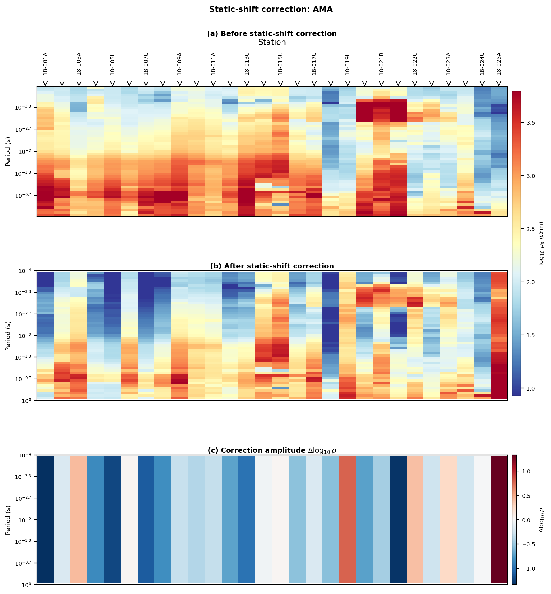
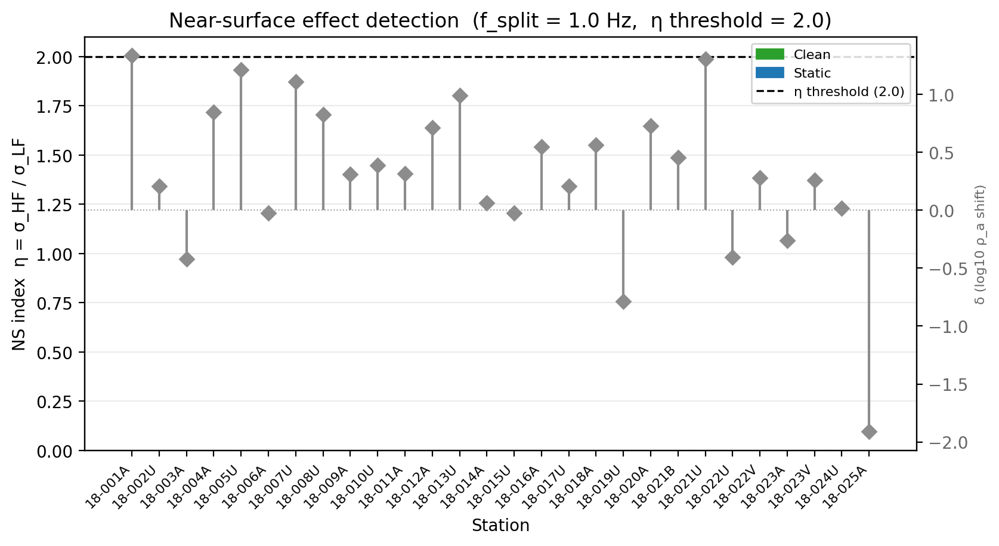
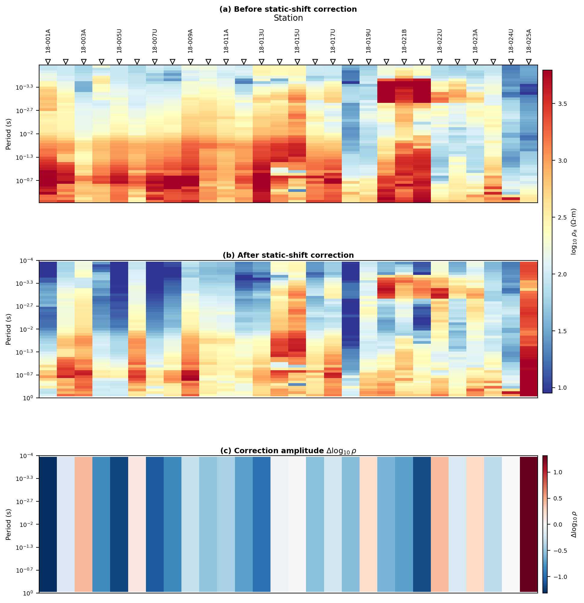

.. _emtools_ss:

Static-Shift Correction
=======================

Static shift is a station-dependent, frequency-independent offset in
apparent resistivity.  In CSAMT, AMT, and MT data it is usually caused
by shallow galvanic distortion: the curve keeps nearly the same shape,
but it is lifted or lowered by a multiplier.  Because apparent
resistivity is proportional to ``|Z|**2``, pyCSAMT estimates the shift in
``log10(rho)`` and applies the square-root correction to the impedance
tensor ``Z``.

The static-shift tools in ``pycsamt.emtools`` cover four related jobs:

.. list-table::
   :header-rows: 1
   :widths: 28 32 40

   * - Job
     - Main tools
     - Use when
   * - Estimate correction factors
     - ``estimate_ss_ama``, ``estimate_ss_loess``,
       ``estimate_ss_bilateral``, ``estimate_ss_refmedian``
     - You want a per-station table of static-shift amplitudes before
       modifying data.
   * - Apply factors
     - ``apply_ss_factors``, ``correct_ss_ama``
     - You have accepted a factor table and want corrected ``Sites``.
   * - Check the correction visually
     - ``plot_ss_delta_psection``, ``plot_ss_station_curves``,
       ``plot_ss_delta_profile``, ``ss_qc_*``,
       ``ss_comparison_psection``
     - You need before/after diagnostics rather than only a table.
   * - Separate static shift from near-surface effects
     - ``detect_near_surface``, ``plot_ns_detection``
     - The distortion may be frequency-dependent and therefore not
       removable by a conventional static-shift multiplier.

The examples below use two-level imports from ``pycsamt.emtools`` because
the static-shift functions are exported as public user-facing symbols.

Load The Survey
---------------

Start from the canonical loader.  It accepts a directory, a glob-like
collection, or an existing ``Sites`` object and skips files without valid
impedance data.

.. code-block:: python
   :linenos:

   from pathlib import Path

   from pycsamt.emtools import ensure_sites

   edi_dir = Path("data/AMT/WILLY_DATA/L18PLT")
   sites = ensure_sites(edi_dir, recursive=True, verbose=0)

For static-shift work, station order matters.  The AMA method estimates a
local spatial trend from neighbouring stations, so choose ``sort_by`` to
match the survey line direction:

.. list-table::
   :header-rows: 1
   :widths: 20 80

   * - ``sort_by``
     - Meaning
   * - ``"lon"``
     - Order stations by longitude.  This is useful for an east-west line.
   * - ``"lat"``
     - Order stations by latitude.  This is useful for a north-south line.
   * - ``"name"``
     - Order stations lexically by station name.  Use this only when the
       station names encode the real line order.

Estimate AMA Factors
--------------------

``estimate_ss_ama`` is the main estimator.  AMA means adaptive
moving-average: for each station, pyCSAMT builds a weighted local
reference from neighbouring stations, compares the target station with
that reference in ``log10(rho_det)``, and reduces the per-frequency
residuals to one static-shift value.

.. code-block:: python
   :linenos:

   from pycsamt.emtools import estimate_ss_ama

   factors = estimate_ss_ama(
       sites,
       sort_by="lat",
       half_window=3,
       weights="tri",
       pband=(1e-4, 10.0),
       max_skew=45.0,
       robust_freq="median",
       robust_overall="median",
   )

   print(factors[["station", "delta_log10_rho", "fac_rho", "fac_z", "n_used"]])

.. code-block:: text

       station  delta_log10_rho    fac_rho     fac_z  n_used
   0   18-001A         1.315686   0.048341  0.219865      22
   1   18-002U         0.199660   0.631451  0.794639      32
   2   18-003A        -0.429163   2.686355  1.639010      38
   3   18-004A         0.829915   0.147940  0.384630      34
   4   18-005U         1.204691   0.062418  0.249836      31
   5   18-006A        -0.134703   1.363652  1.167755      35
   6   18-007U         1.090404   0.081207  0.284969      31
   7   18-008U         0.842759   0.143629  0.378984      30
   8   18-009A         0.311615   0.487960  0.698542      43
   9   18-010U         0.531531   0.294082  0.542293      40
   10  18-011A         0.429333   0.372107  0.610005      39
   11  18-012A         0.716283   0.192184  0.438388      32
   12  18-013U         0.971147   0.106869  0.326909      37
   13  18-014A         0.077767   0.836051  0.914358      35
   14  18-015U        -0.008743   1.020336  1.010117      41
   15  18-016A         0.553432   0.279620  0.528791      39
   16  18-017U         0.243962   0.570214  0.755125      40
   17  18-018A         0.570181   0.269041  0.518692       8
   18  18-019U        -0.231489   1.704076  1.305403      11
   19  18-020A         0.611525   0.244610  0.494581      25
   20  18-021B         0.714440   0.193001  0.439319      22
   21  18-021U         1.176125   0.066661  0.258189      23
   22  18-022U        -0.415305   2.601986  1.613067      18
   23  18-022V         0.211366   0.614659  0.784002      21
   24  18-023A        -0.261413   1.825629  1.351158      16
   25  18-023V         0.342848   0.454101  0.673870      11
   26  18-024U         0.003641   0.991652  0.995817       9
   27  18-025A        -1.909562  81.201150  9.011168      17

The returned table has one row per station with these columns:

.. list-table::
   :header-rows: 1
   :widths: 25 75

   * - Column
     - Interpretation
   * - ``station``
     - Station identifier used to match the factor back to the survey.
   * - ``delta_log10_rho``
     - Estimated vertical offset of the station relative to the local
       spatial trend.  Positive means the station's apparent resistivity
       is above the trend.
   * - ``fac_rho``
     - Resistivity correction factor, computed as
       ``10 ** (-delta_log10_rho)``.
   * - ``fac_z``
     - Impedance correction factor, computed as
       ``10 ** (-0.5 * delta_log10_rho)``.  This is the column normally
       used by ``apply_ss_factors``.
   * - ``n_used``
     - Number of finite frequency samples that contributed to the station
       estimate after period-band and skew filtering.

The phase-tensor skew filter is important.  The default threshold is
conservative, so a structurally complex survey may return a sparse table
unless you choose a threshold appropriate for the line.  A quick audit is
usually better than accepting the first number silently:

.. code-block:: python
   :linenos:

   strict_factors = estimate_ss_ama(
       sites,
       sort_by="lat",
       half_window=3,
       max_skew=6.0,
   )

   survey_factors = estimate_ss_ama(
       sites,
       sort_by="lat",
       half_window=3,
       max_skew=45.0,
   )

   print("strict stations:", len(strict_factors))
   print("survey stations:", len(survey_factors))
   print("median samples:", survey_factors["n_used"].median())

.. code-block:: text

   strict stations: 26
   survey stations: 28
   median samples: 31.5

If ``n_used`` is low for many stations, the result may be technically
valid but weakly constrained.  In that case, inspect the skew page,
restrict ``pband`` to the useful period range, or compare several
estimators before applying the correction.

Read Factor Signs Correctly
---------------------------

A positive ``delta_log10_rho`` means the raw apparent resistivity is high
relative to the local trend, so the correction factor is less than one.
A negative ``delta_log10_rho`` means the raw apparent resistivity is low,
so the correction factor is greater than one.

.. code-block:: python
   :linenos:

   view = factors.assign(
       direction=factors["delta_log10_rho"].map(
           lambda value: "lower Z" if value > 0 else "raise Z"
       )
   )

   print(
       view[
           ["station", "delta_log10_rho", "fac_z", "n_used", "direction"]
       ].sort_values("delta_log10_rho")
   )

.. code-block:: text

       station  delta_log10_rho     fac_z  n_used direction
   27  18-025A        -1.909562  9.011168      17   raise Z
   2   18-003A        -0.429163  1.639010      38   raise Z
   22  18-022U        -0.415305  1.613067      18   raise Z
   24  18-023A        -0.261413  1.351158      16   raise Z
   18  18-019U        -0.231489  1.305403      11   raise Z
   5   18-006A        -0.134703  1.167755      35   raise Z
   14  18-015U        -0.008743  1.010117      41   raise Z
   26  18-024U         0.003641  0.995817       9   lower Z
   13  18-014A         0.077767  0.914358      35   lower Z
   1   18-002U         0.199660  0.794639      32   lower Z
   23  18-022V         0.211366  0.784002      21   lower Z
   16  18-017U         0.243962  0.755125      40   lower Z
   8   18-009A         0.311615  0.698542      43   lower Z
   25  18-023V         0.342848  0.673870      11   lower Z
   10  18-011A         0.429333  0.610005      39   lower Z
   9   18-010U         0.531531  0.542293      40   lower Z
   15  18-016A         0.553432  0.528791      39   lower Z
   17  18-018A         0.570181  0.518692       8   lower Z
   19  18-020A         0.611525  0.494581      25   lower Z
   20  18-021B         0.714440  0.439319      22   lower Z
   11  18-012A         0.716283  0.438388      32   lower Z
   3   18-004A         0.829915  0.384630      34   lower Z
   7   18-008U         0.842759  0.378984      30   lower Z
   12  18-013U         0.971147  0.326909      37   lower Z
   6   18-007U         1.090404  0.284969      31   lower Z
   21  18-021U         1.176125  0.258189      23   lower Z
   4   18-005U         1.204691  0.249836      31   lower Z
   0   18-001A         1.315686  0.219865      22   lower Z

``fac_z`` must be finite and positive.  ``apply_ss_factors`` guards the
impedance tensor against non-finite, zero, and negative factors by
leaving those stations unchanged, but your processing report should still
flag such rows because they indicate a failed or unreliable estimate.

.. code-block:: python
   :linenos:

   import numpy as np

   good = np.isfinite(factors["fac_z"]) & (factors["fac_z"] > 0.0)
   rejected = factors.loc[~good, ["station", "fac_z", "n_used"]]

   if not rejected.empty:
       print("Rows that will not be applied:")
       print(rejected)

Apply Factors
-------------

Use ``apply_ss_factors`` when you want an explicit estimate-then-apply
workflow.  This is the preferred pattern for production processing
because the table can be saved, reviewed, plotted, and reproduced.

.. code-block:: python
   :linenos:

   from pycsamt.emtools import apply_ss_factors

   corrected = apply_ss_factors(
       sites,
       factors,
       key="fac_z",
       inplace=False,
   )

Keep ``inplace=False`` while developing a processing flow.  It returns a
corrected copy and leaves the original ``Sites`` object available for
before/after plots.  Use ``inplace=True`` only when you deliberately want
to mutate the object already in memory.

For exploratory notebooks, ``correct_ss_ama`` combines estimation and
application in one call:

.. code-block:: python
   :linenos:

   from pycsamt.emtools import correct_ss_ama

   corrected = correct_ss_ama(
       sites,
       sort_by="lat",
       half_window=3,
       max_skew=45.0,
       inplace=False,
   )

This convenience call is useful, but it does not show the factor table by
itself.  When documenting a survey, keep the explicit ``factors`` table
as part of the processing record.

Compare Estimators
------------------

Static-shift estimation is not a single universal recipe.  The four
estimators use different references:

.. list-table::
   :header-rows: 1
   :widths: 24 38 38

   * - Estimator
     - Reference model
     - Practical reading
   * - ``estimate_ss_ama``
     - Weighted local median/mean from neighbouring stations.
     - Good default for line data when station order is meaningful.
   * - ``estimate_ss_loess``
     - Local polynomial regression across neighbouring stations.
     - Useful when the background level changes smoothly along the line.
   * - ``estimate_ss_bilateral``
     - Neighbour trend weighted by both distance and value similarity.
     - Can protect sharp local contrasts, but may disagree at outliers.
   * - ``estimate_ss_refmedian``
     - Global frequency-wise median reference.
     - Useful as a broad check, less local than AMA or LOESS.

Run several estimators before correcting a valuable line.  Agreement is a
stronger signal than a single factor table.

.. code-block:: python
   :linenos:

   from functools import reduce

   from pycsamt.emtools import (
       estimate_ss_bilateral,
       estimate_ss_loess,
       estimate_ss_refmedian,
   )

   tables = {
       "ama": estimate_ss_ama(
           sites,
           sort_by="lat",
           half_window=3,
           max_skew=45.0,
       ),
       "loess": estimate_ss_loess(
           sites,
           half_window=3,
           max_skew=45.0,
       ),
       "bilateral": estimate_ss_bilateral(
           sites,
           half_window=4,
           max_skew=45.0,
       ),
       "refmedian": estimate_ss_refmedian(
           sites,
           max_skew=45.0,
       ),
   }

   compact = []
   for name, table in tables.items():
       compact.append(
           table[["station", "delta_log10_rho"]].rename(
               columns={"delta_log10_rho": name}
           )
       )

   comparison = reduce(
       lambda left, right: left.merge(right, on="station", how="inner"),
       compact,
   )

   print(comparison)
   print(comparison.drop(columns="station").corr().round(2))

.. code-block:: text

       station       ama     loess  bilateral  refmedian
   0   18-001A  1.332021  1.159768   0.404790   1.147046
   1   18-002U  0.204137  0.027926  -0.024785   0.344798
   2   18-003A -0.423116 -0.228044  -0.056300  -0.013361
   3   18-004A  0.845136  0.544652   0.027856   0.593522
   4   18-005U  1.212859  1.208384   0.350171   1.008823
   5   18-006A -0.023122 -0.111229  -0.094693   0.382904
   6   18-007U  1.108909  1.196616   0.022501   0.870229
   7   18-008U  0.826022  0.576419   0.101546   0.799377
   8   18-009A  0.308615  0.164553   0.064798   0.466872
   9   18-010U  0.387382  0.575710   0.001690   0.436586
   10  18-011A  0.316431  0.272670  -0.071976   0.329512
   11  18-012A  0.709257  0.750474   0.524762   0.782521
   12  18-013U  0.987698  0.823783   0.408062   0.983713
   13  18-014A  0.060567  0.085557  -0.001016   0.328062
   14  18-015U -0.027194  0.148288   0.011463   0.437894
   15  18-016A  0.548499  0.682097   0.222652   0.387643
   16  18-017U  0.207717 -0.072589   0.175048  -0.020784
   17  18-018A  0.559294  0.622097   0.204397   0.442325
   18  18-019U -0.787610 -0.750317  -0.310667  -0.562525
   19  18-020A  0.724057  0.577375   0.219258   0.793404
   20  18-021B  0.454139  0.194675   0.176764   0.632271
   21  18-021U  1.304396  1.190724   0.551496   1.188714
   22  18-022U -0.404453 -0.554035  -0.135679  -0.246598
   23  18-022V  0.276068  0.284507   0.184105   0.341684
   24  18-023A -0.261413 -0.354546  -0.189863  -0.345754
   25  18-023V  0.258398 -0.256520   0.058670  -0.092407
   26  18-024U  0.015435  0.353124  -0.039578   0.014523
   27  18-025A -1.910982 -2.802634   1.019139  -1.579179
               ama  loess  bilateral  refmedian
   ama        1.00   0.96       0.08       0.95
   loess      0.96   1.00      -0.08       0.95
   bilateral  0.08  -0.08       1.00       0.05
   refmedian  0.95   0.95       0.05       1.00

Look for sign disagreements, not only large absolute differences.  If
AMA says a station should be lowered while bilateral filtering says it
should be raised, that station deserves a manual plot before correction.

QC Plots In One Call
--------------------

The ``ss_qc_*`` wrappers estimate, apply, and plot in one call.  They are
good first-look tools when you do not need to reuse the corrected object.

.. code-block:: python
   :linenos:

   import matplotlib.pyplot as plt

   from pycsamt.emtools import (
       ss_qc_profile,
       ss_qc_psection,
       ss_qc_station_curves,
   )

   ss_qc_psection(
       sites,
       method="ama",
       sort_by="lat",
       half_window=3,
       max_skew=45.0,
       pband=(1e-4, 10.0),
   )

   ss_qc_profile(
       sites,
       method="ama",
       sort_by="lat",
       half_window=3,
       max_skew=45.0,
       robust="median",
   )

   ss_qc_station_curves(
       sites,
       method="ama",
       station="18-016A",
       sort_by="lat",
       half_window=3,
       max_skew=45.0,
   )

   for i, num in enumerate(plt.get_fignums(), start=1):
       fig = plt.figure(num)
       fig.savefig(f"ss_qc_plots_{i:02d}.png", dpi=200, bbox_inches="tight")
       plt.close(fig)

.. grid:: 3
   :gutter: 2

   .. grid-item::

      .. image:: ../../images/user_guide/emtools/user-guide-emtools-ss-09-01.png
         :width: 100%

   .. grid-item::

      .. image:: ../../images/user_guide/emtools/user-guide-emtools-ss-09-02.png
         :width: 100%

   .. grid-item::

      .. image:: ../../images/user_guide/emtools/user-guide-emtools-ss-09-03.png
         :width: 100%

``ss_qc_psection`` shows the pointwise
``log10(rho_after) - log10(rho_before)`` correction as a pseudosection.
For a true static-shift correction, each station tends to show a nearly
vertical band because the multiplier is constant with frequency.

``ss_qc_profile`` compresses that difference to one value per station.
Use it to find stations with unusually large corrections.

``ss_qc_station_curves`` overlays the before and after curves for one
station.  It is the quickest way to confirm that the correction shifted
the level without changing the curve shape.

Before/After Plots From Existing Sites
--------------------------------------

When you already have a corrected ``Sites`` object, call the lower-level
plotters directly.  These functions do not re-estimate the correction;
they compare the two data sets you pass in.

.. code-block:: python
   :linenos:

   import matplotlib.pyplot as plt

   from pycsamt.emtools import (
       plot_ss_delta_profile,
       plot_ss_delta_psection,
       plot_ss_station_curves,
   )

   plot_ss_delta_psection(
       sites,
       corrected,
       axis_y="logperiod",
       pband=(1e-4, 10.0),
   )

   plot_ss_delta_profile(
       sites,
       corrected,
       robust="median",
       pband=(1e-4, 10.0),
   )

   plot_ss_station_curves(
       sites,
       corrected,
       station="18-016A",
       pband=(1e-4, 10.0),
   )

   for i, num in enumerate(plt.get_fignums(), start=1):
       fig = plt.figure(num)
       fig.savefig(f"ss_before_after_{i:02d}.png", dpi=200, bbox_inches="tight")
       plt.close(fig)

.. grid:: 3
   :gutter: 2

   .. grid-item::

      .. image:: ../../images/user_guide/emtools/user-guide-emtools-ss-10-01.png
         :width: 100%

   .. grid-item::

      .. image:: ../../images/user_guide/emtools/user-guide-emtools-ss-10-02.png
         :width: 100%

   .. grid-item::

      .. image:: ../../images/user_guide/emtools/user-guide-emtools-ss-10-03.png
         :width: 100%

These calls are useful in reports because they make the provenance clear:
``sites`` is the uncorrected input and ``corrected`` is the accepted
corrected output.

Publication Comparison Figures
------------------------------

``ss_comparison_psection`` is the high-level publication helper.  It
estimates the correction, applies it, builds aligned before/after
``log10(rho_det)`` arrays internally, and renders a shared-scale
pseudosection comparison.

.. code-block:: python
   :linenos:

   import matplotlib.pyplot as plt

   from pycsamt.emtools import ss_comparison_psection

   fig = ss_comparison_psection(
       sites,
       method="ama",
       sort_by="lat",
       half_window=3,
       max_skew=45.0,
       show_delta=True,
       suptitle="Static-shift correction: AMA",
   )
   fig.savefig("ss_comparison_psection_ama.png", dpi=200, bbox_inches="tight")
   plt.close(fig)

Use ``show_delta=True`` when the figure must show both the corrected
resistivity field and the actual correction amplitude.  The before and
after panels share colour limits, so station-level offsets remain
visible instead of being hidden by automatic rescaling.

The lower-level ``plot_ss_comparison_psection``, ``plot_ss_1d_curves``,
and ``plot_ss_summary`` functions accept precomputed arrays:
``logRho_before`` with shape ``(n_stations, n_frequencies)``,
``logRho_after`` with the same shape, and ``freqs`` in hertz.  Use those
array-level functions when you have already built a custom resistivity
matrix outside the normal ``Sites`` workflow.

Radar View
----------

``plot_ss_radar`` shows the ``xy`` and ``yx`` apparent-resistivity
components for one station on a polar grid.  The angle around the circle
represents period or frequency, and the radius represents resistivity or
``log10(resistivity)``.

.. code-block:: python
   :linenos:

   import matplotlib.pyplot as plt

   from pycsamt.emtools import plot_ss_radar

   plot_ss_radar(
       sites,
       station="18-016A",
       rotate="none",
       radial="log10rho",
       theta_axis="logperiod",
       fill_between=True,
   )

   plot_ss_radar(
       sites,
       station="18-016A",
       rotate="pt",
       rotate_stat="median",
       radial="log10rho",
   )

   for i, num in enumerate(plt.get_fignums(), start=1):
       fig = plt.figure(num)
       fig.savefig(f"ss_radar_18-016A_{i:02d}.png", dpi=200, bbox_inches="tight")
       plt.close(fig)

.. grid:: 2
   :gutter: 2

   .. grid-item::

      .. image:: ../../images/user_guide/emtools/user-guide-emtools-ss-12-01.png
         :width: 100%

   .. grid-item::

      .. image:: ../../images/user_guide/emtools/user-guide-emtools-ss-12-02.png
         :width: 100%

Use ``rotate="none"`` for a raw component view, ``rotate="deg"`` with
``rotate_deg=...`` for a fixed rotation, and ``rotate="pt"`` for
phase-tensor based rotation.  The radar plot is diagnostic: it helps you
see directional imbalance and frequency structure, but it is not itself a
static-shift estimator.

Near-Surface Versus Static Shift
--------------------------------

Conventional static-shift correction assumes the distortion is a constant
multiplier.  Some shallow effects are frequency-dependent: the high
frequency part of the curve may become much noisier or steeper than the
low frequency part.  A single static multiplier cannot fix that behavior.

``detect_near_surface`` classifies each station using three diagnostics:

.. list-table::
   :header-rows: 1
   :widths: 26 74

   * - Diagnostic
     - Meaning
   * - ``ns_index``
     - Ratio of high-frequency residual spread to low-frequency residual
       spread.  Values above ``ns_threshold`` indicate near-surface
       frequency-dependent distortion.
   * - ``gradient_delta``
     - Difference between high-frequency and low-frequency log-log slopes.
       Larger values indicate a change in curve shape.
   * - ``ss_delta_log10``
     - AMA-like static-shift residual.  Values above ``ss_threshold`` are
       consistent with a station-level static offset.

.. code-block:: python
   :linenos:

   import matplotlib.pyplot as plt

   from pycsamt.emtools import detect_near_surface, plot_ns_detection

   ns = detect_near_surface(
       sites,
       f_split=1.0,
       ns_threshold=2.0,
       ss_threshold=0.1,
       sort_by="lat",
       half_window=3,
       max_skew=45.0,
   )

   print(ns[[
       "station",
       "ns_index",
       "gradient_delta",
       "ss_delta_log10",
       "distortion_type",
   ]])
   print(ns["distortion_type"].value_counts())

   plot_ns_detection(
       sites,
       f_split=1.0,
       ns_threshold=2.0,
       ss_threshold=0.1,
       sort_by="lat",
       half_window=3,
       max_skew=45.0,
       show_ss=True,
   )
   plt.gcf().savefig("ss_near_surface_detection.png", dpi=200, bbox_inches="tight")
   plt.close(plt.gcf())

.. code-block:: text

       station  ns_index  gradient_delta  ss_delta_log10 distortion_type
   0   18-001A       NaN             NaN        1.332021          static
   1   18-002U       NaN             NaN        0.204137          static
   2   18-003A       NaN             NaN       -0.423116          static
   3   18-004A       NaN             NaN        0.845136          static
   4   18-005U       NaN             NaN        1.212859          static
   5   18-006A       NaN             NaN       -0.023122           clean
   6   18-007U       NaN             NaN        1.108909          static
   7   18-008U       NaN             NaN        0.826022          static
   8   18-009A       NaN             NaN        0.308615          static
   9   18-010U       NaN             NaN        0.387382          static
   10  18-011A       NaN             NaN        0.316431          static
   11  18-012A       NaN             NaN        0.709257          static
   12  18-013U       NaN             NaN        0.987698          static
   13  18-014A       NaN             NaN        0.060567           clean
   14  18-015U       NaN             NaN       -0.027194           clean
   15  18-016A       NaN             NaN        0.548499          static
   16  18-017U       NaN             NaN        0.207717          static
   17  18-018A       NaN             NaN        0.559294          static
   18  18-019U       NaN             NaN       -0.787610          static
   19  18-020A       NaN             NaN        0.724057          static
   20  18-021B       NaN             NaN        0.454139          static
   21  18-021U       NaN             NaN        1.304396          static
   22  18-022U       NaN             NaN       -0.404453          static
   23  18-022V       NaN             NaN        0.276068          static
   24  18-023A       NaN             NaN       -0.261413          static
   25  18-023V       NaN             NaN        0.258398          static
   26  18-024U       NaN             NaN        0.015435           clean
   27  18-025A       NaN             NaN       -1.910982          static
   distortion_type
   static    24
   clean      4
   Name: count, dtype: int64

The ``distortion_type`` column has four possible values:

.. list-table::
   :header-rows: 1
   :widths: 22 78

   * - Type
     - Meaning
   * - ``"clean"``
     - No strong near-surface index and no strong static-shift residual.
   * - ``"static"``
     - Static-shift residual is large, but the high-frequency residual
       spread is not.  A conventional static-shift correction may help.
   * - ``"near_surface"``
     - High-frequency residual spread is large, but static residual is not.
       Treat this as frequency-dependent distortion, not as a simple
       multiplier.
   * - ``"mixed"``
     - Both diagnostics are large.  Static correction may remove the
       constant part, but the remaining frequency-dependent effect needs
       separate geological and inversion judgment.

Recommended Processing Pattern
------------------------------

For a survey report, keep the static-shift workflow explicit:

.. code-block:: python
   :linenos:

   import matplotlib.pyplot as plt

   from pathlib import Path

   from pycsamt.emtools import (
       apply_ss_factors,
       detect_near_surface,
       ensure_sites,
       estimate_ss_ama,
       ss_comparison_psection,
   )

   edi_dir = Path("data/AMT/WILLY_DATA/L18PLT")
   sites = ensure_sites(edi_dir, recursive=True)

   factors = estimate_ss_ama(
       sites,
       sort_by="lat",
       half_window=3,
       pband=(1e-4, 10.0),
       max_skew=45.0,
   )

   factors.to_csv("static_shift_factors.csv", index=False)

   ns = detect_near_surface(
       sites,
       f_split=1.0,
       sort_by="lat",
       half_window=3,
       max_skew=45.0,
   )
   ns.to_csv("near_surface_diagnostics.csv", index=False)

   accepted = factors.merge(
       ns[["station", "distortion_type"]],
       on="station",
       how="left",
   )

   print(
       accepted.groupby("distortion_type", dropna=False)
       ["station"]
       .count()
       .rename("n_stations")
   )

   corrected = apply_ss_factors(
       sites,
       factors,
       key="fac_z",
       inplace=False,
   )

   fig = ss_comparison_psection(
       sites,
       method="ama",
       sort_by="lat",
       half_window=3,
       pband=(1e-4, 10.0),
       max_skew=45.0,
       show_delta=True,
   )
   fig.savefig("ss_recommended_comparison.png", dpi=200, bbox_inches="tight")
   plt.close(fig)

.. code-block:: text

   distortion_type
   clean      4
   static    24
   Name: n_stations, dtype: int64

The important decisions are visible in that script: loader, station
ordering, period band, skew threshold, accepted estimator, saved factor
table, and a near-surface check before interpreting the correction.

Common Pitfalls
---------------

``sort_by`` does not describe the coordinate you like best; it describes
the along-line order used by the neighbourhood estimator.  A north-south
line usually wants ``sort_by="lat"``.  An east-west line usually wants
``sort_by="lon"``.

``max_skew`` is a filter, not a quality score.  A strict value can leave
too few samples for a complex survey.  Check ``n_used`` before trusting
the factors.

Static shift changes level, not shape.  If the before/after station plot
would need a frequency-dependent correction to align the curves, use the
near-surface diagnostics and interpret with caution.

Do not apply an empty or nearly empty factor table just because the code
returns without error.  Empty estimates are a valid no-op outcome for
single-station inputs or surveys where no station has usable neighbours.

Prefer ``fac_z`` for impedance correction.  ``fac_rho`` is the
resistivity-domain factor and is useful for interpretation, but
``apply_ss_factors`` scales ``Z``.

Worked Example
--------------

The gallery example below uses the L18PLT survey and walks through raw
curve spread, AMA estimation, exact factor application, estimator
comparison, QC wrappers, radar plots, and near-surface classification.

.. literalinclude:: ../../../examples/emtools/plot_ss.py
   :language: python
   :linenos:
