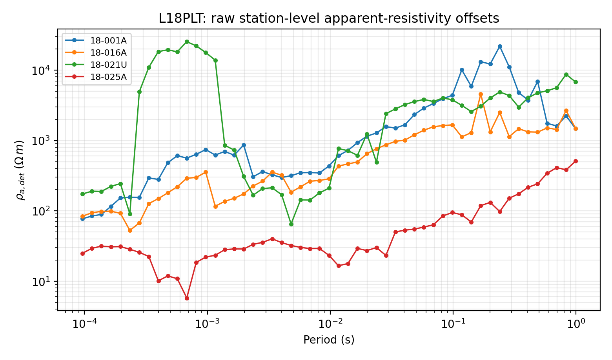
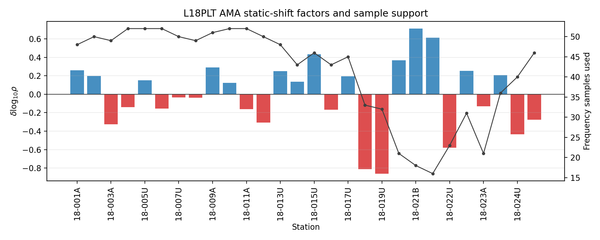
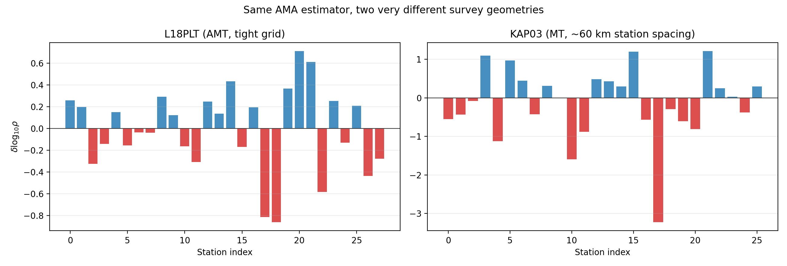
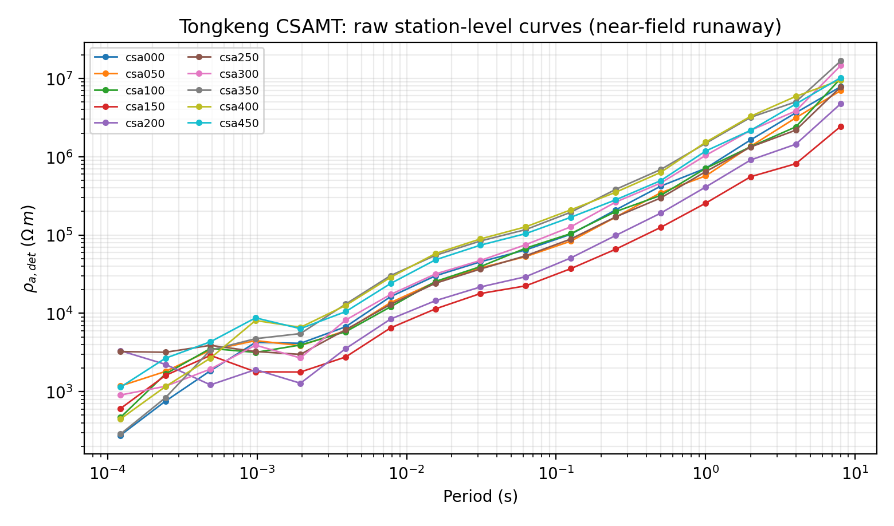

.. _emtools_ss:

Static-Shift Correction
=======================

:term:`Static shift` is a station-dependent, frequency-independent offset in
apparent resistivity. In CSAMT, AMT, and MT data it is usually caused
by shallow galvanic distortion: the curve keeps nearly the same shape,
but it is lifted or lowered by a multiplier. Because apparent
resistivity is proportional to ``|Z|**2``, pyCSAMT estimates the shift in
``log10(rho)`` and applies the square-root correction to the impedance
tensor ``Z``.

The static-shift tools in ``pycsamt.emtools`` cover four related jobs:

.. list-table::
   :header-rows: 1
   :widths: 28 32 40

   * - Job
     - Main tools
     - Use when
   * - Estimate correction factors
     - ``estimate_ss_ama``, ``estimate_ss_loess``,
       ``estimate_ss_bilateral``, ``estimate_ss_refmedian``
     - You want a per-station table of static-shift amplitudes before
       modifying data.
   * - Apply factors
     - ``apply_ss_factors``, ``correct_ss_ama``
     - You have accepted a factor table and want corrected ``Sites``.
   * - Check the correction visually
     - ``plot_ss_delta_psection``, ``plot_ss_station_curves``,
       ``plot_ss_delta_profile``, ``ss_qc_*``,
       ``ss_comparison_psection``
     - You need before/after diagnostics rather than only a table.
   * - Separate static shift from near-surface effects
     - ``detect_near_surface``, ``plot_ns_detection``
     - The distortion may be frequency-dependent and therefore not
       removable by a conventional static-shift multiplier.

The examples below use two-level imports from ``pycsamt.emtools`` because
the static-shift functions are exported as public user-facing symbols.
Most of this page works through pyCSAMT's bundled **L18PLT** AMT line
(``data/AMT/WILLY_DATA/``), a tight, regularly spaced grid where
:term:`Adaptive moving average` (AMA) correction behaves the way the
method was designed for. Two closing sections deliberately bring in
different data -- a widely spaced natural-source MT profile and a real
CSAMT line with a controlled-source transmitter -- to show what the same
estimator looks like when its underlying assumptions weaken or break.

Load The Survey
---------------

Start from the canonical loader. It accepts a directory, a glob-like
collection, or an existing ``Sites`` object and skips files without valid
impedance data.

.. code-block:: pycon

   >>> from pathlib import Path
   >>> import matplotlib.pyplot as plt
   >>> from pycsamt.emtools import ensure_sites
   >>> from pycsamt.emtools._core import _get_z_block, _iter_items, _name
   >>> from pycsamt.emtools.ss import _rho_det_from_z
   >>> edi_dir = Path("data/AMT/WILLY_DATA/L18PLT")
   >>> sites = ensure_sites(edi_dir, recursive=True, verbose=0)
   >>> stations = ["18-001A", "18-016A", "18-021U", "18-025A"]
   >>> fig, ax = plt.subplots(figsize=(7.8, 4.6))
   >>> for station in stations:
   ...     for i, edi in enumerate(_iter_items(sites)):
   ...         if _name(edi, i) == station:
   ...             _, z, freq = _get_z_block(edi)
   ...             rho = _rho_det_from_z(z, freq)
   ...             _ = ax.loglog(1.0 / freq, rho, "-o", ms=3, lw=1.2, label=station)
   ...             break
   ...
   >>> _ = ax.set_xlabel("Period (s)")
   >>> _ = ax.set_ylabel(r"$\rho_{a,det}$ ($\Omega\,m$)")
   >>> _ = ax.set_title("L18PLT: raw station-level apparent-resistivity offsets")
   >>> ax.grid(True, which="both", alpha=0.25)
   >>> _ = ax.legend(fontsize=8)
   >>> fig.tight_layout()
   >>> fig.savefig("l18plt_raw_offsets.png", dpi=200)
   >>> plt.close(fig)

The four raw curves show the static-shift problem before any estimator
is called: stations can keep broadly comparable curve shapes while
sitting at very different apparent-resistivity levels. That vertical
offset is the part a static-shift correction can address.

For static-shift work, station order matters. The AMA method estimates a
local spatial trend from neighbouring stations, so choose ``sort_by`` to
match the survey line direction:

.. list-table::
   :header-rows: 1
   :widths: 20 80

   * - ``sort_by``
     - Meaning
   * - ``"lon"``
     - Order stations by longitude. This is useful for an east-west line.
   * - ``"lat"``
     - Order stations by latitude. This is useful for a north-south line.
   * - ``"name"``
     - Order stations lexically by station name. Use this only when the
       station names encode the real line order.

Estimate AMA Factors
--------------------

``estimate_ss_ama`` is the main estimator. AMA means adaptive
moving-average: for each station, pyCSAMT builds a weighted local
reference from neighbouring stations, compares the target station with
that reference in ``log10(rho_det)``, and reduces the per-frequency
residuals to one static-shift value.
For station :math:`s` and frequency :math:`f_i`, the determinant
apparent resistivity is written as :math:`\rho_{a,det}(s,f_i)`. The
local reference is a weighted neighbourhood trend,

.. math::

   r_s(f_i)
   =
   \frac{\sum_{j \in \mathcal{N}(s)} w_{sj}
   \log_{10}\rho_{a,det}(j,f_i)}
   {\sum_{j \in \mathcal{N}(s)} w_{sj}},

where :math:`\mathcal{N}(s)` is the station neighbourhood and
:math:`w_{sj}` comes from ``weights``. The station residual is then

.. math::

   d_s(f_i) =
   \log_{10}\rho_{a,det}(s,f_i) - r_s(f_i).

After period-band and skew filtering, ``robust_freq`` and
``robust_overall`` reduce the finite residuals to the reported
:math:`\delta_s`. The correction factors are

.. math::

   F_{\rho,s} = 10^{-\delta_s},
   \qquad
   F_{Z,s} = 10^{-\delta_s/2}.

The square root appears because apparent resistivity scales as
:math:`|Z|^2`. Positive :math:`\delta_s` therefore lowers the impedance
level, while negative :math:`\delta_s` raises it.

.. code-block:: pycon

   >>> import numpy as np
   >>> from pycsamt.emtools import estimate_ss_ama
   >>> factors = estimate_ss_ama(
   ...     sites,
   ...     sort_by="lat",
   ...     half_window=3,
   ...     weights="tri",
   ...     pband=(1e-4, 10.0),
   ...     max_skew=45.0,
   ...     robust_freq="median",
   ...     robust_overall="median",
   ... )
   >>> factors[["station", "delta_log10_rho", "fac_rho", "fac_z", "n_used"]]
       station  delta_log10_rho   fac_rho     fac_z  n_used
   0   18-001A         0.259495  0.550180  0.741741      48
   1   18-002U         0.197412  0.634729  0.796699      50
   2   18-003A        -0.324956  2.113273  1.453710      49
   3   18-004A        -0.139901  1.380070  1.174764      52
   4   18-005U         0.149973  0.707990  0.841421      52
   5   18-006A        -0.154306  1.426612  1.194409      52
   6   18-007U        -0.035679  1.085622  1.041932      50
   7   18-008U        -0.038915  1.093742  1.045821      49
   8   18-009A         0.292345  0.510100  0.714213      51
   9   18-010U         0.123394  0.752673  0.867567      52
   10  18-011A        -0.161789  1.451407  1.204744      52
   11  18-012A        -0.307374  2.029430  1.424581      50
   12  18-013U         0.249248  0.563316  0.750544      48
   13  18-014A         0.137359  0.728855  0.853730      43
   14  18-015U         0.433704  0.368380  0.606943      46
   15  18-016A        -0.167965  1.472195  1.213340      43
   16  18-017U         0.195397  0.637681  0.798549      45
   17  18-018A        -0.811953  6.485640  2.546692      33
   18  18-019U        -0.860133  7.246585  2.691948      32
   19  18-020A         0.367840  0.428707  0.654757      21
   20  18-021B         0.712003  0.194087  0.440553      18
   21  18-021U         0.611618  0.244558  0.494528      16
   22  18-022U        -0.581030  3.810921  1.952158      23
   23  18-022V         0.254640  0.556366  0.745899      31
   24  18-023A        -0.129144  1.346307  1.160305      21
   25  18-023V         0.208168  0.619201  0.786893      36
   26  18-024U        -0.434668  2.720618  1.649430      40
   27  18-025A        -0.275380  1.885300  1.373062      46
   >>> fig, ax1 = plt.subplots(figsize=(10.5, 4.2))
   >>> x = np.arange(len(factors))
   >>> colors = np.where(factors["delta_log10_rho"] >= 0.0, "C0", "C3")
   >>> _ = ax1.bar(x, factors["delta_log10_rho"], color=colors, alpha=0.82)
   >>> _ = ax1.axhline(0.0, color="0.2", lw=0.8)
   >>> _ = ax1.set_ylabel(r"$\delta\log_{10}\rho$")
   >>> _ = ax1.set_xticks(x[::2])
   >>> _ = ax1.set_xticklabels(factors["station"].iloc[::2], rotation=90)
   >>> _ = ax1.set_xlabel("Station")
   >>> ax1.grid(True, axis="y", alpha=0.25)
   >>> ax2 = ax1.twinx()
   >>> _ = ax2.plot(x, factors["n_used"], "o-", color="0.25", ms=3, lw=1.1)
   >>> _ = ax2.set_ylabel("Frequency samples used")
   >>> _ = ax1.set_title("L18PLT AMA static-shift factors and sample support")
   >>> fig.tight_layout()
   >>> fig.savefig("l18plt_ama_factors.png", dpi=200)
   >>> plt.close(fig)

The bar sign follows the estimated bias being removed. Blue positive
bars mark stations whose raw resistivity sits above the local trend and
will be lowered; red negative bars mark stations that will be raised.
``18-019U`` and ``18-018A`` are the most extreme cases on this line:
:math:`\delta = -0.86` and :math:`-0.81`, with impedance correction
factors of ``2.69`` and ``2.55`` -- and ``n_used`` of 32 and 33 shows
those estimates rest on solid frequency support, not a handful of noisy
points. The black line gives ``n_used``, so a large factor with little
frequency support can be flagged before it is applied; the low-support
run around ``18-020A``-``18-021U`` (``n_used`` down to 16-21) is exactly
the kind of factor worth a second look before trusting it at face
value.

The returned table has one row per station with these columns:

.. list-table::
   :header-rows: 1
   :widths: 25 75

   * - Column
     - Interpretation
   * - ``station``
     - Station identifier used to match the factor back to the survey.
   * - ``delta_log10_rho``
     - Estimated vertical offset of the station relative to the local
       spatial trend. Positive means the station's apparent resistivity
       is above the trend.
   * - ``fac_rho``
     - Resistivity correction factor, computed as
       ``10 ** (-delta_log10_rho)``.
   * - ``fac_z``
     - Impedance correction factor, computed as
       ``10 ** (-0.5 * delta_log10_rho)``. This is the column normally
       used by ``apply_ss_factors``.
   * - ``n_used``
     - Number of finite frequency samples that contributed to the station
       estimate after period-band and skew filtering.

The phase-tensor :term:`skew` filter is important. The default threshold is
conservative, so a structurally complex survey may return a sparse table
unless you choose a threshold appropriate for the line. A quick audit is
usually better than accepting the first number silently:

.. code-block:: pycon

   >>> strict_factors = estimate_ss_ama(
   ...     sites,
   ...     sort_by="lat",
   ...     half_window=3,
   ...     max_skew=6.0,
   ... )
   >>> survey_factors = estimate_ss_ama(
   ...     sites,
   ...     sort_by="lat",
   ...     half_window=3,
   ...     max_skew=45.0,
   ... )
   >>> print("strict stations:", len(strict_factors))
   strict stations: 28
   >>> print("survey stations:", len(survey_factors))
   survey stations: 28
   >>> print("median samples:", survey_factors["n_used"].median())
   median samples: 47.0

All 28 stations survive even the strict ``max_skew=6.0`` threshold here
-- unlike the phase-tensor skew page's own findings for this same line,
where nearly every station fails a 6-degree threshold on individual
rows, enough rows still clear it at the *station* level that no station
is dropped outright, and the median sample support only drops from 52
to still-healthy levels. If ``n_used`` is low for many stations, the
result may be technically valid but weakly constrained. In that case,
inspect the :ref:`emtools_skew` page, restrict ``pband`` to the useful
period range, or compare several estimators before applying the
correction.

Read Factor Signs Correctly
---------------------------

A positive ``delta_log10_rho`` means the raw apparent resistivity is high
relative to the local trend, so the correction factor is less than one.
A negative ``delta_log10_rho`` means the raw apparent resistivity is low,
so the correction factor is greater than one.

.. code-block:: pycon

   >>> view = factors.assign(
   ...     direction=factors["delta_log10_rho"].map(
   ...         lambda value: "lower Z" if value > 0 else "raise Z"
   ...     )
   ... )
   >>> view[
   ...     ["station", "delta_log10_rho", "fac_z", "n_used", "direction"]
   ... ].sort_values("delta_log10_rho")
       station  delta_log10_rho     fac_z  n_used direction
   18  18-019U        -0.860133  2.691948      32   raise Z
   17  18-018A        -0.811953  2.546692      33   raise Z
   22  18-022U        -0.581030  1.952158      23   raise Z
   26  18-024U        -0.434668  1.649430      40   raise Z
   2   18-003A        -0.324956  1.453710      49   raise Z
   11  18-012A        -0.307374  1.424581      50   raise Z
   27  18-025A        -0.275380  1.373062      46   raise Z
   15  18-016A        -0.167965  1.213340      43   raise Z
   10  18-011A        -0.161789  1.204744      52   raise Z
   5   18-006A        -0.154306  1.194409      52   raise Z
   3   18-004A        -0.139901  1.174764      52   raise Z
   24  18-023A        -0.129144  1.160305      21   raise Z
   7   18-008U        -0.038915  1.045821      49   raise Z
   6   18-007U        -0.035679  1.041932      50   raise Z
   9   18-010U         0.123394  0.867567      52   lower Z
   13  18-014A         0.137359  0.853730      43   lower Z
   4   18-005U         0.149973  0.841421      52   lower Z
   16  18-017U         0.195397  0.798549      45   lower Z
   1   18-002U         0.197412  0.796699      50   lower Z
   25  18-023V         0.208168  0.786893      36   lower Z
   12  18-013U         0.249248  0.750544      48   lower Z
   23  18-022V         0.254640  0.745899      31   lower Z
   0   18-001A         0.259495  0.741741      48   lower Z
   8   18-009A         0.292345  0.714213      51   lower Z
   19  18-020A         0.367840  0.654757      21   lower Z
   14  18-015U         0.433704  0.606943      46   lower Z
   21  18-021U         0.611618  0.494528      16   lower Z
   20  18-021B         0.712003  0.440553      18   lower Z

``fac_z`` must be finite and positive. ``apply_ss_factors`` guards the
impedance tensor against non-finite, zero, and negative factors by
leaving those stations unchanged, but your processing report should still
flag such rows because they indicate a failed or unreliable estimate.

.. code-block:: pycon

   >>> good = np.isfinite(factors["fac_z"]) & (factors["fac_z"] > 0.0)
   >>> rejected = factors.loc[~good, ["station", "fac_z", "n_used"]]
   >>> if not rejected.empty:
   ...     print("Rows that will not be applied:")
   ...     print(rejected)
   ... else:
   ...     print("All", len(factors), "stations have a usable fac_z.")
   ...
   All 28 stations have a usable fac_z.

Apply Factors
-------------

Use ``apply_ss_factors`` when you want an explicit estimate-then-apply
workflow. This is the preferred pattern for production processing
because the table can be saved, reviewed, plotted, and reproduced.

.. code-block:: pycon

   >>> from pycsamt.emtools import apply_ss_factors
   >>> corrected = apply_ss_factors(
   ...     sites,
   ...     factors,
   ...     key="fac_z",
   ...     inplace=False,
   ... )

Keep ``inplace=False`` while developing a processing flow. It returns a
corrected copy and leaves the original ``Sites`` object available for
before/after plots. Use ``inplace=True`` only when you deliberately want
to mutate the object already in memory.

For exploratory notebooks, ``correct_ss_ama`` combines estimation and
application in one call:

.. code-block:: pycon

   >>> from pycsamt.emtools import correct_ss_ama
   >>> corrected2 = correct_ss_ama(
   ...     sites,
   ...     sort_by="lat",
   ...     half_window=3,
   ...     max_skew=45.0,
   ...     inplace=False,
   ... )

This convenience call is useful, but it does not show the factor table by
itself. When documenting a survey, keep the explicit ``factors`` table
as part of the processing record.

Compare Estimators
------------------

Static-shift estimation is not a single universal recipe. The four
estimators use different references:

.. list-table::
   :header-rows: 1
   :widths: 24 38 38

   * - Estimator
     - Reference model
     - Practical reading
   * - ``estimate_ss_ama``
     - Weighted local median/mean from neighbouring stations.
     - Good default for line data when station order is meaningful.
   * - ``estimate_ss_loess``
     - Local polynomial regression across neighbouring stations.
     - Useful when the background level changes smoothly along the line.
   * - ``estimate_ss_bilateral``
     - Neighbour trend weighted by both distance and value similarity.
     - Can protect sharp local contrasts, but may disagree at outliers.
   * - ``estimate_ss_refmedian``
     - Global frequency-wise median reference.
     - Useful as a broad check, less local than AMA or LOESS.

Run several estimators before correcting a valuable line. Agreement is a
stronger signal than a single factor table.

.. code-block:: pycon

   >>> from functools import reduce
   >>> from pycsamt.emtools import (
   ...     estimate_ss_bilateral,
   ...     estimate_ss_loess,
   ...     estimate_ss_refmedian,
   ... )
   >>> tables = {
   ...     "ama": estimate_ss_ama(
   ...         sites,
   ...         sort_by="lat",
   ...         half_window=3,
   ...         max_skew=45.0,
   ...     ),
   ...     "loess": estimate_ss_loess(
   ...         sites,
   ...         half_window=3,
   ...         max_skew=45.0,
   ...     ),
   ...     "bilateral": estimate_ss_bilateral(
   ...         sites,
   ...         half_window=4,
   ...         max_skew=45.0,
   ...     ),
   ...     "refmedian": estimate_ss_refmedian(
   ...         sites,
   ...         max_skew=45.0,
   ...     ),
   ... }
   >>> compact = []
   >>> for name, table in tables.items():
   ...     compact.append(
   ...         table[["station", "delta_log10_rho"]].rename(
   ...             columns={"delta_log10_rho": name}
   ...         )
   ...     )
   ...
   >>> comparison = reduce(
   ...     lambda left, right: left.merge(right, on="station", how="inner"),
   ...     compact,
   ... )
   >>> comparison
       station       ama     loess  bilateral  refmedian
   0   18-001A  0.253122 -0.224923   0.150203   0.262267
   1   18-002U  0.190495  0.034051   0.009116   0.076518
   2   18-003A -0.324518 -0.335759  -0.139981  -0.248428
   3   18-004A -0.136452 -0.009228  -0.020129  -0.098030
   4   18-005U  0.145856  0.164786   0.051494   0.032212
   5   18-006A -0.159680 -0.145048  -0.067598  -0.125258
   6   18-007U -0.034320 -0.021412  -0.002392   0.031200
   7   18-008U -0.059197 -0.095450   0.015649   0.065517
   8   18-009A  0.291038  0.214338   0.040241   0.337904
   9   18-010U  0.123971  0.100683   0.015968   0.158455
   10  18-011A -0.161336 -0.129433  -0.068058   0.012536
   11  18-012A -0.307507 -0.233731  -0.058582   0.021165
   12  18-013U  0.249834  0.156864   0.025542   0.414649
   13  18-014A  0.139753  0.057783   0.018199   0.408826
   14  18-015U  0.430318  0.333318   0.147733   0.470533
   15  18-016A -0.168493 -0.162078  -0.068441   0.019986
   16  18-017U  0.195199  0.475239   0.034394   0.114006
   17  18-018A -0.800131 -0.672537  -0.253025  -0.716215
   18  18-019U -0.787932 -0.645259  -0.078467  -0.401472
   19  18-020A  0.358638  0.272454   0.053946   0.270283
   20  18-021B  0.680691  0.451849   0.069912   0.474083
   21  18-021U  0.591694  0.402982   0.113857   0.407081
   22  18-022U -0.543740 -0.546274  -0.096057  -0.153995
   23  18-022V  0.231534  0.164201   0.098449  -0.269269
   24  18-023A -0.120332 -0.094734  -0.045649  -0.157678
   25  18-023V  0.217930  0.417241   0.139444  -0.042268
   26  18-024U -0.437968 -0.226071  -0.068552  -0.694214
   27  18-025A -0.263221  0.708916  -0.067799  -0.960862
   >>> comparison.drop(columns="station").corr().round(2)
               ama  loess  bilateral  refmedian
   ama        1.00   0.78       0.86       0.78
   loess      0.78   1.00       0.66       0.34
   bilateral  0.86   0.66       1.00       0.67
   refmedian  0.78   0.34       0.67       1.00

Look for sign disagreements, not only large absolute differences.
``18-025A`` is the clearest case here: AMA, loess, and refmedian all
agree it should be raised (negative delta), while bilateral alone puts
it essentially at zero (``-0.068``) -- exactly the kind of station that
deserves a manual plot before correction, since bilateral weighting by
value similarity can pull an outlier's own reference away from what its
literal spatial neighbours say. LOESS is also the least correlated with
refmedian here (``0.34``), a reminder that a smooth local polynomial
trend and a single global median reference are answering genuinely
different questions.

QC Plots In One Call
--------------------

The ``ss_qc_*`` wrappers estimate, apply, and plot in one call. They are
good first-look tools when you do not need to reuse the corrected object.

.. code-block:: pycon

   >>> from pycsamt.emtools import (
   ...     ss_qc_profile,
   ...     ss_qc_psection,
   ...     ss_qc_station_curves,
   ... )
   >>> _ = ss_qc_psection(
   ...     sites,
   ...     method="ama",
   ...     sort_by="lat",
   ...     half_window=3,
   ...     max_skew=45.0,
   ...     pband=(1e-4, 10.0),
   ... )
   >>> _ = ss_qc_profile(
   ...     sites,
   ...     method="ama",
   ...     sort_by="lat",
   ...     half_window=3,
   ...     max_skew=45.0,
   ...     robust="median",
   ... )
   >>> _ = ss_qc_station_curves(
   ...     sites,
   ...     method="ama",
   ...     station="18-016A",
   ...     sort_by="lat",
   ...     half_window=3,
   ...     max_skew=45.0,
   ... )
   >>> for i, num in enumerate(plt.get_fignums(), start=1):
   ...     fig = plt.figure(num)
   ...     fig.savefig(f"ss_qc_plots_{i:02d}.png", dpi=200, bbox_inches="tight")
   ...     plt.close(fig)
   ...

.. grid:: 3
   :gutter: 2

   .. grid-item::

      .. image:: ../../images/user_guide/emtools/user-guide-emtools-ss-09-01.png
         :width: 100%

   .. grid-item::

      .. image:: ../../images/user_guide/emtools/user-guide-emtools-ss-09-02.png
         :width: 100%

   .. grid-item::

      .. image:: ../../images/user_guide/emtools/user-guide-emtools-ss-09-03.png
         :width: 100%

``ss_qc_psection`` shows the pointwise
``log10(rho_after) - log10(rho_before)`` correction as a pseudosection.
For a true static-shift correction, each station shows a clean vertical
band -- the multiplier is constant with frequency by construction, and
the first panel above shows exactly that: one solid colour per station
column, top to bottom.

``ss_qc_profile`` compresses that difference to one value per station.
Use it to find stations with unusually large corrections.

``ss_qc_station_curves`` overlays the before and after curves for one
station. It is the quickest way to confirm that the correction shifted
the level without changing the curve shape.

Before/After Plots From Existing Sites
--------------------------------------

When you already have a corrected ``Sites`` object, call the lower-level
plotters directly. These functions do not re-estimate the correction;
they compare the two data sets you pass in.

.. code-block:: pycon

   >>> from pycsamt.emtools import (
   ...     plot_ss_delta_profile,
   ...     plot_ss_delta_psection,
   ...     plot_ss_station_curves,
   ... )
   >>> _ = plot_ss_delta_psection(
   ...     sites,
   ...     corrected,
   ...     axis_y="logperiod",
   ...     pband=(1e-4, 10.0),
   ... )
   >>> _ = plot_ss_delta_profile(
   ...     sites,
   ...     corrected,
   ...     robust="median",
   ...     pband=(1e-4, 10.0),
   ... )
   >>> _ = plot_ss_station_curves(
   ...     sites,
   ...     corrected,
   ...     station="18-016A",
   ...     pband=(1e-4, 10.0),
   ... )
   >>> for i, num in enumerate(plt.get_fignums(), start=1):
   ...     fig = plt.figure(num)
   ...     fig.savefig(f"ss_before_after_{i:02d}.png", dpi=200, bbox_inches="tight")
   ...     plt.close(fig)
   ...

.. grid:: 3
   :gutter: 2

   .. grid-item::

      .. image:: ../../images/user_guide/emtools/user-guide-emtools-ss-10-01.png
         :width: 100%

   .. grid-item::

      .. image:: ../../images/user_guide/emtools/user-guide-emtools-ss-10-02.png
         :width: 100%

   .. grid-item::

      .. image:: ../../images/user_guide/emtools/user-guide-emtools-ss-10-03.png
         :width: 100%

These calls are useful in reports because they make the provenance clear:
``sites`` is the uncorrected input and ``corrected`` is the accepted
corrected output.

Publication Comparison Figures
------------------------------

``ss_comparison_psection`` is the high-level publication helper. It
estimates the correction, applies it, builds aligned before/after
``log10(rho_det)`` arrays internally, and renders a shared-scale
pseudosection comparison.

.. code-block:: pycon

   >>> from pycsamt.emtools import ss_comparison_psection
   >>> fig = ss_comparison_psection(
   ...     sites,
   ...     method="ama",
   ...     sort_by="lat",
   ...     half_window=3,
   ...     max_skew=45.0,
   ...     show_delta=True,
   ...     suptitle="Static-shift correction: AMA",
   ... )
   >>> fig.savefig("ss_comparison_psection_ama.png", dpi=200, bbox_inches="tight")
   >>> plt.close(fig)

.. image:: ../../images/user_guide/emtools/user-guide-emtools-ss-11.png
   :width: 100%

Use ``show_delta=True`` when the figure must show both the corrected
resistivity field and the actual correction amplitude. The before and
after panels share colour limits, so station-level offsets remain
visible instead of being hidden by automatic rescaling. Panel (c), the
correction amplitude, is the same vertical-banding sanity check as the
QC pseudosection above: each station is one constant colour across the
whole period range, exactly what a frequency-independent multiplier
should produce.

The lower-level ``plot_ss_comparison_psection``, ``plot_ss_1d_curves``,
and ``plot_ss_summary`` functions accept precomputed arrays:
``logRho_before`` with shape ``(n_stations, n_frequencies)``,
``logRho_after`` with the same shape, and ``freqs`` in hertz. Use those
array-level functions when you have already built a custom resistivity
matrix outside the normal ``Sites`` workflow.

Radar View
----------

``plot_ss_radar`` shows the ``xy`` and ``yx`` apparent-resistivity
components for one station on a polar grid. The angle around the circle
represents period or frequency, and the radius represents resistivity or
``log10(resistivity)``.

.. code-block:: pycon

   >>> from pycsamt.emtools import plot_ss_radar
   >>> _ = plot_ss_radar(
   ...     sites,
   ...     station="18-016A",
   ...     rotate="none",
   ...     radial="log10rho",
   ...     theta_axis="logperiod",
   ...     fill_between=True,
   ... )
   >>> _ = plot_ss_radar(
   ...     sites,
   ...     station="18-016A",
   ...     rotate="pt",
   ...     rotate_stat="median",
   ...     radial="log10rho",
   ... )
   >>> for i, num in enumerate(plt.get_fignums(), start=1):
   ...     fig = plt.figure(num)
   ...     fig.savefig(f"ss_radar_18-016A_{i:02d}.png", dpi=200, bbox_inches="tight")
   ...     plt.close(fig)
   ...

.. grid:: 2
   :gutter: 2

   .. grid-item::

      .. image:: ../../images/user_guide/emtools/user-guide-emtools-ss-12-01.png
         :width: 100%

   .. grid-item::

      .. image:: ../../images/user_guide/emtools/user-guide-emtools-ss-12-02.png
         :width: 100%

Use ``rotate="none"`` for a raw component view, ``rotate="deg"`` with
``rotate_deg=...`` for a fixed rotation, and ``rotate="pt"`` for
phase-tensor based rotation. The radar plot is diagnostic: it helps you
see directional imbalance and frequency structure, but it is not itself a
static-shift estimator.

A Different Line, A Different Shift
-----------------------------------

L18PLT is a tight, regularly spaced AMT grid -- exactly the geometry AMA
was designed for, since its whole premise is that neighbouring stations
"still sample a comparable regional response" (the
:term:`Adaptive moving average` glossary definition). Running the
identical estimator on pyCSAMT's bundled **KAP03** SAMTEX line
(``data/MT/kap03lmt_edis``) -- a real natural-source MT profile with
roughly 60 km between stations -- tests that assumption directly.

.. code-block:: pycon

   >>> kap = ensure_sites("data/MT/kap03lmt_edis", strict=True)
   >>> kap_factors = estimate_ss_ama(
   ...     kap,
   ...     sort_by="lat",
   ...     half_window=3,
   ...     max_skew=45.0,
   ... )
   >>> len(list(kap))
   26
   >>> kap_factors[["station", "delta_log10_rho", "fac_z", "n_used"]].describe()
          delta_log10_rho      fac_z     n_used
   count        26.000000  26.000000  26.000000
   mean         -0.151965   2.970858  17.269231
   std           0.951918   7.898524   3.504942
   min          -3.229146   0.247096   7.000000
   25%          -0.560083   0.633952  16.250000
   50%          -0.038582   1.046508  18.500000
   75%           0.397313   1.905694  20.000000
   max           1.214268  41.169247  20.000000
   >>> kap_factors[["station", "delta_log10_rho", "fac_z", "n_used"]].sort_values("delta_log10_rho").head(3)
      station  delta_log10_rho      fac_z  n_used
   17  kap151        -3.229146  41.169247      10
   10  kap130        -1.594457   6.269440      15
   4   kap115        -1.125988   3.655898      20
   >>> kap_factors[["station", "delta_log10_rho", "fac_z", "n_used"]].sort_values("delta_log10_rho").tail(3)
      station  delta_log10_rho     fac_z  n_used
   3   kap112         1.096054  0.283122      20
   15  kap145         1.200293  0.251104      17
   21  kap160         1.214268  0.247096      20

``kap151`` is the extreme case: :math:`\delta = -3.23`, an implied
impedance correction factor of ``41``. Nothing on L18PLT comes close to
that -- its own worst station only reached a factor of ``2.69``. A
factor of 41 is not a plausible galvanic static shift; it is AMA being
asked to reconcile a station against neighbours that, at a real 60 km
spacing, may simply be sampling different regional structure.

.. code-block:: pycon

   >>> fig, axes = plt.subplots(1, 2, figsize=(13.0, 4.4))
   >>> x = np.arange(len(factors))
   >>> colors_l = np.where(factors["delta_log10_rho"] >= 0.0, "C0", "C3")
   >>> _ = axes[0].bar(x, factors["delta_log10_rho"], color=colors_l, alpha=0.82)
   >>> _ = axes[0].axhline(0.0, color="0.2", lw=0.8)
   >>> _ = axes[0].set_title("L18PLT (AMT, tight grid)")
   >>> _ = axes[0].set_ylabel(r"$\delta\log_{10}\rho$")
   >>> _ = axes[0].set_xlabel("Station index")
   >>> axes[0].grid(True, axis="y", alpha=0.25)
   >>> xk = np.arange(len(kap_factors))
   >>> colors_k = np.where(kap_factors["delta_log10_rho"] >= 0.0, "C0", "C3")
   >>> _ = axes[1].bar(xk, kap_factors["delta_log10_rho"], color=colors_k, alpha=0.82)
   >>> _ = axes[1].axhline(0.0, color="0.2", lw=0.8)
   >>> _ = axes[1].set_title("KAP03 (MT, ~60 km station spacing)")
   >>> _ = axes[1].set_xlabel("Station index")
   >>> axes[1].grid(True, axis="y", alpha=0.25)
   >>> _ = fig.suptitle("Same AMA estimator, two very different survey geometries")
   >>> fig.tight_layout()
   >>> fig.savefig("ss_l18plt_vs_kap03.png", dpi=200)
   >>> plt.close(fig)

Most of KAP03's bars sit in the same rough range as L18PLT's, which is
exactly what makes ``kap151`` worth noticing rather than dismissing the
whole table: a handful of moderate, plausible-looking numbers alongside
one implausible outlier is a harder failure mode to catch by eye than a
uniformly chaotic table would be. On a widely spaced profile like this
one, a half-window of three neighbours can span well over 100 km --
easily wide enough to cross real geological boundaries, not just
shallow near-surface heterogeneity. AMA has no way to tell a genuine
deep resistivity contrast apart from galvanic static shift; it only
knows how to compare a station against whatever ``half_window`` tells
it counts as "nearby." Widen or narrow ``half_window`` and re-run
before trusting a number this large, and treat agreement with an
independent estimator (the section above) as more important here than
it was on the tighter L18PLT grid.

When Static-Shift Numbers Are Not Real Static Shift
---------------------------------------------------

Every example so far assumes the distortion actually *is* a station-
level galvanic offset. pyCSAMT's bundled ``data/CSAMT`` line -- the real
ten-station Tongkeng :term:`grounded dipole transmitter` survey examined
in :ref:`emtools_fieldzone` and :ref:`emtools_source_effects` -- is a
useful stress test precisely because we already know, from those two
pages, exactly what is really wrong with it: at its real ~1 km
transmitter offset, 95 percent of its station-frequency rows are
source-overprint flagged and 69 percent sit in the near field. None of
that is station-level galvanic distortion. It is coherent, frequency-
dependent near-field bias shared by the whole line.

.. code-block:: pycon

   >>> csamt = ensure_sites("data/CSAMT", recursive=False, strict=True)
   >>> csamt_factors = estimate_ss_ama(
   ...     csamt,
   ...     sort_by="name",
   ...     half_window=3,
   ...     max_skew=45.0,
   ... )
   >>> len(list(csamt))
   10
   >>> csamt_factors[["station", "delta_log10_rho", "fac_z", "n_used"]]
     station  delta_log10_rho     fac_z  n_used
   0  csa000         0.085430  0.906327       9
   1  csa050        -0.006867  1.007937      11
   2  csa100         0.032394  0.963392      13
   3  csa150        -0.327626  1.458186      14
   4  csa200        -0.230850  1.304443      15
   5  csa250        -0.048445  1.057359      15
   6  csa300        -0.000545  1.000627      11
   7  csa350         0.198267  0.795915      12
   8  csa400         0.083238  0.908617      12
   9  csa450        -0.079181  1.095445      13

.. code-block:: pycon

   >>> fig, ax = plt.subplots(figsize=(7.8, 4.6))
   >>> for i, edi in enumerate(_iter_items(csamt)):
   ...     name = _name(edi, i)
   ...     _, z, freq = _get_z_block(edi)
   ...     rho = _rho_det_from_z(z, freq)
   ...     _ = ax.loglog(1.0 / freq, rho, "-o", ms=3, lw=1.0, label=name)
   ...
   >>> _ = ax.set_xlabel("Period (s)")
   >>> _ = ax.set_ylabel(r"$\rho_{a,det}$ ($\Omega\,m$)")
   >>> _ = ax.set_title("Tongkeng CSAMT: raw station-level curves (near-field runaway)")
   >>> ax.grid(True, which="both", alpha=0.25)
   >>> _ = ax.legend(fontsize=7, ncol=2)
   >>> fig.tight_layout()
   >>> fig.savefig("tongkeng_raw_curves.png", dpi=200)
   >>> plt.close(fig)

Unlike KAP03's implausible outlier, every ``delta_log10_rho`` here is
modest -- ``-0.33`` to ``+0.20``, factors from ``0.80`` to ``1.46``. On
its own, this table looks like an unremarkable, mild static-shift
correction. But every one of these ten stations shares essentially the
same wildly rising raw curve shape (visible above: apparent resistivity
climbing from a few hundred to tens of millions of :math:`\Omega\cdot
\mathrm{m}` toward long period, at *every* station in lockstep). Because
AMA only ever measures one station against its neighbours, and every
neighbour here shares the same coherent near-field bias, there is
almost nothing left to detect station-to-station -- the survey's real,
severe problem is largely invisible to a method built to find
*relative* outliers, not absolute distortion shared by the whole line.

.. code-block:: pycon

   >>> from pycsamt.emtools import detect_near_surface
   >>> csamt_ns = detect_near_surface(
   ...     csamt,
   ...     f_split=100.0,
   ...     ns_threshold=2.0,
   ...     ss_threshold=0.1,
   ...     sort_by="name",
   ...     half_window=3,
   ...     max_skew=45.0,
   ... )
   >>> csamt_ns[["station", "ns_index", "gradient_delta", "ss_delta_log10", "distortion_type"]]
     station  ns_index  gradient_delta  ss_delta_log10 distortion_type
   0  csa000  3.876648        0.188574        0.085430    near_surface
   1  csa050  1.208350        0.016193       -0.006867           clean
   2  csa100  0.378416        0.269660        0.032394           clean
   3  csa150  5.486665        0.191008       -0.327626           mixed
   4  csa200  9.090350        0.872557       -0.230850           mixed
   5  csa250  1.897433        0.673411       -0.048445           clean
   6  csa300  3.832139        0.222402       -0.000545    near_surface
   7  csa350  0.797019        0.369456        0.198267          static
   8  csa400  0.826789        0.177135        0.083238           clean
   9  csa450  1.954039        0.044870       -0.079181           clean
   >>> csamt_ns["distortion_type"].value_counts()
   distortion_type
   clean           5
   near_surface    2
   mixed           2
   static          1
   Name: count, dtype: int64

``detect_near_surface`` does better than the static-shift table alone --
``csa000``, ``csa300``, ``csa150``, and ``csa200`` are flagged
``near_surface`` or ``mixed``, correctly picking up real frequency-
dependent curve-shape distortion in about 40 percent of stations, not
nothing. But five stations still read ``"clean"``, and none of them
carry a label that says "the whole line is contaminated by an
unmodelled transmitter." That is the structural limit of every
diagnostic on this page: they all compare a station to its neighbours
or to its own high-versus-low-frequency spread, never to an absolute,
offset-aware physical benchmark. A distortion shared coherently by an
entire line -- exactly what a single nearby transmitter produces -- can
still look partly or fully clean to tools built to find relative
outliers. Only :ref:`emtools_source_effects`'s offset-aware diagnostics,
which use the real transmitter geometry rather than station-to-station
comparison, actually see the full 95-percent-overprint picture here.
Never treat ``estimate_ss_ama`` or ``detect_near_surface`` results on
real CSAMT data as a final answer without first checking
:ref:`emtools_source_effects` and :ref:`emtools_fieldzone` for source-
geometry contamination -- a mild or "clean" label from this page's
tools is not proof the data is trustworthy.

Near-Surface Versus Static Shift
--------------------------------

Conventional static-shift correction assumes the distortion is a constant
multiplier. Some shallow effects are frequency-dependent: the high
frequency part of the curve may become much noisier or steeper than the
low frequency part. A single static multiplier cannot fix that behavior.

``detect_near_surface`` classifies each station using three diagnostics:

.. list-table::
   :header-rows: 1
   :widths: 26 74

   * - Diagnostic
     - Meaning
   * - ``ns_index``
     - Ratio of high-frequency residual spread to low-frequency residual
       spread. Values above ``ns_threshold`` indicate near-surface
       frequency-dependent distortion.
   * - ``gradient_delta``
     - Difference between high-frequency and low-frequency log-log slopes.
       Larger values indicate a change in curve shape.
   * - ``ss_delta_log10``
     - AMA-like static-shift residual. Values above ``ss_threshold`` are
       consistent with a station-level static offset.

.. code-block:: pycon

   >>> from pycsamt.emtools import plot_ns_detection
   >>> ns = detect_near_surface(
   ...     sites,
   ...     f_split=1.0,
   ...     ns_threshold=2.0,
   ...     ss_threshold=0.1,
   ...     sort_by="lat",
   ...     half_window=3,
   ...     max_skew=45.0,
   ... )
   >>> ns[[
   ...     "station",
   ...     "ns_index",
   ...     "gradient_delta",
   ...     "ss_delta_log10",
   ...     "distortion_type",
   ... ]]
       station  ns_index  gradient_delta  ss_delta_log10 distortion_type
   0   18-001A       NaN             NaN        0.253122          static
   1   18-002U       NaN             NaN        0.190495          static
   2   18-003A       NaN             NaN       -0.324518          static
   3   18-004A       NaN             NaN       -0.136452          static
   4   18-005U       NaN             NaN        0.145856          static
   5   18-006A       NaN             NaN       -0.159680          static
   6   18-007U       NaN             NaN       -0.034320           clean
   7   18-008U       NaN             NaN       -0.059197           clean
   8   18-009A       NaN             NaN        0.291038          static
   9   18-010U       NaN             NaN        0.123971          static
   10  18-011A       NaN             NaN       -0.161336          static
   11  18-012A       NaN             NaN       -0.307507          static
   12  18-013U       NaN             NaN        0.249834          static
   13  18-014A       NaN             NaN        0.139753          static
   14  18-015U       NaN             NaN        0.430318          static
   15  18-016A       NaN             NaN       -0.168493          static
   16  18-017U       NaN             NaN        0.195199          static
   17  18-018A       NaN             NaN       -0.800131          static
   18  18-019U       NaN             NaN       -0.787932          static
   19  18-020A       NaN             NaN        0.358638          static
   20  18-021U       NaN             NaN        0.591694          static
   21  18-021B       NaN             NaN        0.680691          static
   22  18-022U       NaN             NaN       -0.543740          static
   23  18-022V       NaN             NaN        0.231534          static
   24  18-023A       NaN             NaN       -0.120332          static
   25  18-023V       NaN             NaN        0.217930          static
   26  18-024U       NaN             NaN       -0.437968          static
   27  18-025A       NaN             NaN       -0.263221          static
   >>> ns["distortion_type"].value_counts()
   distortion_type
   static    26
   clean      2
   Name: count, dtype: int64
   >>> _ = plot_ns_detection(
   ...     sites,
   ...     f_split=1.0,
   ...     ns_threshold=2.0,
   ...     ss_threshold=0.1,
   ...     sort_by="lat",
   ...     half_window=3,
   ...     max_skew=45.0,
   ...     show_ss=True,
   ... )
   >>> plt.gcf().savefig("ss_near_surface_detection.png", dpi=200, bbox_inches="tight")
   >>> plt.close(plt.gcf())

.. image:: ../../images/user_guide/emtools/user-guide-emtools-ss-13.png
   :width: 100%

``ns_index`` and ``gradient_delta`` come back ``NaN`` here because
L18PLT's frequency grid has too few native samples below ``f_split=1.0``
Hz on this line -- an honest missing-data result, not a computation
failure. 26 of 28 stations still read ``"static"`` from
``ss_delta_log10`` alone, consistent with the AMA table above; only two
(``18-007U``, ``18-008U``, both with ``|delta| < 0.1``) are close enough
to zero to call ``"clean"``.

The ``distortion_type`` column has four possible values:

.. list-table::
   :header-rows: 1
   :widths: 22 78

   * - Type
     - Meaning
   * - ``"clean"``
     - No strong near-surface index and no strong static-shift residual.
   * - ``"static"``
     - Static-shift residual is large, but the high-frequency residual
       spread is not. A conventional static-shift correction may help.
   * - ``"near_surface"``
     - High-frequency residual spread is large, but static residual is not.
       Treat this as frequency-dependent distortion, not as a simple
       multiplier.
   * - ``"mixed"``
     - Both diagnostics are large. Static correction may remove the
       constant part, but the remaining frequency-dependent effect needs
       separate geological and inversion judgment.

Recommended Processing Pattern
------------------------------

For a survey report, keep the static-shift workflow explicit:

.. code-block:: pycon

   >>> from pycsamt.emtools import (
   ...     apply_ss_factors,
   ...     detect_near_surface,
   ...     ensure_sites,
   ...     estimate_ss_ama,
   ...     ss_comparison_psection,
   ... )
   >>> edi_dir = Path("data/AMT/WILLY_DATA/L18PLT")
   >>> rp_sites = ensure_sites(edi_dir, recursive=True)
   >>> rp_factors = estimate_ss_ama(
   ...     rp_sites,
   ...     sort_by="lat",
   ...     half_window=3,
   ...     pband=(1e-4, 10.0),
   ...     max_skew=45.0,
   ... )
   >>> rp_factors.to_csv("static_shift_factors.csv", index=False)
   >>> rp_ns = detect_near_surface(
   ...     rp_sites,
   ...     f_split=1.0,
   ...     sort_by="lat",
   ...     half_window=3,
   ...     max_skew=45.0,
   ... )
   >>> rp_ns.to_csv("near_surface_diagnostics.csv", index=False)
   >>> accepted = rp_factors.merge(
   ...     rp_ns[["station", "distortion_type"]],
   ...     on="station",
   ...     how="left",
   ... )
   >>> accepted.groupby("distortion_type", dropna=False)["station"].count().rename("n_stations")
   distortion_type
   clean      2
   static    26
   Name: n_stations, dtype: int64
   >>> rp_corrected = apply_ss_factors(
   ...     rp_sites,
   ...     rp_factors,
   ...     key="fac_z",
   ...     inplace=False,
   ... )
   >>> fig = ss_comparison_psection(
   ...     rp_sites,
   ...     method="ama",
   ...     sort_by="lat",
   ...     half_window=3,
   ...     pband=(1e-4, 10.0),
   ...     max_skew=45.0,
   ...     show_delta=True,
   ... )
   >>> fig.savefig("ss_recommended_comparison.png", dpi=200, bbox_inches="tight")
   >>> plt.close(fig)

.. image:: ../../images/user_guide/emtools/user-guide-emtools-ss-14.png
   :width: 100%

The important decisions are visible in that script: loader, station
ordering, period band, skew threshold, accepted estimator, saved factor
table, and a near-surface check before interpreting the correction. On
a survey with real controlled-source geometry, add one more step before
this pattern: run the :ref:`emtools_source_effects` and
:ref:`emtools_fieldzone` diagnostics first, exactly as the CSAMT section
above did, so a coherent source-geometry problem is never mistaken for
something this page's station-relative tools can fully see.

Common Pitfalls
---------------

``sort_by`` does not describe the coordinate you like best; it describes
the along-line order used by the neighbourhood estimator. A north-south
line usually wants ``sort_by="lat"``. An east-west line usually wants
``sort_by="lon"``.

``max_skew`` is a filter, not a quality score. A strict value can leave
too few samples for a complex survey. Check ``n_used`` before trusting
the factors.

Static shift changes level, not shape. If the before/after station plot
would need a frequency-dependent correction to align the curves, use the
near-surface diagnostics and interpret with caution.

Do not apply an empty or nearly empty factor table just because the code
returns without error. Empty estimates are a valid no-op outcome for
single-station inputs or surveys where no station has usable neighbours.

Prefer ``fac_z`` for impedance correction. ``fac_rho`` is the
resistivity-domain factor and is useful for interpretation, but
``apply_ss_factors`` scales ``Z``.

``half_window`` implicitly defines what "local" means. A window sized
for a tightly spaced AMT grid can span real geological structure on a
widely spaced natural-source MT profile -- KAP03's ``kap151`` outlier
above (implied factor ``41``) is exactly what that mismatch looks like.
Check the real station spacing, not just the station count, before
trusting the number.

A "static" or "clean" label from ``estimate_ss_ama`` or
``detect_near_surface`` only means no *station-relative* anomaly was
found. It cannot rule out coherent, survey-wide contamination -- such as
uncorrected CSAMT near-field bias -- that affects every station
similarly. Cross-check controlled-source data against
:ref:`emtools_source_effects` first.

Worked Example
--------------

The gallery example uses the L18PLT survey and walks through raw
curve spread, AMA estimation, exact factor application, estimator
comparison, QC wrappers, radar plots, and near-surface classification.

Open the rendered gallery page here:
:ref:`sphx_glr_examples_emtools_plot_ss.py`.
