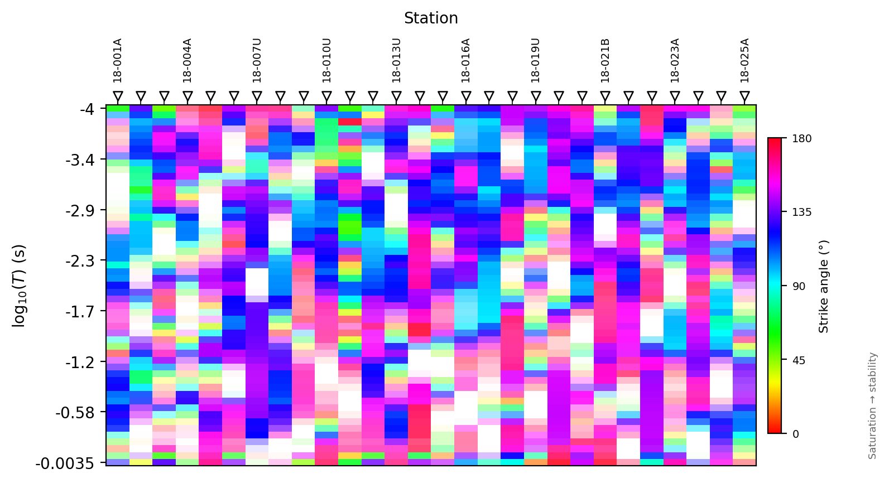
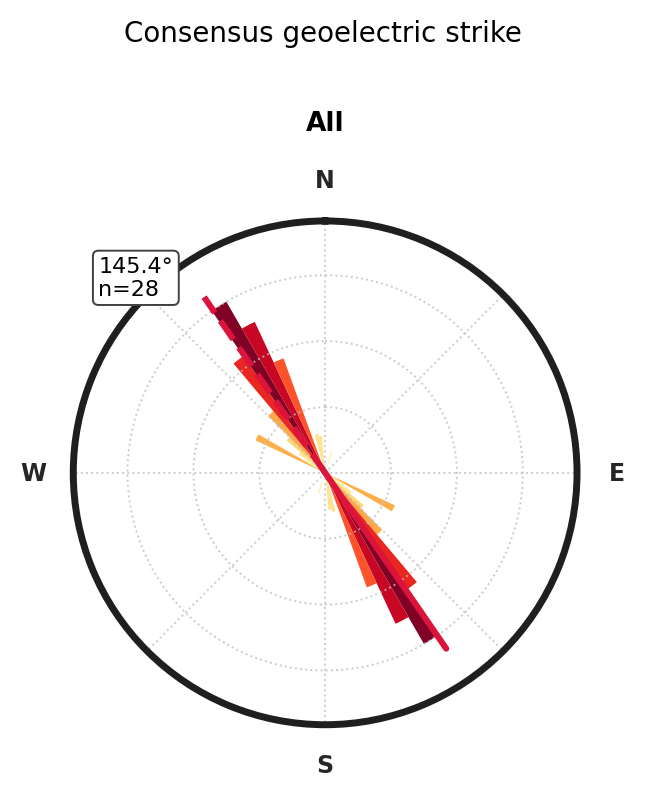
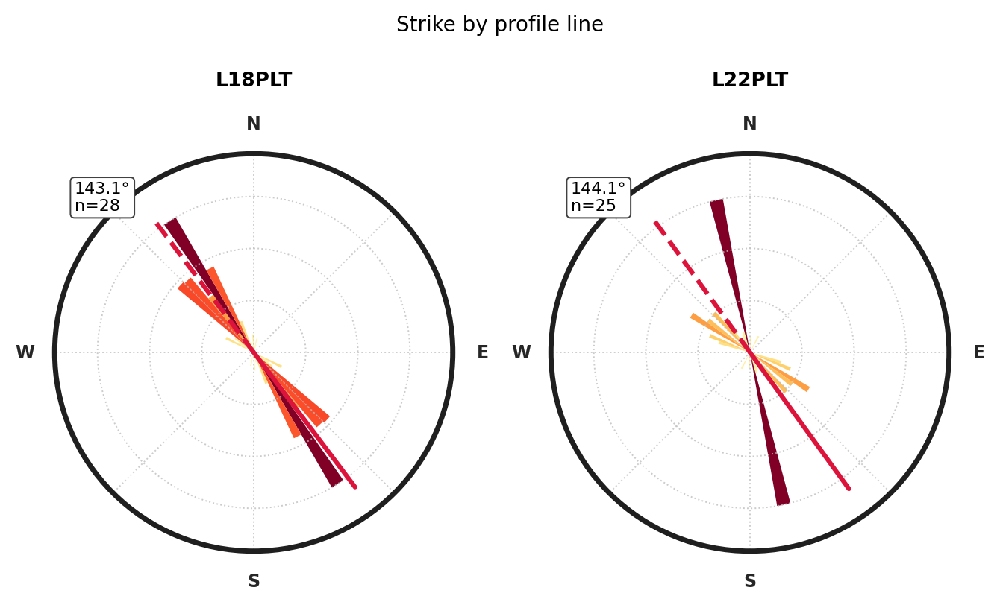
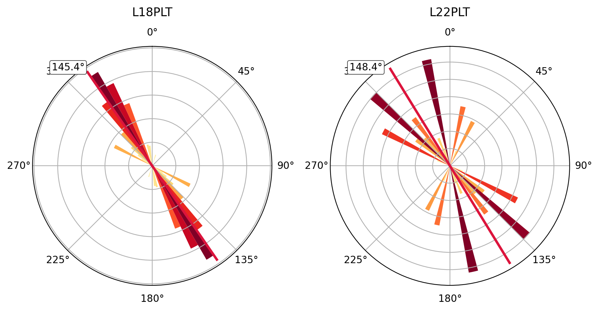
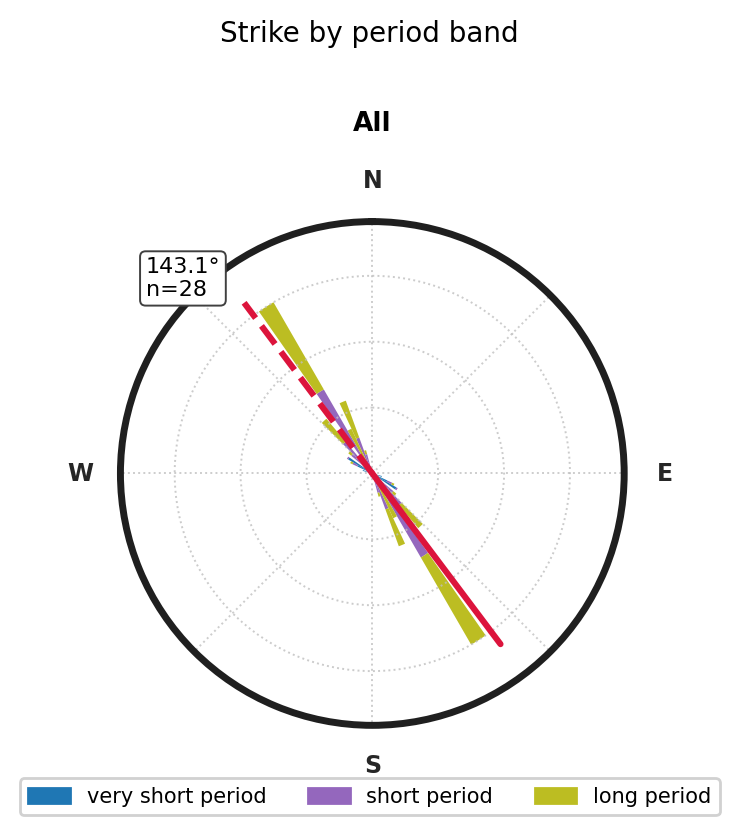
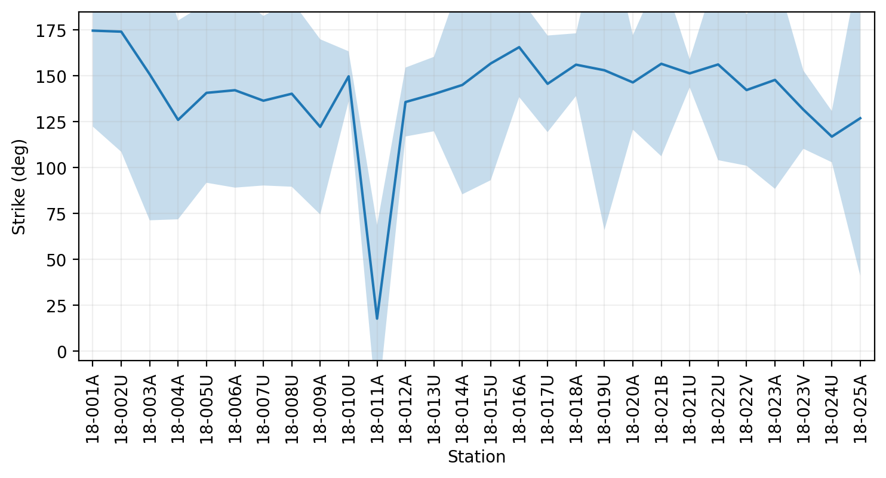
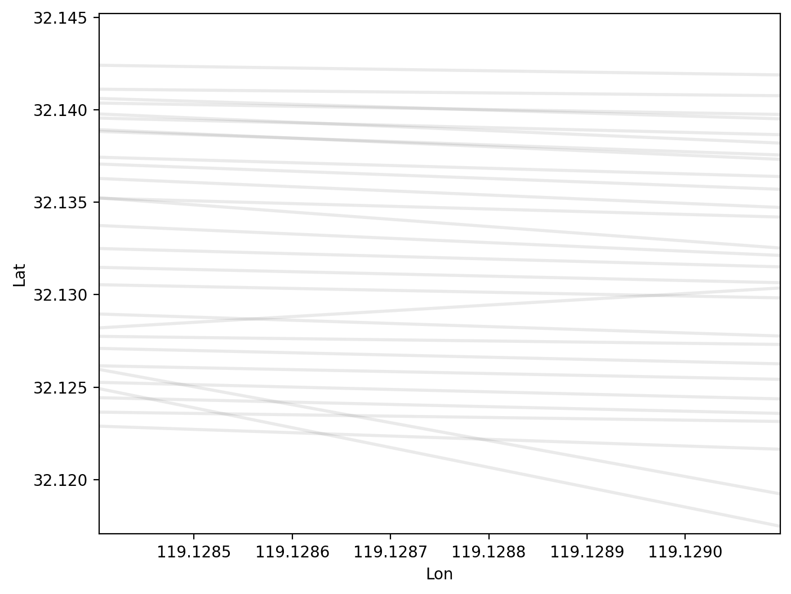
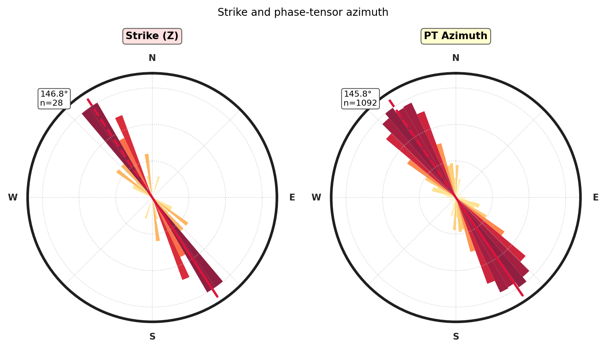

.. _emtools_strike:

Geoelectric Strike
==================

:term:`Geoelectric strike` is the preferred 2-D structural direction
inferred from electromagnetic data.  It is one of the checks you make
before rotating impedances, preparing 2-D inversion inputs, or
interpreting :term:`TE mode` and :term:`TM mode` responses.  In
pyCSAMT, the strike tools estimate the direction from impedance
rotation, :term:`phase tensor` azimuth, or a consensus of both, then
visualize the result as tables, profiles, ribbons, map-sticks, and rose
diagrams.

Strike angles are axial.  A strike of ``0`` degrees and a strike of
``180`` degrees are the same geological direction.  For that reason,
pyCSAMT reports station-level strike in the compact ``[-90, 90]`` range
for estimator tables, while rose diagrams fold angles into ``0`` to
``180`` and mirror the histogram around the full polar circle.

The wrapping used throughout the strike tools is

.. math::

   \operatorname{wrap}_{90}(\theta)
   =
   ((\theta + 90^\circ) \bmod 180^\circ) - 90^\circ .

Here :math:`\theta` is any strike angle in degrees.  This convention
keeps equivalent axes, such as :math:`-80^\circ` and :math:`100^\circ`,
on the same branch before station medians, differences, or plots are
computed.

Use this page when you need to answer concrete processing questions:

.. list-table::
   :header-rows: 1
   :widths: 30 32 38

   * - Question
     - Main tools
     - Output
   * - What strike does each station prefer?
     - ``estimate_strike_sweep``,
       ``estimate_strike_phase_tensor``,
       ``estimate_strike_consensus``
     - One row per station with angle, stability, period band, and sample
       count.
   * - Does strike change with period?
     - ``strike_curve_sweep``, ``plot_strike_ribbon``
     - One angle per station and frequency, plus a ribbon image.
   * - What strike should I rotate to?
     - ``rotate_to_strike``
     - A corrected ``Sites`` object, with impedance tensors rotated by the
       selected station-level angles.
   * - How do lines or bands compare?
     - ``plot_strike_rose``, ``plot_strike_rose_by_line``
     - Axial rose diagrams with weighted mean directions.
   * - Is the strike spatially coherent?
     - ``plot_strike_profile``, ``plot_strike_mapsticks``
     - Along-line and geographic views.
   * - How does Z strike compare with phase tensor and tipper direction?
     - ``plot_strike_analysis``
     - Three-panel strike, PT azimuth, and tipper rose diagram.

The examples use the public two-level import style:
``from pycsamt.emtools import ...``.

Load Data
---------

Load the survey with ``ensure_sites`` first.  This gives every strike
function the same clean input and avoids repeating EDI parsing options in
every call.

.. code-block:: python
   :linenos:

   from pathlib import Path

   from pycsamt.emtools import ensure_sites

   edi_dir = Path("data/AMT/WILLY_DATA/L18PLT")
   sites = ensure_sites(edi_dir, recursive=True, verbose=0)

For map and profile plots, coordinates matter.  ``plot_strike_profile``
can order stations by ``"lon"``, ``"lat"``, ``"name"``, or ``"auto"``.
Choose the ordering that matches the survey line, not merely the default.
For a north-south line, ``sort_by="lat"`` is often the clearer choice.
For an east-west line, ``sort_by="lon"`` is usually better.

Station-Level Estimators
------------------------

pyCSAMT provides three station-level strike estimators.  They all return
a ``pandas.DataFrame`` with the same practical columns:

.. list-table::
   :header-rows: 1
   :widths: 20 80

   * - Column
     - Meaning
   * - ``station``
     - Station identifier.
   * - ``ang``
     - Estimated strike angle in degrees, wrapped into ``[-90, 90]``.
   * - ``iqr``
     - Interquartile range of the frequency-level estimates used to
       summarize the station.  Smaller values mean a more stable strike.
   * - ``lo`` and ``hi``
     - Period-band limits in seconds used by the estimate.
   * - ``n``
     - Number of frequency samples used.

The impedance sweep rotates each tensor through a grid of trial angles
and chooses the angle that optimizes a metric.

For a trial angle :math:`\alpha`, the impedance tensor is rotated as

.. math::

   \mathbf{Z}'(\alpha, f)
   =
   \mathbf{R}(\alpha)\,\mathbf{Z}(f)\,\mathbf{R}(\alpha)^T,
   \qquad
   \mathbf{R}(\alpha)
   =
   \begin{bmatrix}
   \cos \alpha & \sin \alpha \\
   -\sin \alpha & \cos \alpha
   \end{bmatrix}.

The default sweep metric compares the diagonal and off-diagonal energy
after rotation,

.. math::

   D(\alpha, f)
   =
   \sqrt{|Z'_{xx}|^2 + |Z'_{yy}|^2},
   \qquad
   O(\alpha, f)
   =
   \sqrt{|Z'_{xy}|^2 + |Z'_{yx}|^2},

.. math::

   S(\alpha, f)
   =
   \frac{D(\alpha, f)}{O(\alpha, f) + \varepsilon}.

The frequency-level strike is the trial angle that minimizes
:math:`S(\alpha, f)`.  The station-level value reported as ``ang`` is
the axial median of those frequency-level angles inside the selected
period band, after unwrapping jumps across the :math:`\pm 90^\circ`
boundary.  The reported ``iqr`` is the interquartile range of the same
unwrapped angle population.

.. code-block:: python
   :linenos:

   import numpy as np

   from pycsamt.emtools import estimate_strike_sweep

   sweep = estimate_strike_sweep(
       sites,
       angles=np.arange(-90.0, 91.0, 1.0),
       metric="diag_ratio",
       band=(0.001, 10.0),
   )

   print(sweep[["station", "ang", "iqr", "n"]])

.. code-block:: text

       station   ang    iqr   n
   0   18-001A  34.0  175.5  39
   1   18-002U  32.0  248.5  39
   2   18-003A -21.0  305.5  39
   3   18-004A -67.0  199.0  39
   4   18-005U -36.0  181.0  39
   5   18-006A -33.0  185.5  39
   6   18-007U -41.0  165.0  39
   7   18-008U -34.0  169.5  39
   8   18-009A -75.0  177.0  39
   9   18-010U -17.0   35.5  39
   10  18-011A  76.0  185.0  39
   11  18-012A -49.0   49.0  39
   12  18-013U -38.0   49.5  39
   13  18-014A -47.0  165.5  39
   14  18-015U -13.0   85.0  39
   15  18-016A  -8.0   84.0  39
   16  18-017U -42.0   77.5  39
   17  18-018A -14.0   55.0  39
   18  18-019U -22.0  322.5  39
   19  18-020A -37.0   96.5  39
   20  18-021B -25.0  104.0  39
   21  18-021U -29.0   24.5  39
   22  18-022U -19.0   56.0  39
   23  18-022V -53.0  146.5  39
   24  18-023A -23.0   82.0  39
   25  18-023V -46.0   45.0  39
   26  18-024U -75.0   44.0  39
   27  18-025A -66.0  319.0  39

The default ``metric="diag_ratio"`` searches for the rotation that
minimizes diagonal energy relative to off-diagonal energy.  This is a
useful impedance-based strike diagnostic, but it can be sensitive to
noise, 3-D effects, and weak diagonal/off-diagonal contrast.

The phase-tensor estimator summarizes the phase tensor ``theta`` angle.
It is often more stable than a raw impedance sweep because the
:term:`phase tensor` is less affected by :term:`static shift` amplitude
distortion.

Writing the complex impedance as
:math:`\mathbf{Z}=\mathbf{X}+i\mathbf{Y}`, the phase tensor is

.. math::

   \boldsymbol{\Phi}(f) = \mathbf{X}(f)^{-1}\mathbf{Y}(f).

Static shift changes real apparent-resistivity amplitudes, but it does
not multiply :math:`\mathbf{X}` and :math:`\mathbf{Y}` by different
factors.  The phase tensor therefore preserves directional phase
information that is often cleaner than the amplitude-sensitive sweep.
``estimate_strike_phase_tensor`` takes the tensor azimuth
:math:`\theta_{\Phi}(f)` at each frequency and reports its robust axial
median over the chosen period band.

.. code-block:: python
   :linenos:

   from pycsamt.emtools import estimate_strike_phase_tensor

   pt = estimate_strike_phase_tensor(
       sites,
       band=(0.001, 10.0),
       robust=True,
   )

   print(pt[["station", "ang", "iqr", "n"]])

.. code-block:: text

       station        ang         iqr   n
   0   18-001A -44.641194   33.507488  39
   1   18-002U -43.757578   13.310763  39
   2   18-003A -37.153258   12.725693  39
   3   18-004A -40.889492   17.540830  39
   4   18-005U -42.404158   14.929706  39
   5   18-006A -42.558905   26.757145  39
   6   18-007U -45.967488   19.748005  39
   7   18-008U -45.374795   33.130660  39
   8   18-009A -40.484848   13.871500  39
   9   18-010U -43.432226   19.080351  39
   10  18-011A -40.391078   18.967773  39
   11  18-012A -39.419545   26.067880  39
   12  18-013U -41.742580   31.608457  39
   13  18-014A -22.821394   72.754984  39
   14  18-015U -33.387647  169.387460  39
   15  18-016A -20.658294   24.764908  39
   16  18-017U -26.561809   27.729096  39
   17  18-018A -33.728193   13.362541  39
   18  18-019U -31.821680   25.741787  39
   19  18-020A -30.044215    6.472585  39
   20  18-021B -21.755190   97.461766  39
   21  18-021U -28.191808    6.079438  39
   22  18-022U -28.484481  152.548514  39
   23  18-022V -22.375149   18.359603  39
   24  18-023A -41.324136  155.368896  39
   25  18-023V -50.745390   40.183828  39
   26  18-024U -51.114376   11.877314  39
   27  18-025A -40.069989   24.228480  39

The consensus estimator blends the sweep and phase-tensor estimates.
Use it when neither method should dominate the processing decision.

Before blending, pyCSAMT places both angles on the same axial branch.  A
two-estimator consensus can be read as

.. math::

   \theta_\mathrm{cons}
   =
   \operatorname{wrap}_{90}
   \left(
   w_s\,\tilde{\theta}_s
   +
   w_\Phi\,\tilde{\theta}_\Phi
   \right),

where :math:`\tilde{\theta}_s` is the unwrapped sweep estimate,
:math:`\tilde{\theta}_\Phi` is the unwrapped phase-tensor estimate, and
:math:`w_s` and :math:`w_\Phi` are the sweep and phase-tensor weights.
Use weights that sum to one when you want the consensus to remain a
direct weighted average.

.. code-block:: python
   :linenos:

   from pycsamt.emtools import estimate_strike_consensus

   consensus = estimate_strike_consensus(
       sites,
       band=(0.001, 10.0),
       w_sweep=0.4,
       w_pt=0.6,
       metric="diag_ratio",
   )

   print(consensus[["station", "ang", "iqr", "n"]])

.. code-block:: text

       station        ang         iqr   n
   0   18-001A -13.184716  104.503744  78
   1   18-002U -13.454547  130.905381  78
   2   18-003A -30.691955  159.112846  78
   3   18-004A -51.333695  108.270415  78
   4   18-005U -39.842495   97.964853  78
   5   18-006A -38.735343  106.128573  78
   6   18-007U -43.980493   92.374002  78
   7   18-008U -40.824877  101.315330  78
   8   18-009A -54.290909   95.435750  78
   9   18-010U -32.859336   27.290176  78
   10  18-011A   6.165353  101.983886  78
   11  18-012A -43.251727   37.533940  78
   12  18-013U -40.245548   40.554228  78
   13  18-014A -32.492836  119.127492  78
   14  18-015U -25.232588  127.193730  78
   15  18-016A -15.594976   54.382454  78
   16  18-017U -32.737085   52.614548  78
   17  18-018A -25.836916   34.181271  78
   18  18-019U -27.893008  174.120894  78
   19  18-020A -32.826529   51.486293  78
   20  18-021B -23.053114  100.730883  78
   21  18-021U -28.515085   15.289719  78
   22  18-022U -24.690689  104.274257  78
   23  18-022V -34.625089   82.429802  78
   24  18-023A -33.994482  118.684448  78
   25  18-023V -48.847234   42.591914  78
   26  18-024U -60.668626   27.938657  78
   27  18-025A -50.441993  171.614240  78

For all three tables, treat ``iqr`` as a stability warning.  A station
with an angle near ``30`` degrees and an ``iqr`` near ``80`` degrees does
not have a reliable single strike; it has a broad or frequency-dependent
strike population.

Compare Axial Angles Correctly
------------------------------

Do not compare strike estimates with ordinary subtraction unless you
first account for the ``180`` degree ambiguity.  The axial difference
between ``89`` and ``-89`` degrees is ``2`` degrees, not ``178`` degrees.
For two angles :math:`\theta_1` and :math:`\theta_2`, use

.. math::

   \Delta\theta
   =
   ((\theta_1 - \theta_2 + 90^\circ) \bmod 180^\circ)
   -
   90^\circ .

.. code-block:: python
   :linenos:

   merged = sweep.merge(
       pt,
       on="station",
       suffixes=("_sweep", "_pt"),
   )

   axial_diff = (
       (merged["ang_sweep"] - merged["ang_pt"] + 90.0) % 180.0
   ) - 90.0

   merged["abs_axial_diff"] = axial_diff.abs()

   print(
       merged[
           ["station", "ang_sweep", "ang_pt", "abs_axial_diff"]
       ].sort_values("abs_axial_diff", ascending=False)
   )

.. code-block:: text

       station  ang_sweep     ang_pt  abs_axial_diff
   0   18-001A       34.0 -44.641194       78.641194
   1   18-002U       32.0 -43.757578       75.757578
   10  18-011A       76.0 -40.391078       63.608922
   8   18-009A      -75.0 -40.484848       34.515152
   23  18-022V      -53.0 -22.375149       30.624851
   9   18-010U      -17.0 -43.432226       26.432226
   3   18-004A      -67.0 -40.889492       26.110508
   27  18-025A      -66.0 -40.069989       25.930011
   13  18-014A      -47.0 -22.821394       24.178606
   26  18-024U      -75.0 -51.114376       23.885624
   14  18-015U      -13.0 -33.387647       20.387647
   17  18-018A      -14.0 -33.728193       19.728193
   24  18-023A      -23.0 -41.324136       18.324136
   2   18-003A      -21.0 -37.153258       16.153258
   16  18-017U      -42.0 -26.561809       15.438191
   15  18-016A       -8.0 -20.658294       12.658294
   7   18-008U      -34.0 -45.374795       11.374795
   18  18-019U      -22.0 -31.821680        9.821680
   11  18-012A      -49.0 -39.419545        9.580455
   5   18-006A      -33.0 -42.558905        9.558905
   22  18-022U      -19.0 -28.484481        9.484481
   19  18-020A      -37.0 -30.044215        6.955785
   4   18-005U      -36.0 -42.404158        6.404158
   6   18-007U      -41.0 -45.967488        4.967488
   25  18-023V      -46.0 -50.745390        4.745390
   12  18-013U      -38.0 -41.742580        3.742580
   20  18-021B      -25.0 -21.755190        3.244810
   21  18-021U      -29.0 -28.191808        0.808192

Use this pattern when comparing sweep, phase tensor, consensus, tipper
azimuth, or externally interpreted structural trends.  A naive Pearson
correlation of raw angles can be misleading because it treats the wrap
boundary as a real discontinuity.

Choose A Period Band
--------------------

The ``band`` argument is a period band in seconds.  It is available on
the station-level estimators and on the high-level plots that summarize
station-level strike.  Use it to separate shallow, high-frequency
behavior from deeper, long-period behavior.

.. code-block:: python
   :linenos:

   short_period = estimate_strike_consensus(
       sites,
       band=(0.001, 0.1),
   )

   long_period = estimate_strike_consensus(
       sites,
       band=(0.1, 10.0),
   )

   band_compare = short_period[["station", "ang", "iqr"]].merge(
       long_period[["station", "ang", "iqr"]],
       on="station",
       suffixes=("_short", "_long"),
   )

   band_compare["band_axial_diff"] = (
       (band_compare["ang_short"] - band_compare["ang_long"] + 90.0)
       % 180.0
   ) - 90.0

   print(band_compare)

.. code-block:: text

       station  ang_short   iqr_short   ang_long    iqr_long  band_axial_diff
   0   18-001A -54.506201   41.369421 -63.900455  123.466880         9.394254
   1   18-002U -48.985879  160.057160 -36.157439   19.623319       -12.828440
   2   18-003A  19.394690   78.014960 -22.303922   91.734047        41.698612
   3   18-004A  13.847161   90.942272 -27.625934   87.492859        41.473095
   4   18-005U   6.699252  139.105342 -32.804464    8.183583        39.503716
   5   18-006A -45.672788   25.902400 -27.695474   15.377996       -17.977315
   6   18-007U -43.969709   97.304264 -40.122137    5.186640        -3.847572
   7   18-008U  -9.158404  101.878737 -41.169270   27.580778        32.010866
   8   18-009A -54.850045   44.971449 -25.514648   51.649186       -29.335397
   9   18-010U -38.081566   29.303524 -22.194658   95.009109       -15.886908
   10  18-011A -27.725972   74.750686 -23.482145    6.419555        -4.243828
   11  18-012A -52.101381   30.124857 -24.691455   11.576741       -27.409926
   12  18-013U -45.827104   71.741797 -30.024716   12.679180       -15.802388
   13  18-014A -29.010735   47.579291  -1.990831   87.090185       -27.019904
   14  18-015U -22.291812   94.794970   1.541876  138.925951       -23.833688
   15  18-016A -44.272043   60.760395 -15.286250   92.857554       -28.985794
   16  18-017U -60.409554   37.127807  31.430982   92.784065        88.159465
   17  18-018A -23.871328   47.793334 -36.763786   97.172580        12.892458
   18  18-019U  26.599036   81.719385 -34.186076   31.783625        60.785112
   19  18-020A -60.182514   85.406263 -32.313086    3.341403       -27.869429
   20  18-021B -17.977499   83.255421 -22.009438   56.404952         4.031939
   21  18-021U -27.000027   18.589938 -29.192501    3.856444         2.192474
   22  18-022U  -5.488390  103.595335 -24.809677   54.724645        19.321287
   23  18-022V  -0.989376   80.416924 -30.666820    4.212487        29.677445
   24  18-023A -32.013201  115.048817 -16.838399   49.906991       -15.174802
   25  18-023V -49.434564   52.035662 -61.711376   86.588207        12.276812
   26  18-024U -68.098458   50.928656 -45.399175   33.879698       -22.699283
   27  18-025A -15.407326  101.090032 -39.573699   66.987043        24.166372

If short- and long-period strikes disagree strongly, do not force a
single rotation across the entire band.  Review dimensionality, static
shift, near-surface diagnostics, and the inversion band before choosing a
processing strike.

Rotate Data Onto Strike
-----------------------

``rotate_to_strike`` estimates one strike angle per station and rotates
that station's impedance tensor.  Keep the original and rotated data
separate until you have checked the result.

For station :math:`s`, the rotation applied to every frequency sample is

.. math::

   \mathbf{Z}^{\,\mathrm{rot}}_s(f)
   =
   \mathbf{R}(\theta_s)\,
   \mathbf{Z}_s(f)\,
   \mathbf{R}(\theta_s)^T,

where :math:`\theta_s` is the station-level strike selected by the
requested method.  In a 2-D interpretation this tries to place the
dominant response into the off-diagonal modes, but the formula is only a
coordinate rotation; it does not remove 3-D induction or bad data.

.. code-block:: python
   :linenos:

   from pycsamt.emtools import rotate_to_strike

   rotated = rotate_to_strike(
       sites,
       method="consensus",
       band=(0.001, 10.0),
       metric="diag_ratio",
       inplace=False,
   )

   before = estimate_strike_consensus(
       sites,
       band=(0.001, 10.0),
   )
   after = estimate_strike_consensus(
       rotated,
       band=(0.001, 10.0),
   )

   print("before mean abs strike:", before["ang"].abs().mean())
   print("after mean abs strike:", after["ang"].abs().mean())

.. code-block:: text

   before mean abs strike: 33.75926323036427
   after mean abs strike: 23.699459229145212

Valid method names are ``"consensus"``, ``"sweep"``, and ``"pt"``.
Use ``inplace=False`` while building a workflow.  It returns a rotated
copy and keeps the unrotated survey available for before/after checks.

Rotation does not make a survey 2-D by itself.  If the selected band has
high skew, unstable strike, or strong station-to-station disagreement,
the rotated tensors may still be poor 2-D inversion input.

Per-Frequency Strike Curve
--------------------------

``strike_curve_sweep`` keeps the frequency dimension instead of reducing
each station to one number.  It is useful for finding unstable bands or
stations whose strike flips with period.

.. code-block:: python
   :linenos:

   from pycsamt.emtools import strike_curve_sweep

   curve = strike_curve_sweep(
       sites,
       angles=np.arange(-90.0, 91.0, 1.0),
       metric="diag_ratio",
       smooth=5,
   )

   print(curve.head())
   print(curve.groupby("station")["ang"].agg(["median", "std", "count"]))

.. code-block:: text

       station     freq    period   ang
   0  18-001A  10400.0  0.000096  59.0
   1  18-001A   8707.0  0.000115 -78.2
   2  18-001A   7289.0  0.000137 -36.2
   3  18-001A   6102.0  0.000164  -2.2
   4  18-001A   5108.0  0.000196  -3.2
            median        std  count
   station
   18-001A   -27.4  52.458417     53
   18-002U   -45.8  60.834128     53
   18-003A   -22.4  46.238784     53
   18-004A   -21.6  50.020511     53
   18-005U   -18.6  43.659775     53
   18-006A   -37.8  34.259013     53
   18-007U   -43.8  38.061708     53
   18-008U   -47.4  45.431997     53
   18-009A   -16.0  47.725733     53
   18-010U   -18.6  44.842346     53
   18-011A    -9.8  47.598151     53
   18-012A   -40.8  39.072262     53
   18-013U   -38.0  48.110960     53
   18-014A   -24.2  32.911592     53
   18-015U   -16.4  49.769125     53
   18-016A   -46.2  33.376512     53
   18-017U   -66.0  41.357284     53
   18-018A   -19.6  37.349080     53
   18-019U   -21.8  50.727413     53
   18-020A   -31.8  31.427665     53
   18-021B   -23.2  38.380236     53
   18-021U   -33.2  36.604952     53
   18-022U   -38.8  32.873812     53
   18-022V   -37.2  38.037783     53
   18-023A   -28.6  48.879846     53
   18-023V   -40.6  33.763535     53
   18-024U   -36.2  56.412705     53
   18-025A   -29.0  54.837346     53

The table columns are ``station``, ``freq``, and ``ang``.  ``smooth``
applies a moving average to the frequency-level sweep angles before they
are wrapped back into the axial range.  Increase it only when you want a
smoother visual trend; do not use smoothing to hide genuine strike
changes.

The smoothing is applied to an unwrapped axial sequence, so a transition
near :math:`90^\circ` is treated as a continuation of the same axis
rather than a jump across the plot.  With an odd window length
:math:`m`, the displayed trend is approximately

.. math::

   \bar{\theta}_j
   =
   \operatorname{wrap}_{90}
   \left(
   \frac{1}{m}
   \sum_{k=j-h}^{j+h}\tilde{\theta}_k
   \right),
   \qquad h = \frac{m-1}{2},

where :math:`\tilde{\theta}_k` are the locally unwrapped
frequency-level sweep angles.

Ribbon Plot
-----------

``plot_strike_ribbon`` converts the per-frequency strike curve to a
station-by-period image.  Hue encodes strike angle.  Saturation encodes
local stability: desaturated colors indicate high local variance.

This makes the ribbon more than a color table.  A saturated, coherent
stripe means nearby period samples agree on the same axial direction.  A
pale or mottled interval means the local angular variance is high, so a
single strike from that interval should be treated cautiously.

.. code-block:: python
   :linenos:

   import matplotlib.pyplot as plt

   from pycsamt.emtools import plot_strike_ribbon

   ax = plot_strike_ribbon(
       sites,
       method="sweep",
       win=5,
       show_colorbar=True,
   )
   ax.figure.savefig("strike_ribbon.png", dpi=200, bbox_inches="tight")
   plt.close(ax.figure)

Use the ribbon before selecting a single strike for a broad period band.
If the ribbon changes color systematically from short period to long
period, the survey may need band-specific interpretation.

Rose Diagrams
-------------

``plot_strike_rose`` draws axial strike histograms.  It mirrors the
``0`` to ``180`` degree histogram around the full circle, so both halves
of the polar plot represent the same set of axes.

When inverse-IQR weighting is requested, stations with stable frequency
behavior carry more weight:

.. math::

   w_s = \frac{1}{|\operatorname{IQR}_s| + \varepsilon}.

The rose mean is computed as an axial mean, not an ordinary circular
mean.  Internally this is equivalent to doubling the angles, averaging
the unit vectors, and halving the result:

.. math::

   \bar{\theta}
   =
   \frac{1}{2}
   \operatorname{atan2}
   \left(
   \sum_s w_s \sin 2\theta_s,\,
   \sum_s w_s \cos 2\theta_s
   \right).

.. code-block:: python
   :linenos:

   import matplotlib.pyplot as plt

   from pycsamt.emtools import plot_strike_rose

   fig = plot_strike_rose(
       sites,
       method="consensus",
       band=(0.001, 10.0),
       bins=36,
       weight="inv_iqr",
       suptitle="Consensus geoelectric strike",
   )
   fig.savefig("strike_rose_consensus.png", dpi=200, bbox_inches="tight")
   plt.close(fig)

``weight="inv_iqr"`` down-weights stations whose strike varies strongly
with frequency.  Use ``weight="uniform"`` when every station should
contribute equally.

When ``groups`` is omitted, pyCSAMT attempts to group stations by a
profile-like station-name prefix.  This works for names such as
``E1S01`` because the inferred group is ``E1``.  For station names that
do not encode the line this way, pass an explicit mapping.

.. code-block:: python
   :linenos:

   from pathlib import Path

   line18 = sorted(Path("data/AMT/WILLY_DATA/L18PLT").glob("*.edi"))
   line22 = sorted(Path("data/AMT/WILLY_DATA/L22PLT").glob("*.edi"))

   groups = {
       "L18PLT": [path.stem for path in line18],
       "L22PLT": [path.stem for path in line22],
   }

   fig = plot_strike_rose(
       line18 + line22,
       groups=groups,
       method="consensus",
       bins=36,
       n_cols=2,
       suptitle="Strike by profile line",
   )
   fig.savefig("strike_rose_profiles.png", dpi=200, bbox_inches="tight")
   plt.close(fig)

``plot_strike_rose_by_line`` is a simpler line-comparison helper.  It
requires at least two stations per group; if automatic grouping produces
only singleton groups, pass the explicit ``groups`` dictionary yourself.

.. code-block:: python
   :linenos:

   from pycsamt.emtools import plot_strike_rose_by_line

   fig = plot_strike_rose_by_line(
       line18 + line22,
       groups=groups,
       method="consensus",
       band=(0.001, 10.0),
       weight="inv_iqr",
   )
   fig.savefig("strike_rose_by_line.png", dpi=200, bbox_inches="tight")
   plt.close(fig)

Frequency-Band Roses
--------------------

Use ``bar_style="bands"`` when you want one rose diagram to show several
period bands.  Each band contributes its own stacked histogram.

.. code-block:: python
   :linenos:

   fig = plot_strike_rose(
       sites,
       method="consensus",
       bar_style="bands",
       freq_bands=[
           (0.001, 0.01),
           (0.01, 0.1),
           (0.1, 10.0),
       ],
       band_labels=[
           "very short period",
           "short period",
           "long period",
       ],
       suptitle="Strike by period band",
   )
   fig.savefig("strike_rose_bands.png", dpi=200, bbox_inches="tight")
   plt.close(fig)

If the bands stack around different mean directions, report the
band-specific behavior instead of collapsing it to one survey-wide
number.

Profile And Map-Stick Views
---------------------------

``plot_strike_profile`` shows strike angle along station order with an
IQR ribbon.  It is the best quick check for station-to-station
coherence.

.. code-block:: python
   :linenos:

   import matplotlib.pyplot as plt

   from pycsamt.emtools import plot_strike_profile

   ax = plot_strike_profile(
       sites,
       method="consensus",
       band=(0.001, 10.0),
       sort_by="lat",
   )
   ax.figure.savefig("strike_profile.png", dpi=200, bbox_inches="tight")
   plt.close(ax.figure)

The profile plot uses ``ang`` as the line and ``iqr`` as the uncertainty
ribbon.  A coherent 2-D line should not show random jumps from station to
station unless there is a real geological or data-quality reason.

``plot_strike_mapsticks`` draws a short line segment at each station
coordinate, oriented along the estimated strike.  It is useful for
checking whether nearby stations point in a consistent direction.

.. code-block:: python
   :linenos:

   import matplotlib.pyplot as plt

   from pycsamt.emtools import plot_strike_mapsticks

   ax = plot_strike_mapsticks(
       sites,
       method="consensus",
       band=(0.001, 10.0),
       len_deg=0.02,
   )
   lats = [site.coords[0] for site in sites if site.coords]
   lons = [site.coords[1] for site in sites if site.coords]
   lon_pad = (max(lons) - min(lons)) * 0.15
   lat_pad = (max(lats) - min(lats)) * 0.15
   ax.set_xlim(min(lons) - lon_pad, max(lons) + lon_pad)
   ax.set_ylim(min(lats) - lat_pad, max(lats) + lat_pad)
   ax.set_aspect("auto", adjustable="box")
   ax.ticklabel_format(axis="x", style="plain", useOffset=False)
   ax.figure.savefig("strike_mapsticks.png", dpi=200, bbox_inches="tight")
   plt.close(ax.figure)

The ``len_deg`` value is a display length in coordinate degrees, not a
geological length.  Adjust it for readability when the survey extent is
very small or very large.

Combined Strike Analysis
------------------------

``plot_strike_analysis`` creates a three-panel rose figure: impedance
strike, phase-tensor azimuth, and :term:`tipper` strike.  The tipper
panel is empty when the data do not contain vertical magnetic transfer
functions.

For tipper vectors, pyCSAMT uses the real induction vector direction

.. math::

   \theta_T
   =
   \operatorname{atan2}
   \left(
   \Re(T_{zy}),\,
   \Re(T_{zx})
   \right)
   \bmod 180^\circ ,

where :math:`T_{zx}` and :math:`T_{zy}` are the horizontal magnetic-field
transfer functions into the vertical magnetic component.  Compare this
azimuth with impedance and phase-tensor strike as an independent
directional diagnostic, not as a guaranteed rotation angle.

.. code-block:: python
   :linenos:

   import matplotlib.pyplot as plt

   from pycsamt.emtools import plot_strike_analysis

   fig = plot_strike_analysis(
       sites,
       method="consensus",
       band=(0.001, 10.0),
       bins=36,
       suptitle="Strike, phase tensor, and tipper azimuth",
   )
   fig.savefig("strike_analysis.png", dpi=200, bbox_inches="tight")
   plt.close(fig)

Use this figure as a consistency check.  If Z strike and phase-tensor
azimuth cluster around the same axial direction, confidence increases.
If tipper strike is available and points somewhere else, investigate
regional 3-D structure, coast effects, cultural noise, or sign
convention before choosing a rotation angle.

Recommended Workflow
--------------------

A robust strike workflow keeps estimation, comparison, visualization, and
rotation separate:

.. code-block:: python
   :linenos:

   from pathlib import Path

   import matplotlib.pyplot as plt
   import numpy as np

   from pycsamt.emtools import (
       ensure_sites,
       estimate_strike_consensus,
       estimate_strike_phase_tensor,
       estimate_strike_sweep,
       plot_strike_profile,
       plot_strike_rose,
       rotate_to_strike,
   )

   sites = ensure_sites(
       Path("data/AMT/WILLY_DATA/L18PLT"),
       recursive=True,
   )

   band = (0.001, 10.0)

   sweep = estimate_strike_sweep(
       sites,
       band=band,
       angles=np.arange(-90.0, 91.0, 1.0),
   )
   pt = estimate_strike_phase_tensor(sites, band=band)
   consensus = estimate_strike_consensus(
       sites,
       band=band,
       w_sweep=0.4,
       w_pt=0.6,
   )

   comparison = consensus[["station", "ang", "iqr"]].merge(
       pt[["station", "ang", "iqr"]],
       on="station",
       suffixes=("_consensus", "_pt"),
   )
   comparison["consensus_pt_diff"] = (
       (comparison["ang_consensus"] - comparison["ang_pt"] + 90.0)
       % 180.0
   ) - 90.0

   comparison.to_csv("strike_comparison.csv", index=False)
   consensus.to_csv("strike_consensus.csv", index=False)

   ax = plot_strike_profile(
       sites,
       method="consensus",
       band=band,
       sort_by="lat",
   )
   ax.figure.savefig(
       "strike_recommended_profile.png",
       dpi=200,
       bbox_inches="tight",
   )
   plt.close(ax.figure)

   fig = plot_strike_rose(
       sites,
       method="consensus",
       band=band,
       weight="inv_iqr",
   )
   fig.savefig("strike_recommended_rose.png", dpi=200, bbox_inches="tight")
   plt.close(fig)

   stable = consensus["iqr"].median() < 45.0
   if stable:
       rotated = rotate_to_strike(
           sites,
           method="consensus",
           band=band,
           inplace=False,
       )

.. grid:: 2
   :gutter: 2

   .. grid-item::

      .. image:: ../../images/user_guide/emtools/user-guide-emtools-strike-17-01.png
         :width: 100%

   .. grid-item::

      .. image:: ../../images/user_guide/emtools/user-guide-emtools-strike-17-02.png
         :width: 100%

The ``stable`` threshold in this example is only a processing rule of
thumb.  Choose the final threshold based on survey purpose, dimensionality
diagnostics, period band, and inversion assumptions.

Common Pitfalls
---------------

Strike has a ``180`` degree ambiguity.  Always compare angles with an
axial difference formula.

``iqr`` is not decoration.  A high-IQR strike is unstable across
frequency and should not be used blindly as a rotation angle.

The period band is part of the result.  A strike estimated over
``(0.001, 0.1)`` seconds may not match a strike estimated over
``(0.1, 10.0)`` seconds.

Automatic rose grouping depends on station names.  If your station names
do not encode line membership, pass ``groups`` explicitly.

``rotate_to_strike`` rotates by station-level estimates.  It does not
guarantee a single regional strike, and it does not remove 3-D structure.

Map-stick plots require usable station coordinates.  If no coordinates
are available, use profile and rose diagrams instead.

Worked Example
--------------

The gallery example uses L18PLT, adds L22PLT for a multi-line rose
comparison, demonstrates estimator agreement, rotates data onto strike,
and builds ribbon, rose, map-stick, profile, and combined strike-analysis
figures.

Open the rendered gallery page here:
:ref:`sphx_glr_examples_emtools_plot_strike.py`.
