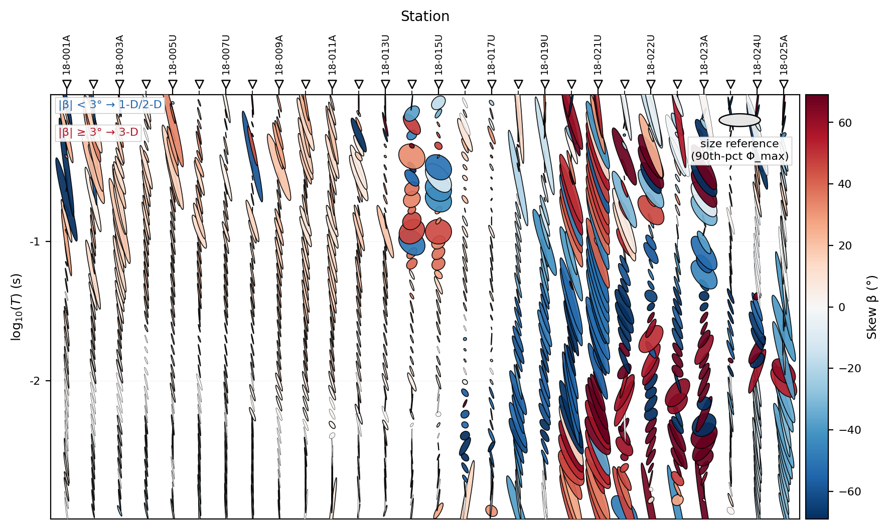
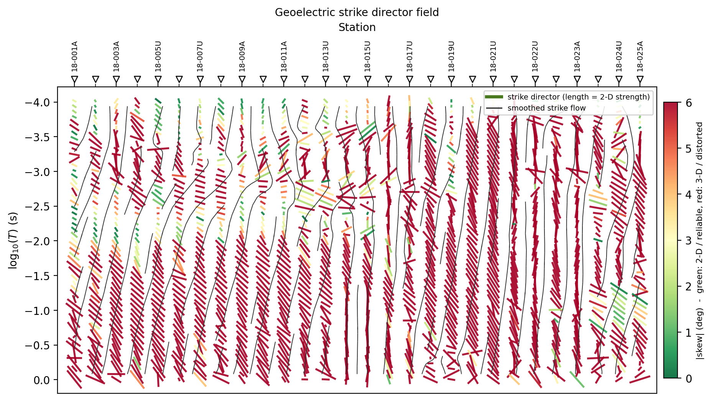
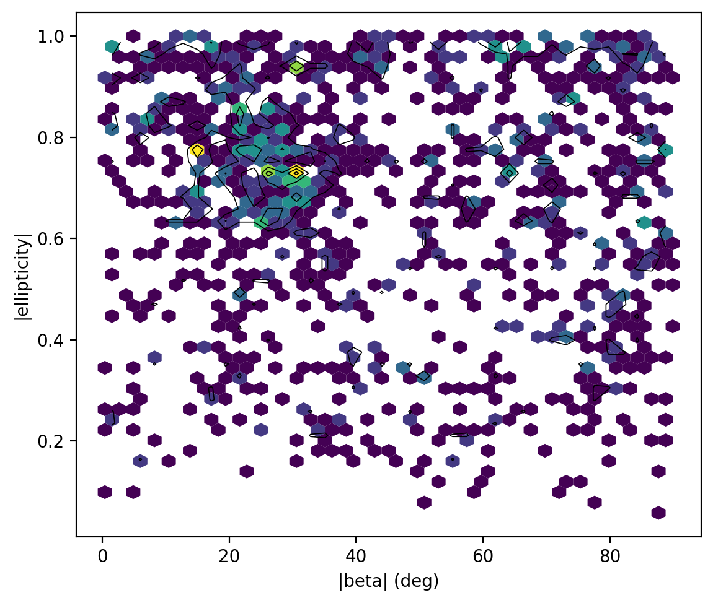
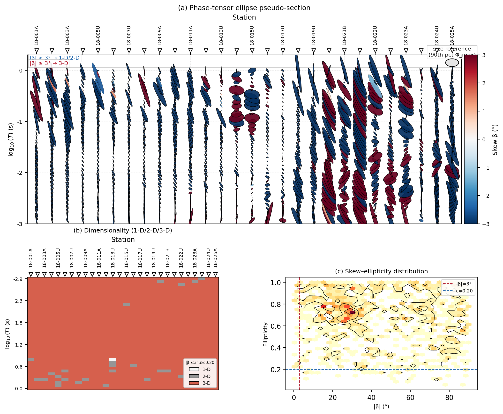
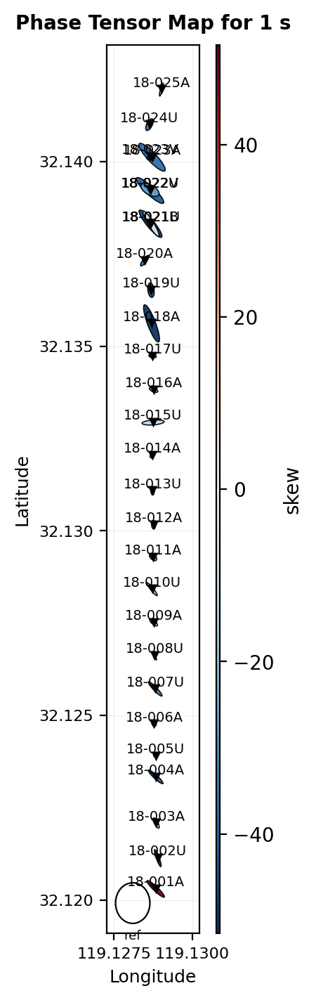
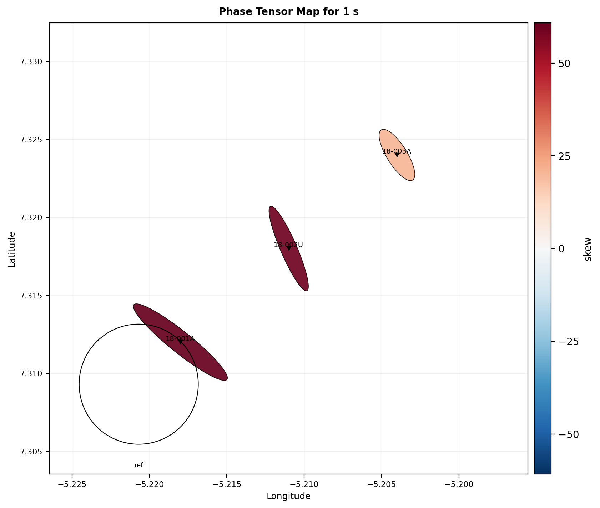
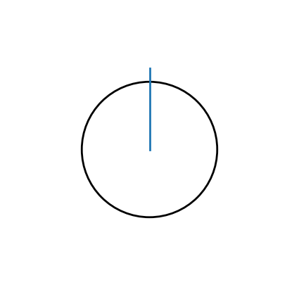
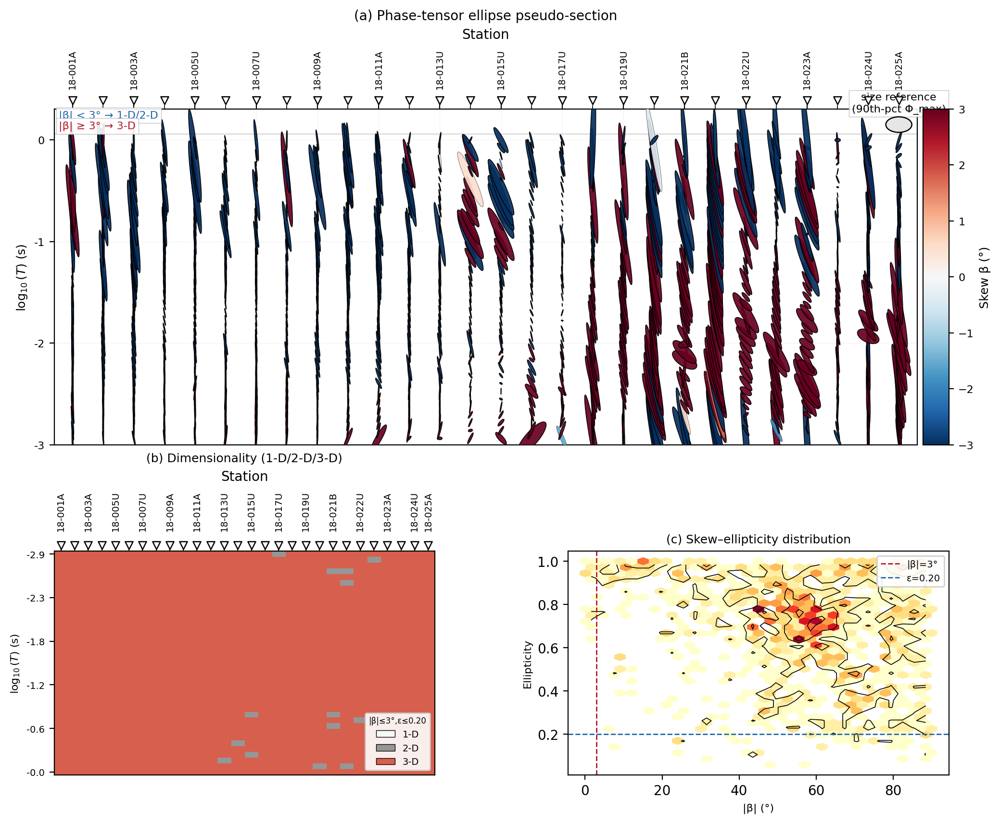

.. _emtools_tensor:

Phase Tensor And Impedance Tensor Tools
=======================================

The tensor page is one of the central pages in the pyCSAMT user guide
because it connects interpretation and preprocessing.  The same
impedance tensor ``Z`` supports apparent resistivity, phase, skew,
geoelectric strike, static-shift checks, dimensionality checks, and 2-D
rotation decisions.  The ``pycsamt.emtools`` tensor tools expose two
main workflows:

.. list-table::
   :header-rows: 1
   :widths: 30 32 38

   * - Workflow
     - Main tools
     - Purpose
   * - Phase-tensor interpretation
     - ``build_phase_tensor_table``,
       ``plot_phase_tensor_psection``,
       ``plot_phase_tensor_map``,
       ``plot_phase_tensor_summary``
     - Diagnose dimensionality, strike, skew, ellipticity, and spatial
       coherence without being dominated by static-shift amplitude.
   * - Impedance-tensor editing
     - ``rotate``, ``rotate_by_map``, ``rotate_z_to_strike``,
       ``antisymmetrize``, ``orient_from_sensors``, ``sigma_clip_z``,
       ``balance_offdiag``, ``invert``
     - Apply deliberate preprocessing operations to ``Z`` before
       inversion, plotting, or compatibility with a 2-D assumption.

The phase tensor follows the Caldwell et al. style decomposition.  For
each frequency, pyCSAMT splits the impedance tensor into real and
imaginary parts, then computes the phase tensor
``Phi = real(Z)^-1 imag(Z)`` and its invariants.
Writing

.. math::

   Z = X + iY,
   \qquad
   X = \Re(Z), \quad Y = \Im(Z),

the phase tensor is

.. math::

   \Phi = X^{-1}Y .

If :math:`X` is singular, pyCSAMT falls back to a pseudo-inverse.  The
important interpretation point is that :math:`\Phi` is built from a
ratio of the imaginary and real impedance parts.  A real, frequency
independent static-shift multiplier scales :math:`X` and :math:`Y`
together, so it largely cancels in :math:`X^{-1}Y`.  That is why phase
tensor plots are such useful companions to apparent-resistivity and
static-shift diagnostics.

The examples in this guide use public two-level imports from
``pycsamt.emtools``.  One name needs special attention:
``pycsamt.emtools.rotate_to_strike`` belongs to the strike module, while
the tensor module's own rotation-to-strike helper is exported as
``rotate_z_to_strike``.

Load Data
---------

Start with the canonical loader.  It returns a ``Sites`` object and skips
stations without valid impedance data.

.. code-block:: python
   :linenos:

   from pathlib import Path

   from pycsamt.emtools import ensure_sites

   edi_dir = Path("data/AMT/WILLY_DATA/L18PLT")
   sites = ensure_sites(
       edi_dir,
       recursive=True,
       on_dup="replace",
       strict=False,
       verbose=0,
   )

Keep ``sites`` as the unmodified reference object.  Tensor editing
functions can return corrected copies when ``inplace=False``, so it is
easy to compare original and edited data.

Build The Phase-Tensor Table
----------------------------

``build_phase_tensor_table`` is the foundation for the plotting tools.
It returns one row per station and frequency.
For a phase tensor

.. math::

   \Phi =
   \begin{bmatrix}
   a & b \\
   c & d
   \end{bmatrix},

pyCSAMT reports the Caldwell-style angles

.. math::

   \beta =
   \frac{1}{2}
   \tan^{-1}
   \left(
   \frac{b+c}{a-d}
   \right),
   \qquad
   \alpha =
   \frac{1}{2}
   \tan^{-1}
   \left(
   \frac{-(b-c)}{a+d}
   \right),

using ``atan2`` internally so the quadrant is preserved.  The table
stores ``beta`` again as ``skew``.  The principal values :math:`\phi_{\max}`
and :math:`\phi_{\min}` are the singular values of :math:`\Phi`; these
appear in the table as ``s1`` and ``s2``.  The ellipse orientation
``theta`` is the angle of the dominant left singular vector.  Since an
ellipse has no arrow head, ``theta`` is axial: :math:`\theta` and
:math:`\theta+180^\circ` describe the same direction.

The ellipticity is

.. math::

   e =
   \frac{\phi_{\max}-\phi_{\min}}
        {\phi_{\max}+\phi_{\min}+\epsilon}.

Values near zero are close to circular.  Larger values mean the tensor
has a stronger preferred axis, but that axis should still be read
together with skew and period stability.

.. code-block:: python
   :linenos:

   from pycsamt.emtools import build_phase_tensor_table
   pt = build_phase_tensor_table(
       sites,
       recursive=False,
   )
   print(pt.head())
   print(pt[["station", "freq", "period", "theta", "skew", "ellipt"]])

.. code-block:: text

      station     freq    period  ...       beta       skew    ellipt
   0  18-001A  10400.0  0.000096  ... -56.700714 -56.700714  0.194909
   1  18-001A   8707.0  0.000115  ... -54.693184 -54.693184  0.210163
   2  18-001A   7289.0  0.000137  ... -51.452210 -51.452210  0.213894
   3  18-001A   6102.0  0.000164  ... -61.983725 -61.983725  0.212655
   4  18-001A   5108.0  0.000196  ... -60.874439 -60.874439  0.425503
   [5 rows x 10 columns]
         station       freq    period       theta       skew    ellipt
   0     18-001A  10400.000  0.000096  120.687698 -56.700714  0.194909
   1     18-001A   8707.000  0.000115  123.342495 -54.693184  0.210163
   2     18-001A   7289.000  0.000137  126.743525 -51.452210  0.213894
   3     18-001A   6102.000  0.000164  116.947420 -61.983725  0.212655
   4     18-001A   5108.000  0.000196  126.074830 -60.874439  0.425503
   ...       ...        ...       ...         ...        ...       ...
   1479  18-025A      2.052  0.487329  -34.147397 -54.498901  0.559680
   1480  18-025A      1.718  0.582072    4.537986 -41.477337  0.196258
   1481  18-025A      1.438  0.695410   40.621212 -32.840732  0.216635
   1482  18-025A      1.204  0.830565 -125.802958 -33.743310  0.527659
   1483  18-025A      1.008  0.992063 -107.576221 -21.335294  0.931748
   [1484 rows x 6 columns]

The table contains these core columns:

.. list-table::
   :header-rows: 1
   :widths: 22 78

   * - Column
     - Meaning
   * - ``station``
     - Station identifier.
   * - ``freq``
     - Frequency in hertz.
   * - ``period``
     - Period in seconds, computed as ``1 / freq``.
   * - ``s1`` and ``s2``
     - Phase-tensor principal values.  They control ellipse major and
       minor axes.
   * - ``theta``
     - Principal-axis angle, interpreted as phase-tensor strike.  It is
       axial, so directions separated by 180 degrees are equivalent.
   * - ``alpha``
     - Phase-tensor coordinate angle.
   * - ``beta`` and ``skew``
     - Skew angle.  ``skew`` is an alias for ``beta``.
   * - ``ellipt``
     - Ellipticity, computed from the principal values.  Values near zero
       are closer to circular; larger values indicate stronger 2-D
       anisotropy of the phase tensor.

The table is also the best place to audit a survey numerically before
plotting:

.. code-block:: python
   :linenos:

   summary = pt.groupby("station").agg(
       n=("freq", "count"),
       median_abs_skew=("skew", lambda values: values.abs().median()),
       median_ellipt=("ellipt", "median"),
       theta_iqr=("theta", lambda values: values.quantile(0.75) - values.quantile(0.25)),
   )
   print(summary.sort_values("median_abs_skew", ascending=False))

.. code-block:: text

             n  median_abs_skew  median_ellipt   theta_iqr
   station
   18-023A  53        67.022970       0.776955  332.406202
   18-022V  53        66.787861       0.734789   33.283984
   18-018A  53        66.547818       0.747821   19.123004
   18-022U  53        65.349813       0.765743  330.236042
   18-024U  53        63.853268       0.696343   69.080189
   18-019U  53        61.945234       0.610832   44.257571
   18-023V  53        59.306877       0.568990   39.420996
   18-025A  53        55.354566       0.666770  174.077409
   18-021U  53        55.017266       0.975587    5.728713
   18-021B  53        52.388774       0.917700   65.673584
   18-001A  53        50.326802       0.423331   15.689190
   18-020A  53        45.332864       0.890491    7.151592
   18-008U  53        40.862593       0.459678   30.040274
   18-005U  53        36.404849       0.598509   16.449050
   18-002U  53        36.059416       0.535202   16.329767
   18-014A  53        35.458520       0.735137  273.677122
   18-007U  53        34.174772       0.492508   29.303937
   18-012A  53        32.307319       0.710183   37.311060
   18-003A  53        31.245824       0.674498   23.567376
   18-004A  53        31.005169       0.683143   18.628263
   18-006A  53        30.359830       0.574245   24.700266
   18-013U  53        29.705384       0.591064   41.602228
   18-011A  53        27.534040       0.692296  261.601465
   18-010U  53        26.006304       0.676668  257.925336
   18-009A  53        25.288856       0.477635   19.936171
   18-016A  53        23.525350       0.732322  302.853539
   18-017U  53        22.912833       0.660533  269.958366
   18-015U  53        22.459269       0.721964  316.822496

Large ``median_abs_skew`` means the station is not behaving like a clean
1-D or 2-D response in that period range.  Large ``theta_iqr`` means
phase-tensor strike changes strongly with frequency, so one rotation
angle may be a poor summary.

Filter By Period
----------------

Most tensor interpretation should be tied to a period band.  A shallow
band and a deeper band can show different strike, skew, or ellipticity.

.. code-block:: pycon

   >>> period_band = (0.001, 10.0)
   >>> band_pt = pt[
   ...     (pt["period"] >= period_band[0])
   ...     & (pt["period"] <= period_band[1])
   ... ]
   >>> print("rows in band:", len(band_pt))
   rows in band: 1092
   >>> print("stations in band:", band_pt["station"].nunique())
   stations in band: 28
   >>> print("median |skew|:", band_pt["skew"].abs().median())
   median |skew|: 39.133827836405146

When you report a tensor result, always report the period band.  A map at
``period=1.0`` second and a summary over ``0.001`` to ``10.0`` seconds
answer different questions.

Read Dimensionality From Skew And Ellipticity
---------------------------------------------

A simple phase-tensor dimensionality rule uses skew and ellipticity:

.. list-table::
   :header-rows: 1
   :widths: 20 40 40

   * - Class
     - Rule
     - Interpretation
   * - 1-D
     - ``abs(skew) <= skew_threshold`` and
       ``abs(ellipt) <= ellipt_threshold``
     - Low skew and nearly circular phase tensor.
   * - 2-D
     - ``abs(skew) <= skew_threshold`` and
       ``abs(ellipt) > ellipt_threshold``
     - Low skew but elongated phase tensor.
   * - 3-D
     - ``abs(skew) > skew_threshold``
     - High skew; strike and 2-D rotation should be treated with caution.

.. code-block:: python
   :linenos:

   import numpy as np
   skew_threshold = 3.0
   ellipt_threshold = 0.2
   work = band_pt.copy()
   abs_skew = work["skew"].abs()
   abs_ellipt = work["ellipt"].abs()
   work["dimensionality"] = np.select(
       [
           (abs_skew <= skew_threshold) & (abs_ellipt <= ellipt_threshold),
           (abs_skew <= skew_threshold) & (abs_ellipt > ellipt_threshold),
       ],
       ["1D", "2D"],
       default="3D",
   )
   print(work["dimensionality"].value_counts(normalize=True))

.. code-block:: text

   dimensionality
   3D    0.975275
   2D    0.023810
   1D    0.000916
   Name: proportion, dtype: float64

The default ``3`` degree skew threshold is strict.  It is useful as a
textbook 1-D/2-D screen, but it can classify many real field samples as
3-D.  That is not a failure of the function; it is a warning about the
data and the 2-D assumption.
In compact notation, the rule used by the example is

.. math::

   \mathrm{class} =
   \begin{cases}
   \mathrm{1D}, & |\beta| \le \beta_0
      \ \mathrm{and}\ |e| \le e_0,\\
   \mathrm{2D}, & |\beta| \le \beta_0
      \ \mathrm{and}\ |e| > e_0,\\
   \mathrm{3D}, & |\beta| > \beta_0,
   \end{cases}

where :math:`\beta_0` is ``skew_threshold`` and :math:`e_0` is
``ellipt_threshold``.  The threshold is a decision rule, not a law of
nature.  For a field survey, report the threshold and the period band
with the result.

Simple Phase-Tensor Views
-------------------------

Use the simpler plots before the full ellipse plot.  They make it easy
to identify which invariant is causing the interpretation.

.. code-block:: python
   :linenos:

   import matplotlib.pyplot as plt

   from pycsamt.emtools import (
       plot_dimensionality_grid,
       plot_dimensionality_psection,
       plot_ellipticity_psection,
       plot_phase_tensor_skewmap,
       plot_theta_vs_period,
   )

   plot_theta_vs_period(sites, recursive=False)
   plt.gcf().savefig("tensor_simple_views_01.png", dpi=200, bbox_inches="tight")
   plt.close()

   plot_phase_tensor_skewmap(sites, recursive=False, axis_y="logperiod")
   plt.gcf().savefig("tensor_simple_views_02.png", dpi=200, bbox_inches="tight")
   plt.close()

   plot_ellipticity_psection(sites, recursive=False)
   plt.gcf().savefig("tensor_simple_views_03.png", dpi=200, bbox_inches="tight")
   plt.close()

   plot_dimensionality_psection(
       sites,
       skew_th=3.0,
       ellipt_th=0.2,
       recursive=False,
   )
   plt.gcf().savefig("tensor_simple_views_04.png", dpi=200, bbox_inches="tight")
   plt.close()

   plot_dimensionality_grid(
       sites,
       skew_th=3.0,
       ellipt_th=0.2,
       recursive=False,
   )
   plt.gcf().savefig("tensor_simple_views_05.png", dpi=200, bbox_inches="tight")
   plt.close()

.. grid:: 3
   :gutter: 2

   .. grid-item::

      .. image:: ../../images/user_guide/emtools/user-guide-emtools-tensor-06-01.png
         :width: 100%

   .. grid-item::

      .. image:: ../../images/user_guide/emtools/user-guide-emtools-tensor-06-02.png
         :width: 100%

   .. grid-item::

      .. image:: ../../images/user_guide/emtools/user-guide-emtools-tensor-06-03.png
         :width: 100%

   .. grid-item::

      .. image:: ../../images/user_guide/emtools/user-guide-emtools-tensor-06-04.png
         :width: 100%

   .. grid-item::

      .. image:: ../../images/user_guide/emtools/user-guide-emtools-tensor-06-05.png
         :width: 100%

``plot_theta_vs_period`` is a scatter view of strike angle by period.
It is quick, but it puts an axial angle on a linear y-axis.  Treat jumps
near the wrap boundary carefully.

``plot_phase_tensor_skewmap`` and ``plot_ellipticity_psection`` show
station-by-period heatmaps.  They are good for finding period bands that
are consistently low-skew or strongly elongated.

``plot_dimensionality_psection`` and ``plot_dimensionality_grid`` apply
the simple skew/ellipticity classification to every station-period cell.

Phase-Tensor Ellipse Pseudosection
----------------------------------

``plot_phase_tensor_psection`` is the main phase-tensor figure.  Each
cell is an ellipse:

.. list-table::
   :header-rows: 1
   :widths: 24 76

   * - Visual element
     - Meaning
   * - Major axis
     - ``s1``, the larger phase-tensor principal value.
   * - Minor axis
     - ``s2``, the smaller phase-tensor principal value.
   * - Orientation
     - ``theta``, the phase-tensor strike direction.
   * - Fill color
     - Controlled by ``c_by``.  The default is usually skew.
   * - Thick border
     - Optional marker for cells where ``abs(skew)`` exceeds
       ``skew_threshold``.

.. code-block:: python
   :linenos:

   import matplotlib.pyplot as plt

   from pycsamt.emtools import plot_phase_tensor_psection

   plot_phase_tensor_psection(
       sites,
       stations=None,
       period_range=(0.001, 10.0),
       axis_y="logperiod",
       period_up=True,
       c_by="skew",
       skew_threshold=3.0,
       mark_3d=True,
       normalise_by="cell",
       recursive=False,
   )
   plt.gcf().savefig(
       "tensor_phase_tensor_psection.png",
       dpi=200,
       bbox_inches="tight",
   )
   plt.close()

Useful ``c_by`` values include ``"skew"``, ``"beta"``, ``"theta"``,
``"ellipt"``, ``"s1"``, ``"s2"``, ``"|skew|"``, ``"phi_mean"``,
``"phi_max"``, and ``"phi_min"``.

Use ``normalise_by="cell"`` for most survey plots because it scales the
ellipses to the local plotting grid.  Use ``normalise_by="unity"`` when
you want the 45-degree, 1-D reference to have an explicit visual meaning.
Use ``normalise_by="abs"`` only when absolute ellipse sizes in data units
are intentional.

The ellipse drawn at a station-period cell has semi-axes proportional to
:math:`\phi_{\max}` and :math:`\phi_{\min}` and is rotated by :math:`\theta`.
In local plot coordinates, before normalization, the ellipse satisfies

.. math::

   \left(\frac{x'}{\phi_{\max}}\right)^2
   +
   \left(\frac{y'}{\phi_{\min}}\right)^2
   =
   1,

where

.. math::

   \begin{bmatrix} x' \\ y' \end{bmatrix}
   =
   R(-\theta)
   \begin{bmatrix} x \\ y \end{bmatrix}.

Changing ``normalise_by`` changes how those axes are scaled for display;
it does not change the phase-tensor values in the table.

Strike As A Director Field
--------------------------

``theta`` is axial.  A director field is often easier to interpret than
a scatter plot because the glyph has no arrow head and therefore
respects the 180-degree ambiguity.
For comparing two strike estimates, use an axial difference rather than
ordinary subtraction:

.. math::

   \Delta\theta =
   \left[
   (\theta_2-\theta_1+90^\circ) \bmod 180^\circ
   \right]
   - 90^\circ .

This keeps differences in the interval
:math:`[-90^\circ, 90^\circ]`.  Without this adjustment, a harmless jump
from :math:`179^\circ` to :math:`1^\circ` looks like a
:math:`178^\circ` change instead of a :math:`2^\circ` change.

.. code-block:: python
   :linenos:

   import matplotlib.pyplot as plt

   from pycsamt.emtools import plot_strike_director_field

   plot_strike_director_field(
       sites,
       color_by="skew",
       length_by="ellipt",
       skew_max=6.0,
       streamlines=True,
       period_subsample=40,
       recursive=False,
   )
   plt.gcf().savefig(
       "tensor_strike_director_field.png",
       dpi=200,
       bbox_inches="tight",
   )
   plt.close()

Interpret long, aligned, low-skew directors as a more coherent 2-D
strike signal.  Short directors mean the phase tensor is close to
circular and strike is poorly defined.  High-skew directors mean the
response is more 3-D or distorted, even if the direction looks visually
organized.

Rose And Stability Plots
------------------------

Rose plots are useful for summarizing axial direction.  Stability plots
are useful for seeing whether that summary hides period dependence.

.. code-block:: python
   :linenos:

   import matplotlib.pyplot as plt

   from pycsamt.emtools import (
       plot_phase_tensor_rose,
       plot_theta_rose_grid,
       plot_theta_stability_stripe,
   )

   plot_phase_tensor_rose(
       sites,
       band=(0.001, 10.0),
       bins=36,
       recursive=False,
   )
   plt.gcf().savefig("tensor_phase_tensor_rose.png", dpi=200, bbox_inches="tight")
   plt.close()

   plot_theta_rose_grid(
       sites,
       n_bands=6,
       bins=24,
       recursive=False,
   )
   plt.gcf().savefig("tensor_theta_rose_grid.png", dpi=200, bbox_inches="tight")
   plt.close()

   plot_theta_stability_stripe(
       sites,
       win=5,
       recursive=False,
   )
   plt.gcf().savefig(
       "tensor_theta_stability_stripe.png",
       dpi=200,
       bbox_inches="tight",
   )
   plt.close()

.. grid:: 3
   :gutter: 2

   .. grid-item::

      .. image:: ../../images/user_guide/emtools/user-guide-emtools-tensor-09-01.png
         :width: 100%

   .. grid-item::

      .. image:: ../../images/user_guide/emtools/user-guide-emtools-tensor-09-02.png
         :width: 100%

   .. grid-item::

      .. image:: ../../images/user_guide/emtools/user-guide-emtools-tensor-09-03.png
         :width: 100%

``plot_phase_tensor_rose`` folds all selected ``theta`` values into one
axial histogram.  ``plot_theta_rose_grid`` splits the period range into
equal log-width bands.  ``plot_theta_stability_stripe`` uses hue for
``theta`` and saturation for local stability.

If the rose grid changes direction from one period band to another,
avoid selecting a single strike for the entire data set.

Skew-Ellipticity Density
------------------------

``plot_skew_ellipt_density`` shows the joint distribution of
``abs(beta)`` and ``abs(ellipt)``.  It is a compact way to see whether
the data cluster in a 1-D, 2-D, or 3-D region.

.. code-block:: python
   :linenos:

   import matplotlib.pyplot as plt

   from pycsamt.emtools import plot_skew_ellipt_density

   plot_skew_ellipt_density(
       sites,
       band=(0.001, 10.0),
       gridsize=40,
       recursive=False,
   )
   plt.gcf().savefig(
       "tensor_skew_ellipt_density.png",
       dpi=200,
       bbox_inches="tight",
   )
   plt.close()

Use this plot with the dimensionality grid.  The grid tells you where
problem cells occur; the density plot tells you how the full population
is distributed.

Summary Figure
--------------

``plot_phase_tensor_summary`` combines the main ellipse pseudosection,
the dimensionality grid, and the skew-ellipticity density into one
figure.

.. code-block:: python
   :linenos:

   import matplotlib.pyplot as plt

   from pycsamt.emtools import plot_phase_tensor_summary

   fig = plot_phase_tensor_summary(
       sites,
       stations=None,
       period_range=(0.001, 10.0),
       c_by="skew",
       skew_threshold=3.0,
       ellipt_threshold=0.2,
       recursive=False,
   )
   fig.savefig("tensor_phase_tensor_summary.png", dpi=200, bbox_inches="tight")
   plt.close(fig)

This is a good report figure when the audience needs the whole
phase-tensor story in one place: what the ellipses look like, how much
of the band is 1-D/2-D/3-D, and where the skew/ellipticity population
sits.

Geographic Phase-Tensor Map
---------------------------

``plot_phase_tensor_map`` draws one phase-tensor ellipse per station at
the period nearest a requested target period.  It can also overlay tipper
arrows when vertical magnetic transfer functions are present.

.. code-block:: python
   :linenos:

   import matplotlib.pyplot as plt

   from pycsamt.emtools import plot_phase_tensor_map

   plot_phase_tensor_map(
       sites,
       period=1.0,
       c_by="skew",
       show_tipper=True,
       tipper_convention="parkinson",
       station_labels=True,
       recursive=False,
   )
   plt.gcf().savefig("tensor_phase_tensor_map.png", dpi=200, bbox_inches="tight")
   plt.close()

Use ``period`` as a target; each station uses its nearest available
period.  If the EDI headers do not provide usable coordinates, pass an
explicit ``coords`` dictionary:

.. code-block:: python
   :linenos:

   import matplotlib.pyplot as plt

   coords = {
       "18-001A": (7.312, -5.218),
       "18-002U": (7.318, -5.211),
       "18-003A": (7.324, -5.204),
   }

   plot_phase_tensor_map(
       sites,
       period=1.0,
       coords=coords,
       show_tipper=False,
       recursive=False,
   )
   plt.gcf().savefig(
       "tensor_phase_tensor_map_custom_coords.png",
       dpi=200,
       bbox_inches="tight",
   )
   plt.close()

The coordinate tuple is ``(lat, lon)``.  A map with no coordinates is not
a tensor failure; it is a metadata problem.  Use pseudosections and
profiles until coordinates are supplied.

Per-Station Ellipse Strips
--------------------------

``plot_phase_tensor_strip`` draws one station as an ellipse sequence
through period.  ``plot_phase_tensor_strip_grid`` tiles several such
strips, optionally grouped by profile.

.. code-block:: python
   :linenos:

   import matplotlib.pyplot as plt

   from pycsamt.emtools import (
       plot_phase_tensor_strip,
       plot_phase_tensor_strip_grid,
   )

   plot_phase_tensor_strip(
       sites,
       station="18-016A",
       period_range=(0.001, 10.0),
       c_by="skew",
       recursive=False,
   )
   plt.gcf().savefig("tensor_phase_tensor_strip.png", dpi=200, bbox_inches="tight")
   plt.close()

   groups = {
       "L18PLT": ["18-001A", "18-002U", "18-003A", "18-004A"],
   }

   plot_phase_tensor_strip_grid(
       sites,
       groups,
       period_range=(0.001, 10.0),
       c_by="skew",
       recursive=False,
   )
   plt.gcf().savefig(
       "tensor_phase_tensor_strip_grid.png",
       dpi=200,
       bbox_inches="tight",
   )
   plt.close()

.. grid:: 2
   :gutter: 2

   .. grid-item::

      .. image:: ../../images/user_guide/emtools/user-guide-emtools-tensor-14-01.png
         :width: 100%

   .. grid-item::

      .. image:: ../../images/user_guide/emtools/user-guide-emtools-tensor-14-02.png
         :width: 100%

Use strips when a single station deserves close inspection.  Use the
grid when comparing stations or profile groups without the compression
of a full pseudosection.

Standalone Legend
-----------------

``phase_tensor_legend`` draws a reference ellipse that can be composed
into custom figures.

.. code-block:: python
   :linenos:

   import matplotlib.pyplot as plt

   from pycsamt.emtools import phase_tensor_legend

   phase_tensor_legend(size=1.0)
   plt.gcf().savefig("tensor_phase_tensor_legend.png", dpi=200, bbox_inches="tight")
   plt.close()

It is not a diagnostic by itself; it is a small plotting component for
figures where the phase-tensor ellipse convention needs to be explained.

Impedance-Tensor Editing
------------------------

Tensor editing functions change ``Z``.  They should be treated as
processing operations, not as harmless plots.  Keep ``inplace=False``
unless you deliberately want to mutate the object in memory.
The rotation convention used by the tensor tools is a congruence
rotation of the horizontal coordinate frame:

.. math::

   Z' = R(\alpha) Z R(\alpha)^T,
   \qquad
   R(\alpha) =
   \begin{bmatrix}
   \cos\alpha & \sin\alpha \\
   -\sin\alpha & \cos\alpha
   \end{bmatrix}.

A fixed-angle rotation applies the same :math:`\alpha` everywhere.
``rotate_by_map`` lets :math:`\alpha=\alpha_s` vary by station, and
``rotate_z_to_strike`` estimates an angle before applying the same
operation.  Because rotation mixes all four tensor components, always
compare phase-tensor and impedance diagnostics before and after.

.. list-table::
   :header-rows: 1
   :widths: 24 36 40

   * - Function
     - What it does
     - Typical use
   * - ``rotate``
     - Rotates all station impedance tensors by one fixed angle.
     - Apply a known regional strike or sensor-frame correction.
   * - ``rotate_by_map``
     - Rotates each station by a value from a station-angle dictionary.
     - Apply station-specific rotations from an external interpretation.
   * - ``rotate_z_to_strike``
     - Estimates a tensor strike for each station and rotates by it.
     - Exploratory tensor-level strike rotation.
   * - ``antisymmetrize``
     - Enforces off-diagonal antisymmetry.
     - Prepare data for methods that assume ``Zxy = -Zyx``.
   * - ``orient_from_sensors``
     - Corrects electric and magnetic sensor orientations.
     - Fix known sensor azimuth errors.
   * - ``sigma_clip_z``
     - Sets outlying ``Z`` entries to ``NaN``.
     - Remove isolated spikes before plotting or inversion.
   * - ``balance_offdiag``
     - Balances off-diagonal magnitudes.
     - Exploratory symmetry conditioning.
   * - ``invert``
     - Replaces each 2-by-2 impedance tensor by its matrix inverse.
     - Advanced workflows that explicitly need admittance-like tensors.

Fixed-Angle Rotation
--------------------

Use ``rotate`` when every station should receive the same angle.

.. code-block:: python
   :linenos:

   from pycsamt.emtools import rotate

   rotated_30 = rotate(
       sites,
       30.0,
       inplace=False,
       recursive=False,
   )

Use this only when the angle is justified by strike analysis, field
geometry, or a documented processing convention.

Station-Specific Rotation
-------------------------

Use ``rotate_by_map`` when each station needs its own angle.

.. code-block:: python
   :linenos:

   from pycsamt.emtools import rotate_by_map

   angle_by_station = {
       "18-001A": 25.0,
       "18-002A": 27.5,
       "18-003A": 24.0,
   }

   rotated_stationwise = rotate_by_map(
       sites,
       angle_by_station,
       inplace=False,
       recursive=False,
   )

Stations missing from the dictionary receive a ``0`` degree rotation.
For production work, check that every intended station is present in the
map before applying it.

Tensor Rotation To Strike
-------------------------

The tensor module's rotation-to-strike function is exported as
``rotate_z_to_strike`` at the ``pycsamt.emtools`` level.  This avoids a
name collision with the strike module's ``rotate_to_strike``.

.. code-block:: python
   :linenos:

   from pycsamt.emtools import rotate_z_to_strike

   rotated_to_tensor_strike = rotate_z_to_strike(
       sites,
       method="swift",
       inplace=False,
       recursive=False,
   )

Use this as a tensor editing step, not as the main strike-analysis
interface.  For detailed strike estimation, use the dedicated
``strike.rst`` workflow and its station-level tables.

Antisymmetrize And Balance
--------------------------

``antisymmetrize`` enforces off-diagonal antisymmetry.  ``balance_offdiag``
balances ``|Zxy|`` and ``|Zyx|`` while preserving phase.
For an off-diagonal pair :math:`Z_{xy}` and :math:`Z_{yx}`,
antisymmetrization replaces the pair by a common antisymmetric target,
schematically

.. math::

   Z^*_{xy} = A,
   \qquad
   Z^*_{yx} = -A,

where :math:`A` is chosen by the backend utility according to ``how``.
With ``how="rms"``, the target amplitude is tied to the root-mean-square
scale of the two original off-diagonal terms.

``balance_offdiag(mode="avgabs")`` keeps each component phase but gives
both off-diagonal terms the same magnitude

.. math::

   m = \frac{|Z_{xy}|+|Z_{yx}|}{2},
   \qquad
   Z'_{xy} = m\,e^{i\arg Z_{xy}},
   \qquad
   Z'_{yx} = m\,e^{i\arg Z_{yx}}.

This is gentler than antisymmetrization because it does not force a
180-degree phase relationship.

.. code-block:: python
   :linenos:

   from pycsamt.emtools import antisymmetrize, balance_offdiag

   antisymmetric = antisymmetrize(
       sites,
       how="rms",
       inplace=False,
       recursive=False,
   )

   balanced = balance_offdiag(
       sites,
       mode="avgabs",
       inplace=False,
       recursive=False,
   )

These operations can be useful for controlled experiments or for
preparing data for algorithms with strong 2-D assumptions.  They can
also hide real 3-D information if applied blindly.  Always keep an
uncorrected copy.

Sensor Orientation
------------------

Use ``orient_from_sensors`` when field notes show that the electric and
magnetic sensors were not aligned with the assumed axes.

.. code-block:: python
   :linenos:

   from pycsamt.emtools import orient_from_sensors

   oriented = orient_from_sensors(
       sites,
       ex=5.0,
       ey=95.0,
       bx=5.0,
       by=95.0,
       degrees=True,
       inplace=False,
       recursive=False,
   )

Angles are degrees by default.  Pass ``degrees=False`` only when your
inputs are radians.  This operation is meaningful only when the sensor
orientation metadata or field notes are trustworthy.

Sigma Clip Outliers
-------------------

``sigma_clip_z`` flags outlying entries in the complex impedance tensor
and sets them to ``NaN``.

The clipping mask is applied component-wise to complex entries.  In
plain statistical terms, a value is rejected when its standardized
departure exceeds the requested threshold:

.. math::

   \left|
   \frac{Z_{ij} - \mu_{ij}}
        {\sigma_{ij}+\epsilon}
   \right|
   >
   n_\sigma .

After clipping, rerun coverage and QC checks.  A small number of clipped
entries may remove isolated spikes; a large number means the survey or
threshold needs review.

.. code-block:: python
   :linenos:

   from pycsamt.emtools import sigma_clip_z

   clipped = sigma_clip_z(
       sites,
       sigma=3.0,
       inplace=False,
       recursive=False,
   )

Invert Tensor
-------------

``invert`` applies the 2-by-2 matrix inverse frequency by frequency.
For each frequency,

.. math::

   Z^{-1}
   =
   \frac{1}{\det Z}
   \begin{bmatrix}
   Z_{yy} & -Z_{xy} \\
   -Z_{yx} & Z_{xx}
   \end{bmatrix},
   \qquad
   \det Z = Z_{xx}Z_{yy}-Z_{xy}Z_{yx}.

.. code-block:: python
   :linenos:

   from pycsamt.emtools import invert

   admittance_like = invert(
       sites,
       inplace=False,
       recursive=False,
   )

This is an advanced operation.  Do not use it as a generic noise
correction.  It changes the physical quantity represented by the tensor.

Audit Edits With Phase-Tensor Tables
------------------------------------

A safe editing workflow compares before and after diagnostics.

.. code-block:: python
   :linenos:

   import matplotlib.pyplot as plt

   from pycsamt.emtools import (
       build_phase_tensor_table,
       plot_phase_tensor_summary,
       rotate,
   )

   before = build_phase_tensor_table(sites, recursive=False)

   rotated = rotate(
       sites,
       30.0,
       inplace=False,
       recursive=False,
   )

   after = build_phase_tensor_table(rotated, recursive=False)

   audit = before[["station", "period", "theta", "skew", "ellipt"]].merge(
       after[["station", "period", "theta", "skew", "ellipt"]],
       on=["station", "period"],
       suffixes=("_before", "_after"),
   )

   audit["theta_change"] = (
       (audit["theta_after"] - audit["theta_before"] + 90.0) % 180.0
   ) - 90.0

   print(audit[["station", "period", "theta_change", "skew_before", "skew_after"]])

   fig = plot_phase_tensor_summary(
       rotated,
       period_range=(0.001, 10.0),
       recursive=False,
   )
   fig.savefig("tensor_audit_summary.png", dpi=200, bbox_inches="tight")
   plt.close(fig)

.. code-block:: text

        station    period  theta_change  skew_before  skew_after
   0     18-001A  0.000096         -30.0   -56.700714  -86.700714
   1     18-001A  0.000115         -30.0   -54.693184  -84.693184
   2     18-001A  0.000137         -30.0   -51.452210  -81.452210
   3     18-001A  0.000164         -30.0   -61.983725   88.016275
   4     18-001A  0.000196         -30.0   -60.874439   89.125561
   ...       ...       ...           ...          ...         ...
   1479  18-025A  0.487329         -30.0   -54.498901  -84.498901
   1480  18-025A  0.582072         -30.0   -41.477337  -71.477337
   1481  18-025A  0.695410         -30.0   -32.840732  -62.840732
   1482  18-025A  0.830565         -30.0   -33.743310  -63.743310
   1483  18-025A  0.992063         -30.0   -21.335294  -51.335294

   [1484 rows x 5 columns]

The axial difference formula keeps ``theta`` comparisons honest across
the 180-degree wrap boundary.

Recommended Interpretation Workflow
-----------------------------------

For a survey report, keep the phase-tensor interpretation explicit:

.. code-block:: python
   :linenos:

   from pathlib import Path

   import matplotlib.pyplot as plt

   from pycsamt.emtools import (
       build_phase_tensor_table,
       ensure_sites,
       plot_phase_tensor_psection,
       plot_phase_tensor_summary,
       plot_skew_ellipt_density,
       plot_theta_rose_grid,
   )

   sites = ensure_sites(
       Path("data/AMT/WILLY_DATA/L18PLT"),
       recursive=True,
   )

   period_range = (0.001, 10.0)
   skew_threshold = 3.0
   ellipt_threshold = 0.2

   pt = build_phase_tensor_table(sites, recursive=False)
   pt_band = pt[
       (pt["period"] >= period_range[0])
       & (pt["period"] <= period_range[1])
   ]
   pt_band.to_csv("phase_tensor_table.csv", index=False)

   plot_phase_tensor_psection(
       sites,
       period_range=period_range,
       c_by="skew",
       skew_threshold=skew_threshold,
       mark_3d=True,
       recursive=False,
   )
   plt.gcf().savefig(
       "tensor_recommended_psection.png",
       dpi=200,
       bbox_inches="tight",
   )
   plt.close()

   plot_theta_rose_grid(
       sites,
       n_bands=6,
       recursive=False,
   )
   plt.gcf().savefig(
       "tensor_recommended_rose_grid.png",
       dpi=200,
       bbox_inches="tight",
   )
   plt.close()

   plot_skew_ellipt_density(
       sites,
       band=period_range,
       recursive=False,
   )
   plt.gcf().savefig(
       "tensor_recommended_density.png",
       dpi=200,
       bbox_inches="tight",
   )
   plt.close()

   fig = plot_phase_tensor_summary(
       sites,
       period_range=period_range,
       skew_threshold=skew_threshold,
       ellipt_threshold=ellipt_threshold,
       recursive=False,
   )
   fig.savefig("tensor_recommended_summary.png", dpi=200, bbox_inches="tight")
   plt.close(fig)

.. grid:: 2
   :gutter: 2

   .. grid-item::

      .. image:: ../../images/user_guide/emtools/user-guide-emtools-tensor-24-01.png
         :width: 100%

   .. grid-item::

      .. image:: ../../images/user_guide/emtools/user-guide-emtools-tensor-24-02.png
         :width: 100%

   .. grid-item::

      .. image:: ../../images/user_guide/emtools/user-guide-emtools-tensor-24-03.png
         :width: 100%

   .. grid-item::

      .. image:: ../../images/user_guide/emtools/user-guide-emtools-tensor-24-04.png
         :width: 100%

This workflow saves the table, plots the core ellipse section, checks
strike by band, checks skew/ellipticity distribution, and creates a
summary figure with the same thresholds.

Common Pitfalls
---------------

Do not treat ``theta`` as an ordinary linear angle.  It is axial.  Use an
axial difference formula when comparing directions.

Do not rotate data only because a strike value exists.  High skew,
unstable ``theta``, or strong period dependence can make the rotation
misleading.

Do not hide 3-D behavior by editing ``Z`` too early.  Plot the raw phase
tensor before applying antisymmetrization, balancing, clipping, or
rotation.

Do not interpret a missing map as missing tensor data.  A map also needs
coordinates.  If coordinates are missing, use pseudosections or pass an
explicit ``coords`` mapping.

Do not mix the two rotation-to-strike functions.  Use
``rotate_z_to_strike`` for the tensor editing helper exported from
``pycsamt.emtools``.  Use the dedicated strike page for the strike module
workflow.

Worked Example
--------------

The gallery example computes the phase-tensor table, builds the
main pseudosections and rose diagrams, demonstrates the map and strip
views, and audits impedance-tensor editing operations on real data.

Open the rendered gallery page here:
:ref:`sphx_glr_examples_emtools_plot_tensor.py`.
