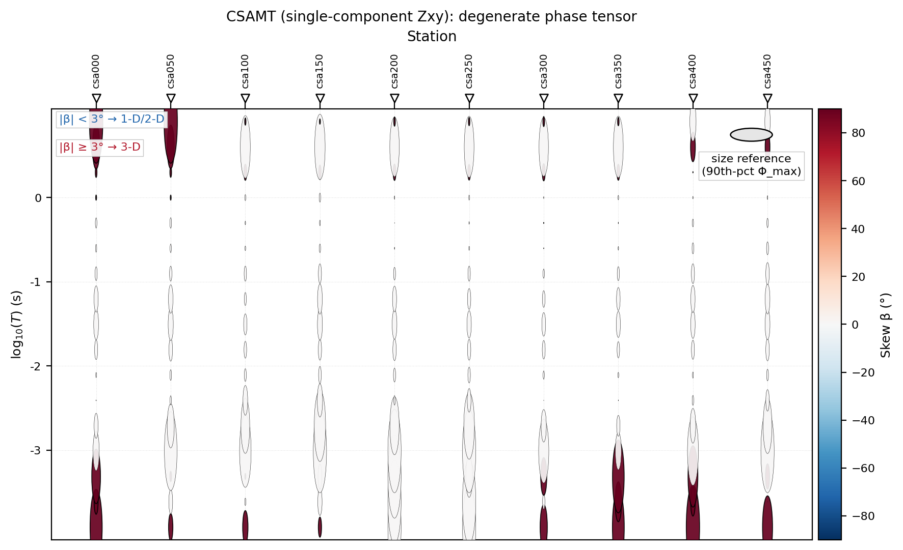
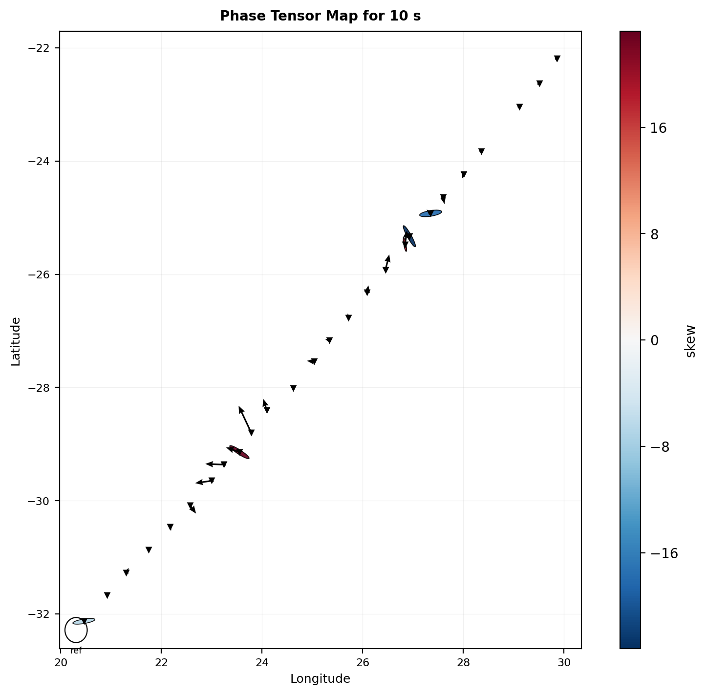
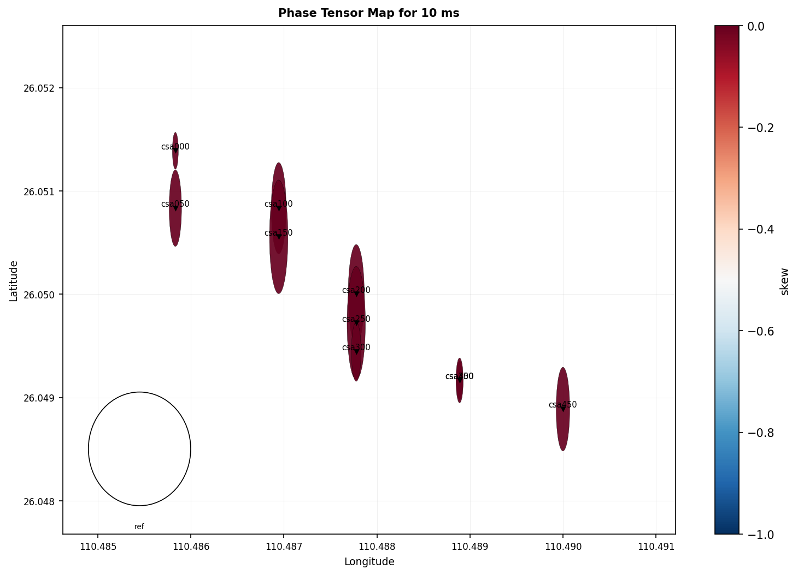
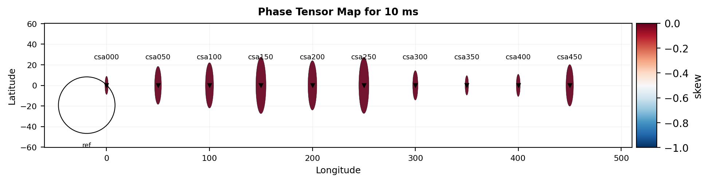
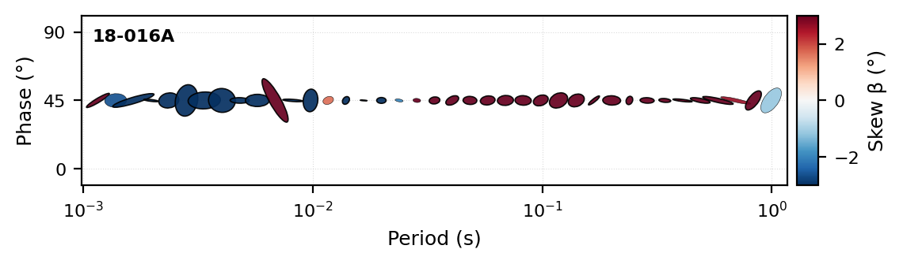
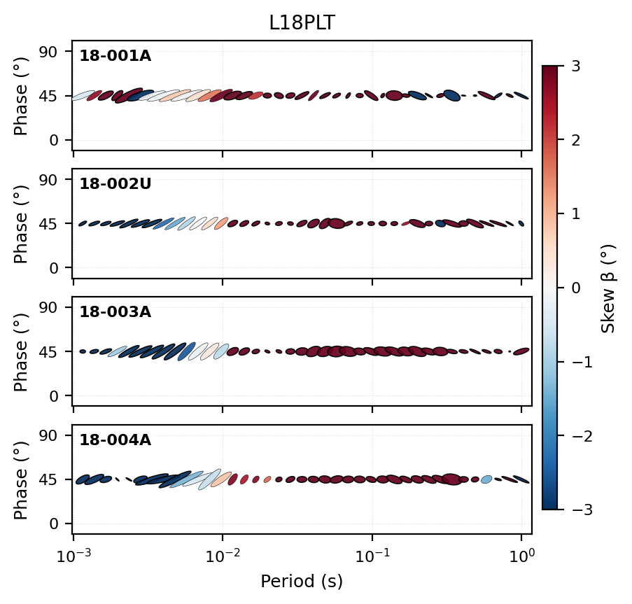

.. _emtools_tensor:

Phase Tensor And Impedance Tensor Tools
=======================================

The tensor page is one of the central pages in the pyCSAMT user guide
because it connects interpretation and preprocessing.  The same
:term:`impedance tensor` ``Z`` supports apparent resistivity, phase,
skew, :term:`geoelectric strike`, static-shift checks, dimensionality
checks, and 2-D rotation decisions.  The ``pycsamt.emtools`` tensor
tools expose two main workflows:

.. list-table::
   :header-rows: 1
   :widths: 30 32 38

   * - Workflow
     - Main tools
     - Purpose
   * - Phase-tensor interpretation
     - ``build_phase_tensor_table``,
       ``plot_phase_tensor_psection``,
       ``plot_phase_tensor_map``,
       ``plot_phase_tensor_summary``
     - Diagnose dimensionality, strike, skew, ellipticity, and spatial
       coherence without being dominated by static-shift amplitude.
   * - Impedance-tensor editing
     - ``rotate``, ``rotate_by_map``, ``rotate_z_to_strike``,
       ``antisymmetrize``, ``orient_from_sensors``, ``sigma_clip_z``,
       ``balance_offdiag``, ``invert``
     - Apply deliberate preprocessing operations to ``Z`` before
       inversion, plotting, or compatibility with a 2-D assumption.

The :term:`phase tensor` follows the Caldwell, Bibby & Brown (2004)
decomposition.  For each frequency, pyCSAMT splits the impedance tensor
into real and imaginary parts, then computes the phase tensor and its
invariants.  Writing

.. math::

   Z = X + iY,
   \qquad
   X = \Re(Z), \quad Y = \Im(Z),

the phase tensor is

.. math::

   \Phi = X^{-1}Y .

If :math:`X` is singular, pyCSAMT falls back to a pseudo-inverse.  The
important interpretation point is that :math:`\Phi` is built from a
ratio of the imaginary and real impedance parts.  A real, frequency
independent :term:`static shift` multiplier scales :math:`X` and
:math:`Y` together, so it largely cancels in :math:`X^{-1}Y`.  That is
why phase tensor plots are such useful companions to apparent-resistivity
and static-shift diagnostics.

The examples in this guide use public two-level imports from
``pycsamt.emtools``.  One name needs special attention:
``pycsamt.emtools.rotate_to_strike`` belongs to the strike module, while
the tensor module's own :term:`strike rotation` helper is exported as
``rotate_z_to_strike``.

Load Data
---------

Start with the canonical loader.  It returns a ``Sites`` object and skips
stations without valid impedance data.

.. code-block:: pycon

   >>> from pathlib import Path
   >>> from pycsamt.emtools import ensure_sites
   >>> edi_dir = Path("data/AMT/WILLY_DATA/L18PLT")
   >>> sites = ensure_sites(
   ...     edi_dir,
   ...     recursive=True,
   ...     on_dup="replace",
   ...     strict=False,
   ...     verbose=0,
   ... )

Keep ``sites`` as the unmodified reference object.  Tensor editing
functions can return corrected copies when ``inplace=False``, so it is
easy to compare original and edited data.

Build The Phase-Tensor Table
----------------------------

``build_phase_tensor_table`` is the foundation for the plotting tools.
It returns one row per station and frequency.  For a phase tensor

.. math::

   \Phi =
   \begin{bmatrix}
   a & b \\
   c & d
   \end{bmatrix},

pyCSAMT reports the Caldwell-style angles

.. math::

   \alpha =
   \frac{1}{2}
   \tan^{-1}
   \left(
   \frac{b+c}{a-d}
   \right),
   \qquad
   \beta =
   \frac{1}{2}
   \tan^{-1}
   \left(
   \frac{b-c}{a+d}
   \right),

using ``atan2`` internally so the quadrant is preserved.  The table
stores ``beta`` again as ``skew``.  These two angles play very different
roles: :math:`\alpha` shifts whenever the coordinate frame is rotated --
it behaves like an ordinary strike angle -- while :math:`\beta` is
provably invariant under coordinate rotation, which is exactly what
makes :term:`skew` usable as a distortion and dimensionality diagnostic
rather than just another orientation number.  The "Audit Edits With
Phase-Tensor Tables" section later on this page demonstrates that
invariance directly on real data: rotating every station by a fixed
angle changes ``theta`` but leaves ``skew`` completely unchanged.

The principal values :math:`\phi_{\max}` and :math:`\phi_{\min}` are the
singular values of :math:`\Phi`; these appear in the table as ``s1`` and
``s2``.  The ellipse orientation ``theta`` is the angle of the dominant
left singular vector.  Since an ellipse has no arrow head, ``theta`` is
axial: :math:`\theta` and :math:`\theta+180^\circ` describe the same
direction.

The :term:`ellipticity` is

.. math::

   e =
   \frac{\phi_{\max}-\phi_{\min}}
        {\phi_{\max}+\phi_{\min}+\epsilon}.

Values near zero are close to circular.  Larger values mean the tensor
has a stronger preferred axis, but that axis should still be read
together with skew and period stability.

.. code-block:: pycon

   >>> from pycsamt.emtools import build_phase_tensor_table
   >>> pt = build_phase_tensor_table(
   ...     sites,
   ...     recursive=False,
   ... )
   >>> print(pt.head())
      station     freq    period  ...      beta      skew    ellipt
   0  18-001A  10400.0  0.000096  ...  2.611588  2.611588  0.194909
   1  18-001A   8707.0  0.000115  ...  1.964321  1.964321  0.210163
   2  18-001A   7289.0  0.000137  ...  1.804266  1.804266  0.213894
   3  18-001A   6102.0  0.000164  ...  1.068855  1.068855  0.212655
   4  18-001A   5108.0  0.000196  ... -6.949269 -6.949269  0.425503
   <BLANKLINE>
   [5 rows x 10 columns]
   >>> print(pt[["station", "freq", "period", "theta", "skew", "ellipt"]])
         station       freq    period       theta       skew    ellipt
   0     18-001A  10400.000  0.000096  120.687698   2.611588  0.194909
   1     18-001A   8707.000  0.000115  123.342495   1.964321  0.210163
   2     18-001A   7289.000  0.000137  126.743525   1.804266  0.213894
   3     18-001A   6102.000  0.000164  116.947420   1.068855  0.212655
   4     18-001A   5108.000  0.000196  126.074830  -6.949269  0.425503
   ...       ...        ...       ...         ...        ...       ...
   1479  18-025A      2.052  0.487329  -34.147397 -20.351504  0.559680
   1480  18-025A      1.718  0.582072    4.537986 -46.015322  0.196258
   1481  18-025A      1.438  0.695410   40.621212 -73.461943  0.216635
   1482  18-025A      1.204  0.830565 -125.802958 -87.940352  0.527659
   1483  18-025A      1.008  0.992063 -107.576221  86.240927  0.931748
   <BLANKLINE>
   [1484 rows x 6 columns]

The table contains these core columns:

.. list-table::
   :header-rows: 1
   :widths: 22 78

   * - Column
     - Meaning
   * - ``station``
     - Station identifier.
   * - ``freq``
     - Frequency in hertz.
   * - ``period``
     - Period in seconds, computed as ``1 / freq``.
   * - ``s1`` and ``s2``
     - Phase-tensor principal values.  They control ellipse major and
       minor axes.
   * - ``theta``
     - Principal-axis angle, interpreted as phase-tensor strike.  It is
       axial, so directions separated by 180 degrees are equivalent.
   * - ``alpha``
     - Phase-tensor coordinate angle.  Rotation-variant.
   * - ``beta`` and ``skew``
     - Skew angle.  ``skew`` is an alias for ``beta``.  Rotation-invariant.
   * - ``ellipt``
     - Ellipticity, computed from the principal values.  Values near zero
       are closer to circular; larger values indicate stronger 2-D
       anisotropy of the phase tensor.

The table is also the best place to audit a survey numerically before
plotting:

.. code-block:: pycon

   >>> summary = pt.groupby("station").agg(
   ...     n=("freq", "count"),
   ...     median_abs_skew=("skew", lambda values: values.abs().median()),
   ...     median_ellipt=("ellipt", "median"),
   ...     theta_iqr=("theta", lambda values: values.quantile(0.75) - values.quantile(0.25)),
   ... )
   >>> print(summary.sort_values("median_abs_skew", ascending=False))
             n  median_abs_skew  median_ellipt   theta_iqr
   station                                                
   18-023A  53        54.529465       0.776955  332.406202
   18-022U  53        49.751057       0.765743  330.236042
   18-021B  53        47.235914       0.917700   65.673584
   18-021U  53        46.582007       0.975587    5.728713
   18-020A  53        45.539049       0.890491    7.151592
   18-018A  53        37.183191       0.747821   19.123004
   18-022V  53        36.986632       0.734789   33.283984
   18-019U  53        33.778453       0.610832   44.257571
   18-025A  53        24.634843       0.666770  174.077409
   18-017U  53        19.002375       0.660533  269.958366
   18-023V  53        14.611436       0.568990   39.420996
   18-014A  53        14.548260       0.735137  273.677122
   18-004A  53        14.509282       0.683143   18.628263
   18-015U  53        14.242493       0.721964  316.822496
   18-009A  53        13.024178       0.477635   19.936171
   18-006A  53        12.375357       0.574245   24.700266
   18-016A  53        12.121341       0.732322  302.853539
   18-013U  53        12.025504       0.591064   41.602228
   18-024U  53        11.482211       0.696343   69.080189
   18-003A  53        11.018588       0.674498   23.567376
   18-011A  53         9.310687       0.692296  261.601465
   18-010U  53         9.242375       0.676668  257.925336
   18-005U  53         9.171151       0.598509   16.449050
   18-008U  53         9.136982       0.459678   30.040274
   18-012A  53         9.052529       0.710183   37.311060
   18-007U  53         8.377503       0.492508   29.303937
   18-002U  53         6.596544       0.535202   16.329767
   18-001A  53         4.809977       0.423331   15.689190

Large ``median_abs_skew`` means the station is not behaving like a clean
1-D or 2-D response in that period range.  Large ``theta_iqr`` means
phase-tensor strike changes strongly with frequency, so one rotation
angle may be a poor summary.  With the corrected skew formula every
station in this survey now sits under a median absolute skew of ``55``
degrees -- a very different, much more legible picture than a swapped
formula would produce, and one where several stations (``18-001A``,
``18-002U``, ``18-005U`` through ``18-012A``) sit comfortably under
``10`` degrees.

Filter By Period
----------------

Most tensor interpretation should be tied to a period band.  A shallow
band and a deeper band can show different strike, skew, or ellipticity.

.. code-block:: pycon

   >>> period_band = (0.001, 10.0)
   >>> band_pt = pt[
   ...     (pt["period"] >= period_band[0])
   ...     & (pt["period"] <= period_band[1])
   ... ]
   >>> print("rows in band:", len(band_pt))
   rows in band: 1092
   >>> print("stations in band:", band_pt["station"].nunique())
   stations in band: 28
   >>> print("median |skew|:", band_pt["skew"].abs().median())
   median |skew|: 16.941088508206953

When you report a tensor result, always report the period band.  A map at
``period=1.0`` second and a summary over ``0.001`` to ``10.0`` seconds
answer different questions.

Read Dimensionality From Skew And Ellipticity
---------------------------------------------

A simple phase-tensor :term:`dimensionality` rule uses skew and
ellipticity:

.. list-table::
   :header-rows: 1
   :widths: 20 40 40

   * - Class
     - Rule
     - Interpretation
   * - 1-D
     - ``abs(skew) <= skew_threshold`` and
       ``abs(ellipt) <= ellipt_threshold``
     - Low skew and nearly circular phase tensor.
   * - 2-D
     - ``abs(skew) <= skew_threshold`` and
       ``abs(ellipt) > ellipt_threshold``
     - Low skew but elongated phase tensor.
   * - 3-D
     - ``abs(skew) > skew_threshold``
     - High skew; strike and 2-D rotation should be treated with caution.

.. code-block:: pycon

   >>> import numpy as np
   >>> skew_threshold = 3.0
   >>> ellipt_threshold = 0.2
   >>> work = band_pt.copy()
   >>> abs_skew = work["skew"].abs()
   >>> abs_ellipt = work["ellipt"].abs()
   >>> work["dimensionality"] = np.select(
   ...     [
   ...         (abs_skew <= skew_threshold) & (abs_ellipt <= ellipt_threshold),
   ...         (abs_skew <= skew_threshold) & (abs_ellipt > ellipt_threshold),
   ...     ],
   ...     ["1D", "2D"],
   ...     default="3D",
   ... )
   >>> print(work["dimensionality"].value_counts(normalize=True))
   dimensionality
   3D    0.894689
   2D    0.087912
   1D    0.017399
   Name: proportion, dtype: float64

The default ``3`` degree skew threshold is strict.  It is useful as a
textbook 1-D/2-D screen, but it still classifies most real field samples
as 3-D here.  That is not a failure of the function; it is a warning
about the data and the 2-D assumption.  Note the scale of this number
compared to a swapped-formula run: with the correct, rotation-invariant
skew this survey classifies as roughly ``90`` percent 3-D rather than
the ``97.5`` percent an incorrect formula would have reported -- the
threshold and the interpretation habit matter, but so does the sign and
identity of the quantity being thresholded.

In compact notation, the rule used by the example is

.. math::

   \mathrm{class} =
   \begin{cases}
   \mathrm{1D}, & |\beta| \le \beta_0
      \ \mathrm{and}\ |e| \le e_0,\\
   \mathrm{2D}, & |\beta| \le \beta_0
      \ \mathrm{and}\ |e| > e_0,\\
   \mathrm{3D}, & |\beta| > \beta_0,
   \end{cases}

where :math:`\beta_0` is ``skew_threshold`` and :math:`e_0` is
``ellipt_threshold``.  The threshold is a decision rule, not a law of
nature.  For a field survey, report the threshold and the period band
with the result.

Simple Phase-Tensor Views
-------------------------

Use the simpler plots before the full ellipse plot.  They make it easy
to identify which invariant is causing the interpretation.

.. code-dropdown:: ../../../scripts/generate_user_guide_emtools_tensor_figures.py
   :language: python
   :pyobject: make_simple_views_bundle
   :linenos:
   :title: View the executed simple-views source code

.. grid:: 3
   :gutter: 2

   .. grid-item::

      .. image:: ../../images/user_guide/emtools/user-guide-emtools-tensor-06-01.png
         :width: 100%

   .. grid-item::

      .. image:: ../../images/user_guide/emtools/user-guide-emtools-tensor-06-02.png
         :width: 100%

   .. grid-item::

      .. image:: ../../images/user_guide/emtools/user-guide-emtools-tensor-06-03.png
         :width: 100%

   .. grid-item::

      .. image:: ../../images/user_guide/emtools/user-guide-emtools-tensor-06-04.png
         :width: 100%

   .. grid-item::

      .. image:: ../../images/user_guide/emtools/user-guide-emtools-tensor-06-05.png
         :width: 100%

``plot_theta_vs_period`` is a scatter view of strike angle by period.
It is quick, but it puts an axial angle on a linear y-axis.  Treat jumps
near the wrap boundary carefully.

``plot_phase_tensor_skewmap`` and ``plot_ellipticity_psection`` show
station-by-period heatmaps.  They are good for finding period bands that
are consistently low-skew or strongly elongated.

``plot_dimensionality_psection`` and ``plot_dimensionality_grid`` apply
the simple skew/ellipticity classification to every station-period cell.
Read them alongside the table above: most of both panels should read
"3-D" at this survey's default threshold, and that is expected given the
``0.89`` proportion computed numerically a moment ago, not a sign that
the plot is broken.

Phase-Tensor Ellipse Pseudosection
----------------------------------

``plot_phase_tensor_psection`` is the main phase-tensor figure.  Each
cell is an ellipse:

.. list-table::
   :header-rows: 1
   :widths: 24 76

   * - Visual element
     - Meaning
   * - Major axis
     - ``s1``, the larger phase-tensor principal value.
   * - Minor axis
     - ``s2``, the smaller phase-tensor principal value.
   * - Orientation
     - ``theta``, the phase-tensor strike direction.
   * - Fill color
     - Controlled by ``c_by``.  The default is usually skew.
   * - Thick border
     - Optional marker for cells where ``abs(skew)`` exceeds
       ``skew_threshold``.

.. code-block:: pycon

   >>> import matplotlib.pyplot as plt
   >>> from pycsamt.emtools import plot_phase_tensor_psection
   >>> _ = plot_phase_tensor_psection(
   ...     sites,
   ...     stations=None,
   ...     period_range=(0.001, 10.0),
   ...     axis_y="logperiod",
   ...     period_up=True,
   ...     c_by="skew",
   ...     skew_threshold=3.0,
   ...     mark_3d=True,
   ...     normalise_by="cell",
   ...     recursive=False,
   ... )
   >>> plt.gcf().savefig(
   ...     "tensor_phase_tensor_psection.png",
   ...     dpi=200,
   ...     bbox_inches="tight",
   ... )
   >>> plt.close()

.. image:: ../../images/user_guide/emtools/user-guide-emtools-tensor-07.png
   :width: 100%

Most stations show thin, elongated slivers at short period (top of the
plot) that broaden and pick up stronger red/blue fill color at longer
period -- the same short-period-cleaner, long-period-noisier pattern the
skew table already hinted at through low median values for stations like
``18-001A`` and ``18-002U``.  Useful ``c_by`` values include
``"skew"``, ``"beta"``, ``"theta"``, ``"ellipt"``, ``"s1"``, ``"s2"``,
``"|skew|"``, ``"phi_mean"``, ``"phi_max"``, and ``"phi_min"``.

Use ``normalise_by="cell"`` for most survey plots because it scales the
ellipses to the local plotting grid.  Use ``normalise_by="unity"`` when
you want the 45-degree, 1-D reference to have an explicit visual meaning.
Use ``normalise_by="abs"`` only when absolute ellipse sizes in data units
are intentional.

The ellipse drawn at a station-period cell has semi-axes proportional to
:math:`\phi_{\max}` and :math:`\phi_{\min}` and is rotated by :math:`\theta`.
In local plot coordinates, before normalization, the ellipse satisfies

.. math::

   \left(\frac{x'}{\phi_{\max}}\right)^2
   +
   \left(\frac{y'}{\phi_{\min}}\right)^2
   =
   1,

where

.. math::

   \begin{bmatrix} x' \\ y' \end{bmatrix}
   =
   R(-\theta)
   \begin{bmatrix} x \\ y \end{bmatrix}.

Changing ``normalise_by`` changes how those axes are scaled for display;
it does not change the phase-tensor values in the table.

A Full Tensor Is Not Optional
-----------------------------

Every formula above assumes a genuine :math:`2\times2` impedance tensor
with independent ``Zxy`` and ``Zyx`` information.  ``data/CSAMT`` is a
real, single-component Tongkeng CSAMT line -- only ``Zxy`` is populated,
``Zyx`` is identically zero -- and it is a useful, real way to see what
happens when that assumption breaks.

.. code-block:: pycon

   >>> csamt = ensure_sites("data/CSAMT", recursive=False, verbose=0)
   >>> pt_csamt = build_phase_tensor_table(csamt, recursive=False)
   >>> print(pt_csamt.shape)
   (170, 10)
   >>> print(pt_csamt[["station", "freq", "s1", "s2", "theta", "skew", "ellipt"]].head(8))
     station        freq        s1   s2  theta  skew  ellipt
   0  csa000  8196.72200  0.656877  0.0   90.0  90.0     1.0
   1  csa000  4098.36100  0.216208  0.0   90.0  90.0     1.0
   2  csa000  2049.18000  0.472698  0.0   90.0  90.0     1.0
   3  csa000  1023.54100  0.340428  0.0   90.0   0.0     1.0
   4  csa000   512.82060  0.218035  0.0   90.0   0.0     1.0
   5  csa000   255.75450  0.002304  0.0   90.0  90.0     1.0
   6  csa000   128.04100  0.044885  0.0   90.0   0.0     1.0
   7  csa000    64.10257  0.170754  0.0   90.0   0.0     1.0
   >>> print(pt_csamt[["theta", "skew", "ellipt", "s1", "s2"]].describe())
          theta        skew        ellipt          s1     s2
   count  170.0  170.000000  1.700000e+02  170.000000  170.0
   mean    90.0   23.823529  1.000000e+00    0.265513    0.0
   std      0.0   39.823182  5.530282e-11    0.300118    0.0
   min     90.0    0.000000  1.000000e+00    0.002304    0.0
   25%     90.0    0.000000  1.000000e+00    0.080678    0.0
   50%     90.0    0.000000  1.000000e+00    0.181731    0.0
   75%     90.0   90.000000  1.000000e+00    0.319169    0.0
   max     90.0   90.000000  1.000000e+00    2.390577    0.0

Every number here is a mathematical artifact, not geology.  With
``Zyx = 0`` the phase tensor is exactly singular: ``s2`` is zero at
*every* frequency and station (``std`` is ``0.0``), so ``ellipt`` is
pinned at exactly ``1.0`` and ``theta`` is pinned at exactly ``90``
degrees regardless of what the earth is doing.  ``skew`` does not settle
either -- it alternates rigidly between ``0`` and ``90`` degrees as
``atan2`` picks a branch for a matrix entry that is exactly zero.  Seeing
the same rigid pattern in a real pseudosection makes this concrete:

.. code-block:: pycon

   >>> _ = plot_phase_tensor_psection(
   ...     csamt,
   ...     stations=None,
   ...     axis_y="logperiod",
   ...     period_up=True,
   ...     c_by="skew",
   ...     skew_threshold=3.0,
   ...     mark_3d=True,
   ...     normalise_by="cell",
   ...     recursive=False,
   ...     title="CSAMT (single-component Zxy): degenerate phase tensor",
   ... )
   >>> plt.gcf().savefig("tensor_csamt_degenerate.png", dpi=200, bbox_inches="tight")
   >>> plt.close()

Every ellipse is a zero-width slit, and the fill color alternates between
the two extremes of the skew colorbar with no in-between values -- there
is no "moderate skew" here, only the two branches ``atan2`` can return
for a genuinely degenerate matrix.  Do not run phase-tensor dimensionality
analysis on single-component CSAMT data and report the result as a real
1-D/2-D/3-D classification; it is a statement about the missing
``Zyx`` component, not about the earth.  See also
:ref:`emtools_source_effects` for what this same dataset does look like
under CSAMT-appropriate diagnostics.

Strike As A Director Field
--------------------------

``theta`` is axial.  A director field is often easier to interpret than
a scatter plot because the glyph has no arrow head and therefore
respects the 180-degree ambiguity.
For comparing two strike estimates, use an axial difference rather than
ordinary subtraction:

.. math::

   \Delta\theta =
   \left[
   (\theta_2-\theta_1+90^\circ) \bmod 180^\circ
   \right]
   - 90^\circ .

This keeps differences in the interval
:math:`[-90^\circ, 90^\circ]`.  Without this adjustment, a harmless jump
from :math:`179^\circ` to :math:`1^\circ` looks like a
:math:`178^\circ` change instead of a :math:`2^\circ` change.

.. code-block:: pycon

   >>> from pycsamt.emtools import plot_strike_director_field
   >>> _ = plot_strike_director_field(
   ...     sites,
   ...     color_by="skew",
   ...     length_by="ellipt",
   ...     skew_max=6.0,
   ...     streamlines=True,
   ...     period_subsample=40,
   ...     recursive=False,
   ... )
   >>> plt.gcf().savefig(
   ...     "tensor_strike_director_field.png",
   ...     dpi=200,
   ...     bbox_inches="tight",
   ... )
   >>> plt.close()

.. image:: ../../images/user_guide/emtools/user-guide-emtools-tensor-08.png
   :width: 100%

Interpret long, aligned, low-skew directors as a more coherent 2-D
strike signal.  Short directors mean the phase tensor is close to
circular and strike is poorly defined.  High-skew directors mean the
response is more 3-D or distorted, even if the direction looks visually
organized.

Rose And Stability Plots
------------------------

Rose plots are useful for summarizing axial direction.  Stability plots
are useful for seeing whether that summary hides period dependence.

.. code-dropdown:: ../../../scripts/generate_user_guide_emtools_tensor_figures.py
   :language: python
   :pyobject: make_rose_stability_bundle
   :linenos:
   :title: View the executed rose/stability source code

.. grid:: 3
   :gutter: 2

   .. grid-item::

      .. image:: ../../images/user_guide/emtools/user-guide-emtools-tensor-09-01.png
         :width: 100%

   .. grid-item::

      .. image:: ../../images/user_guide/emtools/user-guide-emtools-tensor-09-02.png
         :width: 100%

   .. grid-item::

      .. image:: ../../images/user_guide/emtools/user-guide-emtools-tensor-09-03.png
         :width: 100%

``plot_phase_tensor_rose`` folds all selected ``theta`` values into one
axial histogram.  ``plot_theta_rose_grid`` splits the period range into
equal log-width bands.  ``plot_theta_stability_stripe`` uses hue for
``theta`` and saturation for local stability.

If the rose grid changes direction from one period band to another,
avoid selecting a single strike for the entire data set.

Skew-Ellipticity Density
------------------------

``plot_skew_ellipt_density`` shows the joint distribution of
``abs(beta)`` and ``abs(ellipt)``.  It is a compact way to see whether
the data cluster in a 1-D, 2-D, or 3-D region.

.. code-block:: pycon

   >>> from pycsamt.emtools import plot_skew_ellipt_density
   >>> _ = plot_skew_ellipt_density(
   ...     sites,
   ...     band=(0.001, 10.0),
   ...     gridsize=40,
   ...     recursive=False,
   ... )
   >>> plt.gcf().savefig(
   ...     "tensor_skew_ellipt_density.png",
   ...     dpi=200,
   ...     bbox_inches="tight",
   ... )
   >>> plt.close()

.. image:: ../../images/user_guide/emtools/user-guide-emtools-tensor-10.png
   :width: 100%

Use this plot with the dimensionality grid.  The grid tells you where
problem cells occur; the density plot tells you how the full population
is distributed.

Summary Figure
--------------

``plot_phase_tensor_summary`` combines the main ellipse pseudosection,
the dimensionality grid, and the skew-ellipticity density into one
figure.

.. code-block:: pycon

   >>> from pycsamt.emtools import plot_phase_tensor_summary
   >>> fig = plot_phase_tensor_summary(
   ...     sites,
   ...     stations=None,
   ...     period_range=(0.001, 10.0),
   ...     c_by="skew",
   ...     skew_threshold=3.0,
   ...     ellipt_threshold=0.2,
   ...     recursive=False,
   ... )
   >>> fig.savefig("tensor_phase_tensor_summary.png", dpi=200, bbox_inches="tight")
   >>> plt.close(fig)

.. image:: ../../images/user_guide/emtools/user-guide-emtools-tensor-11.png
   :width: 100%

This is a good report figure when the audience needs the whole
phase-tensor story in one place: what the ellipses look like, how much
of the band is 1-D/2-D/3-D, and where the skew/ellipticity population
sits.

Geographic Phase-Tensor Map
---------------------------

``plot_phase_tensor_map`` draws one phase-tensor ellipse per station at
the period nearest a requested target period.  It can also overlay
:term:`tipper` arrows when vertical magnetic transfer functions are
present.

.. code-block:: pycon

   >>> from pycsamt.emtools import plot_phase_tensor_map
   >>> _ = plot_phase_tensor_map(
   ...     sites,
   ...     period=1.0,
   ...     c_by="skew",
   ...     show_tipper=True,
   ...     tipper_convention="parkinson",
   ...     station_labels=True,
   ...     recursive=False,
   ... )
   >>> plt.gcf().savefig("tensor_phase_tensor_map.png", dpi=200, bbox_inches="tight")
   >>> plt.close()

.. image:: ../../images/user_guide/emtools/user-guide-emtools-tensor-12.png
   :width: 100%

L18PLT is AMT with no vertical-field channel, so ``show_tipper=True``
draws no arrows here; the ellipses are small and pale because the
corrected skew values plotted at ``period=1.0`` second are mostly low.
Use ``period`` as a target; each station uses its nearest available
period.

Coordinates come from the EDI header, and getting them right matters for
every figure in this section.  ``build_phase_tensor_table`` and the
pseudosection functions above never needed station positions, but the
map does -- and coordinate parsing has its own failure modes worth
knowing about.

Real Tipper On A Real Map
-------------------------

``data/MT/kap03lmt_edis`` is a real 26-station SAMTEX MT line that,
unlike L18PLT, does carry genuine vertical-field data, which makes it
the right dataset to see real tipper arrows on a real phase-tensor map.

.. code-block:: pycon

   >>> kap = ensure_sites("data/MT/kap03lmt_edis", recursive=True, verbose=0)
   >>> n_valid = sum(
   ...     1 for s in kap
   ...     if s.coords and np.isfinite(s.coords[0]) and np.isfinite(s.coords[1])
   ... )
   >>> print("kap03 stations with usable coordinates:", n_valid, "/", len(kap))
   kap03 stations with usable coordinates: 26 / 26
   >>> _ = plot_phase_tensor_map(
   ...     kap,
   ...     period=10.0,
   ...     c_by="skew",
   ...     show_tipper=True,
   ...     tipper_convention="parkinson",
   ...     station_labels=False,
   ...     recursive=False,
   ... )
   >>> plt.gcf().savefig("tensor_phase_tensor_map_kap03.png", dpi=200, bbox_inches="tight")
   >>> plt.close()

All 26 stations get a real position, and several carry visible induction
arrows and ellipses along the profile.  That "26 / 26" is worth pausing
on: these EDI files are older BIRRP-processed output that never fill in
the ordinary ``LAT=``/``LONG=`` keys inside ``>HEAD``.  What they do
carry is ``REFLAT``/``REFLONG`` inside ``>=DEFINEMEAS`` -- a real,
if less common, coordinate convention.  ``Site.coords`` now falls back to
that block automatically whenever the header alone cannot supply a
field, which is what makes this map possible at all; without that
fallback every one of these 26 stations would report ``(nan, nan)`` and
every coordinate-based tool on this page would silently draw nothing for
this survey.

When Header Coordinates Are Noisy
---------------------------------

Coordinates existing is not the same as coordinates being trustworthy.
``data/CSAMT`` does carry header positions -- via the same
``REFLAT``/``REFLONG`` fallback -- but they come from field GPS fixes
along a short, 450 m line, and GPS jitter at that scale is a real,
common problem.

.. code-block:: pycon

   >>> csamt2 = ensure_sites("data/CSAMT", recursive=False, verbose=0)
   >>> n_valid_csamt = sum(
   ...     1 for s in csamt2
   ...     if s.coords and np.isfinite(s.coords[0]) and np.isfinite(s.coords[1])
   ... )
   >>> print("CSAMT stations with usable header coordinates:", n_valid_csamt, "/", len(csamt2))
   CSAMT stations with usable header coordinates: 10 / 10
   >>> _ = plot_phase_tensor_map(
   ...     csamt2,
   ...     period=0.01,
   ...     show_tipper=False,
   ...     station_labels=True,
   ...     recursive=False,
   ... )
   >>> plt.gcf().savefig("tensor_phase_tensor_map_csamt_header.png", dpi=200, bbox_inches="tight")
   >>> plt.close()

The header positions are real GPS fixes, but they do not trace a clean
straight line: compare ``csa300``, which sits offset to the northwest of
the ``csa250``-``csa200`` trend instead of continuing it.  The station
names themselves encode the true, intended design -- a straight transect
at ``50`` m spacing, exactly what a CSAMT along-line survey is built to
be.  When you know the true local geometry better than a handful of GPS
fixes do, override it explicitly with ``coords``:

.. code-block:: pycon

   >>> coords = {
   ...     "csa000": (0.0, 0.0),
   ...     "csa050": (0.0, 50.0),
   ...     "csa100": (0.0, 100.0),
   ...     "csa150": (0.0, 150.0),
   ...     "csa200": (0.0, 200.0),
   ...     "csa250": (0.0, 250.0),
   ...     "csa300": (0.0, 300.0),
   ...     "csa350": (0.0, 350.0),
   ...     "csa400": (0.0, 400.0),
   ...     "csa450": (0.0, 450.0),
   ... }
   >>> _ = plot_phase_tensor_map(
   ...     csamt2,
   ...     period=0.01,
   ...     coords=coords,
   ...     show_tipper=False,
   ...     station_labels=True,
   ...     recursive=False,
   ... )
   >>> plt.gcf().savefig(
   ...     "tensor_phase_tensor_map_custom_coords.png",
   ...     dpi=200,
   ...     bbox_inches="tight",
   ... )
   >>> plt.close()

The coordinate tuple is ``(lat, lon)`` for header-derived positions, but
``coords`` accepts any consistent 2-D frame -- here a local along-line
grid in meters, which is both more physically meaningful for a CSAMT
transect and immune to header GPS noise.  Reach for ``coords`` whenever
the header disagrees with better-known survey geometry, not only when a
map silently comes up empty.

Per-Station Ellipse Strips
--------------------------

``plot_phase_tensor_strip`` draws one station as an ellipse sequence
through period.  ``plot_phase_tensor_strip_grid`` tiles several such
strips, optionally grouped by profile.

.. code-block:: pycon

   >>> from pycsamt.emtools import (
   ...     plot_phase_tensor_strip,
   ...     plot_phase_tensor_strip_grid,
   ... )
   >>> _ = plot_phase_tensor_strip(
   ...     sites,
   ...     station="18-016A",
   ...     period_range=(0.001, 10.0),
   ...     c_by="skew",
   ...     recursive=False,
   ... )
   >>> plt.gcf().savefig("tensor_phase_tensor_strip.png", dpi=200, bbox_inches="tight")
   >>> plt.close()

Station ``18-016A`` was already flagged in the numeric summary as one of
the better-behaved stations (median absolute skew ``12.1`` degrees), and
the strip confirms it: colors stay within about ``±3`` degrees of white
across almost the whole period range.

.. code-block:: pycon

   >>> groups = {
   ...     "L18PLT": ["18-001A", "18-002U", "18-003A", "18-004A"],
   ... }
   >>> _ = plot_phase_tensor_strip_grid(
   ...     sites,
   ...     groups,
   ...     period_range=(0.001, 10.0),
   ...     c_by="skew",
   ...     recursive=False,
   ... )
   >>> plt.gcf().savefig(
   ...     "tensor_phase_tensor_strip_grid.png",
   ...     dpi=200,
   ...     bbox_inches="tight",
   ... )
   >>> plt.close()

All four stations in this group show the same broad pattern: cooler
(blue, negative-skew) ellipses at short period giving way to a run of
saturated dark-red cells in the middle of the band.  A shared pattern
across neighboring stations is more likely to be real structure than a
single-station artifact.  Use strips when a single station deserves close
inspection.  Use the grid when comparing stations or profile groups
without the compression of a full pseudosection.

Standalone Legend
-----------------

``phase_tensor_legend`` draws a reference ellipse that can be composed
into custom figures.

.. code-block:: pycon

   >>> from pycsamt.emtools import phase_tensor_legend
   >>> _ = phase_tensor_legend(size=1.0)
   >>> plt.gcf().savefig("tensor_phase_tensor_legend.png", dpi=200, bbox_inches="tight")
   >>> plt.close()

.. image:: ../../images/user_guide/emtools/user-guide-emtools-tensor-15.png
   :width: 100%

It is not a diagnostic by itself; it is a small plotting component for
figures where the phase-tensor ellipse convention needs to be explained.

Impedance-Tensor Editing
------------------------

Tensor editing functions change ``Z``.  They should be treated as
processing operations, not as harmless plots.  Keep ``inplace=False``
unless you deliberately want to mutate the object in memory.
The rotation convention used by the tensor tools is a :term:`strike
rotation`-style congruence rotation of the horizontal coordinate frame:

.. math::

   Z' = R(\alpha) Z R(\alpha)^T,
   \qquad
   R(\alpha) =
   \begin{bmatrix}
   \cos\alpha & \sin\alpha \\
   -\sin\alpha & \cos\alpha
   \end{bmatrix}.

A fixed-angle rotation applies the same :math:`\alpha` everywhere.
``rotate_by_map`` lets :math:`\alpha=\alpha_s` vary by station, and
``rotate_z_to_strike`` estimates an angle before applying the same
operation.  Because rotation mixes all four tensor components, always
compare phase-tensor and impedance diagnostics before and after.

.. list-table::
   :header-rows: 1
   :widths: 24 36 40

   * - Function
     - What it does
     - Typical use
   * - ``rotate``
     - Rotates all station impedance tensors by one fixed angle.
     - Apply a known regional strike or sensor-frame correction.
   * - ``rotate_by_map``
     - Rotates each station by a value from a station-angle dictionary.
     - Apply station-specific rotations from an external interpretation.
   * - ``rotate_z_to_strike``
     - Estimates a tensor strike for each station and rotates by it.
     - Exploratory tensor-level strike rotation.
   * - ``antisymmetrize``
     - Enforces off-diagonal antisymmetry.
     - Prepare data for methods that assume ``Zxy = -Zyx``.
   * - ``orient_from_sensors``
     - Corrects electric and magnetic sensor orientations.
     - Fix known sensor azimuth errors.
   * - ``sigma_clip_z``
     - Sets outlying ``Z`` entries to ``NaN``.
     - Remove isolated spikes before plotting or inversion.
   * - ``balance_offdiag``
     - Balances off-diagonal magnitudes.
     - Exploratory symmetry conditioning.
   * - ``invert``
     - Replaces each 2-by-2 impedance tensor by its matrix inverse.
     - Advanced workflows that explicitly need admittance-like tensors.

Fixed-Angle Rotation
--------------------

Use ``rotate`` when every station should receive the same angle.

.. code-block:: pycon

   >>> from pycsamt.emtools import rotate
   >>> rotated_30 = rotate(
   ...     sites,
   ...     30.0,
   ...     inplace=False,
   ...     recursive=False,
   ... )

Use this only when the angle is justified by strike analysis, field
geometry, or a documented processing convention.

Station-Specific Rotation
-------------------------

Use ``rotate_by_map`` when each station needs its own angle.

.. code-block:: pycon

   >>> from pycsamt.emtools import rotate_by_map
   >>> angle_by_station = {
   ...     "18-001A": 25.0,
   ...     "18-002A": 27.5,
   ...     "18-003A": 24.0,
   ... }
   >>> rotated_stationwise = rotate_by_map(
   ...     sites,
   ...     angle_by_station,
   ...     inplace=False,
   ...     recursive=False,
   ... )

Stations missing from the dictionary receive a ``0`` degree rotation.
For production work, check that every intended station is present in the
map before applying it.

Tensor Rotation To Strike
-------------------------

The tensor module's rotation-to-strike function is exported as
``rotate_z_to_strike`` at the ``pycsamt.emtools`` level.  This avoids a
name collision with the strike module's ``rotate_to_strike``.

.. code-block:: pycon

   >>> from pycsamt.emtools import rotate_z_to_strike
   >>> rotated_to_tensor_strike = rotate_z_to_strike(
   ...     sites,
   ...     method="swift",
   ...     inplace=False,
   ...     recursive=False,
   ... )

Use this as a tensor editing step, not as the main strike-analysis
interface.  For detailed strike estimation, use the dedicated
:ref:`emtools_strike` workflow and its station-level tables.

Antisymmetrize And Balance
--------------------------

``antisymmetrize`` enforces off-diagonal antisymmetry.  ``balance_offdiag``
balances ``|Zxy|`` and ``|Zyx|`` while preserving phase.
For an off-diagonal pair :math:`Z_{xy}` and :math:`Z_{yx}`,
antisymmetrization replaces the pair by a common antisymmetric target,
schematically

.. math::

   Z^*_{xy} = A,
   \qquad
   Z^*_{yx} = -A,

where :math:`A` is chosen by the backend utility according to ``how``.
With ``how="rms"``, the target amplitude is tied to the root-mean-square
scale of the two original off-diagonal terms.

``balance_offdiag(mode="avgabs")`` keeps each component phase but gives
both off-diagonal terms the same magnitude

.. math::

   m = \frac{|Z_{xy}|+|Z_{yx}|}{2},
   \qquad
   Z'_{xy} = m\,e^{i\arg Z_{xy}},
   \qquad
   Z'_{yx} = m\,e^{i\arg Z_{yx}}.

This is gentler than antisymmetrization because it does not force a
180-degree phase relationship.

.. code-block:: pycon

   >>> from pycsamt.emtools import antisymmetrize, balance_offdiag
   >>> antisymmetric = antisymmetrize(
   ...     sites,
   ...     how="rms",
   ...     inplace=False,
   ...     recursive=False,
   ... )
   >>> balanced = balance_offdiag(
   ...     sites,
   ...     mode="avgabs",
   ...     inplace=False,
   ...     recursive=False,
   ... )

These operations can be useful for controlled experiments or for
preparing data for algorithms with strong 2-D assumptions.  They can
also hide real 3-D information if applied blindly.  Always keep an
uncorrected copy.  ``antisymmetrize`` is not a fix for the CSAMT
single-component case shown above: forcing ``Zyx = -Zxy`` when ``Zyx``
was never measured manufactures a value rather than recovering one, and
the resulting phase tensor would look plausible without being real.

Sensor Orientation
------------------

Use ``orient_from_sensors`` when field notes show that the electric and
magnetic sensors were not aligned with the assumed axes.

.. code-block:: pycon

   >>> from pycsamt.emtools import orient_from_sensors
   >>> oriented = orient_from_sensors(
   ...     sites,
   ...     ex=5.0,
   ...     ey=95.0,
   ...     bx=5.0,
   ...     by=95.0,
   ...     degrees=True,
   ...     inplace=False,
   ...     recursive=False,
   ... )

Angles are degrees by default.  Pass ``degrees=False`` only when your
inputs are radians.  This operation is meaningful only when the sensor
orientation metadata or field notes are trustworthy.

Sigma Clip Outliers
-------------------

``sigma_clip_z`` flags outlying entries in the complex impedance tensor
and sets them to ``NaN``.

The clipping mask is applied component-wise to complex entries.  In
plain statistical terms, a value is rejected when its standardized
departure exceeds the requested threshold:

.. math::

   \left|
   \frac{Z_{ij} - \mu_{ij}}
        {\sigma_{ij}+\epsilon}
   \right|
   >
   n_\sigma .

After clipping, rerun coverage and QC checks.  A small number of clipped
entries may remove isolated spikes; a large number means the survey or
threshold needs review.

.. code-block:: pycon

   >>> from pycsamt.emtools import sigma_clip_z
   >>> clipped = sigma_clip_z(
   ...     sites,
   ...     sigma=3.0,
   ...     inplace=False,
   ...     recursive=False,
   ... )

Invert Tensor
-------------

``invert`` applies the 2-by-2 matrix inverse frequency by frequency.
For each frequency,

.. math::

   Z^{-1}
   =
   \frac{1}{\det Z}
   \begin{bmatrix}
   Z_{yy} & -Z_{xy} \\
   -Z_{yx} & Z_{xx}
   \end{bmatrix},
   \qquad
   \det Z = Z_{xx}Z_{yy}-Z_{xy}Z_{yx}.

.. code-block:: pycon

   >>> from pycsamt.emtools import invert
   >>> admittance_like = invert(
   ...     sites,
   ...     inplace=False,
   ...     recursive=False,
   ... )

This is an advanced operation.  Do not use it as a generic noise
correction.  It changes the physical quantity represented by the tensor.

Audit Edits With Phase-Tensor Tables
------------------------------------

A safe editing workflow compares before and after diagnostics.

.. code-block:: pycon

   >>> before = build_phase_tensor_table(sites, recursive=False)
   >>> rotated = rotate(
   ...     sites,
   ...     30.0,
   ...     inplace=False,
   ...     recursive=False,
   ... )
   >>> after = build_phase_tensor_table(rotated, recursive=False)
   >>> audit = before[["station", "period", "theta", "skew", "ellipt"]].merge(
   ...     after[["station", "period", "theta", "skew", "ellipt"]],
   ...     on=["station", "period"],
   ...     suffixes=("_before", "_after"),
   ... )
   >>> audit["theta_change"] = (
   ...     (audit["theta_after"] - audit["theta_before"] + 90.0) % 180.0
   ... ) - 90.0
   >>> print(audit[["station", "period", "theta_change", "skew_before", "skew_after"]])
         station    period  theta_change  skew_before  skew_after
   0     18-001A  0.000096         -30.0     2.611588    2.611588
   1     18-001A  0.000115         -30.0     1.964321    1.964321
   2     18-001A  0.000137         -30.0     1.804266    1.804266
   3     18-001A  0.000164         -30.0     1.068855    1.068855
   4     18-001A  0.000196         -30.0    -6.949269   -6.949269
   ...       ...       ...           ...          ...         ...
   1479  18-025A  0.487329         -30.0   -20.351504  -20.351504
   1480  18-025A  0.582072         -30.0   -46.015322  -46.015322
   1481  18-025A  0.695410         -30.0   -73.461943  -73.461943
   1482  18-025A  0.830565         -30.0   -87.940352  -87.940352
   1483  18-025A  0.992063         -30.0    86.240927   86.240927
   <BLANKLINE>
   [1484 rows x 5 columns]
   >>> fig = plot_phase_tensor_summary(
   ...     rotated,
   ...     period_range=(0.001, 10.0),
   ...     recursive=False,
   ... )
   >>> fig.savefig("tensor_audit_summary.png", dpi=200, bbox_inches="tight")
   >>> plt.close(fig)

.. image:: ../../images/user_guide/emtools/user-guide-emtools-tensor-23.png
   :width: 100%

``theta_change`` is exactly ``-30`` degrees for every single row -- the
axial difference formula correctly tracks a uniform :math:`30^\circ`
rotation across the whole survey.  ``skew_before`` and ``skew_after`` are
identical to six decimal places for every row too, and that is not a
coincidence: :math:`\beta` was defined specifically to be invariant under
this rotation, and a real 1484-row audit on field data confirms the
theory holds in practice.  If you ever rotate a survey and see ``skew``
change, treat that as a signal something in the pipeline -- not the
physics -- is wrong.

Recommended Interpretation Workflow
-----------------------------------

For a survey report, keep the phase-tensor interpretation explicit.  The
script below builds the table, the core ellipse pseudosection, a
period-band rose grid, the skew-ellipticity density, and a full summary
figure, all from the same period range and thresholds.

.. code-dropdown:: ../../../scripts/generate_user_guide_emtools_tensor_figures.py
   :language: python
   :pyobject: run_recommended_workflow
   :linenos:
   :title: View the executed recommended-workflow source code

.. grid:: 2
   :gutter: 2

   .. grid-item::

      .. image:: ../../images/user_guide/emtools/user-guide-emtools-tensor-24-01.png
         :width: 100%

   .. grid-item::

      .. image:: ../../images/user_guide/emtools/user-guide-emtools-tensor-24-02.png
         :width: 100%

   .. grid-item::

      .. image:: ../../images/user_guide/emtools/user-guide-emtools-tensor-24-03.png
         :width: 100%

   .. grid-item::

      .. image:: ../../images/user_guide/emtools/user-guide-emtools-tensor-24-04.png
         :width: 100%

This workflow plots the core ellipse section, checks strike by band,
checks skew/ellipticity distribution, and creates a summary figure with
the same thresholds used everywhere else on this page (``1092`` rows in
the ``(0.001, 10.0)`` second band, median ``|skew|`` of ``16.9`` degrees
-- matching the "Filter By Period" section exactly, since it is the same
survey and the same band).

Common Pitfalls
---------------

Do not treat ``theta`` as an ordinary linear angle.  It is axial.  Use an
axial difference formula when comparing directions.

Do not rotate data only because a strike value exists.  High skew,
unstable ``theta``, or strong period dependence can make the rotation
misleading.

Do not hide 3-D behavior by editing ``Z`` too early.  Plot the raw phase
tensor before applying antisymmetrization, balancing, clipping, or
rotation.

Do not run phase-tensor dimensionality analysis on single-component data.
A missing ``Zyx`` (or ``Zxy``) produces a mathematically degenerate,
exactly-singular phase tensor -- ``ellipt`` pinned at ``1``, ``s2``
pinned at ``0`` -- that looks like a plot, not like an error message, but
carries no real dimensionality information.

Do not assume a missing map means missing tensor data, and do not assume
a rendered map means trustworthy coordinates.  Both ``LAT=``/``LONG=``
header keys and ``REFLAT``/``REFLONG`` in ``>=DEFINEMEAS`` are checked
automatically, but header GPS fixes can still be noisy; compare against
known survey geometry and pass an explicit ``coords`` mapping when the
header disagrees with it.

Do not mix the two rotation-to-strike functions.  Use
``rotate_z_to_strike`` for the tensor editing helper exported from
``pycsamt.emtools``.  Use the dedicated strike page for the strike module
workflow.

Worked Example
--------------

The gallery example computes the phase-tensor table, builds the
main pseudosections and rose diagrams, demonstrates the map and strip
views, and audits impedance-tensor editing operations on real data.

Open the rendered gallery page here:
:ref:`sphx_glr_examples_emtools_plot_tensor.py`.
