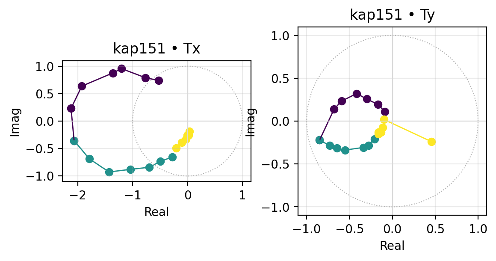
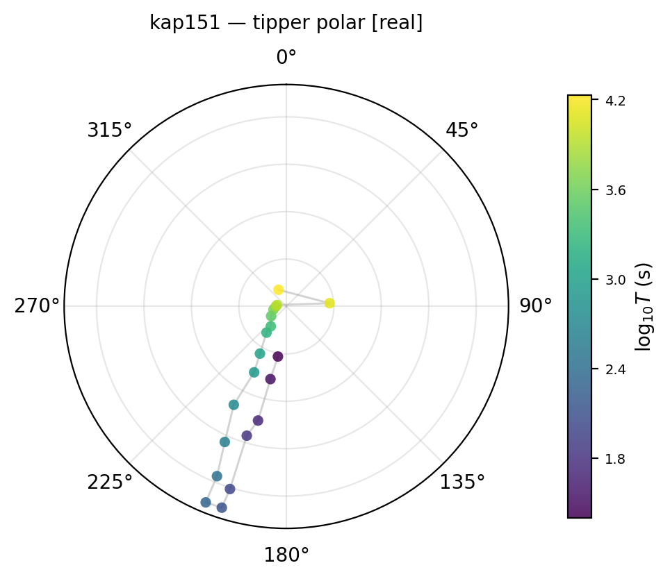
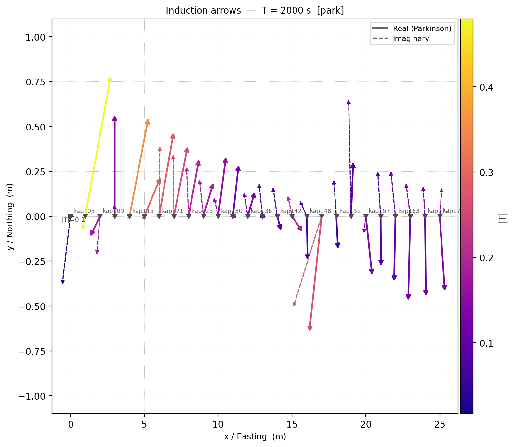
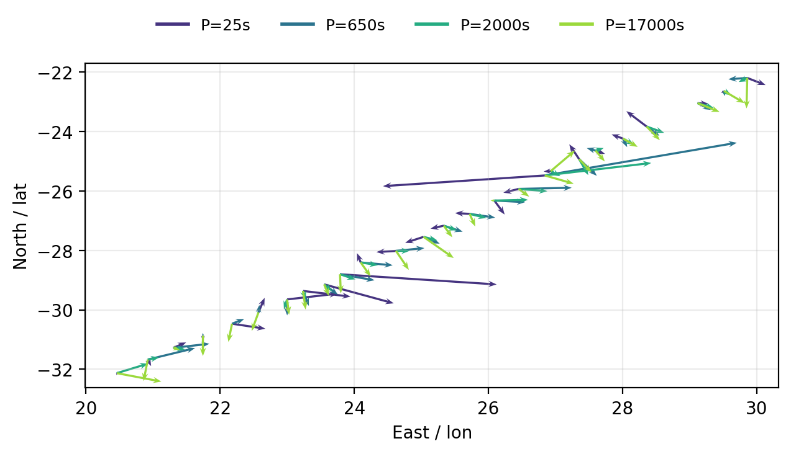
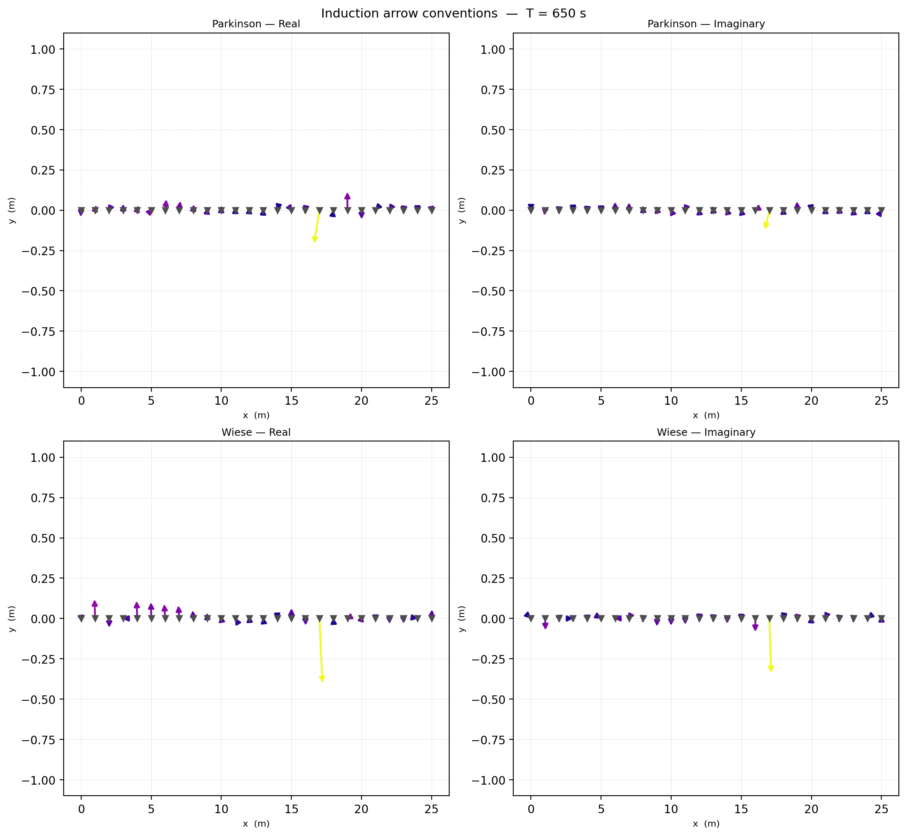
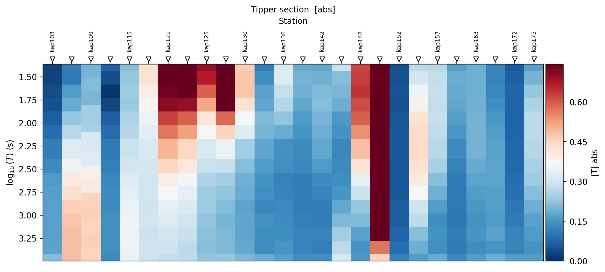
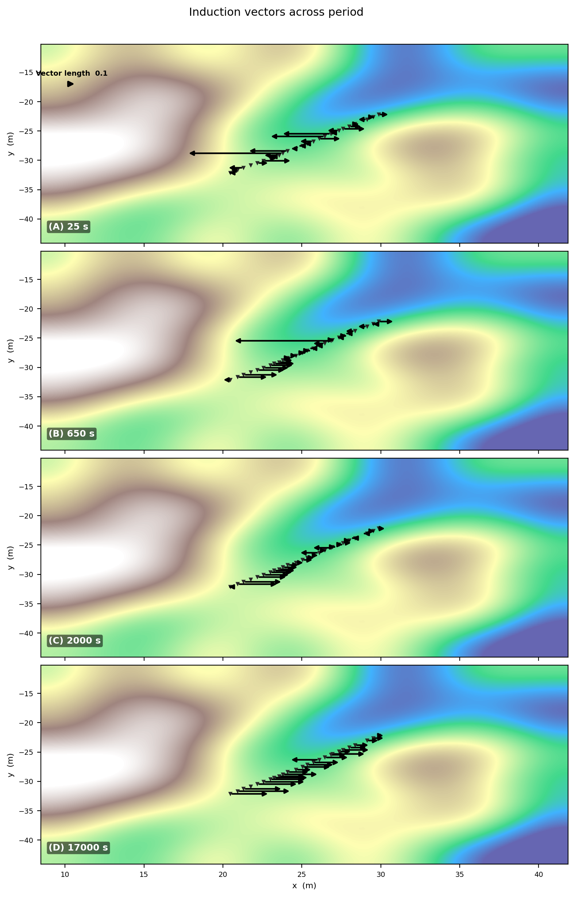
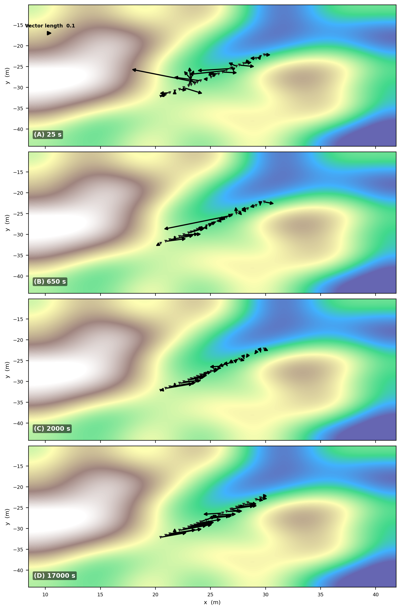

.. _emtools_tf:

Transfer Functions And Tipper Diagnostics
=========================================

The transfer-function tools in ``pycsamt.emtools`` focus on the
vertical-field response, usually called the :term:`tipper`.  The tipper
relates the vertical magnetic field to the horizontal magnetic field:

.. math::

   H_z(f) = T_x(f) H_x(f) + T_y(f) H_y(f).

Here :math:`H_x`, :math:`H_y`, and :math:`H_z` are magnetic-field
Fourier coefficients at frequency :math:`f`, while :math:`T_x` and
:math:`T_y` are complex, frequency-dependent transfer functions.  In a
laterally uniform 1-D earth, the horizontal magnetic field has no
preferred lateral induction contrast to couple into :math:`H_z`, so the
tipper is weak.  When current is channelled by conductors or sharp
resistivity contrasts, the vertical field grows and :term:`induction
vector` arrows become one of the fastest qualitative diagnostics for
conductor position, strike, and period-dependent structure.

It is useful to treat the tipper as a two-component complex vector,

.. math::

   \mathbf{T}(f)
   =
   \begin{bmatrix}
   T_x(f) \\
   T_y(f)
   \end{bmatrix}
   =
   \Re\{\mathbf{T}(f)\}
   +
   i\,\Im\{\mathbf{T}(f)\}.

The real part is the in-phase induction response, the imaginary part is
the quadrature response, and their relative size often changes with
period.

This page covers two related workflows:

.. list-table::
   :header-rows: 1
   :widths: 30 32 38

   * - Workflow
     - Main tools
     - Purpose
   * - EDI or ``Sites`` tipper diagnostics
     - ``plot_tipper_hodograms``, ``plot_tipper_polar``,
       ``plot_induction_map``, ``plot_induction_section``,
       ``plot_induction_rose``
     - Work from assembled transfer functions, usually EDI files.
   * - Spectra-direct tipper diagnostics
     - ``plot_induction_map_from_spectra``,
       ``plot_tipper_polar_from_spectra``,
       ``plot_induction_rose_from_spectra``
     - Work from spectral estimates before a final EDI has been written.

All public functions used below are exported from ``pycsamt.emtools``,
so the examples use the two-level import style.

Use A Dataset With Tipper
-------------------------

Many AMT/CSAMT data sets contain only horizontal electric and magnetic
channels.  Those files can have valid impedance but no vertical magnetic
transfer function.  The tipper functions will then return graceful
``"no tipper"`` messages.

For induction-vector work, first verify that the selected survey really
has tipper data.  The bundled KAP03 long-period MT profile is useful for
examples because it includes vertical-field measurements *and* real
station coordinates -- recovered from ``REFLAT``/``REFLONG`` in
``>=DEFINEMEAS`` when the older, BIRRP-processed ``>HEAD`` block leaves
``LAT=``/``LONG=`` empty, which is the case for every file in this
survey. Every map on this page uses those real coordinates, not an
index-on-a-line fallback.

.. code-block:: pycon

   >>> from pathlib import Path
   >>> import numpy as np
   >>> from pycsamt.emtools import ensure_sites
   >>> edi_dir = Path("data/MT/kap03lmt_edis")
   >>> sites = ensure_sites(
   ...     edi_dir,
   ...     recursive=True,
   ...     on_dup="replace",
   ...     strict=False,
   ...     verbose=0,
   ... )
   >>> print(len(sites), "stations")
   26 stations
   >>> n_valid = sum(
   ...     1 for s in sites
   ...     if s.coords and np.isfinite(s.coords[0]) and np.isfinite(s.coords[1])
   ... )
   >>> print("with usable coordinates:", n_valid, "/", len(sites))
   with usable coordinates: 26 / 26

If a plot says ``"no tipper"``, check the data before changing plotting
options.  Missing tipper is a data-content issue, not necessarily a
failed plot.  If a map plots stations along a flat, evenly spaced line
with no vertical spread, that is the *coordinate* fallback -- check
``site.coords`` before assuming the survey has no real geometry; it may
simply live in a less common EDI location like ``>=DEFINEMEAS`` instead
of the ordinary ``>HEAD`` fields.

What The Tipper Stores
----------------------

For each station and frequency, pyCSAMT expects a two-component complex
tipper:

.. list-table::
   :header-rows: 1
   :widths: 24 76

   * - Quantity
     - Meaning
   * - ``Tx``
     - Complex coefficient relating ``Hx`` to ``Hz``.
   * - ``Ty``
     - Complex coefficient relating ``Hy`` to ``Hz``.
   * - ``real(T)``
     - In-phase part.  Commonly used for Parkinson induction arrows.
   * - ``imag(T)``
     - Quadrature part.  Useful for checking frequency-dependent or
       inductive behavior that is out of phase with the horizontal field.
   * - ``abs(T)``
     - Magnitude, often summarized as
       ``sqrt(abs(Tx)**2 + abs(Ty)**2)``.

You usually do not need to extract these arrays manually.  The plotting
functions read them from the site objects.  Still, understanding the
components helps interpret the figures.

For a selected component :math:`c`, pyCSAMT summarizes vector strength as

.. math::

   |\mathbf{T}_c|
   =
   \sqrt{T_{x,c}^{\,2} + T_{y,c}^{\,2}},

where :math:`c` can be the real part, imaginary part, or complex
magnitude.  For ``component="real"``,
:math:`T_{x,c}=\Re(T_x)` and :math:`T_{y,c}=\Re(T_y)`.  For
``component="imag"``, the imaginary parts are used.  For
``component="abs"``, the norm is built from :math:`|T_x|` and
:math:`|T_y|`.  This is the quantity behind color scales in maps and
sections, and behind the polar radius in single-station views.

Choose Periods And Bands
------------------------

Tipper diagnostics are strongly period-dependent.  A station may be weak
at short period, strong at mid-period, and weak again at long period.
Choose periods and period bands deliberately.

The period is

.. math::

   T = \frac{1}{f}.

When a requested period :math:`T_0` does not exist exactly in every EDI,
the plotting functions use the nearest available sampled period in
log-period space,

.. math::

   j^\ast
   =
   \operatorname*{arg\,min}_j |\log_{10}T_j - \log_{10}T_0|.

This keeps maps and roses reproducible across stations with slightly
different frequency grids, and it holds even when a station's own
frequency array is not stored in strictly ascending or descending order
-- true for two real stations in this survey, ``kap109`` and ``kap145``,
whose files concatenate runs recorded at different sample rates.  A
narrow band should still be chosen only when the original sampling
supports it.

.. code-block:: pycon

   >>> periods = [25.0, 650.0, 2000.0, 17000.0]
   >>> short_band = (25.0, 200.0)
   >>> long_band = (2000.0, 17000.0)
   >>> print("periods:", periods)
   periods: [25.0, 650.0, 2000.0, 17000.0]
   >>> print("short band:", short_band)
   short band: (25.0, 200.0)
   >>> print("long band:", long_band)
   long band: (2000.0, 17000.0)

Use the same period choices across maps, roses, and sections when you
want the figures to support one interpretation.

Single-Station Hodograms
------------------------

Start with ``plot_tipper_hodograms`` when inspecting one station.  It
plots ``Tx`` and ``Ty`` in the complex plane, with colors split by period
band -- a :term:`hodogram`.

For each component, the hodogram point is simply the complex coefficient
written as Cartesian coordinates:

.. math::

   T_x(f) = \Re(T_x(f)) + i\Im(T_x(f)),
   \qquad
   T_y(f) = \Re(T_y(f)) + i\Im(T_y(f)).

Smooth curves through these points indicate that the station response
evolves coherently with period.  A scattered cloud means the azimuth and
amplitude plots should be interpreted with more caution.

.. code-block:: pycon

   >>> import matplotlib.pyplot as plt
   >>> from pycsamt.emtools import plot_tipper_hodograms
   >>> fig = plot_tipper_hodograms(
   ...     sites,
   ...     station="kap151",
   ...     bands=[
   ...         (25.0, 200.0),
   ...         (200.0, 2000.0),
   ...         (2000.0, 17000.0),
   ...     ],
   ...     unit_circle=True,
   ...     normalize=False,
   ... )
   >>> fig.savefig("tf_tipper_hodograms.png", dpi=200, bbox_inches="tight")
   >>> plt.close(fig)

Read a hodogram before reading arrows.  Station ``kap151``'s ``Tx``
traces a large, coherent loop that reaches well outside the unit circle
in the short- and mid-period bands (dark purple and teal) -- real for
strong 3-D/lateral induction, and not automatically an error, but a
clear signal that this station warrants closer inspection before its
arrows are trusted at face value.  ``Ty``'s loop is smaller and stays
closer to the unit circle, so the two components are not equally
reliable here.

Set ``normalize=True`` only when comparing shape rather than amplitude.
For conductor-strength interpretation, keep the raw amplitude.

Single-Station Polar View
-------------------------

``plot_tipper_polar`` converts one station's tipper into azimuth and
magnitude versus period.  The polar angle is the tipper direction, radius
is magnitude, and color is log-period.

For the real component, the displayed azimuth and radius are

.. math::

   \theta_\mathrm{real}(f)
   =
   \operatorname{atan2}\left(\Re(T_y), \Re(T_x)\right),
   \qquad
   r_\mathrm{real}(f)
   =
   \sqrt{\Re(T_x)^2 + \Re(T_y)^2}.

The same formula is used for ``component="imag"`` after replacing the
real parts by imaginary parts.  With ``component="abs"``, the radius is
the complex-vector norm and the displayed direction follows the
component convention used by the plotting helper.

.. code-block:: pycon

   >>> from pycsamt.emtools import plot_tipper_polar
   >>> ax = plot_tipper_polar(
   ...     sites,
   ...     station="kap151",
   ...     component="real",
   ... )
   >>> ax.figure.savefig("tf_tipper_polar.png", dpi=200, bbox_inches="tight")
   >>> plt.close(ax.figure)

Valid components are ``"real"``, ``"imag"``, and ``"abs"``.  Use
``"real"`` for a :term:`Parkinson convention`-style conductor-direction
reading, use ``"imag"`` to inspect the quadrature response, and use
``"abs"`` when you mainly care about magnitude.

Induction Map At One Period
---------------------------

``plot_induction_map`` draws real and imaginary :term:`induction vector`
arrows at a single target period.  The function picks the nearest
available period for each station.

At station :math:`s`, the in-phase arrow is formed from
:math:`\Re(T_x)` and :math:`\Re(T_y)` at the selected period.  The
quadrature arrow is formed from :math:`\Im(T_x)` and :math:`\Im(T_y)`.
The plotted length is scaled for readability,

.. math::

   \mathbf{a}_s^\mathrm{plot}
   =
   q\,\mathbf{a}_s,

where :math:`q` is the display scale.  Changing ``scale`` changes only
the drawing length; it does not change the transfer function.

.. code-block:: pycon

   >>> from pycsamt.emtools import plot_induction_map
   >>> ax = plot_induction_map(
   ...     sites,
   ...     period=2000.0,
   ...     convention="park",
   ...     show_real=True,
   ...     show_imag=True,
   ...     scale=4.0,
   ...     station_labels=True,
   ...     reference_arrow=0.1,
   ... )
   >>> ax.figure.savefig("tf_induction_map.png", dpi=200, bbox_inches="tight")
   >>> plt.close(ax.figure)

The station coordinates come from easting/northing, x/y, or lon/lat when
available, in that priority order; here they are the real ``(lon, lat)``
positions recovered from ``>=DEFINEMEAS``, which is why the axes read
"Longitude" and "Latitude" rather than a distance unit.  If none of
those sources are usable, pyCSAMT falls back to an index along a flat
line -- a real map should never look like an exactly horizontal row of
stations; if one does, check ``site.coords`` before trusting the layout.

``scale`` controls arrow length in plot coordinates.  If arrows are too
small or overlap badly, adjust ``scale`` rather than changing the tipper
data.  The strongest, most coherent arrows here cluster around
``kap121``-``kap130``, in the same part of the profile that the
period section below flags as anomalous across most of the band.

Compare Several Periods On One Axis
-----------------------------------

``plot_induction_arrows`` overlays arrows from several requested periods
on one profile axis.

.. code-block:: pycon

   >>> from pycsamt.emtools import plot_induction_arrows
   >>> ax = plot_induction_arrows(
   ...     sites,
   ...     periods=[25.0, 650.0, 2000.0, 17000.0],
   ...     convention="park",
   ...     scale=1.0,
   ...     normalize=True,
   ...     strike_ticks=False,
   ... )
   >>> ax.figure.savefig("tf_induction_arrows.png", dpi=200, bbox_inches="tight")
   >>> plt.close(ax.figure)

Use this for a fast period comparison, not as the final publication
figure.  Many periods on one axis can become visually crowded.  If the
period behavior matters, follow with a period section or a multi-period
map.

Sign Conventions
----------------

Induction-vector interpretation depends on convention.  The two common
views are :term:`Parkinson convention` and :term:`Wiese convention`.
They are rotated relative to each other, so a figure can be misread if
the convention is not stated.

With the real induction vector written as
:math:`\mathbf{p}=(\Re(T_x),\Re(T_y))`, the Wiese vector can be read as a
quarter-turn rotation,

.. math::

   \mathbf{w}
   =
   \begin{bmatrix}
   0 & -1 \\
   1 & 0
   \end{bmatrix}
   \mathbf{p}.

The sign convention controls whether an arrow is interpreted as pointing
toward a conductor, away from it, or along the related strike-normal
direction.  State the convention in captions whenever induction vectors
are used for interpretation.

``plot_induction_convention`` puts Parkinson/Wiese and real/imaginary
components in one 2-by-2 figure.

.. code-block:: pycon

   >>> from pycsamt.emtools import plot_induction_convention
   >>> _ = plot_induction_convention(
   ...     sites,
   ...     period=650.0,
   ...     station_labels=False,
   ... )
   >>> plt.gcf().savefig("tf_induction_convention.png", dpi=200, bbox_inches="tight")
   >>> plt.close()

Use this plot when communicating with collaborators or comparing to a
paper.  It makes sign and component choices visible instead of leaving
them implicit -- the Wiese panels here are visibly rotated relative to
the Parkinson panels at the same period, exactly as the quarter-turn
formula predicts.

Period Pseudosection
--------------------

``plot_induction_section`` shows tipper magnitude or component strength
over stations and period.

For station :math:`s` and period :math:`T_j`, the section cell is

.. math::

   M_{s,j}
   =
   \begin{cases}
   \sqrt{\Re(T_x)^2 + \Re(T_y)^2}, & \text{real}, \\
   \sqrt{\Im(T_x)^2 + \Im(T_y)^2}, & \text{imag}, \\
   \sqrt{|T_x|^2 + |T_y|^2},       & \text{abs}.
   \end{cases}

This is why ``component="abs"`` is useful for anomaly strength, while
``"real"`` and ``"imag"`` separate in-phase and quadrature behavior.

.. code-block:: pycon

   >>> from pycsamt.emtools import plot_induction_section
   >>> ax = plot_induction_section(
   ...     sites,
   ...     component="abs",
   ...     n_periods=30,
   ...     cmap="RdBu_r",
   ...     section="pseudosection",
   ... )
   >>> ax.figure.savefig("tf_induction_section.png", dpi=200, bbox_inches="tight")
   >>> plt.close(ax.figure)

Use ``component="abs"`` for anomaly strength, ``"real"`` for in-phase
strength, and ``"imag"`` for quadrature strength.  A section is the best
single view for answering: where along the line is the tipper strong,
and at what periods?  Two stations dominate this section: ``kap121``
through ``kap130`` are strong across the short-period half of the band,
while ``kap148`` stands out even more sharply -- saturated dark red
across almost the *entire* period range, not just one band.  A station
that stays anomalous from the shortest to the longest period sampled is
a different kind of feature than one that is only strong in a narrow
window, and deserves separate follow-up.

Induction Rose
--------------

``plot_induction_rose`` summarizes arrow azimuths over all stations and
selected periods.

For each selected sample, the rose angle is

.. math::

   \theta
   =
   \operatorname{atan2}(a_y, a_x)
   \bmod 360^\circ,

where :math:`\mathbf{a}=(a_x,a_y)` is the chosen real, imaginary, or
magnitude-based induction vector.  Unlike :term:`geoelectric strike`,
induction arrows are directional vectors, so the full :math:`0^\circ` to
:math:`360^\circ` circle is meaningful unless you deliberately fold the
result for a separate structural-axis comparison.

.. code-block:: pycon

   >>> from pycsamt.emtools import plot_induction_rose
   >>> ax = plot_induction_rose(
   ...     sites,
   ...     component="real",
   ...     pband=(25.0, 200.0),
   ...     nbins=36,
   ...     title="Short-period induction azimuths",
   ... )
   >>> ax.figure.savefig("tf_induction_rose_short.png", dpi=200, bbox_inches="tight")
   >>> plt.close(ax.figure)
   >>> ax = plot_induction_rose(
   ...     sites,
   ...     component="real",
   ...     pband=(2000.0, 17000.0),
   ...     nbins=36,
   ...     title="Long-period induction azimuths",
   ... )
   >>> ax.figure.savefig("tf_induction_rose_long.png", dpi=200, bbox_inches="tight")
   >>> plt.close(ax.figure)

.. grid:: 2
   :gutter: 2

   .. grid-item::

      .. image:: ../../images/user_guide/emtools/user-guide-emtools-tf-09-01.png
         :width: 100%

   .. grid-item::

      .. image:: ../../images/user_guide/emtools/user-guide-emtools-tf-09-02.png
         :width: 100%

Compare short and long period roses before claiming a regional conductor.
The short-period rose here is genuinely scattered: strong petals near
``0``, ``90``, and ``180`` degrees with no single dominant sector --
consistent with shallow, heterogeneous structure pointing in several
directions at once.  The long-period rose tells a different story: it
tightens sharply toward roughly ``0``-``30`` degrees, with most of the
short-period sectors barely present.  That contrast, not either rose
alone, is the evidence for a deeper, more coherent conductive structure
along a preferred azimuth.

Multi-Period Map
----------------

``plot_induction_multiperiod_map`` stacks one map panel per period and
is the most report-ready induction-vector figure.  It can use real EDI
tipper, or an explicit ``tipper_data`` override.

.. code-block:: pycon

   >>> from pycsamt.emtools import plot_induction_multiperiod_map
   >>> fig, axes = plot_induction_multiperiod_map(
   ...     sites,
   ...     periods=[25.0, 650.0, 2000.0, 17000.0],
   ...     convention="park",
   ...     arrow_scale=6.0,
   ...     reference_arrow=0.1,
   ...     show_background_cbar=False,
   ...     station_labels=False,
   ...     xlabel="Longitude",
   ...     ylabel="Latitude",
   ...     title="Induction vectors across period",
   ... )
   >>> fig.savefig("tf_induction_multiperiod_map.png", dpi=200, bbox_inches="tight")
   >>> plt.close(fig)

``xlabel``/``ylabel`` default to ``"x  (m)"``/``"y  (m)"`` because this
function -- unlike ``plot_induction_map`` -- does not inspect the
coordinate source to relabel itself; pass real axis labels explicitly
whenever the underlying coordinates are geographic, as they are here.
When ``background`` is not supplied, the function draws a synthetic
terrain-like background.  That background is a visual placeholder, not a
real DEM.  For a report, pass your own ``background`` and
``background_extent``.

The fallback EDI read path in this function can only use a single tipper
component in some situations.  When you need full two-component vectors,
pass ``tipper_data`` explicitly as a dictionary keyed by period.  The
example below builds that dictionary from KAP03's own real tipper --
useful both as a template for wiring in your own externally processed
transfer functions, and as a check that the override path reproduces the
EDI-driven map above exactly when fed the same underlying data:

.. code-block:: pycon

   >>> from pycsamt.emtools._core import _iter_items, _name
   >>> from pycsamt.emtools.tf import _get_t_block, _nearest_idx
   >>> override_periods = [25.0, 650.0, 2000.0, 17000.0]
   >>> tipper_data = {}
   >>> for p in override_periods:
   ...     rows = []
   ...     for i, ed in enumerate(_iter_items(sites)):
   ...         _, t, fr = _get_t_block(ed)
   ...         per = 1.0 / fr
   ...         j = _nearest_idx(per, np.array([p]))[0]
   ...         rows.append([t[j, 0], t[j, 1]])
   ...     tipper_data[p] = np.array(rows, dtype=complex)
   >>> print({p: arr.shape for p, arr in tipper_data.items()})
   {25.0: (26, 2), 650.0: (26, 2), 2000.0: (26, 2), 17000.0: (26, 2)}
   >>> print("|T| mean at 25 s:", np.abs(tipper_data[25.0]).mean())
   |T| mean at 25 s: 0.22174234813909238
   >>> fig, axes = plot_induction_multiperiod_map(
   ...     sites,
   ...     periods=list(tipper_data),
   ...     tipper_data=tipper_data,
   ...     arrow_scale=6.0,
   ...     show_background_cbar=False,
   ... )
   >>> fig.savefig(
   ...     "tf_induction_multiperiod_map_synthetic.png",
   ...     dpi=200,
   ...     bbox_inches="tight",
   ... )
   >>> plt.close(fig)

Each ``tipper_data`` value has shape ``(n_stations, 2)`` -- column 0 is
``Tx``, column 1 is ``Ty`` -- and the station order in each array must
match the station order returned by ``ensure_sites`` for the input
survey, which is exactly what iterating ``sites`` itself guarantees
above.  Compare the two figures: they agree, because both are reading
the same real transfer functions, just through two different code paths.
Swap the extraction loop for your own inversion or remote-reference
output to reuse this pattern with genuinely external data.

Spectra-Direct Workflows
------------------------

The spectra-direct helpers work before final EDI assembly.  They expect
``Spectra`` objects or dictionaries of spectra objects and recover the
tipper from spectral estimates.

At the spectra stage, the same transfer function can be estimated from
cross-spectral relationships.  In compact least-squares form, each
frequency solves

.. math::

   \min_{T_x,T_y}
   \left\|
   \mathbf{h}_z
   -
   \mathbf{H}_{xy}
   \begin{bmatrix}
   T_x \\
   T_y
   \end{bmatrix}
   \right\|_2^2,
   \qquad
   \mathbf{H}_{xy}
   =
   \begin{bmatrix}
   h_{x,1} & h_{y,1} \\
   \vdots  & \vdots  \\
   h_{x,N} & h_{y,N}
   \end{bmatrix}.

Here the rows represent time windows or spectral estimates at the same
frequency.  The plotting API does not require you to perform this solve
manually; it asks each spectra object for its tipper (via ``Spectra.to_Z``,
covered on :ref:`emtools_spectra`) and then applies the same map, polar,
and rose formulas used for EDI-based data -- any real
``pycsamt.seg.spectra.Spectra`` object works directly, with no adapter
needed.

Use these functions when your workflow is still at the spectra stage:

.. list-table::
   :header-rows: 1
   :widths: 34 66

   * - Function
     - Use
   * - ``plot_induction_map_from_spectra``
     - Draw real and imaginary induction arrows from one or more spectra
       objects.
   * - ``plot_tipper_polar_from_spectra``
     - Inspect one spectra object's tipper azimuth and magnitude.
   * - ``plot_induction_rose_from_spectra``
     - Summarize spectra-derived induction azimuths over a period band.

The bundled ``data/MT/SPECTRA`` files carry real cross-power spectra and
a real ``HZ`` channel, so their tipper is genuine -- but they are
de-identified (``REFLAT``/``REFLONG`` are zeroed), so a real map still
needs an explicit ``coords`` mapping.  Use a placeholder local grid for
that, and be honest in the caption that the *positions* are placeholders
even though the *tipper values* are not.

.. code-block:: pycon

   >>> from pycsamt.seg.spectra import Spectra
   >>> from pycsamt.emtools import (
   ...     plot_induction_map_from_spectra,
   ...     plot_induction_rose_from_spectra,
   ...     plot_tipper_polar_from_spectra,
   ... )
   >>> spectra_dir = Path("data/MT/SPECTRA")
   >>> sp1 = Spectra.from_file(spectra_dir / "spectra01.edi")
   >>> sp2 = Spectra.from_file(spectra_dir / "spectra02.edi")
   >>> print(sp1.name, "period range:", (1 / sp1.freq).min(), (1 / sp1.freq).max())
   SPECTRA01 period range: 9.615384615384615e-05 0.5813953488372093
   >>> print(sp2.name, "period range:", (1 / sp2.freq).min(), (1 / sp2.freq).max())
   SPECTRA02 period range: 0.003125 2380.9523809523807
   >>> spectra_by_station = {"spectra01": sp1, "spectra02": sp2}
   >>> coords = {
   ...     "spectra01": (0.0, 0.0),
   ...     "spectra02": (500.0, 0.0),
   ... }
   >>> _ = plot_induction_map_from_spectra(
   ...     spectra_by_station,
   ...     coords=coords,
   ...     period=0.1,
   ... )
   >>> plt.gcf().savefig("tf_spectra_induction_map.png", dpi=200, bbox_inches="tight")
   >>> plt.close()
   >>> _ = plot_tipper_polar_from_spectra(
   ...     {"spectra01": sp1},
   ...     component="real",
   ... )
   >>> plt.gcf().savefig("tf_spectra_tipper_polar.png", dpi=200, bbox_inches="tight")
   >>> plt.close()
   >>> _ = plot_induction_rose_from_spectra(
   ...     spectra_by_station,
   ...     component="real",
   ...     pband=(0.003, 0.6),
   ... )
   >>> plt.gcf().savefig("tf_spectra_induction_rose.png", dpi=200, bbox_inches="tight")
   >>> plt.close()

.. grid:: 3
   :gutter: 2

   .. grid-item::

      .. image:: ../../images/user_guide/emtools/user-guide-emtools-tf-12-01.png
         :width: 100%

   .. grid-item::

      .. image:: ../../images/user_guide/emtools/user-guide-emtools-tf-12-02.png
         :width: 100%

   .. grid-item::

      .. image:: ../../images/user_guide/emtools/user-guide-emtools-tf-12-03.png
         :width: 100%

``sp1`` and ``sp2`` barely overlap in period (``0.003``-``0.58`` s), so
``0.1`` s and the ``(0.003, 0.6)`` s rose band were chosen to land inside
both.  For spectra maps, ``coords`` are plot coordinates ``(x, y)``.  A
bare ``Spectra`` object does not carry reliable map geometry, which is
why this is the one map on this page that still needs an explicit
override.

Recommended Workflow
--------------------

A robust tipper interpretation keeps the raw station behavior, the
period behavior, and the sign convention visible -- each already shown
individually above.  The dropdown below is that same sequence as one
self-contained script, reproducing every figure on this page end to
end on KAP03:

.. code-dropdown:: ../../../scripts/generate_user_guide_emtools_tf_figures.py
   :language: python
   :pyobject: run_tf_workflow
   :linenos:
   :title: View the executed workflow source code

This sequence answers the practical questions in order: which station is
strong, whether its response is coherent, where the profile responds,
which convention is being used, whether azimuths tighten with period,
and how the anomaly migrates across period.  On this survey it converges
on the same two features found piecemeal above: ``kap151`` is the
station whose hodogram most rewards a closer look, and ``kap121``
through ``kap148`` are the segment of the profile that stays anomalous
across the widest part of the period band.

Common Pitfalls
---------------

Do not use tipper tools on surveys without vertical-field data and then
interpret ``"no tipper"`` as a geological result.

Always state the sign convention.  Parkinson and Wiese views are rotated
relative to each other.

Do not interpret index-based map axes as geographic distance.  If EDI
coordinates are missing from both ``>HEAD`` and ``>=DEFINEMEAS``, the
plots fall back to station index -- and unlike a missing map, this
failure mode still draws something, so check for an exactly flat,
evenly spaced line before trusting a map's layout.

Do not collapse all periods too early.  A strong whole-band station may
be strong only over a narrow period window -- or, as with ``kap148``
here, genuinely strong across nearly the entire band, which is itself
worth flagging rather than averaging away.

Do not treat synthetic or placeholder backgrounds as real topography in
multi-period maps.  Pass a real background raster for publication.

Worked Example
--------------

The gallery example uses the KAP03 MT profile with real tipper
data.  It moves from station-level hodograms and polar plots to maps,
convention comparisons, roses, period sections, and a multi-period
publication-style map.

Open the rendered gallery page here:
:ref:`sphx_glr_examples_emtools_plot_tf.py`.
