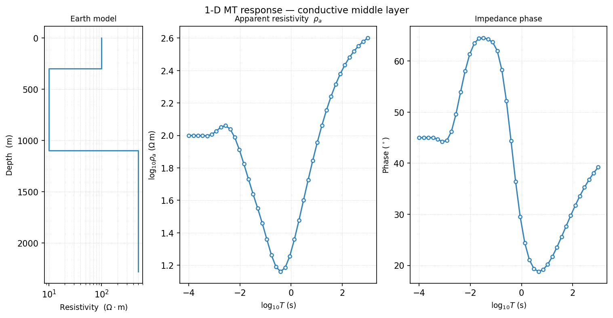
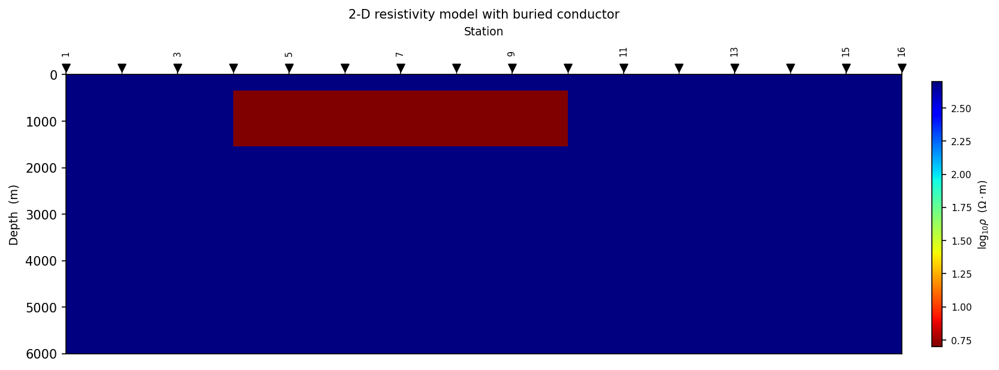
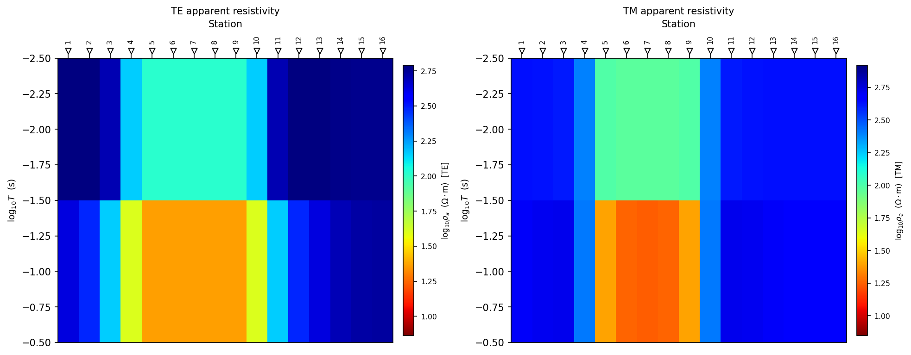
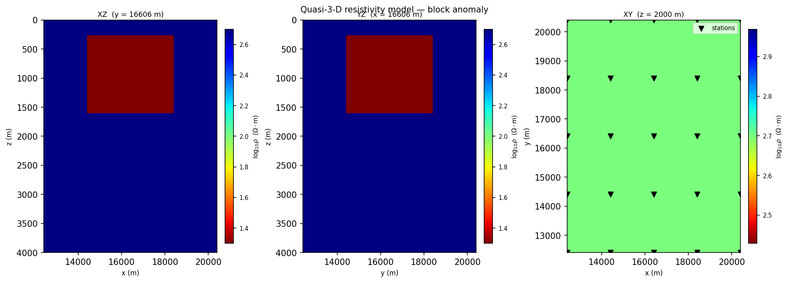
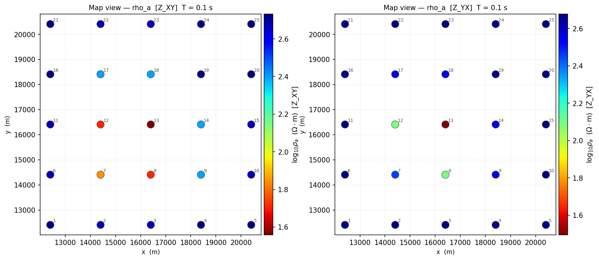
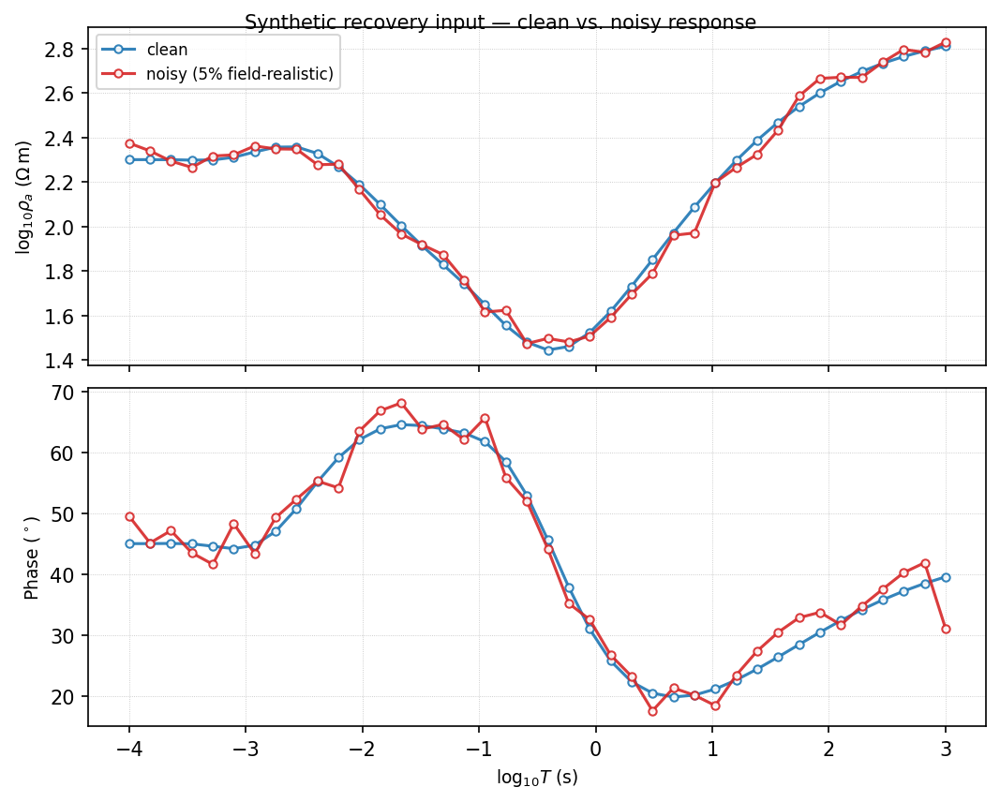

.. _forward_concepts:

Forward Modelling Concepts
==========================

Forward modelling is the controlled side of electromagnetic interpretation.
The model is known, the survey geometry is known, and the solver computes the
response. Inversion reverses this relationship: the response is known and the
model is estimated.

In pyCSAMT, forward modelling is used for five related tasks:

* computing synthetic :term:`MT`, :term:`CSAMT`, and :term:`TEM` responses
  from known models;
* testing whether a target should be visible at a planned frequency range,
  time range, and station spacing;
* generating :term:`synthetic data` for AI inversion;
* validating inversion settings with :term:`synthetic recovery` tests;
* producing diagnostic plots that explain why an inversion succeeds or fails.

The forward package is intentionally separate from
:mod:`pycsamt.models`. :mod:`pycsamt.forward` contains in-process solvers,
grids, synthetic models, noise models, and datasets. :mod:`pycsamt.models`
wraps external engines such as Occam2D, ModEM, and MARE2DEM.

The Forward Problem
-------------------

For an electromagnetic forward problem, pyCSAMT usually works with:

* a resistivity model :math:`\rho(\mathbf{x})`;
* a source assumption, such as a :term:`plane-wave field` MT source, a
  :term:`controlled-source` approximation, or a TEM transmitter loop;
* receiver locations and sampled frequencies or time gates;
* a solver that implements a physical approximation;
* response quantities such as impedance, apparent resistivity, phase, or
  transient decay.

Every one of those choices feeds a single relationship, the
:term:`forward operator` :math:`F`, which maps model :math:`m` to predicted
data:

.. math::

   d_{\mathrm{pred}} = F(m).

Inversion searches the same relationship from the other direction, adjusting
:math:`m` until predicted and observed data agree within the assigned errors
while the model itself stays well behaved:

.. math::

   \Phi(m) = \Phi_d(m) + \lambda \Phi_m(m), \qquad
   \Phi_d(m) = \left\| W_d \left(d_{\mathrm{obs}} - F(m)\right) \right\|_2^2.

:math:`\Phi_d` is the data misfit, :math:`\Phi_m` is the model penalty, and
:math:`\lambda` trades one off against the other --
:doc:`../../theory/inversion_concepts` works through this objective in full.
What matters here is that :math:`F` is not a side detail: it defines how a
model is compared to data in the first place, so a forward assumption that
does not match the true physics can let an inversion fit the data while still
producing a misleading model.

Physical Inputs
---------------

A useful forward experiment should make every physical input explicit --
which :term:`layered model` or grid describes the earth, which
:term:`frequency grid` or time gates are sampled, and which noise model is
applied before the response is called "data".

.. list-table::
   :header-rows: 1
   :widths: 26 34 40

   * - Input
     - pyCSAMT object or setting
     - Why it matters
   * - Resistivity model
     - ``LayeredModel``, ``Grid2D``, ``Grid3D``
     - Defines where current can flow and where fields diffuse.
   * - Dimensionality
     - 1-D, 2-D, quasi-3-D
     - Controls which geological structures the solver can represent.
   * - Frequency grid
     - ``freqs`` or ``ForwardConfig.freq_grid()``
     - Sets the period range and depth sensitivity for MT/CSAMT.
   * - Time gates
     - ``times`` or ``ForwardConfig.time_grid()``
     - Sets the transient sampling for TEM.
   * - Source assumption
     - MT plane wave, CSAMT source offset, TEM loop
     - Determines whether the response is natural-source, controlled-source,
       or transient.
   * - Station layout
     - ``x_stations`` or ``stations_xy``
     - Controls lateral sampling and pseudo-section geometry.
   * - Noise model
     - ``GaussianNoise``, ``MultiplicativeNoise``,
       ``FieldRealisticNoise``
     - Makes synthetic data closer to field conditions.

The minimum reproducible forward run should record the model, solver, sampled
axis, station geometry, noise model, :term:`random seed`, and output file.

Dimensionality
--------------

The forward package exposes three practical :term:`dimensionality` levels.
Each is a deliberate approximation, not merely a larger array shape --
the 1-D and 2-D levels solve their governing equations directly, while the
:term:`quasi-3-D` level trades exact 3-D physics for the speed of reusing a
2-D solver on orthogonal slices.

.. list-table::
   :header-rows: 1
   :widths: 16 30 30 24

   * - Level
     - Objects
     - Best use
     - Main limitation
   * - 1-D
     - ``LayeredModel``, ``MT1DForward``, ``CSAMT1DForward``,
       ``TEM1DForward``
     - Fast soundings, method comparison, synthetic AI datasets, and
       sanity checks.
     - No lateral structure.
   * - 2-D
     - ``Grid2D``, ``MT2DForward``
     - Survey-line responses, TE/TM comparison, anomaly tests, and
       pseudo-sections.
     - Assumes structure is constant along strike.
   * - Quasi-3-D
     - ``Grid3D``, ``MT3DForward``
     - Area-style station layouts, approximate tensor responses, and
       survey-scale synthetic experiments.
     - Approximate 3-D physics; not a replacement for a full 3-D production
       solver.

Use the simplest dimensionality that can represent the question. If the
question is "Can a conductive layer be detected?", 1-D may be enough. If the
question is "Can stations across a profile detect a buried block?", use 2-D.
If the question involves area coverage, :term:`tensor` components, or
spatially correlated training data, :term:`quasi-3-D` is more appropriate.

1-D Forward Models
------------------

A :term:`layered model` is a stack of horizontal layers. Resistivity varies
with depth only:

.. math::

   \rho(\mathbf{x}) = \rho(z).

:class:`pycsamt.forward.LayeredModel` stores layer resistivities and
thicknesses. The final layer is the :term:`half-space` and has no thickness
value.

.. code-block:: pycon

   >>> import numpy as np
   >>> from pycsamt.forward import LayeredModel, MT1DForward
   >>> model = LayeredModel(
   ...     resistivity=[100.0, 10.0, 500.0],
   ...     thickness=[300.0, 800.0],
   ...     name="conductive_middle_layer",
   ... )
   >>> freqs = np.logspace(-3, 4, 40)
   >>> response = MT1DForward(freqs).run(model)
   >>> response.rho_a.shape
   (40,)
   >>> response.phase.shape
   (40,)

Each of the 40 sampled frequencies produced one apparent-resistivity and one
phase value. Plotting the model beside its response makes the connection
between the two arrays concrete -- a conductive middle layer pulls apparent
resistivity down and phase up across a mid-period band, then both return
toward the deep :term:`half-space` value at long period:

   Earth model (left), apparent resistivity (middle), and phase (right) for
   the conductive-middle-layer example above, produced with
   :func:`pycsamt.forward.plot.plot_response_and_model_1d`.

1-D forward modelling is fast because each frequency or time gate only needs
to propagate fields through a layer stack. That makes it ideal for:

* :term:`synthetic data` training sets with thousands or millions of samples;
* checking :term:`apparent resistivity` and :term:`phase` behaviour;
* designing :term:`frequency grid`\ s;
* comparing :term:`MT`, :term:`CSAMT`, and :term:`TEM` sensitivity;
* teaching and debugging inversion concepts.

It is not appropriate when station-to-station variation is caused by lateral
geology rather than noise or near-surface distortion -- that is what the 2-D
and quasi-3-D levels below are for.

MT, CSAMT, And TEM Assumptions
------------------------------

The 1-D solvers share the same model container but represent different field
methods.

.. list-table::
   :header-rows: 1
   :widths: 24 26 26 24

   * - Solver
     - Source assumption
     - Sampled axis
     - Main output
   * - ``MT1DForward``
     - Natural plane wave
     - Frequency :math:`f`
     - Impedance, :math:`\rho_a`, phase.
   * - ``CSAMT1DForward``
     - Controlled-source AMT with far-field MT-like behaviour and optional
       near-field correction.
     - Frequency :math:`f`
     - Impedance, :math:`\rho_a`, phase.
   * - ``TEM1DForward``
     - Central-loop step-off transient.
     - Time :math:`t`
     - :math:`\partial B_z / \partial t`.

For :term:`MT` and :term:`CSAMT`, angular frequency is:

.. math::

   \omega = 2 \pi f.

For a 1-D MT response, :term:`apparent resistivity` is computed from the
surface :term:`impedance tensor` :math:`Z`:

.. math::

   \rho_a = \frac{|Z|^2}{\mu_0 \omega}.

The impedance :term:`phase` is:

.. math::

   \phi = \tan^{-1}\left(\frac{\operatorname{Im}(Z)}
                              {\operatorname{Re}(Z)}\right).

:term:`TEM` is different. It observes a transient decay after transmitter
current changes, rather than the continuous-wave impedance MT and CSAMT
estimate. A useful scale estimate is:

.. math::

   z(t) \propto \sqrt{\frac{\rho t}{\mu_0}},

where later times and more resistive earth tend to sample greater depths.
This is only a sensitivity scale, not a direct depth conversion.

2-D Forward Modelling
---------------------

In a 2-D model, resistivity varies with horizontal distance and depth but is
constant along strike:

.. math::

   \rho(\mathbf{x}) = \rho(x, z).

:class:`pycsamt.forward.Grid2D` stores cell widths, depths, resistivity, and
station positions. :class:`pycsamt.forward.MT2DForward` solves both
:term:`TE mode` and :term:`TM mode` polarizations on the grid.

.. code-block:: pycon

   >>> from pycsamt.forward import Grid2D, MT2DForward
   >>> grid = Grid2D.with_anomaly(
   ...     bg_rho=500.0,
   ...     anomaly_rho=5.0,
   ...     anomaly_bounds=(2000.0, 6000.0, 300.0, 1500.0),
   ...     nx=50,
   ...     nz=35,
   ...     x_max=10_000.0,
   ...     z_max=6000.0,
   ...     n_pad=8,
   ...     n_stations=16,
   ... )
   >>> response = MT2DForward(
   ...     freqs=[1.0, 10.0, 100.0],
   ...     grid=grid,
   ...     verbose=False,
   ... ).run()
   >>> features = response.to_feature_array(mode="both")
   >>> features.shape
   (16, 12)

Sixteen stations times three frequencies times both modes' apparent
resistivity and phase gives the twelve columns above. Plotting the model
itself shows why: a conductive block sits under the middle of the line,
between roughly 300 m and 1500 m depth --

   The ``Grid2D.with_anomaly`` model, plotted with
   :func:`pycsamt.forward.plot.plot_model_2d`. Station markers sit on the
   surface; the anomaly is the red block.

The TE mode uses electric field parallel to strike. In pyCSAMT's 2-D
response object, this corresponds to ``ZXY``. The TM mode uses magnetic field
parallel to strike and corresponds to ``ZYX`` by convention.

.. list-table::
   :header-rows: 1
   :widths: 18 32 50

   * - Mode
     - Response component
     - Interpretation note
   * - TE
     - ``zxy``, ``rho_a_te``, ``phase_te``
     - Often sensitive to conductive structures connected along strike.
   * - TM
     - ``zyx``, ``rho_a_tm``, ``phase_tm``
     - Often responds strongly to charge accumulation across resistivity
       contrasts.

Computing both modes' pseudo-sections side by side over the same block
anomaly shows the asymmetry directly: the TE section spreads the anomaly's
signature laterally beyond the block's true footprint, while the TM section
stays closer to it but with a sharper, higher-contrast core --

   TE (left) and TM (right) apparent-resistivity pseudo-sections for the same
   model, built with :func:`pycsamt.forward.plot.plot_pseudosection_2d`.

The TE/TM distinction is important for inversion. A 2-D inversion that fits
one mode but not the other may be telling you that the dimensionality
assumption, strike direction, :term:`static shift` correction, or error model
needs review.

Quasi-3-D Forward Modelling
---------------------------

The :term:`quasi-3-D` solver is designed for survey-scale synthetic
experiments and AI training where station layouts are two-dimensional but a
full production 3-D solver would be too expensive.

:class:`pycsamt.forward.MT3DForward` extracts orthogonal 2-D slices from a
:class:`pycsamt.forward.Grid3D`, solves 2-D responses, and assembles an
approximate :term:`tensor` response. It can return ``xy``, ``yx``, ``xx``, and
``yy`` apparent resistivity and phase arrays.

.. code-block:: pycon

   >>> from pycsamt.forward import Grid3D, MT3DForward
   >>> grid = Grid3D.block_anomaly(
   ...     bg_rho=500.0,
   ...     anomaly_rho=20.0,
   ...     bounds=(2000.0, 6000.0, 2000.0, 6000.0, 300.0, 1500.0),
   ...     nx=20,
   ...     ny=20,
   ...     nz=15,
   ...     x_max=8000.0,
   ...     y_max=8000.0,
   ...     z_max=4000.0,
   ...     nx_stations=5,
   ...     ny_stations=5,
   ... )
   >>> response = MT3DForward(
   ...     freqs=[1.0, 10.0, 100.0],
   ...     grid=grid,
   ...     method="quasi3d",
   ...     verbose=False,
   ... ).run()
   >>> x = response.to_feature_array(components="xy_yx")
   >>> x.shape
   (25, 12)

Twenty-five stations on the 5x5 layout, times three frequencies, times the
``xy``/``yx`` components' apparent resistivity and phase, gives the twelve
columns above. The three orthogonal slices through the block anomaly show
what the solver actually sees before it is collapsed into station-wise
features:

   XZ, YZ, and XY (map-view) slices through the block-anomaly grid, plotted
   with :func:`pycsamt.forward.plot.plot_model_3d`. Station markers appear on
   the map-view panel.

The station map view of the assembled response shows the anomaly's footprint
directly beneath the stations that sit above it, with ``xy`` and ``yx``
picking up slightly different edges of the block because each is assembled
from a different slice direction:

   ``xy`` (left) and ``yx`` (right) apparent resistivity at the second
   sampled frequency, plotted station-by-station with
   :func:`pycsamt.forward.plot.plot_response_map_3d`.

The quasi-3-D result is useful for:

* generating spatially varying synthetic responses;
* testing station-layout effects;
* building AI datasets with multi-station features;
* checking tensor-style plotting and response maps;
* developing workflows before moving to :term:`ModEM` or :term:`MARE2DEM`.

It should not be presented as a full 3-D Maxwell solver result for final
geological interpretation. For production 3-D inversion and reporting, use an
appropriate external backend such as :doc:`../models/modem` or
:doc:`../models/mare2dem`.

Frequency, Period, And Depth Sensitivity
----------------------------------------

Frequency-domain EM responses are commonly plotted against period
:math:`T = 1/f`. Lower frequencies, or longer periods, generally sample
greater depths. A useful plane-wave :term:`skin depth` scale is:

.. math::

   \delta \approx 503 \sqrt{\frac{\rho}{f}},

where :math:`\delta` is in metres when :math:`\rho` is in :math:`\Omega m`
and :math:`f` is in Hz -- the same relation the 1-D, 2-D, and quasi-3-D
examples above all reduce to when their period axis is read as a depth
proxy.

This is only a scale estimate. Actual sensitivity depends on:

* :term:`dimensionality`;
* source geometry;
* resistivity contrast;
* station spacing;
* topography and near-surface structure;
* error floors and noise;
* which response component is used.

Still, the skin-depth estimate is useful when choosing frequency ranges. If
the lowest frequency is too high, a deep target may not affect the response
enough to recover. If the highest frequency is too low, shallow structure may
be poorly resolved.

Response Quantities
-------------------

Forward responses are returned in physical arrays and can also be flattened
into a :term:`feature array` for AI and inversion experiments -- the
``features.shape`` and ``x.shape`` values printed in the 2-D and quasi-3-D
examples above are exactly this flattening at work.

.. list-table::
   :header-rows: 1
   :widths: 24 35 41

   * - Quantity
     - Where it appears
     - Use
   * - :term:`Impedance tensor` ``z``
     - ``ForwardResponse.z``, ``zxy``, ``zyx``, tensor components
     - Native frequency-domain EM response.
   * - :term:`Apparent resistivity` ``rho_a``
     - 1-D, 2-D, quasi-3-D response objects
     - Easy to inspect across period and station.
   * - :term:`Phase`
     - 1-D, 2-D, quasi-3-D response objects
     - Adds independent information about conductivity contrasts and
       inductive behaviour.
   * - ``dBz_dt``
     - ``TEM1DForward``
     - Time-domain transient decay.
   * - :term:`Feature array`
     - ``to_array`` or ``to_feature_array``
     - Machine-learning or inversion-ready data vector.

For :term:`MT`/:term:`CSAMT` training data, a common feature vector is:

.. code-block:: text
   :linenos:

   [log10(rho_a_0), ..., log10(rho_a_n),
    phase_0, ..., phase_n]

For 2-D and quasi-3-D responses, the feature array is usually organized by
station, so the result has shape ``(n_stations, n_features)``.

Synthetic Priors
----------------

A :term:`synthetic data` set is only as useful as its model prior. If the
prior contains unrealistic resistivity ranges, layer counts, depths, or
lateral correlation, the trained model may perform well on synthetic
validation data and poorly on field data.

``LayeredModel`` supports several constructors for building a
:term:`layered model` prior:

.. list-table::
   :header-rows: 1
   :widths: 28 72

   * - Constructor
     - Purpose
   * - ``LayeredModel.random``
     - Draws random layer resistivities and thicknesses from broad bounds.
   * - ``LayeredModel.blocky``
     - Builds sharper layered contrasts.
   * - ``LayeredModel.smooth``
     - Builds smoother vertical variation.
   * - ``LayeredModel.from_geology``
     - Uses named geological priors such as sedimentary, crystalline,
       geothermal, marine, and permafrost settings.

Use geological priors when the goal is AI training for a known target class.
Use broader random priors when the goal is method exploration or robustness
testing.

Noise And Realism
-----------------

Noise-free synthetic data are useful for checking solver behaviour, but they
are usually too clean for training robust AI models or evaluating field
workflows. pyCSAMT includes :term:`Gaussian noise`, :term:`multiplicative
noise`, and :term:`field-realistic noise` models so synthetic responses can
include controlled uncertainty.

.. list-table::
   :header-rows: 1
   :widths: 26 36 38

   * - Noise model
     - Meaning
     - Good use
   * - ``GaussianNoise``
     - Adds independent perturbations to response values.
     - Baseline uncertainty tests.
   * - ``MultiplicativeNoise``
     - Applies log-space relative perturbations.
     - Responses spanning orders of magnitude.
   * - ``FieldRealisticNoise``
     - Adds frequency-dependent noise, dead-band effects, and power-line
       style contamination.
     - MT/CSAMT training data and field-like stress tests.

Noise should be documented as part of the experiment:

* noise type;
* noise level;
* :term:`random seed`;
* whether phase was included;
* any response clipping or log transform;
* the final saved dataset path.

Synthetic Recovery
------------------

The most useful forward experiment is often a :term:`synthetic recovery`
test. The workflow is:

#. create a known model;
#. compute a clean response;
#. add controlled noise;
#. invert the synthetic response;
#. compare recovered and true models;
#. repeat with different frequencies, noise levels, and regularization.

The first three steps -- the forward half of the workflow -- build the input
an inversion would then be asked to recover from:

.. code-block:: pycon

   >>> import numpy as np
   >>> from pycsamt.forward import FieldRealisticNoise, LayeredModel, MT1DForward
   >>> true_model = LayeredModel(
   ...     resistivity=[200.0, 20.0, 800.0],
   ...     thickness=[400.0, 1200.0],
   ... )
   >>> freqs = np.logspace(-3, 4, 40)
   >>> clean = MT1DForward(freqs).run(true_model)
   >>> noisy = FieldRealisticNoise(base_level=0.05).apply(clean, seed=0)
   >>> features = noisy.to_array(include_phase=True)
   >>> features.shape
   (80,)

Forty frequencies times apparent resistivity and phase gives the eighty
values above. Overlaying the clean and noisy curves shows exactly what the
5% :term:`field-realistic noise` model added -- scatter that grows toward the
shortest and longest periods, where the underlying signal is weakest:

   Clean (blue) and 5% field-realistic-noise (red) responses for the same
   model, overlaid with :func:`pycsamt.forward.plot.plot_response_1d`.

An inversion given ``features`` would then be checked against ``true_model``.
This test does not prove that a field inversion is correct. It proves that,
under controlled assumptions, the inversion workflow can recover a known
model from a response similar to the one being studied.

Common Failure Modes
--------------------

Forward modelling is often where mistakes are easiest to catch.

.. list-table::
   :header-rows: 1
   :widths: 34 66

   * - Symptom
     - Likely cause
   * - Apparent resistivity is flat for every model.
     - Frequency range may not sample the target depth, or the model contrast
       is too weak.
   * - Phase looks unrealistic or unstable.
     - Sign convention, component choice, or numerical resolution may need
       review.
   * - 2-D stations show no lateral variation.
     - The anomaly may be too deep, too small, outside the station aperture,
       or masked by grid/padding choices.
   * - Quasi-3-D tensor components look over-interpreted.
     - Remember that the method is approximate and assembled from 2-D
       profiles.
   * - AI training accuracy is high but field performance is poor.
     - Synthetic priors, noise model, or feature layout may not match field
       conditions.
   * - Inversion recovers the wrong model in a synthetic test.
     - The problem may be non-unique, under-sampled, over-regularized, or
       using incompatible data errors.

Good Practice Checklist
-----------------------

Before using a forward response in inversion, training, or reporting, verify:

* the dimensionality matches the question;
* resistivity values and thicknesses are physically plausible;
* sampled frequencies or times cover the expected target sensitivity;
* station spacing resolves the lateral scale of interest;
* padding and grid resolution are adequate;
* response units and component labels are clear;
* noise settings are recorded and reproducible;
* feature arrays include the intended quantities;
* plots have been reviewed for obvious physical or numerical issues.

Next Steps
----------

* :doc:`configuration` explains source-of-truth configuration files.
* :doc:`solvers_and_grids` gives concrete solver and grid examples.
* :doc:`synthetic_datasets` explains dataset generation and noise.
* :doc:`plotting` shows how to inspect responses and models.
* :doc:`forward_to_inversion` connects forward tests to inversion workflows.
* :doc:`../../theory/inversion_concepts` provides the inversion background.
