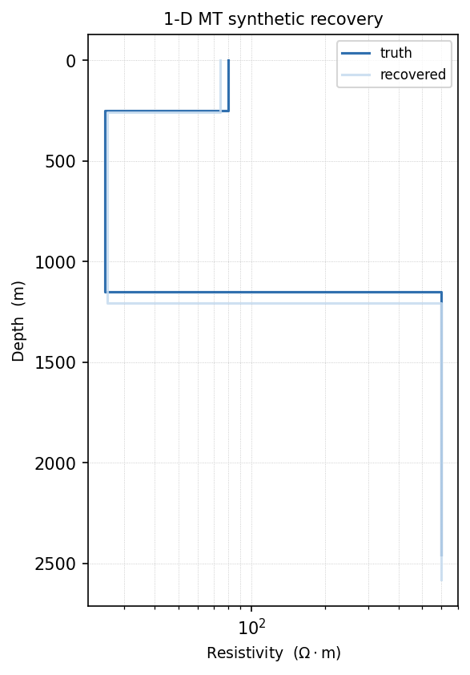
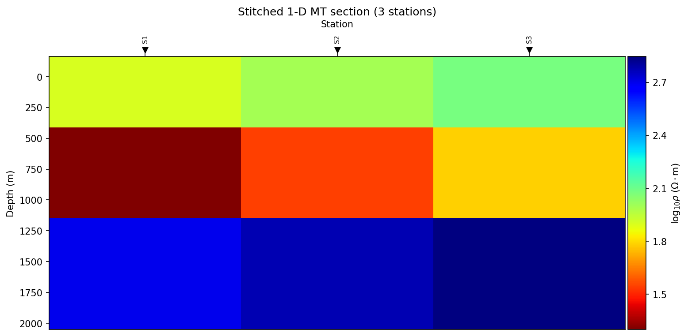

.. _forward_to_inversion:

From Forward Modelling To Inversion
===================================

Forward modelling and inversion are the two directions of the same
:term:`forward operator`. A forward model predicts observations from a known
earth model:

.. math::
   :label: eq-forward-operator

   d_{\mathrm{pred}} = F(m).

An inversion runs the same operator inside a search, adjusting :math:`m`
until predicted and observed data agree while the model itself stays well
behaved:

.. math::
   :label: eq-inversion-objective

   \Phi(m) = \Phi_d(m) + \lambda \Phi_m(m), \qquad
   \Phi_d(m) = \left\| W_d \left(d_{\mathrm{obs}} - F(m)\right) \right\|_2^2.

:math:`W_d` contains the data uncertainties, :math:`\Phi_m` is the model
penalty, and :math:`\lambda` controls the trade-off between fitting the data
and keeping the model simple -- see :doc:`concepts` and
:doc:`../../theory/inversion_concepts` for how each piece is built up.

In pyCSAMT, the forward package helps answer the question:

   "If this geology existed, what would the survey measure?"

The inversion package helps answer the complementary question:

   "Given what the survey measured, which class of models can explain it?"

The bridge between the two is not only a Python object. It is a modelling
contract: units, shapes, station geometry, noise assumptions, model
parameterization, and backend dimensionality must remain consistent.

The Handoff Contract
--------------------

Before sending synthetic or field data to an inversion backend, make the
following contract explicit.

.. list-table::
   :header-rows: 1
   :widths: 24 36 40

   * - Item
     - Forward-side meaning
     - Inversion-side requirement
   * - Method
     - :term:`MT`, :term:`AMT`, :term:`CSAMT`, :term:`EMAP`, or :term:`TDEM`
       response type.
     - ``InversionConfig.method`` must match the data family.
   * - :term:`Dimensionality`
     - 1-D :term:`layered model`, 2-D profile, or :term:`quasi-3-D` grid.
     - ``InversionConfig.dimension`` and ``backend`` must support the same
       interpretation.
   * - Frequency or time axis
     - ``freqs`` for frequency-domain responses, ``times`` for TDEM gates.
     - Axis order must match every response array.
   * - Response arrays
     - Apparent resistivity and phase, or TDEM decay values.
     - Use backend-neutral keys such as ``rho_a``, ``phase``, and ``values``.
   * - Station geometry
     - Station positions created by a profile or grid.
     - Preserve ``station_x`` and ``station_names`` for profile inversions.
   * - Error model
     - Noise added to synthetic data, or field uncertainty estimates.
     - Configure ``error_floor``, ``phase_error``, or explicit errors.
   * - Starting model
     - A plausible low-resolution model, not the hidden truth.
     - Provide ``StartingModel`` or a compatible mapping when the backend uses
       layered parameters.
   * - Truth model
     - The known model used in a :term:`synthetic recovery` experiment.
     - Store it as metadata or in the experiment archive for later comparison.

The most common backend-neutral data mappings are:

.. list-table::
   :header-rows: 1
   :widths: 22 38 40

   * - Workflow
     - Data keys
     - Array convention
   * - MT, AMT, CSAMT 1-D
     - ``freqs``, ``rho_a``, ``phase``
     - ``rho_a`` and ``phase`` are one-dimensional arrays with length
       ``n_frequencies``.
   * - TDEM 1-D
     - ``times``, ``values``
     - ``values`` is a one-dimensional decay array with length ``n_times``.
   * - Frequency-domain profile
     - ``freqs``, ``rho_a``, ``phase``, ``station_x``
     - ``rho_a`` and ``phase`` use shape
       ``(n_stations, n_frequencies)``.
   * - TDEM profile
     - ``times``, ``values``, ``station_x``
     - ``values`` uses shape ``(n_soundings, n_times)``.
   * - Native external run
     - Backend-specific files and options.
     - Use the model backend page for native file generation and execution.

The forward 2-D response containers store frequency first, for example
``response.rho_a_te`` has shape ``(n_frequencies, n_stations)``. The inversion
profile API expects station first. Transpose the arrays when moving directly
from ``MT2DForward`` to a profile inversion.

Why Synthetic Recovery Comes First
----------------------------------

A forward response shows whether a target can influence the data. A
:term:`synthetic recovery` test checks whether the planned inversion can
recover that influence under realistic assumptions. This is a different and
stricter question.

A useful recovery loop is:

#. define a known truth model;
#. compute the clean forward response;
#. add controlled noise;
#. choose an inversion parameterization and starting model;
#. invert the synthetic data;
#. compare recovered and true models;
#. inspect residuals, uncertainty, convergence history, and artefacts;
#. repeat with modified frequency range, station spacing, noise, and
   regularization.

The test should include at least one easy model and one difficult model. The
easy model confirms that the mechanics are correct. The difficult model exposes
non-uniqueness, poor sensitivity, and resolution limits.

1-D MT Recovery
---------------

The smallest complete bridge is a 1-D layered MT recovery. The forward response
is converted into the backend-neutral inversion mapping using ``freqs``,
``rho_a``, and ``phase``. Paste the whole block into a script: it builds the
truth model, the noisy synthetic data, and the inversion configuration in one
pass.

.. code-block:: pycon
   :linenos:

   >>> import numpy as np

   >>> from pycsamt.forward import FieldRealisticNoise, LayeredModel, MT1DForward
   >>> from pycsamt.inversion import InversionConfig, InversionWorkflow, StartingModel

   >>> freqs = np.logspace(-2, 2, 16)

   >>> truth = LayeredModel(
   ...     resistivity=[80.0, 25.0, 600.0],
   ...     thickness=[250.0, 900.0],
   ... )

   >>> clean = MT1DForward(freqs=freqs).run(truth)
   >>> noisy = FieldRealisticNoise(base_level=0.05).apply(clean, seed=42)

   >>> cfg = InversionConfig(
   ...     method="mt",
   ...     dimension="1d",
   ...     backend="builtin",
   ...     data={
   ...         "freqs": freqs,
   ...         "rho_a": noisy.rho_a,
   ...         "phase": noisy.phase,
   ...     },
   ...     starting_model=StartingModel(
   ...         resistivities=[100.0, 50.0, 500.0],
   ...         thicknesses=[300.0, 1000.0],
   ...     ),
   ...     error_floor=0.05,
   ...     phase_error=3.0,
   ...     regularization="smooth",
   ...     max_iter=25,
   ...     metadata={
   ...         "experiment": "synthetic_mt_1d_recovery",
   ...         "noise_seed": 42,
   ...     },
   ... )

   >>> result = InversionWorkflow(cfg).run()

   >>> print(result.summary())
   InversionResult(method='mt', dimension='1d', backend='builtin', status='converged', rms=0.851)
   >>> recovered = result.model
   >>> print("recovered resistivities:", np.round(recovered.resistivities, 1))
   recovered resistivities: [ 74.3  25.6 596. ]
   >>> print("truth resistivities:    ", truth.resistivity)
   truth resistivities:     [ 80.  25. 600.]

The starting model was off by 20-100% on every layer, and 25 iterations were
enough to land within a few percent of the truth on all three -- the middle
conductive layer, which dominates the mid-period response, recovers almost
exactly. Plotting the two side by side makes the same point visually:

   Truth and recovered models, plotted with
   :func:`pycsamt.forward.plot.plot_model_1d`.

Use the result diagnostics, not only the recovered layer values, to judge
whether that agreement is trustworthy rather than lucky:

.. code-block:: pycon
   :linenos:

   >>> if result.history is not None:
   ...     history = result.history.arrays()
   ...     print("objective (final):", round(float(history["objective"][-1]), 4))
   ...     print("rms (final):", round(float(history["rms"][-1]), 4))
   ...
   objective (final): 23.1926
   rms (final): 0.8513
   >>> if result.uncertainty is not None:
   ...     print("uncertainty.confidence shape:", result.uncertainty.confidence.shape)
   ...
   uncertainty.confidence shape: (3, 1)

   >>> model_for_export = result.to_resistivity_model()
   >>> print("model_for_export.method:", model_for_export.method)
   model_for_export.method: builtin:mt:1d

An :term:`RMS misfit` near 1 means the recovered model fits the noisy data
about as well as the assigned 5% error floor and 3-degree phase error allow
-- neither over-fitting the noise nor leaving obvious structure unexplained.

Important interpretation points:

* ``truth`` is used only to generate the data and to evaluate recovery.
* ``starting_model`` is the model supplied to the inversion. It should be
  plausible, but it should not secretly duplicate the truth.
* ``error_floor`` should be compatible with the noise injected into
  ``noisy``. A smaller error floor asks the inversion to fit data more tightly.
* ``phase_error`` is in degrees and controls the phase contribution when phase
  observations are included.

1-D TDEM Recovery
-----------------

:term:`TDEM` uses a time axis and decay values rather than apparent resistivity
and phase. The backend-neutral mapping therefore uses ``times`` and
``values``.

.. code-block:: pycon
   :linenos:

   >>> import numpy as np

   >>> from pycsamt.forward import LayeredModel, TEM1DForward
   >>> from pycsamt.inversion import InversionConfig, InversionWorkflow, StartingModel

   >>> times = np.logspace(-5, -3, 8)

   >>> truth = LayeredModel(
   ...     resistivity=[60.0, 250.0, 900.0],
   ...     thickness=[120.0, 700.0],
   ... )

   >>> forward_options = {
   ...     "loop_radius": 25.0,
   ... }

   >>> clean = TEM1DForward(times=times, **forward_options).run(truth)

   >>> cfg = InversionConfig(
   ...     method="tdem",
   ...     dimension="1d",
   ...     backend="builtin",
   ...     data={
   ...         "times": times,
   ...         "values": clean.dBz_dt,
   ...     },
   ...     starting_model=StartingModel(
   ...         resistivities=[80.0, 200.0, 700.0],
   ...         thicknesses=[150.0, 800.0],
   ...     ),
   ...     backend_options=forward_options,
   ...     max_iter=8,
   ... )

   >>> result = InversionWorkflow(cfg).run()

   >>> print(result.summary())
   InversionResult(method='tdem', dimension='1d', backend='builtin', status='needs_review', rms=5.01e-07)
   >>> recovered = result.model
   >>> print("recovered resistivities:", np.round(recovered.resistivities, 1))
   recovered resistivities: [ 60.  250.  844.4]
   >>> print("truth resistivities:    ", truth.resistivity)
   truth resistivities:     [ 60. 250. 900.]

The top two layers recover almost exactly; the resistive basal layer is
underestimated by about 6% (844 vs. 900 Ω·m), the expected pattern for TEM --
sensitivity to a deep, resistive target decays faster than to a shallow or
conductive one, since the diffusing current smoke-ring has to reach it first.
``status`` reads ``'needs_review'`` rather than ``'converged'`` here only
because ``max_iter=8`` (kept small for a fast documentation build) is reached
before SciPy's own strict internal tolerance is satisfied -- the RMS is
already essentially zero, so this is a budget label, not a quality problem.

``TEM1DForward`` carries only the transmitter geometry (``loop_radius``, and
``moment`` if set away from its default); thread the same values into
``backend_options`` so the inversion evaluates candidate models with the
exact same loop the synthetic data was generated from. If the forward and
inverse calculations use different transmitter geometry, the recovery test
is no longer testing only inversion behaviour.

Stitched 2-D Profile Recovery
-----------------------------

The simplest 2-D profile inversion path treats each station as a 1-D sounding
and stitches the recovered columns into a section. This is fast and useful for
screening data quality, :term:`static shift` effects, and starting models. It
is not a substitute for native 2-D physics when lateral currents are
important.

.. code-block:: pycon
   :linenos:

   >>> import numpy as np

   >>> from pycsamt.forward import LayeredModel, MT1DForward
   >>> from pycsamt.inversion import InversionConfig, InversionWorkflow, StartingModel

   >>> freqs = np.logspace(-2, 2, 12)

   >>> station_models = [
   ...     LayeredModel([80.0, 20.0, 500.0], [250.0, 900.0]),
   ...     LayeredModel([100.0, 35.0, 600.0], [300.0, 850.0]),
   ...     LayeredModel([120.0, 60.0, 700.0], [350.0, 800.0]),
   ... ]

   >>> responses = [MT1DForward(freqs=freqs).run(model) for model in station_models]

   >>> data = {
   ...     "method": "mt",
   ...     "freqs": freqs,
   ...     "rho_a": np.vstack([response.rho_a for response in responses]),
   ...     "phase": np.vstack([response.phase for response in responses]),
   ...     "station_names": ["S1", "S2", "S3"],
   ...     "station_x": [0.0, 500.0, 1000.0],
   ... }

   >>> cfg = InversionConfig(
   ...     method="mt",
   ...     dimension="2d",
   ...     backend="builtin",
   ...     data=data,
   ...     n_layers=3,
   ...     starting_model=StartingModel(
   ...         resistivities=[100.0, 50.0, 500.0],
   ...         thicknesses=[300.0, 900.0],
   ...     ),
   ...     max_iter=15,
   ... )

   >>> result = InversionWorkflow(cfg).run()
   >>> section = result.to_resistivity_model()

   >>> print(result.summary())
   InversionResult(method='mt', dimension='2d', backend='builtin', status='success', rms=1.11e-08)
   >>> print("section.rho_2d.shape:", section.rho_2d.shape)
   section.rho_2d.shape: (3, 3)
   >>> print("section.station_names:", section.station_names)
   section.station_names: ['S1', 'S2', 'S3']

The important shape convention is visible in the ``np.vstack`` call:
``rho_a`` and ``phase`` are station-by-frequency matrices. The first row belongs
to the first station, and the first column belongs to the first frequency.
The near-zero RMS above is expected: with noise-free 1-D data and three free
layers per station, each column has enough freedom to match its own sounding
almost exactly, so this configuration mainly checks the plumbing rather than
resolution under noise. Plotting the section shows the three station columns
recovering the lateral trend built into ``station_models`` -- a shallower,
more conductive middle layer under station 1 that deepens and weakens toward
station 3:

   Recovered section, plotted with
   :func:`pycsamt.inversion.plot.plot_model`.

True 2-D Forward Response Handoff
---------------------------------

When you use ``MT2DForward``, the response is produced by a 2-D forward solver
and the TE/TM arrays are stored with frequency as the first dimension. For the
inversion profile API, transpose the selected component.

.. code-block:: pycon
   :linenos:

   >>> import numpy as np

   >>> from pycsamt.forward import Grid2D, MT2DForward
   >>> from pycsamt.inversion import InversionConfig, InversionWorkflow, StartingModel

   >>> freqs = np.array([1.0, 10.0])

   >>> grid = Grid2D.halfspace(
   ...     rho=100.0,
   ...     nx=2,
   ...     nz=2,
   ...     x_max=1000.0,
   ...     z_max=1000.0,
   ...     n_pad=0,
   ...     n_stations=2,
   ... )

   >>> response = MT2DForward(freqs, grid, verbose=False).run()

   >>> cfg = InversionConfig(
   ...     method="mt",
   ...     dimension="2d",
   ...     backend="builtin",
   ...     data={
   ...         "freqs": freqs,
   ...         "rho_a": response.rho_a_te.T,
   ...         "phase": response.phase_te.T,
   ...         "station_x": [0.0, 1000.0],
   ...         "station_names": ["S1", "S2"],
   ...     },
   ...     n_layers=2,
   ...     starting_model=StartingModel(
   ...         resistivities=[100.0, 100.0],
   ...         thicknesses=[500.0],
   ...     ),
   ...     max_iter=1,
   ...     backend_options={
   ...         "profile_mode": "fd2d",
   ...         "nx": 2,
   ...         "n_pad": 0,
   ...         "x_margin": 0.0,
   ...         "x_max": 1000.0,
   ...         "components": ("te",),
   ...         "regularization_weight": 0.0,
   ...         "forward_verbose": False,
   ...     },
   ... )

   >>> result = InversionWorkflow(cfg).run()

   >>> print(result.summary())
   InversionResult(method='mt', dimension='2d', backend='builtin', status='converged', rms=0)

This example is intentionally small -- a 2x2 halfspace grid started from the
halfspace itself, so a single iteration already fits exactly. It demonstrates
the data contract and the ``profile_mode="fd2d"`` option without making the
documentation build depend on a large numerical run. For production studies,
increase the grid resolution, station count, frequency coverage, padding, and
regularization with care.

Backend Choice After Forward Tests
----------------------------------

Use the forward experiment to decide which inverse backend is appropriate.

.. list-table::
   :header-rows: 1
   :widths: 24 34 42

   * - Forward experiment
     - Good first inversion target
     - When to move to a larger backend
   * - 1-D layered MT, AMT, or CSAMT
     - ``backend="builtin"`` with ``dimension="1d"``.
     - Move to ``simpeg`` or ``pygimli`` when you need optional external
       physics, meshing, or regularization features.
   * - 1-D TEM
     - ``backend="builtin"`` with ``method="tdem"``.
     - Move to ``pygimli`` when your workflow requires its TDEM tools.
   * - Station-by-station profile
     - ``backend="builtin"`` with ``dimension="2d"``.
     - Move to ``occam2d`` when lateral 2-D physics and native :term:`Occam2D`
       files are required.
   * - 2-D MT finite-difference test
     - Built-in finite-difference profile mode for compact experiments.
     - Move to :term:`Occam2D`, :term:`MARE2DEM`, or a specialized workflow
       for production 2-D inversion.
   * - :term:`Quasi-3-D` forward grid
     - Use for survey design, sensitivity, and synthetic catalogue creation.
     - Move to ``modem`` when a native 3-D inversion dataset and mesh are
       required (see :term:`ModEM`).

External backends are lifecycle adapters. They may prepare and validate native
files without launching an executable. Use ``run_external=True`` only after the
command, files, paths, and licensing/runtime environment have been reviewed.

Error Model Handoff
-------------------

The error model is the most common source of misleading synthetic recovery
tests. A recovery that succeeds with unrealistically small noise does not prove
that a field inversion will resolve the same target.

Use these rules:

* Match ``error_floor`` to the relative noise applied to apparent resistivity.
* Match ``phase_error`` to the expected absolute phase uncertainty in degrees.
* Keep the random seed used to generate synthetic noise.
* Store whether the noise is independent, frequency-dependent, station-based,
  or field-realistic.
* Do not tune the error floor only to force a visually pleasing model.
* Compare the predicted response with the noisy data and the clean data.

The inversion objective weights residuals by the supplied data uncertainty --
the same :math:`W_d` and forward operator :math:`F(m)` from
:eq:`eq-inversion-objective` and :eq:`eq-forward-operator`, just written out
as a residual vector rather than squared into a scalar objective:

.. math::
   :label: eq-weighted-residual

   r = W_d \left( d_{\mathrm{obs}} - F(m) \right).

If :math:`W_d` is too strong because uncertainties are too small, the inversion
may chase noise. If :math:`W_d` is too weak because uncertainties are too large,
the inversion may stop at an oversmoothed model. The ``rms`` values printed
throughout this page are exactly this residual, reduced to a single
:term:`RMS misfit` number -- close to 1 is the target, not as close to 0 as
possible.

What To Compare
---------------

For a synthetic recovery test, compare four things.

``Model recovery``
   Does the recovered model place the main conductive or resistive target in
   the correct depth and lateral position? Exact layer values are less
   important than recoverable structure.

``Data recovery``
   Does the predicted response fit the noisy observations within the intended
   uncertainty, giving an :term:`RMS misfit` near 1? A beautiful model with
   poor residuals is not a successful inversion.

``Sensitivity``
   Is the recovered feature inside the depth and frequency range to which the
   survey is sensitive? Low-confidence deep features should not be interpreted
   as resolved geology.

``Stability``
   Does the result remain broadly consistent when the starting model,
   regularization, noise seed, or station spacing changes?

Archive each recovery experiment with enough metadata to reproduce it later:

.. code-block:: text
   :linenos:

   recovery_experiment/
     config.toml
     truth_model.json
     forward_response.npz
     noisy_response.npz
     inversion_result.npz
     model.csv
     diagnostics.json
     notes.md

This archive pattern is especially useful when forward modelling is used to
justify acquisition design or inversion parameter choices in a report.

Common Failure Modes
--------------------

``The clean synthetic recovers, but the noisy synthetic does not.``
   The target may be below the practical resolution of the survey. Revisit
   frequency range, station spacing, source geometry, and error floors.

``The response changes, but the inversion cannot place the target.``
   The data may be sensitive to the target without being able to localize it
   under the chosen parameterization. Try a simpler target, a different
   starting model, or a backend with more suitable dimensionality.

``The stitched 2-D section looks plausible but disagrees with a 2-D forward test.``
   Lateral currents or off-station structure may be important. Use native 2-D
   inversion rather than interpreting stitched 1-D columns as true 2-D physics.

``The inversion changes strongly when the starting model changes.``
   The problem is non-unique or underconstrained. Increase prior information,
   simplify the model, or report the range of acceptable models instead of a
   single image.

``A quasi-3-D forward response is treated as a production 3-D inversion file.``
   Quasi-3-D responses are valuable for testing and survey design, but native
   ModEM-style inversion requires proper station data, mesh, covariance/error
   definitions, and executable-specific files.

Recommended Workflow
--------------------

Use this sequence before a field inversion:

#. Run a halfspace forward model and confirm that the response units and axes
   are correct.
#. Add one target layer or block and confirm that the response changes in the
   expected frequency or time range.
#. Add realistic noise and invert the synthetic data.
#. Repeat with a starting model that is deliberately imperfect.
#. Repeat with a target near the expected resolution limit.
#. Select the backend only after the recovery tests show which dimensionality
   and parameterization are justified.
#. Archive the forward response, inversion configuration, result, and
   diagnostics.

Useful next pages:

* :doc:`../../theory/inversion_concepts`
* :doc:`../models/choosing_backend`
* :doc:`../models/occam2d`
* :doc:`../models/modem`
* :doc:`../models/mare2dem`
