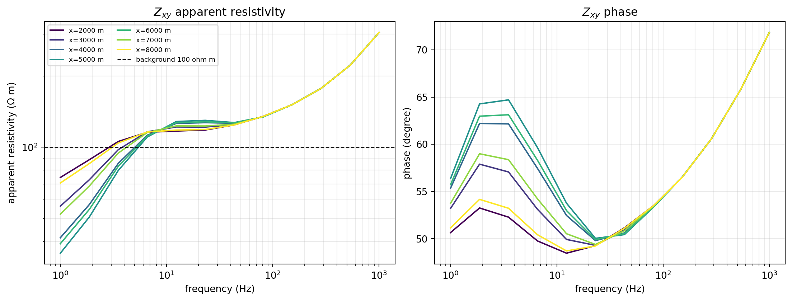
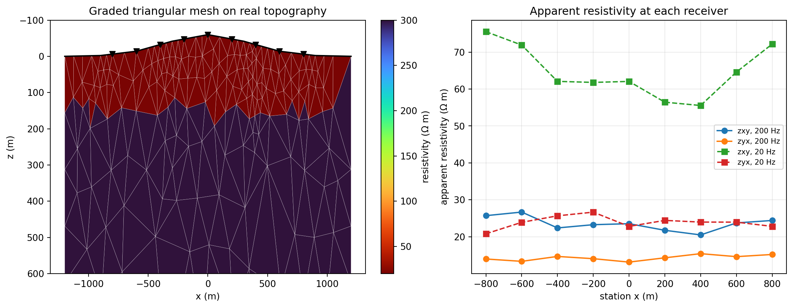

.. _forward_maxwell_adapters:

Maxwell Adapters
================

A :class:`~pycsamt.forward.maxwell.MaxwellProblem` or
:class:`~pycsamt.forward.maxwell.contracts_tri.TriProblem` is inert data: a
mesh, a conductivity array, frequencies, receivers, and requested components.
Something still has to turn that data into a
:term:`forward response`, and that something is a
:term:`Maxwell adapter`. Every concrete adapter in
:mod:`pycsamt.forward.maxwell` -- whether it wraps an in-repository
finite-difference solver or shells out to a compiled external binary --
inherits the same two-sided contract from
:class:`~pycsamt.forward.maxwell.adapters.BaseMaxwellAdapter`: a
:term:`preflight assessment` of the problem against its declared
:term:`backend capability`, and a :term:`postflight validation` of whatever
the backend returns. :doc:`/theory/maxwell_forward` derives why that
boundary has to be this strict; this page stays at the level of "which
adapter do I reach for, and what does calling it actually look like."

Choosing An Adapter
-------------------

Five concrete adapters are shipped today. They fall into two families: three
run entirely in-process against in-repository solvers, and two shell out to
a compiled external executable that pyCSAMT does not bundle.

.. list-table::
   :header-rows: 1
   :widths: 14 12 16 12 16 30

   * - Adapter
     - Dimension
     - Components
     - Topography
     - Executable
     - Best for
   * - ``MT2DAdapter``
     - 2-D
     - ``zxy``, ``zyx``
     - No
     - none (in-repo)
     - Quick, validated 2-D TE/TM prototyping and teaching.
   * - ``MT3DAdapter``
     - 3-D
     - ``zxx``, ``zxy``, ``zyx``, ``zyy``
     - No
     - none (in-repo)
     - Small research-grid 3-D checks; not a production solver.
   * - ``TriFEM2DAdapter``
     - 2-D
     - ``zxy``, ``zyx``
     - Yes
     - none (in-repo)
     - 2-D forward modelling over real topography without an external build.
   * - ``ModEm3DAdapter``
     - 3-D
     - ``zxx``, ``zxy``, ``zyx``, ``zyy``
     - No
     - ``Mod3DMT`` (:term:`ModEM`)
     - Production-grade 3-D forward checks and training-data generation.
   * - ``Mare2DEMAdapter``
     - 2-D
     - ``zxy``, ``zyx``
     - Yes
     - ``MARE2DEM``
     - Production 2.5-D/:term:`CSEM` forward modelling with topography.

Every row's :term:`backend capability` is a checkable claim, not a label
taken on trust -- :doc:`maxwell_backends` covers exactly what
:meth:`~pycsamt.forward.maxwell.BackendCapabilities.assess` checks and how a
backend gets found by that declaration instead of by import; this page
stays at the level of one call to ``adapter.solve(problem)``:

.. code-block:: pycon

   >>> from pycsamt.forward.maxwell.mt2d import MT2DAdapter
   >>> capability = MT2DAdapter().capabilities
   >>> capability.dimensions, capability.components
   ((2,), ('zxy', 'zyx'))
   >>> capability.verified_benchmarks
   ('half-space', 'layered-earth')

``verified_benchmarks`` is where the "Best for" column above actually comes
from: an adapter that has not been checked against
:mod:`~pycsamt.forward.maxwell.benchmarks` (:doc:`maxwell_benchmarks`) should
be trusted no further than an unverified guess, regardless of how confident
its dimensionality and component support look. The three in-repository
adapters need nothing beyond pycsamt and NumPy/SciPy; the two external
adapters additionally need a compiled executable, obtained the way
:doc:`/user_guide/models/compilation` describes. That split matters for
scope, too: these adapters exist to produce a single validated
:term:`forward response` or a batch of them (:doc:`maxwell_caching_and_batch`),
not to run a full inversion project. Building a native ModEM or MARE2DEM
project -- meshes, covariance, iterative inversion, native file review --
is the job of :doc:`/user_guide/models/modem` and
:doc:`/user_guide/models/mare2dem`; reach for those pages once a forward
check here has already told you the solver and geometry are worth
committing to.

In-Repository 2-D Solve
-----------------------

``MT2DAdapter`` wraps the same finite-difference solver already introduced
in :doc:`solvers_and_grids` (:class:`~pycsamt.forward.em2d.MT2DForward`), but
through the canonical contract instead of a bespoke
:class:`~pycsamt.forward.grid2d.Grid2D`. Every receiver must sit exactly at
the surface and the earth model has no inactive cells -- both checked in
``assess`` before a solve is attempted, not discovered afterward:

.. code-block:: pycon

   >>> import numpy as np
   >>> from pycsamt.forward.maxwell import MaxwellMesh, MaxwellProblem, ReceiverSet
   >>> from pycsamt.forward.maxwell.mt2d import MT2DAdapter

   >>> mesh = MaxwellMesh(np.linspace(0, 10_000, 41), np.linspace(0, 5_000, 31))
   >>> problem = MaxwellProblem(
   ...     mesh, np.full(mesh.shape, 1.0 / 100.0), [10.0, 1.0],
   ...     ReceiverSet([[5_000.0, 0.0]], ["S00"]), ("zxy", "zyx"),
   ... )
   >>> adapter = MT2DAdapter(verbose=False)
   >>> result = adapter.solve(problem)
   >>> result.shape
   (1, 2, 2)
   >>> result.backend_name, result.backend_version
   ('mt2d', '1.0')
   >>> bool(np.all(result.diagnostics.converged))
   True
   >>> result.problem_hash == problem.problem_hash
   True

The last line is :term:`postflight validation` made visible: ``result``
carries the exact :term:`problem hash` of the problem it was solved from
(:eq:`eq-maxwell-problem-identity` in :doc:`/theory/maxwell_forward`
defines what goes into that hash), so a stored or later-compared result can
always be tied back to the input that produced it. Moving a receiver off
the surface is rejected before ``MT2DForward`` ever runs:

.. code-block:: pycon

   >>> buried = ReceiverSet([[5_000.0, 50.0]], ["S00"])
   >>> bad_problem = MaxwellProblem(
   ...     mesh, np.full(mesh.shape, 1.0 / 100.0), [10.0, 1.0],
   ...     buried, ("zxy", "zyx"),
   ... )
   >>> report = adapter.assess(bad_problem)
   >>> report.compatible
   False
   >>> report.errors
   ('mt2d only evaluates receivers at the surface (z=0)',)
   >>> adapter.solve(bad_problem)
   Traceback (most recent call last):
   ...
   pycsamt.forward.maxwell.adapters.IncompatibleProblemError: backend 'mt2d' is incompatible: mt2d only evaluates receivers at the surface (z=0)

A single receiver at 10 and 1 Hz is enough to exercise the contract, but not
enough to see what a 2-D adapter is actually for: reading a lateral
:term:`forward response` across a profile. The executed study below sweeps
twelve frequencies at seven stations straddling a shallow 5 ohm m conductor
buried in a 100 ohm m background, using the same ``MT2DAdapter`` shown
above:

.. code-dropdown:: ../../../scripts/generate_forward_maxwell_adapters_figures.py
   :language: python
   :pyobject: make_mt2d_response
   :linenos:
   :title: View MT2DAdapter response-sweep source code

   Apparent resistivity and phase, :eq:`eq-maxwell-rhoa-phase`, from
   ``MT2DAdapter`` for seven stations spanning a shallow 5 ohm m conductor.

Every station's apparent resistivity converges toward the 100 ohm m
background at both ends of the swept band -- the highest frequencies barely
sense the conductor because their :term:`skin depth` stays shallow, and the
lowest frequencies average it into the surrounding half-space -- while the
mid-band curves dip and the phase rises above the 45-degree half-space value
exactly where the stations sit closest to the conductor. That mid-band lift
is the diagnostic signature a real 2-D survey is designed to resolve; seeing
it appear from a validated adapter rather than a bespoke script is the point
of routing this problem through ``MT2DAdapter`` instead of calling
``MT2DForward`` directly.

Research-Only 3-D Solve
-----------------------

``MT3DAdapter`` answers the natural next question -- "what about a full 3-D
earth" -- but its capability declaration is explicit about the cost: a
default 6,000-cell ceiling, because the direct sparse solve behind it does
not scale to production mesh sizes. Raising ``max_cells`` changes
computational risk, not numerical maturity, and it has no registration
function in the backend registry (unlike the other four adapters), a
deliberate reminder that it is meant to be reached for directly rather than
discovered by capability search:

.. code-block:: pycon

   >>> from pycsamt.forward.maxwell.mt3d import MT3DAdapter

   >>> mesh3d = MaxwellMesh(
   ...     np.linspace(0, 4_000, 9), np.linspace(0, 3_000, 11), np.linspace(0, 4_000, 9)
   ... )
   >>> problem3d = MaxwellProblem(
   ...     mesh3d, np.full(mesh3d.shape, 1.0 / 100.0), [1.0],
   ...     ReceiverSet([[2_000.0, 2_000.0, 0.0]], ["S00"]), ("zxx", "zxy", "zyx", "zyy"),
   ... )
   >>> mt3d_adapter = MT3DAdapter()
   >>> mt3d_adapter.capabilities.maximum_cells
   6000
   >>> result3d = mt3d_adapter.solve(problem3d)
   >>> result3d.shape
   (1, 1, 4)
   >>> np.round(result3d.impedance_v_a[0, 0, :], 4)
   array([ 0.    +0.j    ,  0.0199+0.0211j, -0.0199-0.0211j,  0.    -0.j    ])

A single station at a single frequency is already enough to show what a
correct 3-D half-space response looks like through this contract: the
diagonal components ``zxx``/``zyy`` collapse to zero and the off-diagonal
components are near-mirror images of each other, exactly as
:eq:`eq-maxwell-impedance-tensor` predicts for a laterally uniform earth.
There is little value in plotting a single complex number per component, so
this section stops at the numbers -- a figure earns its place only once a
receiver profile or a heterogeneous model gives it something to show, which
is precisely what the next two adapters provide without MT3DAdapter's cell
ceiling.

Topography-Aware Triangular FEM
-------------------------------

``TriFEM2DAdapter`` is the only in-repository adapter that declares
``supports_topography=True``. It solves on a
:class:`~pycsamt.forward.maxwell.contracts_tri.TriMesh` rather than a
structured :class:`~pycsamt.forward.maxwell.MaxwellMesh`, and every receiver
must coincide with an actual mesh node on the mesh's own local surface --
not ``z=0``, but wherever that station's terrain elevation puts it.
:func:`~pycsamt.forward.maxwell.tri_mesh_gen.build_graded_tri_mesh` builds
such a mesh directly from a topography polyline, grading triangle size away
from the receivers so the fine resolution needed near stations does not have
to be paid for everywhere:

.. code-dropdown:: ../../../scripts/generate_forward_maxwell_adapters_figures.py
   :language: python
   :pyobject: make_trifem2d_mesh_response
   :linenos:
   :title: View TriFEM2DAdapter mesh-and-response source code

   A 384-triangle graded mesh following a synthetic ridge, and the
   apparent-resistivity response ``TriFEM2DAdapter`` returns at each
   receiver for two frequencies.

The mesh panel is the more important half of this figure. Triangle density
follows the receivers (dense under the ridge crest, coarse toward the
padded sides and at depth) and the conductive near-surface layer -- 20 ohm m
against a 300 ohm m background -- is carried on the triangulation exactly as
it sits under the terrain, not projected onto a flat datum. The response
panel then shows what topography does to a 2-D adapter that a flat-surface
adapter cannot represent at all: the 20 Hz curves swing by roughly 20 ohm m
across nine stations sitting on the same two-layer earth, purely from
elevation and local slope, while the higher-frequency 200 Hz curves --
shallower skin depth, less sensitive to the broad ridge shape -- stay
comparatively flat. Running the same receivers through ``MT2DAdapter``
is not an option here; that adapter's own preflight rejects anything off
``z=0``, which is exactly the check exercised earlier in this page.

External Solver Adapters
------------------------

``ModEm3DAdapter`` and ``Mare2DEMAdapter`` both subclass
:class:`~pycsamt.forward.maxwell.external.BaseExternalMaxwellAdapter`
instead of :class:`~pycsamt.forward.maxwell.adapters.BaseMaxwellAdapter`
directly: on top of the usual preflight/postflight pair, they resolve an
executable, write native input files into an isolated run directory, launch
the process under a timeout policy, and parse its native output back into
the same :class:`~pycsamt.forward.maxwell.ForwardResult` contract every
other adapter returns. :doc:`/theory/maxwell_forward` covers that lifecycle
in full; the practical consequence here is that availability of an
executable, compatibility of a problem, and validity of a result are three
independent things, and this contract checks all three separately rather
than assuming one implies the others.

Resolving a missing executable fails loudly rather than silently returning
an empty result:

.. code-block:: pycon

   >>> from pycsamt.forward.maxwell.external import ExecutableNotFoundError, resolve_executable
   >>> resolve_executable("does-not-exist-xyz")
   Traceback (most recent call last):
   ...
   pycsamt.forward.maxwell.external.ExecutableNotFoundError: executable 'does-not-exist-xyz' was not found on PATH or in ().

Both adapters can always be constructed and their capabilities inspected
without any executable at all -- an :term:`external adapter` declares its
scope the same way an in-repository one does, before it ever needs to find
a binary:

.. code-block:: pycon

   >>> from pycsamt.forward.maxwell import ExternalRunPolicy
   >>> from pycsamt.forward.maxwell.modem3d import ModEm3DAdapter
   >>> from pycsamt.forward.maxwell.mare2dem import Mare2DEMAdapter
   >>> ModEm3DAdapter(run_policy=ExternalRunPolicy("does-not-exist-xyz")).capabilities.name
   'modem3d'
   >>> mare_capability = Mare2DEMAdapter(
   ...     run_policy=ExternalRunPolicy("does-not-exist-xyz")
   ... ).capabilities
   >>> mare_capability.supports_topography
   True
   >>> mare_capability.verified_benchmarks
   ()

That last, empty tuple is worth pausing on: this pycsamt release ships
``Mare2DEMAdapter`` without any :term:`verified benchmark` recorded in its
capability declaration, even though a real compiled-MARE2DEM benchmark
exists in pycsamt's own test suite and the real-binary validation behind
:doc:`/user_guide/models/mare2dem` used the same adapter architecture. Until
that declaration is updated, treat ``Mare2DEMAdapter`` as architecturally
complete but not yet self-certifying through this contract -- exactly the
gap ``verified_benchmarks`` exists to expose rather than paper over. Whether
an executable can even be found is a separate, environment-specific
question, checked by registering both backends and asking the registry
rather than either adapter directly:

.. code-block:: pycon

   >>> from pycsamt.forward.maxwell import register_mt2d_backend, list_backends
   >>> from pycsamt.forward.maxwell.tri_fem2d import register_trifem2d_backend
   >>> from pycsamt.forward.maxwell.modem3d import register_modem3d_backend
   >>> from pycsamt.forward.maxwell.mare2dem import register_mare2dem_backend
   >>> register_mt2d_backend(replace=True)
   >>> register_trifem2d_backend(replace=True)
   >>> register_modem3d_backend(replace=True)
   >>> register_mare2dem_backend(replace=True)
   >>> {name: info["available"] for name, info in list_backends().items()}
   {'mt2d': True, 'trifem2d': True, 'modem3d': True, 'mare2dem': False}
   >>> list_backends()["mare2dem"]["reason"]
   "executable 'mpirun' was not found on PATH or in ()."

The two in-repository adapters are trivially "available" because they need
nothing beyond pycsamt itself. ``modem3d`` reads ``True`` on the machine
that built this page because a compiled ``Mod3DMT`` happens to sit in
pycsamt's vendored ModEM source tree; ``mare2dem`` reads ``False`` because
its default :class:`~pycsamt.forward.maxwell.mare2dem.Mare2DEMConfig` looks
for an ``mpirun`` launcher that is not installed here -- not because
MARE2DEM itself is unreachable, which is exactly the kind of distinction the
``reason`` string exists to preserve instead of collapsing into a bare
``False``. :doc:`/user_guide/models/compilation` covers building both
solvers from source.

A compiled ``Mod3DMT`` being available means ``ModEm3DAdapter`` can run for
real here, against the same kind of calibrated, unpadded mesh pycsamt's own
real-binary tests use -- ModEM synthesizes its own air layers, so this mesh
only needs to describe the earth:

.. code-block:: pycon

   >>> n, h = 8, 300.0
   >>> modem_mesh = MaxwellMesh(np.arange(n + 1) * h, np.arange(11) * h, np.arange(n + 1) * h)
   >>> modem_receivers = ReceiverSet([[n * h / 2, n * h / 2, 0.0]], ["S00"])
   >>> modem_problem = MaxwellProblem(
   ...     modem_mesh, np.full(modem_mesh.shape, 1.0 / 100.0), [1.0, 0.5],
   ...     modem_receivers, ("zxx", "zxy", "zyx", "zyy"),
   ... )
   >>> modem_adapter = ModEm3DAdapter()
   >>> modem_result = modem_adapter.solve(modem_problem)
   >>> modem_result.shape
   (1, 2, 4)
   >>> modem_result.backend_version
   'modem-v6.2.6-adapter-1.0'
   >>> mu0 = 4e-7 * np.pi
   >>> rhoa_zxy = np.abs(modem_result.impedance_v_a[0, :, 1]) ** 2 / (mu0 * 2 * np.pi * modem_result.frequencies_hz)
   >>> np.round(rhoa_zxy, 2)
   array([103.08, 102.16])

103 and 102 ohm m recovered from a real compiled ModEM run of a true 100 ohm
m half-space, on a mesh of only 640 earth cells, is a genuinely useful
sanity check before trusting a much larger production run. The same
adapter also passes pycsamt's analytic layered-earth benchmark within its
default thresholds -- a 100/30/500 ohm m three-layer earth solved on this
machine's ``Mod3DMT`` comes back with a normalized RMS error of 0.0144, a
worst-case amplitude error of 1.3%, and a worst-case phase error of 0.41
degree, all measured against
:func:`~pycsamt.forward.maxwell.layered_earth_impedance`'s closed-form
recurrence -- the frequency-dependent counterpart to the plain half-space
case in :eq:`eq-maxwell-half-space-impedance` -- rather than against another
numerical solver. :doc:`maxwell_benchmarks` covers how that comparison, and
the acceptance thresholds behind ``outcome.passed``, are built.

Common Mistakes
---------------

``Passing mark_air_inactive=True into an incompatible adapter``
   :meth:`~pycsamt.forward.maxwell.mesh.SolverMeshModel.to_problem` can mark
   air cells inactive, but none of the five adapters on this page declare
   ``supports_inactive_cells=True``. Preflight will reject the problem; the
   fix is to build the problem with inactive marking off, not to look for a
   workaround inside the adapter.

``Assuming dimensionality support means validated``
   ``BackendCapabilities.dimensions`` says what shapes of problem an adapter
   will *attempt*. Only ``verified_benchmarks`` says what it has been
   *checked against* -- and, as ``Mare2DEMAdapter`` shows above, those two
   lists can legitimately disagree within a single release.

``Treating an unavailable registry entry as an incompatible problem``
   ``list_backends()[...]["available"]`` reports whether an executable was
   found, not whether a given problem would pass that backend's ``assess``.
   A missing binary and an unsupported problem raise through completely
   different paths -- ``ExecutableNotFoundError`` versus
   ``IncompatibleProblemError`` -- and conflating them in a script's error
   handling hides which one actually happened.

``Forgetting replace=True when swapping a registration``
   Registration is process-wide and silent by default:
   ``register_mt2d_backend()`` a second time without ``replace=True`` raises
   rather than quietly overwriting the first registration, which is
   deliberate in a long-running experiment where a silent solver swap could
   change numerical behaviour mid-run.

``Trusting a station-level result MT2DAdapter reports as valid``
   The finite-difference solver behind ``MT2DAdapter`` falls back to
   ``0 + 0j`` at a station with a near-zero surface magnetic field instead of
   raising, and a finite ``0 + 0j`` passes the default validity check. A
   response that is suspiciously exactly zero at one station is worth
   inspecting directly rather than trusting ``result.valid`` alone.

Next Pages
----------

:doc:`maxwell_benchmarks` shows how ``verified_benchmarks`` claims like the
ones inspected on this page are actually produced and scored, including the
layered-earth check just run against ``ModEm3DAdapter``.
:doc:`maxwell_caching_and_batch` then covers running many problems through
one of these adapters reliably, with retries and a resumable failure record.
