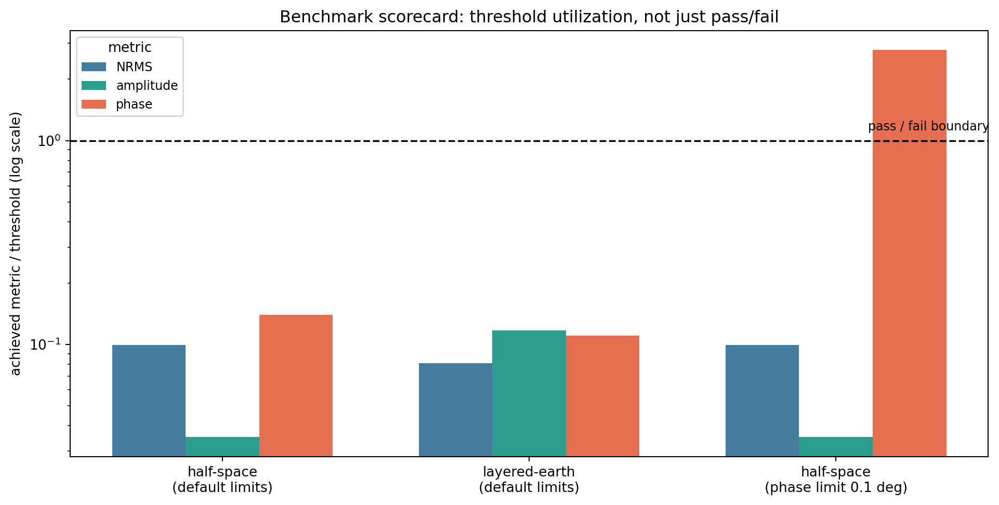

.. _forward_maxwell_benchmarks:

Maxwell Analytic Benchmarks
===========================

:doc:`maxwell_adapters` treated ``verified_benchmarks`` as a fact to read off
a capability declaration -- ``('half-space', 'layered-earth')`` for
``MT2DAdapter``, an honest empty tuple for ``Mare2DEMAdapter``.
:doc:`maxwell_backends` showed the generic assessment that reads that tuple
and turns its absence into a warning. Neither page showed where the tuple
actually comes from. :mod:`~pycsamt.forward.maxwell.benchmarks` is that
source: a small set of closed-form electromagnetic solutions, a scoring
procedure with independently-checked error gates, and an auditable record
tying a specific backend version to the exact case it passed or failed. The
closed-form half-space and layered-earth impedance formulas themselves
(:eq:`eq-maxwell-half-space-impedance` in :doc:`/theory/maxwell_forward`)
and a first worked pass/fail example already live in
:doc:`/user_guide/ai_inversion/forward_physics`; this page does not repeat
either and instead covers the parts of the module neither of those pages
reaches -- customizing acceptance limits, reusing an already-solved result,
case-level provenance, and the guardrails that keep a benchmark honest
before it ever runs a solver.

Acceptance Thresholds
---------------------

A benchmark does not pass or fail against one number. Every case is scored
against five independent gates held in
:class:`~pycsamt.forward.maxwell.benchmarks.BenchmarkThresholds`:

.. code-block:: pycon

   >>> from pycsamt.forward.maxwell.benchmarks import BenchmarkThresholds
   >>> BenchmarkThresholds().to_dict()
   {'schema_version': 1, 'maximum_normalized_rms': 0.05, 'maximum_amplitude_relative_error': 0.05, 'maximum_phase_error_deg': 2.0, 'minimum_valid_fraction': 1.0, 'require_convergence': True}

Normalized RMS is the single complex error summary defined in
:eq:`eq-maxwell-benchmark-nrms`; the amplitude and phase limits then check
the *shape* of that error separately, so a backend cannot compensate a large
phase drift with a small amplitude error and still read as accurate. The
last two gates are not numerical error at all: ``minimum_valid_fraction``
rejects a result that quietly marks part of its output invalid rather than
computing it, and ``require_convergence`` reads
:attr:`~pycsamt.forward.maxwell.contracts.SolverDiagnostics.success`
directly, so a benchmark cannot pass on values that happen to be close to
the reference despite the underlying linear solve never converging.
Thresholds round-trip through the same ``to_dict``/``from_dict`` schema
every other contract in this package uses, which is what lets a stored
threshold policy be archived alongside a benchmark result rather than
re-typed from memory:

.. code-block:: pycon

   >>> tight = BenchmarkThresholds(maximum_phase_error_deg=0.5)
   >>> BenchmarkThresholds.from_dict(tight.to_dict()) == tight
   True

Building And Running A Case
---------------------------

:func:`~pycsamt.forward.maxwell.benchmarks.half_space_benchmark` and
:func:`~pycsamt.forward.maxwell.benchmarks.layered_earth_benchmark` both
build a :class:`~pycsamt.forward.maxwell.benchmarks.MaxwellBenchmark` from a
mesh, receivers, and frequencies you supply -- the analytic reference and
the acceptance thresholds are computed for you, but the geometry is still a
real forward-modelling choice, exactly as in :doc:`maxwell_meshing`. A mesh
padded well past a set of stations should comfortably clear the default
thresholds:

.. code-block:: pycon

   >>> import numpy as np
   >>> from pycsamt.forward.maxwell import MaxwellMesh, ReceiverSet
   >>> from pycsamt.forward.maxwell.mt2d import MT2DAdapter
   >>> from pycsamt.forward.maxwell.benchmarks import (
   ...     half_space_benchmark, layered_earth_benchmark, run_benchmarks,
   ... )

   >>> dz = 20.0 * 1.25 ** np.arange(30)
   >>> z_edges = np.concatenate([[0.0], np.cumsum(dz)])
   >>> mesh = MaxwellMesh(np.linspace(0, 180_000, 19), z_edges)
   >>> stations = ReceiverSet([[60_000.0, 0.0], [120_000.0, 0.0]], ["S00", "S01"])
   >>> adapter = MT2DAdapter(verbose=False)

   >>> half = half_space_benchmark(mesh, stations, [10.0, 1.0], resistivity_ohm_m=150.0)
   >>> interface1, interface2 = z_edges[10], z_edges[18]
   >>> layered = layered_earth_benchmark(
   ...     mesh, stations, np.geomspace(10, 0.5, 5),
   ...     [150.0, 20.0, 800.0], [interface1, interface2 - interface1],
   ... )
   >>> report = run_benchmarks(adapter, [half, layered])
   >>> report.passed, round(report.pass_fraction, 3)
   (True, 1.0)
   >>> for outcome in report.outcomes:
   ...     print(outcome.benchmark_name, outcome.passed, round(outcome.metrics.normalized_rms, 5))
   half-space True 0.00497
   layered-earth True 0.00404

``run_benchmarks`` refuses a mixed-identity report before it evaluates
anything: every case in one call must share a single backend name and
version, and case names must be unique, because a report mixing two backend
versions would misrepresent which version actually earned the pass.
The reference values themselves are worth trusting on their own terms, not
only the solver's agreement with them:
:func:`~pycsamt.forward.maxwell.benchmarks.layered_earth_impedance` reduces
exactly to :func:`~pycsamt.forward.maxwell.benchmarks.half_space_impedance`
for a single layer, a self-consistency check with no adapter involved at
all:

.. code-block:: pycon

   >>> from pycsamt.forward.maxwell.benchmarks import (
   ...     half_space_impedance, layered_earth_impedance,
   ... )
   >>> np.allclose(
   ...     layered_earth_impedance([150.0], [], [10.0, 1.0]),
   ...     half_space_impedance(150.0, [10.0, 1.0]),
   ... )
   True

Reusing A Solved Result
-----------------------

``MaxwellBenchmark.run(backend)`` is really two steps glued together: solve,
then :meth:`~pycsamt.forward.maxwell.benchmarks.MaxwellBenchmark.evaluate`
the result. Calling ``evaluate`` directly on an already-solved
:class:`~pycsamt.forward.maxwell.ForwardResult` skips the solve entirely,
which matters whenever a result is already on hand -- loaded from
:doc:`maxwell_caching_and_batch`'s cache, or produced once and checked
against more than one threshold policy:

.. code-block:: pycon

   >>> result = adapter.solve(half.problem)
   >>> half.evaluate(result).passed
   True

   >>> from pycsamt.forward.maxwell.benchmarks import BenchmarkThresholds
   >>> strict = half_space_benchmark(
   ...     mesh, stations, [10.0, 1.0], resistivity_ohm_m=150.0,
   ...     thresholds=BenchmarkThresholds(maximum_phase_error_deg=0.1),
   ... )
   >>> strict_outcome = strict.evaluate(result)
   >>> strict_outcome.passed
   False
   >>> strict_outcome.failures
   ('maximum phase error 0.27857 deg exceeds 0.1 deg',)

Nothing about ``result`` changed between those two calls -- the same solved
impedance either passes or fails depending entirely on which threshold
policy it is read against. That is the point of keeping
``BenchmarkThresholds`` a separate, inspectable object rather than a fixed
constant buried inside the comparison: tightening one number is a policy
decision, not a re-run of the physics.

.. code-dropdown:: ../../../scripts/generate_forward_maxwell_benchmarks_figures.py
   :language: python
   :pyobject: make_benchmark_scorecard
   :linenos:
   :title: View benchmark-scorecard source code

   Each metric plotted as achieved-value-over-threshold on a log scale;
   1.0 is the pass/fail boundary every bar is measured against.

The first two groups sit comfortably under the line on every metric at
once -- exactly what ``report.passed`` already said. The third group is the
same half-space solve re-scored under the tightened 0.1-degree phase limit
from above: its NRMS and amplitude bars are untouched, because those
thresholds never changed, while its phase bar alone climbs to roughly 2.8
times the new limit. A scorecard like this is more informative than a
single boolean for exactly this reason -- it shows how much margin a
passing case actually has, and which one of several independent gates a
failing case actually violated.

Case Identity And Provenance
----------------------------

A :term:`problem hash` identifies the physical input a backend solved. A
:term:`benchmark hash` identifies more than that: the same problem paired
with different acceptance thresholds is a different benchmark case, because
what counts as "passing" is itself part of what was tested:

.. code-block:: pycon

   >>> half.benchmark_hash == strict.benchmark_hash
   False
   >>> half.problem.problem_hash == strict.problem.problem_hash
   True

:meth:`~pycsamt.forward.maxwell.benchmarks.MaxwellBenchmark.provenance`
returns the JSON-compatible record worth archiving alongside a reported
``verified_benchmarks`` claim -- case name, description, problem hash,
threshold policy, tags, and metadata, all in one place:

.. code-block:: pycon

   >>> sorted(half.provenance().keys())
   ['description', 'metadata', 'name', 'problem_hash', 'schema_version', 'tags', 'thresholds']
   >>> half.provenance()["tags"]
   ['analytic', 'half-space', '2d']

Every field there is enough to rebuild the comparison later without
re-deriving it from a code diff: which case, on which exact problem, judged
against which exact threshold policy.

Validation Guardrails
---------------------

Both benchmark builders refuse a request before building any problem at
all when the request cannot produce a meaningful comparison.
``zxx``/``zyy`` are excluded from ``components`` because a laterally
uniform 1-D earth has an analytically exact-zero diagonal response, and a
relative error against a zero reference is undefined, not merely small:

.. code-block:: pycon

   >>> half_space_benchmark(mesh, stations, [1.0], components=("zxx", "zxy"))
   Traceback (most recent call last):
   ...
   ValueError: analytic relative metrics require zxy and/or zyx.

``layered_earth_benchmark`` additionally requires every layer interface to
land exactly on an existing mesh z edge, because the analytic reference and
the discretized conductivity model must describe the same interfaces to be
comparable at all:

.. code-block:: pycon

   >>> layered_earth_benchmark(mesh, stations, [1.0], [100.0, 500.0], [12_345.678])
   Traceback (most recent call last):
   ...
   ValueError: layer interface 12345.7 m is not a mesh z edge.

Both errors surface immediately, before any solver runs -- the same
preflight-before-execution discipline :doc:`maxwell_adapters` and
:doc:`maxwell_backends` apply to problems applies here to benchmark cases
themselves.

Common Mistakes
---------------

``Reading report.passed without checking pass_fraction``
   ``BenchmarkReport.passed`` is ``all(...)`` across every case: one failing
   benchmark in a batch of ten makes the whole report ``False``.
   ``pass_fraction`` is what to log when partial regression matters more
   than a single aggregate boolean.

``Treating a benchmark_hash mismatch as a physics problem``
   Two ``MaxwellBenchmark`` objects can differ in ``benchmark_hash`` while
   sharing the identical ``problem_hash`` -- that only means their
   threshold policy, tags, or metadata differ, not that the underlying
   earth model or geometry changed.

``Re-solving just to try a different threshold``
   ``evaluate()`` takes an already-solved ``ForwardResult`` directly; there
   is no need to call ``adapter.solve`` again to check the same result
   against a stricter or looser ``BenchmarkThresholds``.

``Assuming a passing benchmark generalizes past its own band``
   A benchmark result is evidence for the exact mesh, frequency range, and
   receiver positions it used, not a permanent property of the adapter --
   the same caution :doc:`/user_guide/ai_inversion/forward_physics` shows
   by extending a validated mesh past its tested frequency band and
   watching agreement degrade.

Next Pages
----------

:doc:`maxwell_caching_and_batch` covers solving and scoring many problems
like these reliably at scale, including reusing a cached
:class:`~pycsamt.forward.maxwell.ForwardResult` the way ``evaluate()`` did
above without re-solving.
