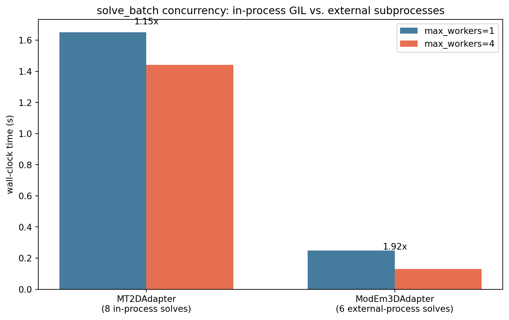

.. _forward_maxwell_caching_and_batch:

Maxwell Caching And Batch Solving
=================================

Every example so far in this section of the guide has solved one problem at
a time. :doc:`maxwell_benchmarks` closed by reusing an already-solved
:class:`~pycsamt.forward.maxwell.ForwardResult` to check it against two
different threshold policies without re-solving; this page is about the two
modules that make that kind of reuse -- and solving hundreds or thousands of
problems reliably rather than one -- practical.
:class:`~pycsamt.forward.maxwell.MaxwellResultCache` never solves the same
problem twice, and :func:`~pycsamt.forward.maxwell.batch.solve_batch` turns
one adapter and many problems into a run that survives individual failures
and can resume after a crash. Neither module changes what a
:term:`Maxwell adapter` computes; both change what happens around it.

Content-Addressed Caching
-------------------------

:class:`~pycsamt.forward.maxwell.MaxwellResultCache` is a
:term:`content-addressed cache`: every entry is keyed by
:attr:`~pycsamt.forward.maxwell.MaxwellProblem.problem_hash`, written by
atomic replacement, and checked against a SHA-256 sidecar on every read.
:meth:`~pycsamt.forward.maxwell.cache.MaxwellResultCache.get_or_solve` is
the one method most callers need: check the cache, and only call the
backend on a miss.

.. code-block:: pycon

   >>> import numpy as np
   >>> from pathlib import Path
   >>> from tempfile import TemporaryDirectory
   >>> from pycsamt.forward.maxwell import (
   ...     MaxwellMesh, MaxwellProblem, ReceiverSet, MaxwellResultCache,
   ... )
   >>> from pycsamt.forward.maxwell.mt2d import MT2DAdapter

   >>> mesh = MaxwellMesh(np.linspace(0, 10_000, 21), np.linspace(0, 5_000, 16))
   >>> problem = MaxwellProblem(
   ...     mesh, np.full(mesh.shape, 0.01), [10.0, 1.0],
   ...     ReceiverSet([[5_000.0, 0.0]], ["S00"]), ("zxy", "zyx"),
   ... )
   >>> adapter = MT2DAdapter(verbose=False)
   >>> directory = TemporaryDirectory()
   >>> cache = MaxwellResultCache(directory.name)
   >>> cache.contains(problem)
   False
   >>> result = cache.get_or_solve(problem, adapter)
   >>> cache.contains(problem)
   True
   >>> stats = cache.statistics()
   >>> stats.entry_count, stats.orphan_count, stats.corrupt_count
   (1, 0, 0)
   >>> stats.total_bytes > 0
   True

Calling ``get_or_solve`` again for the identical problem returns the cached
entry without touching ``adapter`` at all -- the whole point when a Maxwell
solve, not the cache lookup, dominates the cost of generating a dataset or
re-running an experiment. :class:`~pycsamt.forward.maxwell.cache.CacheEntry`
exposes the same information without deserializing the archive:

.. code-block:: pycon

   >>> entry = cache.entry(problem.problem_hash)
   >>> entry.size_bytes > 0, entry.checksum_path.name.endswith(".sha256")
   (True, True)
   >>> len(cache.entries())
   1

Corruption And Quarantine
-------------------------

A result archive can be damaged by a crashed write, a full disk, or manual
tampering, and the cache never trusts one on faith. Deliberately corrupting
the stored archive shows what a validated read actually does:

.. code-block:: pycon

   >>> archive, checksum = cache._paths(problem.problem_hash)
   >>> with open(archive, "r+b") as stream:
   ...     _ = stream.seek(0)
   ...     _ = stream.write(b"\x00\x00\x00\x00")
   >>> cache.get(problem) is None
   True
   >>> cache.statistics().to_dict()
   {'entry_count': 0, 'total_bytes': 0, 'orphan_count': 0, 'corrupt_count': 2}

The default ``quarantine_corrupt=True`` moves both the archive and its
checksum sidecar under ``root/corrupt`` and reports the read as a miss --
``get`` returning ``None`` looks identical to a problem that was simply
never solved, which is deliberate: a caller using ``get_or_solve`` recovers
automatically by recomputing. A cache built with ``quarantine_corrupt=False``
instead raises :class:`~pycsamt.forward.maxwell.cache.CacheCorruptionError`
and leaves the damaged files in place for inspection, which is the setting
worth choosing while diagnosing *why* entries are turning up corrupt rather
than routing around it in production:

.. code-block:: pycon

   >>> from pycsamt.forward.maxwell.cache import CacheCorruptionError
   >>> with TemporaryDirectory() as strict_directory:
   ...     strict_cache = MaxwellResultCache(strict_directory, quarantine_corrupt=False)
   ...     _ = strict_cache.get_or_solve(problem, adapter)
   ...     bad_archive, _ = strict_cache._paths(problem.problem_hash)
   ...     with open(bad_archive, "r+b") as stream:
   ...         _ = stream.seek(0)
   ...         _ = stream.write(b"\x00\x00\x00\x00")
   ...     try:
   ...         strict_cache.get(problem)
   ...     except CacheCorruptionError as exc:
   ...         print(exc)
   result archive checksum mismatch.

Pruning A Cache
---------------

A long-running cache directory grows without bound unless something removes
old entries. :meth:`~pycsamt.forward.maxwell.cache.MaxwellResultCache.prune`
removes the oldest entries, by modification time, until the remaining
archive-plus-checksum storage fits a byte budget:

.. code-block:: pycon

   >>> directory2 = TemporaryDirectory()
   >>> budget_cache = MaxwellResultCache(directory2.name)
   >>> station_problems = [
   ...     MaxwellProblem(
   ...         mesh, np.full(mesh.shape, 0.01), [10.0, 1.0],
   ...         ReceiverSet([[x, 0.0]], ["S00"]), ("zxy", "zyx"),
   ...     )
   ...     for x in (2_000.0, 5_000.0, 8_000.0)
   ... ]
   >>> for station_problem in station_problems:
   ...     _ = budget_cache.get_or_solve(station_problem, adapter)
   >>> budget_cache.statistics().entry_count
   3
   >>> removed = budget_cache.prune(maximum_bytes=0)
   >>> len(removed)
   3
   >>> removed[0].key == station_problems[0].problem_hash
   True
   >>> budget_cache.statistics().entry_count
   0

A budget of zero removes everything, but always in the same order: oldest
modification time first, so ``removed[0]`` is the entry solved first above,
not necessarily the one with the smallest archive. A larger, nonzero budget
stops removing as soon as the remaining entries already fit -- it is a
storage cap, not an instruction to remove any particular count.

Solving Many Problems At Once
-----------------------------

:func:`~pycsamt.forward.maxwell.batch.solve_batch` applies one backend to
many problems and reports a
:class:`~pycsamt.forward.maxwell.batch.BatchReport`, whether or not a cache
is involved:

.. code-block:: pycon

   >>> from pycsamt.forward.maxwell.batch import solve_batch, BatchPolicy

   >>> stations_x = [2_000.0, 4_000.0, 6_000.0, 8_000.0]
   >>> problems = [
   ...     MaxwellProblem(
   ...         mesh, np.full(mesh.shape, 0.01), [10.0, 1.0],
   ...         ReceiverSet([[x, 0.0]], [f"S{i:02d}"]), ("zxy", "zyx"),
   ...     )
   ...     for i, x in enumerate(stations_x)
   ... ]
   >>> directory3 = TemporaryDirectory()
   >>> run_cache = MaxwellResultCache(directory3.name)
   >>> first_report = solve_batch(problems, adapter, cache=run_cache)
   >>> first_report.total, len(first_report.solved), len(first_report.cache_hits)
   (4, 4, 0)
   >>> second_report = solve_batch(problems, adapter, cache=run_cache)
   >>> second_report.total, len(second_report.solved), len(second_report.cache_hits)
   (4, 4, 4)

Nothing about ``problems`` or ``adapter`` changed between those two calls --
only whether ``run_cache`` already had each answer. That is the resumability
the module docstring promises: rerunning the exact same batch, in a new
process if needed, after ``first_report`` already ran is what
``second_report`` demonstrates, and it is exactly what a training-dataset
generation script restarted after a crash relies on, cache directory
unchanged, to avoid resolving problems it already finished.

Retries And Terminal Failures
-----------------------------

Not every raised exception deserves a retry, and
:class:`~pycsamt.forward.maxwell.batch.BatchPolicy` treats the two cases
differently by design: a :term:`transient failure` such as
``BackendExecutionError`` gets ``max_attempts`` tries with backoff between
them, while a deterministic ``IncompatibleProblemError`` -- the exact error
:doc:`maxwell_adapters` raised earlier for a receiver off the surface -- is
recorded immediately, because retrying it would just fail the same way
every time:

.. code-block:: pycon

   >>> good = [
   ...     MaxwellProblem(
   ...         mesh, np.full(mesh.shape, 0.01), [10.0, 1.0],
   ...         ReceiverSet([[x, 0.0]], [f"S{i:02d}"]), ("zxy", "zyx"),
   ...     )
   ...     for i, x in enumerate([2_000.0, 8_000.0])
   ... ]
   >>> buried = MaxwellProblem(
   ...     mesh, np.full(mesh.shape, 0.01), [10.0, 1.0],
   ...     ReceiverSet([[5_000.0, 50.0]], ["BAD"]), ("zxy", "zyx"),
   ... )
   >>> seen = []
   >>> mixed_report = solve_batch(
   ...     good + [buried], adapter, on_failure=lambda p, f: seen.append(f.error_type),
   ... )
   >>> len(mixed_report.solved), len(mixed_report.failed)
   (2, 1)
   >>> seen
   ['IncompatibleProblemError']
   >>> failure = mixed_report.failed.failures[0]
   >>> failure.attempts, failure.error_type
   (1, 'IncompatibleProblemError')
   >>> buried in mixed_report.failed
   True

``on_failure`` (and its counterpart ``on_result``) fire in completion order
as each problem finishes, which is what a script streaming results straight
into a growing dataset archive should use instead of waiting for the whole
batch and iterating the report afterward.
:class:`~pycsamt.forward.maxwell.batch.FailureManifest` is built to be
archived, not just inspected in-process:

.. code-block:: pycon

   >>> from pycsamt.forward.maxwell.batch import FailureManifest
   >>> manifest_dir = TemporaryDirectory()
   >>> manifest_path = Path(manifest_dir.name) / "failures.json"
   >>> _ = mixed_report.failed.to_json_file(manifest_path)
   >>> restored = FailureManifest.from_json_file(manifest_path)
   >>> restored == mixed_report.failed
   True

A future run can load that manifest, subtract ``restored.hashes`` from a new
problem list, and retry only what previously failed -- or, just as
importantly, choose *not* to retry a documented, understood failure and keep
a record of exactly which realizations were excluded and why, rather than
letting them quietly vanish from a training distribution.

Stopping Early
--------------

Some runs should not continue past the first failure at all --
``BatchPolicy(stop_on_first_failure=True)`` turns that failure into a raised
:class:`~pycsamt.forward.maxwell.batch.BatchAbortedError` carrying the
partial report instead of returning normally:

.. code-block:: pycon

   >>> from pycsamt.forward.maxwell.batch import BatchAbortedError
   >>> try:
   ...     solve_batch(good + [buried], adapter, policy=BatchPolicy(stop_on_first_failure=True))
   ... except BatchAbortedError as exc:
   ...     exc.report.total, len(exc.report.solved), len(exc.report.failed)
   (3, 2, 1)

This is the right default for a controlled synthetic-recovery experiment,
where one unexplained failure should stop the run rather than get buried in
a manifest alongside hundreds of successes; the default
``stop_on_first_failure=False`` is the right one for a large campaign where
a handful of documented failures are an acceptable, auditable cost of
coverage.

Concurrency And Backend Identity
--------------------------------

``BatchPolicy.max_workers`` runs solves concurrently in a thread pool, and
the module docstring is explicit that this only helps when the backend
actually releases Python's GIL while it works. Measuring both kinds of
backend on the same machine makes that concrete rather than theoretical:

.. code-dropdown:: ../../../scripts/generate_forward_maxwell_caching_and_batch_figures.py
   :language: python
   :pyobject: make_concurrency_comparison
   :linenos:
   :title: View concurrency-comparison source code

   Sequential versus four-worker wall-clock time for eight in-process
   ``MT2DAdapter`` solves and six external-process ``ModEm3DAdapter``
   solves on the same machine.

``MT2DAdapter`` solves in-process against SciPy's sparse solver, and four
workers barely help: Python still serializes most of the work through the
GIL, so the measured speedup is modest. ``ModEm3DAdapter`` solves by
launching a separate ``Mod3DMT`` process per problem -- entirely outside the
GIL -- and four workers measurably approach the throughput four independent
processes should give. Neither number is a promise for a different machine,
mesh size, or executable; it is exactly the kind of claim
:doc:`maxwell_benchmarks` argues should be measured on the system that will
actually run the batch, not assumed from a general rule about threads.
Every worker sharing one :class:`~pycsamt.forward.maxwell.MaxwellResultCache`
still solves correctly under concurrency: the per-key lock inside
``get_or_solve`` ensures two workers racing on the identical problem never
both solve it, and the loser of that race simply reads back what the winner
just wrote.

Common Mistakes
---------------

``Assuming get_or_solve is free after a corrupt read``
   A quarantined entry becomes a cache miss, not an error -- the next
   ``get_or_solve`` call transparently re-solves and re-writes it. That
   recomputation cost is real even though nothing raises.

``Sharing one cache directory across backend versions``
   The cache key is ``problem_hash`` alone; it does not include backend
   name or version. ``get_or_solve(problem, adapter_v2)`` can silently
   return a result computed by ``adapter_v1`` if both wrote into the same
   cache root. Use a separate cache root, or check ``result.backend_version``
   explicitly, when comparing solver versions.

``Treating stop_on_first_failure as safe with max_workers > 1``
   With concurrency, ``stop_on_first_failure`` only stops further
   submissions once a failure is observed; problems already dispatched to
   other workers still run to completion. The returned report can contain
   more solved problems than the position of the first failure would
   suggest.

``Retrying a wrapped deterministic bug forever``
   :class:`~pycsamt.forward.maxwell.adapters.BaseMaxwellAdapter` wraps
   ordinary exceptions raised inside a solve into
   ``BackendExecutionError`` by default, which is in ``BatchPolicy``'s
   default ``retry_on``. A genuine bug in backend code can therefore look
   like a :term:`transient failure` and burn every retry attempt before
   finally being recorded -- build the adapter with
   ``wrap_backend_exceptions=False`` while debugging a suspected code bug
   rather than a flaky external process.

``Deleting a cache directory to fix a lock timeout``
   A ``CacheLockTimeoutError`` means another process may genuinely be
   computing the same key, or a stale lock was left behind by a crash.
   Investigate the specific lock file under ``root/locks`` rather than
   clearing the whole cache, which throws away every other valid entry
   along with it.

Next Pages
----------

:doc:`maxwell_contracts` and :doc:`maxwell_meshing` cover the problem,
mesh, and result contracts this page's examples built directly rather than
loaded from a mesh workflow -- worth reading next for how those same
problems are normally constructed from real geology instead of a few
``np.linspace`` calls.
