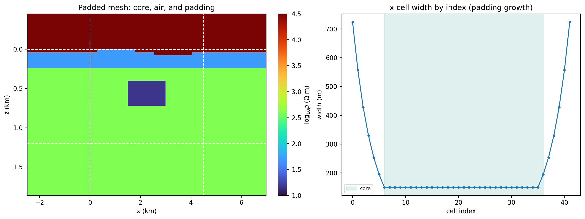
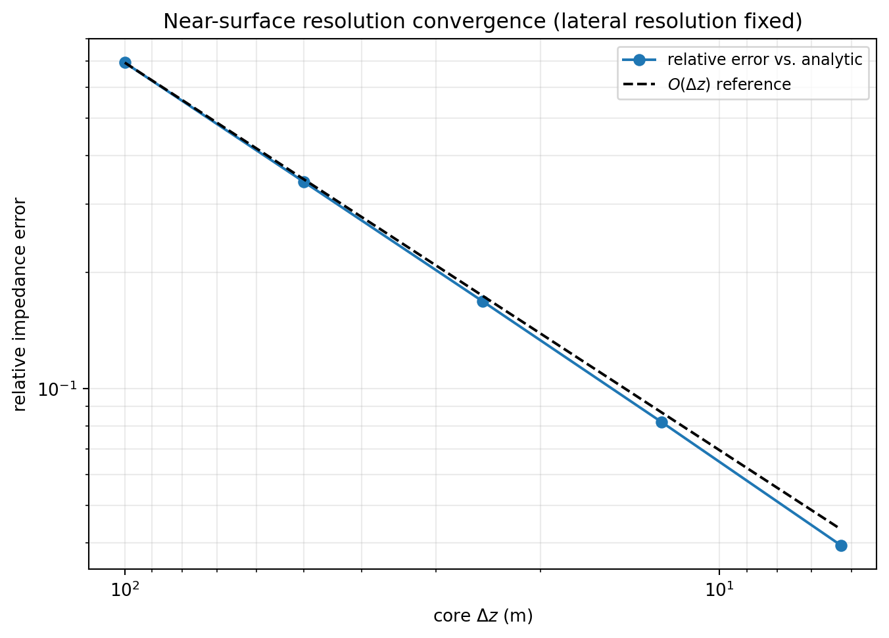
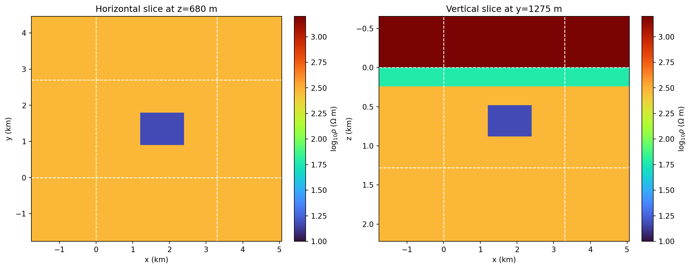
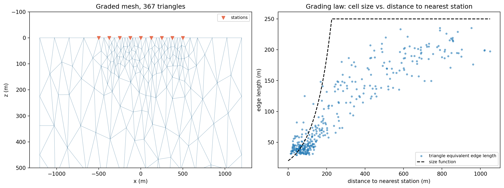

.. _forward_maxwell_meshing:

Maxwell Solver Meshes
=====================

Every mesh built so far in this section of the guide came from a handful of
``np.linspace`` calls, just enough edges to exercise a contract or an
adapter. A real earth model never arrives that way. It starts as a
geological grid over a region someone actually cares about, and turning
that into something a solver can use safely means adding padding so
boundaries do not contaminate the answer, air layers so the earth's true
free surface sits inside the mesh rather than at its edge, and enough
near-surface resolution that the smallest simulated skin depth is not
swallowed by a handful of oversized cells.
:func:`~pycsamt.forward.maxwell.build_solver_mesh` does that
transformation for the rectilinear contract
:doc:`maxwell_contracts` already introduced, and
:func:`~pycsamt.forward.maxwell.build_graded_tri_mesh` does the unstructured
equivalent for :class:`~pycsamt.forward.maxwell.contracts_tri.TriMesh`. This
page builds several real meshes with both, runs them through the adapters
and benchmarks the rest of this guide already introduced, and looks closely
at what the resulting figures and diagnostics actually say.
:doc:`/theory/maxwell_forward` derives the padding-growth and quality-ratio
equations used throughout; this page runs them.

Choosing A Mesh Builder
-----------------------

.. list-table::
   :header-rows: 1
   :widths: 24 34 34

   * -
     - ``build_solver_mesh``
     - ``build_graded_tri_mesh``
   * - Source
     - A :class:`~pycsamt.ai.geology.GeologyGrid` cell-centre model
     - Receiver x-positions and a domain extent
   * - Geometry
     - Rectilinear, padded, air-layered
     - Unstructured triangulation, graded around receivers
   * - Dimension
     - 2-D or 3-D
     - 2-D only
   * - Topography
     - Optional ``TopographicSurface``, rasterized onto cell centres
     - Optional polyline, followed exactly by the mesh boundary
   * - Consumed by
     - ``MT2DAdapter``, ``MT3DAdapter``, ``ModEm3DAdapter``
     - ``TriFEM2DAdapter``, ``Mare2DEMAdapter``

The two families are not interchangeable, and how firmly that is enforced
is worth knowing exactly rather than assuming symmetric. Handing a
:class:`TriMesh`-based problem to ``TriFEM2DAdapter``'s rectilinear sibling
``Mare2DEMAdapter`` expects gets a clean, controlled
:class:`~pycsamt.forward.maxwell.CompatibilityReport` rejection --
``TriFEM2DAdapter`` itself checks ``isinstance(problem.mesh, TriMesh)``
explicitly before touching anything else. Handing a rectilinear
:class:`~pycsamt.forward.maxwell.MaxwellMesh` problem the other way, or a
triangular one to ``MT2DAdapter``, is not currently caught that gracefully:
the generic capability assessment reads ``mesh.x_edges_m``, which only a
rectilinear mesh has, and raises a plain ``AttributeError`` rather than a
reported incompatibility. Route by the table above rather than relying on
every adapter to explain a wrong-family mesh cleanly.

Mesh Design Parameters
----------------------

:class:`~pycsamt.forward.maxwell.MeshDesign` is the padding, air-layer, and
quality-target configuration ``build_solver_mesh`` reads. Every field has a
default, but a design worth reusing across a project is worth naming and
inspecting explicitly:

.. code-block:: pycon

   >>> import numpy as np
   >>> from pycsamt.ai.geology import GeologyGrid, TopographicSurface
   >>> from pycsamt.forward.maxwell import (
   ...     MeshDesign, ReceiverSet, SolverMeshModel, build_solver_mesh, skin_depth_m,
   ... )

   >>> design = MeshDesign(
   ...     horizontal_padding_cells=6, bottom_padding_cells=6, air_layers=6,
   ...     padding_expansion=1.3, air_expansion=1.25,
   ... )
   >>> design.to_dict()
   {'schema_version': 1, 'horizontal_padding_cells': [6, 6], 'bottom_padding_cells': 6, 'air_layers': 6, 'padding_expansion': 1.3, 'air_expansion': 1.25, 'air_conductivity_s_m': 1e-08, 'minimum_cells_per_skin_depth': 4.0, 'maximum_adjacent_ratio': 1.5, 'maximum_aspect_ratio': 20.0}

``horizontal_padding_cells`` and ``bottom_padding_cells`` count cells, not
metres -- their physical extent depends on ``padding_expansion`` through
:eq:`eq-maxwell-padding-extent` in :doc:`/theory/maxwell_forward`, so the
same cell count reaches much farther on an expansion of 1.3 than on 1.1.
``air_layers``/``air_expansion`` do the same thing upward from the earth's
free surface. ``air_conductivity_s_m`` is a small but strictly positive
numerical conductivity, never zero -- a truly insulating air cell can make
the discrete system singular. The last three fields are advisory quality
targets, not physical inputs, checked against the mesh this builder actually
produces rather than assumed to hold: ``minimum_cells_per_skin_depth``
against the skin-depth estimate :eq:`eq-maxwell-skin-depth`,
``maximum_adjacent_ratio`` against :eq:`eq-maxwell-adjacent-ratio`, and
``maximum_aspect_ratio`` against :eq:`eq-maxwell-global-width-ratio`.

A Padded 2-D Solver Mesh
------------------------

A geological model, a synthetic ridge, and a shallow conductive target are
enough to see every piece ``build_solver_mesh`` adds:

.. code-block:: pycon

   >>> grid = GeologyGrid.regular_2d(nx=30, nz=30, dx_m=150.0, dz_m=40.0)
   >>> resistivity = np.full(grid.shape, 400.0)
   >>> resistivity[:6] = 50.0
   >>> resistivity[10:18, 10:20] = 15.0

   >>> elevation = 350 + 40 * np.sin(2 * np.pi * grid.x_m / np.ptp(grid.x_m))
   >>> surface = TopographicSurface(grid, elevation, float(elevation.max()), source="synthetic")

   >>> model = build_solver_mesh(
   ...     grid, resistivity_ohm_m=resistivity, frequencies_hz=[200.0, 20.0, 2.0],
   ...     topography=surface, design=design,
   ... )
   >>> model.mesh.shape
   (42, 42)
   >>> model.core_slices
   (slice(6, 36, None), slice(6, 36, None))

``core_slices`` is exactly where the original 30x30 geological grid sits
inside the padded 42x42 mesh -- six air layers on top, six padding cells on
every other side, each grown geometrically outward from the core rather
than added at core resolution:

.. code-dropdown:: ../../../scripts/generate_forward_maxwell_meshing_figures.py
   :language: python
   :pyobject: make_mesh_anatomy
   :linenos:
   :title: View mesh-anatomy source code

   Left: the padded mesh in log-resistivity, dashed lines marking
   ``core_slices``. The topographic ridge is the thin band of air cutting
   into the shallow conductive layer near the centre. Right: x cell width
   by index -- flat across the shaded core, then growing geometrically into
   padding on both sides.

The left panel is worth reading past the colour alone. The deep-red air
region sits above a visibly uneven boundary -- that unevenness is the
topography, rasterized onto cell centres rather than merely drawn on top of
a flat mesh, and it is why the thin conductive layer just below the surface
pinches and widens instead of running perfectly flat. The right panel makes
the padding strategy legible in a way the mesh image alone cannot: cell
width is constant across the whole shaded core, then grows smoothly outward
on both flanks, each step ``padding_expansion`` times the one before it,
exactly :eq:`eq-maxwell-padding-width`.

Skin Depth And Mesh Quality
---------------------------

:func:`~pycsamt.forward.maxwell.skin_depth_m` is the standalone estimate
:class:`~pycsamt.forward.maxwell.MeshQuality` scores a mesh against:

.. code-block:: pycon

   >>> round(float(skin_depth_m(40.0, 1000.0)), 1)
   100.7

The mesh above is not, in fact, acceptable by its own design's targets:

.. code-block:: pycon

   >>> model.quality.acceptable
   False
   >>> model.quality.warnings
   ('minimum skin depth has 0.919 core cells; target is 4',)

At 200 Hz over the 50 ohm m near-surface layer, the skin depth is only
about 138 m -- comparable to one core cell, not the four
``minimum_cells_per_skin_depth`` asks for. This is exactly the situation
:doc:`/theory/maxwell_forward` warns against papering over by lowering the
threshold; the fix is resolution, and *which axis* needs it is not always
obvious. Refining depth alone here does not fix it:

.. code-block:: pycon

   >>> coarse_grid = GeologyGrid.regular_2d(nx=24, nz=16, dx_m=200.0, dz_m=100.0)
   >>> coarse_rho = np.full(coarse_grid.shape, 300.0)
   >>> coarse_rho[:3] = 40.0
   >>> small_design = MeshDesign(horizontal_padding_cells=4, bottom_padding_cells=4, air_layers=4)
   >>> coarse = build_solver_mesh(
   ...     coarse_grid, resistivity_ohm_m=coarse_rho, frequencies_hz=[1000.0, 100.0, 10.0],
   ...     design=small_design,
   ... )
   >>> coarse.quality.cells_per_minimum_skin_depth
   0.5032921210448704

   >>> depth_refined_grid = GeologyGrid.regular_2d(nx=24, nz=64, dx_m=200.0, dz_m=25.0)
   >>> depth_refined_rho = np.full(depth_refined_grid.shape, 300.0)
   >>> depth_refined_rho[:12] = 40.0
   >>> depth_refined = build_solver_mesh(
   ...     depth_refined_grid, resistivity_ohm_m=depth_refined_rho,
   ...     frequencies_hz=[1000.0, 100.0, 10.0], design=small_design,
   ... )
   >>> depth_refined.quality.cells_per_minimum_skin_depth
   0.5032921210448704
   >>> depth_refined.quality.warnings
   ('global cell-width ratio 26.6 exceeds 20', 'minimum skin depth has 0.503 core cells; target is 4')

Cutting the core cell depth from 100 m to 25 m -- four times finer --
changed nothing about ``cells_per_minimum_skin_depth``, and added a second
warning besides. The metric is computed from the *largest* core cell width
across every axis, and the 200 m lateral cells never moved; refining depth
alone just made the mesh more anisotropic without touching the actual
bottleneck. Refining both axes together is what it takes:

.. code-block:: pycon

   >>> fine_grid = GeologyGrid.regular_2d(nx=48, nz=40, dx_m=25.0, dz_m=25.0)
   >>> fine_rho = np.full(fine_grid.shape, 300.0)
   >>> fine_rho[:12] = 40.0
   >>> wide_design = MeshDesign(horizontal_padding_cells=6, bottom_padding_cells=6, air_layers=5)
   >>> fine = build_solver_mesh(
   ...     fine_grid, resistivity_ohm_m=fine_rho, frequencies_hz=[1000.0, 100.0, 10.0],
   ...     design=wide_design,
   ... )
   >>> fine.quality.acceptable
   True
   >>> fine.quality.cells_per_minimum_skin_depth
   4.026336968358963

Near-Surface Resolution Convergence
-----------------------------------

Passing :attr:`~pycsamt.forward.maxwell.mesh.MeshQuality.acceptable` is a
geometric screening gate, not proof that a solved response has actually
converged --
:doc:`/user_guide/ai_inversion/forward_physics` already showed that by
holding depth resolution fixed and varying *lateral* padding width, finding
the half-space response barely moved at all. Holding lateral resolution
fixed and refining *depth* resolution instead, against the closed-form
:func:`~pycsamt.forward.maxwell.benchmarks.layered_earth_impedance`
reference for a real two-layer earth, tells the complementary story:

.. code-dropdown:: ../../../scripts/generate_forward_maxwell_meshing_figures.py
   :language: python
   :pyobject: make_resolution_convergence
   :linenos:
   :title: View resolution-convergence source code

   Relative impedance error at one station, against the closed-form
   layered-earth reference, as core ``dz`` is halved from 100 m to 6.25 m
   with lateral resolution held fixed throughout.

The error drops from 69% at the coarsest resolution to 4% at the finest,
tracking the dashed first-order reference line closely enough on log-log
axes to call this genuine, well-behaved numerical convergence rather than
noise. The detail worth sitting with is what stayed constant while that
happened: every one of these five meshes reported the *same*
``cells_per_minimum_skin_depth``, because -- exactly as in the previous
section -- the fixed 100 m lateral cells were the metric's binding
constraint the entire time, never the depth resolution actually being
tested. An advisory geometric gate answered one question and stayed silent
on the one that mattered here. Solved-response convergence,
:eq:`eq-maxwell-mesh-convergence`, is the evidence that actually closes it.

Receiver Placement And Terrain
------------------------------

:meth:`~pycsamt.forward.maxwell.mesh.SolverMeshModel.assess_receivers`
checks candidate receivers against the padded mesh and its terrain before
:meth:`~pycsamt.forward.maxwell.mesh.SolverMeshModel.to_problem` ever builds
a problem from them, and each failure mode is distinct:

.. code-block:: pycon

   >>> station_x = grid.x_m[::4]
   >>> receivers = ReceiverSet([[x, 0.0] for x in station_x], [f"S{i:02d}" for i in range(len(station_x))])
   >>> model.assess_receivers(receivers)
   ()

   >>> model.assess_receivers(ReceiverSet([[999_999.0, 0.0]], ["OUT"]))
   ('receiver x coordinates fall outside the mesh',)
   >>> model.assess_receivers(ReceiverSet([[3_000.0, 500.0]], ["DEEP"]))
   ('receiver z coordinates fall below local terrain',)
   >>> model.assess_receivers(ReceiverSet([[3_000.0, 0.0, 0.0]], ["3D"]))
   ('receiver and mesh dimensions differ',)

``z=0`` here is the reference elevation ``build_solver_mesh`` assigns to
depth zero, the highest point on the ridge -- everywhere else on this
terrain sits at some positive depth below that shared reference, so a
receiver placed at exactly ``z=0`` is guaranteed to be on or above the
local surface across the whole line, without having to interpolate the
terrain by hand for every station. A station placed well below that,
inside the earth rather than on it, is exactly the ``"DEEP"`` case above.
:meth:`~pycsamt.forward.maxwell.mesh.SolverMeshModel.to_problem` runs this
same check and raises rather than silently building a problem with a buried
receiver:

.. code-block:: pycon

   >>> problem = model.to_problem([20.0, 2.0], receivers, mark_air_inactive=False)
   >>> problem.receivers.count
   8

``mark_air_inactive=False`` here is not a default worth overlooking: it is
what makes this specific problem solvable by ``MT2DAdapter`` at all, which
declares ``supports_inactive_cells=False`` and treats the whole mesh,
conductive air included, as earth. Passing ``mark_air_inactive=True``
instead would build a problem only a topography-and-inactive-cell-capable
adapter such as ``TriFEM2DAdapter`` or ``Mare2DEMAdapter`` could accept --
:doc:`maxwell_backends`'s capability check exists precisely to catch that
mismatch before a solve is attempted.

A 3-D Solver Mesh
-----------------

Every mesh so far has been 2-D. ``build_solver_mesh`` builds a 3-D mesh the
same way, from a 3-D :class:`~pycsamt.ai.geology.GeologyGrid`, with air
layers and padding added on every horizontal side plus the bottom:

.. code-dropdown:: ../../../scripts/generate_forward_maxwell_meshing_figures.py
   :language: python
   :pyobject: make_3d_mesh_slices
   :linenos:
   :title: View 3-D mesh-slices source code

   A horizontal slice through the buried target's depth, and a vertical
   slice through its centre, of the same padded 3-D mesh. Dashed lines mark
   the core boundary on both panels.

The two slices are two views of one 26x28x32-cell mesh, not two separate
models -- the buried conductive block appears in both, at consistent
coordinates, because both panels index the same ``conductivity_s_m`` array
along different axes. The vertical slice additionally shows what the
horizontal one cannot: the shallow conductive overburden as a continuous
band immediately below the deep-red air region, and the true vertical
separation between that overburden and the deeper, discrete target. This is
exactly the mesh :class:`~pycsamt.forward.maxwell.mt3d.MT3DAdapter` or
:class:`~pycsamt.forward.maxwell.modem3d.ModEm3DAdapter` would receive
through :meth:`~pycsamt.forward.maxwell.mesh.SolverMeshModel.to_problem`; a
station grid instead of a single profile line is the only other change a
genuine 3-D survey would add.

Persisting A Mesh Model
-----------------------

:class:`~pycsamt.forward.maxwell.SolverMeshModel` persists the same way
every other contract in this package does -- a compressed ``.npz`` archive,
no pickle, restored through its own validated constructor:

.. code-block:: pycon

   >>> from pathlib import Path
   >>> from tempfile import TemporaryDirectory
   >>> directory = TemporaryDirectory()
   >>> archive_path = Path(directory.name) / "model.npz"
   >>> _ = model.to_npz(archive_path)
   >>> restored = SolverMeshModel.from_npz(archive_path)
   >>> restored.model_hash == model.model_hash
   True
   >>> restored.quality.acceptable == model.quality.acceptable
   True

:attr:`~pycsamt.forward.maxwell.mesh.SolverMeshModel.model_hash` identifies
the mesh, conductivity, region masks, and design together -- a different
:class:`MeshDesign` on the identical geological grid is a different model
hash, the same way a different threshold policy is a different
:term:`benchmark hash` in :doc:`maxwell_benchmarks` even when the underlying
problem is unchanged.

Graded Triangular Meshes
------------------------

``build_graded_tri_mesh`` takes a completely different approach: rather
than padding a regular grid, it triangulates a domain boundary and receiver
positions directly with `Triangle <https://rufat.be/triangle/>`_, then
refines that triangulation against a :term:`size function` that grows
triangle edge length geometrically with distance from the nearest station,
capped at a maximum:

.. code-dropdown:: ../../../scripts/generate_forward_maxwell_meshing_figures.py
   :language: python
   :pyobject: make_tri_grading_law
   :linenos:
   :title: View triangular-grading-law source code

   Left: the graded mesh, visibly finer directly beneath the stations.
   Right: every triangle's equivalent edge length against its centroid's
   distance to the nearest station, against the size function that was
   asked for.

The mesh panel shows the grading qualitatively -- small triangles crowd the
region under the stations, growing visibly coarser with depth and lateral
distance. The right panel turns that impression into a real measurement:
each point is one of 367 actual triangles, not a resampled curve, and it
tracks the dashed size-function line with a correlation of about 0.90.
Triangle's refinement is a constraint satisfied through Ruppert's algorithm
under a simultaneous minimum-angle requirement, not an exact area
assignment, so real triangles scatter around the target rather than sitting
exactly on it -- particularly near the cap, where the minimum-angle
constraint and the area target compete most directly. A :term:`PSLG` built
this way still guarantees every station sits exactly on a mesh node, which
:class:`~pycsamt.forward.maxwell.tri_fem2d.TriFEM2DAdapter` depends on
directly.

Malformed requests are rejected before Triangle ever runs:

.. code-block:: pycon

   >>> from pycsamt.forward.maxwell import build_graded_tri_mesh
   >>> build_graded_tri_mesh((0.0, 1_000.0), (0.0, 500.0), [1_500.0], surface_cell_m=20.0)
   Traceback (most recent call last):
   ...
   ValueError: station_x_m must be non-empty, finite, and within x_range_m (0.0, 1000.0).
   >>> build_graded_tri_mesh((0.0, 1_000.0), (0.0, 500.0), [500.0], surface_cell_m=20.0, growth_rate=0.9)
   Traceback (most recent call last):
   ...
   ValueError: growth_rate must be finite and greater than 1.

Common Mistakes
---------------

``Assuming cells_per_minimum_skin_depth reflects every axis``
   The metric is computed from the single largest core cell width across
   all axes. Refining one axis while another stays coarse can leave it
   completely unchanged, as the depth-only refinement above shows -- check
   which axis is actually binding before refining the wrong one.

``Treating quality.acceptable as proof of an accurate solve``
   It is an advisory geometric screen against a declared target, evaluated
   without ever calling a solver. The resolution-convergence study above
   held that metric perfectly constant while the actual solved error
   dropped by roughly a factor of eighteen -- run :doc:`maxwell_benchmarks` or a
   dedicated convergence study for numerical evidence, not this flag alone.

``Placing receivers by guessing an elevation offset``
   Interpolating a topography polyline by hand to guess a receiver's
   surface elevation is exactly the discretization mismatch
   ``assess_receivers`` exists to catch -- and it will, since the mesh's
   own discretized earth mask, not the smooth input surface, is what a
   receiver is actually checked against. Placing receivers at the shared
   reference depth (``z=0``) sidesteps the mismatch entirely whenever that
   convention fits the survey.

``Mixing mark_air_inactive with an adapter that cannot accept it``
   Only backends declaring ``supports_inactive_cells`` and, for a laterally
   varying mask, ``supports_topography`` as well can accept a problem built
   with ``mark_air_inactive=True``. Check :doc:`maxwell_backends`'
   capability table before building the problem, not after an adapter
   rejects it.

``Reusing a build_graded_tri_mesh region_ids convention``
   Every triangle gets its own region id (``1..n_triangles``), matching
   ``Mare2DEMAdapter``'s per-triangle-region expectation. Code written
   against an older mesh generator that grouped many triangles under one
   shared region id will not carry over unchanged.

Next Pages
----------

That closes the seven-page arc :doc:`maxwell_overview` mapped out:
contracts, meshing, the backend registry, adapters, benchmarks, and
caching/batch solving all now have a real, executed page behind them.
:doc:`/user_guide/ai_inversion/forward_physics` and
:doc:`/user_guide/ai_inversion/dataset2d` are the natural next stop for
putting a real mesh like the ones built here to work generating training
data rather than a single illustrative response.
