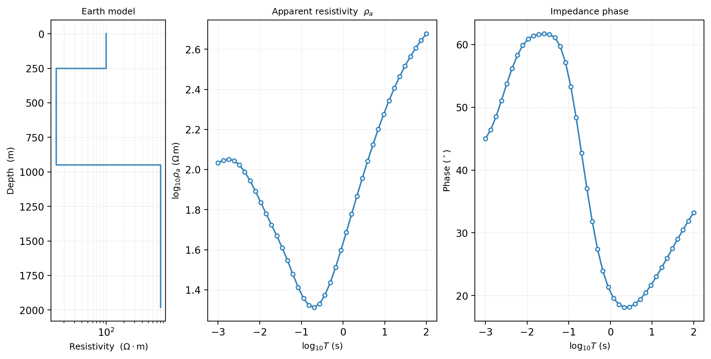

.. _forward_overview:

Overview
========

Forward And Model Integrations
--------------------------------

The :mod:`pycsamt.forward` and :mod:`pycsamt.models` packages are related, but
they should not be treated as the same layer.

.. list-table::
   :header-rows: 1
   :widths: 24 38 38

   * - Package
     - Main responsibility
     - Typical use
   * - :mod:`pycsamt.forward`
     - Compute controlled :term:`forward response`\ s inside Python using pyCSAMT
       model containers, solvers, dataset generators, noise models, and
       plotting helpers.
     - Test survey design, generate training data, validate inversion
       assumptions, compare response behaviour, and build reproducible
       synthetic examples.
   * - :mod:`pycsamt.models`
     - Integrate external modelling and inversion engines such as Occam2D,
       ModEM, and MARE2DEM.
     - Prepare native engine files, run external binaries, load engine
       outputs, and manage backend-specific inversion projects.

Use :mod:`pycsamt.forward` when you need a controlled :term:`synthetic dataset`
or response from a known model. Use :mod:`pycsamt.models` when you need to
prepare, run, or load a native external-engine project. The two layers meet
when a forward synthetic experiment is converted into an inversion benchmark:
the known model gives the reference answer, and the inversion workflow tests
whether that answer can be recovered from the predicted data.

Package Map
-------------

The public forward API is built around a small set of object families.

.. list-table::
   :header-rows: 1
   :widths: 28 34 38

   * - Object family
     - Main objects
     - Role
   * - Configuration
     - ``ForwardConfig``, ``ForwardConfig2D``, ``ForwardConfig3D``
     - Store reproducible frequency/time axes, model ranges,
       :term:`station layout`\ s, solver options, noise settings, and output
       choices.
   * - Model containers
     - ``LayeredModel``, ``Grid2D``, ``Grid3D``
     - Represent 1-D :term:`layered earth`\ s, 2-D profile grids, and quasi-3-D
       resistivity volumes.
   * - Solvers
     - ``MT1DForward``, ``CSAMT1DForward``, ``TEM1DForward``, ``MT2DForward``,
       ``MT3DForward``
     - Compute predicted electromagnetic responses from model containers.
   * - Response containers
     - ``ForwardResponse``, ``ForwardResponse2D``, ``ForwardResponse3D``
     - Hold predicted :term:`apparent resistivity`, :term:`phase`, transient
       values, :term:`impedance tensor` components, :term:`survey geometry`,
       and array conversion helpers.
   * - Noise models
     - ``GaussianNoise``, ``MultiplicativeNoise``, ``FieldRealisticNoise``
     - Convert ideal synthetic responses into more realistic observations.
   * - Dataset containers
     - ``ForwardDataset``, ``SurveyDataset3D``
     - Store synthetic feature and target arrays, metadata, splits, and
       compressed ``.npz`` archives.
   * - Plotting helpers
     - ``plot_response_1d``, ``plot_model_2d``, ``plot_pseudosection_2d``,
       ``plot_model_3d``, ``plot_response_map_3d``, and related functions
     - Inspect models, responses, tensor components, noisy examples, and
       generated datasets before they are trusted downstream.

Core Workflow
---------------

A typical :term:`forward modelling` workflow has six stages. The smallest
version starts with a 1-D :term:`layered earth` because the geometry is easy to
audit: resistivity is a function of depth only, :math:`\rho=\rho(z)`, and the
MT solver predicts the impedance :math:`Z(f)` for each frequency. The reported
curves are then derived in the usual way from impedance magnitude and phase,
with apparent resistivity proportional to :math:`|Z|^2/f`. In other words, the
model is compact, but the response still carries the frequency-dependent
signature that an inversion or interpretation workflow would need.

.. code-block:: pycon
   :linenos:

   >>> import numpy as np

   >>> from pycsamt.forward import LayeredModel, MT1DForward, plot_response_and_model_1d

   >>> freqs = np.logspace(-2, 3, 40)
   >>> model = LayeredModel(
   ...     resistivity=[100.0, 15.0, 800.0],
   ...     thickness=[250.0, 700.0],
   ... )

   >>> solver = MT1DForward(freqs)
   >>> response = solver.run(model)
   >>> print(f"response: {response.method}, {response.freqs.size} frequencies")
   response: MT1D, 40 frequencies
   >>> print(f"rho_a range: {response.rho_a.min():.2f}-{response.rho_a.max():.2f} Ohm.m")
   rho_a range: 20.57-475.29 Ohm.m
   >>> print(f"phase range: {response.phase.min():.2f}-{response.phase.max():.2f} deg")
   phase range: 18.14-61.70 deg

   >>> fig = plot_response_and_model_1d(response, model)
   >>> fig.savefig("runs/forward/mt1d_response.png", dpi=200)

   A three-layer MT1D example generated from the code above. The conductive
   middle layer lowers :math:`\rho_a` over part of the period range, while the
   phase curve records the transition between layers.

For production work, the same idea should be driven by a configuration file
and archived with outputs:

#. define the physical question and target dimensionality;
#. create a ``ForwardConfig*`` template;
#. build a model or grid from the configuration;
#. run the selected solver;
#. apply a documented :term:`noise model` when simulating observations;
#. plot and archive the model, response, configuration, and metadata.

Choosing A Path
------------------

Different users enter the forward section with different goals.

.. list-table::
   :header-rows: 1
   :widths: 30 34 36

   * - Goal
     - Start here
     - Then read
   * - Understand the physics and vocabulary
     - :doc:`concepts`
     - :doc:`solvers_and_grids`, :doc:`plotting`
   * - Build a reproducible synthetic run
     - :doc:`configuration`
     - :doc:`solvers_and_grids`, :doc:`forward_to_inversion`
   * - Generate training data for AI inversion
     - :doc:`synthetic_datasets`
     - :doc:`configuration`, :doc:`plotting`,
       :doc:`../agents/ai_model_zoo_agents`
   * - Compare 1-D, 2-D, and quasi-3-D behaviour
     - :doc:`solvers_and_grids`
     - :doc:`concepts`, :doc:`plotting`
   * - Prepare an inversion benchmark
     - :doc:`forward_to_inversion`
     - :doc:`../models/index`, :doc:`../pipeline/index`
   * - Diagnose a generated dataset or response
     - :doc:`plotting`
     - :doc:`synthetic_datasets`, :doc:`forward_to_inversion`

Relationship To Theory
----------------------

:term:`Forward modelling` is practical, but it is not detached from theory.
When a plot or synthetic response looks surprising, the relevant background
pages are:

* :doc:`../../theory/csamt_amt_mt_overview` for the distinction between
  :term:`CSAMT`, :term:`AMT`, :term:`MT`, and :term:`TEM` survey assumptions;
* :doc:`../../theory/impedance_tensor` for impedance,
  :term:`apparent resistivity`, :term:`phase`, and tensor notation;
* :doc:`../../theory/static_shift` for shallow distortion effects that can make
  synthetic and field curves disagree;
* :doc:`../../theory/inversion_concepts` for how forward responses are used inside
  objective functions and regularized inversion.
