.. _forward_plotting:

Forward Plotting
================

Forward plots are :term:`quality control` tools. They help you see whether a
model, grid, :term:`forward response`, or :term:`synthetic dataset` looks
physically plausible before it is used for inversion, AI training, reports, or
tutorials.

In pyCSAMT, plotting functions are deliberately lightweight wrappers around
Matplotlib. They do not run the solver. They inspect objects that already
exist:

* :class:`pycsamt.forward.LayeredModel`;
* :class:`pycsamt.forward.ForwardResponse`;
* :class:`pycsamt.forward.Grid2D`;
* :class:`pycsamt.forward.ForwardResponse2D`;
* :class:`pycsamt.forward.Grid3D`;
* :class:`pycsamt.forward.ForwardResponse3D`.

Most plotting functions return Matplotlib ``Axes`` objects, while composite
figures return a :term:`Matplotlib figure` or an array of axes. This makes it
easy to customize labels, save files, or place plots inside your own dashboards
and notebooks. The helpers deliberately keep plotting separate from modelling:
the solver produces the arrays, and the plotting layer only makes those arrays
auditable.

Plot Selection Guide
--------------------

Use this table to choose the right function.

.. list-table::
   :header-rows: 1
   :widths: 25 35 40

   * - Function
     - Input
     - Use
   * - ``plot_response_1d``
     - ``ForwardResponse``
     - Apparent resistivity and phase curves for MT/CSAMT responses.
   * - ``plot_model_1d``
     - ``LayeredModel`` or list of models
     - Layered resistivity-depth profiles.
   * - ``plot_response_and_model_1d``
     - ``ForwardResponse`` plus optional ``LayeredModel``
     - One-page validation view for a 1-D forward run.
   * - ``plot_model_2d``
     - ``Grid2D``
     - 2-D resistivity model with optional station markers.
   * - ``plot_pseudosection_2d``
     - ``ForwardResponse2D``
     - Period-by-station pseudo-section for TE or TM response quantities.
   * - ``plot_response_profiles``
     - ``ForwardResponse2D``
     - Lateral profiles at selected frequencies.
   * - ``plot_model_3d``
     - ``Grid3D``
     - Orthogonal XZ, YZ, and XY slices through a 3-D volume.
   * - ``plot_response_map_3d``
     - ``ForwardResponse3D``
     - Map view of one tensor component at one frequency.
   * - ``plot_response_section_3d``
     - ``ForwardResponse3D``
     - Pseudo-section through one y-row of a 3-D station layout.
   * - ``plot_tensor_components_3d``
     - ``ForwardResponse3D``
     - Four-panel tensor component map.

The plotting helpers use project style controls from ``pycsamt.api.style`` and
axis controls from ``pycsamt.api.control``. For example, apparent resistivity is
displayed in a log-style geophysical convention, and station markers use the
shared station rendering presets.

Saving Figures
--------------

Because the plotting functions return Matplotlib objects, save figures using
standard Matplotlib methods.

.. code-block:: python
   :linenos:

   import matplotlib.pyplot as plt

   axes = plot_response_1d(response)
   fig = axes[0].get_figure()
   fig.savefig("response_1d.png", dpi=200, bbox_inches="tight")

   plt.close(fig)

For composite functions that return a figure directly:

.. code-block:: python
   :linenos:

   fig = plot_response_and_model_1d(response, model=model)
   fig.savefig("model_and_response.png", dpi=200, bbox_inches="tight")

1-D Response Plots
------------------

Use ``plot_response_1d`` for MT and CSAMT apparent resistivity and phase curves.
It returns two axes: ``[ax_rho, ax_phase]``.

.. code-block:: python
   :linenos:

   import numpy as np

   from pycsamt.forward import LayeredModel, MT1DForward, plot_response_1d

   model = LayeredModel(
       resistivity=[100.0, 10.0, 500.0],
       thickness=[300.0, 800.0],
       name="conductive_middle_layer",
   )

   response = MT1DForward(
       freqs=np.logspace(-3, 4, 40),
   ).run(model)

   axes = plot_response_1d(
       response,
       modes="both",
       title="MT1D response",
   )

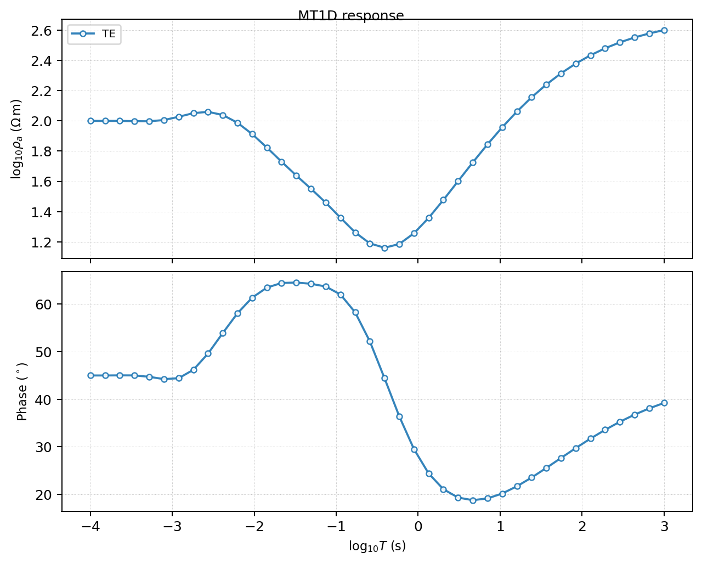

   The two returned axes show :term:`apparent resistivity` and :term:`phase`
   against period. For the conductive middle layer, the resistivity curve drops
   over the period band that is most sensitive to the layer.

The example produces two axes and a 40-sample response:

.. code-block:: pycon

   >>> len(axes), response.rho_a.shape, response.phase.shape
   (2, (40,), (40,))

Read this plot as a quick physical sanity check:

* a simple halfspace should produce a smooth response;
* a conductive layer should lower apparent resistivity over its sensitivity
  band;
* phase should remain finite and plausible;
* sharp noise or oscillation in a clean synthetic response usually signals an
  input or solver setup problem.

``plot_response_1d`` expects frequency-domain responses. TDEM responses can be
quickly inspected with the response object's own ``plot`` method:

.. code-block:: python
   :linenos:

   import numpy as np

   from pycsamt.forward import LayeredModel, TEM1DForward

   model = LayeredModel([60.0, 250.0, 900.0], [120.0, 700.0])
   response = TEM1DForward(np.logspace(-6, -3, 25)).run(model)

   ax = response.plot()
   print(response.times.shape, response.dBz_dt.shape)

Captured output:

.. code-block:: pycon

   >>> print(response.times.shape, response.dBz_dt.shape)
   (25,) (25,)

A TEM response uses :term:`time gate`\ s instead of frequency samples, and
``response.plot()`` reads them off the same object rather than needing a
separate axis argument.

1-D Model Plots
---------------

Use ``plot_model_1d`` to inspect one or more layered models. It returns one
axis.

.. code-block:: python
   :linenos:

   from pycsamt.forward import LayeredModel, plot_model_1d

   truth = LayeredModel([80.0, 25.0, 600.0], [250.0, 900.0], name="truth")
   start = LayeredModel([100.0, 50.0, 500.0], [300.0, 1000.0], name="start")

   ax = plot_model_1d(
       [truth, start],
       labels=["truth", "starting model"],
       depth_max=2000.0,
       title="Layered models",
   )

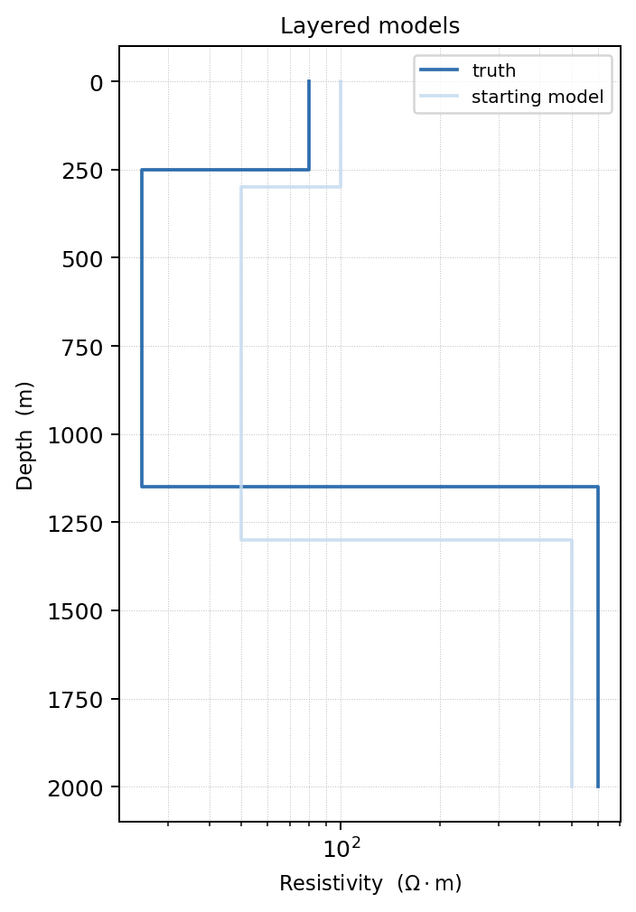

   Overlaying the truth and starting model makes the prior information visible
   before running a synthetic recovery test.

This is especially useful when preparing a synthetic recovery test. Plot the
truth model and the starting model together so it is clear how much prior
information the inversion receives.

1-D Composite View
------------------

``plot_response_and_model_1d`` creates the canonical validation figure for a
single 1-D forward run. It returns a Matplotlib ``Figure``.

.. code-block:: python
   :linenos:

   import numpy as np

   from pycsamt.forward import (
       LayeredModel,
       MT1DForward,
       plot_response_and_model_1d,
   )

   model = LayeredModel([100.0, 20.0, 800.0], [300.0, 1000.0])
   response = MT1DForward(np.logspace(-3, 4, 40)).run(model)

   fig = plot_response_and_model_1d(
       response,
       model=model,
       title="Forward validation",
   )

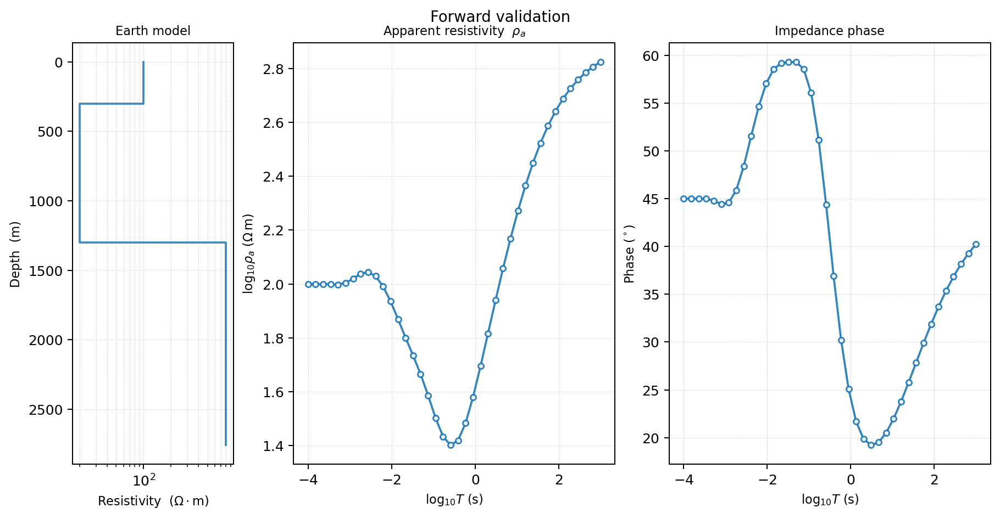

   The composite view keeps the model and response together, which is useful
   when reviewing whether a curve feature is consistent with a layer boundary.

If ``model`` is omitted, the function returns a two-panel response-only figure.

2-D Grid Model Plots
--------------------

Use ``plot_model_2d`` to display a :class:`pycsamt.forward.Grid2D`. By default,
it clips padding cells and displays the core model region.

.. code-block:: python
   :linenos:

   from pycsamt.forward import Grid2D, plot_model_2d

   grid = Grid2D.with_anomaly(
       bg_rho=500.0,
       anomaly_rho=5.0,
       anomaly_bounds=(2000.0, 6000.0, 300.0, 1500.0),
       nx=50,
       nz=35,
       x_max=10000.0,
       z_max=6000.0,
       n_pad=8,
       n_stations=16,
   )

   ax = plot_model_2d(
       grid,
       clip_core=True,
       show_stations=True,
       station_preset="inversion",
       title="2-D anomaly model",
   )

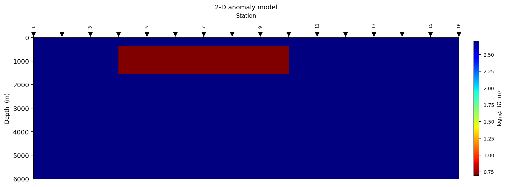

   The core model is shown without padding cells. Station markers provide a
   quick check that the :term:`station layout` samples the anomaly.

Important options:

``log_scale``
   When ``True``, the colour scale is :math:`\log_{10}\rho`. This is usually
   best for resistivity models.

``clip_core``
   When ``True``, padding cells are hidden. Use ``clip_core=False`` when
   debugging whether padding is large enough.

``show_stations``
   When ``True``, stations are drawn along the surface. If stations appear
   outside the core model, revisit grid construction.

2-D Pseudo-Sections
-------------------

Use ``plot_pseudosection_2d`` to show a period-by-station view of a 2-D MT
response. It works on :class:`pycsamt.forward.ForwardResponse2D`.

.. code-block:: python
   :linenos:

   from pycsamt.forward import MT2DForward, plot_pseudosection_2d

   response = MT2DForward(
       freqs=[1.0, 10.0, 100.0],
       grid=grid,
       verbose=False,
   ).run()

   ax = plot_pseudosection_2d(
       response,
       mode="te",
       quantity="rho_a",
       n_contours=6,
       title="TE apparent resistivity",
   )

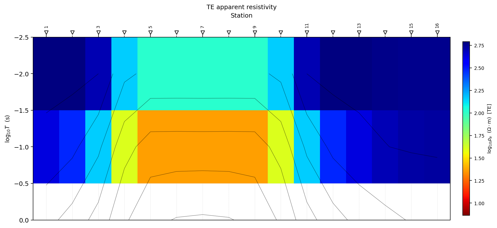

   The pseudo-section arranges response values by station and period. It is a
   display of the forward response, not a recovered depth model.

Valid ``mode`` values are ``"te"`` and ``"tm"``. Valid ``quantity`` values are
``"rho_a"`` and ``"phase"``. Apparent resistivity uses a ``jet_r`` style colour
map by default, while phase uses ``RdBu_r``.

Pseudo-sections are not subsurface images. They display response variations as
a function of period and station distance. Use them to see whether a target
creates a coherent response pattern, not to interpret target geometry directly.

2-D Lateral Response Profiles
-----------------------------

Use ``plot_response_profiles`` to inspect how the response varies along the
profile at selected frequencies.

.. code-block:: python
   :linenos:

   from pycsamt.forward import plot_response_profiles

   ax = plot_response_profiles(
       response,
       mode="te",
       quantity="rho_a",
       freq_indices=[0, 1, 2],
       title="Lateral response profiles",
   )

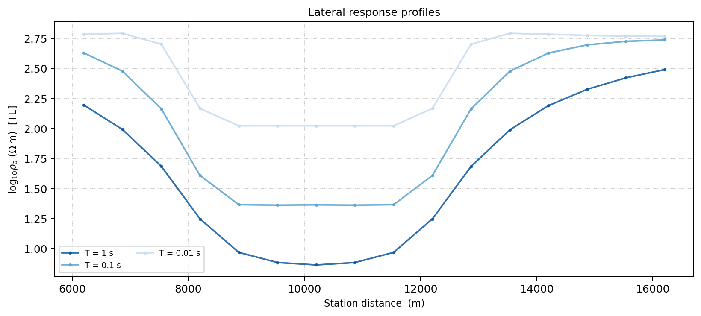

   Frequency slices make lateral shifts and broadening easier to see than in a
   filled pseudo-section alone.

If ``freq_indices`` is omitted, the function chooses a small number of
approximately evenly spaced frequencies. This plot is useful for detecting
whether an anomaly response is localized, broad, shifted, or absent.

3-D Model Slice Plots
---------------------

Use ``plot_model_3d`` to inspect a :class:`pycsamt.forward.Grid3D`. It returns
three axes: ``[ax_xz, ax_yz, ax_xy]``.

.. code-block:: python
   :linenos:

   from pycsamt.forward import Grid3D, plot_model_3d

   grid3d = Grid3D.block_anomaly(
       bg_rho=500.0,
       anomaly_rho=20.0,
       bounds=(2000.0, 6000.0, 2000.0, 6000.0, 300.0, 1500.0),
       nx=20,
       ny=20,
       nz=15,
       x_max=8000.0,
       y_max=8000.0,
       z_max=4000.0,
       n_pad=6,
       nx_stations=5,
       ny_stations=5,
   )

   axes = plot_model_3d(
       grid3d,
       clip_core=True,
       show_stations=True,
       title="3-D block anomaly",
   )

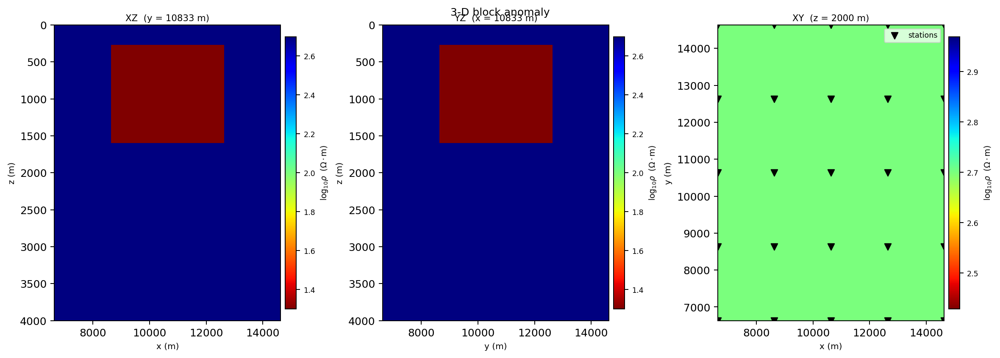

   Orthogonal slices expose the same resistivity volume from three directions,
   so misplaced bounds are usually visible before a solver run.

The three panels show:

* XZ slice through the middle y position;
* YZ slice through the middle x position;
* XY slice through the middle z position.

Station positions are overlaid on the XY panel.

3-D Response Maps
-----------------

Use ``plot_response_map_3d`` to display one response component at one frequency
as a map-view station scatter plot.

.. code-block:: python
   :linenos:

   from pycsamt.forward import MT3DForward, plot_response_map_3d

   response3d = MT3DForward(
       freqs=[1.0, 10.0, 100.0],
       grid=grid3d,
   ).run()

   ax = plot_response_map_3d(
       response3d,
       freq_idx=0,
       component="xy",
       quantity="rho_a",
       show_labels=True,
       title="Zxy apparent resistivity map",
   )

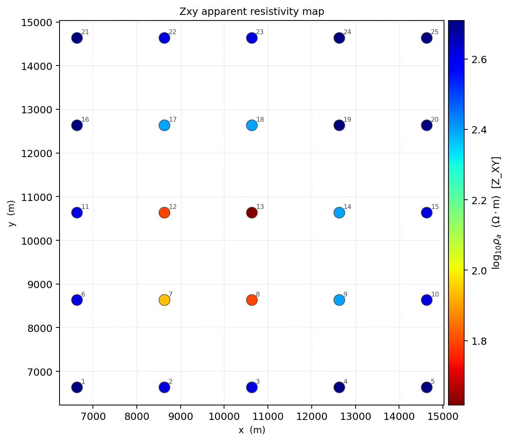

   A response map shows one tensor component at one frequency across the station
   grid.

Valid components are ``"xy"``, ``"yx"``, ``"xx"``, and ``"yy"``. Valid
quantities are ``"rho_a"`` and ``"phase"``.

3-D Response Sections
---------------------

Use ``plot_response_section_3d`` for a period-by-station pseudo-section through
one y-row of the station layout.

.. code-block:: python
   :linenos:

   from pycsamt.forward import plot_response_section_3d

   ax = plot_response_section_3d(
       response3d,
       component="xy",
       quantity="rho_a",
       y_row=None,
       n_contours=5,
   )

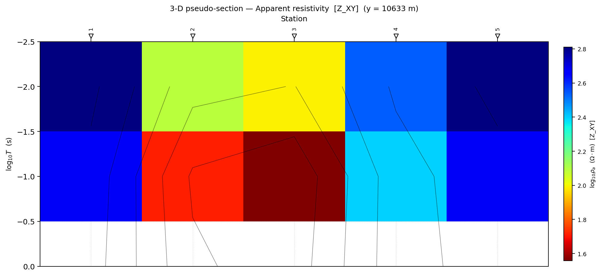

   With ``y_row=None``, the section is extracted through the middle row of the
   station grid.

When ``y_row=None``, the middle y-row is selected. Use an explicit row index to
inspect different profile lines through the station grid.

3-D Tensor Component Panels
---------------------------

Use ``plot_tensor_components_3d`` to compare all four tensor components at one
frequency.

.. code-block:: python
   :linenos:

   from pycsamt.forward import plot_tensor_components_3d

   axes = plot_tensor_components_3d(
       response3d,
       freq_idx=0,
       quantity="rho_a",
       title="Tensor component comparison",
   )

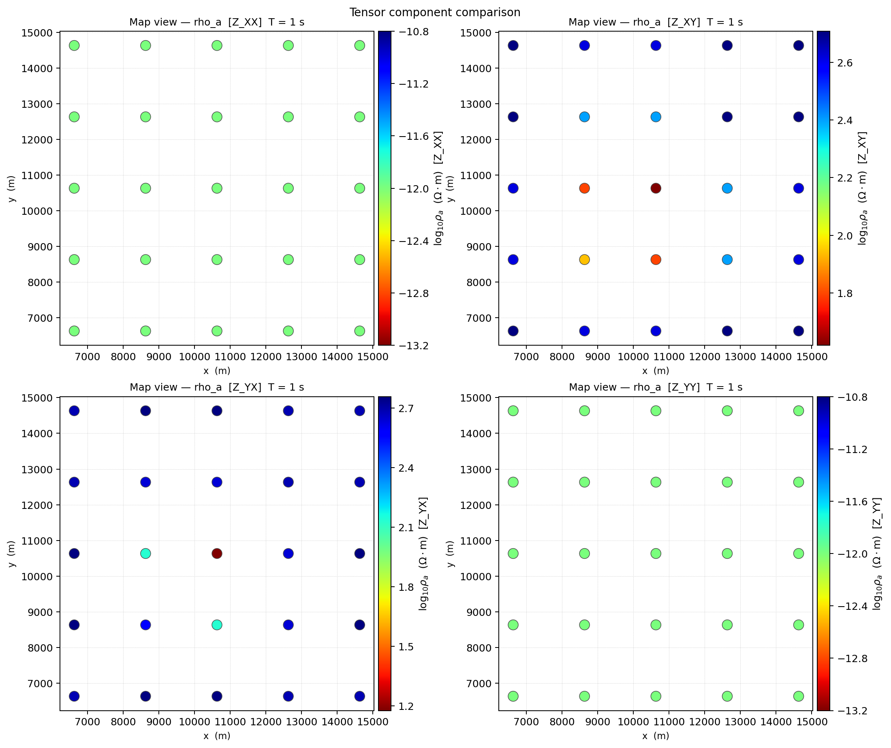

   The four-panel layout keeps diagonal and off-diagonal components comparable
   at the same frequency and colour scale.

The panels are arranged as:

.. code-block:: text
   :linenos:

   Zxx  Zxy
   Zyx  Zyy

For quasi-3-D responses, interpret diagonal components with care. The
quasi-3-D solver is useful for survey design and synthetic AI examples, but it
is not a substitute for a production full-3-D modelling engine.

Plotting Noisy Responses
------------------------

Always plot a few clean and noisy responses before training an AI model. This
prevents accidental use of unrealistic noise levels or corrupted axes.

.. code-block:: python
   :linenos:

   import numpy as np

   from pycsamt.forward import (
       FieldRealisticNoise,
       LayeredModel,
       MT1DForward,
       plot_response_1d,
   )

   model = LayeredModel([100.0, 20.0, 800.0], [300.0, 1000.0])
   clean = MT1DForward(np.logspace(-3, 4, 40)).run(model)
   noisy = FieldRealisticNoise(base_level=0.05).apply(clean, seed=10)

   axes = plot_response_1d(clean, label_te="clean", color_te="0.2")
   plot_response_1d(
       noisy,
       label_te="noisy",
       color_te="firebrick",
       axes=axes,
   )

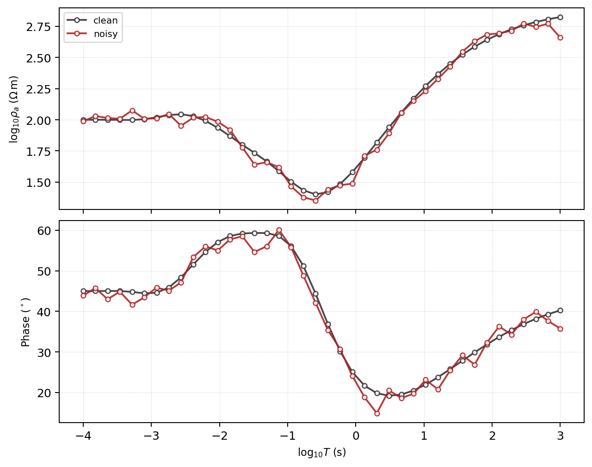

   A noisy sample should perturb the clean curve without destroying the
   physically meaningful trend.

When overlaying multiple responses, keep labels explicit. A noisy synthetic
curve should still look like a possible field response. If the curve is
dominated by spikes or negative-looking artefacts, reduce the noise level or
review the noise model.

Plotting Dataset Samples
------------------------

``ForwardDataset`` stores feature vectors, not full response objects. For
dataset QA, plot feature vectors directly or regenerate selected examples from
the original configuration. A simple feature plot can still catch many issues.

.. code-block:: python
   :linenos:

   import matplotlib.pyplot as plt
   import numpy as np

   def plot_dataset_sample(dataset, index=0):
       fig, ax = plt.subplots(figsize=(7, 3), constrained_layout=True)
       ax.plot(np.asarray(dataset.X[index]).ravel(), lw=1.2)
       ax.set_xlabel("Feature index")
       ax.set_ylabel("Feature value")
       ax.set_title(f"{dataset.solver} sample {index}")
       return ax

   ax = plot_dataset_sample(dataset, index=0)

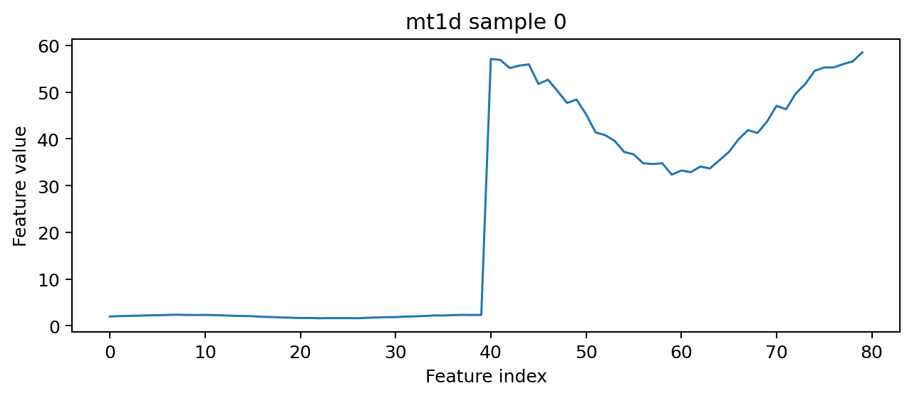

   A raw feature-vector plot is not geophysical interpretation, but it quickly
   exposes NaNs, clipping, scale jumps, or unexpected feature ordering.

For MT/CSAMT datasets with phase included, the first half of the feature vector
is log apparent resistivity and the second half is phase. Splitting the feature
vector before plotting often makes the QA clearer.

.. code-block:: python
   :linenos:

   def plot_mt_feature_sample(dataset, index=0):
       n_freqs = len(dataset.freqs)
       x = dataset.X[index]
       log_rho = x[:n_freqs]
       phase = x[n_freqs:2 * n_freqs]

       fig, axes = plt.subplots(2, 1, figsize=(7, 5), sharex=True)
       period = 1.0 / dataset.freqs
       axes[0].semilogx(period, log_rho)
       axes[0].set_ylabel("log10 rho_a")
       axes[1].semilogx(period, phase)
       axes[1].set_ylabel("phase")
       axes[1].set_xlabel("period (s)")
       return axes

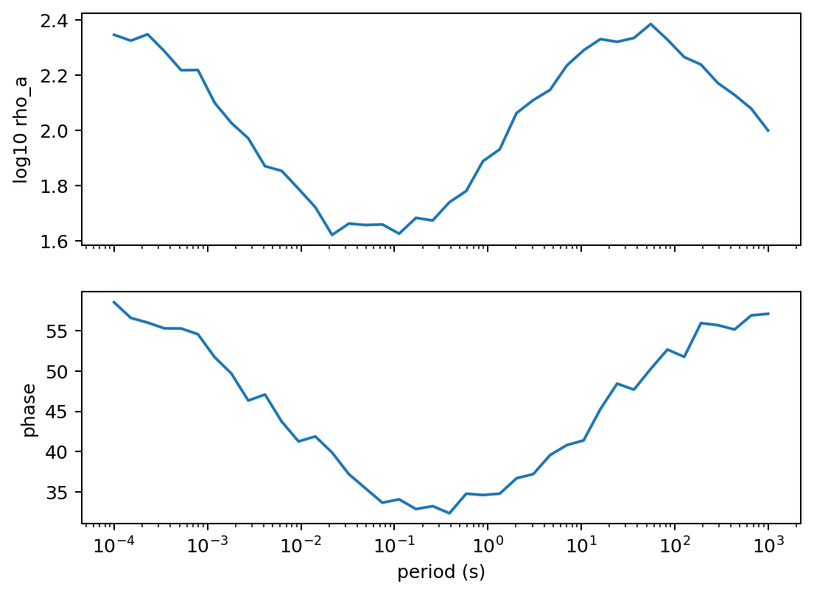

   Splitting the feature vector restores the physical axes and makes dataset QA
   easier to compare with ordinary MT response plots.

Plotting Checklist
------------------

Use plots to check:

* simple halfspace responses are smooth;
* apparent resistivity and phase use the expected axes and units;
* conductive anomalies produce plausible low-resistivity response zones;
* station positions align with the model;
* padding cells are not dominating the displayed interpretation region;
* noisy synthetic samples still look like possible field data;
* TE/TM and tensor component labels are consistent;
* pseudo-section patterns move sensibly with frequency or period;
* dataset feature vectors match the model architecture expected by AI code.

Common Mistakes
---------------

``Interpreting pseudo-sections as geology``
   Pseudo-sections display response patterns. They are not inversion models.

``Forgetting that 2-D and 3-D response arrays are frequency-first``
   Plotting functions use physical response arrays with shape
   ``(n_freqs, n_stations)``. Some machine-learning and inversion handoff
   arrays are station-first.

``Plotting padded cells as interpretation``
   Padding is numerical buffer. Use ``clip_core=True`` for interpretation and
   ``clip_core=False`` only for grid debugging.

``Comparing figures with different colour limits``
   Use common ``vmin`` and ``vmax`` when comparing models or responses.

``Skipping noisy-sample plots``
   Noise settings that look reasonable numerically can still produce unrealistic
   synthetic data.

Next Pages
----------

* :doc:`solvers_and_grids` explains the model and response containers used by
  the plotting functions.
* :doc:`synthetic_datasets` explains how generated datasets store features.
* :doc:`forward_to_inversion` explains how to use plots during synthetic
  recovery tests.
