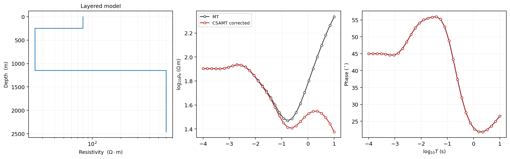
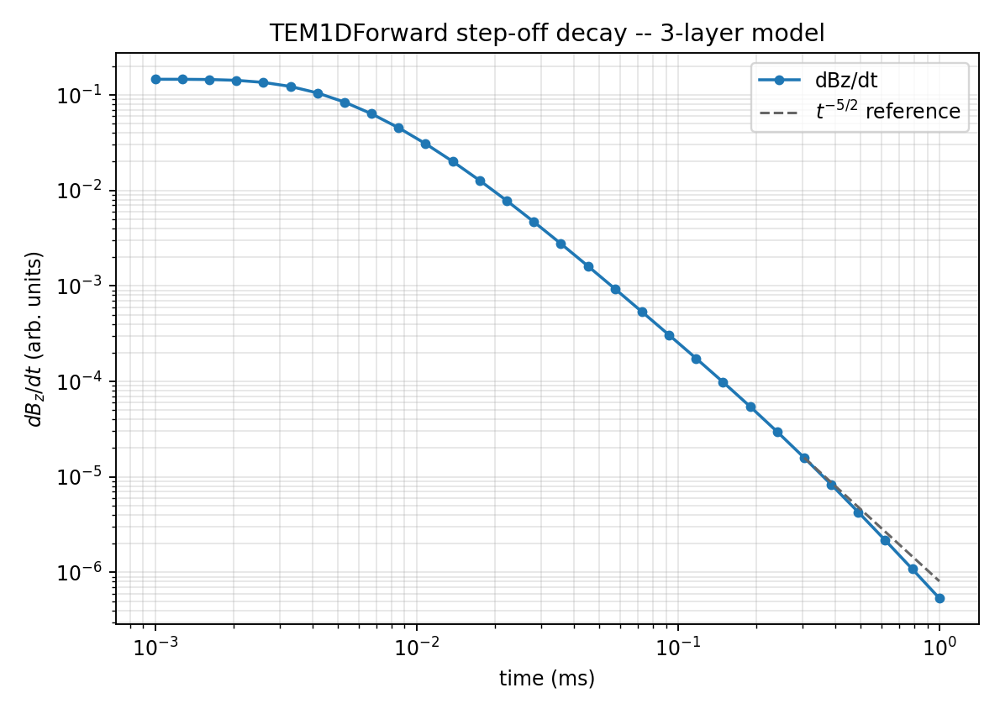
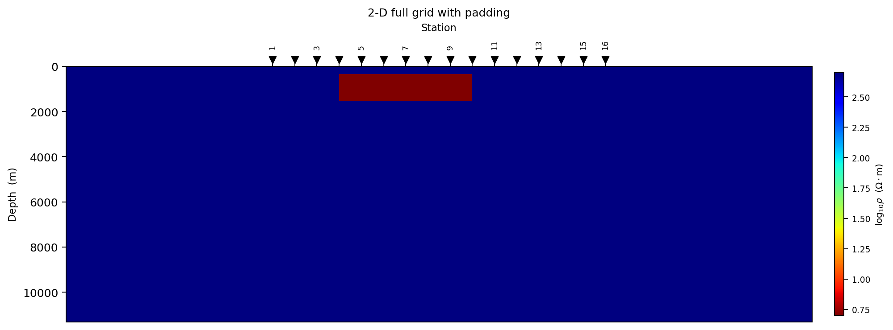
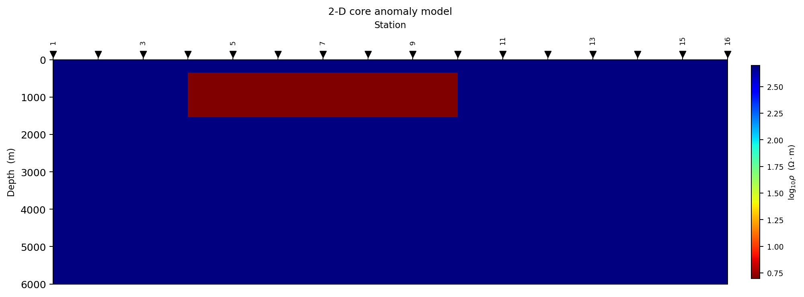
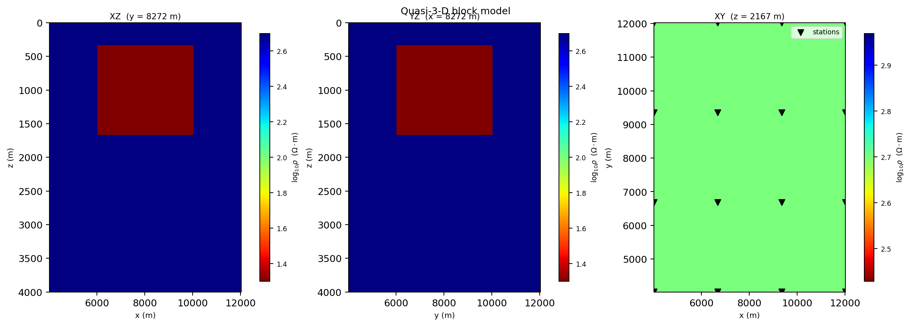
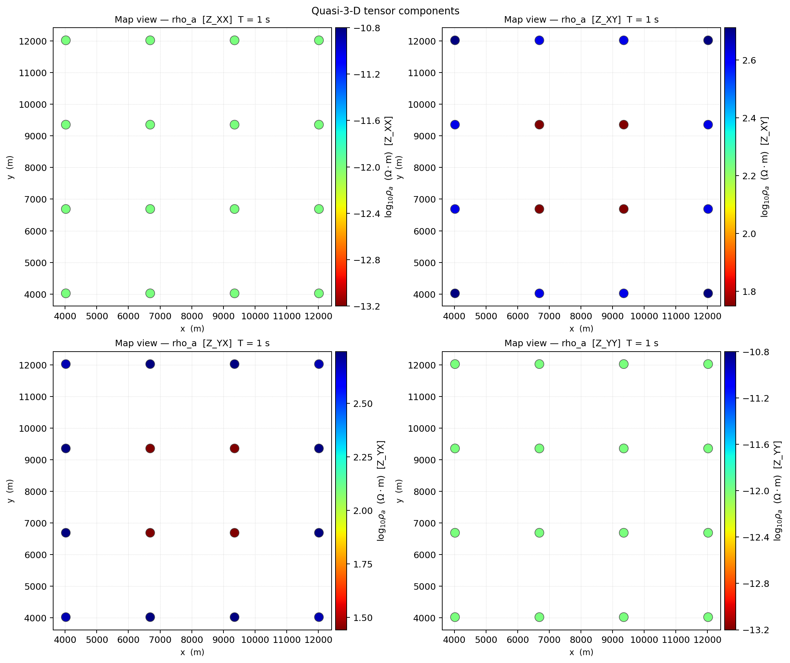

.. _forward_solvers_and_grids:

Solvers And Grids
=================

The forward package separates three responsibilities:

``model containers``
   Objects such as :class:`pycsamt.forward.LayeredModel`,
   :class:`pycsamt.forward.Grid2D`, and :class:`pycsamt.forward.Grid3D` store
   resistivity, geometry, station positions, and metadata.

``solvers``
   Objects such as :class:`pycsamt.forward.MT1DForward`,
   :class:`pycsamt.forward.TEM1DForward`, :class:`pycsamt.forward.MT2DForward`,
   and :class:`pycsamt.forward.MT3DForward` compute synthetic responses from
   the model containers.

``response containers``
   Objects such as :class:`pycsamt.forward.ForwardResponse`,
   :class:`pycsamt.forward.ForwardResponse2D`, and
   :class:`pycsamt.forward.ForwardResponse3D` hold the predicted fields,
   apparent resistivities, phases, time-domain decays, station coordinates, and
   feature-array helpers.

This separation matters because survey design, :term:`synthetic dataset`
generation, machine-learning workflows, and inversion handoff all need the same
response arrays but may use different :term:`model container`\ s and different
solver settings. The practical contract is:

.. math::
   :label: eq-solver-contract

   \mathbf{d} = F(\mathbf{m}; \mathbf{a}, \mathbf{s}),

where :math:`\mathbf{m}` is the earth model, :math:`\mathbf{a}` is the sampled
axis such as frequency or time, :math:`\mathbf{s}` is the survey geometry, and
:math:`\mathbf{d}` is the predicted :term:`forward response`. pyCSAMT keeps
these pieces separate so the same model can be plotted, solved, noised,
converted to features, or handed to an inversion workflow without quietly
changing the physical inputs.

Solver Map
----------

The currently documented forward solver families are:

.. list-table::
   :header-rows: 1
   :widths: 20 22 28 30

   * - Solver
     - Model container
     - Primary axis
     - Main outputs
   * - ``MT1DForward``
     - ``LayeredModel``
     - Frequencies in Hz
     - Impedance ``z``, apparent resistivity ``rho_a``, phase.
   * - ``CSAMT1DForward``
     - ``LayeredModel``
     - Frequencies in Hz
     - MT-like response with optional controlled-source correction.
   * - ``TEM1DForward``
     - ``LayeredModel``
     - Time gates in seconds
     - Step-off ``dBz_dt`` response and frequency-domain helper values.
   * - ``MT2DForward``
     - ``Grid2D``
     - Frequencies in Hz
     - TE/TM impedances, apparent resistivities, phases at profile stations.
   * - ``MT3DForward``
     - ``Grid3D``
     - Frequencies in Hz
     - Approximate tensor components on a station grid.

The forward solvers are deterministic for a fixed model, axis, and solver
configuration. :term:`Noise model`\ s are applied later, which keeps the
physical response and the observation model separate.

1-D Layered Models
------------------

:class:`pycsamt.forward.LayeredModel` represents a stack of horizontal layers.
The final resistivity is the :term:`halfspace`, so the ``thickness`` array has
one fewer entry than ``resistivity``. If there are :math:`L` layers, pyCSAMT
stores

.. math::
   :label: eq-layered-model-arrays

   \boldsymbol{\rho} = [\rho_0,\rho_1,\ldots,\rho_{L-1}],
   \qquad
   \mathbf{h} = [h_0,h_1,\ldots,h_{L-2}],

with top-of-layer depths

.. math::
   :label: eq-layer-depths

   z_0 = 0,\qquad z_j = \sum_{k=0}^{j-1}h_k.

The last layer :math:`\rho_{L-1}` extends downward indefinitely. This is why a
three-layer model has three resistivities but only two thicknesses.

.. code-block:: pycon
   :linenos:

   >>> import numpy as np

   >>> from pycsamt.forward import LayeredModel, MT1DForward

   >>> model = LayeredModel(
   ...     resistivity=[100.0, 10.0, 500.0],
   ...     thickness=[300.0, 800.0],
   ...     name="conductive_middle_layer",
   ... )

   >>> freqs = np.logspace(-3, 4, 40)
   >>> response = MT1DForward(freqs=freqs).run(model)

   >>> print(response.rho_a.shape)
   (40,)
   >>> print(response.phase.shape)
   (40,)
   >>> print(model.depth)
   [   0.  300. 1100.]
   >>> print(model.to_vector())
   [  2.        1.        2.69897 300.      800.     ]

Layered models are useful for:

* quick sanity checks against textbook MT behaviour;
* training small synthetic catalogues;
* building starting models for inversion;
* extending a 1-D model laterally into a simple 2-D grid;
* testing whether the chosen frequency or time range can sense the expected
  target depth.

The important depth scale for frequency-domain EM is the skin depth. A common
engineering estimate is:

.. math::
   :label: eq-skin-depth

   \delta \approx 503 \sqrt{\frac{\rho}{f}},

where :math:`\delta` is in metres, :math:`\rho` is resistivity in
:math:`\Omega\,m`, and :math:`f` is frequency in Hz. This is not a substitute
for a forward model, but it is a useful first check: high frequencies see
shallower structure, while low frequencies sample deeper structure.

1-D MT And CSAMT Solvers
------------------------

``MT1DForward`` computes a :term:`plane-wave field` natural-source response
using layered-earth impedance recursion. ``CSAMT1DForward`` uses the same
layered-earth base and can apply a :term:`controlled-source` correction when
source geometry is supplied.

For one angular frequency :math:`\omega = 2\pi f`, the implementation starts
from the bottom halfspace and recursively moves upward. In layer :math:`j`,

.. math::
   :label: eq-mt-layer-impedance

   k_j = \sqrt{\frac{i\omega\mu_0}{\rho_j}},
   \qquad
   Z^0_j = \frac{i\omega\mu_0}{k_j},

where :math:`k_j` is the complex propagation constant and :math:`Z^0_j` is the
intrinsic layer impedance. If :math:`Z_{j+1}` is the effective impedance below
layer :math:`j`, then the upward recursion used by the code is

.. math::
   :label: eq-mt-impedance-recursion

   Z_j = Z^0_j
   \frac{Z_{j+1} + Z^0_j\tanh(k_j h_j)}
        {Z^0_j + Z_{j+1}\tanh(k_j h_j)}.

At the surface, :math:`Z_0` becomes the predicted impedance. Apparent
resistivity and phase are then derived consistently as

.. math::
   :label: eq-rho-a-phase-1d

   \rho_a(f) = \frac{|Z_0(f)|^2}{\omega\mu_0},
   \qquad
   \phi(f) = \arg Z_0(f).

When ``CSAMT1DForward`` receives ``source_offset``, it applies a first-order
near-field factor based on the first-layer skin depth
:math:`\delta=\sqrt{2\rho_0/(\omega\mu_0)}`:

.. math::
   :label: eq-csamt-near-field

   g_\mathrm{nf}(f) =
   \frac{1}{1 + (r/\delta)^{-2}},
   \qquad
   \rho_{a,\mathrm{csamt}} = g_\mathrm{nf}\rho_{a,\mathrm{mt}}.

As :math:`r/\delta` becomes large, the correction approaches one and the CSAMT
response approaches the MT plane-wave response.

.. code-block:: pycon
   :linenos:

   >>> import numpy as np

   >>> from pycsamt.forward import CSAMT1DForward, LayeredModel, MT1DForward

   >>> model = LayeredModel(
   ...     resistivity=[80.0, 25.0, 600.0],
   ...     thickness=[250.0, 900.0],
   ... )

   >>> freqs = np.logspace(-1, 4, 32)

   >>> mt_response = MT1DForward(freqs=freqs).run(model)

   >>> csamt_response = CSAMT1DForward(
   ...     freqs=freqs,
   ...     source_offset=5000.0,
   ...     dipole_length=1000.0,
   ... ).run(model)

   >>> mt_features = mt_response.to_array(log_rho=True, include_phase=True)
   >>> csamt_features = csamt_response.to_array(log_rho=True, include_phase=True)

   >>> print(mt_response.z.shape, mt_response.rho_a.shape, mt_response.phase.shape)
   (32,) (32,) (32,)
   >>> print(mt_features.shape)
   (64,)
   >>> print(csamt_features.shape)
   (64,)
   >>> print(csamt_response.rho_a[0] / mt_response.rho_a[0])
   0.1098213847369481
   >>> print(csamt_response.rho_a[-1] / mt_response.rho_a[-1])
   0.9999189496227823

   The CSAMT correction is strongest where :math:`r/\delta` is small. At
   frequencies where the source is effectively far field, the corrected CSAMT
   curve returns to the MT-like response.

For MT and CSAMT 1-D responses:

* ``response.freqs`` has shape ``(n_freqs,)``;
* ``response.z`` has shape ``(n_freqs,)`` and is complex;
* ``response.rho_a`` has shape ``(n_freqs,)``;
* ``response.phase`` has shape ``(n_freqs,)`` in degrees;
* ``response.to_array()`` returns a one-dimensional feature vector.

When the model is one-dimensional, every surface station would see the same
response. Use 2-D or 3-D grids when lateral geometry is part of the experiment.

1-D TDEM Solver
---------------

``TEM1DForward`` computes a central-loop step-off response for a
:term:`layered earth`. It uses :term:`time gate`\ s rather than frequencies as
the primary output axis, but the underlying physics is still built
frequency-first: for horizontal wavenumber :math:`\lambda`, the TE admittance
recursion uses

.. math::
   :label: eq-tem-te-admittance

   \nu_j^2 = \lambda^2 + i\omega\mu_0\sigma_j,
   \qquad
   Y^0_j = \frac{\nu_j}{i\omega\mu_0},

then integrates the reflected field with a Hankel-type kernel involving
:math:`J_1(\lambda a)`, where :math:`a` is the loop radius. The step-off decay
is obtained with a cosine transform:

.. math::
   :label: eq-tem-cosine-transform

   \frac{dB_z}{dt}(t) \approx
   \frac{2}{\pi}\int_0^\infty
   \omega\,\Im\{H_z(\omega)\}\cos(\omega t)\,d\omega.

pyCSAMT delegates that Hankel-then-Fourier evaluation to :mod:`empymod`'s
digital linear filters (Werthmüller, 2017) rather than a hand-rolled
quadrature -- an earlier from-scratch attempt at this exact integral did not
converge reliably at realistic time ranges (its own frequency-domain kernel
grew with frequency instead of decaying), which is a large part of why
validated, peer-reviewed EM-transform libraries are worth depending on rather
than re-deriving. The loop itself is represented internally as a small
tangential electric-dipole segment at the loop radius, scaled by the loop's
circumference -- exact by the axisymmetry of a horizontal circular loop, and
the same construction :mod:`empymod`'s own gallery uses to reproduce Ward &
Hohmann (1988)'s central-loop figures. TEM examples are still usually a
little slower than MT1D ones simply because a full digital-filter transform
does more work per time gate than a closed-form impedance recursion.

.. code-block:: pycon
   :linenos:

   >>> import numpy as np

   >>> from pycsamt.forward import LayeredModel, TEM1DForward

   >>> model = LayeredModel(
   ...     resistivity=[60.0, 250.0, 900.0],
   ...     thickness=[120.0, 700.0],
   ... )

   >>> times = np.logspace(-6, -3, 30)

   >>> response = TEM1DForward(times=times, loop_radius=50.0).run(model)

   >>> print(response.times.shape)
   (30,)
   >>> print(response.dBz_dt.shape)
   (30,)
   >>> print(response.to_array().shape)
   (30,)
   >>> print(np.all(response.dBz_dt > 0))
   True

For TDEM responses:

* ``response.times`` has shape ``(n_times,)``;
* ``response.dBz_dt`` has shape ``(n_times,)``;
* ``response.to_array()`` returns a log-scaled decay feature vector by default.

A clean step-off response should stay single-signed and decay smoothly across
the whole gate range -- a real, physical sanity check worth plotting rather
than only checking shapes:

.. code-block:: pycon
   :linenos:

   >>> import matplotlib.pyplot as plt

   >>> fig, ax = plt.subplots(figsize=(7, 5))
   >>> _ = ax.loglog(times * 1e3, response.dBz_dt, "o-", ms=4, color="#1f77b4", label="dBz/dt")

   >>> t_ref = times[-6:]
   >>> ref = response.dBz_dt[-6] * (t_ref / times[-6]) ** (-2.5)
   >>> _ = ax.loglog(t_ref * 1e3, ref, "--", color="0.4", lw=1.3, label=r"$t^{-5/2}$ reference")

   >>> _ = ax.set_xlabel("time (ms)")
   >>> _ = ax.set_ylabel(r"$dB_z/dt$ (arb. units)")
   >>> _ = ax.set_title("TEM1DForward step-off decay -- 3-layer model")
   >>> _ = ax.legend()
   >>> _ = ax.grid(True, which="both", alpha=0.3)

   The dashed line is the classic conductive-halfspace late-time asymptote
   :math:`dB_z/dt \propto t^{-5/2}` (Nabighian, 1979), anchored to the curve's
   last point for comparison, not fitted to it.

The curve's own late-time slope (a least-squares fit through the last third of
the gates, in log-log space) comes out to about :math:`-2.70` -- close to but
steeper than the ideal halfspace value of :math:`-2.5`, because the deep,
resistive third layer (900 Ω·m below 820 m) is still shaping the decay rather
than the response having settled into the true asymptotic regime. Early
gates, by contrast, have a much shallower slope (about :math:`-0.30` over the
first eight points): the induced-current "smoke ring" has barely started
diffusing outward and downward, so the field is still dominated by the near
loop geometry rather than the earth's conductivity structure. Use early gates
to test shallow sensitivity and later gates to test deeper sensitivity; if
the time range is too narrow, the inversion may fit the decay curve but
remain insensitive to the target interval.

2-D Profile Grid Concepts
-------------------------

:class:`pycsamt.forward.Grid2D` stores a :term:`finite-difference grid` for a
profile. It contains:

* horizontal cell widths ``dx``;
* vertical cell heights ``dz``;
* cell resistivity matrix ``resistivity`` with shape ``(nz, nx)``;
* surface station x-positions ``x_stations``;
* padding count ``n_pad``;
* node and cell-centre coordinate helpers.

The grid uses depth-positive ``z`` coordinates. Resistivity is stored
top-to-bottom and left-to-right. Stations must lie inside the grid extent. If
``n_pad`` is non-zero, the constructor arguments ``nx`` and ``nz`` describe the
core model; the stored arrays are larger because :term:`padding cells` are
added on the left, right, and bottom. Thus a core grid with
:math:`n_x^\mathrm{core}` columns, :math:`n_z^\mathrm{core}` rows, and
:math:`p` padding cells is stored approximately as

.. math::
   :label: eq-grid2d-padding

   n_x = n_x^\mathrm{core} + 2p,\qquad
   n_z = n_z^\mathrm{core} + p.

The exact physical width also grows because padded cell sizes are expanded by
``pad_factor``.

The core region is the scientific model of interest. Padding cells are added on
the left, right, and bottom to reduce boundary influence. The ``n_pad`` value
records how many padding cells were added so plotting and interpretation tools
can distinguish core cells from numerical buffer cells.

.. code-block:: pycon
   :linenos:

   >>> import numpy as np

   >>> from pycsamt.forward import Grid2D

   >>> grid = Grid2D.halfspace(
   ...     rho=100.0,
   ...     nx=40,
   ...     nz=28,
   ...     x_max=8000.0,
   ...     z_max=5000.0,
   ...     n_pad=8,
   ...     pad_factor=1.3,
   ...     n_stations=12,
   ... )

   >>> print(grid.resistivity.shape)
   (36, 56)
   >>> print(np.round(grid.x_stations, 1))
   [ 6203.   6930.3  7657.5  8384.8  9112.1  9839.4 10566.6 11293.9 12021.2
    12748.5 13475.7 14203. ]
   >>> print(grid.x_nodes[0], grid.x_nodes[-1])
   0.0 20405.999163999997
   >>> print(grid.core_resistivity.shape)
   (28, 40)

2-D Profile Grid Constructors
-----------------------------

Use the constructor that matches the experiment you want to run.

.. list-table::
   :header-rows: 1
   :widths: 25 35 40

   * - Constructor
     - Purpose
     - Typical use
   * - ``Grid2D.halfspace``
     - Uniform background model.
     - Baseline checks, boundary tests, and solver sanity checks.
   * - ``Grid2D.with_anomaly``
     - Background with one rectangular resistive or conductive block.
     - Target detectability, station-spacing tests, and pseudosection
       training examples.
   * - ``Grid2D.from_1d_layers``
     - Laterally extends a layered model across a profile.
     - Compare 1-D and 2-D solvers, or build a simple starting model.
   * - ``Grid2D.random``
     - Randomized 2-D resistivity model.
     - Synthetic catalogues and stress tests.

A compact block-anomaly grid looks like this:

.. code-block:: pycon
   :linenos:

   >>> from pycsamt.forward import Grid2D, MT2DForward

   >>> grid = Grid2D.with_anomaly(
   ...     bg_rho=500.0,
   ...     anomaly_rho=5.0,
   ...     anomaly_bounds=(2000.0, 6000.0, 300.0, 1500.0),
   ...     nx=50,
   ...     nz=35,
   ...     x_max=10000.0,
   ...     z_max=6000.0,
   ...     n_pad=8,
   ...     n_stations=16,
   ... )

   >>> response = MT2DForward(
   ...     freqs=[1.0, 10.0, 100.0],
   ...     grid=grid,
   ...     verbose=False,
   ... ).run()

``anomaly_bounds`` are specified in core model coordinates as
``(x_lo, x_hi, z_lo, z_hi)``. The constructor internally accounts for padding
when placing the anomaly into the full numerical grid.

   The full numerical grid includes padding cells. This view is useful for
   debugging boundary influence, not for geological interpretation.

   The clipped core view shows the scientific model: a conductive block inside a
   resistive background, sampled by surface stations.

2-D MT Solver
-------------

``MT2DForward`` solves the 2-D MT finite-difference problem for
:term:`TE mode` and :term:`TM mode`. It returns a
:class:`pycsamt.forward.ForwardResponse2D`.

The code solves scalar frequency-domain problems on the grid nodes. For a
conductivity field :math:`\sigma(x,z)=1/\rho(x,z)`, the TE unknown is
:math:`E_y`; the TM unknown is :math:`H_y`. In compact continuous notation the
operators can be read as

.. math::
   :label: eq-2d-te-pde

   \nabla^2 E_y - i\omega\mu_0\sigma E_y = 0,

and

.. math::
   :label: eq-2d-tm-pde

   \nabla\cdot\left(\rho\,\nabla H_y\right)
   - i\omega\mu_0 H_y = 0.

The implementation discretises these equations with finite differences,
enforces boundary values from 1-D edge-column responses, solves the sparse
linear systems, then estimates surface impedance at the stations. The response
conversion is the same impedance-to-observable relation used in 1-D:
:math:`\rho_a=|Z|^2/(\omega\mu_0)` and :math:`\phi=\arg Z`.

.. code-block:: pycon
   :linenos:

   >>> station_0 = response.station_response(0)

   >>> features_te = response.to_feature_array(
   ...     mode="te",
   ...     log_rho=True,
   ...     include_phase=True,
   ... )

   >>> features_both = response.to_feature_array(
   ...     mode="both",
   ...     log_rho=True,
   ...     include_phase=True,
   ... )

   >>> print(response.rho_a_te.shape)
   (3, 16)
   >>> print(response.phase_te.shape)
   (3, 16)
   >>> print(features_te.shape)
   (16, 6)
   >>> print(features_both.shape)
   (16, 12)
   >>> print(np.round(station_0["rho_a_te"], 2))
   [156.17 424.41 607.92]
   >>> print(np.round(station_0["phase_te"], 2))
   [47.38 59.66 50.  ]

.. figure:: ../../images/user_guide/forward/solvers_2d_te_pseudosection.png
   :alt: TE apparent-resistivity pseudo-section from a 2-D anomaly response.
   :align: center
   :width: 85%

   The pseudo-section is frequency-response geometry, not geology. It shows how
   the anomaly perturbs apparent resistivity across stations and periods.

Response array shapes are always frequency first:

.. list-table::
   :header-rows: 1
   :widths: 30 35 35

   * - Attribute
     - Shape
     - Meaning
   * - ``response.freqs``
     - ``(n_freqs,)``
     - Frequency axis in Hz.
   * - ``response.stations_x``
     - ``(n_stations,)``
     - Surface station positions.
   * - ``response.zxy``
     - ``(n_freqs, n_stations)``
     - TE impedance component.
   * - ``response.zyx``
     - ``(n_freqs, n_stations)``
     - TM impedance component.
   * - ``response.rho_a_te``
     - ``(n_freqs, n_stations)``
     - TE apparent resistivity.
   * - ``response.phase_te``
     - ``(n_freqs, n_stations)``
     - TE phase in degrees.
   * - ``response.rho_a_tm``
     - ``(n_freqs, n_stations)``
     - TM apparent resistivity.
   * - ``response.phase_tm``
     - ``(n_freqs, n_stations)``
     - TM phase in degrees.
   * - ``response.to_feature_array()``
     - ``(n_stations, n_features)``
     - Station-first feature matrix for ML or downstream processing.

This difference is deliberate: physical response arrays are frequency-first,
while feature matrices are station-first because each row is one training or
analysis sample.

When passing a 2-D forward response to the inversion profile API, transpose the
selected response arrays:

.. code-block:: pycon
   :linenos:

   >>> inversion_data = {
   ...     "freqs": response.freqs,
   ...     "rho_a": response.rho_a_te.T,
   ...     "phase": response.phase_te.T,
   ...     "station_x": response.stations_x,
   ... }
   >>> print(inversion_data["rho_a"].shape)
   (16, 3)

3-D Volume Grid Concepts
------------------------

:class:`pycsamt.forward.Grid3D` stores a 3-D resistivity volume and a 2-D
:term:`station layout`. It contains:

* cell widths ``dx``, ``dy``, and ``dz``;
* resistivity with shape ``(nz, ny, nx)``;
* station coordinates ``stations_xy`` with shape ``(n_stations, 2)``;
* padding in x, y, and z;
* helpers that extract XZ and YZ slices for the quasi-3-D solver.

.. code-block:: pycon
   :linenos:

   >>> from pycsamt.forward import Grid3D

   >>> grid = Grid3D.halfspace(
   ...     rho=100.0,
   ...     nx=20,
   ...     ny=20,
   ...     nz=15,
   ...     x_max=8000.0,
   ...     y_max=8000.0,
   ...     z_max=4000.0,
   ...     n_pad=6,
   ...     nx_stations=5,
   ...     ny_stations=5,
   ... )

   >>> print(grid.resistivity.shape)
   (21, 32, 32)
   >>> print(grid.stations_xy.shape)
   (25, 2)

The regular station grid is created over the core model and shifted into the
padded numerical coordinate system. As in 2-D, stations must lie inside the full
grid extent. The stored resistivity array follows ``(nz, ny, nx)`` order, so
depth is the first axis even though map coordinates are usually discussed as
``x`` and ``y`` first.

3-D Volume Grid Constructors
----------------------------

The main constructors are:

.. list-table::
   :header-rows: 1
   :widths: 25 35 40

   * - Constructor
     - Purpose
     - Typical use
   * - ``Grid3D.halfspace``
     - Uniform 3-D background.
     - Baseline tensor and station-grid checks.
   * - ``Grid3D.block_anomaly``
     - Background with one 3-D rectangular block.
     - Survey design and quasi-3-D anomaly tests.
   * - ``Grid3D.random_layered``
     - Random laterally variable model.
     - Synthetic training data and robustness tests.

.. code-block:: pycon
   :linenos:

   >>> from pycsamt.forward import Grid3D, MT3DForward

   >>> grid = Grid3D.block_anomaly(
   ...     bg_rho=500.0,
   ...     anomaly_rho=20.0,
   ...     bounds=(2000.0, 6000.0, 2000.0, 6000.0, 300.0, 1500.0),
   ...     nx=20,
   ...     ny=20,
   ...     nz=15,
   ...     x_max=8000.0,
   ...     y_max=8000.0,
   ...     z_max=4000.0,
   ...     n_pad=6,
   ...     nx_stations=5,
   ...     ny_stations=5,
   ... )

   >>> response = MT3DForward(
   ...     freqs=[1.0, 10.0, 100.0],
   ...     grid=grid,
   ...     verbose=False,
   ... ).run()

   The 3-D grid is inspected through XZ, YZ, and XY slices. This is the fastest
   way to check whether anomaly bounds, depth range, and station coverage agree.

Quasi-3-D Solver
----------------

``MT3DForward`` is a quasi-3-D MT solver. It does not claim to replace a full
production 3-D modelling engine. Instead, it approximates tensor responses by
extracting orthogonal 2-D slices from the 3-D grid and running ``MT2DForward``
on those slices.

Conceptually:

* XZ slices are grouped by station y-row;
* YZ slices are grouped by station x-column;
* TE and TM responses from both slice families are combined;
* off-diagonal tensor components ``Z_xy`` and ``Z_yx`` carry the main response;
* diagonal components ``Z_xx`` and ``Z_yy`` are represented as approximate
  tensor outputs and should be interpreted carefully.

The assembly can be read as a survey-design approximation. For station
:math:`s=(x_s,y_s)`, the XZ slice through :math:`y_s` gives one estimate of
the profile response along :math:`x`; the YZ slice through :math:`x_s` gives
another estimate along :math:`y`. pyCSAMT stores the resulting tensor-like
components as

.. math::
   :label: eq-quasi3d-tensor

   \mathbf{Z}_s(f) =
   \begin{bmatrix}
      Z_{xx,s}(f) & Z_{xy,s}(f) \\
      Z_{yx,s}(f) & Z_{yy,s}(f)
   \end{bmatrix},

then computes :math:`\rho_a` and :math:`\phi` component by component. The
off-diagonal terms usually carry the most stable MT-style information; the
diagonal terms are useful diagnostics but should not be over-interpreted as a
validated full-3-D solution.

The output is :class:`pycsamt.forward.ForwardResponse3D`.

.. code-block:: pycon
   :linenos:

   >>> features = response.to_feature_array(
   ...     components="xy_yx",
   ...     log_rho=True,
   ...     include_phase=True,
   ... )

   >>> all_components = response.to_feature_array(
   ...     components="all",
   ...     log_rho=True,
   ...     include_phase=False,
   ... )

   >>> print(response.rho_a_xy.shape)
   (3, 25)
   >>> print(response.phase_xy.shape)
   (3, 25)
   >>> print(response.stations_xy.shape)
   (25, 2)
   >>> print(features.shape)
   (25, 12)
   >>> print(all_components.shape)
   (25, 12)

   Tensor-component maps are best read comparatively: look for stable
   off-diagonal structure first, then treat diagonal panels as diagnostics of
   dimensionality and approximation limits.

As with the 2-D response, physical arrays are frequency-first:
``(n_freqs, n_stations)``. Feature arrays are station-first:
``(n_stations, n_features)``.

Grid Design Rules
-----------------

Forward results are only as useful as the grid that produced them. Before
trusting a response, check these points.

``Positive resistivity``
   Every model cell must have strictly positive resistivity. The grid
   constructors validate this, but it is still worth checking after manual
   edits.

``Station coverage``
   Stations must sit inside the grid. For profile experiments, station spacing
   should be small enough to sample the expected lateral anomaly signature.

``Padding``
   :term:`Padding cells` reduce boundary effects. Increase ``n_pad`` or
   ``pad_factor`` if the response changes noticeably when the model extent is
   increased.

``Near-surface resolution``
   Shallow cells should resolve high-frequency or early-time sensitivity. A
   very coarse top layer can hide near-surface targets or create numerical
   artefacts.

``Depth extent``
   The bottom of the grid should be deeper than the target and deeper than the
   main sensitivity range of the lowest frequencies or latest gates.

``Frequency or time range``
   Do not rely on the solver to compensate for missing physics in the survey
   design. If the chosen axis cannot see the target, the inversion will not
   recover it reliably.

``Dimensionality``
   Use 1-D models for layered checks, 2-D grids for profile structure, and
   quasi-3-D grids for survey design or synthetic AI catalogues. Move to
   :doc:`maxwell_overview`'s validated adapters when the result needs a
   checkable accuracy claim, and further to native external backends
   through :doc:`/user_guide/models/overview` when production 2-D or 3-D
   inversion files are required.

A useful numerical rule is to compare the target depth with the skin-depth
range implied by the frequency axis -- the same estimate from
:eq:`eq-skin-depth`, evaluated once at each end of the swept band:

.. math::
   :label: eq-skin-depth-range

   \delta_\mathrm{min} \approx 503\sqrt{\rho_\mathrm{ref}/f_\mathrm{max}},
   \qquad
   \delta_\mathrm{max} \approx 503\sqrt{\rho_\mathrm{ref}/f_\mathrm{min}}.

The grid bottom should usually extend beyond the deeper end of the sensitivity
range, while the near-surface cells should be fine enough for the shallow end.
This estimate is only a screening tool, but it catches many poor frequency-grid
and depth-extent choices before a solver run.

A compact grid-check helper can be useful in notebooks. Re-building the
earlier 2-D anomaly grid keeps this section runnable on its own, independent
of the 3-D grids built in between:

.. code-block:: pycon
   :linenos:

   >>> import numpy as np

   >>> from pycsamt.forward import Grid2D

   >>> grid2d = Grid2D.with_anomaly(
   ...     bg_rho=500.0,
   ...     anomaly_rho=5.0,
   ...     anomaly_bounds=(2000.0, 6000.0, 300.0, 1500.0),
   ...     nx=50,
   ...     nz=35,
   ...     x_max=10000.0,
   ...     z_max=6000.0,
   ...     n_pad=8,
   ...     n_stations=16,
   ... )

   >>> def describe_grid2d(grid):
   ...     print(f"cells: nz={grid.nz}, nx={grid.nx}")
   ...     print(f"stations: {grid.n_stations}")
   ...     print(f"x extent: {grid.x_nodes[0]:.1f} to {grid.x_nodes[-1]:.1f} m")
   ...     print(f"z extent: {grid.z_nodes[0]:.1f} to {grid.z_nodes[-1]:.1f} m")
   ...     print(f"rho range: {np.nanmin(grid.resistivity):.3g} to "
   ...           f"{np.nanmax(grid.resistivity):.3g} ohm m")
   ...     print(f"padding cells: {grid.n_pad}")
   ...

   >>> describe_grid2d(grid2d)
   cells: nz=43, nx=66
   stations: 16
   x extent: 0.0 to 22406.0 m
   z extent: 0.0 to 11316.9 m
   rho range: 5 to 500 ohm m
   padding cells: 8

Response Containers And Feature Arrays
--------------------------------------

:term:`Response container`\ s preserve the physical arrays and also expose
feature helpers for machine-learning and batch processing.

.. list-table::
   :header-rows: 1
   :widths: 26 34 40

   * - Response object
     - Physical shape
     - Feature shape
   * - ``ForwardResponse``
     - 1-D arrays over frequency or time.
     - ``(n_features,)``.
   * - ``ForwardResponse2D``
     - ``(n_freqs, n_stations)`` arrays.
     - ``(n_stations, n_features)``.
   * - ``ForwardResponse3D``
     - ``(n_freqs, n_stations)`` arrays.
     - ``(n_stations, n_features)``.

Use physical arrays when preparing inversion data, plotting scientific
responses, or checking units. Use feature arrays when training models, comparing
many station responses, or building tabular downstream datasets.

Debugging Solver Experiments
----------------------------

When a forward response looks wrong, debug in this order:

#. Run a halfspace model first. A halfspace should produce smooth, stable
   responses.
#. Reduce the number of frequencies and stations until the experiment is easy
   to inspect.
#. Plot the grid with stations visible and confirm that the target is where you
   think it is.
#. Check whether the anomaly is inside the sensitivity range of the selected
   frequencies or time gates.
#. Increase padding and model extent. If the response changes strongly, the
   original grid was too small.
#. Compare a 2-D halfspace result with a 1-D MT response for the same
   resistivity.
#. Check array orientation before passing data to inversion or ML routines.

Next Pages
----------

* :doc:`configuration` explains how configuration objects create grids and
  solvers.
* :doc:`synthetic_datasets` explains how to generate many forward responses.
* :doc:`plotting` shows how to inspect models and responses.
* :doc:`forward_to_inversion` explains how to pass synthetic responses to
  inversion workflows.
