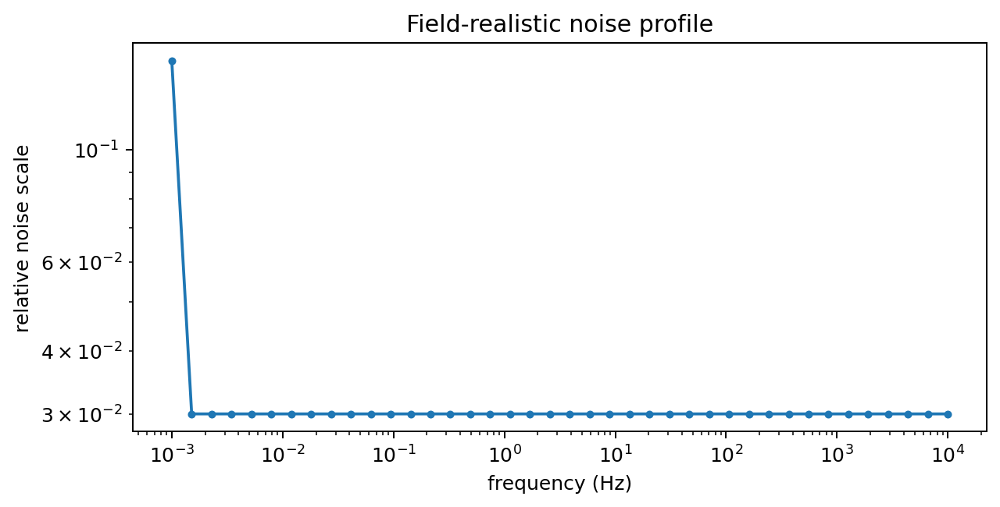
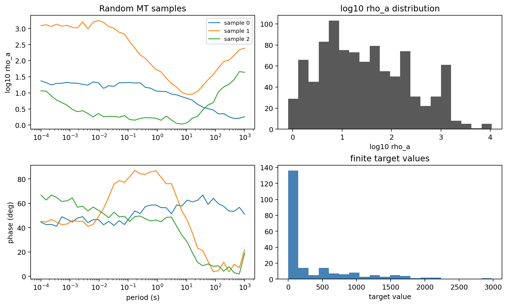

.. _forward_synthetic_datasets:

Synthetic Datasets And Noise
============================

:term:`Synthetic dataset`\ s are central to pyCSAMT v2. They are used for
AI-assisted inversion, regression tests, solver benchmarks, survey design
experiments, and documentation examples. A useful synthetic dataset is not just
a collection of curves. It is a reproducible experiment that records:

* the model family used to draw :term:`layered earth` models;
* the forward solver;
* the frequency or time axis;
* the :term:`feature vector` transform;
* the :term:`target vector` layout;
* the :term:`noise model`;
* the :term:`random seed`;
* the train, validation, and test :term:`dataset split`.

The forward package currently provides two main dataset containers:

.. list-table::
   :header-rows: 1
   :widths: 24 34 42

   * - Container
     - Shape
     - Main use
   * - ``ForwardDataset``
     - ``X`` is ``(n_samples, n_features)`` and ``y`` is
       ``(n_samples, n_params)``.
     - 1-D MT, CSAMT, and TDEM model-response pairs.
   * - ``SurveyDataset3D``
     - ``X`` is ``(n_surveys, n_stations, n_features)`` and ``y`` is
       ``(n_surveys, n_stations, n_params)``.
     - Pseudo-3-D multi-station datasets for spatial AI models.

The dataset generators are intentionally separate from the interactive forward
solvers. Use individual solver objects when you need to inspect one model in
detail. Use dataset generators when you need many reproducible samples. In
mathematical terms, a 1-D generator repeatedly draws model parameters
:math:`\mathbf{m}_k` from a configured prior, evaluates a forward operator
:math:`\mathbf{d}_k = F(\mathbf{m}_k)`, applies an optional noise operator
:math:`\tilde{\mathbf{d}}_k = N(\mathbf{d}_k)`, and stores transformed pairs
:math:`(\mathbf{x}_k,\mathbf{y}_k)` for learning or benchmarking.

1-D Dataset Generation
----------------------

Use :func:`pycsamt.forward.generate_dataset` to create batches of independent
1-D forward responses. It supports ``solver="mt1d"``, ``solver="csamt1d"``,
and ``solver="tem1d"``.

.. code-block:: python
   :linenos:

   import numpy as np

   from pycsamt.forward import generate_dataset

   dataset = generate_dataset(
       solver="mt1d",
       n_samples=1000,
       freqs=np.logspace(-3, 4, 40),
       n_layers=(3, 7),
       rho_range=(1.0, 10000.0),
       depth_max=3000.0,
       noise_level=0.05,
       noise_type="field",
       include_phase=True,
       seed=42,
       n_jobs=1,
       output="runs/forward/mt1d_dataset.npz",
   )

   print(dataset)
   print(dataset.X.shape)
   print(dataset.y.shape)

Captured with a smaller ``n_samples`` value, the same recipe produces:

.. code-block:: pycon

   >>> print(dataset)
   ForwardDataset(n=12, n_features=80, n_params=13, solver='mt1d')
   >>> print(dataset.X.shape)
   (12, 80)
   >>> print(dataset.y.shape)
   (12, 13)
   >>> print(dataset.freqs.shape)
   (40,)
   >>> print(np.unique(dataset.meta["n_layers"]))
   [3 4 5 6 7]

Each sample is generated by:

#. drawing a :class:`pycsamt.forward.LayeredModel`;
#. running the selected 1-D solver;
#. optionally applying noise;
#. converting the response into a :term:`feature vector`;
#. converting the model into a :term:`target vector`.

The generated dataset is a :class:`pycsamt.forward.ForwardDataset`.

ForwardDataset Contract
-----------------------

``ForwardDataset`` stores the data needed for 1-D AI training or numerical
experiments.

.. list-table::
   :header-rows: 1
   :widths: 24 34 42

   * - Attribute
     - Shape
     - Meaning
   * - ``X``
     - ``(n_samples, n_features)``
     - Feature vectors generated from synthetic responses.
   * - ``y``
     - ``(n_samples, n_params)``
     - Target model vectors. Shorter models are padded with ``NaN``.
   * - ``freqs``
     - ``(n_freqs,)`` or ``None``
     - Frequency axis for MT and CSAMT datasets.
   * - ``times``
     - ``(n_times,)`` or ``None``
     - Time gates for TDEM datasets.
   * - ``meta``
     - structured array or ``None``
     - Per-sample metadata, currently including layer count and noise level.
   * - ``solver``
     - string
     - Solver name used to generate the dataset.

For :term:`MT` and :term:`CSAMT`, the default :term:`feature vector` contains
log-scaled :term:`apparent resistivity` and :term:`phase`:

.. code-block:: text
   :linenos:

   [log10(rho_a(f_0)), ..., log10(rho_a(f_n)),
    phase(f_0), ..., phase(f_n)]

When ``include_phase=False``, only ``log10(rho_a)`` is used.

For :term:`TDEM`, the feature vector contains log-scaled transient decay
values:

.. code-block:: text
   :linenos:

   [log10(abs(dBz_dt(t_0))), ..., log10(abs(dBz_dt(t_n)))]

The :term:`target vector` is produced from the :term:`layered earth` model:

.. code-block:: text
   :linenos:

   [log10(rho_0), log10(rho_1), ..., log10(rho_n),
    thickness_0, thickness_1, ..., thickness_n_minus_1]

When ``n_layers`` is a range, different samples can have different target
lengths. If a model has :math:`L` layers, its physical target length is
:math:`2L-1`: :math:`L` log-resistivities and :math:`L-1` finite layer
thicknesses. ``generate_dataset`` pads shorter targets with ``NaN`` so the
final ``y`` array is rectangular. Training code should mask these padded values
rather than treating them as physical targets.

Saving, Loading, And Splitting
------------------------------

Datasets can be saved as compressed ``.npz`` files. Passing ``output=...`` to
``generate_dataset`` saves the dataset automatically, or you can call
``dataset.save`` yourself.

.. code-block:: python
   :linenos:

   from pycsamt.forward import ForwardDataset

   dataset.save("runs/forward/mt1d_dataset.npz")

   loaded = ForwardDataset.load("runs/forward/mt1d_dataset.npz")

   train, val, test = loaded.split(
       val_frac=0.1,
       test_frac=0.1,
       seed=0,
   )

   print(len(train), len(val), len(test))

For the 12-sample example above, a fixed split seed gives:

.. code-block:: pycon

   >>> print(len(train), len(val), len(test))
   10 1 1

Always split with a fixed seed when reporting model performance. This keeps the
training, validation, and test partitions reproducible across machines.

Configuration-Driven Generation
-------------------------------

For repeatable studies, prefer a configuration file over a long script. The
:class:`pycsamt.forward.ForwardConfig` object records the same options accepted
by ``generate_dataset`` and can write annotated templates.

.. code-block:: python
   :linenos:

   from pycsamt.forward import ForwardConfig, generate_dataset

   ForwardConfig.write_template("runs/forward/mt1d_config.yml")

   cfg = ForwardConfig.from_file("runs/forward/mt1d_config.yml")
   dataset = generate_dataset(**cfg.to_dataset_kwargs())

This pattern makes it easier to archive the exact generation recipe alongside
the resulting ``.npz`` file.

TDEM Datasets
-------------

:term:`TDEM` datasets use :term:`time gate`\ s and ``solver="tem1d"``. The
target layout remains the same layered-earth vector, but ``dataset.times`` is
populated instead of ``dataset.freqs``.

.. code-block:: python
   :linenos:

   import numpy as np

   from pycsamt.forward import generate_dataset

   tdem_dataset = generate_dataset(
       solver="tem1d",
       n_samples=250,
       times=np.logspace(-6, -3, 25),
       n_layers=4,
       rho_range=(5.0, 3000.0),
       depth_max=1500.0,
       loop_radius=40.0,
       noise_level=0.03,
       noise_type="gaussian",
       seed=11,
       n_jobs=1,
       verbose=True,
   )

   print(tdem_dataset.times.shape)
   print(tdem_dataset.X.shape)

Captured with ``n_samples=8``:

.. code-block:: pycon

   >>> print(tdem_dataset.times.shape)
   (25,)
   >>> print(tdem_dataset.X.shape)
   (8, 25)
   >>> print(tdem_dataset.y.shape)
   (8, 7)

TDEM generation can be slower than MT/CSAMT generation because the solver uses
numerical integration. Start with a small ``n_samples`` value when designing a
new TDEM dataset recipe.

Geological Priors
-----------------

Instead of drawing all layer resistivities from a broad uniform range, you can
ask ``generate_dataset`` to draw from a named :term:`geological prior`. The
underlying model generator uses
:meth:`pycsamt.forward.LayeredModel.from_geology`.

.. code-block:: python
   :linenos:

   from pycsamt.forward import generate_dataset

   geothermal = generate_dataset(
       solver="mt1d",
       n_samples=500,
       geology="geothermal",
       noise_level=0.04,
       noise_type="field",
       seed=5,
   )

With a small reproducibility check:

.. code-block:: pycon

   >>> print(geothermal)
   ForwardDataset(n=8, n_features=60, n_params=9, solver='mt1d')
   >>> print(geothermal.X.shape)
   (8, 60)
   >>> print(np.unique(geothermal.meta["n_layers"]))
   [3 4 5]

Named priors are useful when the AI model should learn a specific geological
setting rather than an overly broad synthetic universe. Keep a broad test set
when possible, because overly narrow priors can make a model look better than it
really is.

Noise Models
------------

:term:`Noise model`\ s make synthetic data more realistic and prevent AI models
from learning only idealized solver curves. pyCSAMT keeps noise separate from
the forward solver: first compute a clean physical response, then perturb it.
If :math:`\mathbf{d}` is the clean response and :math:`\epsilon` is a random
draw controlled by the seed, Gaussian-style noise can be read as
:math:`\tilde{\mathbf{d}}=\mathbf{d}+\sigma\epsilon` in transformed response
space, while multiplicative noise perturbs values by a relative factor. The
important reproducibility point is that the noise level, model type, and seed
belong with the dataset, not only with the script that created it.

.. list-table::
   :header-rows: 1
   :widths: 28 34 38

   * - Noise model
     - How it behaves
     - Good use
   * - ``GaussianNoise``
     - Adds random perturbations in log-response space. For MT/CSAMT it
       perturbs ``log10(rho_a)`` and phase.
     - Baseline training, regression tests, quick robustness checks.
   * - ``MultiplicativeNoise``
     - Applies log-normal style perturbations, useful for values spanning many
       orders of magnitude.
     - Dynamic-range heavy data such as TDEM decays.
   * - ``FieldRealisticNoise``
     - Uses frequency-dependent noise with power-line harmonics and optional
       MT dead-band inflation.
     - MT/CSAMT training datasets intended to resemble field behaviour.

You can use named noise models through ``generate_dataset``:

.. code-block:: python
   :linenos:

   dataset = generate_dataset(
       solver="mt1d",
       n_samples=1000,
       noise_level=0.05,
       noise_type="field",
       seed=42,
   )

Or apply noise directly to a single response:

.. code-block:: python
   :linenos:

   import numpy as np

   from pycsamt.forward import FieldRealisticNoise, LayeredModel, MT1DForward

   model = LayeredModel([100.0, 20.0, 800.0], [300.0, 1000.0])
   response = MT1DForward(np.logspace(-3, 4, 40)).run(model)

   noise = FieldRealisticNoise(
       base_level=0.03,
       powerline_freq=50.0,
       dead_band=True,
   )

   noisy_response = noise.apply(response, seed=42)
   profile = noise.noise_profile(response.freqs)

   A saved noise-profile plot makes the perturbation recipe auditable. In this
   example the low-frequency edge is inflated relative to the base noise level.

``FieldRealisticNoise`` requires a frequency-domain response. Use Gaussian or
multiplicative noise for TDEM responses.

Clean And Noisy Dataset Pairs
-----------------------------

For benchmarking, it is often useful to generate one clean dataset and one noisy
dataset with the same model draw settings. Use different output paths and keep
the same seed.

.. code-block:: python
   :linenos:

   import numpy as np

   from pycsamt.forward import generate_dataset

   common = dict(
       solver="mt1d",
       n_samples=500,
       freqs=np.logspace(-3, 4, 30),
       n_layers=4,
       rho_range=(1.0, 10000.0),
       depth_max=2500.0,
       include_phase=True,
       seed=100,
       n_jobs=1,
   )

   clean = generate_dataset(
       **common,
       noise_level=0.0,
       output="runs/forward/clean_mt1d.npz",
   )

   noisy = generate_dataset(
       **common,
       noise_level=0.05,
       noise_type="gaussian",
       output="runs/forward/noisy_mt1d.npz",
   )

This does not guarantee identical sample ordering if implementation details
change in the future, but it is the intended reproducible pattern within the
current generator.

Pseudo-3-D Survey Datasets
--------------------------

:func:`pycsamt.forward.generate_dataset_3d` creates multi-station survey
datasets for graph-style or spatial AI models. It currently uses 1-D MT
responses at each station, but draws station models from a spatially correlated
Gaussian random field. This creates lateral structure in the target model while
keeping the forward computation lightweight.

.. code-block:: python
   :linenos:

   from pycsamt.forward import generate_dataset_3d

   surveys = generate_dataset_3d(
       solver="mt1d",
       n_surveys=500,
       n_stations=25,
       n_layers=4,
       extent=10000.0,
       corr_length=2000.0,
       noise_level=0.03,
       noise_type="gaussian",
       include_phase=True,
       seed=7,
       output="runs/forward/survey3d_dataset.npz",
   )

   print(surveys)
   print(surveys.X.shape)
   print(surveys.y.shape)
   print(surveys.coords.shape)

Captured with four small surveys and nine stations:

.. code-block:: pycon

   >>> print(surveys)
   SurveyDataset3D(n_surveys=4, n_stations=9, n_features=60, n_params=7, solver='mt1d')
   >>> print(surveys.X.shape)
   (4, 9, 60)
   >>> print(surveys.y.shape)
   (4, 9, 7)
   >>> print(surveys.coords.shape)
   (9, 2)

``SurveyDataset3D`` has this contract:

.. list-table::
   :header-rows: 1
   :widths: 24 34 42

   * - Attribute
     - Shape
     - Meaning
   * - ``X``
     - ``(n_surveys, n_stations, n_features)``
     - Per-station feature vectors.
   * - ``y``
     - ``(n_surveys, n_stations, n_params)``
     - Per-station layered model targets.
   * - ``coords``
     - ``(n_stations, 2)``
     - Fixed station coordinates shared by all surveys.
   * - ``freqs``
     - ``(n_freqs,)``
     - Frequency axis used by every station response.
   * - ``meta``
     - structured array
     - Per-survey correlation length and noise level.

All surveys share the same station layout. That is intentional: graph models
can build one adjacency matrix from ``surveys.coords`` and reuse it for all
survey realizations.

.. code-block:: python
   :linenos:

   from pycsamt.forward import SurveyDataset3D

   loaded = SurveyDataset3D.load("runs/forward/survey3d_dataset.npz")
   train, val, test = loaded.split(seed=0)

   print(train.X.shape)
   print(train.coords[:3])

With the same small survey dataset:

.. code-block:: pycon

   >>> print(train.X.shape)
   (4, 9, 60)
   >>> print(train.coords[:3])
   [[    0.     0.]
    [ 5000.     0.]
    [10000.     0.]]

The ``corr_length`` parameter controls lateral smoothness. Values shorter than
station spacing create rapidly varying station models. Values much longer than
station spacing create smoother surveys.

2-D And Quasi-3-D Solver Datasets
---------------------------------

The high-level batch generator is focused on 1-D and pseudo-3-D AI datasets.
When you need full 2-D finite-difference or quasi-3-D response datasets, build
a small custom loop around :class:`pycsamt.forward.Grid2D`,
:class:`pycsamt.forward.MT2DForward`, :class:`pycsamt.forward.Grid3D`, or
:class:`pycsamt.forward.MT3DForward`.

.. code-block:: python
   :linenos:

   import numpy as np

   from pycsamt.forward import Grid2D, MT2DForward

   freqs = np.logspace(-1, 3, 12)
   samples = []

   for seed in range(10):
       grid = Grid2D.random(
           nx=40,
           nz=25,
           x_max=6000.0,
           z_max=3000.0,
           n_stations=12,
           seed=seed,
       )
       response = MT2DForward(freqs=freqs, grid=grid, verbose=False).run()
       samples.append(response.to_feature_array(mode="both"))

   X = np.stack(samples, axis=0)
   print(X.shape)

For three lightweight grid draws with eight stations:

.. code-block:: pycon

   >>> print(X.shape)
   (3, 8, 48)

This approach keeps large numerical experiments explicit. It also lets you
store exactly the grid, response, and metadata needed by the study.

Dataset QA
----------

Before using a synthetic dataset for training, reporting, or benchmarking,
perform basic quality assurance.

.. code-block:: python
   :linenos:

   import numpy as np

   def check_forward_dataset(dataset):
       print(dataset)
       print("X:", dataset.X.shape, dataset.X.dtype)
       print("y:", dataset.y.shape, dataset.y.dtype)
       print("finite X:", np.isfinite(dataset.X).all())
       print("target NaN count:", np.isnan(dataset.y).sum())
       if dataset.meta is not None:
           print("layer counts:", np.unique(dataset.meta["n_layers"]))
           print("noise levels:", np.unique(dataset.meta["noise_level"]))

   check_forward_dataset(dataset)

The check should be saved with the dataset archive. For the small MT1D example:

.. code-block:: pycon

   >>> check_forward_dataset(dataset)
   ForwardDataset(n=12, n_features=80, n_params=13, solver='mt1d')
   X: (12, 80) float32
   y: (12, 13) float32
   finite X: True
   target NaN count: 42
   layer counts: [3 4 5 6 7]
   noise levels: [0.05]

   A compact QA figure can show random response samples, feature distributions,
   and finite target values in one review artifact.

Checklist:

* plot random samples before training;
* confirm there are no ``NaN`` or infinite values in ``X``;
* confirm ``NaN`` values in ``y`` are only padding;
* verify the feature length expected by the model architecture;
* inspect clean and noisy examples side by side;
* keep frequency or time axes with the dataset;
* keep train, validation, and test splits deterministic;
* save the generation configuration and code version;
* record the noise model and random seed.

Recommended Archive Layout
--------------------------

A robust synthetic dataset directory should contain more than the ``.npz``
file.

.. code-block:: text
   :linenos:

   synthetic_mt1d_v001/
     config.yml
     dataset.npz
     split_seed.txt
     qa_summary.txt
     plots/
       random_samples.png
       feature_histograms.png
       noise_profile.png
     notes.md

For production AI experiments, treat this directory as an immutable artifact.
If you change the frequency grid, prior, noise model, target layout, or split
seed, create a new dataset version.

Common Mistakes
---------------

``Training on clean data only``
   Clean data is useful for debugging, but a model trained only on clean curves
   usually fails on field-like data.

``Ignoring padded target values``
   Variable-layer datasets contain ``NaN`` padding in ``y``. Loss functions must
   mask those values.

``Changing the frequency grid between train and test``
   The feature vector layout depends on the axis. A model trained on one
   frequency grid should not be evaluated on another without an explicit
   preprocessing strategy.

``Using field noise for TDEM``
   ``FieldRealisticNoise`` is frequency-domain. Use Gaussian or multiplicative
   noise for TDEM.

``Mixing station layouts in one graph dataset``
   ``SurveyDataset3D`` assumes a fixed station coordinate array so one adjacency
   matrix can be reused. Use separate datasets when layouts differ.

Next Pages
----------

* :doc:`solvers_and_grids` explains the model containers and solver outputs.
* :doc:`plotting` explains how to inspect generated samples.
* :doc:`forward_to_inversion` explains how to use synthetic responses in
  inversion recovery tests.
