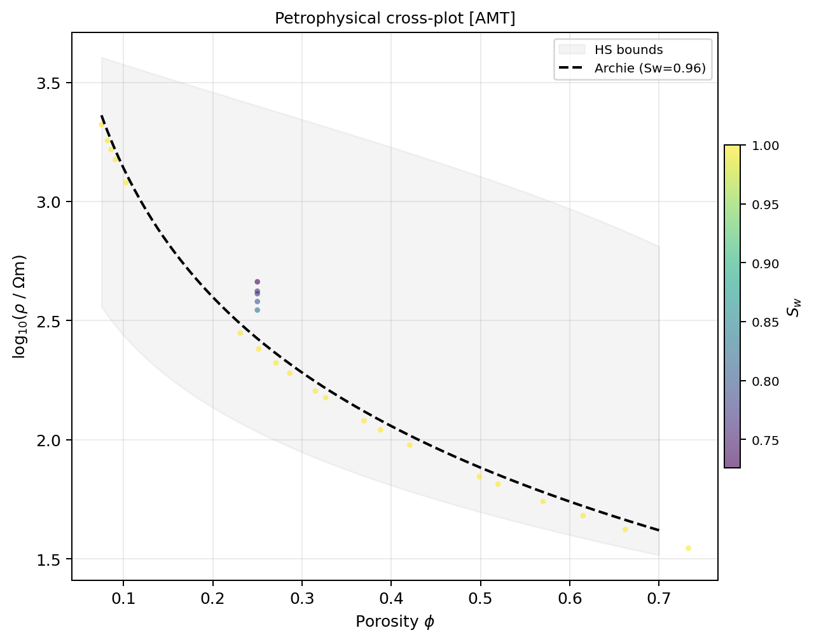
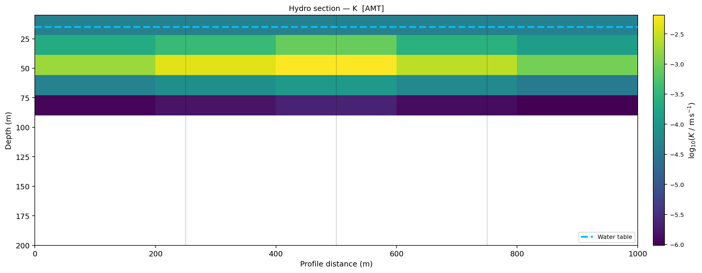
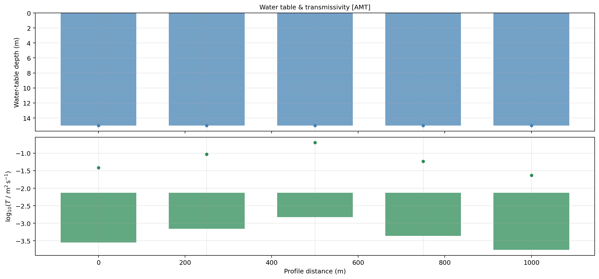
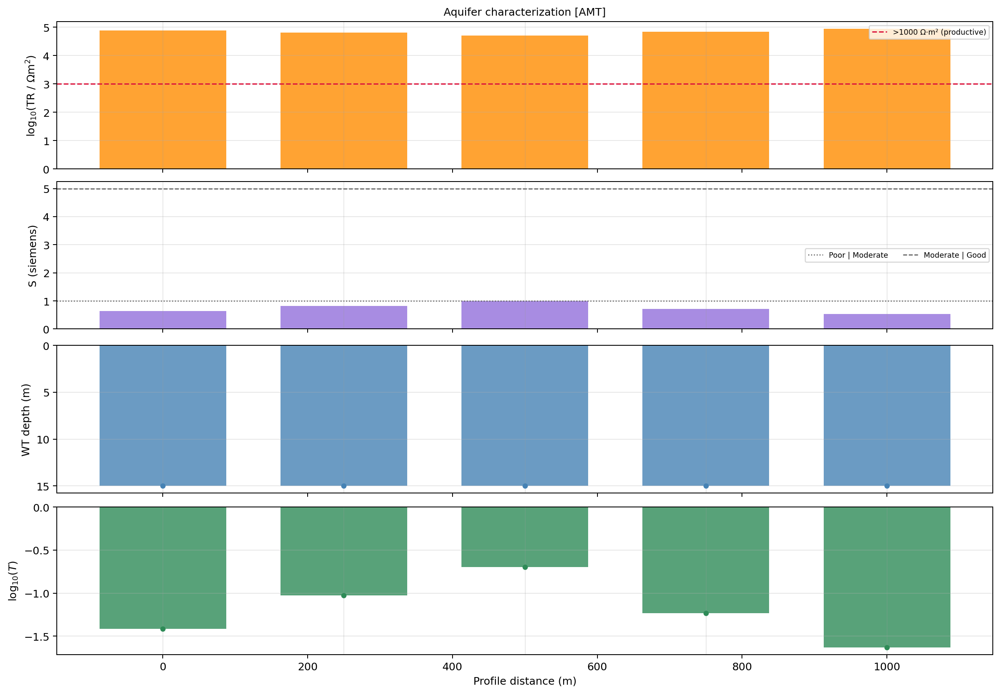

.. _interpretation_hydrogeophysics:

Hydrogeophysical interpretation
===============================

Hydrogeophysical interpretation connects an electromagnetic resistivity model
to hydrologically meaningful quantities such as water saturation, effective
porosity, hydraulic conductivity, water-table depth, transmissivity, and
storativity. In pyCSAMT, the principal deterministic entry point is
:class:`pycsamt.interp.EMHydroModel`.

This conversion is not direct observation. It is a petrophysical
interpretation conditioned by a constitutive model, pore-water resistivity,
porosity assumptions, grain-scale parameters, and the quality and resolution
of the source inversion. The same formation resistivity may result from
different combinations of lithology, porosity, saturation, salinity, clay
content, temperature, and connectivity.

.. admonition:: Scientific scope
   :class: important

   Use this workflow to build and test a hydrogeophysical hypothesis. Do not
   present its outputs as measured hydraulic properties unless they have been
   calibrated and validated against independent hydrogeological observations.

What the workflow produces
--------------------------

Given a two-dimensional :class:`pycsamt.interp.ResistivityModel`, the workflow
returns an :class:`pycsamt.interp.EMHydroResult` containing:

.. list-table::
   :header-rows: 1
   :widths: 26 22 52

   * - Output
     - Shape and unit
     - Interpretation
   * - ``porosity``
     - ``(n_z, n_x)``, fraction
     - Effective porosity inferred below the detected water table; the prior
       porosity is retained above it.
   * - ``saturation``
     - ``(n_z, n_x)``, fraction
     - Water saturation inferred above the water table; cells below it are
       assumed fully saturated.
   * - ``hydraulic_K``
     - ``(n_z, n_x)``, m/s
     - Hydraulic conductivity derived from porosity with Kozeny–Carman, or an
       optional fractured-zone relationship at depth.
   * - ``water_table``
     - ``(n_x,)``, m depth
     - First qualifying saturation transition in each model column; ``nan``
       indicates that detection failed.
   * - ``transmissivity``
     - ``(n_x,)``, m²/s
     - Depth integral of hydraulic conductivity over the inferred saturated
       interval represented by the model.
   * - ``storativity_confined``
     - ``(n_x,)``, fraction
     - Saturated thickness multiplied by configured specific storage.
   * - ``storativity_unconfined``
     - ``(n_x,)``, fraction
     - Mean inferred saturated-zone porosity, used as a specific-yield
       approximation.
   * - ``dar_zarrouk_TR``
     - ``(n_x,)``, Ω·m²
     - Transverse resistance, :math:`\sum \rho_i h_i`.
   * - ``dar_zarrouk_S``
     - ``(n_x,)``, S
     - Longitudinal conductance, :math:`\sum h_i/\rho_i`.
   * - ``tds``
     - scalar, mg/L
     - Empirical TDS indicator calculated from configured pore-water
       resistivity; it is not a spatially resolved water-quality measurement.

Recommended workflow
--------------------

#. formulate the hydrogeological question;
#. review and normalize the inversion model;
#. assemble independent water, borehole, grain-size, and hydraulic evidence;
#. select a defensible petrophysical relationship;
#. configure parameters with explicit units and sources;
#. run the deterministic model;
#. audit water-table detection and every derived property;
#. compare predictions with field constraints;
#. propagate parameter and scenario uncertainty;
#. export results together with provenance and limitations.

1. Formulate the question
-------------------------

Start with a decision or testable hypothesis. Examples include:

* where is a saturation transition consistent with measured water levels?
* which profile intervals may contain a conductive weathered aquifer?
* where does estimated transmissivity remain high across plausible parameter
  choices?
* can a low-resistivity anomaly be explained by water salinity rather than
  increased saturation?
* is fractured-basement behavior more consistent with observations than a
  porous-medium model?

Specify the target depth, spatial scale, required units, and acceptance
criteria. A regional MT model and a shallow piezometer do not necessarily
observe the same volume. Scale mismatch must be treated as part of the model,
not hidden after calculation.

2. Prepare the resistivity model
--------------------------------

Follow :doc:`workflow` to construct and audit a
:class:`~pycsamt.interp.ResistivityModel`. The hydrogeophysical code expects:

* horizontal and depth cell centers in metres;
* depth positive downward;
* a ``rho_2d`` array shaped ``(n_z, n_x)``;
* :math:`\log_{10}` resistivity in ohm metres;
* station offsets using the same profile origin as ``x_centers``.

At minimum, check:

.. code-block:: pycon

   >>> import numpy as np

   >>> assert resistivity_model.rho_2d.shape == (
   ...     resistivity_model.n_z, resistivity_model.n_x
   ... )
   >>> assert np.all(np.diff(resistivity_model.x_centers) > 0)
   >>> assert np.all(np.diff(resistivity_model.z_centers) > 0)

   >>> finite = np.isfinite(resistivity_model.rho_2d)
   >>> if not finite.any():
   ...     raise ValueError("No finite resistivity cells are available.")

   >>> rho = 10.0 ** resistivity_model.rho_2d[finite]
   >>> print("Linear resistivity range:", rho.min(), rho.max(), "ohm m")
   Linear resistivity range: 35.0 2099.999999999999 ohm m

The captured output above comes from the five-station documentation fixture
introduced in :doc:`workflow` (the same ``x_m``, ``z_m``, and ``rho_ohm_m``
arrays used there for ``ModelCalibrator``), reused throughout this guide as
``resistivity_model``.

Exclude or clearly mask air cells, model padding, inactive regions, numerical
sentinels, and depths without meaningful sensitivity. The deterministic
transform operates on the supplied grid; it cannot know which visually valid
cells are scientifically unsupported.

3. Assemble parameter evidence
------------------------------

Collect evidence before selecting configuration values:

Water chemistry
   Laboratory conductivity, EC logs, temperature-corrected field EC, TDS, and
   sampling depth. Formation-water resistivity is often one of the strongest
   controls on inferred saturation and porosity.

Porosity
   Core measurements, neutron or density logs, grain-size relationships,
   pumping-test interpretation, or literature values for comparable material.

Archie parameters
   Formation factor measurements, saturation experiments, or published values
   for the same lithology and pore structure.

Hydraulic parameters
   Grain-size distributions, slug tests, pumping tests, tracer tests,
   specific-storage estimates, and known aquifer thickness.

Structural information
   Weathering profile, fracture depth, mapped contacts, borehole logs, and
   evidence distinguishing porous flow from fractured flow.

Record units, method, date, temperature, location, uncertainty, and the scale
represented by every measurement. A pore-water sample from one shallow well
should not silently become a spatially invariant value for an entire deep
profile.

4. Choose the petrophysical model
---------------------------------

Archie model
~~~~~~~~~~~~

:class:`pycsamt.interp.petrophysics.ArchieModel` implements :term:`Archie's law`:

.. math::

   \rho = a\,\rho_w\,\phi^{-m}\,S_w^{-n},

where :math:`\rho` is formation resistivity, :math:`\rho_w` is pore-water
resistivity, :math:`\phi` is porosity, :math:`S_w` is water saturation,
:math:`a` is the tortuosity factor, :math:`m` is the cementation exponent, and
:math:`n` is the saturation exponent.

Archie is most defensible in relatively clean, clay-poor material where
electrical conduction is dominated by connected pore water:

.. code-block:: pycon

   >>> from pycsamt.interp.petrophysics import ArchieModel

   >>> archie = ArchieModel(m=1.8, n=2.0, a=1.0)

The class also exposes forward and inverse calculations for sensitivity
checks:

.. code-block:: pycon

   >>> rho_predicted = archie.forward(phi=0.28, Sw=1.0, rho_w=20.0)
   >>> round(rho_predicted, 4)
   197.7632
   >>> Sw_inferred = archie.saturation(
   ...     rho=250.0, phi=0.28, rho_w=20.0
   ... )
   >>> round(Sw_inferred, 4)
   0.8894
   >>> phi_inferred = archie.porosity(
   ...     rho=250.0, Sw=1.0, rho_w=20.0
   ... )
   >>> round(phi_inferred, 4)
   0.2458

Use these scalar checks to understand parameter influence before processing a
complete section.

Waxman–Smits model
~~~~~~~~~~~~~~~~~~

:class:`pycsamt.interp.petrophysics.WaxmanSmitsModel` implements the
:term:`Waxman-Smits model`, adding a surface conductivity term for
clay-bearing material. Its ``sigma_s`` parameter must be supported by
cation-exchange or calibration evidence rather than chosen only to improve
visual agreement.

.. code-block:: pycon

   >>> from pycsamt.interp.petrophysics import WaxmanSmitsModel

   >>> shaly_model = WaxmanSmitsModel(
   ...     m=1.8,
   ...     n=2.0,
   ...     a=1.0,
   ...     sigma_s=0.01,
   ... )
   >>> shaly_model
   WaxmanSmitsModel(m=1.8, n=2.0, a=1.0, sigma_s=0.01)

.. warning::

   The current :class:`~pycsamt.interp.EMHydroModel` implementation converts
   Waxman–Smits ``m``, ``n``, and ``a`` into an Archie-form approximation for
   water-table detection and cell-wise porosity/saturation inversion. It does
   not yet propagate ``sigma_s`` through those inverse steps. Treat a
   Waxman–Smits configuration as a sensitivity branch and do not claim a full
   clay-corrected section from this workflow.

Conceptual-model choice is itself uncertain. Compare alternatives where the
site contains both clean aquifer material and conductive clays.

5. Configure the deterministic transform
----------------------------------------

:class:`pycsamt.interp.PetrophysicalConfig` holds all parameters used by
:class:`~pycsamt.interp.EMHydroModel`:

.. code-block:: pycon

   >>> from pycsamt.interp import PetrophysicalConfig
   >>> from pycsamt.interp.petrophysics import ArchieModel

   >>> config = PetrophysicalConfig(
   ...     petro=ArchieModel(m=1.8, n=2.0, a=1.0),
   ...     rho_w=20.0,
   ...     porosity_prior=0.25,
   ...     Sw_water_table_threshold=0.85,
   ...     d50_m=2.5e-4,
   ...     kozeny_C=180.0,
   ...     kozeny_tortuosity=0.5,
   ...     fracture_depth_m=None,
   ...     fracture_rho_matrix=5000.0,
   ...     specific_storage=1e-4,
   ...     min_wt_search_depth=0.5,
   ... )

This is the central configuration used for every captured result in this
guide, run against the ``resistivity_model`` fixture from :doc:`workflow`.

Parameter interpretation
~~~~~~~~~~~~~~~~~~~~~~~~

``rho_w``
   Pore-water resistivity in ohm metres. It must be positive. Verify the
   conversion when the source measurement is EC or conductivity.

``porosity_prior``
   Reference porosity fraction. It must lie strictly between zero and one. In
   the current two-zone algorithm it is retained in the vadose zone and used
   to infer saturation there.

``Sw_water_table_threshold``
   Saturation threshold used to identify the water table in each resistivity
   column. It is an operational detection threshold, not a universally valid
   physical definition of the phreatic surface.

``d50_m``
   Median grain diameter in metres for Kozeny–Carman conductivity. Confirm
   that millimetres or micrometres have been converted to metres.

``kozeny_C`` and ``kozeny_tortuosity``
   Empirical controls in the Kozeny–Carman relationship. Retain the values and
   evidence used; hydraulic conductivity is highly sensitive to pore geometry.

``fracture_depth_m``
   Depth at which the workflow transitions toward the fractured-zone
   relationship. ``None`` disables it.

``fracture_rho_matrix``
   Background intact-rock resistivity in ohm metres used by the fracture
   relationship.

``specific_storage``
   Specific storage in inverse metres for the confined-storativity estimate.

``min_wt_search_depth``
   Shallow cutoff in metres that prevents the detector from selecting
   near-surface noise as a water table.

Keep these parameters in a project configuration table with value, unit,
source, uncertainty, and rationale. Defaults are computational starting points,
not site characterization.

6. Understand the two-pass algorithm
------------------------------------

The deterministic model resolves the coupled saturation–porosity problem in
two principal passes.

Water-table pass
~~~~~~~~~~~~~~~~

For each model column, the code estimates saturation from resistivity using
the prior porosity and scans for the first depth meeting
``Sw_water_table_threshold`` below ``min_wt_search_depth``. This is the
:term:`water table (hydrogeophysical)` defined by this package -- an
operational detection, not a directly measured level. If no transition
is found, the water-table output is ``nan``.

Cell-property pass
~~~~~~~~~~~~~~~~~~

The detected water table divides each column into two zones:

* below the water table, saturation is fixed to 1 and porosity is inferred;
* above the water table, porosity is fixed to ``porosity_prior`` and saturation
  is inferred.

This is a deterministic closure assumption. It should not be mistaken for a
joint inversion of porosity and saturation.

Hydraulic-property pass
~~~~~~~~~~~~~~~~~~~~~~~

Hydraulic conductivity is computed with Kozeny–Carman from inferred porosity.
When ``fracture_depth_m`` is set, a resistivity-contrast fracture relationship
is blended with Kozeny–Carman across a transition around that depth.

Finally, the code estimates depth-cell thicknesses from cell centers and
integrates saturated properties to calculate transmissivity and storativity.
Dar–Zarrouk parameters are integrated across the complete represented depth
range.

7. Run the model
----------------

.. code-block:: pycon

   >>> from pycsamt.interp import EMHydroModel

   >>> hydro_model = EMHydroModel(
   ...     resistivity_model,
   ...     config,
   ...     method_tag="AMT",
   ... )
   >>> result = hydro_model.fit()

``method_tag`` is provenance only; it does not switch the petrophysical
equations. Use a concise tag such as ``"TDEM"``, ``"AMT"``, ``"MT"``, or
``"EMAP"`` that matches the source model.

Configuration overrides are available for small experiments:

.. code-block:: pycon

   trial = EMHydroModel(
       resistivity_model,
       config,
       rho_w=15.0,
       porosity_prior=0.30,
       method_tag="AMT-rho_w-trial",
   ).fit()

For production work, prefer explicit named configurations so every scenario is
traceable.

8. Audit water-table detection
------------------------------

Start with the water table because it controls the saturated/vadose split used
by later calculations:

.. code-block:: pycon

   >>> import numpy as np

   >>> detected = np.isfinite(result.water_table)
   >>> print("Detected columns:", detected.sum(), "/", detected.size)
   Detected columns: 5 / 5
   >>> print("Detection fraction:", detected.mean())
   Detection fraction: 1.0
   >>> print("Water-table depths:", result.water_table)
   Water-table depths: [15. 15. 15. 15. 15.]

On this fixture the water table locks onto the same 15 m cell at every
station -- the first depth where Archie-inverse saturation crosses 0.85 given
``porosity_prior=0.25`` and ``rho_w=20``. A perfectly flat water table across
five widely-spaced columns is itself a signal worth investigating on a real
section: it can mean a genuinely flat table, or that detection is finding the
same mesh row rather than a real transition. Confirm against independent
evidence before reporting it as a real hydrogeological flat.

Investigate:

* isolated jumps between neighboring columns;
* a boundary that exactly follows the minimum search depth;
* systematic non-detection in a particular resistivity regime;
* detections below the reliable inversion depth;
* mismatch with measured water levels;
* correlations with mesh changes, station gaps, or topography artifacts.

When detection fails, the implementation uses a zero-depth fallback internally
for the cell-property and saturated-thickness calculations. Consequently, a
column with ``water_table=nan`` can still contain finite porosity,
conductivity, and transmissivity values calculated as though the represented
column were saturated. Flag or exclude those derived values unless that
fallback is scientifically justified.

9. Audit porosity and saturation
--------------------------------

.. code-block:: pycon

   >>> finite_phi = np.isfinite(result.porosity)
   >>> finite_Sw = np.isfinite(result.saturation)

   >>> print("Porosity range:",
   ...       np.nanmin(result.porosity), np.nanmax(result.porosity))
   Porosity range: 0.07535586442064053 0.73278886567084
   >>> print("Saturation range:",
   ...       np.nanmin(result.saturation), np.nanmax(result.saturation))
   Saturation range: 0.726089362450991 1.0
   >>> print("Finite fractions:", finite_phi.mean(), finite_Sw.mean())
   Finite fractions: 1.0 1.0

The upper porosity value (0.73) is the raw Archie-inverse porosity for the
fixture's most conductive saturated cell (35 Ω·m at 30 m depth, station
``S02``): solving :math:`\phi=(a\rho_w S_w^{-n}/\rho)^{1/m}` at
:math:`S_w=1` for that resistivity. It sits below the model's
``3.0 * porosity_prior`` soft-clip ceiling (0.75), so it was not clipped --
it is what Archie's law implies for a 35 Ω·m cell under these ``rho_w`` and
exponent choices. A porosity that high is not physically defensible for any
real aquifer material; it signals that this cell's resistivity is too low to
be explained by porosity alone (clay, salinity, or mineralization are more
likely) and should be investigated rather than reported at face value.

Check for broad areas pinned at 0, 1, the prior porosity, or internal clipping
limits. These patterns can reveal that assumptions rather than data dominate
the output. Do not interpret cell-scale variation below the inversion's
resolution.

Plot a cross-plot to inspect how resistivity maps into hydro properties:

.. code-block:: pycon

   >>> from pycsamt.interp import plot as iplot

   >>> fig = iplot.PlotPetrophysicalCrossPlot(result).plot()
   >>> fig.savefig("review/petrophysical_crossplot.png", dpi=200,
   ...             bbox_inches="tight")

   Cross-plot of the fixture's 25 model cells: resistivity versus inferred
   porosity, colored by saturation, with the Archie curve and
   Hashin-Shtrikman bounds overlaid.

10. Audit hydraulic conductivity
--------------------------------

Hydraulic conductivity is returned in metres per second and commonly spans
orders of magnitude. Work in log space for visualization, while preserving
linear values for integration:

.. code-block:: pycon

   >>> K = result.hydraulic_K
   >>> valid_K = np.isfinite(K) & (K > 0)
   >>> log10_K = np.full_like(K, np.nan)
   >>> log10_K[valid_K] = np.log10(K[valid_K])

   >>> print("log10 K range:",
   ...       np.nanmin(log10_K), np.nanmax(log10_K))
   log10 K range: -6.069351546945825 -2.027525991817306

That is roughly :math:`8\times10^{-7}` to :math:`9\times10^{-3}` m/s across
the fixture -- from silt/fine-sand-like conductivity in the resistive,
low-porosity cells to coarse-sand-like conductivity in the high-porosity
conductive cell discussed above, using the default ``d50_m=2.5e-4`` grain
size for every cell.

Compare predictions at slug-test depths and against lithology-specific ranges.
Remember that Kozeny–Carman assumes a porous-medium relationship involving
grain size and porosity. It does not capture every control on field-scale
hydraulic conductivity, including connected fractures, anisotropy, clogging,
or preferential flow.

Fractured-basement option
~~~~~~~~~~~~~~~~~~~~~~~~~

Enable the fracture branch only where structural and hydrogeological evidence
supports it:

.. code-block:: pycon

   >>> fractured_config = PetrophysicalConfig(
   ...     petro=ArchieModel(m=2.0, n=2.0),
   ...     rho_w=20.0,
   ...     porosity_prior=0.12,
   ...     fracture_depth_m=60.0,
   ...     fracture_rho_matrix=2200.0,
   ... )

   >>> fractured_result = EMHydroModel(
   ...     resistivity_model,
   ...     fractured_config,
   ...     method_tag="AMT-fracture-scenario",
   ... ).fit()

On the fixture, setting ``fracture_depth_m=60.0`` (between the 55 m and 90 m
cell centers) and a matrix resistivity close to the deepest cell's
1200-2100 Ω·m range blends Kozeny-Carman into the cubic-law fracture
relationship across that depth, narrowing the log10 K range to about
:math:`-5.4` to :math:`-3.4`. The fracture depth is applied across the
profile and blended over a fixed transition. A real weathering or fracture
boundary may vary laterally, so compare this simplified scenario with
boreholes and alternative models.

11. Interpret integrated properties
-----------------------------------

Transmissivity
~~~~~~~~~~~~~~

The code calculates the :term:`transmissivity`

.. math::

   T = \sum K_i h_i

over cells classified as saturated. The result inherits all uncertainty in
water-table detection, hydraulic conductivity, cell thickness, and the model's
bottom depth. It represents the saturated interval present in the supplied
grid, not necessarily the complete aquifer thickness.

Storativity
~~~~~~~~~~~

Confined storativity is calculated from configured specific storage and
inferred saturated thickness:

.. math::

   S_c = S_s b.

Unconfined storativity is approximated by mean inferred saturated-zone
porosity. Specific yield can differ materially from porosity because not all
pore water drains under gravity; describe this output as an approximation.

Dar–Zarrouk parameters
~~~~~~~~~~~~~~~~~~~~~~

The :term:`Dar-Zarrouk parameters` -- transverse resistance and longitudinal
conductance -- summarize the complete
resistivity column represented by the model. They can support comparative
screening, but they do not uniquely determine aquifer productivity. Their
values depend on the chosen depth range, so compare columns only over a
consistent and scientifically supported interval.

TDS indicator
~~~~~~~~~~~~~

``result.tds`` is derived from the configured scalar ``rho_w``. It therefore
contains no independent spatial information from the formation-resistivity
grid. Treat it as an empirical indicator associated with the assumed water
resistivity, not a recovered TDS map. Temperature, dissolved species, and the
conversion relationship affect field interpretation.

12. Create station summaries
----------------------------

.. code-block:: pycon

   >>> rows = result.station_report()
   >>> for row in rows[:3]:
   ...     print(row)
   {'station': 'S00', 'x_m': 0.0, 'water_table_m': 15.0, 'mean_porosity_sat': 0.3182951311460824, 'mean_K_ms': 0.0004931765331997994, 'transmissivity_m2s': 0.03833191997809863, 'storativity_confined': 0.00975, 'storativity_unconfined': 0.3182951311460824, 'dar_zarrouk_TR_ohm_m2': 76999.99999999999, 'dar_zarrouk_S_siemens': 0.6360569985569986, 'tds_mg_per_L': 320.0}
   {'station': 'S01', 'x_m': 250.0, 'water_table_m': 15.0, 'mean_porosity_sat': 0.3650319860788422, 'mean_K_ms': 0.0011980733905843357, 'transmissivity_m2s': 0.09381705353785036, 'storativity_confined': 0.00975, 'storativity_unconfined': 0.3650319860788422, 'dar_zarrouk_TR_ohm_m2': 64027.500000000015, 'dar_zarrouk_S_siemens': 0.81531328320802, 'tds_mg_per_L': 320.0}
   {'station': 'S02', 'x_m': 500.0, 'water_table_m': 15.0, 'mean_porosity_sat': 0.41229733884293235, 'mean_K_ms': 0.002585295387799111, 'transmissivity_m2s': 0.20169533480583396, 'storativity_confined': 0.00975, 'storativity_unconfined': 0.41229733884293235, 'dar_zarrouk_TR_ohm_m2': 51874.999999999985, 'dar_zarrouk_S_siemens': 0.9952380952380953, 'tds_mg_per_L': 320.0}

   >>> result.station_report_csv("deliverables/hydro_by_station.csv")
   >>> result.to_csv("deliverables/hydro_cells.csv")

``station_report()`` includes water-table depth, mean saturated porosity,
mean saturated K, transmissivity, confined and unconfined storativity,
Dar–Zarrouk parameters, and TDS. ``to_csv()`` writes cell-level resistivity,
porosity, saturation, and hydraulic conductivity. All three stations share
``tds_mg_per_L=320.0`` and near-identical ``storativity_confined`` -- both
are direct functions of the scalar ``rho_w`` and ``specific_storage``
configuration values, not of the resistivity section, which is exactly the
"empirical indicator, not a spatial map" caveat below.

If pandas is installed:

.. code-block:: pycon

   frame = result.to_dataframe()
   print(frame.describe())

Audit column names and units before joining these tables to GIS, borehole, or
project databases.

13. Plot hydrogeophysical products
----------------------------------

Section plots
~~~~~~~~~~~~~

.. code-block:: pycon

   >>> fig = iplot.PlotHydroSection(
   ...     result,
   ...     quantity="K",
   ...     depth_max=200.0,
   ... ).plot()
   >>> fig.savefig("review/hydraulic_K.png", dpi=200,
   ...             bbox_inches="tight")

   Hydraulic conductivity section for the fixture, with the flat 15 m water
   table drawn across all five stations.

Review the plotting class implementation or API reference for supported
quantities and styling. Keep color scales fixed when comparing scenarios.

Water-table profile
~~~~~~~~~~~~~~~~~~~

.. code-block:: pycon

   >>> fig = iplot.PlotWaterTableProfile(result).plot()
   >>> fig.savefig("review/water_table.png", dpi=200,
   ...             bbox_inches="tight")

   Water-table depth (top) and transmissivity (bottom) along the fixture
   profile.

Always distinguish detected values from gaps. Connecting across ``nan`` values
can imply continuity unsupported by the model.

Aquifer characterization
~~~~~~~~~~~~~~~~~~~~~~~~

.. code-block:: pycon

   >>> fig = iplot.PlotAquiferCharacterization(result).plot()
   >>> fig.savefig("review/aquifer_characterization.png", dpi=200,
   ...             bbox_inches="tight")

   Dar-Zarrouk transverse resistance (TR) and longitudinal conductance (S),
   with water table and transmissivity, along the fixture profile.

Use summary graphics for review, not as a replacement for the underlying
values, assumptions, and detection diagnostics.

14. Calibrate with field measurements
-------------------------------------

The quantitative constraint classes connect predictions to field evidence.
The values below are scaled to the fixture's shallow, 90 m-deep section --
adapt magnitudes to the actual depth range and units of a real project:

.. code-block:: pycon

   >>> from pycsamt.interp import (
   ...     ConstrainedCalibrator,
   ...     ECConstraint,
   ...     PumpingTestConstraint,
   ...     SlugTestConstraint,
   ...     WaterLevelConstraint,
   ... )

   >>> constraints = [
   ...     WaterLevelConstraint(
   ...         x=500.0,
   ...         depth_m=12.0,
   ...         uncertainty_m=1.0,
   ...         station="BH01",
   ...     ),
   ...     PumpingTestConstraint(
   ...         x=750.0,
   ...         T_m2s=1.8e-4,
   ...         uncertainty_factor=3.0,
   ...         station="PW02",
   ...     ),
   ...     SlugTestConstraint(
   ...         x=500.0,
   ...         depth_m=30.0,
   ...         K_ms=3.0e-6,
   ...         uncertainty_factor=5.0,
   ...         station="BH01-30m",
   ...     ),
   ...     ECConstraint(
   ...         x=500.0,
   ...         ec_mscm=0.5,
   ...         uncertainty_mscm=0.05,
   ...         station="BH01-water",
   ...     ),
   ... ]

   >>> field_calibrator = ConstrainedCalibrator(
   ...     constraints,
   ...     calibrate_rho_w=True,
   ...     calibrate_m=True,
   ...     calibrate_phi_prior=True,
   ...     rho_w_bounds=(1.0, 100.0),
   ...     m_bounds=(1.2, 2.8),
   ...     phi_bounds=(0.05, 0.50),
   ...     n_restarts=5,
   ...     verbose=True,
   ... )

   >>> calibrated_result = field_calibrator.fit(hydro_model)
   ConstrainedCalibrator: final misfit=10.0659  restarts=5
     petro: ArchieModel(m=1.2, n=2.0, a=1.0)
     rho_w: 19.817293960490485
     porosity_prior: 0.05
   >>> residuals = field_calibrator.constraint_residuals(calibrated_result)

Calibration uses SciPy's L-BFGS-B optimizer. Bounds, uncertainty assignments,
constraint density, and starting values influence the fit. Multiple restarts
can reduce dependence on one starting point but do not resolve conceptual
non-uniqueness. Here, three of five restarts converged to a worse local
misfit (36.23) than the best one (10.07):

.. code-block:: pycon

   >>> [round(v, 4) for v in field_calibrator.misfit_history_]
   [36.2263, 36.2263, 36.2263, 10.0659, 36.2263]

Inspect every residual rather than only the total objective. A good aggregate
fit can hide a severe mismatch at one important well. On the fixture, the
water-level residual is the largest contributor:

.. code-block:: pycon

   >>> for row in residuals:
   ...     print(row)
   {'type': 'WaterLevelConstraint', 'x_m': 500.0, 'station': 'BH01', 'observed': 12.0, 'predicted': 15.0, 'residual_m': 3.0, 'normalized': 3.0}
   {'type': 'PumpingTestConstraint', 'x_m': 750.0, 'station': 'PW02', 'observed_T_m2s': 0.00018, 'predicted_T_m2s': 0.0004484794930505305, 'residual_log10': 0.39647008439807774, 'normalized': 0.8309629480477198}
   {'type': 'SlugTestConstraint', 'x_m': 500.0, 'station': 'BH01-30m', 'observed_K_ms': 3e-06, 'predicted_K_ms': 7.955774221453294e-06, 'residual_log10': 0.4235611949755329, 'normalized': 0.6059790725610488}
   {'type': 'ECConstraint', 'x_m': 500.0, 'station': 'BH01-water', 'observed_ec_mscm': 0.5, 'rho_w_from_ec': 20.0, 'rho_w_model': 19.817293960490485, 'residual_rho_w': -0.18270603950951525}

The normalized water-level residual (3.0 -- three full uncertainty widths) is
the worst of the four even though the optimizer minimizes a *weighted sum*
across all constraints; it was outvoted by the other three. This is exactly
why per-constraint residuals must be inspected individually, as the next
paragraph states. Also note that the fitted ``porosity_prior`` (0.05) sits
exactly on its lower search bound -- a sign that this parameter is not well
constrained by these four observations and the bound itself, not the data,
is driving the fit. Preserve ``field_calibrator.calibrated_config_``,
``field_calibrator.misfit_history_``, and the constraint definitions with
the result.

15. Validate independently
---------------------------

Withhold some observations from calibration whenever possible. At each
validation location compare:

* predicted and observed water-table depth;
* predicted and observed K or transmissivity in compatible units;
* spatial support and distance to the nearest model column;
* the observation's sampling interval versus the EM cell dimensions;
* prediction interval from :doc:`uncertainty`;
* plausible reasons for mismatch.

Field hydraulic tests sample a volume controlled by test design and aquifer
connectivity, whereas the EM inversion and cell transform represent different
support volumes. Exact agreement is not always expected, but systematic
mismatch must not be dismissed as scale difference without analysis.

16. Propagate uncertainty
-------------------------

After defining or calibrating the central configuration, use
:class:`pycsamt.interp.MonteCarloHydro` to vary uncertain ``rho_w``, ``m``,
``n``, and prior porosity. The complete procedure is documented in
:doc:`uncertainty`.

At minimum, report:

* P10, P50, and P90 for decision quantities;
* water-table detection rate;
* sample failures and stability across sample counts or seeds;
* parameter bounds and their evidence;
* alternative inversion and conceptual-model scenarios not included in the
  Monte Carlo calculation.

Parameter propagation with a fixed resistivity model is not total uncertainty.

17. Optional qualitative hydro interpretation
---------------------------------------------

The package also provides :class:`pycsamt.interp.HydroInterpreter`, which maps
resistivity and stratigraphic information into qualitative hydro units and
aquifer zones. Use it when the goal is categorical hydrostratigraphy rather
than quantitative petrophysical properties.

Keep qualitative and quantitative outputs distinct. A unit classified as a
probable aquifer does not automatically possess the K or transmissivity
predicted by a separate empirical relationship. Reconcile the two products
explicitly and investigate contradictions.

18. Optional multi-method and time-lapse analysis
-------------------------------------------------

Multi-method fusion
~~~~~~~~~~~~~~~~~~~

:class:`pycsamt.interp.MultiMethodEMModel` supports combining compatible EM
models and returns fusion diagnostics. Before fusion, confirm compatible
coordinate systems, grid support, depth sensitivity, and uncertainty. A
weighted average of incompatible models is not a stronger interpretation.

Time-lapse analysis
~~~~~~~~~~~~~~~~~~~

:class:`pycsamt.interp.TimeLapseEM` supports change analysis on compatible
grids. Repeat-survey interpretation additionally requires stable acquisition,
processing, inversion settings, coordinate registration, and environmental
context. Apparent change can arise from survey or inversion differences rather
than hydrogeological evolution.

These advanced workflows deserve separate scenario-specific documentation;
they should not be added automatically to a basic deterministic run.

19. Export and preserve provenance
----------------------------------

A reproducible output directory can contain:

.. code-block:: text

   hydro_interpretation/
   ├── source/
   │   ├── resistivity_model.npz
   │   └── inversion_manifest.yml
   ├── configuration/
   │   ├── central_parameters.yml
   │   └── parameter_evidence.csv
   ├── constraints/
   │   ├── field_measurements.csv
   │   └── calibration_residuals.csv
   ├── review/
   │   ├── water_table.png
   │   ├── hydraulic_K.png
   │   └── petrophysical_crossplot.png
   └── deliverables/
       ├── hydro_cells.csv
       └── hydro_by_station.csv

Record the source model, software version, configuration, units, field
constraints, calibration state, uncertainty analysis, failed detections,
excluded cells, reviewer, and date. See :doc:`reporting` for the deliverable
structure.

Complete deterministic example
------------------------------

This example assumes ``resistivity_model`` has already been normalized and
reviewed -- it is the five-station fixture from :doc:`workflow`, run for real
to produce the values shown:

.. code-block:: pycon

   >>> from pathlib import Path
   >>> import numpy as np

   >>> from pycsamt.interp import (
   ...     EMHydroModel,
   ...     PetrophysicalConfig,
   ...     plot as iplot,
   ... )
   >>> from pycsamt.interp.petrophysics import ArchieModel

   >>> output = Path("hydro_interpretation")
   >>> review = output / "review"
   >>> deliverables = output / "deliverables"
   >>> review.mkdir(parents=True, exist_ok=True)
   >>> deliverables.mkdir(parents=True, exist_ok=True)

   >>> config = PetrophysicalConfig(
   ...     petro=ArchieModel(m=1.8, n=2.0, a=1.0),
   ...     rho_w=20.0,
   ...     porosity_prior=0.25,
   ...     Sw_water_table_threshold=0.85,
   ...     d50_m=2.5e-4,
   ...     kozeny_C=180.0,
   ...     kozeny_tortuosity=0.5,
   ...     specific_storage=1e-4,
   ...     min_wt_search_depth=1.0,
   ... )

   >>> result = EMHydroModel(
   ...     resistivity_model,
   ...     config,
   ...     method_tag="AMT",
   ... ).fit()

   >>> detected = np.isfinite(result.water_table)
   >>> print("Water-table detection:", detected.sum(), "/", detected.size)
   Water-table detection: 5 / 5
   >>> print("Porosity:", np.nanmin(result.porosity),
   ...       np.nanmax(result.porosity))
   Porosity: 0.07535586442064053 0.73278886567084
   >>> print("Saturation:", np.nanmin(result.saturation),
   ...       np.nanmax(result.saturation))
   Saturation: 0.726089362450991 1.0

   >>> result.to_csv(deliverables / "hydro_cells.csv")
   >>> result.station_report_csv(deliverables / "hydro_by_station.csv")

   >>> fig = iplot.PlotHydroSection(
   ...     result, quantity="K", depth_max=200.0
   ... ).plot()
   >>> fig.savefig(review / "hydraulic_K.png", dpi=200,
   ...             bbox_inches="tight")

   >>> fig = iplot.PlotWaterTableProfile(result).plot()
   >>> fig.savefig(review / "water_table.png", dpi=200,
   ...             bbox_inches="tight")

Raising ``min_wt_search_depth`` from 0.5 to 1.0 m does not change any of
these values on this fixture, because the detected water table (15 m) is far
above the cutoff either way; it only matters when a resistive near-surface
cell would otherwise be misread as a shallow water table.

Review checklist
----------------

.. list-table::
   :header-rows: 1
   :widths: 31 69

   * - Check
     - Evidence to retain
   * - Hydrogeological question is explicit
     - Target property, depth, scale, units, and decision threshold.
   * - Source inversion is defensible
     - QC, residuals, sensitivity, dimensionality, mesh, and scenario review.
   * - Grid contract is correct
     - Metres, positive-down depth, log10 ohm-m resistivity, shape, and masks.
   * - Petrophysical model is appropriate
     - Lithology, clay content, pore structure, and alternative-model test.
   * - Parameters are traceable
     - Value, unit, evidence source, spatial support, and uncertainty.
   * - Water-table detection is audited
     - Detection fraction, gaps, measured levels, and reliable depth range.
   * - Derived properties are physically reviewed
     - Clipping, units, plausible ranges, and dependence on assumptions.
   * - Calibration is diagnosed
     - Bounds, restarts, individual residuals, and retained fitted config.
   * - Validation is independent
     - Withheld observations, compatible scales, intervals, and mismatches.
   * - Uncertainty is propagated
     - Parameter bounds, accepted inversion scenarios, detection rates, and
       conditional intervals.
   * - Deliverables retain provenance
     - Source model, software, configuration, constraints, exclusions, author,
       limitations, and date.

Common mistakes
---------------

Avoid these recurring errors:

* converting log10 resistivity a second time or treating it as linear;
* using EC and resistivity interchangeably without unit conversion;
* applying Archie to clay-rich formations without testing surface conduction;
* assuming spatially constant water resistivity despite known salinity change;
* reporting a saturation threshold as a directly measured water table;
* accepting finite transmissivity where water-table detection failed;
* interpreting Kozeny–Carman K as a pumping-test measurement;
* treating mean porosity as exact unconfined storativity;
* interpreting the scalar TDS indicator as a recovered spatial map;
* calibrating and validating with the same wells;
* comparing scenario maps with changing color limits;
* reporting cell-scale precision finer than inversion resolution.

Next steps
----------

Continue with:

* :doc:`uncertainty` for Monte Carlo propagation and validation;
* :doc:`reporting` for provenance and deliverable preparation;
* :doc:`workflow` for geological calibration and stratigraphic logs;
* :doc:`../inversion/index` for source-model diagnostics.
