.. _interpretation_reporting:

Export and reporting
====================

Interpretation reporting turns analysis into a reviewable and reproducible
:term:`interpretation package`. A useful report does more than display a
polished resistivity section: it identifies the source data, processing and
inversion decisions, interpretation assumptions, calibration evidence,
uncertainty, limitations, and the exact products being delivered.

pyCSAMT provides focused exporters and plotting classes rather than a single
``make_report()`` function for interpretation. This separation is deliberate.
CSV, XYZ, :term:`LAS`, :term:`VTK`, figures, configuration files, and narrative
conclusions serve different audiences and must be assembled according to the
project's review and governance requirements. The report is therefore a
translation layer between numerical products and review decisions: each
quantity should keep its units, mathematical meaning, evidence class, and
origin visible as it moves from code to table, figure, and narrative.

.. admonition:: Reporting principle
   :class: important

   A deliverable is not reproducible merely because it can be reopened. A
   reviewer must be able to identify its inputs, units, coordinate convention,
   method, assumptions, software version, uncertainty, and approval state.

Reporting objectives
--------------------

A complete interpretation package should allow another qualified reviewer to:

* understand the survey and decision being supported;
* trace every final product back to a reviewed :term:`inversion model`;
* distinguish measured, inverted, calibrated, and interpreted quantities;
* reproduce the principal calculations and figures from the documented
  equations, inputs, and code paths;
* inspect calibration residuals and withheld validation results;
* identify unsupported areas and alternative explanations;
* know which files are preliminary, superseded, approved, or authoritative;
* reuse machine-readable outputs without guessing units or coordinates.

Those objectives are deliberately practical. A reviewer should be able to
open the package months later and answer three questions without calling the
author: *what exactly was used*, *what exactly was computed*, and *what exactly
is being claimed*. The first question is answered by provenance and manifests,
the second by equations, code paths, units, and exported tables, and the third
by the narrative, figures, uncertainty statements, and approval record. When
one of those links is missing, the report becomes a presentation artifact
rather than a reproducible scientific record.

Recommended reporting workflow
------------------------------

#. define the audience, decision, and approval level;
#. freeze the reviewed source model and interpretation configuration;
#. assign stable identifiers and output status;
#. generate machine-readable tables and grids;
#. generate figures using consistent scales and labels;
#. write the methods, results, uncertainty, and limitations narrative;
#. validate exported content independently of the in-memory objects;
#. assemble a :term:`provenance manifest` and checksums;
#. complete scientific and technical review;
#. publish an immutable approved package while preserving working files.

1. Define audience and reporting level
--------------------------------------

Different audiences need different products:

Scientific reviewer
   Requires data quality, inversion diagnostics, parameter rationale,
   calibration residuals, uncertainty, and alternative interpretations.

Project decision-maker
   Requires the decision question, principal findings, confidence, risks,
   limitations, and recommended next actions in plain language.

GIS or modeling specialist
   Requires coordinate reference, geometry, units, null handling, field
   definitions, and machine-readable files.

Field team
   Requires station names, profile direction, target coordinates, depth
   reference, uncertainty, access constraints, and unambiguous maps.

Regulator or client
   May require named standards, approval signatures, data lineage, controlled
   revisions, and explicit statements of professional responsibility.

Define the reporting level before export:

``working``
   Internal exploratory output. It may change and must not be used for a final
   decision.

``review``
   Frozen candidate package submitted for scientific or technical review.

``approved``
   Versioned package that has passed the project's acceptance procedure.

``superseded``
   Previously issued package retained for audit but no longer authoritative.

Put the status in the report, manifest, and directory name—not only in an
email or surrounding conversation.

Reporting level also controls tone. A ``working`` package may contain trial
figures and unresolved questions, but it should be visibly provisional. A
``review`` package should be internally frozen: comments may still change it,
but the files under review should not mutate silently. An ``approved`` package
should read as a release, with stable identifiers, checksums, and a clear
statement of responsibility. ``superseded`` does not mean "delete"; it means
"retain, but do not use as the current authority."

2. Separate evidence classes
----------------------------

Every table and figure should make clear which kind of quantity it contains:

Measured
   Field or laboratory observations such as impedance, water level, EC,
   lithology, pumping-test transmissivity, or slug-test conductivity.

Processed
   Corrected or derived observations such as filtered impedance, static-shift
   corrected responses, or QC metrics.

Inverted
   Model properties estimated by fitting the geophysical observations, such as
   the :term:`calculated resistivity model` (CRM).

Calibrated
   A model modified or parameterized using borehole or field constraints, such
   as the :term:`calibrated new model` (NM).

Interpreted
   Geological or hydrogeological labels and derived properties based on
   assumptions and evidence.

Predicted
   Values calculated at validation locations or under scenarios.

Do not combine these classes in one column named ``value`` without an origin
field. A geological contact inferred from resistivity is not a measured
borehole contact, even when they agree. This distinction matters because the
same symbol can mean different things in the workflow. In the source model,
pyCSAMT stores

.. math::

   m_{j,k} = \log_{10}\rho_{j,k},

where :math:`\rho_{j,k}` is the cell resistivity in ohm metres at depth cell
:math:`j` and profile cell :math:`k`. Exports may write either :math:`m` or
the linear value :math:`\rho = 10^m`; the file name, field name, and manifest
must say which representation was delivered.

The same discipline applies to interpretive labels. A lithology class assigned
from resistivity is a conditional interpretation,
:math:`\ell_{j,k}=g(\rho_{j,k}, C)`, where :math:`g` is the configured
classification rule and :math:`C` represents context such as rock database,
borehole constraints, hydrogeological setting, and calibration thresholds.
Changing :math:`C` can change :math:`\ell` even when :math:`\rho` is unchanged.
That is why interpreted labels should carry method context instead of being
reported as if they were direct observations.

3. Freeze provenance before export
----------------------------------

Assign stable identifiers to the source survey, processing run, inversion run,
interpretation run, and reporting package. A simple naming pattern is:

.. code-block:: text

   <project>_<line>_<stage>_<YYYYMMDD>_<revision>

For example:

.. code-block:: text

   willy_L18_interpretation_20260712_r01

Before generating final files, record:

* project and survey-line identifiers;
* input file inventory or upstream manifest;
* processing and inversion run identifiers;
* source-model method, RMS, mesh, and reliable depth range;
* coordinate reference system, profile origin, azimuth, and vertical datum;
* pyCSAMT and Python versions;
* interpretation configuration and rock-database version;
* boreholes and constraints used for calibration;
* observations reserved for validation;
* uncertainty bounds, sample count, seed, and failure rate;
* author, reviewer, organization, timestamp, and status.

The source model and configuration should remain unchanged while the review
package is generated. If either changes, issue a new interpretation run rather
than silently replacing files inside the existing package.

Freezing provenance is less about bureaucracy than about preventing accidental
branching. If a table is regenerated after a color scale, rock database, or
water-table threshold changes, the table may still have the same name but no
longer support the same conclusions. Treat the reviewed source model,
configuration, and evidence inventory as an input vector,

.. math::

   \mathcal{I} =
   (M_\mathrm{src}, C_\mathrm{interp}, E_\mathrm{cal}, E_\mathrm{val}, S),

where :math:`M_\mathrm{src}` is the source model, :math:`C_\mathrm{interp}` is
the interpretation configuration, :math:`E_\mathrm{cal}` and
:math:`E_\mathrm{val}` are calibration and validation evidence, and :math:`S`
contains software and environment details. A different :math:`\mathcal{I}`
should produce a different run or revision identifier.

4. Use a controlled directory structure
---------------------------------------

A practical interpretation package can use:

.. code-block:: text

   willy_L18_interpretation_20260712_r01/
   ├── README.md
   ├── manifest.yml
   ├── CHANGELOG.md
   ├── source/
   │   ├── inversion_manifest.yml
   │   ├── model_snapshot.npz
   │   └── residual_summary.csv
   ├── configuration/
   │   ├── interpretation.yml
   │   ├── petrophysics.yml
   │   └── rock_database.csv
   ├── evidence/
   │   ├── borehole_inventory.csv
   │   ├── constraints.csv
   │   └── validation_observations.csv
   ├── tables/
   │   ├── stratigraphic_logs.csv
   │   ├── hydro_cells.csv
   │   ├── hydro_by_station.csv
   │   ├── uncertainty_by_station.csv
   │   └── validation_residuals.csv
   ├── grids/
   │   └── calibrated_resistivity.vtk
   ├── logs/
   │   └── S017.las
   ├── gis/
   │   └── profile.xyz
   ├── figures/
   │   ├── crm_nm_misfit.png
   │   ├── hydraulic_K.png
   │   └── uncertainty_profile.png
   ├── report/
   │   └── technical_report.pdf
   └── checksums.sha256

The exact structure may follow organizational standards. The important rule is
to separate immutable sources, configuration, evidence, machine-readable
outputs, visual products, and narrative reports.

This separation makes review failures easier to diagnose. If a figure looks
wrong, the reviewer can ask whether the error comes from the source model, the
interpretation configuration, the exported table, or only the plotting layer.
Keeping those layers in separate folders also protects the package from a
common late-stage problem: editing a graphic or spreadsheet by hand and losing
the connection to the values that generated it.

5. Export stratigraphic logs to CSV
-----------------------------------

:func:`pycsamt.interp.export.to_csv` writes all
:class:`pycsamt.interp.StratigraphicLog` objects to a flat table:

.. code-block:: python

   from pathlib import Path
   from pycsamt.interp import export

   root = Path("willy_L18_interpretation_20260712_r01")
   table_path = export.to_csv(
       logs,
       root / "tables" / "stratigraphic_logs.csv",
   )
   print(table_path)

Captured output from a two-station documentation fixture:

.. code-block:: pycon

   >>> print(table_path)
   docs/_tmp/reporting_example/tables/stratigraphic_logs.csv

The output fields are:

``station``
   Station identifier.

``x_m``
   Along-profile position in metres.

``depth_m``
   Depth below the model surface in metres.

``rho_log10``
   :math:`\log_{10}` resistivity where linear resistivity is in ohm metres.

``rho_ohm_m``
   Linear resistivity in ohm metres.

``lithology``
   Interpreted lithology label assigned to the depth cell.

The current exporter writes both resistivity columns. Its ``log_rho`` argument
is retained in the signature, but does not remove either column. Consumers
should select the explicitly named field rather than infer units from values.

The CSV is usually the most useful audit table because it is both readable and
easy to compare in tests. Each row represents one station-depth cell, not a
continuous geological interval. If a layer boundary falls between two model
cell centers, the CSV will still report cell-centered values. For interval
interpretation, state whether boundaries were inferred from cell centers,
merged layers, borehole picks, or a separate interpolation rule.

Validate the CSV after writing:

.. code-block:: python

   import csv

   with table_path.open(newline="", encoding="utf-8") as stream:
       reader = csv.DictReader(stream)
       required = {
           "station", "x_m", "depth_m",
           "rho_log10", "rho_ohm_m", "lithology",
       }
       missing = required.difference(reader.fieldnames or [])
       if missing:
           raise ValueError(f"Missing CSV fields: {sorted(missing)}")
       rows = list(reader)

   if not rows:
       raise ValueError("The stratigraphic export is empty.")

For the same fixture, the first rows read back as:

.. code-block:: pycon

   >>> rows[:3]
   [{'station': 'S001', 'x_m': '0.000', 'depth_m': '10.000', 'rho_log10': '1.54407', 'rho_ohm_m': '35.000', 'lithology': 'Aquifer'},
    {'station': 'S001', 'x_m': '0.000', 'depth_m': '30.000', 'rho_log10': '1.65321', 'rho_ohm_m': '45.000', 'lithology': 'Sand (wet)'},
    {'station': 'S001', 'x_m': '0.000', 'depth_m': '60.000', 'rho_log10': '2.20412', 'rho_ohm_m': '160.000', 'lithology': 'Basalt (weathered)'}]

Never use a spreadsheet's automatic formatting as the authoritative copy.
Station names may be converted to dates or numbers, and scientific notation or
decimal separators can change across locales.

For reproducibility, a CSV table should also be checked numerically. The two
resistivity columns should satisfy

.. math::

   \rho_{\Omega\mathrm{m}} \approx 10^{\rho_{\log_{10}}},

within the rounding precision written to the file. A mismatch usually means
that a table was edited manually, read with the wrong delimiter or decimal
locale, or regenerated from a different source model.

6. Export Oasis Montaj XYZ
--------------------------

:func:`pycsamt.interp.export.to_oasis_montaj_xyz` writes each station log as a
``/ Line`` block:

.. code-block:: python

   import numpy as np

   elevation_m = np.array([238.4, 239.1, 240.0, 239.6])

   xyz_path = export.to_oasis_montaj_xyz(
       logs,
       root / "gis" / "profile.xyz",
       y=0.0,
       elevation=elevation_m,
       log_rho=False,
   )

The beginning of a linear-resistivity XYZ file is:

.. code-block:: text

   / pycsamt.interp - Oasis Montaj XYZ
   / Generated: 2026-07-19T05:59:43.919117
   / X  Y  Z  RESD  LITH
   / Line S001
            0.000         500.000       -10.000    35.00000  Aquifer
            0.000         500.000       -30.000    45.00000  Sand_(wet)
            0.000         500.000       -60.000   160.00000  Basalt_(weathered)

Coordinate behavior must be documented:

* X is ``log.station_x``, normally an along-profile distance, not necessarily
  an easting;
* the ``y`` argument is one scalar assigned to every point;
* without ``elevation``, Z is negative depth;
* with ``elevation``, Z is surface elevation minus depth;
* the elevation array must correspond to the log order;
* ``log_rho=True`` writes log10 resistivity; ``False`` writes linear ohm-m
  resistivity;
* spaces in lithology labels are converted to underscores.

This exporter does not attach a coordinate reference system or vertical datum.
Include those in the manifest and, where possible, in a companion metadata
file. Do not label profile distance as easting unless it has actually been
converted into the project CRS.

With elevation supplied, the vertical coordinate is

.. math::

   Z_{j,k} = h_k - z_j,

where :math:`h_k` is station elevation and :math:`z_j` is positive-down model
depth. Without elevation, :math:`h_k=0` and the file contains negative depth.
The sign convention should be repeated in the manifest because many GIS and
modelling tools treat positive vertical coordinates as elevation.

Custom channel names can be supplied:

.. code-block:: python

   export.to_oasis_montaj_xyz(
       logs,
       root / "gis" / "profile_linear_rho.xyz",
       log_rho=False,
       channels=["PROFILE_X_M", "PROFILE_Y_M", "ELEV_M",
                 "RHO_OHM_M", "LITHOLOGY"],
   )

The custom header changes labels, not coordinate transformation or data
semantics.

This point is important for GIS delivery. Renaming ``X`` to ``EASTING`` does
not project the profile distance into a coordinate reference system. If the
survey line has an origin :math:`(E_0,N_0)` and azimuth :math:`A`, a simple
planar conversion from chainage :math:`s` would be documented as

.. math::

   E = E_0 + s\sin A,
   \qquad
   N = N_0 + s\cos A,

with :math:`A` measured clockwise from north. If that conversion has not been
performed, the safer label is profile distance or chainage, not easting.

7. Export individual LAS logs
-----------------------------

:func:`pycsamt.interp.export.to_las` writes one stratigraphic log as LAS 2.0:

.. code-block:: python

   las_path = export.to_las(
       logs[0],
       root / "logs" / "S017.las",
       well_name="S017",
       company="Example Hydrogeophysics Project",
       null_value=-9999.25,
       log_rho=False,
   )

The header should be inspected before delivery. A minimal fixture begins:

.. code-block:: text

   ~VERSION INFORMATION
    VERS.                  2.0:   CWLS log ASCII Standard - VERSION 2.0
    WRAP.                  NO:    ONE LINE PER DEPTH STEP
   ~WELL INFORMATION
    STRT.M          10.0000:  START DEPTH
    STOP.M          100.0000:  STOP DEPTH
    STEP.M          30.0000:  STEP
    NULL.           -9999.25:  NULL VALUE
    COMP.           pycsamt:  COMPANY

The depth curve is in metres. ``log_rho=True`` writes log10 resistivity;
``False`` writes linear resistivity. Review the LAS header and curves in the
receiving application before delivery.

.. warning::

   The current LAS exporter encodes lithology as ``hash(lithology) % 1000``.
   Python hash randomization means these integer codes are not guaranteed to
   remain stable across processes. Do not treat them as a durable corporate
   lithology dictionary. Deliver an explicit station/depth/lithology CSV and a
   controlled code table when stable codes are required.

LAS output is a station-column interpretation, not a drilled well log unless
the station actually represents a borehole and the interpretation has been
validated accordingly. State ``EM-derived`` prominently in the report and
curve description.

Depth sampling also deserves attention. LAS consumers often assume a regular
depth step, but an EM model may have irregular depth centers or layer
thicknesses. The current exporter writes the median depth increment as
``STEP``. If exact intervals matter, deliver the CSV with explicit cell depths
and lithology labels beside the LAS file, and state that the LAS is a curve
exchange convenience rather than the authoritative stratigraphic interval
table.

8. Export calibrated models to VTK
----------------------------------

:func:`pycsamt.interp.export.to_vtk` writes a
:class:`pycsamt.interp.ResistivityModel` as an ASCII rectilinear grid:

.. code-block:: python

   vtk_path = export.to_vtk(
       calibrated_model,
       root / "grids" / "calibrated_resistivity.vtk",
       log_rho=False,
       field_name="rho_ohm_m",
   )

The start of the exported grid records the rectilinear geometry:

.. code-block:: text

   # vtk DataFile Version 3.0
   pycsamt.interp resistivity model
   ASCII
   DATASET RECTILINEAR_GRID
   DIMENSIONS 2 4 1
   X_COORDINATES 2 float
   0.000 100.000
   Y_COORDINATES 4 float
   10.000 30.000 60.000 100.000
   Z_COORDINATES 1 float

Important format details:

* X coordinates are model ``x_centers``;
* model depths are written as the VTK Y coordinates;
* the VTK Z dimension contains one coordinate at zero;
* values are written as point data;
* missing resistivity is written as ``-9999.0``;
* no CRS, vertical datum, topography, or interpretation confidence is embedded;
* the function exports resistivity only, not porosity, saturation, K, or
  lithological labels.

Use ``field_name`` to encode units explicitly. A file named
``calibrated_model.vtk`` is still ambiguous unless the manifest states whether
the field is CRM or NM, log10 or linear, and which depth and coordinate
conventions apply.

VTK orientation is another common source of false disagreement. pyCSAMT writes
the 2-D section as a rectilinear grid with profile coordinate on X and
positive-down model depth on Y. Many 3-D viewers display Y as a horizontal or
vertical-up coordinate unless the user changes the camera or axis labels. The
manifest should therefore describe the intended section orientation, not only
the file format. If a viewer requires elevation-positive-up display, create a
derived visualization file and keep the original model-depth export unchanged.

9. Export to Golden Software Surfer
------------------------------------

:func:`pycsamt.interp.export.to_surfer_grid` and
:func:`pycsamt.interp.export.to_surfer_xyz` write a
:class:`pycsamt.interp.ResistivityModel` — or *any* other 2-D inversion
result accepted by :meth:`~pycsamt.interp.ResistivityModel.from_any`
(Occam2D, ModEM, the backend-neutral
:class:`~pycsamt.inversion.results.InversionResult`, an AI agent
result, or a raw array) — for Golden Software Surfer:

.. code-block:: python

   grd_path = export.to_surfer_grid(
       calibrated_model,
       root / "grids" / "calibrated_resistivity.grd",
       log_rho=False,
       nx=2, ny=4,
   )
   xyz_path = export.to_surfer_xyz(
       calibrated_model,
       root / "grids" / "calibrated_resistivity.dat",
       log_rho=False,
   )

``to_surfer_grid`` writes Surfer's DSAA regular-grid header first, then one
row of Z-values per line, from ``ymin`` to ``ymax``:

.. code-block:: text

   DSAA
   2 4
   0 100
   -100 -10
   100 3162.28
   1584.89 3162.28
   869.441 1540.57
   421.138 598.738
   100 199.526

``to_surfer_xyz`` writes the same model's real cell centres directly, with
no resampling:

.. code-block:: text

   X	Y	Z
   0.000	-10.000	100.00000
   0.000	-30.000	316.22777
   0.000	-60.000	630.95734
   0.000	-100.000	1584.89319
   100.000	-10.000	199.52623
   100.000	-30.000	398.10717
   100.000	-60.000	1000.00000
   100.000	-100.000	3162.27766

Important format details:

* ``to_surfer_grid`` requires a *regular* grid — DSAA cannot represent an
  irregular one — so it resamples the model's own ``x_centers``/``z_centers``
  (log-depth Occam2D cells, mesh padding, ...) onto a new uniform ``nx`` x
  ``ny`` grid first; ``to_surfer_xyz`` needs no such step and is exact;
* Y is ``−depth`` by default (shallow near 0, deep negative), so the
  section reads shallow-up in Surfer's own map view, matching
  :func:`to_oasis_montaj_xyz`'s convention;
* pass ``elevation=`` (plus ``chainage=`` or the model's own
  ``station_x``) to either function to drape real terrain instead — Y
  becomes ``elevation − depth``, exactly as
  :doc:`the topography-draped tutorial figures </tutorials/build_two_line_occam2d_survey>`
  do;
* missing/masked cells are written as Surfer's own blanking sentinel
  (``1.70141e38``) in ``to_surfer_grid``, or simply omitted as rows in
  ``to_surfer_xyz`` — never as the literal text ``nan``, which Surfer's
  DSAA reader cannot parse;
* a native Occam2D/ModEM result is not auto-cropped to the station-carrying
  core — pass ``model.clip_to_stations()`` first if Occam2D's own wide
  boundary-padding columns should not appear in the grid.

As with VTK, no CRS, vertical datum, or interpretation confidence is
embedded — state those in the manifest, not the filename.

10. Export deterministic hydro results
--------------------------------------

An :class:`pycsamt.interp.EMHydroResult` provides two CSV levels:

.. code-block:: python

   hydro_result.to_csv(root / "tables" / "hydro_cells.csv")
   hydro_result.station_report_csv(
       root / "tables" / "hydro_by_station.csv"
   )

The cell-level file includes station, profile position, depth, log10 and linear
resistivity, porosity, saturation, and hydraulic conductivity. The station
summary includes water-table depth, saturated-zone porosity and K summaries,
transmissivity, storativity, Dar–Zarrouk parameters, and the TDS indicator.

In the narrative, write these as derived quantities. For a station column with
cell thickness :math:`\Delta z_j`, saturation :math:`S_j`, porosity
:math:`\phi_j`, and hydraulic conductivity :math:`K_j`, the represented
saturated thickness and transmissivity are commonly summarized as

.. math::

   b = \sum_{j \in \mathcal{S}} \Delta z_j,
   \qquad
   T = \sum_{j \in \mathcal{S}} K_j\,\Delta z_j,

where :math:`\mathcal{S}` is the set of cells below the detected water table
and inside the represented saturated interval. If a project excludes clay-rich
or low-confidence cells from :math:`\mathcal{S}`, state that rule next to the
table.

If saturated-zone summaries are weighted, document the weighting explicitly.
For example, an arithmetic mean of hydraulic conductivity over saturated cells,

.. math::

   \bar{K} = \frac{1}{b}\sum_{j \in \mathcal{S}} K_j\,\Delta z_j,

answers a different question from a geometric mean of log-conductivity,

.. math::

   K_\mathrm{g} =
   10^{\frac{1}{b}\sum_{j \in \mathcal{S}}\log_{10}(K_j)\Delta z_j}.

The arithmetic mean is dominated by high-conductivity cells and is natural for
flow capacity. The geometric mean is less sensitive to isolated high values
and is often more stable for heterogeneous media. A report should not use the
word "average" without saying which mean was used.

Document these interpretation qualifications:

* water table is threshold-derived and may be ``nan``;
* K is petrophysically derived, not measured;
* transmissivity integrates the represented saturated model interval;
* unconfined storativity is approximated from porosity;
* TDS is based on configured scalar pore-water resistivity;
* columns with failed water-table detection require special review, as
  explained in :doc:`hydrogeophysics`.

If pandas is installed, ``hydro_result.to_dataframe()`` supports further
review, but any derived table should retain the original field names and units.

11. Export qualitative hydro interpretation
-------------------------------------------

A :class:`pycsamt.interp.HydroGeophysicalModel` can write cell classifications
and interpreted zones:

.. code-block:: python

   qualitative_model.to_csv(
       root / "tables" / "hydro_units.csv"
   )
   qualitative_model.zones_to_csv(
       root / "tables" / "aquifer_zones.csv"
   )

The cell table contains hydro-unit labels and confidence values. The zone table
contains station, position, top, bottom, thickness, mean resistivity,
confidence, and zone type.

Report the rule set, thresholds, context, rock database, and evidence used to
produce these categories. A numerical confidence emitted by a rule-based
classifier is not automatically a calibrated probability.

Confidence values are best treated as internal support scores unless they have
been calibrated against independent observations. A rule may assign high
confidence because a resistivity value sits well inside a configured range, but
that does not prove the geological unit is correct. Report the physical rule,
the evidence that supports it, and the alternative units that could produce a
similar response. In clay-rich aquifers, weathered basement, saline water, and
conductive alteration can overlap in resistivity space, so context is part of
the interpretation method rather than a footnote.

12. Export uncertainty summaries
--------------------------------

:class:`pycsamt.interp.UncertaintyResult` writes a per-station summary:

.. code-block:: python

   uncertainty.to_csv(
       root / "tables" / "uncertainty_by_station.csv"
   )

The table includes water-table mean, standard deviation, P10, P90, P90–P10
range, detection percentage, and transmissivity summaries. Preserve the
corresponding bounds, distribution type, free parameter order, sample count,
seed, and failure diagnostics in configuration or manifest files.

For a Monte Carlo ensemble :math:`\{w_i\}_{i=1}^{N}` of detected water-table
depths, the mean and spread are

.. math::

   \bar{w} = \frac{1}{N_d}\sum_{i \in D} w_i,
   \qquad
   s_w = \sqrt{\frac{1}{N_d-1}\sum_{i \in D}(w_i-\bar{w})^2},

where :math:`D` is the set of successful detections and :math:`N_d=|D|`.
Percentiles such as P10 and P90 are empirical quantiles of the same successful
set, while the detection percentage is :math:`100N_d/N`. This is why the
failure count belongs in the uncertainty result rather than only in plotting
notes.

The raw water-table and transmissivity ensembles returned by
``MonteCarloHydro.run_ensemble()`` are not written by this CSV method. Archive
them separately in an appropriate binary array format when empirical
probabilities or distribution plots must be reproduced.

State that the intervals are conditional on the sampled parameters and fixed
source resistivity model. See :doc:`uncertainty` for uncertainty sources that
remain outside this ensemble.

Use interval language carefully. A P10-P90 interval from the ensemble means
that 80 percent of the accepted simulated outcomes fall between those two
quantiles under the stated sampling assumptions. It is not the full possible
range, and it is not automatically a regulatory confidence interval. If the
source inversion model, structural interpretation, or borehole control is held
fixed, the interval does not include errors from those sources. Good reports
say both what varied and what was held fixed.

13. Report calibration residuals
--------------------------------

When quantitative field constraints are used, retain per-constraint residuals:

.. code-block:: python

   residuals = calibrator.constraint_residuals(calibrated_result)

The method returns dictionaries rather than writing a file. Save them using a
transparent table writer:

.. code-block:: python

   import csv

   residual_path = root / "tables" / "calibration_residuals.csv"
   residual_path.parent.mkdir(parents=True, exist_ok=True)

   if residuals:
       fields = sorted({key for row in residuals for key in row})
       with residual_path.open("w", newline="", encoding="utf-8") as stream:
           writer = csv.DictWriter(stream, fieldnames=fields)
           writer.writeheader()
           writer.writerows(residuals)

Report individual residuals, not only the optimizer's total objective. Clearly
separate calibration observations from withheld validation observations.

Residuals should keep their sign and unit. Writing a residual as

.. math::

   e_i = y_i^\mathrm{obs} - y_i^\mathrm{pred}

lets the reviewer see whether the calibrated model is systematically too deep,
too shallow, too resistive, or too conductive at the evidence locations. A
single absolute or squared objective can hide bias. When observations have
different units or reliability, also report the normalized residual

.. math::

   \tilde{e}_i = \frac{e_i}{\sigma_i},

where :math:`\sigma_i` is the assigned observation uncertainty. The value of
:math:`\sigma_i` is part of the scientific assumption and belongs in the
calibration record.

14. Generate review figures and diagnostics
-------------------------------------------

Interpretation figures are review evidence and communication products. They
should not be treated as decoration after the tables are finished. A good
figure answers a review question: *what changed during calibration*, *where is
the interpreted aquifer*, *how variable is the water-table estimate*, or *which
petrophysical assumption controls the result*. pyCSAMT's plotting classes are
therefore best organized by the decision they support.

The examples below were generated from a small synthetic profile so the page
can show what each class produces even when project data are not available.
Use the same pattern with reviewed project objects, and write the generated
PNG files into the package's ``figures/`` directory.

.. code-block:: python

   from pycsamt.interp import plot as iplot

   figures = root / "figures"
   figures.mkdir(parents=True, exist_ok=True)

   fig = iplot.PlotCalibratedModel(
       crm,
       calibrated_model,
       calibrator.misfit_map(),
       vmin_rho=1.0,
       vmax_rho=4.5,
   ).plot()
   fig.savefig(figures / "crm_nm_misfit.png", dpi=300,
               bbox_inches="tight")

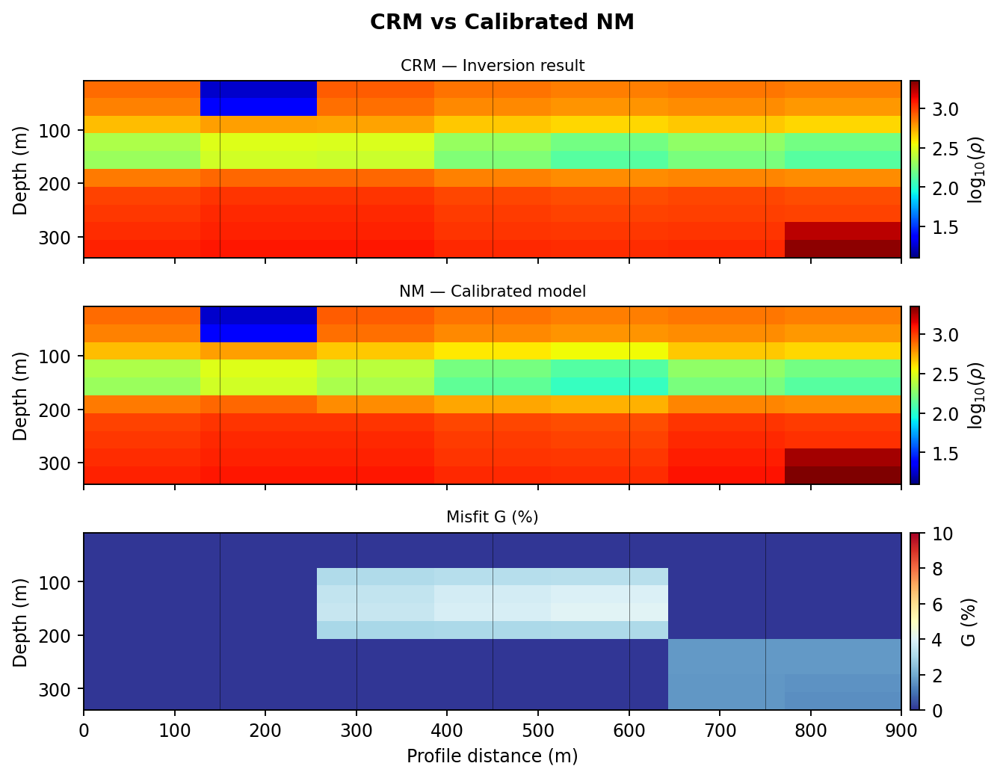

   :class:`pycsamt.interp.plot.PlotCalibratedModel` compares the original
   calculated resistivity model, the calibrated new model, and the correction
   pattern. Use it whenever calibration changes are part of the evidence.

Pseudo-stratigraphic figures translate cell values into station-scale
interpretation. They are useful for reviewer checks because a reader can see
both the interpreted layer pattern and the resistivity structure that supports
it.

.. code-block:: python

   fig = iplot.PlotStratigraphicLog(logs[2]).plot()
   fig.savefig(figures / "S03_stratigraphic_log.png", dpi=300,
               bbox_inches="tight")

   fig = iplot.PlotFenceDiagram(
       logs,
       max_depth=260.0,
   ).plot()
   fig.savefig(figures / "stratigraphic_fence.png", dpi=300,
               bbox_inches="tight")

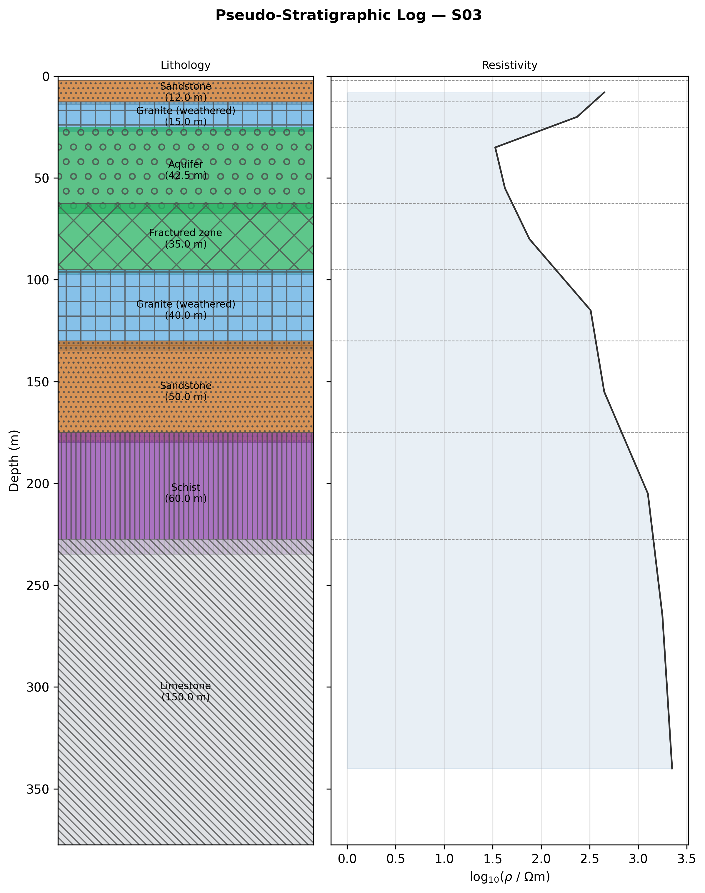

   :class:`pycsamt.interp.plot.PlotStratigraphicLog` is best for station-level
   review, especially when one borehole, target, or anomaly needs a detailed
   explanation.

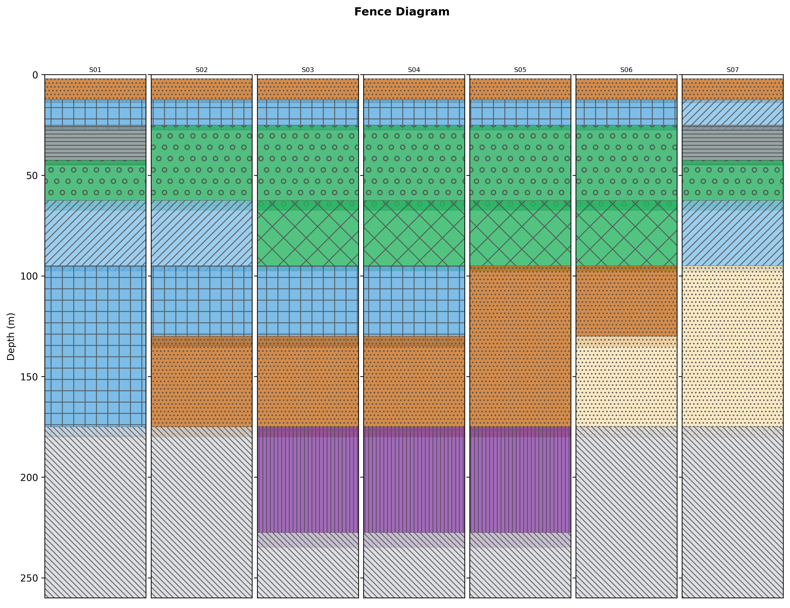

   :class:`pycsamt.interp.plot.PlotFenceDiagram` places station logs side by
   side so lateral changes can be inspected without treating the result as a
   fully interpolated geological section.

Hydrogeophysical figures should make clear that the displayed quantities are
derived from resistivity and petrophysical assumptions. They are most useful
when paired with the equations and qualifications described earlier in this
page.

.. code-block:: python

   fig = iplot.PlotHydroSection(
       hydro_result,
       quantity="K",
       vmin=-10.0,
       vmax=-3.0,
       depth_max=200.0,
   ).plot()
   fig.savefig(figures / "hydraulic_K.png", dpi=300,
               bbox_inches="tight")

   fig = iplot.PlotWaterTableProfile(
       hydro_result,
       reference_depth=70.0,
   ).plot()
   fig.savefig(figures / "water_table_profile.png", dpi=300,
               bbox_inches="tight")

   fig = iplot.PlotAquiferCharacterization(
       hydro_result,
       reference_depth=70.0,
   ).plot()
   fig.savefig(figures / "aquifer_characterization.png", dpi=300,
               bbox_inches="tight")

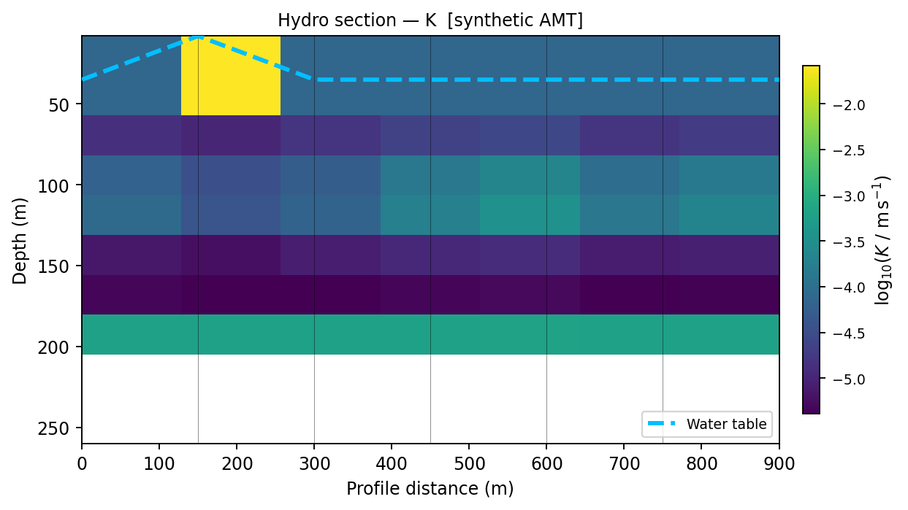

   :class:`pycsamt.interp.plot.PlotHydroSection` maps a cell-level hydro
   quantity such as ``K``, saturation, or porosity over the model section. The
   caption should state the property, transform, and color limits.

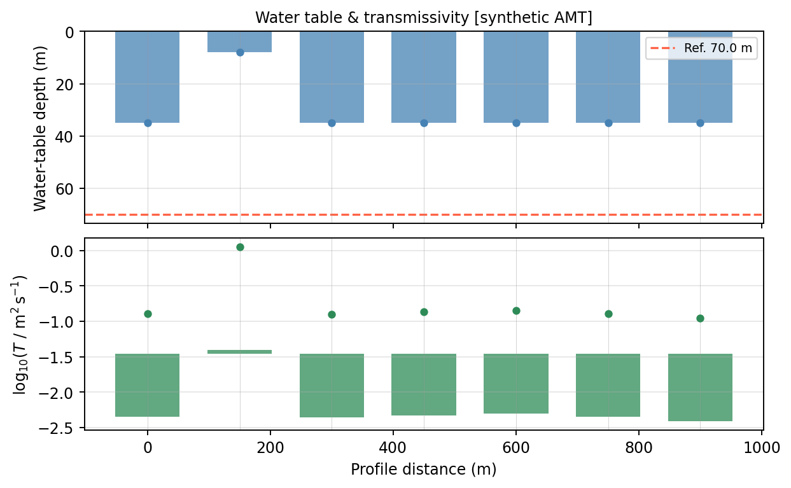

   :class:`pycsamt.interp.plot.PlotWaterTableProfile` summarizes station-level
   water-table depth and transmissivity. It is a compact way to show where
   hydro indicators strengthen, weaken, or fail along the line.

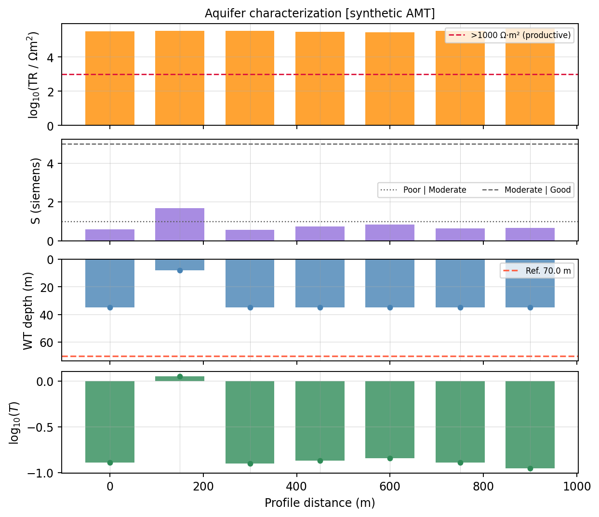

   :class:`pycsamt.interp.plot.PlotAquiferCharacterization` combines
   Dar-Zarrouk indicators, water table, and transmissivity. It is useful when
   reporting productivity and protective-capacity indicators together.

Petrophysical diagnostics show whether the chosen transform is plausible for
the cells being interpreted. They help separate a reporting claim from a hidden
petrophysical assumption.

.. code-block:: python

   fig = iplot.PlotPetrophysicalCrossPlot(
       hydro_result,
       depth_range=(20.0, 260.0),
   ).plot()
   fig.savefig(figures / "petrophysical_crossplot.png", dpi=300,
               bbox_inches="tight")

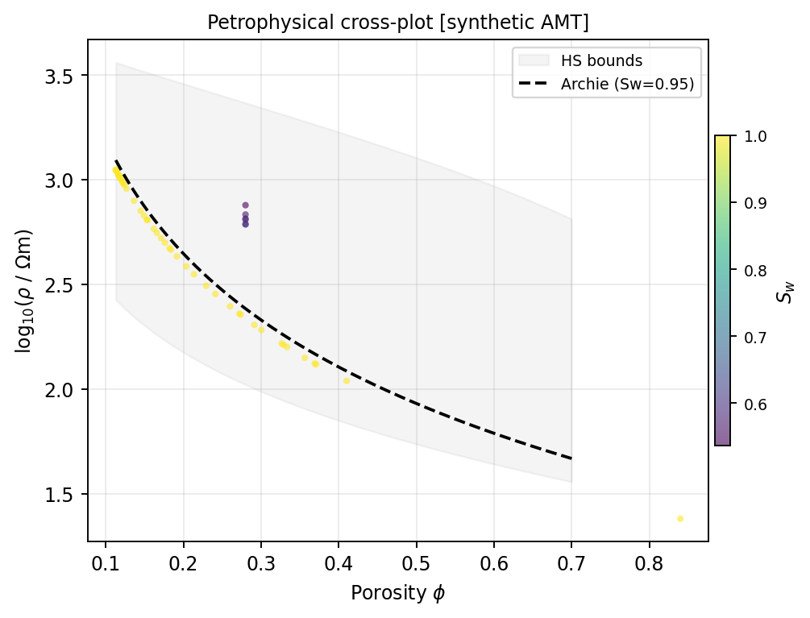

   :class:`pycsamt.interp.plot.PlotPetrophysicalCrossPlot` compares cell
   porosity and resistivity against the selected petrophysical model. Use it to
   reveal whether the assumed Archie or Waxman-Smits relation is controlling a
   major conclusion.

Uncertainty figures should be presented next to the deterministic figure they
qualify. The goal is not only to show an interval, but to show where the
interpretation is stable enough for the decision being made.

.. code-block:: python

   fig = iplot.PlotUncertaintySection(
       uncertainty,
       quantity="K",
       depth_max=200.0,
   ).plot()
   fig.savefig(figures / "uncertainty_K_section.png", dpi=300,
               bbox_inches="tight")

   fig = iplot.PlotUncertaintyProfile(
       uncertainty,
       reference_depth=70.0,
   ).plot()
   fig.savefig(figures / "uncertainty_profile.png", dpi=300,
               bbox_inches="tight")

   fig = iplot.PlotUncertaintyHistogram(
       uncertainty,
       quantity="water_table",
       stations=["S01", "S04", "S07"],
   ).plot()
   fig.savefig(figures / "water_table_histograms.png", dpi=300,
               bbox_inches="tight")

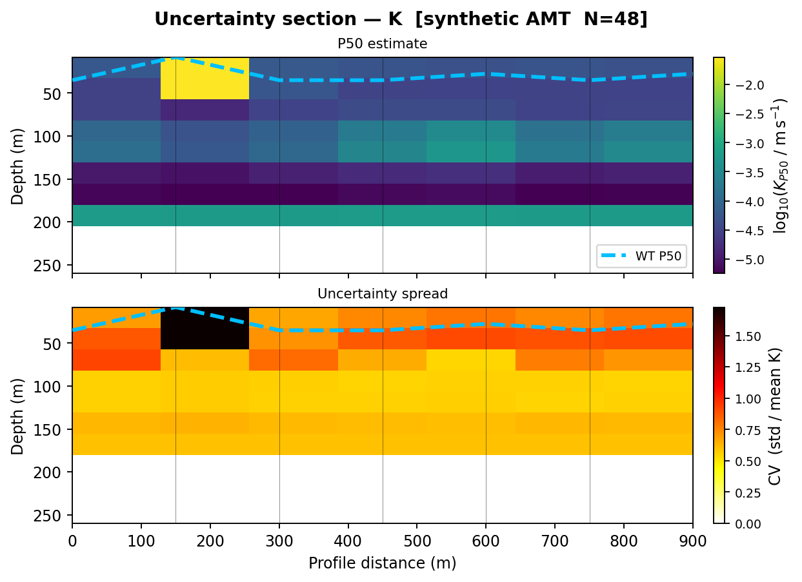

   :class:`pycsamt.interp.plot.PlotUncertaintySection` shows the median
   estimate and spatial uncertainty spread on the same section geometry. This
   makes unsupported high-uncertainty zones visible instead of hiding them in a
   station table.

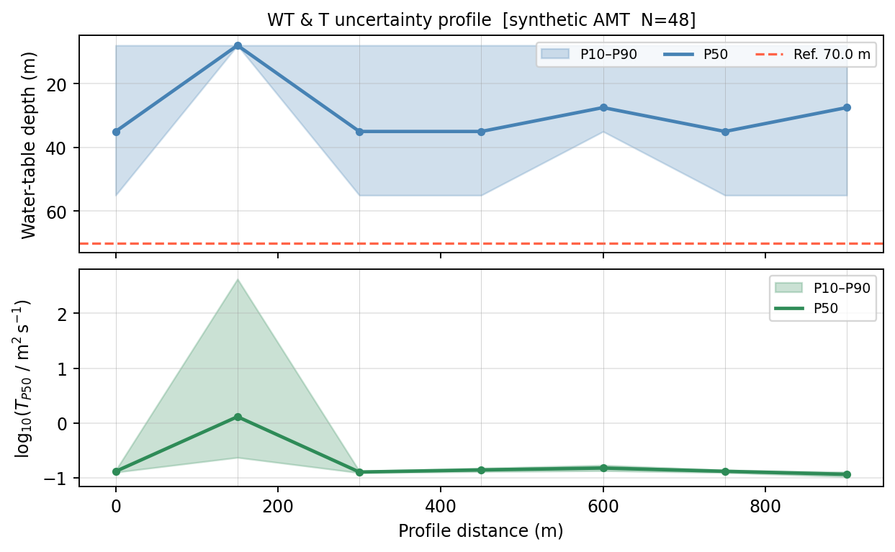

   :class:`pycsamt.interp.plot.PlotUncertaintyProfile` displays P10-P90
   envelopes for water-table depth and transmissivity along the profile. It is
   the natural companion to :class:`pycsamt.interp.plot.PlotWaterTableProfile`.

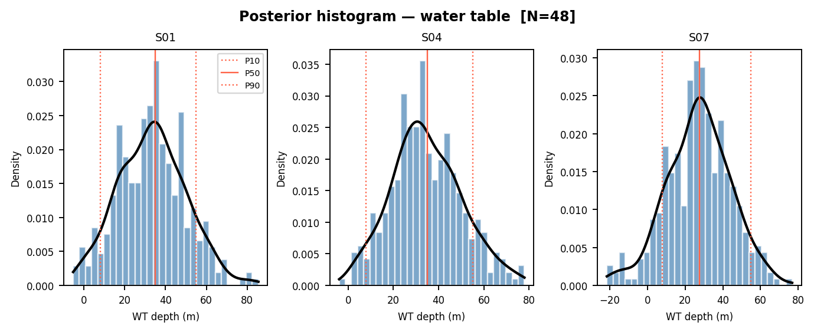

   :class:`pycsamt.interp.plot.PlotUncertaintyHistogram` shows the posterior
   shape at selected stations. Use it when the interval is asymmetric,
   multi-modal, or otherwise poorly represented by a single P10-P90 band.

A compact custom grid can still be helpful when a project needs side-by-side
station-log figures that are not covered by a dedicated class. In that case,
use Matplotlib axes directly and save the grid as a normal report figure:

A compact grid is often easier to compare than a stack of separate images.
When several station-log figures are needed, create subplots with shared axes
and save one review image:

.. code-block:: pycon

   >>> import matplotlib.pyplot as plt
   >>> fig, axes = plt.subplots(1, 2, figsize=(7.2, 3.2), sharey=True)
   >>> for ax, log in zip(axes, logs):
   ...     rho = 10.0 ** log.rho_log10
   ...     ax.step(rho, log.z_centers, where="mid")
   ...     ax.set_xscale("log")
   ...     ax.set_title(log.station_name)
   ...     ax.set_xlabel("rho (ohm m)")
   ...     ax.grid(True, which="both", alpha=0.3)
   >>> axes[0].invert_yaxis()
   >>> axes[0].set_ylabel("depth (m)")
   >>> fig.tight_layout()
   >>> fig.savefig(
   ...     "docs/source/images/user_guide/interpretation/"
   ...     "reporting_stratigraphic_logs.png",
   ...     dpi=180,
   ... )

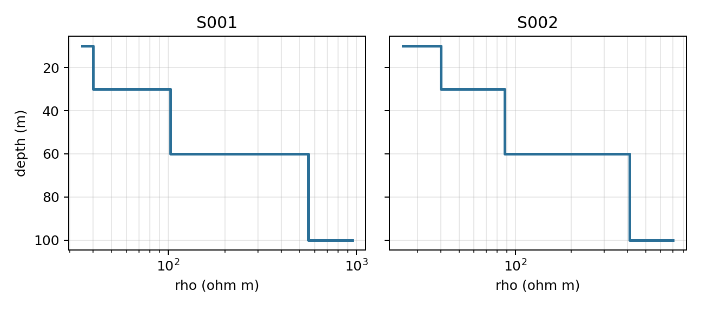

   Captured output from the station-log plotting fixture. The shared depth
   axis makes the two columns comparable without repeating separate figures.

Figure rules
~~~~~~~~~~~~

Every figure should identify:

* project, line, method, and model status;
* profile direction and horizontal coordinate;
* depth or elevation reference and unit;
* property and unit, including log transformation;
* station locations where relevant;
* consistent color scale across compared scenarios;
* missing or masked cells;
* water-table detection gaps;
* uncertainty representation;
* run or figure identifier.

Do not use different automatic color limits to compare scenarios. The same
structure can appear stronger or weaker solely because the color normalization
changed. Avoid rainbow palettes where they obscure ordering or accessibility,
and check grayscale and color-vision readability when required by the project.

A figure should be reproducible from its caption and surrounding method text.
For sections, state whether the vertical coordinate is depth below surface or
elevation, whether the vertical exaggeration is one-to-one, and whether masked
regions are outside the reliable depth of investigation or merely missing
values. For comparison figures, record the normalization interval
:math:`[v_\min, v_\max]`, the colormap, and the transformation applied before
plotting. For example, a hydraulic-conductivity section labelled
``log10(K m/s)`` and clipped to :math:`[-10,-3]` is not interchangeable with a
linear ``K`` section in metres per second.

15. Write the technical narrative
---------------------------------

A concise but complete interpretation report normally contains:

Executive summary
   Decision, principal findings, confidence, limitations, and recommended next
   action. Avoid unexplained software or inversion terminology.

Objectives and scope
   Survey area, question, target depth, methods, exclusions, and reporting
   status.

Data and processing
   Acquisition inventory, data quality, exclusions, corrections, coordinate
   handling, and unresolved artifacts.

Inversion
   Backend, dimensionality, mesh, errors, regularization, convergence,
   residuals, sensitivity, model scenarios, and reliable interpretation depth.

Interpretation method
   CRM normalization, boreholes, rock database, calibration tolerance,
   classification logic, hydrogeophysical equations, and configuration.

Results
   Observed patterns and derived quantities stated separately from geological
   hypotheses.

Calibration and validation
   Evidence roles, residuals, withheld results, scale compatibility, matches,
   and mismatches.

Uncertainty
   Data, inversion, petrophysical, calibration, and interpretive uncertainty;
   intervals and detection rates; assumptions not propagated.

Conclusions and recommendations
   Answers to the stated questions, confidence-qualified targets, rejected
   alternatives, and specific follow-up measurements.

Limitations
   Scientific, spatial, computational, and operational constraints that affect
   use of the deliverables.

Appendices
   Configuration tables, file manifest, symbols and units, residuals,
   additional scenarios, and reviewer record.

The technical narrative should not repeat every exported row. Its job is to
connect evidence to claims. A useful paragraph often follows the sequence
``observation -> method -> interpretation -> uncertainty -> implication``. For
example, describe the resistivity pattern first, then the calibration or
hydrogeophysical rule used to interpret it, then the geological hypothesis,
then the range of accepted alternatives, and only then the project implication.
This keeps the reader from mistaking a compelling map color for a measured
geological fact.

Keep observation and inference linguistically separate. For example:

* observation: "A conductive zone occurs between profile distances 600 and
  900 m below approximately 40 m depth.";
* interpretation: "The zone is consistent with saturated weathered material,
  but clay-rich material remains a plausible alternative.";
* validation: "BH03 intersects weathered granite in this interval; BH03 was
  withheld from calibration.";
* uncertainty: "The boundary varies from 35 to 58 m across accepted scenarios."

Use the same discipline for negative findings. If a target is not supported,
say whether the data lack sensitivity, the model is ambiguous, calibration
contradicts the hypothesis, or uncertainty is too broad for the decision. "No
aquifer detected" is a much stronger claim than "no supported aquifer
interpretation within the reliable depth range."

16. Build a machine-readable manifest
-------------------------------------

The manifest is the package's index. YAML or JSON is suitable. A minimal YAML
structure might be:

.. code-block:: yaml

   schema_version: 1
   package_id: willy_L18_interpretation_20260712_r01
   status: review
   project: willy
   survey_line: L18
   created_utc: 2026-07-12T12:00:00Z
   software:
     package: pycsamt
     version: 2.0.0
   coordinates:
     horizontal_reference: profile_distance
     horizontal_unit: m
     vertical_reference: depth_below_surface
     vertical_positive: down
     vertical_unit: m
   resistivity:
     linear_unit: ohm_m
     model_storage: log10_ohm_m
   source_runs:
     processing: processing_run_id
     inversion: inversion_run_id
   interpretation:
     run_id: interpretation_run_id
     calibration_boreholes: [BH01, BH02]
     validation_boreholes: [BH03]
   uncertainty:
     n_samples: 500
     seed: 42
     interval: P10_P90
   files:
     - path: tables/stratigraphic_logs.csv
       role: interpreted_station_cells
     - path: figures/crm_nm_misfit.png
       role: calibration_review

Extend this with checksums, sizes, media types, CRS identifiers, configuration
hashes, and approval metadata according to project requirements. Do not put
secrets, personal data, or machine-specific absolute paths in a deliverable
manifest.

The manifest should be machine-readable but still understandable to a human
reviewer. Prefer explicit field names such as ``vertical_positive: down`` over
compressed local shorthand. For each file, include its role, units where
relevant, producer step, and source dependency. A table that supports a
conclusion should be traceable back to the model and configuration that made
it; a figure should be traceable back to the table or model values it plotted.
This turns the manifest into an audit map rather than a file listing.

17. Add checksums and validate files
------------------------------------

Checksums detect accidental change after approval. Generate them with an
organizationally approved tool and store paths relative to the package root.
Checksums prove file integrity, not scientific correctness.

Validation should include:

Structural checks
   Required files exist, are non-empty, and match manifest entries.

Schema checks
   CSV headers, units, data types, null conventions, and unique identifiers are
   correct.

Numerical checks
   Exported ranges and row counts agree with in-memory results; log and linear
   resistivity correspond; P10 ≤ P50 ≤ P90 where finite.

Coordinate checks
   Profile distance, station order, elevation/depth convention, CRS, and datum
   agree across figures and files.

Visual checks
   Figures open, labels are legible, color scales match comparisons, masked
   regions are visible, and no plotting layer was clipped.

Round-trip checks
   Open each format in at least one target consumer when practical. Verify LAS
   curves, XYZ columns, VTK orientation, and CSV encoding.

Scientific checks
   Conclusions match the approved tables and figures, calibration/validation
   roles are correct, and limitations are not omitted.

Validation should deliberately be independent of the code path that generated
the file. Opening a CSV with the same object that wrote it proves little; it
may reproduce the same mistake. Simple independent checks are often enough:
count rows from the text file, recompute min/max values, verify that
``rho_ohm_m`` matches ``rho_log10``, confirm that station names are unique
where required, and open a few exported products in the target consumer. For
scientific validation, compare claims against withheld observations before
reviewing calibration successes, so the report does not accidentally reward
overfitting.

18. Review and approval
-----------------------

Use separate review roles when project scale permits:

Scientific review
   Tests geophysical, geological, hydrogeological, and uncertainty reasoning.

Technical review
   Tests code paths, units, file schemas, reproducibility, and internal
   consistency.

Editorial review
   Tests clarity, terminology, captions, accessibility, and audience fit.

Approval
   Confirms that the package meets the project's governance and release
   requirements.

Track comments and dispositions. If a review changes inputs, parameters, or
conclusions, increment the revision and regenerate dependent outputs. Do not
edit an approved binary or CSV in place.

19. Handle revisions and superseded products
--------------------------------------------

Maintain a changelog with:

* revision identifier and date;
* author and approver;
* files added, removed, or replaced;
* scientific reason for change;
* impact on conclusions and downstream users;
* identifier of the superseded package.

Never reuse the same approved package identifier for different content.
Preserve superseded packages in read-only archival storage with an obvious
status marker. Notify downstream users when a revision changes target
locations, depths, confidence, or safety-relevant conclusions.

20. Protect sensitive information
---------------------------------

Interpretation packages can contain private well locations, infrastructure,
landowner details, water-quality information, or commercially sensitive
targets. Before release:

* classify each file according to project policy;
* remove unnecessary personal or machine-specific information;
* limit coordinate precision when authorized and appropriate;
* avoid embedding credentials, API keys, or local absolute paths;
* verify image metadata and document properties;
* separate public summaries from controlled technical appendices.

Do not reduce coordinate precision in a scientific archive unless the precise
authoritative coordinates are preserved in an appropriately controlled source.

Complete export example
-----------------------

The following example assembles core machine-readable products and figures.
It assumes ``logs``, ``crm``, ``calibrated_model``, ``calibrator``,
``hydro_result``, and ``uncertainty`` were created and reviewed as described in
the preceding guides:

.. code-block:: python

   from pathlib import Path
   import csv

   from pycsamt.interp import export, plot as iplot

   root = Path("willy_L18_interpretation_20260712_r01")
   tables = root / "tables"
   figures = root / "figures"
   grids = root / "grids"
   logs_dir = root / "logs"
   gis = root / "gis"

   for directory in (tables, figures, grids, logs_dir, gis):
       directory.mkdir(parents=True, exist_ok=True)

   # Geological interpretation products.
   export.to_csv(logs, tables / "stratigraphic_logs.csv")
   export.to_oasis_montaj_xyz(
       logs, gis / "profile.xyz", log_rho=False
   )
   export.to_las(
       logs[0], logs_dir / f"{logs[0].station_name}.las",
       log_rho=False,
   )
   export.to_vtk(
       calibrated_model,
       grids / "calibrated_resistivity.vtk",
       log_rho=False,
       field_name="rho_ohm_m",
   )

   # Hydrogeophysical and uncertainty products.
   hydro_result.to_csv(tables / "hydro_cells.csv")
   hydro_result.station_report_csv(tables / "hydro_by_station.csv")
   uncertainty.to_csv(tables / "uncertainty_by_station.csv")

   # Calibration residuals.
   residuals = calibrator.constraint_residuals(hydro_result)
   if residuals:
       fields = sorted({key for row in residuals for key in row})
       with (tables / "calibration_residuals.csv").open(
           "w", newline="", encoding="utf-8"
       ) as stream:
           writer = csv.DictWriter(stream, fieldnames=fields)
           writer.writeheader()
           writer.writerows(residuals)

   # Review figures with explicit comparison scales.
   fig = iplot.PlotCalibratedModel(
       crm,
       calibrated_model,
       calibrator.misfit_map(),
       vmin_rho=1.0,
       vmax_rho=4.5,
   ).plot()
   fig.savefig(figures / "crm_nm_misfit.png", dpi=300,
               bbox_inches="tight")

   fig = iplot.PlotUncertaintyProfile(uncertainty).plot()
   fig.savefig(figures / "uncertainty_profile.png", dpi=300,
               bbox_inches="tight")

This script creates files; it does not by itself create the narrative report,
manifest, checksums, review record, or approval. Those are required parts of a
controlled reporting workflow.

Delivery checklist
------------------

.. list-table::
   :header-rows: 1
   :widths: 30 70

   * - Check
     - Acceptance evidence
   * - Scope and status are explicit
     - Audience, decision, project, line, revision, and working/review/approved
       status.
   * - Inputs are traceable
     - Survey, processing, inversion, interpretation, and configuration IDs.
   * - Quantity classes are separated
     - Measured, inverted, calibrated, interpreted, and predicted fields are
       labeled.
   * - Coordinates are unambiguous
     - CRS or profile reference, origin, direction, units, datum, and vertical
       sign convention.
   * - Units are explicit
     - Linear/log resistivity, depth/elevation, K, T, storativity, EC, and TDS.
   * - Exports are validated
     - Schema, row count, numerical range, null handling, target-application
       round trip, and manifest match.
   * - Figures are comparable
     - Stable color limits, visible missing data, readable labels, and figure
       identifiers.
   * - Calibration is reviewable
     - Constraints, fitted parameters, bounds, restarts, and residuals.
   * - Validation is independent
     - Withheld evidence, prediction intervals, mismatches, and dispositions.
   * - Uncertainty is conditional and complete
     - Bounds, samples, seed, failures, detection rates, scenarios, and omitted
       uncertainty sources.
   * - Limitations and alternatives are stated
     - Reliable depth, resolution, conceptual ambiguity, and usage limits.
   * - Package integrity is controlled
     - Manifest, checksums, changelog, reviewer, approver, and immutable copy.

Common reporting mistakes
-------------------------

Avoid these errors:

* delivering only a color image without source values or provenance;
* labeling along-profile distance as easting;
* mixing depth below surface with elevation above datum;
* omitting whether resistivity is log10 or linear;
* presenting calibrated lithology as directly observed geology;
* treating LAS hash-based lithology codes as stable identifiers;
* calling derived hydraulic conductivity a measured field value;
* hiding water-table non-detections or Monte Carlo failures;
* reporting P10–P90 as the complete range of possible outcomes;
* changing color scales between scenarios;
* using calibration wells again as independent validation;
* manually editing exported tables without recording the change;
* replacing an approved package without incrementing its revision;
* assuming checksums establish scientific correctness;
* omitting known alternative explanations because they complicate the summary.

Next steps
----------

Use this page with:

* :doc:`workflow` for geological interpretation and calibration;
* :doc:`hydrogeophysics` for deterministic hydrogeophysical products;
* :doc:`uncertainty` for conditional intervals and validation;
* :doc:`../map/index` for spatial context and mapping exports;
* :doc:`../inversion/index` for source-model provenance and diagnostics.
