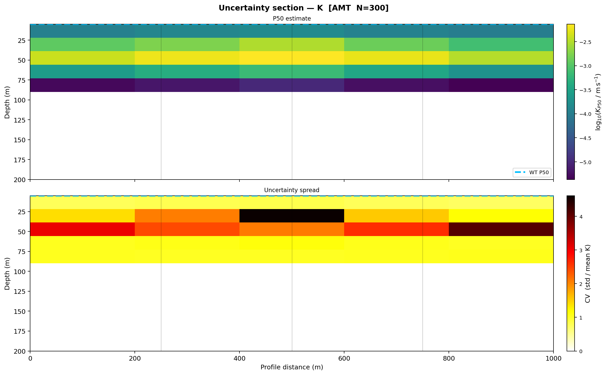
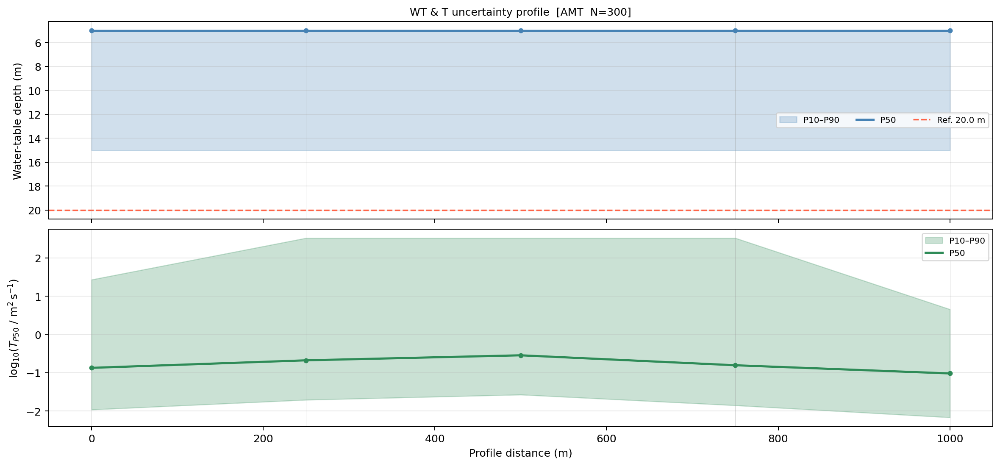
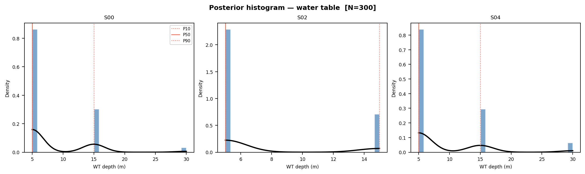

.. _interpretation_uncertainty:

Uncertainty and validation
==========================

An electromagnetic interpretation is conditional, not unique. The reported
model depends on the measured data, processing decisions, inversion physics,
regularization, petrophysical assumptions, and the evidence used to assign
geological meaning. This guide explains how to identify those dependencies,
test their consequences, propagate selected hydrogeophysical parameter
uncertainties with :mod:`pycsamt.interp`, and communicate conclusions without
implying more certainty than the evidence supports.

The quantitative tools described here propagate uncertainty in selected
petrophysical parameters through :class:`pycsamt.interp.EMHydroModel`. They do
**not** by themselves propagate measurement noise, alternative inversion
models, mesh design, structural uncertainty, or lithological ambiguity. Those
sources require scenario comparison and independent validation alongside the
Monte Carlo results.

.. admonition:: Central principle
   :class: important

   A narrow numerical interval is not proof that an interpretation is correct.
   It only shows limited variation under the assumptions and parameter ranges
   that were actually explored.

What uncertainty means in this workflow
---------------------------------------

Uncertainty is easiest to manage when separated into layers:

Data uncertainty
   Instrument noise, missing frequencies, weak signal, source effects,
   coordinate errors, processing choices, error-floor assumptions, and
   residual data artifacts.

Inversion uncertainty
   Non-uniqueness, starting-model dependence, regularization, mesh design,
   dimensionality, finite depth sensitivity, and backend-specific physics.

Petrophysical uncertainty
   Uncertain pore-water resistivity, cementation and saturation exponents,
   porosity, grain size, tortuosity, and the appropriateness of the selected
   constitutive relationship.

Calibration uncertainty
   Borehole location, sampling quality, representativeness, scale mismatch,
   laboratory conditions, and the distance over which a constraint is applied.

Interpretive uncertainty
   Overlapping resistivity ranges, alternative lithologies, fluid salinity,
   saturation, clay content, alteration, temperature, and structural context.

Operational uncertainty
   File version, coordinate reference, unit conversion, configuration drift,
   and incomplete provenance.

These layers should not be collapsed into one unexplained confidence score.
Describe which layer an uncertainty measure represents and which layers remain
outside the calculation.

Recommended uncertainty workflow
--------------------------------

#. Audit data and inversion evidence before interpretation.
#. Define the decisions and quantities that require uncertainty estimates.
#. Build a central, defensible interpretation or hydrogeophysical model.
#. Choose uncertain parameters from independent evidence.
#. Define transparent prior ranges or distributions.
#. run a reproducible pilot ensemble;
#. inspect failures, detection rates, distributions, and spatial patterns;
#. increase the ensemble size and check stability;
#. compare alternative inversion and interpretation scenarios;
#. validate predictions with observations not used for calibration;
#. report intervals, assumptions, limitations, and competing explanations.

1. Audit uncertainty upstream
-----------------------------

Do not begin uncertainty analysis at the final geological label. Retain and
review the upstream evidence described in :doc:`workflow`, including:

* QC flags and masked observations;
* correction history and static-shift factors;
* observed-versus-predicted response plots;
* residuals by station, frequency, and component;
* RMS and objective-function histories;
* starting models, error floors, regularization, and stopping criteria;
* mesh resolution, padding, topography, and inactive cells;
* dimensionality and strike evidence;
* alternative inversion runs that fit the data acceptably.

A low final RMS does not imply a unique subsurface model. Conversely, a higher
RMS model may be scientifically preferable if its errors are realistic and its
structure is consistent with independent evidence.

2. Define the uncertainty question
----------------------------------

Quantify uncertainty in the quantity used for a decision. Examples are:

* the probability that water-table depth is shallower than a drilling limit;
* the P10–P90 range of transmissivity along a profile;
* locations where hydraulic conductivity is highly parameter-sensitive;
* the range of a boundary depth across acceptable inversion scenarios;
* whether a lithological classification is stable across plausible databases
  and calibration distances.

Avoid asking only for "the uncertainty of the model." A model contains many
parameters, and different uncertainty sources affect them differently.

3. Establish a central hydrogeophysical model
---------------------------------------------

Quantitative Monte Carlo propagation starts with a reviewed
:class:`~pycsamt.interp.ResistivityModel` and a central
:class:`~pycsamt.interp.PetrophysicalConfig`:

.. code-block:: pycon

   >>> from pycsamt.interp import EMHydroModel, PetrophysicalConfig
   >>> from pycsamt.interp.petrophysics import ArchieModel

   >>> central_config = PetrophysicalConfig(
   ...     petro=ArchieModel(m=1.8, n=2.0),
   ...     rho_w=20.0,
   ...     porosity_prior=0.25,
   ...     Sw_water_table_threshold=0.85,
   ...     d50_m=2.5e-4,
   ... )

   >>> central = EMHydroModel(
   ...     resistivity_model,
   ...     central_config,
   ...     method_tag="AMT",
   ... ).fit()

This and every other result in this guide is run against the five-station
``resistivity_model`` fixture from :doc:`workflow`, whose central water table
sits at 15 m for every column:

.. code-block:: pycon

   >>> central.water_table
   array([15., 15., 15., 15., 15.])

Review the deterministic result before propagation. Check finite values,
spatial patterns, water-table detection, and physical units. Monte Carlo
sampling will not repair an inappropriate central model.

Choosing a petrophysical relationship
~~~~~~~~~~~~~~~~~~~~~~~~~~~~~~~~~~~~~~

Archie's law is most defensible for relatively clean, clay-poor porous media.
Clay-rich material may require the available Waxman–Smits relationship. A
fractured basement may require a different conceptual model from an
unconsolidated aquifer. Treat model choice as structural uncertainty: running
many samples of an unsuitable equation does not make it suitable.

4. Define parameter bounds
--------------------------

:class:`pycsamt.interp.UncertaintyBounds` activates only the ranges that are
provided. Other values remain fixed at the central configuration.

.. code-block:: pycon

   >>> from pycsamt.interp import UncertaintyBounds

   >>> bounds = UncertaintyBounds(
   ...     rho_w_range=(5.0, 80.0),
   ...     m_range=(1.5, 2.2),
   ...     n_range=(1.8, 2.4),
   ...     phi_prior_range=(0.15, 0.40),
   ...     dist="uniform",
   ... )

   >>> print(bounds.n_free)
   4
   >>> print(bounds.free_names)
   ['rho_w', 'm', 'n', 'phi_prior']

Supported uncertain parameters are:

``rho_w_range``
   Pore-water resistivity in ohm metres. This can dominate saturation and
   water-table results, especially when water chemistry is poorly known.

``m_range``
   Archie cementation exponent. Its plausible range depends on pore geometry,
   consolidation, and fracturing.

``n_range``
   Archie saturation exponent. Use laboratory, literature, or site-specific
   evidence appropriate to the material.

``phi_prior_range``
   Prior porosity as a fraction between zero and one.

At least one range is required. Do not vary every available parameter merely
because the software allows it. Vary parameters that are uncertain and
material to the question, and record why each range was selected.

Uniform and normal distributions
~~~~~~~~~~~~~~~~~~~~~~~~~~~~~~~~

With ``dist="uniform"``, each tuple is interpreted as ``(low, high)``. Use a
uniform prior when available evidence supports bounds but does not justify a
more probable center.

With ``dist="normal"``, each tuple is interpreted as ``(mean, standard
deviation)``:

.. code-block:: pycon

   bounds_normal = UncertaintyBounds(
       rho_w_range=(20.0, 4.0),
       m_range=(1.8, 0.15),
       dist="normal",
   )

Normal sampling is clipped internally to broad physical limits. Clipping can
distort a distribution whose mean lies too close to a limit, so inspect the
actual samples rather than assuming the requested distribution was preserved.

Evidence for bounds
~~~~~~~~~~~~~~~~~~~

Prefer, in descending order:

#. site-specific laboratory or field measurements with uncertainty;
#. calibrated observations from comparable units at the same site;
#. published ranges for the same material and environmental conditions;
#. broad literature ranges, clearly identified as weak priors.

Do not choose bounds after seeing which values produce the desired conclusion.
That converts uncertainty analysis into outcome selection.

5. Run a reproducible Monte Carlo ensemble
------------------------------------------

:class:`pycsamt.interp.MonteCarloHydro` draws parameter configurations, runs
the full deterministic hydrogeophysical transform for every draw, and
aggregates ensemble statistics:

.. code-block:: pycon

   >>> from pycsamt.interp import MonteCarloHydro

   >>> mc = MonteCarloHydro(
   ...     resistivity_model,
   ...     central_config,
   ...     bounds,
   ...     n_samples=300,
   ...     seed=42,
   ...     method_tag="AMT",
   ...     verbose=True,
   ... )
   >>> uncertainty = mc.run()
     MC sample 0/300 ...
     MC sample 50/300 ...
     MC sample 100/300 ...
     MC sample 150/300 ...
     MC sample 200/300 ...
     MC sample 250/300 ...
     MC complete: 300 samples  n_free=4  free=['rho_w', 'm', 'n', 'phi_prior']

The random seed makes the sampling repeatable. Keep it in the project
configuration and report it with the sample count and bounds.

Sample count
~~~~~~~~~~~~

Use a small ensemble for workflow testing and a larger one for stable
percentiles:

* approximately 50–100 samples for a quick integration check;
* approximately 200–500 samples for routine analysis;
* 500–1000 or more when stable tail estimates are important.

These are practical starting points, not universal guarantees. Convergence
depends on parameter count, distribution shape, nonlinearities, and failure
rate. Demonstrate stability by rerunning with more samples or another seed and
comparing the reported percentiles.

6. Understand the result
------------------------

:class:`pycsamt.interp.UncertaintyResult` contains spatial and station-level
statistics.

Hydraulic conductivity
~~~~~~~~~~~~~~~~~~~~~~

``mean_K``, ``std_K``, ``p10_K``, ``p50_K``, and ``p90_K`` have shape
``(n_z, n_x)`` and use linear metres per second. ``cv_K`` is the coefficient
of variation ``std_K / mean_K``.

Hydraulic conductivity commonly spans orders of magnitude. Review percentile
ratios and log-scale plots in addition to arithmetic mean and standard
deviation. A high coefficient of variation marks sensitivity to the sampled
parameters; it is not automatically an error in the calculation.

Saturation and porosity
~~~~~~~~~~~~~~~~~~~~~~~

``mean_Sw``, ``std_Sw``, ``p10_Sw``, and ``p90_Sw`` describe water
saturation. ``mean_phi`` and ``std_phi`` describe porosity. These arrays also
have shape ``(n_z, n_x)``.

Water table
~~~~~~~~~~~

``mean_wt``, ``std_wt``, ``p10_wt``, ``p50_wt``, and ``p90_wt`` describe the
ensemble distribution of the :term:`water table (hydrogeophysical)` per
column. They are one-dimensional arrays over profile columns. Depth is
positive downward.

``wt_detection_rate`` is the fraction of realizations in which a water table
was detected. Treat it as a first-order reliability diagnostic. A narrow
P10–P90 interval based on a low detection rate is not robust because many
samples produced no detectable transition.

Transmissivity
~~~~~~~~~~~~~~

``mean_T``, ``std_T``, ``p10_T``, ``p50_T``, and ``p90_T`` describe the
ensemble distribution of :term:`transmissivity` as station profiles in
square metres per second. Because transmissivity may span orders
of magnitude, compare it in log space when appropriate.

Sampled parameters
~~~~~~~~~~~~~~~~~~

``sampled_params`` has shape ``(n_samples, n_free)``. Its columns follow
``bounds.free_names``:

.. code-block:: pycon

   >>> for column, name in enumerate(uncertainty.bounds.free_names):
   ...     values = uncertainty.sampled_params[:, column]
   ...     values = values[np.isfinite(values)]
   ...     print(name, values.min(), np.median(values), values.max())
   rho_w 5.5522 40.9253 79.4282
   m 1.5038 1.8594 2.1994
   n 1.8007 2.1013 2.3992
   phi_prior 0.1501 0.2727 0.3999

All 300 samples succeeded here (none of the four ranges pushed the model into
a numerically degenerate configuration), so every column's min/max sits near
its requested uniform bound and the median is close to the midpoint.

Rows containing ``nan`` can indicate a failed realization. Count them and
investigate before accepting ensemble statistics.

7. Calculate decision-focused summaries
----------------------------------------

Inspect station summaries:

.. code-block:: pycon

   >>> rows = uncertainty.station_report()
   >>> for row in rows[:3]:
   ...     print(row)
   {'station': 'S00', 'x_m': 0.0, 'mean_wt_m': 8.2, 'std_wt_m': 5.635601121442134, 'p10_wt_m': 5.0, 'p90_wt_m': 15.0, 'wt_range_m': 10.0, 'wt_detection_pct': 100.0, 'mean_T_m2s': 29.922880957502095, 'std_T_m2s': 91.4235735314147, 'p10_T_m2s': 0.010832097161760954, 'p90_T_m2s': 26.99080900184981, 'log10_T_range': 3.3965033550681705}
   {'station': 'S01', 'x_m': 250.0, 'mean_wt_m': 7.683333333333334, 'std_wt_m': 4.835602915413508, 'p10_wt_m': 5.0, 'p90_wt_m': 15.0, 'wt_range_m': 10.0, 'wt_detection_pct': 100.0, 'mean_T_m2s': 46.706797644506835, 'std_T_m2s': 113.06793501638288, 'p10_T_m2s': 0.01950623840318546, 'p90_T_m2s': 330.6261198617054, 'log10_T_range': 4.229163632564438}
   {'station': 'S02', 'x_m': 500.0, 'mean_wt_m': 7.366666666666666, 'std_wt_m': 4.250359461922668, 'p10_wt_m': 5.0, 'p90_wt_m': 15.0, 'wt_range_m': 10.0, 'wt_detection_pct': 100.0, 'mean_T_m2s': 66.87986518980702, 'std_T_m2s': 142.21726455562947, 'p10_T_m2s': 0.02663907248039477, 'p90_T_m2s': 331.03916257569597, 'log10_T_range': 4.094360275205425}

   >>> uncertainty.to_csv("review/uncertainty_by_station.csv")

The report includes water-table mean, standard deviation, P10, P90, detection
percentage, and transmissivity statistics. Note ``mean_T_m2s`` (30-67 m²/s)
sitting far above ``p90_T_m2s`` (27-331 m²/s) at some stations, with
``std_T_m2s`` several times the mean: the ensemble mean is dominated by a
small number of extreme draws (low ``m``, high ``phi_prior``, low ``rho_w``
together push a few realizations' K toward the model's numerical ceiling).
Reporting only the mean here would be actively misleading; P10/P50/P90 in log
space are the honest summary, which is exactly the point of the *decision
quantities* framing in the introduction.

For a depth threshold, estimate the probability that the water table is
shallower than the threshold:

.. code-block:: pycon

   >>> probability = uncertainty.prob_wt_shallower_than(20.0)
   >>> np.round(probability, 4)
   array([0.9819, 0.9946, 0.9985, 0.9913, 0.9551])

Without the raw ensemble, this method uses a Gaussian approximation based on
the stored mean and standard deviation. Use the raw ensemble when the
distribution is skewed, multimodal, truncated, or has many non-detections.

8. Retain raw ensembles when distributions matter
--------------------------------------------------

Use :meth:`pycsamt.interp.MonteCarloHydro.run_ensemble` to retain water-table
and transmissivity draws:

.. code-block:: pycon

   >>> uncertainty, wt_ensemble, T_ensemble = mc.run_ensemble()

   >>> probability = uncertainty.prob_wt_shallower_than(
   ...     20.0,
   ...     wt_ensemble=wt_ensemble,
   ... )
   >>> np.round(probability, 4)
   array([0.9733, 0.99  , 1.    , 0.9867, 0.9467])
   >>> wt_ensemble.shape
   (300, 5)

The raw-ensemble probabilities differ slightly from the Gaussian
approximation above (0.9733 vs 0.9819 at station ``S00``, for example) --
the water-table distribution is bounded and right-skewed (P10 through P90 all
sit between 5 m and 15 m, against a nominal search range extending far
deeper), so a Gaussian fit to its mean and standard deviation is only
approximate. The returned arrays have shapes ``(n_samples, n_x)``. Raw draws support
histograms, empirical probabilities, failure analysis, and non-Gaussian
diagnostics. They consume more memory, so archive them in a binary scientific
format with metadata rather than flattening them into a very large CSV.

9. Plot estimates and uncertainty together
-------------------------------------------

Section view
~~~~~~~~~~~~

Plot median hydraulic conductivity and its coefficient of variation:

.. code-block:: pycon

   >>> from pycsamt.interp import plot as iplot

   >>> fig = iplot.PlotUncertaintySection(
   ...     uncertainty,
   ...     quantity="K",
   ...     depth_max=200.0,
   ... ).plot()
   >>> fig.savefig("review/K_uncertainty.png", dpi=200,
   ...             bbox_inches="tight")

   P50 log10 hydraulic conductivity (top) and its coefficient of variation
   (bottom) across the 300-sample ensemble on the fixture.

The supported quantities are ``"K"``, ``"saturation"``, and ``"porosity"``.
The conductivity panel uses log10 K for the P50 view and ``cv_K`` for spread
(``cv_K`` ranges 0.73-5.10 on this fixture -- a coefficient of variation
above 1 means the standard deviation exceeds the mean, one more signal of
the skewed K distribution discussed above). Saturation spread uses P90 minus
P10. Porosity spread is displayed from twice its standard deviation.

Profile view
~~~~~~~~~~~~

Plot water-table and transmissivity envelopes along the profile:

.. code-block:: pycon

   >>> fig = iplot.PlotUncertaintyProfile(
   ...     uncertainty,
   ...     reference_depth=20.0,
   ... ).plot()
   >>> fig.savefig("review/profile_uncertainty.png", dpi=200,
   ...             bbox_inches="tight")

   Water-table depth (top) and log10 transmissivity (bottom) along the
   profile, with P10-P90 shading and the P50 median line.

Distribution view
~~~~~~~~~~~~~~~~~

Use raw ensembles to show station distributions without relying on a Gaussian
approximation:

.. code-block:: pycon

   >>> fig = iplot.PlotUncertaintyHistogram(
   ...     uncertainty,
   ...     quantity="water_table",
   ...     stations=["S00", "S02", "S04"],
   ...     wt_ensemble=wt_ensemble,
   ... ).plot()
   >>> fig.savefig("review/water_table_distributions.png", dpi=200,
   ...             bbox_inches="tight")

   Water-table depth posteriors at stations ``S00``, ``S02``, and ``S04``,
   built from the raw 300-sample ensemble with P10/P50/P90 markers.

For transmissivity, set ``quantity="transmissivity"`` and pass
``T_ensemble=T_ensemble``.

Do not show only the median map. Pair every key estimate with its spread,
detection rate, or scenario range, and ensure all maps share clear units and
compatible scales.

10. Check ensemble quality
--------------------------

Before interpreting percentiles, review:

Failure rate
   Count non-finite rows in ``sampled_params`` and non-detections in the
   water-table ensemble. Determine whether failures cluster in a parameter
   region rather than occurring randomly.

Sampling coverage
   Plot or summarize every sampled parameter. Confirm that uniform bounds and
   normal centers/standard deviations were interpreted as intended.

Stability
   Compare P10, P50, and P90 between a pilot run and a larger run. Repeat with
   a second seed. Important conclusions should not depend strongly on one
   random draw.

Boundary effects
   Check whether samples accumulate at physical clipping limits. This may
   indicate an unsuitable distribution or overly broad normal prior.

Spatial artifacts
   Look for uncertainty patterns that follow mesh padding, depth truncation,
   inactive cells, or station gaps rather than geology.

Sensitivity
   Rerun with one free parameter at a time to learn which assumption controls
   each output. This is more informative than only running a single ensemble
   where all parameters vary together.

11. Include inversion scenario uncertainty
-------------------------------------------

``MonteCarloHydro`` holds the resistivity model fixed. To examine inversion
uncertainty, repeat the interpretation for a defensible family of models, for
example:

* alternative starting resistivities;
* realistic error-floor choices;
* different regularization strengths;
* TE, TM, and joint component choices where scientifically applicable;
* 1-D, 2-D, or 3-D assumptions supported by dimensionality evidence;
* corrected and uncorrected static-shift scenarios;
* different acceptable backends or meshes.

Do not include failed or scientifically indefensible inversions merely to make
the uncertainty range wider. Define acceptance criteria before comparison,
then retain every model meeting them. Report within-model petrophysical
uncertainty separately from between-model scenario variation.

12. Calibrate against field constraints
---------------------------------------

The package supports quantitative field constraints:

* :class:`pycsamt.interp.WaterLevelConstraint` for observed water depth;
* :class:`pycsamt.interp.PumpingTestConstraint` for transmissivity and
  optional storativity;
* :class:`pycsamt.interp.SlugTestConstraint` for hydraulic conductivity at a
  depth;
* :class:`pycsamt.interp.ECConstraint` for pore-water electrical conductivity.

For example:

.. code-block:: pycon

   from pycsamt.interp import (
       ConstrainedCalibrator,
       EMHydroModel,
       WaterLevelConstraint,
       PumpingTestConstraint,
   )

   constraints = [
       WaterLevelConstraint(
           x=500.0,
           depth_m=18.5,
           uncertainty_m=1.2,
           station="BH01",
       ),
       PumpingTestConstraint(
           x=1000.0,
           T_m2s=2.5e-3,
           uncertainty_factor=3.0,
           station="PW02",
       ),
   ]

   hydro_model = EMHydroModel(
       resistivity_model,
       central_config,
       method_tag="AMT",
   )

   fitter = ConstrainedCalibrator(
       constraints,
       calibrate_rho_w=True,
       calibrate_m=True,
       n_restarts=5,
       verbose=True,
   )
   calibrated_result = fitter.fit(hydro_model)
   residuals = fitter.constraint_residuals(calibrated_result)

This optimization requires SciPy. Parameter bounds and constraint uncertainty
directly affect the fitted result. Multiple restarts reduce sensitivity to one
starting point but do not prove uniqueness. See :doc:`hydrogeophysics` for a
fully worked, verified calibration against the same kind of constraints
(scaled to the shallower documentation fixture used throughout these guides),
including per-restart misfit values and per-constraint residuals.

After calibration, use ``fitter.calibrated_config_`` as a documented central
configuration and define Monte Carlo bounds from measurement uncertainty and
calibration diagnostics. Do not use the same constraints as independent
validation evidence.

13. Validate with withheld observations
---------------------------------------

Reserve observations for validation whenever data volume permits. Useful
validation targets include borehole boundaries, measured water levels,
pumping-test transmissivity, slug-test conductivity, EC logs, mapped contacts,
and repeat surveys.

For each validation observation, report:

* measured value and uncertainty;
* predicted median and interval;
* whether the observation falls inside the interval;
* signed and normalized residual;
* local detection rate and spatial support;
* whether it was used anywhere during parameter selection;
* plausible causes of mismatch.

Coverage should be assessed across all withheld observations, not only the
best-matching examples. A nominal P10–P90 interval is expected to contain many,
but not necessarily all, compatible observations; a tiny validation set cannot
establish statistical calibration.

14. Assign interpretation confidence
------------------------------------

Confidence categories are useful only when linked to explicit evidence. One
possible project rubric is:

.. list-table::
   :header-rows: 1
   :widths: 16 28 28 28

   * - Level
     - Model evidence
     - Independent evidence
     - Reporting language
   * - High
     - Stable across accepted inversions; adequate sensitivity; limited
       parameter spread.
     - Supported by nearby withheld borehole or field observations.
     - "Supported interpretation" with stated interval and conditions.
   * - Moderate
     - Feature persists but boundary or property range varies materially.
     - Indirect or distant evidence is consistent.
     - "Probable" or "consistent with," including alternatives.
   * - Low
     - Sensitive to inversion or petrophysical assumptions, or near resolution
       limits.
     - No independent confirmation or conflicting observations.
     - "Possible" or "hypothesis requiring follow-up."
   * - Unresolved
     - Data/model support is insufficient or detection frequently fails.
     - Evidence cannot discriminate among explanations.
     - State that no defensible interpretation is available.

Adapt thresholds to the project before reviewing results. Do not automatically
translate a P10–P90 width or ``cv_K`` value into high, medium, or low confidence
without considering the other uncertainty layers.

15. Report uncertainty honestly
--------------------------------

Every uncertainty deliverable should state:

* the decision quantity and units;
* source resistivity model and inversion scenario;
* central petrophysical configuration;
* free and fixed parameters;
* bounds, distribution interpretation, and evidence source;
* sample count, seed, failure rate, and stability check;
* P10, P50, P90 or another clearly defined interval;
* water-table detection rate where relevant;
* calibration data and withheld validation data;
* uncertainty sources not propagated;
* competing geological explanations;
* software version, run date, and reviewer.

Prefer language such as "the P10–P90 interval under the sampled
petrophysical assumptions" over "the true value lies in this range." The
first describes the calculation; the second claims knowledge the calculation
does not provide.

Complete example
----------------

This example assumes ``resistivity_model`` has already passed the checks in
:doc:`workflow`. It is the same fixture used throughout this guide, with a
wider ensemble (500 samples, narrower ``rho_w`` and ``phi_prior`` ranges than
the earlier 300-sample pilot):

.. code-block:: pycon

   >>> from pathlib import Path
   >>> import numpy as np

   >>> from pycsamt.interp import (
   ...     MonteCarloHydro,
   ...     PetrophysicalConfig,
   ...     UncertaintyBounds,
   ...     plot as iplot,
   ... )
   >>> from pycsamt.interp.petrophysics import ArchieModel

   >>> output = Path("review/uncertainty")
   >>> output.mkdir(parents=True, exist_ok=True)

   >>> config = PetrophysicalConfig(
   ...     petro=ArchieModel(m=1.8, n=2.0),
   ...     rho_w=20.0,
   ...     porosity_prior=0.25,
   ... )

   >>> bounds = UncertaintyBounds(
   ...     rho_w_range=(8.0, 50.0),
   ...     m_range=(1.5, 2.2),
   ...     n_range=(1.8, 2.4),
   ...     phi_prior_range=(0.18, 0.35),
   ...     dist="uniform",
   ... )

   >>> mc = MonteCarloHydro(
   ...     resistivity_model,
   ...     config,
   ...     bounds,
   ...     n_samples=500,
   ...     seed=42,
   ...     method_tag="AMT",
   ...     verbose=True,
   ... )

   >>> unc, wt_ensemble, T_ensemble = mc.run_ensemble()
   >>> unc.to_csv(output / "station_summary.csv")

   >>> valid_samples = np.all(np.isfinite(unc.sampled_params), axis=1)
   >>> print("Successful samples:", valid_samples.sum(), "/", unc.n_samples)
   Successful samples: 500 / 500
   >>> print("Median WT detection rate:", np.nanmedian(unc.wt_detection_rate))
   Median WT detection rate: 1.0
   >>> print("P(WT < 20 m):", unc.prob_wt_shallower_than(
   ...     20.0, wt_ensemble=wt_ensemble
   ... ))
   P(WT < 20 m): [0.992 1.    1.    0.996 0.976]

   >>> fig = iplot.PlotUncertaintySection(
   ...     unc, quantity="K", depth_max=200.0
   ... ).plot()
   >>> fig.savefig(output / "K_section.png", dpi=200,
   ...             bbox_inches="tight")

   >>> fig = iplot.PlotUncertaintyProfile(
   ...     unc, reference_depth=20.0
   ... ).plot()
   >>> fig.savefig(output / "WT_T_profile.png", dpi=200,
   ...             bbox_inches="tight")

   >>> fig = iplot.PlotUncertaintyHistogram(
   ...     unc,
   ...     quantity="water_table",
   ...     wt_ensemble=wt_ensemble,
   ... ).plot()
   >>> fig.savefig(output / "WT_histograms.png", dpi=200,
   ...             bbox_inches="tight")

Narrowing ``rho_w_range`` and ``phi_prior_range`` relative to the earlier
300-sample pilot raised P(WT < 20 m) at every station -- for example from
0.9733 to 0.992 at ``S00`` -- and every sample succeeded (no non-finite
rows). Both are worth reporting alongside the interval itself: a narrower
prior mechanically narrows the result, and a 100% success rate confirms the
tighter bounds did not push the model into a degenerate region.

Review checklist
----------------

Before approving an uncertainty analysis, confirm:

.. list-table::
   :header-rows: 1
   :widths: 31 69

   * - Check
     - Required evidence
   * - Question is decision-focused
     - Named output, threshold or interval, spatial extent, and units.
   * - Source model is defensible
     - QC, residual, convergence, dimensionality, and sensitivity review.
   * - Central configuration is justified
     - Petrophysical relationship and parameter evidence.
   * - Priors are traceable
     - Bounds/distributions and their laboratory, field, or literature source.
   * - Sampling is reproducible
     - Sample count, seed, code/configuration version, and output archive.
   * - Ensemble quality is reviewed
     - Failures, clipping, detection rates, coverage, and stability tests.
   * - Scenario uncertainty is addressed
     - Comparison of scientifically acceptable inversion/model alternatives.
   * - Validation is independent
     - Withheld observations, residuals, coverage, and mismatches.
   * - Limitations are explicit
     - Unpropagated uncertainty sources and competing interpretations.
   * - Language matches evidence
     - Conditional intervals rather than claims of absolute truth.

Common mistakes
---------------

Avoid these errors:

* interpreting P10 and P90 as minimum and maximum possible values;
* calling sampled prior propagation a posterior distribution without Bayesian
  conditioning;
* using a narrow prior to manufacture a narrow result interval;
* ignoring failed samples or low water-table detection rates;
* summarizing strongly skewed quantities only with mean and standard deviation;
* applying Archie parameters to clay-rich or fractured media without testing
  the conceptual model;
* varying petrophysical parameters while holding an uncertain inversion model
  fixed and calling the result total uncertainty;
* calibrating and validating with the same observations;
* comparing maps with inconsistent color limits;
* turning numerical precision into implied geological resolution.

Next steps
----------

Continue with:

* :doc:`hydrogeophysics` for the deterministic quantities being propagated;
* :doc:`reporting` for packaging uncertainty evidence and deliverables;
* :doc:`workflow` for the complete interpretation sequence;
* :doc:`../inversion/index` for inversion diagnostics and scenario design.
