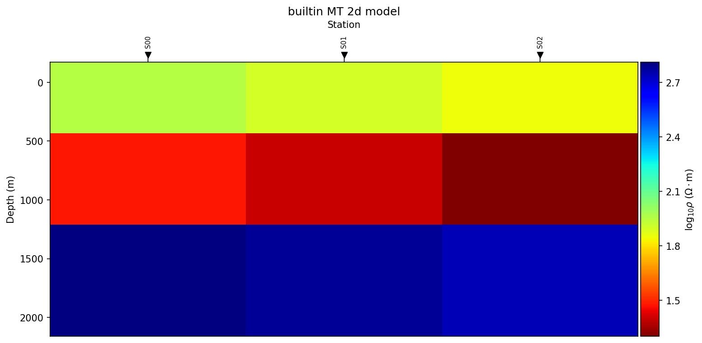
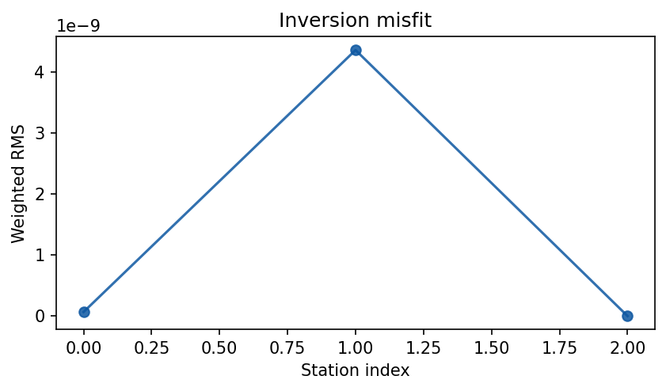

.. _user_guide_inversion_overview:

Overview
========

Before Any Inversion
---------------------

Do not start with a solver. Start with evidence that the data and modelling
assumptions are suitable. A reproducible inversion package should retain:

* the EDI or processed observation source and the exact processing steps;
* frequency/period band, components, units, station order, and coordinates;
* QC tables, confidence decisions, and any frequencies recovered or masked;
* static-shift, noise-removal, tensor-rotation, and dimensionality evidence;
* error floors or uncertainty model, with justification;
* chosen dimensionality: 1-D sounding, stitched 2-D profile, true 2-D, 2.5-D,
  or 3-D;
* :term:`starting model`, bounds, regularization, mesh/grid, and covariance
  controls;
* executable identity for external solvers and whether external execution was
  explicitly requested;
* residual, convergence, response-fit, and model-appraisal products.

Useful preparation pages are :doc:`../emtools/index`,
:doc:`../emtools/dimensionality`, :doc:`../models/choosing_backend`, and
:doc:`../../theory/inversion_concepts`.

Backend-Neutral Workflow
--------------------------

``pycsamt.inversion`` separates configuration, execution, results, and export:

``InversionConfig``
   Describes method, dimension, backend, data arrays, starting model, solver
   limits, error settings, backend options, and output policy.

``InversionWorkflow``
   Resolves the selected backend and runs the workflow. For external engines,
   execution remains explicit through the backend configuration.

``InversionResult``
   Stores recovered model values, diagnostics, uncertainty, history, native
   files, and conversion helpers such as ``to_resistivity_model()``.

``pycsamt.inversion.export`` and ``pycsamt.inversion.plot``
   Write common products and quick-look figures from a result object.

At a glance, backend names accepted by the common API include:

.. list-table::
   :header-rows: 1
   :widths: 18 32 50

   * - Backend
     - Main use
     - Notes
   * - ``builtin``
     - Lightweight local inversion
     - MT/AMT/CSAMT layered 1-D, TDEM 1-D, stitched 2-D profiles, and optional
       finite-difference 2-D profile experiments.
   * - ``occam2d``
     - Smooth 2-D profile inversion
     - Prepares/validates native Occam2D files and can run an external
       executable when configured.
   * - ``modem``
     - 2-D or 3-D ModEM workflow
     - Manages native ModEM data/model/control/covariance conventions and
       completed-run loading.
   * - ``simpeg``
     - Optional SimPEG adapter
     - Imported only when selected and installed.
   * - ``pygimli``
     - Optional pyGIMLi adapter
     - Useful for 1-D EM modelling/inversion and stitched profile experiments.

MARE2DEM is documented under :doc:`../models/mare2dem`. It is a rich native
model integration for 2.5-D MT/CSEM projects; use it directly when the
MARE2DEM file set and finite-element workflow are the scientific target.

Minimal MT 1-D
----------------

This synthetic example uses the built-in backend so it can run without an
external solver:

.. code-block:: pycon

   >>> import numpy as np
   >>> from pycsamt.forward import LayeredModel, MT1DForward
   >>> from pycsamt.inversion import (
   ...     InversionConfig,
   ...     InversionWorkflow,
   ...     StartingModel,
   ... )

   >>> freqs = np.logspace(-2, 2, 12)
   >>> truth = LayeredModel([80.0, 25.0, 600.0], [250.0, 900.0])
   >>> response = MT1DForward(freqs=freqs).run(truth)

   >>> cfg = InversionConfig(
   ...     method="mt",
   ...     dimension="1d",
   ...     backend="builtin",
   ...     data={
   ...         "freqs": freqs,
   ...         "rho_a": response.rho_a,
   ...         "phase": response.phase,
   ...     },
   ...     starting_model=StartingModel(
   ...         resistivities=[100.0, 50.0, 500.0],
   ...         thicknesses=[300.0, 1000.0],
   ...     ),
   ...     max_iter=12,
   ... )

   >>> result = InversionWorkflow(cfg).run()
   >>> print(result.summary())
   InversionResult(method='mt', dimension='1d', backend='builtin', status='converged', rms=9.21e-15)

The :term:`RMS` here is essentially zero because the "observations" are noiseless
forward responses of a known truth model with the built-in inversion started
from a nearby model -- a sanity check, not a realistic field result. Treat
this as confirmation that the round trip (forward model -> inversion ->
recovered model) works, not as evidence about real-world convergence.

Minimal TDEM 1-D
------------------

The same pattern works for TDEM when the data vector is a time-domain decay:

.. code-block:: pycon

   >>> import numpy as np
   >>> from pycsamt.forward import LayeredModel, TEM1DForward
   >>> from pycsamt.inversion import (
   ...     InversionConfig,
   ...     InversionWorkflow,
   ...     StartingModel,
   ... )

   >>> times = np.logspace(-5, -3, 7)
   >>> truth = LayeredModel([60.0, 250.0, 900.0], [120.0, 700.0])
   >>> forward_options = {"loop_radius": 25.0, "n_freqs": 10, "n_lam": 16}
   >>> response = TEM1DForward(times=times, **forward_options).run(truth)

   >>> cfg = InversionConfig(
   ...     method="tdem",
   ...     dimension="1d",
   ...     backend="builtin",
   ...     data={"times": times, "values": response.dBz_dt},
   ...     starting_model=StartingModel(
   ...         resistivities=[80.0, 200.0, 700.0],
   ...         thicknesses=[150.0, 800.0],
   ...     ),
   ...     backend_options=forward_options,
   ...     max_iter=8,
   ... )

   >>> result = InversionWorkflow(cfg).run()
   >>> print(result.summary())
   InversionResult(method='tdem', dimension='1d', backend='builtin', status='needs_review', rms=3.83)

Unlike the noiseless MT case above, this TDEM run reports ``needs_review``
with rms=3.83 -- a real (if extreme) illustration of why
:meth:`~pycsamt.inversion.results.InversionResult.summary` and ``status``
must be checked rather than assumed. Seven time gates, an 8-iteration cap,
and a coarse three-layer starting model are not enough for this synthetic
decay to converge; do not treat a returned ``InversionResult`` as a fitted
model until its status and RMS have been reviewed.

Profile Inversion
--------------------

For a profile where each station has responses on a common frequency grid,
pass station-by-frequency arrays. Continuing the fixture above with two more
stations built the same way (``rho_by_station``/``phase_by_station`` stacked
as ``(n_stations, n_frequencies)`` arrays from three nearby
:class:`~pycsamt.forward.LayeredModel` truths):

.. code-block:: pycon

   >>> cfg = InversionConfig(
   ...     method="mt",
   ...     dimension="2d",
   ...     backend="builtin",
   ...     data={
   ...         "freqs": freqs,
   ...         "rho_a": rho_by_station,      # (n_stations, n_frequencies)
   ...         "phase": phase_by_station,    # (n_stations, n_frequencies)
   ...         "station_x": [0.0, 400.0, 800.0],
   ...         "station_names": ["S00", "S01", "S02"],
   ...     },
   ...     starting_model=StartingModel(
   ...         resistivities=[100.0, 50.0, 600.0],
   ...         thicknesses=[300.0, 900.0],
   ...     ),
   ...     max_iter=10,
   ... )
   >>> result = InversionWorkflow(cfg).run()
   >>> print(result.summary())
   InversionResult(method='mt', dimension='2d', backend='builtin', status='success', rms=1.48e-09)
   >>> model = result.to_resistivity_model()
   >>> model.rho_2d.shape
   (3, 3)

``to_resistivity_model()`` gives a :class:`pycsamt.interp.ResistivityModel`
with one column per station and one row per starting-model layer -- here
``(3, 3)`` for three stations and the three-layer ``StartingModel``. This is
the same conversion used throughout :doc:`../interpretation/workflow`.

The built-in ``dimension="2d"`` path may represent either stitched station
inversions or an opt-in finite-difference profile experiment, depending on
``backend_options``:

.. code-block:: pycon

   >>> cfg.backend_options.update(
   ...     {
   ...         "profile_mode": "fd2d",
   ...         "nx": 12,
   ...         "n_pad": 2,
   ...         "components": ("te", "tm"),
   ...     }
   ... )

Updating ``backend_options`` alone does not re-run the inversion; call
``InversionWorkflow(cfg).run()`` again to fit the ``fd2d`` profile experiment.

For production smooth 2-D profile inversion, review :doc:`../models/occam2d`.
For 3-D MT/AMT projects, review :doc:`../models/modem`. For 2.5-D MT/CSEM
finite-element projects, review :doc:`../models/mare2dem`.

Exports And Review
---------------------

All common export helpers accept an ``InversionResult``:

.. code-block:: pycon

   >>> from pycsamt.inversion import export, plot

   >>> export.to_csv(result_2d, "model.csv")
   >>> export.to_npz(result_2d, "model.npz")
   >>> export.to_geojson(result_2d, "model.geojson")
   >>> export.to_vtk(result_2d, "model.vtk")
   >>> export.to_archive(result_2d, "snapshot.zip")

   >>> # Requires rasterio.
   >>> export.to_geotiff(result_2d, "model.tif")

   >>> ax = plot.plot_model(result_2d, savepath="model.png")
   >>> ax = plot.plot_rms(result_2d, savepath="rms.png")

Both ``plot_model`` and ``plot_rms`` return the matplotlib ``Axes`` they drew
into, not a ``Figure``; get the figure back with ``ax.figure`` if you need
it (for example, to call ``fig.savefig`` yourself instead of the ``savepath``
argument). For the three-station profile result from above:

   ``plot.plot_model(result_2d)`` -- the recovered log10-resistivity section,
   station markers included.

   ``plot.plot_rms(result_2d)`` -- one marker per station, because the
   builtin backend's stitched-station 2-D path populates
   ``result.metadata["station_rms"]``. Without that key, ``plot_rms`` falls
   back to a single global bar from ``result.rms``.

Archive the configuration and review products together with these exports.
The final color section is not enough for scientific reproducibility.

Hydrogeophysical Handoff
---------------------------

Any inversion result that can be converted to ``ResistivityModel`` can enter
the :mod:`pycsamt.interp` hydrogeophysical workflow:

.. code-block:: pycon

   >>> from pycsamt.interp import EMHydroModel, PetrophysicalConfig
   >>> from pycsamt.interp.petrophysics import ArchieModel

   >>> resistivity_model = result_2d.to_resistivity_model()
   >>> hydro_cfg = PetrophysicalConfig(
   ...     petro=ArchieModel(m=1.8, n=2.0),
   ...     rho_w=20.0,
   ...     porosity_prior=0.28,
   ... )
   >>> hydro = EMHydroModel(resistivity_model, hydro_cfg, method_tag="MT").fit()
   >>> print(hydro.water_table)
   [130. 130. 130.]

The three-layer starting model used above only has three depth cells, so the
handoff here is illustrative rather than a realistic hydrogeophysical
section -- see :doc:`../interpretation/hydrogeophysics` for the full audit
and validation steps to apply before trusting a water-table detection like
this one.

Next Steps
------------

Use these pages depending on the work in front of you:

* :doc:`../models/index` for classical Occam2D, ModEM, and MARE2DEM projects.
* :doc:`../models/choosing_backend` before committing to a solver.
* :doc:`../../theory/inversion_concepts` for objective functions, RMS,
  regularization, uncertainty, resolution, and non-uniqueness.
* :doc:`../ai_inversion/index` for learned inversion workflows.
* :doc:`../interpretation/index` when moving from a model to geological or
  hydrogeophysical interpretation.
* :ref:`sphx_glr_examples_inversion` for runnable gallery examples.
