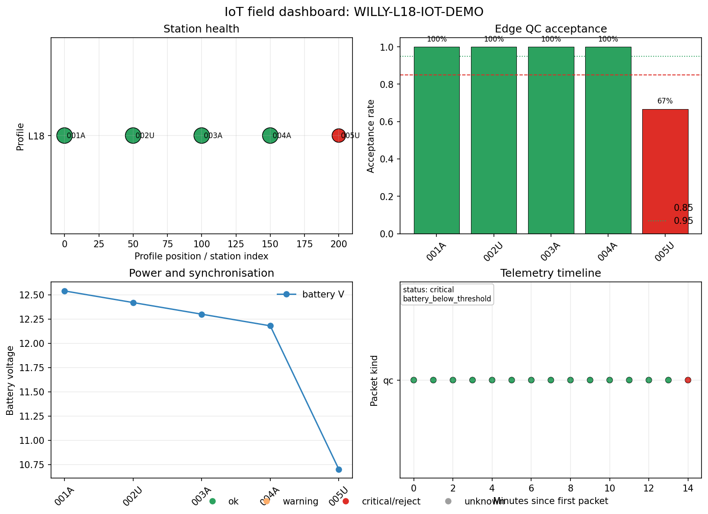

.. _user_guide_iot_basic_session:

Basic Session
=============

A :class:`pycsamt.iot.FieldSession` is the operational wrapper around an
IoT-enabled survey — the :term:`field session`. It stores field devices,
station metadata, the accumulated :term:`telemetry packet` stream,
monitoring thresholds, and the hand-off metadata that later processing can
audit.

This example uses the repository's real :term:`AMT` demo line
``data/AMT/WILLY_DATA/L18PLT`` to discover station identifiers from
:term:`EDI` filenames. The live telemetry packets are synthetic because the
EDI files represent processed survey data, not an IoT packet stream. That
split is typical in documentation and testing: use real survey inventory
where it exists, then generate explicit synthetic telemetry for the
acquisition layer.

Discover Stations From The Demo Data
------------------------------------

The station IDs are taken from the first five EDI filenames in the L18
profile. In a field deployment you would usually receive the same IDs from
the logger inventory or a station-occupation sheet.

.. code-block:: python
   :linenos:

   from pathlib import Path

   edi_dir = Path("data/AMT/WILLY_DATA/L18PLT")
   edi_files = sorted(edi_dir.glob("*.edi"))[:5]
   stations_from_data = [
       path.stem.split("-")[-1].upper()
       for path in edi_files
   ]

   print("Real data path:")
   print(f"  {edi_dir.as_posix()}")
   print("Station ids discovered from EDI filenames:")
   print(f"  {', '.join(stations_from_data)}")

Output:

.. code-block:: text

   Real data path:
     data/AMT/WILLY_DATA/L18PLT
   Station ids discovered from EDI filenames:
     001A, 002U, 003A, 004A, 005U

Create Devices And Stations
---------------------------

Each station gets one recorder node. The station IDs and profile name come
from the real demo line; chainage, dipole geometry, and IoT device IDs are
deployment metadata supplied for the example.

.. code-block:: python
   :linenos:

   from pycsamt.iot import DeviceConfig, StationConfig

   devices = []
   stations = []

   for index, (station_id, edi_file) in enumerate(
       zip(stations_from_data, edi_files),
       start=1,
   ):
       device_id = f"l18-node-{index:02d}"

       devices.append(
           DeviceConfig(
               device_id,
               station=station_id,
               protocol="file",
               sample_rate_hz=512.0,
               channels=["ex", "ey", "hx", "hy"],
               role="recorder",
               metadata={
                   "source_edi": edi_file.as_posix(),
                   "source": (
                       "real L18PLT station id from repository data"
                   ),
               },
           )
       )

       stations.append(
           StationConfig(
               station_id,
               profile="L18",
               position_m=(index - 1) * 50.0,
               channels=["ex", "ey", "hx", "hy"],
               dipole_length_m=50.0,
               ex_azimuth_deg=90.0,
               ey_azimuth_deg=0.0,
               device_ids=[device_id],
               notes=(
                   "Station id taken from data/AMT/WILLY_DATA/L18PLT; "
                   "IoT telemetry below is synthetic for documentation."
               ),
           )
       )

Build The Field Session
-----------------------

The monitoring configuration records the operational expectations for the
survey: required :term:`AMT` channels, expected packet interval, battery
limit, clock-offset limit, and frequency band.

.. code-block:: python
   :linenos:

   from pycsamt.iot import FieldSession, MonitoringConfig

   session = FieldSession(
       "WILLY-L18-IOT-DEMO",
       devices=devices,
       stations=stations,
       method="amt",
       operator="pyCSAMT documentation",
       monitoring_config=MonitoringConfig(
           method="amt",
           expected_interval_s=60.0,
           max_gap_s=90.0,
           min_packet_success_rate=0.95,
           min_edge_acceptance_rate=0.75,
           min_battery_v=11.0,
           max_clock_offset_ms=5.0,
           required_channels=["ex", "ey", "hx", "hy"],
           frequency_band_hz=(1.0, 1000.0),
       ),
       metadata={
           "real_data_path": edi_dir.as_posix(),
           "telemetry_source": "synthetic QC packets for documentation",
       },
   )

   print("Session summary:")
   print(f"  survey_id: {session.survey_id}")
   print(f"  devices: {session.n_devices}")
   print(f"  stations: {session.n_stations}")
   print(f"  packets: {session.n_packets}")

Output:

.. code-block:: text

   Session summary:
     survey_id: WILLY-L18-IOT-DEMO
     devices: 5
     stations: 5
     packets: 0

Add Synthetic QC Telemetry
--------------------------

The next block creates synthetic ``qc`` :term:`telemetry packet`\ s. Four
stations report accepted windows. The last station reports one rejected
window and a low battery value so that the :term:`monitoring status` has
something useful to flag.

.. code-block:: python
   :linenos:

   import numpy as np

   from pycsamt.iot import PacketKind, TelemetryPacket

   rng = np.random.default_rng(7)
   base_time = 1_700_000_000.0

   for index, (device, station) in enumerate(zip(devices, stations)):
       for packet_index in range(3):
           accepted = not (
               station.station_id == stations[-1].station_id
               and packet_index == 2
           )
           battery_v = 12.6 - 0.12 * index - 0.03 * packet_index
           if (
               station.station_id == stations[-1].station_id
               and packet_index == 2
           ):
               battery_v = 10.7

           payload = {
               "method": "amt",
               "station": station.station_id,
               "channels": ["ex", "ey", "hx", "hy"],
               "frequency_band_hz": [1.0, 1000.0],
               "accepted": accepted,
               "decision": "accept" if accepted else "reject",
               "battery_v": battery_v,
               "clock_offset_ms": float(rng.normal(1.2, 0.35)),
               "latency_s": float(rng.uniform(1.5, 4.5)),
           }

           session.add_packet(
               TelemetryPacket.from_device(
                   device,
                   timestamp=base_time + index * 180 + packet_index * 60,
                   payload=payload,
                   kind=PacketKind.QC,
                   survey_id=session.survey_id,
               )
           )

Mathematical Definitions
------------------------

``session.assess`` enriches each :term:`telemetry packet` payload, then
reduces the stream to a :term:`monitoring status`. Every quantity below is
reproducible outside pyCSAMT from the raw packet payloads.

The :term:`packet success rate` is the mean of the transport
acknowledgement flag :math:`a_i \in \{0, 1\}` (``ack_ok``, true by default
when absent) over the :math:`N` packets in the stream:

.. math::

   R_\mathrm{packet} = \frac{1}{N} \sum_{i=1}^{N} a_i.

The :term:`edge acceptance rate` only considers the subset of :math:`M \le
N` packets that carry an edge :term:`quality control` decision
:math:`d_j \in \{0, 1\}` (``accepted``/``decision`` in the payload). It is
defined as

.. math::

   R_\mathrm{edge} =
   \begin{cases}
   \dfrac{1}{M} \sum_{j=1}^{M} d_j & M > 0 \\[4pt]
   1 & M = 0,
   \end{cases}

so a stream with no edge decisions at all defaults to full acceptance
rather than being penalised for missing metadata. In this example
:math:`N = M = 15`, giving :math:`R_\mathrm{packet} = 1.0` (every packet
was acknowledged) and :math:`R_\mathrm{edge} = 14/15 \approx 0.933` (one
rejected window on the last station).

The remaining status fields are simple order statistics over the packet
timestamps :math:`t_i`, battery readings :math:`v_i`, and clock offsets
:math:`c_i`:

.. math::

   g_\mathrm{max} = \max_i \left( t_{(i+1)} - t_{(i)} \right), \qquad
   v_\mathrm{min} = \min_i v_i, \qquad
   c_\mathrm{max} = \max_i |c_i|,

with :math:`t_{(i)}` the sorted timestamps. ``session.assess`` compares
these five quantities against the thresholds in
:class:`~pycsamt.iot.MonitoringConfig` (``min_packet_success_rate``,
``min_edge_acceptance_rate``, ``min_battery_v``, ``max_clock_offset_ms``,
``max_gap_s``/``expected_interval_s``), plus method and channel coverage
checks. Any violated threshold is recorded as an issue string; the overall
:term:`monitoring status` level is ``critical`` if the violated set
intersects a fixed critical subset (packet success, edge acceptance,
battery, clock offset, method mismatch, or missing required channels),
``warning`` if other issues remain, and ``ok`` otherwise. Here the low
battery reading on the last packet (``10.7`` V, below ``min_battery_v =
11.0``) alone is enough to set the level to ``critical``.

The :term:`pipeline hand-off` reports a *per-station* acceptance rate
rather than the stream-wide :math:`R_\mathrm{edge}`. For station
:math:`s` with :math:`n_\mathrm{accept}(s)` accepted and
:math:`n_\mathrm{reject}(s)` rejected packets,

.. math::

   R_\mathrm{edge}(s) =
   \frac{n_\mathrm{accept}(s)}{n_\mathrm{accept}(s) + n_\mathrm{reject}(s)},

which is why the first two stations below report ``1.00`` even though the
stream-wide :math:`R_\mathrm{edge}` is below one.

Inspect The Session Tables
--------------------------

The :term:`field session` can produce station tables, packet tables, a
:term:`monitoring status`, and a compact :term:`pipeline hand-off`.

.. code-block:: python
   :linenos:

   from pycsamt.iot import monitoring_status_table, packet_table

   print("Session summary:")
   print(f"  survey_id: {session.survey_id}")
   print(f"  devices: {session.n_devices}")
   print(f"  stations: {session.n_stations}")
   print(f"  packets: {session.n_packets}")
   print()

   station_df = session.station_table()
   print("Station table:")
   print(
       station_df[
           ["station_id", "profile", "position_m",
            "channels", "device_ids"]
       ].to_string(index=False)
   )
   print()

   packet_df = packet_table(session.packets)
   print("Packet table:")
   print(
       packet_df[
           ["device_id", "kind", "timestamp", "payload_keys"]
       ].head(5).to_string(index=False)
   )
   print()

   status = session.assess(now=base_time + 900.0)
   status_df = monitoring_status_table(status)
   print("Monitoring status:")
   print(
       status_df[
           ["level", "n_packet", "packet_success_rate",
            "edge_acceptance_rate", "battery_min_v", "issues"]
       ].to_string(index=False)
   )
   print()

   pipeline = session.to_pipeline_input()
   print("Pipeline hand-off, first two stations:")
   for row in pipeline["stations"][:2]:
       print(
           "  "
           f"{row['station_id']}: "
           f"n_packets={row['n_packets']}, "
           f"acceptance_rate={row['acceptance_rate']:.2f}, "
           f"band={row['accepted_band_hz']}"
       )

Output:

.. code-block:: text

   Session summary:
     survey_id: WILLY-L18-IOT-DEMO
     devices: 5
     stations: 5
     packets: 15

   Station table:
   station_id profile  position_m    channels  device_ids
         001A     L18         0.0 ex;ey;hx;hy l18-node-01
         002U     L18        50.0 ex;ey;hx;hy l18-node-02
         003A     L18       100.0 ex;ey;hx;hy l18-node-03
         004A     L18       150.0 ex;ey;hx;hy l18-node-04
         005U     L18       200.0 ex;ey;hx;hy l18-node-05

   Packet table:
     device_id kind    timestamp                                                                                    payload_keys
   l18-node-01   qc 1700000000.0 accepted;battery_v;channels;clock_offset_ms;decision;frequency_band_hz;latency_s;method;station
   l18-node-01   qc 1700000060.0 accepted;battery_v;channels;clock_offset_ms;decision;frequency_band_hz;latency_s;method;station
   l18-node-01   qc 1700000120.0 accepted;battery_v;channels;clock_offset_ms;decision;frequency_band_hz;latency_s;method;station
   l18-node-02   qc 1700000180.0 accepted;battery_v;channels;clock_offset_ms;decision;frequency_band_hz;latency_s;method;station
   l18-node-02   qc 1700000240.0 accepted;battery_v;channels;clock_offset_ms;decision;frequency_band_hz;latency_s;method;station

   Monitoring status:
      level  n_packet  packet_success_rate  edge_acceptance_rate  battery_min_v                  issues
   critical        15                  1.0              0.933333           10.7 battery_below_threshold

   Pipeline hand-off, first two stations:
     001A: n_packets=3, acceptance_rate=1.00, band=[1.0, 1000.0]
     002U: n_packets=3, acceptance_rate=1.00, band=[1.0, 1000.0]

Plot The Basic Session
----------------------

The field dashboard gives a quick operational view of station health,
edge-:term:`QC` acceptance, battery/synchronisation state, and packet
timing.

.. code-block:: python
   :linenos:

   from pathlib import Path

   from pycsamt.iot import plot_field_dashboard

   out_dir = Path("docs/source/images/user_guide/iot")
   out_dir.mkdir(parents=True, exist_ok=True)

   plot_field_dashboard(
       session,
       now=base_time + 900.0,
       station_axis="profile",
       figsize=(10.8, 7.8),
       output_path=(
           out_dir / "user-guide-iot-basic-session-01.png"
       ).as_posix(),
       close=True,
   )

What To Carry Forward
---------------------

The station inventory is grounded in the real L18 demo dataset, while the
telemetry is synthetic and explicitly marked as such. That distinction is
important: :term:`EDI` files are downstream geophysical products, but an
IoT :term:`field session` records the operational evidence around
acquisition. The :term:`pipeline hand-off` keeps those layers connected by
carrying station IDs, channels, frequency-band coverage, packet counts, and
acceptance rates forward into later processing or reporting.

Core Concepts
-------------

``DeviceConfig``
   A recorder, gateway, remote-reference node, or sensor node. It stores
   protocol, sample rate, station assignment, channels, and role.

``StationConfig``
   A field occupation location. It stores coordinates, profile chainage,
   channel list, dipole geometry, orientation, operator, and attached
   devices.

``TelemetryPacket``
   A timestamped message with a canonical topic and payload. Packet kinds
   include ``data``, ``qc``, ``health``, ``sync``, ``power``, ``event``,
   and ``source`` (controlled-source transmitter telemetry).

``FieldSession``
   A stateful survey container that links devices, stations, packets,
   monitoring, station tables, pipeline inputs, and provenance manifests.

``MethodProfile``
   Canonical acquisition characteristics for an :class:`~pycsamt.iot.monitoring.EMMethod`
   (AMT, MT, CSAMT, CSEM, TDEM/TEM): frequency band, required channels,
   nominal sample rate, and controlled-source / powerline-sensitivity
   flags. Profiles drive method-aware QC.

Scope Note
----------

The IoT layer records operational evidence around acquisition. It does not
change the electromagnetic inversion itself.

Edge packets can record finite-data coverage, spike and harmonic
contamination indicators, frequency coverage, channel health, and
accept/reject decisions. These metrics help identify poor acquisition
windows and operational faults before downstream AMT/CSAMT processing.
