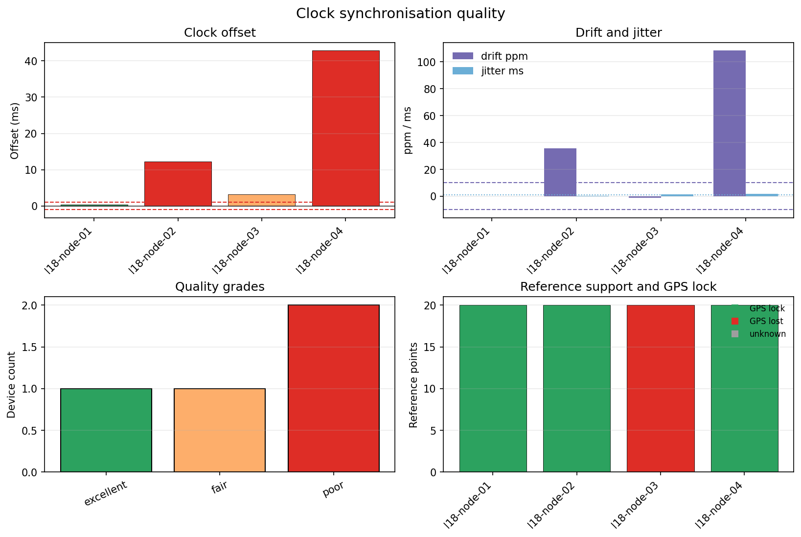

.. _user_guide_iot_clock_sync:

Clock Synchronisation
=====================

Clock synchronisation is part of acquisition quality control. A station
can have excellent electrodes and clean spectra, but poor timing still
damages transfer-function estimates, remote-reference work, and any
comparison between stations. The :mod:`pycsamt.iot.sync` helpers audit
device clocks against a reference such as GPS.

The examples below use synthetic timestamps. That is intentional:
synchronisation checks need paired local/reference clock samples, not EDI
impedance files. The synthetic devices represent common field cases: one
healthy GPS-locked node, one drifting node, one node that lost GPS lock,
and one badly drifting node.

What Is Measured
----------------

``offset_ms``
   Median local-reference timestamp offset in milliseconds.

``drift_ppm``
   Linear clock drift in parts per million, estimated from offset change
   through time.

``jitter_ms``
   Standard deviation of drift-corrected timing residuals.

``gps_lock``
   Whether the node reports active GPS/reference lock.

``quality``
   A compact grade: ``excellent``, ``good``, ``fair``, ``poor``, or
   ``unknown``.

Build Synthetic Reference Samples
---------------------------------

The reference clock is sampled every 30 seconds for 10 minutes. Local
device clocks are then offset, drifted, and jittered to create realistic
audit cases.

.. code-block:: python
   :linenos:

   import numpy as np

   rng = np.random.default_rng(24)
   reference = np.arange(0.0, 600.0, 30.0)

   node_good = (
       reference
       + 0.00035
       + rng.normal(0.0, 0.00008, reference.size)
   )
   node_drift = (
       reference
       + 0.002
       + 35e-6 * reference
       + rng.normal(0.0, 0.00035, reference.size)
   )
   node_dropout = (
       reference
       + 0.0035
       + rng.normal(0.0, 0.0012, reference.size)
   )
   node_bad = (
       reference
       + 0.012
       + 110e-6 * reference
       + rng.normal(0.0, 0.002, reference.size)
   )

Assess Individual Devices
-------------------------

Use :class:`pycsamt.iot.ClockSynchronizer` when you already have local
and reference timestamps for one device. The thresholds in
:class:`pycsamt.iot.SyncConfig` define what counts as acceptable for this
deployment.

.. code-block:: python
   :linenos:

   from pycsamt.iot import ClockSynchronizer, SyncConfig, sync_status_table

   config = SyncConfig(
       tolerance_ms=1.0,
       reference="gps",
       max_drift_ppm=10.0,
       max_jitter_ms=1.0,
   )
   synchronizer = ClockSynchronizer(config)

   status = synchronizer.assess(
       "l18-node-01",
       node_good,
       reference,
       gps_lock=True,
   )

   table = sync_status_table(status)
   print(
       table[
           [
               "device_id", "offset_ms", "drift_ppm", "jitter_ms",
               "within_tolerance", "gps_lock", "quality",
           ]
       ].to_string(index=False)
   )

Output:

.. code-block:: text

     device_id  offset_ms  drift_ppm  jitter_ms  within_tolerance  gps_lock   quality
   l18-node-01   0.344218  -0.004302   0.068069              True      True excellent

Assess A Deployment
-------------------

For a deployment, keep one :class:`~pycsamt.iot.SyncStatus` per node and
turn the list into a table. This makes the failure mode visible: the
second and fourth nodes exceed drift or offset limits, while the third
node is capped at ``fair`` because GPS lock was lost.

.. code-block:: python
   :linenos:

   statuses = [
       synchronizer.assess(
           "l18-node-01", node_good, reference, gps_lock=True
       ),
       synchronizer.assess(
           "l18-node-02", node_drift, reference, gps_lock=True
       ),
       synchronizer.assess(
           "l18-node-03", node_dropout, reference, gps_lock=False
       ),
       synchronizer.assess(
           "l18-node-04", node_bad, reference, gps_lock=True
       ),
   ]

   table = sync_status_table(statuses)
   print(
       table[
           [
               "device_id", "offset_ms", "drift_ppm", "jitter_ms",
               "within_tolerance", "gps_lock", "quality",
           ]
       ].to_string(index=False)
   )

Output:

.. code-block:: text

     device_id  offset_ms  drift_ppm  jitter_ms  within_tolerance  gps_lock   quality
   l18-node-01   0.344218  -0.004302   0.068069              True      True excellent
   l18-node-02  12.276217  35.547894   0.392135             False      True      poor
   l18-node-03   3.162285  -1.116131   1.383608             False     False      fair
   l18-node-04  42.897972 108.638919   1.678547             False      True      poor

Use The Batch Helper
--------------------

When references are already arranged by device, use
:func:`pycsamt.iot.batch_assess_sync`. Each value can be a mapping with
``local``, ``reference``, and optional ``gps_lock`` fields.

.. code-block:: python
   :linenos:

   from pycsamt.iot import batch_assess_sync

   batch = batch_assess_sync(
       {
           "l18-node-01": {
               "local": node_good,
               "reference": reference,
               "gps_lock": True,
           },
           "l18-node-02": {
               "local": node_drift,
               "reference": reference,
               "gps_lock": True,
           },
       },
       config=config,
   )
   print(
       batch[
           ["device_id", "within_tolerance", "quality"]
       ].to_string(index=False)
   )

Output:

.. code-block:: text

     device_id  within_tolerance   quality
   l18-node-01              True excellent
   l18-node-02             False      poor

Detect GPS Dropout
------------------

Use :func:`pycsamt.iot.detect_gps_dropout` to summarise lock/unlock
sequences. This is different from timestamp-pair assessment: it asks
whether the device had enough reference support during the acquisition
period.

.. code-block:: python
   :linenos:

   from pycsamt.iot import detect_gps_dropout

   gps_lock = [True] * 8 + [False] * 3 + [True] * 6 + [False] * 2 + [True]
   dropout = detect_gps_dropout(
       gps_lock,
       timestamps=np.arange(len(gps_lock)) * 30.0,
       min_lock_fraction=0.9,
   )

   for key in [
       "n_samples",
       "n_locked",
       "lock_fraction",
       "n_dropout_events",
       "longest_dropout_samples",
       "longest_dropout_s",
       "ok",
   ]:
       value = dropout[key]
       if isinstance(value, float):
           print(f"{key}: {value:.3f}")
       else:
           print(f"{key}: {value}")

Output:

.. code-block:: text

   n_samples: 20
   n_locked: 15
   lock_fraction: 0.750
   n_dropout_events: 2
   longest_dropout_samples: 3
   longest_dropout_s: 90.000
   ok: False

Plot Synchronisation Quality
----------------------------

The plotting helper summarises offset, drift, jitter, GPS lock, reference
support, and quality grades. For more than one figure, IoT guide pages use
grids; this page has a single combined diagnostic figure.

.. code-block:: python
   :linenos:

   from pathlib import Path

   from pycsamt.iot import plot_sync_quality

   out_dir = Path("docs/source/images/user_guide/iot")
   out_dir.mkdir(parents=True, exist_ok=True)

   plot_sync_quality(
       statuses,
       tolerance_ms=config.tolerance_ms,
       max_drift_ppm=config.max_drift_ppm,
       max_jitter_ms=config.max_jitter_ms,
       figsize=(10.8, 7.2),
       output_path=(
           out_dir / "user-guide-iot-clock-sync-01.png"
       ).as_posix(),
       close=True,
   )

Field Interpretation
--------------------

The first node is suitable for timing-sensitive processing. Its offset is
well below the 1 ms tolerance, drift is nearly zero, and jitter is small.
The second and fourth nodes should be corrected or excluded from
time-critical windows because their offsets and drift exceed the configured
limits. The third node has moderate offset but no GPS lock, so its grade
is limited even though the drift estimate itself is not severe.

In a field workflow, store these status rows as ``sync`` telemetry packets
or attach them to the acquisition manifest. That keeps the timing evidence
next to the QC, power, and station metadata used by later processing.
