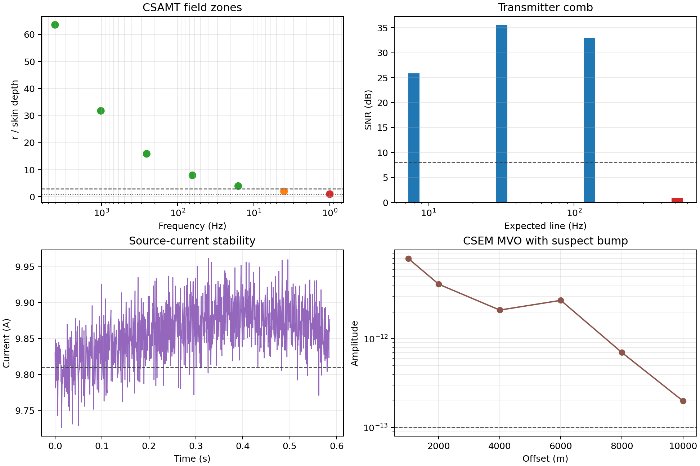

.. _user_guide_iot_controlled_source:

Controlled-Source Edge QC (CSAMT / CSEM)
========================================

Natural-source :term:`AMT`/:term:`MT` diagnostics (:doc:`amt_diagnostics`)
assume a :term:`plane-wave field` with no operator-controlled
transmitter. :term:`Controlled-source` methods, especially :term:`CSAMT`
and :term:`CSEM`, add a :term:`grounded dipole transmitter`. That changes
the field questions at the edge: is the receiver far enough from the
source for a plane-wave interpretation, is there resolvable energy at
every transmitted line, and is the :term:`source current` steady enough
to trust the sounding? The :mod:`pycsamt.iot.edge_csamt` and
:mod:`pycsamt.iot.edge_csem` modules answer these questions with
numpy-only checks on short edge windows, reusing the same spectral
helpers as :mod:`pycsamt.iot.edge_amt`.

A ``transmitter`` device role and a ``source`` :term:`telemetry packet`
let a transmitter node report its state alongside the receivers. The
examples below use synthetic data so the same outputs can be reproduced
without an EDI file or a field logger export.

Synthetic Controlled-Source Window
----------------------------------

This first block creates one CSAMT-like receiver window and matching
transmitter telemetry. The expected :term:`transmitter frequency comb` is
8, 32, 128, and 512 Hz, but the synthetic signal only contains the first
three lines — that deliberate missing line is what makes the
frequency-comb check below worth running. The CSEM amplitude curve also
contains a small bump at 6000 m so the monotonic-decay check has
something real to flag.

.. code-block:: pycon

   >>> import numpy as np
   >>> rng = np.random.default_rng(51)
   >>> sample_rate = 2048.0
   >>> n_samples = 8192
   >>> t = np.arange(n_samples) / sample_rate
   >>> tx_frequencies = np.array([8.0, 32.0, 128.0, 512.0])
   >>> window = (
   ...     0.18 * np.sin(2 * np.pi * 8.0 * t)
   ...     + 0.32 * np.sin(2 * np.pi * 32.0 * t)
   ...     + 0.24 * np.sin(2 * np.pi * 128.0 * t)
   ...     + 0.035 * rng.standard_normal(n_samples)
   ... )
   >>> tx_current = (
   ...     9.8 + 0.08 * np.sin(2 * np.pi * 0.6 * t)
   ...     + 0.03 * rng.standard_normal(n_samples)
   ... )
   >>> tx_voltage = 248.0 + 1.2 * rng.standard_normal(n_samples)
   >>> offsets_m = np.array([1000, 2000, 4000, 6000, 8000, 10000], dtype=float)
   >>> amplitudes = np.array([8.0e-12, 4.1e-12, 2.1e-12, 2.7e-12, 7.0e-13, 2.0e-13])
   >>> phases = np.array([-8.0, -16.0, -29.0, -44.0, -61.0, -79.0])

Skin-Depth Field Zones
----------------------

The controlling CSAMT quantity is not offset alone, but the
:term:`transmitter-receiver offset` expressed in :term:`skin depth`
units. For resistivity :math:`\rho` in :math:`\Omega\,m` and frequency
:math:`f` in Hz, pyCSAMT uses

.. math::

   \delta(f) = 503.29\sqrt{\frac{\rho}{f}},
   \qquad q(f)=\frac{r}{\delta(f)}.

Here :math:`r` is the transmitter-receiver separation and :math:`q` is
the offset ratio. A frequency is labelled ``near`` when :math:`q \le 1`,
``far`` when :math:`q \ge 3`, and ``transition`` between those limits.
High frequencies have smaller skin depth, so they usually reach the far
field first — which is exactly why the sweep below runs from 4096 Hz
down to 1 Hz rather than the other way around.

.. code-block:: pycon

   >>> from pycsamt.iot import classify_field_zones
   >>> freqs = np.array([4096.0, 1024.0, 256.0, 64.0, 16.0, 4.0, 1.0])
   >>> cov = classify_field_zones(freqs, resistivity=100.0, offset_m=5000.0)
   >>> for f, d, ratio, zone in zip(cov.freq_hz, cov.skin_depth_m, cov.offset_ratio, cov.zones):
   ...     print(f"{f:7.1f} Hz  skin={d:8.1f} m  r/delta={ratio:5.2f}  zone={zone}")
    4096.0 Hz  skin=    78.6 m  r/delta=63.58  zone=far
    1024.0 Hz  skin=   157.3 m  r/delta=31.79  zone=far
     256.0 Hz  skin=   314.6 m  r/delta=15.90  zone=far
      64.0 Hz  skin=   629.1 m  r/delta= 7.95  zone=far
      16.0 Hz  skin=  1258.2 m  r/delta= 3.97  zone=far
       4.0 Hz  skin=  2516.5 m  r/delta= 1.99  zone=transition
       1.0 Hz  skin=  5032.9 m  r/delta= 0.99  zone=near
   >>> print(f"all_far_field: {cov.all_far_field}")
   all_far_field: False
   >>> print(f"correction_recommended: {cov.correction_recommended}")
   correction_recommended: True
   >>> print(f"first_far_field_hz: {cov.first_far_field_hz():.1f}")
   first_far_field_hz: 16.0

Five of the seven rows clear the far-field ratio of 3 comfortably, some by
more than an order of magnitude. The two low-frequency rows are the ones
to treat carefully: 4 Hz lands at ``r/delta = 1.99``, inside the
transition band, and 1 Hz at ``0.99`` is just barely inside the near
field. A :term:`near-field correction` is recommended the moment either
row appears, which is why ``correction_recommended`` is ``True`` here
even though most of the sweep is safely far field.

Transmitter Frequency Comb
--------------------------

CSAMT transmits a discrete frequency comb rather than the continuous
natural spectrum used by passive AMT/MT. For each expected line
:math:`f_k`, pyCSAMT compares the peak :term:`power spectral density`
inside a narrow band around :math:`f_k` with the median positive PSD
floor :math:`P_{50}`:

.. math::

   \operatorname{SNR}_k =
   10\log_{10}\left(\frac{\max P(f \approx f_k)}{P_{50}}\right).

A line is detected when that SNR reaches the configured threshold and the
line is below Nyquist.

.. code-block:: pycon

   >>> from pycsamt.iot import detect_transmitter_frequencies
   >>> comb = detect_transmitter_frequencies(
   ...     window, sample_rate=sample_rate, tx_frequencies=tx_frequencies,
   ...     snr_threshold_db=8.0,
   ... )
   >>> print(f"detected lines: {comb.n_detected} of {comb.n_expected}")
   detected lines: 3 of 4
   >>> print(f"missing lines: {comb.missing()}")
   missing lines: [512.0]
   >>> for line in comb.lines:
   ...     print(f"{line.frequency_hz:6.1f} Hz  snr={line.snr_db:6.2f} dB  detected={line.detected}")
      8.0 Hz  snr= 25.89 dB  detected=True
     32.0 Hz  snr= 35.50 dB  detected=True
    128.0 Hz  snr= 32.98 dB  detected=True
    512.0 Hz  snr=  0.87 dB  detected=False

The three lines that were actually built into ``window`` all clear the
8 dB threshold by more than 25 dB — the comb detector is not marginal
about them. The 512 Hz line, never added to the synthetic signal in the
first place, reports 0.87 dB: indistinguishable from the noise floor,
exactly as a genuinely silent transmitter line should look. This is the
one deliberately planted failure on the page, and the detector finds it
without being told which line was missing.

Source-Signal Stability
-----------------------

The transmitter current sets the signal level of every sounding, so its
steadiness bounds the receiver-side data quality. The source-stability
check first identifies the on-state samples as those above a fraction of
the peak absolute current. On those samples it reports the mean current
:math:`\bar I`, the :term:`coefficient of variation`

.. math::

   \mathrm{CV}_I = \frac{\operatorname{std}(I_\mathrm{on})}
                        {|\operatorname{mean}(I_\mathrm{on})|},

and a simple drift amplitude, estimated as the absolute slope of
on-state current versus sample index multiplied by the number of on-state
samples. A source is unstable when the current CV exceeds ``max_cv`` or
when no finite current is present.

.. code-block:: pycon

   >>> from pycsamt.iot import assess_source_stability
   >>> status = assess_source_stability(tx_current, tx_voltage=tx_voltage)
   >>> print(f"stable: {status.stable}")
   stable: True
   >>> print(f"current_mean_a: {status.current_mean_a:.3f}")
   current_mean_a: 9.810
   >>> print(f"current_cv: {status.current_cv:.4f}")
   current_cv: 0.0066
   >>> print(f"current_drift_a: {status.current_drift_a:.3f}")
   current_drift_a: 0.005
   >>> print(f"on_fraction: {status.on_fraction:.2f}")
   on_fraction: 1.00
   >>> print(f"voltage_mean_v: {status.voltage_mean_v:.2f}")
   voltage_mean_v: 247.98

A CV of 0.0066 is well inside the default ``max_cv = 0.05``, and
``on_fraction = 1.00`` says the synthetic transmitter never keyed off
during this window, so every sample counts toward the on-state
statistics. This particular source is easy to trust; a transmitter with a
failing power supply or a loose ground connection would instead show a
current CV rising toward, then past, ``max_cv``.

CSEM Offset Response
--------------------

:term:`CSEM` records a dipole source with a :term:`receiver array`, and
its signature edge product is the response as a function of offset at
each frequency. :func:`~pycsamt.iot.edge_csem.field_vs_offset` builds the
:term:`magnitude-versus-offset` and :term:`phase-versus-offset` curve,
finds the :term:`detectability limit`, and checks that detectable
amplitude decays monotonically with offset.

For detectable amplitudes :math:`A_i`, the dynamic range is

.. math::

   D_\mathrm{dB} = 20\log_{10}
   \left(\frac{\max(A_i)}{\min(A_i)}\right).

The monotonic check allows a small tolerance :math:`\tau` and flags a
reading when :math:`A_{i+1} > A_i(1+\tau)`. A bump can mean a bad
receiver, a geometry error, or real 3-D structure worth revisiting.

.. code-block:: pycon

   >>> from pycsamt.iot import field_vs_offset
   >>> resp = field_vs_offset(
   ...     offsets_m=offsets_m, amplitudes=amplitudes, phases_deg=phases,
   ...     noise_floor=1e-13, frequency_hz=1.0,
   ... )
   >>> print(f"n_detectable: {resp.n_detectable} of {resp.n_offsets}")
   n_detectable: 6 of 6
   >>> print(f"max_detectable_offset_m: {resp.max_detectable_offset_m:.0f}")
   max_detectable_offset_m: 10000
   >>> print(f"monotonic_decay: {resp.monotonic_decay}")
   monotonic_decay: False
   >>> print(f"dynamic_range_db: {resp.dynamic_range_db:.2f}")
   dynamic_range_db: 32.04
   >>> print(f"above_noise: {resp.above_noise}")
   above_noise: [True, True, True, True, True, True]

Every offset stays above the :math:`10^{-13}` noise floor, so
``n_detectable`` is a clean 6 of 6 and the reported dynamic range spans
the full curve. ``monotonic_decay`` is ``False`` for exactly the reason
the synthetic data was built that way: the amplitude at 4000 m
(:math:`2.1\times10^{-12}`) rises to :math:`2.7\times10^{-12}` at 6000 m,
a 29% jump that clears the default 5% ``monotonic_tol`` easily, before
the curve resumes its decay out to 10000 m. A real bump of that shape at
one offset, surrounded by an otherwise clean decay, is a much stronger
signal of a local problem — a bad receiver, a geometry error — than a
gently increasing trend would be.

Transmitter Telemetry
---------------------

A transmitter node reports its state as a ``source`` packet, parsed by the
``SourcePayload`` schema with the same tolerant alias folding and range
validation as the other payloads. In the example below, ``current``,
``tx_voltage``, ``frequency``, ``ab_m``, and ``tx_rx_offset`` are all
normalised to canonical payload fields.

.. code-block:: pycon

   >>> from pycsamt.iot import DeviceConfig, FieldSession, parse_payload
   >>> tx = DeviceConfig("tx-1", role="transmitter")
   >>> payload = parse_payload("source", {
   ...     "tx_id": "TX1", "current": 9.8, "tx_voltage": 250.0,
   ...     "frequency": 32.0, "ab_m": 100.0, "tx_rx_offset": 5000.0,
   ... })
   >>> session = FieldSession("CS1", method="csamt", devices=[tx])
   >>> _ = session.add_packet({
   ...     "device_id": "tx-1", "timestamp": 10.0, "topic": tx.topic("source"),
   ...     "kind": "source", "payload": payload.as_dict(),
   ... })
   >>> print(
   ...     "payload current/frequency/offset: "
   ...     f"{payload.tx_current_a:.1f} A, {payload.tx_frequency_hz:.1f} Hz, {payload.offset_m:.0f} m"
   ... )
   payload current/frequency/offset: 9.8 A, 32.0 Hz, 5000 m
   >>> print(f"session packets: {len(session.packets)}")
   session packets: 1

The raw payload keys (``current``, ``tx_voltage``, ``frequency``,
``tx_rx_offset``) never appear again after ``parse_payload`` runs — every
downstream read goes through the canonical ``tx_current_a``,
``tx_voltage_a``, ``tx_frequency_hz``, and ``offset_m`` attributes, so a
transmitter reporting under a slightly different vendor-specific key name
would parse into exactly the same shape.

Static Shift Estimate
---------------------

A galvanic :term:`static shift` multiplies :term:`apparent resistivity`
by a frequency-independent factor while leaving :term:`phase` nearly
unchanged. pyCSAMT estimates the per-period log split between the ``xy``
and ``yx`` modes,

.. math::

   s_i = \log_{10}\rho_{xy,i} - \log_{10}\rho_{yx,i},
   \qquad G = 10^{\operatorname{median}(s_i)}.

The result is a static-shift candidate when the median split is large
enough, the standard deviation of :math:`s_i` is small enough, and the
mean phase difference stays below the phase threshold.

.. code-block:: pycon

   >>> periods = np.logspace(-3, 1, 12)
   >>> res_yx = 80.0 * (1 + 0.08 * np.sin(np.linspace(0, np.pi, periods.size)))
   >>> res_xy = 3.0 * res_yx
   >>> phi_yx = 42.0 + 1.5 * np.sin(np.linspace(0, 2 * np.pi, periods.size))
   >>> phi_xy = phi_yx + 1.2
   >>> from pycsamt.iot import estimate_static_shift
   >>> ss = estimate_static_shift(res_xy, res_yx, phase_xy=phi_xy, phase_yx=phi_yx)
   >>> print(f"static_shift: {ss.static_shift}")
   static_shift: True
   >>> print(f"shift_factor: {ss.shift_factor:.2f}")
   shift_factor: 3.00
   >>> print(f"split_decades: {ss.split_decades:.3f}")
   split_decades: 0.477
   >>> print(f"consistency_std: {ss.consistency_std:.3f}")
   consistency_std: 0.000
   >>> print(f"phase_diff_deg: {ss.phase_diff_deg:.2f}")
   phase_diff_deg: 1.20

``res_xy`` was built as exactly three times ``res_yx`` at every period, so
the recovered ``shift_factor`` of 3.00 is not a coincidence — it is the
constant this synthetic data was designed to hide, and
``consistency_std: 0.000`` confirms the split is perfectly
frequency-independent because both curves share the same oscillation
before the multiplication. The 1.2-degree constant offset added to
``phi_xy`` stays far under the default 10-degree phase threshold, which
is what a true galvanic distortion should look like: parallel resistivity
curves on a log scale with matching phase.

Transmitter Timing Lock
-----------------------

A CSAMT/CSEM receiver can also report its :term:`transmitter timing lock`
alongside normal clock synchronisation, using the ``tx_locked``,
``tx_sync_offset_ms``, and ``tx_id`` fields of the ``sync`` payload.

.. code-block:: pycon

   >>> sync = parse_payload("sync", {
   ...     "offset_ms": 0.4, "transmitter_locked": True,
   ...     "tx_offset_ms": 0.2, "tx_id": "TX1",
   ... })
   >>> print(f"tx_locked: {sync.tx_locked}")
   tx_locked: True
   >>> print(f"tx_sync_offset_ms: {sync.tx_sync_offset_ms:.1f}")
   tx_sync_offset_ms: 0.2

Note that ``tx_sync_offset_ms`` (0.2 ms, how far the receiver's clock sits
from the transmitter's own timing) is a different number from the
``offset_ms`` field (0.4 ms) this same payload also carries for ordinary
GPS/network synchronisation — a receiver can be well locked to a GPS
reference and still drift slightly from the transmitter, or vice versa,
so the two offsets are tracked independently rather than collapsed into
one.

The Controlled-Source Figure
----------------------------

The same synthetic objects can be rendered as a compact four-panel field
summary: field-zone ratio, transmitter-comb SNR, source-current
stability, and the CSEM offset response. None of these four views has a
dedicated ``plot_*`` helper, so the figure is written directly against
``matplotlib`` from the values already computed above.

.. code-block:: pycon

   >>> from pathlib import Path
   >>> import matplotlib.pyplot as plt
   >>> out_dir = Path("docs/source/images/user_guide/iot")
   >>> out_dir.mkdir(parents=True, exist_ok=True)
   >>> fig, axes = plt.subplots(2, 2, figsize=(10.8, 7.2), constrained_layout=True)
   >>> zone_colors = {"near": "tab:red", "transition": "tab:orange", "far": "tab:green"}
   >>> _ = axes[0, 0].scatter(cov.freq_hz, cov.offset_ratio, c=[zone_colors[z] for z in cov.zones], s=56)
   >>> _ = axes[0, 0].axhline(1.0, color="0.35", ls=":", lw=1.0)
   >>> _ = axes[0, 0].axhline(3.0, color="0.35", ls="--", lw=1.0)
   >>> axes[0, 0].set_xscale("log")
   >>> axes[0, 0].invert_xaxis()
   >>> _ = axes[0, 0].set_xlabel("Frequency (Hz)")
   >>> _ = axes[0, 0].set_ylabel("r / skin depth")
   >>> _ = axes[0, 0].set_title("CSAMT field zones")
   >>> axes[0, 0].grid(alpha=0.25, which="both")
   >>> _ = axes[0, 1].bar(
   ...     [line.frequency_hz for line in comb.lines],
   ...     [line.snr_db for line in comb.lines],
   ...     width=[line.frequency_hz * 0.18 for line in comb.lines],
   ...     color=["tab:blue" if line.detected else "tab:red" for line in comb.lines],
   ... )
   >>> _ = axes[0, 1].axhline(8.0, color="0.25", ls="--", lw=1.0)
   >>> axes[0, 1].set_xscale("log")
   >>> _ = axes[0, 1].set_xlabel("Expected line (Hz)")
   >>> _ = axes[0, 1].set_ylabel("SNR (dB)")
   >>> _ = axes[0, 1].set_title("Transmitter comb")
   >>> axes[0, 1].grid(axis="y", alpha=0.25)
   >>> _ = axes[1, 0].plot(t[:1200], tx_current[:1200], color="tab:purple", lw=1.0)
   >>> _ = axes[1, 0].axhline(status.current_mean_a, color="0.25", ls="--", lw=1.0)
   >>> _ = axes[1, 0].set_xlabel("Time (s)")
   >>> _ = axes[1, 0].set_ylabel("Current (A)")
   >>> _ = axes[1, 0].set_title("Source-current stability")
   >>> axes[1, 0].grid(alpha=0.25)
   >>> _ = axes[1, 1].semilogy(offsets_m, amplitudes, marker="o", color="tab:brown")
   >>> _ = axes[1, 1].axhline(1e-13, color="0.25", ls="--", lw=1.0)
   >>> _ = axes[1, 1].set_xlabel("Offset (m)")
   >>> _ = axes[1, 1].set_ylabel("Amplitude")
   >>> _ = axes[1, 1].set_title("CSEM MVO with suspect bump")
   >>> axes[1, 1].grid(alpha=0.25, which="both")
   >>> fig.savefig(out_dir / "user-guide-iot-controlled-source-01.png", dpi=180)

The top-left panel plots the field-zone scatter on inverted log axes, so
frequency decreases left to right, matching the direction skin depth
grows. Five green points sit comfortably above the dashed far-field line
at 3, the orange point sits between the two threshold lines in the
transition band, and the red point sits at the bottom near a ratio of 1
— the same near/transition/far split already printed above, now visible
as a shape rather than a table. The top-right panel's three tall blue
bars for 8, 32, and 128 Hz all clear the 8 dB dashed threshold with room
to spare, while the missing 512 Hz line is a bar too short to see,
coloured red. The bottom-left panel shows the source current oscillating
around its mean (the dashed line at 9.81 A) with a visible slow upward
drift over the first tenth of a second before settling — small enough
that the CV stayed at 0.0066. The bottom-right panel is the clearest
single picture on the page: an overall decay from :math:`10^{-11}` to
below :math:`10^{-13}` amplitude over four orders of magnitude in offset,
broken by one unmistakable uptick at 6000 m before the decay resumes —
exactly the bump ``monotonic_decay: False`` flagged numerically.

Report Aggregation
------------------

:func:`~pycsamt.iot.edge_csamt.csamt_edge_report` and
:func:`~pycsamt.iot.edge_csem.csem_edge_report` collate the per-channel
diagnostics shown above into one dictionary each, and
:func:`~pycsamt.iot.edge_csamt.csamt_edge_table` /
:func:`~pycsamt.iot.edge_csem.csem_edge_table` flatten one or more of
those reports into pyCSAMT tables for multi-channel or multi-frequency
reporting — the same table-building pattern
:func:`~pycsamt.iot.edge_amt.amt_edge_table` uses on the natural-source
side. In practice, keep the source packet, comb result, field-zone
coverage, and CSEM offset response together in the field manifest so a
later reviewer can see both the measured response and the source state
that produced it. :doc:`method_profiles` picks this up next, showing how
a declared acquisition method gates which of these controlled-source
checks even apply.
