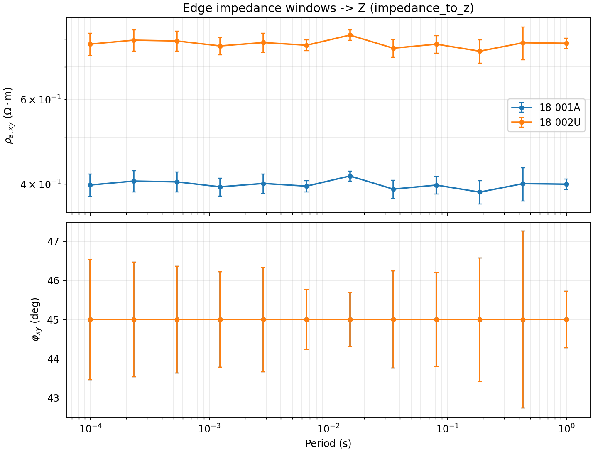
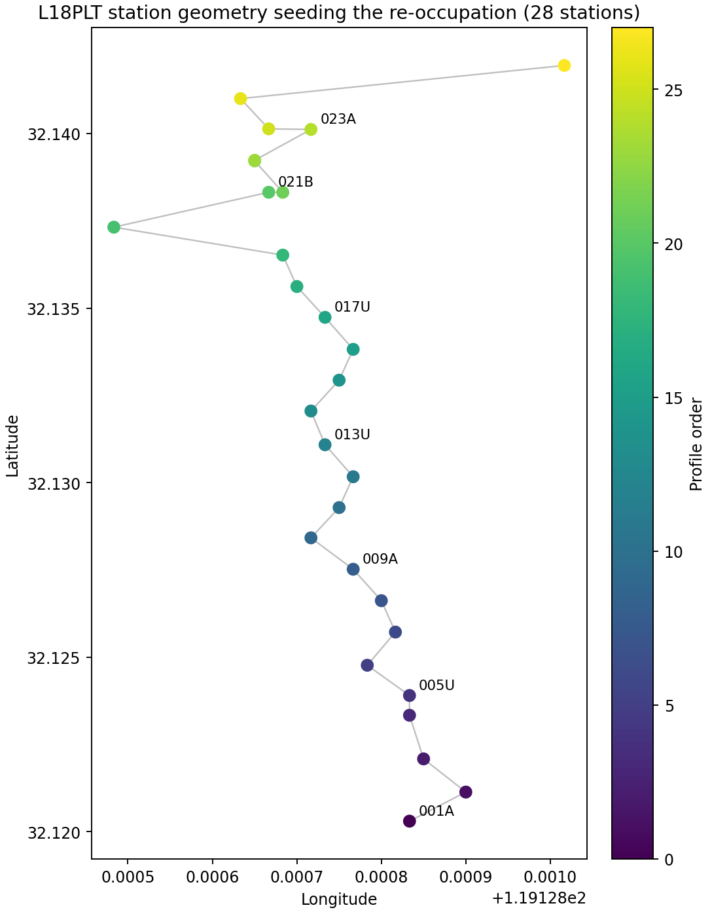

.. _user_guide_iot_data_bridge:

Bridging IoT Acquisition and the Data Model
===========================================

The IoT layer processes raw arrays and :term:`telemetry packet`\ s with
numpy only and stays independent of the heavier science API, which keeps
``import pycsamt.iot`` cheap on a field gateway. The
:mod:`pycsamt.iot.bridge` module is the one place the two worlds meet.
Every science-API import (``seg``, ``site``) is lazy, so pulling in the
bridge does not force the geospatial stack onto a node that only needs
telemetry.

The bridge works in both directions: forward, from edge impedance to the
:term:`EDI`/:term:`impedance tensor` objects the processing flow expects,
and in reverse, from an archived EDI survey back into a :term:`field
session` ready to re-occupy. The next three sections follow the forward
direction end to end; the two after that follow it in reverse.

Impedance To Z
--------------

The edge already forms per-window impedance estimates the same way
:func:`~pycsamt.iot.edge_amt.assess_impedance_stability` does for its
:term:`impedance stability` check (see :doc:`amt_diagnostics`).
:func:`~pycsamt.iot.bridge.impedance_to_z` picks up from exactly that
point and turns the windows into a :class:`pycsamt.z.z.Z` — the
:term:`impedance tensor` container the processing and inversion flow
consumes — deriving an absolute error from the spread across windows. The
example below stands in for that edge output with a synthetic, noisy
half-space sounding on two L18 stations, so the whole page runs end to
end without a live acquisition:

.. code-block:: pycon

   >>> import numpy as np
   >>> from pycsamt.iot import impedance_to_z, z_to_edi
   >>> freq = np.logspace(4, 0, 12)              # 10 kHz -> 1 Hz, 12 points
   >>> rng = np.random.default_rng(11)
   >>> zxy_true = (1 + 1j) * np.sqrt(freq)        # flat rho_a, 45 deg phase
   >>> z_windows = zxy_true[None, :] * (
   ...     1 + 0.03 * rng.standard_normal((6, freq.size))
   ... )                                          # 6 short synthetic edge windows
   >>> z1 = impedance_to_z(z_windows, freq, station="18-001A", method="amt")
   >>> print(f"Z tensor shape: {z1.z.shape}")
   Z tensor shape: (12, 2, 2)
   >>> print(f"Zxy[0] = {z1.z[0, 0, 1]:.3f}, Zyx[0] = {z1.z[0, 1, 0]:.3f}")
   Zxy[0] = 99.808+99.808j, Zyx[0] = -99.808-99.808j
   >>> rel_err = np.abs(z1.z_err[:, 0, 1]) / np.abs(z1.z[:, 0, 1])
   >>> print(f"Median relative Zxy error: {np.median(rel_err):.3f}")
   Median relative Zxy error: 0.022

That output is the whole aggregation rule made concrete. For a window
axis of size :math:`W`, ``impedance_to_z`` reduces the per-window scalar
estimates :math:`Z^{(w)}(f)`, :math:`w = 1, \dots, W`, to a mean (or,
with ``aggregate="median"``, a component-wise median) and reports the
spread across windows as an absolute error:

.. math::

   \bar{Z}(f) = \frac{1}{W}\sum_{w=1}^{W} Z^{(w)}(f), \qquad
   \sigma_Z(f) = \left|\operatorname{std}_w\bigl(Z^{(w)}(f)\bigr)\right|.

That is the same window-spread idea :term:`impedance stability` uses to
score repeatability — here it becomes the ``z_err`` carried forward
instead of a pass/fail verdict. The default ``component="offdiag"`` then
places the aggregated scalar as an :term:`off-diagonal antisymmetry`
pair, :math:`Z_{xy} = \bar{Z}` and :math:`Z_{yx} = -\bar{Z}`, which is why
``Zyx[0]`` above is exactly the negative of ``Zxy[0]``. With six windows
and 3% per-window noise, the mean's relative error settles around 2%,
matching the ``0.022`` printed above.

Z To EDI
--------

:func:`~pycsamt.iot.bridge.z_to_edi` (and the in-memory
:func:`~pycsamt.iot.bridge.build_edifile`) writes a preliminary EDI from
that tensor, so a field node can emit an ``.edi`` on site using the
station's recorded geometry:

.. code-block:: pycon

   >>> from pathlib import Path
   >>> path1 = z_to_edi(
   ...     z1, station="18-001A", lat=32.1203, lon=119.12883,
   ...     elevation=99.0, savepath="edi_out", method="amt",
   ... )
   >>> print(f"Wrote: {Path(path1).name}")
   Wrote: 18-001A.edi

When the optional geospatial stack is available,
:func:`~pycsamt.iot.bridge.z_to_site` returns a single EDI-backed
:class:`pycsamt.site.base.Site` the same way, without needing a whole
session around it.

Session To EDI Files
--------------------

For a whole session, :meth:`~pycsamt.iot.session.FieldSession.to_edifiles`
builds one EDI per station, enriched with the station geometry the
session recorded, and
:meth:`~pycsamt.iot.session.FieldSession.to_sites_collection` promotes
the same impedance into a :class:`pycsamt.site.base.Sites` collection
ready to feed straight to :meth:`pycsamt.pipeline.Pipeline.run`:

.. code-block:: pycon

   >>> from pycsamt.iot import FieldSession, StationConfig
   >>> z2 = impedance_to_z(z_windows * 1.4, freq, station="18-002U", method="amt")
   >>> session = FieldSession("L18-BRIDGE-DEMO", method="amt")
   >>> _ = session.add_station(
   ...     StationConfig("18-001A", lat=32.1203, lon=119.12883, elevation=99.0)
   ... )
   >>> _ = session.add_station(
   ...     StationConfig("18-002U", lat=32.1207, lon=119.12920, elevation=97.0)
   ... )
   >>> edis = session.to_edifiles({"18-001A": z1, "18-002U": z2})
   >>> for station_id, ed in edis.items():
   ...     print(f"  {station_id}: n_freq={ed.n_freq}, station={ed.station}")
     18-001A: n_freq=12, station=18-001A
     18-002U: n_freq=12, station=18-002U
   >>> sites = session.to_sites_collection({"18-001A": z1, "18-002U": z2})
   >>> print(f"Sites collection: {len(sites)} station(s)")
   Sites collection: 2 station(s)

Station geometry travels with the impedance rather than being re-entered
by hand — ``to_edifiles`` looked up each station's lat/lon/elevation from
the ``FieldSession`` itself. ``z2`` reuses the same synthetic windows as
``z1``, scaled up by 1.4 in amplitude, purely so the figure below has two
visually distinct curves; nothing about that scaling is otherwise
meaningful.

A :class:`~pycsamt.z.z.Z` object already carries apparent resistivity and
phase — :attr:`~pycsamt.z.resphase.ResPhase.resistivity` and
:attr:`~pycsamt.z.resphase.ResPhase.phase` (and their ``_err``
counterparts) are computed automatically from ``z``/``z_err`` by the
:class:`~pycsamt.z.resphase.ResPhase` base class the moment either is
set, using the practical-unit Cagniard convention
:math:`\rho_{a} = 0.2\,|Z|^2/f`. The figure below reads those attributes
directly rather than recomputing anything, and shows what actually ended
up inside the two EDIs: a flat :term:`apparent resistivity` and a
constant 45-degree :term:`phase`, the textbook signature of the
half-space sounding used to build ``z1``/``z2``, with the per-window
spread from above carried through as error bars.

.. code-block:: pycon

   >>> import matplotlib.pyplot as plt
   >>> out_dir = Path("docs/source/images/user_guide/iot")
   >>> out_dir.mkdir(parents=True, exist_ok=True)
   >>> fig, axes = plt.subplots(2, 1, figsize=(8.4, 6.4), sharex=True, constrained_layout=True)
   >>> for z_obj, label, color in [(z1, "18-001A", "tab:blue"), (z2, "18-002U", "tab:orange")]:
   ...     _ = axes[0].errorbar(
   ...         1.0 / z_obj.freq, z_obj.res_xy, yerr=z_obj.res_err_xy,
   ...         marker="o", ms=4, color=color, label=label, capsize=2,
   ...     )
   ...     _ = axes[1].errorbar(
   ...         1.0 / z_obj.freq, z_obj.phase_xy, yerr=z_obj.phase_err_xy,
   ...         marker="o", ms=4, color=color, capsize=2,
   ...     )
   >>> axes[0].set_xscale("log")
   >>> axes[0].set_yscale("log")
   >>> _ = axes[0].set_ylabel(r"$\rho_{a,xy}$ ($\Omega\cdot$m)")
   >>> _ = axes[0].set_title("Edge impedance windows -> Z (impedance_to_z)")
   >>> _ = axes[0].legend(loc="best")
   >>> axes[0].grid(alpha=0.25, which="both")
   >>> _ = axes[1].set_ylabel(r"$\varphi_{xy}$ (deg)")
   >>> _ = axes[1].set_xlabel("Period (s)")
   >>> axes[1].grid(alpha=0.25, which="both")
   >>> fig.savefig(out_dir / "user-guide-iot-data-bridge-01.png", dpi=170)

Both curves sit exactly where the construction predicts: ``18-001A`` near
0.4 :math:`\Omega\cdot`\ m and ``18-002U`` near 0.78, a factor of
:math:`1.4^2 = 1.96` apart since resistivity scales with :math:`|Z|^2`
rather than :math:`|Z|` — the amplitude bump used to separate the two
curves visually turns into a near-doubling of resistivity, not a 40%
change. The phase panel is flat at 45 degrees for both stations, because
``zxy_true`` was built as :math:`(1+i)\sqrt{f}`, and :math:`1+i` has
exactly that angle at every frequency; only the error bars vary, growing
wider toward long period where fewer effective cycles went into each
window's spectral estimate.

Consistent QC Via Emtools
-------------------------

Field-side edge QC and downstream processing QC should not be two
independent notions of a "good" station.
:func:`~pycsamt.iot.bridge.emtools_qc` routes the sites the IoT layer
produced through the *same* coherence/skew/SNR :term:`quality control`
the processing flow uses — see :doc:`/user_guide/emtools/qc` for the
confidence-ratio formulation behind these columns. Reusing the
``session`` and impedance from above:

.. code-block:: pycon

   >>> from pycsamt.iot import emtools_qc
   >>> table = emtools_qc(session, {"18-001A": z1, "18-002U": z2})
   >>> flags = emtools_qc(session, {"18-001A": z1, "18-002U": z2}, flags=True)
   >>> print(table[["station", "n_freq", "frac_ok", "snr_med"]].to_string(index=False))
   station  n_freq  frac_ok   snr_med
   18-001A      12      1.0 44.591203
   18-002U      12      1.0 44.591203
   >>> print(flags[["station", "frac_ok", "snr_med", "flags"]].to_string(index=False))
   station  frac_ok   snr_med flags
   18-001A      1.0 44.591203
   18-002U      1.0 44.591203

Both stations come back clean here because the synthetic windows are
noise-free once aggregated and every row is finite — ``flags`` is empty
for both. A real edge deployment would carry error tensors down from
noisier windows and skewed diagonal terms from off-axis dipoles, which is
exactly what ``skew_med`` and the ``uncertainty``/``offdiag`` confidence
components pick up. ``emtools_qc`` also accepts an already-built
``Sites`` collection or any EDI source, so the same QC can be re-run on
an archived survey later without touching the IoT layer at all.

.. note::

   For a *raw time series* rather than pre-computed impedance, use
   :func:`pycsamt.ts.ts_to_z` / :func:`pycsamt.ts.ts_to_edi`, which run
   the spectral estimation for you. The bridge starts one step later,
   from the impedance the edge has already estimated.

Seeding A Re-Occupation
-----------------------

The bridge also reads an existing survey to plan a follow-up campaign.
Unlike the forward direction above, this side can run directly on the
repository's real :term:`AMT` demo line,
``data/AMT/WILLY_DATA/L18PLT``, rather than synthetic impedance —
:func:`~pycsamt.iot.bridge.field_session_from_edis` returns a
:class:`~pycsamt.iot.session.FieldSession` with every station's recorded
geometry and channels, plus a sensor node per station, ready to
re-occupy:

.. code-block:: pycon

   >>> from pycsamt.iot import field_session_from_edis, edi_survey_table
   >>> edi_dir = "data/AMT/WILLY_DATA/L18PLT"
   >>> reoccupy = field_session_from_edis(
   ...     edi_dir, survey_id="L18-REOCCUPY", method="amt", operator="crew"
   ... )
   >>> print(f"stations={reoccupy.n_stations}, devices={reoccupy.n_devices}")
   stations=28, devices=28
   >>> device = list(reoccupy.devices.values())[0]
   >>> print(f"first device: {device.device_id}, sample_rate_hz={device.sample_rate_hz:.1f}")
   first device: 23-18-001A-node, sample_rate_hz=52000.0
   >>> survey_tbl = edi_survey_table(edi_dir)
   >>> print(
   ...     survey_tbl[
   ...         ["station", "lat", "lon", "n_freq", "f_min_hz", "f_max_hz"]
   ...     ].head(5).to_string(index=False)
   ... )
      station       lat        lon  n_freq  f_min_hz  f_max_hz
   23-18-001A 32.120300 119.128833      53     1.008   10400.0
   23-18-002U 32.121133 119.128900      53     1.008   10400.0
   23-18-003A 32.122083 119.128850      53     1.008   10400.0
   23-18-004A 32.123333 119.128833      53     1.008   10400.0
   23-18-005U 32.123900 119.128833      53     1.008   10400.0

Every station on this line recovered the same 1.0–10400 Hz band, so the
seeded device's ``sample_rate_hz`` is not read off the EDI — it is a
Nyquist-margin hint built from the highest recovered frequency,

.. math::

   f_{s,\mathrm{hint}} = 5\,f_{\max},

which is why ``52000.0`` is exactly five times ``10400.0`` above. It is a
starting point for provisioning the re-occupying logger, not a recorded
acquisition parameter. The station geometry that seeds each new node is
the same lat/lon shown in the table, plotted below in profile order —
the line's real layout, coloured by the same order the stations were
registered in:

.. code-block:: pycon

   >>> stations_ordered = list(reoccupy.stations.values())
   >>> lats = [s.lat for s in stations_ordered]
   >>> lons = [s.lon for s in stations_ordered]
   >>> ids = [s.station_id for s in stations_ordered]
   >>> fig2, ax2 = plt.subplots(figsize=(6.4, 8.2), constrained_layout=True)
   >>> _ = ax2.plot(lons, lats, color="0.75", lw=1.0, zorder=1)
   >>> sc = ax2.scatter(
   ...     lons, lats, c=np.arange(len(lons)), cmap="viridis", s=70,
   ...     zorder=2, edgecolor="none",
   ... )
   >>> for idx in (0, 4, 8, 12, 16, 20, 24):
   ...     label = ids[idx].split("-")[-1]
   ...     _ = ax2.annotate(
   ...         label, (lons[idx], lats[idx]),
   ...         textcoords="offset points", xytext=(6, 4), fontsize=9,
   ...     )
   >>> _ = ax2.set_xlabel("Longitude")
   >>> _ = ax2.set_ylabel("Latitude")
   >>> _ = ax2.set_title(f"L18PLT station geometry seeding the re-occupation ({len(ids)} stations)")
   >>> _ = fig2.colorbar(sc, ax=ax2, label="Profile order")
   >>> fig2.savefig(out_dir / "user-guide-iot-data-bridge-02.png", dpi=170)

The line runs south to north from ``001A`` up through ``017U``, ``021B``,
and ``023A`` in mostly steady steps, but the colour bar exposes something
the raw geometry alone would not: stations ``021B``, ``021U``, ``022U``,
``022V``, ``023A``, and ``023V`` (profile order 20–25) are all bunched
into the same small patch near the northern end, visibly closer together
than the rest of the line, before the final station ``025A`` jumps well
to the east. That kind of infill is a deliberate acquisition choice —
denser sampling over a target of interest — and it is exactly the kind of
detail that is easy to miss reading station IDs in a table but obvious in
a profile-ordered map.

Deployment And Raw Records
--------------------------

:func:`~pycsamt.iot.bridge.deployment_from_edis` is a lighter counterpart
that returns just a ``DeploymentConfig`` inventory, and
:func:`~pycsamt.iot.bridge.read_edi_survey` yields the raw per-station
summary records that both higher-level functions are built on:

.. code-block:: pycon

   >>> from pycsamt.iot import deployment_from_edis, read_edi_survey
   >>> deployment = deployment_from_edis(
   ...     edi_dir, survey_id="L18-REOCCUPY", capabilities=["telemetry"]
   ... )
   >>> print(f"deployment devices: {deployment.n_devices}")
   deployment devices: 28
   >>> records = read_edi_survey(edi_dir)
   >>> print(f"read_edi_survey records: {len(records)}")
   read_edi_survey records: 28
   >>> print(records[0])
   {'station': '23-18-001A', 'lat': 32.1203, 'lon': 119.12883333333333, 'elevation': 99.0, 'n_freq': 53, 'f_min_hz': 1.008, 'f_max_hz': 10400.0, 'channels': ['ex', 'ey', 'hx', 'hy']}

Sources may be a directory of ``.edi`` files, a glob pattern, a single
file or ``EDIFile``, or any iterable mixing these — the same flexibility
``read_edi_survey`` demonstrated above carries through to
``field_session_from_edis``, ``deployment_from_edis``, and
``emtools_qc``.
