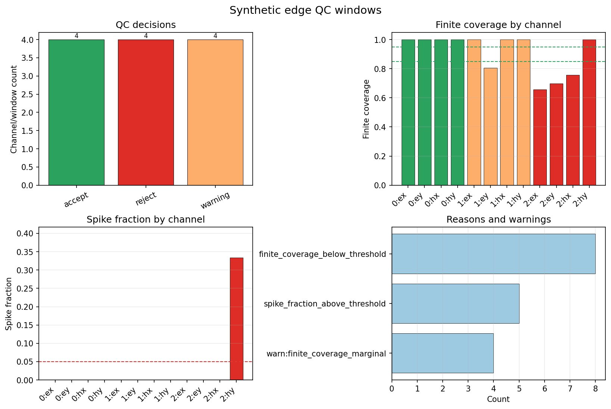

.. _user_guide_iot_edge_qc:

Generic Edge QC
===============

Generic :term:`edge diagnostics` are the lightweight screening step that
can run on a field node before data are transmitted or stored. They are
not a replacement for :term:`AMT`/:term:`CSAMT` processing. They answer
simpler operational questions: is the window mostly finite, are there
obvious spikes, how many samples would be emitted after :term:`decimation`,
and which :term:`edge decision` should be attached to the packet?

The examples below use synthetic four-channel AMT-style windows. That is
appropriate here because generic edge QC works on live :term:`time series`
arrays, not on :term:`EDI` files. Three windows are created: a clean
window, a marginal window with missing ``Ey`` samples, and a bad window
with missing electric and magnetic samples plus spikes.

Build Synthetic Edge Windows
----------------------------

Each row is a :term:`time series` sample and each column is a channel.
The channel order is ``Ex``, ``Ey``, ``Hx``, ``Hy``.

.. code-block:: python
   :linenos:

   import numpy as np

   sample_rate = 512.0
   n_samples = 2048
   t = np.arange(n_samples) / sample_rate
   rng = np.random.default_rng(31)
   channels = ["ex", "ey", "hx", "hy"]

   clean = np.column_stack(
       [
           np.sin(2 * np.pi * 7.0 * t)
           + 0.03 * rng.standard_normal(n_samples),
           0.8 * np.sin(2 * np.pi * 9.0 * t + 0.2)
           + 0.03 * rng.standard_normal(n_samples),
           0.3 * np.sin(2 * np.pi * 7.0 * t + 0.5)
           + 0.02 * rng.standard_normal(n_samples),
           0.35 * np.sin(2 * np.pi * 9.0 * t + 0.8)
           + 0.02 * rng.standard_normal(n_samples),
       ]
   )

   marginal = clean.copy()
   marginal[100:500, 1] = np.nan
   marginal[800:812, 0] += 4.0

   bad = clean.copy()
   bad[200:900, 0] = np.nan
   bad[260:880, 1] = np.nan
   bad[320:820, 2] = np.nan
   bad[::12, 3] += 10.0

Configure And Run The Processor
-------------------------------

The processor decimates every fourth sample, checks
:term:`finite coverage`, computes one :term:`channel summary` per channel,
and estimates a :term:`robust spike fraction`. With decimation factor
:math:`d`, pyCSAMT keeps samples :math:`0, d, 2d, \ldots`; for an original
window of :math:`N` samples, the emitted count is
:math:`\lceil N/d \rceil`. After decimation, finite coverage is

.. math::

   C_f = \frac{N_\mathrm{finite}}{N_\mathrm{total}}.

A window below ``finite_threshold`` is rejected. A window above the hard
threshold but below ``warn_finite_threshold`` is accepted with a warning,
so the data can keep flowing while the field audit trail still records
that the packet was marginal.

Spike detection is intentionally robust. For each channel, the centre is
the median :math:`m`, and the scale is
:math:`1.4826\,\operatorname{median}(|x_i-m|)`, the usual normalised
:term:`median absolute deviation`. If that scale collapses to zero,
pyCSAMT falls back to the standard deviation. A finite sample is counted
as a spike when

.. math::

   |x_i - m| > k\,s,

where :math:`k` is ``spike_threshold`` and :math:`s` is the robust scale.
The channel spike fraction is the number of flagged finite samples divided
by the number of finite samples; the window-level spike metric is the
maximum channel spike fraction.

.. code-block:: python
   :linenos:

   from pycsamt.iot import EdgeProcessingConfig, EdgeProcessor

   processor = EdgeProcessor(
       EdgeProcessingConfig(
           decimation=4,
           finite_threshold=0.85,
           warn_finite_threshold=0.97,
           channel_names=channels,
           spike_threshold=5.0,
           max_spike_fraction=0.05,
           warn_spike_fraction=0.01,
       )
   )

   results = [
       processor.process(clean),
       processor.process(marginal),
       processor.process(bad),
   ]

   for label, result in zip(["clean", "marginal", "bad"], results):
       warnings = result.metrics.get("warnings", "")
       reasons = ";".join(result.reasons) or "-"
       print(
           f"{label}: decision={result.decision.value}, "
           f"accepted={result.accepted}, "
           f"finite={result.metrics['finite_coverage']:.3f}, "
           f"max_spike={result.metrics['spike_fraction_max']:.3f}, "
           f"warnings={warnings or '-'}, reasons={reasons}"
       )

Output:

.. code-block:: text

   clean: decision=accept, accepted=True, finite=1.000, max_spike=0.000, warnings=-, reasons=-
   marginal: decision=warning, accepted=True, finite=0.951, max_spike=0.000, warnings=finite_coverage_marginal, reasons=-
   bad: decision=reject, accepted=False, finite=0.778, max_spike=0.334, warnings=-, reasons=finite_coverage_below_threshold;spike_fraction_above_threshold

Inspect Per-Channel QC
----------------------

Use :func:`pycsamt.iot.edge_summary_table` to inspect one row per channel.
Each row carries finite coverage, RMS, basic finite-sample statistics, the
spike fraction, and any channel-level rejection reasons. The result index
identifies which edge window produced the channel row: ``0`` is clean,
``1`` is marginal, and ``2`` is bad.

.. code-block:: python
   :linenos:

   from pycsamt.iot import edge_summary_table

   summary = edge_summary_table(results)
   print(
       summary[
           [
               "result_index",
               "channel",
               "finite_coverage",
               "spike_fraction",
               "accepted",
               "decision",
               "reasons",
           ]
       ].to_string(index=False)
   )

Output:

.. code-block:: text

    result_index channel  finite_coverage  spike_fraction  accepted decision                         reasons
               0      ex         1.000000        0.000000      True   accept
               0      ey         1.000000        0.000000      True   accept
               0      hx         1.000000        0.000000      True   accept
               0      hy         1.000000        0.000000      True   accept
               1      ex         1.000000        0.000000      True  warning
               1      ey         0.804688        0.000000     False  warning finite_coverage_below_threshold
               1      hx         1.000000        0.000000      True  warning
               1      hy         1.000000        0.000000      True  warning
               2      ex         0.658203        0.000000     False   reject finite_coverage_below_threshold
               2      ey         0.697266        0.000000     False   reject finite_coverage_below_threshold
               2      hx         0.755859        0.000000     False   reject finite_coverage_below_threshold
               2      hy         1.000000        0.333984     False   reject  spike_fraction_above_threshold

Encode QC As Telemetry
----------------------

An :class:`~pycsamt.iot.EdgeProcessingResult` can be converted directly to
a ``qc`` :term:`telemetry packet`. The packet stores the compact metrics
and all channel summaries, so a downstream monitor can audit the edge
decision without shipping the full waveform.

.. code-block:: python
   :linenos:

   from pycsamt.iot import DeviceConfig, FieldSession

   device = DeviceConfig(
       "l18-node-01",
       station="001A",
       protocol="file",
       sample_rate_hz=sample_rate,
       channels=channels,
       role="recorder",
   )
   session = FieldSession("WILLY-L18-EDGE-QC", devices=[device], method="amt")

   base_time = 1_700_000_000.0
   for index, result in enumerate(results):
       packet = result.to_packet(
           device,
           timestamp=base_time + 60.0 * index,
           survey_id=session.survey_id,
       )
       packet.payload.update(
           {
               "method": "amt",
               "station": "001A",
               "channels": channels,
               "frequency_band_hz": [1.0, 1000.0],
           }
       )
       session.add_packet(packet)

   packet = session.packets[1]
   print(f"topic: {packet.topic}")
   print(f"decision: {packet.payload['decision']}")
   print(f"n channel summaries: {len(packet.payload['channels'])}")
   print(f"payload keys: {', '.join(sorted(packet.payload))}")

Output:

.. code-block:: text

   topic: pycsamt/WILLY-L18-EDGE-QC/001A/l18-node-01/qc
   decision: warning
   n channel summaries: 4
   payload keys: accepted, channels, decision, frequency_band_hz, method, metrics, reasons, station

Plot The QC Summary
-------------------

The edge-QC plot shows the decision counts, finite coverage, spike
fraction, and reasons/warnings. This page has one combined diagnostic
figure; pages with multiple separate figures use an RST grid.

.. code-block:: python
   :linenos:

   from pathlib import Path

   from pycsamt.iot import plot_edge_qc_summary

   out_dir = Path("docs/source/images/user_guide/iot")
   out_dir.mkdir(parents=True, exist_ok=True)

   plot_edge_qc_summary(
       results,
       figsize=(10.8, 7.2),
       title="Synthetic edge QC windows",
       output_path=(out_dir / "user-guide-iot-edge-qc-01.png").as_posix(),
       close=True,
   )

Field Interpretation
--------------------

The clean window can be transmitted or stored as accepted telemetry. The
marginal window is still usable at the window level, but the ``Ey`` channel
coverage is low enough to keep the warning in the audit trail. The bad
window fails both global finite coverage and spike-fraction thresholds, so
it should not be used for downstream :term:`transfer function` or
:term:`impedance tensor` work.

In a field workflow, keep the thresholds in the deployment configuration
or :term:`provenance manifest`. That makes later decisions reproducible
when the same survey is reviewed away from the instrument.
