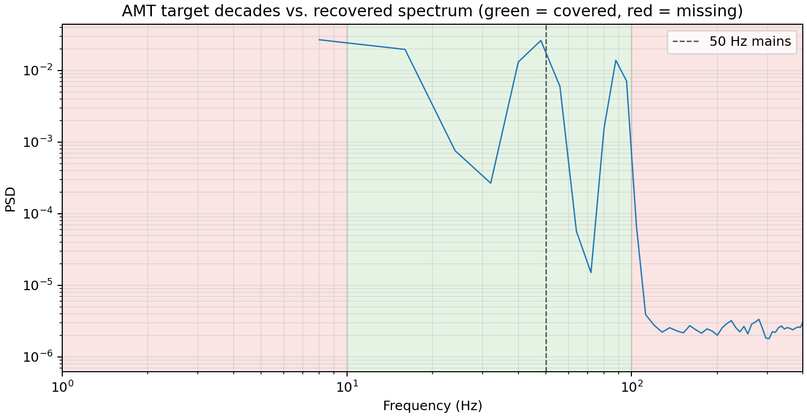

.. _user_guide_iot_method_profiles:

Method-Aware QC
================

An :class:`~pycsamt.iot.monitoring.EMMethod` names the survey method, but on
its own it changes no threshold. The :mod:`pycsamt.iot.methods` module
carries the canonical, per-method knowledge that turns a method name into
concrete QC defaults, so the same monitor behaves correctly for
:term:`AMT`, :term:`MT`, :term:`CSAMT`, :term:`CSEM`, and :term:`TDEM`/TEM
without hand-tuning.

Method profiles
----------------

A :class:`~pycsamt.iot.MethodProfile` records the typical acquisition band,
the channels a valid record must carry, a nominal sample rate, and whether
the method uses a controlled source or is sensitive to powerline noise --
together, this is the :term:`method profile` behind every method-aware
default in the rest of this page:

.. code-block:: python
   :linenos:

   from pycsamt.iot import method_profile

   p = method_profile("csamt")
   print(f"frequency_band_hz: {p.frequency_band_hz}")
   print(f"required_channels: {p.required_channels}")
   print(f"default_sample_rate_hz: {p.default_sample_rate_hz}")
   print(f"controlled_source: {p.controlled_source}")
   print(f"powerline_sensitive: {p.powerline_sensitive}")

Output:

.. code-block:: text

   frequency_band_hz: (0.125, 8192.0)
   required_channels: ('ex', 'ey', 'hx', 'hy')
   default_sample_rate_hz: 32768.0
   controlled_source: True
   powerline_sensitive: True

.. list-table::
   :header-rows: 1
   :widths: 14 22 26 18 20

   * - Method
     - Band (Hz)
     - Required channels
     - Source
     - Powerline
   * - AMT
     - 1 – 10 000
     - ex, ey, hx, hy
     - natural
     - sensitive
   * - MT
     - 1e-4 – 1000
     - ex, ey, hx, hy, hz
     - natural
     - sensitive
   * - CSAMT
     - 0.125 – 8192
     - ex, ey, hx, hy
     - controlled
     - sensitive
   * - CSEM
     - 0.01 – 100
     - ex, ey, hx, hy
     - controlled
     - sensitive
   * - TDEM / TEM
     - (time-domain)
     - hz
     - controlled
     - not sensitive

The band edges are representative defaults, not hard standards; override
them per survey when acquisition parameters differ.

That same band also drives :func:`~pycsamt.iot.target_bands_for_method`,
which breaks it into per-decade sub-bands for the :term:`frequency
coverage` check that :doc:`amt_diagnostics` introduced. Given a band
:math:`[f_{\mathrm{lo}}, f_{\mathrm{hi}}]`, the exponent range rounds
outward to whole decades,

.. math::

   k_{\mathrm{lo}} = \lfloor \log_{10} f_{\mathrm{lo}} \rfloor, \qquad
   k_{\mathrm{hi}} = \lceil \log_{10} f_{\mathrm{hi}} \rceil,

giving decade edges :math:`10^{k_{\mathrm{lo}}}, 10^{k_{\mathrm{lo}}+1},
\dots, 10^{k_{\mathrm{hi}}}`. The first and last of those edges are then
snapped back to the true band limits, :math:`f_{\mathrm{lo}}` and
:math:`f_{\mathrm{hi}}`, and each consecutive pair of the resulting
sequence becomes one target band. :term:`TDEM`/TEM has no defined
frequency band, so it returns an empty list rather than a spurious
coverage target:

.. code-block:: python
   :linenos:

   from pycsamt.iot import target_bands_for_method

   for method in ("amt", "csamt", "tdem"):
       print(f"{method}: {target_bands_for_method(method)}")

Output:

.. code-block:: text

   amt: [(1.0, 10.0), (10.0, 100.0), (100.0, 1000.0), (1000.0, 10000.0)]
   csamt: [(0.125, 1.0), (1.0, 10.0), (10.0, 100.0), (100.0, 1000.0), (1000.0, 8192.0)]
   tdem: []

Seeding a monitor
------------------

:meth:`~pycsamt.iot.MonitoringConfig.for_method` seeds the expected band
and required channels from a profile, so the method-mismatch,
missing-channel, and out-of-band checks in
:class:`~pycsamt.iot.TelemetryMonitor` become method-aware with no manual
tuning. Keyword overrides win over the profile defaults. The packet below
is deliberately wrong for a CSAMT monitor -- it reports ``method="mt"``
and is missing ``hy`` -- to show what that method-awareness actually
catches:

.. code-block:: python
   :linenos:

   from pycsamt.iot import (
       DeviceConfig,
       MonitoringConfig,
       PacketKind,
       TelemetryPacket,
       assess_telemetry,
   )

   device = DeviceConfig(
       "csamt-node-01", station="S01", protocol="mqtt",
       channels=["ex", "ey", "hx", "hy"],
   )
   mt_packet = TelemetryPacket.from_device(
       device,
       timestamp=1_700_000_000.0,
       payload={
           "method": "mt",                  # wrong method for this monitor
           "station": "S01",
           "channels": ["ex", "ey", "hx"],  # hy missing
           "battery_v": 12.3,
       },
       kind=PacketKind.QC,
   )

   cfg = MonitoringConfig.for_method("csamt", min_battery_v=11.5)
   status = assess_telemetry([mt_packet], config=cfg)
   print(f"level: {status.level.value}")
   print(f"issues: {status.issues}")

Output:

.. code-block:: text

   level: critical
   issues: ['method_mismatch', 'required_channels_missing']

A packet that actually reported ``method="csamt"`` with all four channels
would clear both checks against the very same ``cfg`` -- nothing about
the monitor changes between the two cases, only what the telemetry
reports about itself.

Method-aware edge QC
----------------------

Passing ``method`` to :func:`~pycsamt.iot.amt_edge_report` gates the
:term:`edge diagnostics` by method. Powerline-harmonic detection runs only
for powerline-sensitive methods -- it is skipped for :term:`TDEM`/TEM,
where the report carries ``powerline_applicable=False`` instead of a
misleading "clean" verdict -- and :term:`frequency coverage` is scored
against the method's target bands from the section above. The same
synthetic window, contaminated with a 50 Hz mains harmonic, is run through
both an AMT and a TDEM context below so the difference is visible directly:

.. code-block:: python
   :linenos:

   import numpy as np

   from pycsamt.iot import amt_edge_report

   sample_rate = 2048.0
   n_samples = 8192
   t = np.arange(n_samples) / sample_rate
   rng = np.random.default_rng(3)
   window = (
       0.9 * np.sin(2 * np.pi * 3.0 * t)
       + 0.8 * np.sin(2 * np.pi * 12.0 * t)
       + 0.7 * np.sin(2 * np.pi * 45.0 * t)
       + 0.6 * np.sin(2 * np.pi * 90.0 * t)
       + 0.5 * np.sin(2 * np.pi * 50.0 * t)    # mains contamination
       + 0.05 * rng.standard_normal(n_samples)
   )

   report_amt = amt_edge_report(window, sample_rate, method="amt")
   report_tdem = amt_edge_report(window, sample_rate, method="tdem")

   print(f"AMT  powerline_applicable: {report_amt['powerline_applicable']}, "
         f"contaminated: {report_amt['powerline']['contaminated']}")
   print(f"TDEM powerline_applicable: {report_tdem['powerline_applicable']}, "
         f"powerline: {report_tdem['powerline']}")
   print(f"AMT  coverage_fraction: "
         f"{report_amt['frequency_coverage']['coverage_fraction']:.2f}, "
         f"missing_bands: {report_amt['frequency_coverage']['missing_bands']}")
   print(f"TDEM coverage_fraction: "
         f"{report_tdem['frequency_coverage']['coverage_fraction']}")

Output:

.. code-block:: text

   AMT  powerline_applicable: True, contaminated: True
   TDEM powerline_applicable: False, powerline: None
   AMT  coverage_fraction: 0.25, missing_bands: [[1.0, 10.0], [100.0, 1000.0], [1000.0, 10000.0]]
   TDEM coverage_fraction: nan

The figure below makes the AMT row concrete: the window's recovered
spectrum only clears the noise floor across roughly 10-100 Hz -- the one
target decade shaded green, against the three shaded red -- and the 50 Hz
mains line sits squarely inside that covered band, which is exactly why
``contaminated`` came back ``True``. A TDEM context skips that whole
powerline check, since a transient decay has no steady-state spectrum for
a 50 Hz line to contaminate.

Passing no method preserves the original, method-agnostic behaviour: no
target bands are imposed, and powerline detection always runs.
