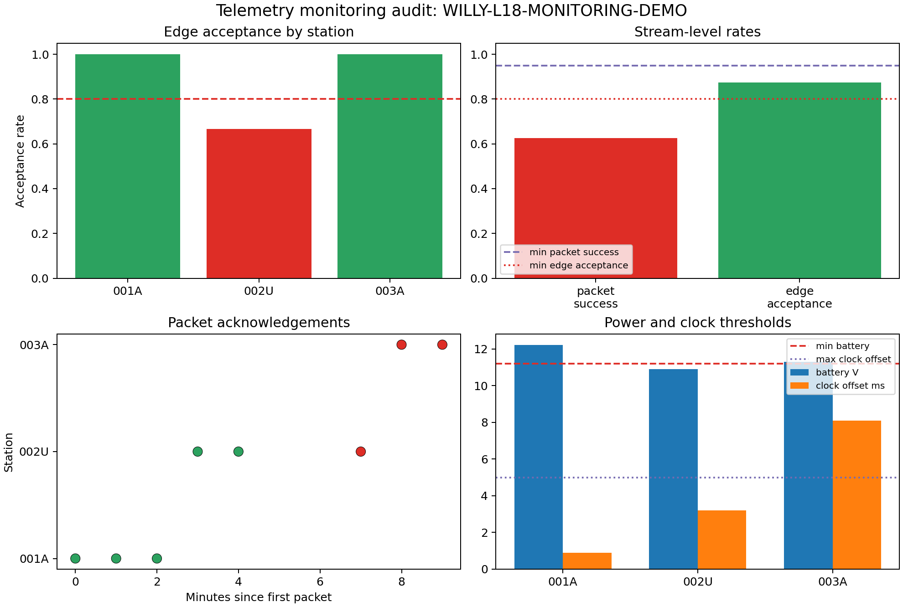

.. _user_guide_iot_monitoring:

Monitoring
==========

Telemetry monitoring turns :term:`telemetry packet` streams into an
operational :term:`monitoring status`. It checks whether packets are
arriving, whether :term:`packet acknowledgement` values are healthy,
whether :term:`edge diagnostics` are accepting enough windows, and
whether field thresholds for :term:`latency`, :term:`packet gap`,
:term:`battery voltage`, :term:`clock offset`, required channels, and
:term:`configured frequency band` are being respected. :doc:`basic_session`
introduced ``session.assess`` as a shortcut over exactly this machinery;
this page works with :class:`~pycsamt.iot.monitoring.TelemetryMonitor`
directly, which is where that shortcut gets its behaviour.

The example below uses synthetic telemetry packets for three stations on
the L18 demo line. Synthetic packets are appropriate here because the
monitor operates on live IoT messages, not :term:`EDI` impedance files.
The packet stream is deliberately mixed: one station is healthy, one has
a rejected edge-QC window and an acknowledgement failure, and one has
clock and frequency-band issues.

Create A Monitored Session
--------------------------

Start with devices and a
:class:`~pycsamt.iot.monitoring.MonitoringConfig`. The config records the
operational contract for the stream: the expected sampling of packets,
the minimum acceptable packet and edge-QC rates, and the field limits
that should turn into warnings or critical issues.

.. code-block:: pycon

   >>> from pycsamt.iot import DeviceConfig, FieldSession, MonitoringConfig
   >>> base_time = 1_700_000_000.0
   >>> devices = [
   ...     DeviceConfig(
   ...         "l18-node-01", station="001A", protocol="file",
   ...         sample_rate_hz=512.0, channels=["ex", "ey", "hx", "hy"],
   ...         role="recorder",
   ...     ),
   ...     DeviceConfig(
   ...         "l18-node-02", station="002U", protocol="file",
   ...         sample_rate_hz=512.0, channels=["ex", "ey", "hx", "hy"],
   ...         role="recorder",
   ...     ),
   ...     DeviceConfig(
   ...         "l18-node-03", station="003A", protocol="file",
   ...         sample_rate_hz=512.0, channels=["ex", "ey", "hx", "hy"],
   ...         role="recorder",
   ...     ),
   ... ]
   >>> config = MonitoringConfig(
   ...     method="amt", expected_interval_s=60.0, max_gap_s=120.0,
   ...     max_latency_s=10.0, min_packet_success_rate=0.95,
   ...     min_edge_acceptance_rate=0.80, min_battery_v=11.2,
   ...     max_clock_offset_ms=5.0, required_channels=["ex", "ey", "hx", "hy"],
   ...     frequency_band_hz=(1.0, 1000.0),
   ... )
   >>> session = FieldSession(
   ...     "WILLY-L18-MONITORING-DEMO", devices=devices, method="amt",
   ...     monitoring_config=config,
   ... )
   >>> print((session.survey_id, session.n_devices, session.n_packets))
   ('WILLY-L18-MONITORING-DEMO', 3, 0)

Add Synthetic Telemetry Packets
-------------------------------

Each packet is a ``qc`` message with fields that the monitor knows how to
enrich: station, method, channel list, accepted/rejected
:term:`edge decision`, acknowledgement status, latency, battery voltage,
clock offset, and frequency band. Reading down the ``ack_ok`` and
``accepted`` columns of ``specs`` shows the two failures build in on
purpose: ``002U``'s second packet is content-rejected but still
acknowledged, and its third packet is the opposite — acknowledged to fail
but content-accepted. ``003A`` fails acknowledgement twice in a row and
widens its clock offset and its reported band.

.. code-block:: pycon

   >>> from pycsamt.iot import TelemetryPacket
   >>> specs = [
   ...     (devices[0], 0.0, True, True, 2.1, 12.4, 0.8,
   ...      ["ex", "ey", "hx", "hy"], [1.0, 1000.0]),
   ...     (devices[0], 60.0, True, True, 2.5, 12.3, 0.7,
   ...      ["ex", "ey", "hx", "hy"], [1.0, 1000.0]),
   ...     (devices[0], 120.0, True, True, 3.0, 12.2, 0.9,
   ...      ["ex", "ey", "hx", "hy"], [1.0, 1000.0]),
   ...     (devices[1], 180.0, True, True, 4.2, 11.8, 1.6,
   ...      ["ex", "ey", "hx", "hy"], [1.0, 1000.0]),
   ...     (devices[1], 240.0, False, True, 13.5, 11.7, 2.0,
   ...      ["ex", "ey", "hx", "hy"], [1.0, 1000.0]),
   ...     (devices[1], 420.0, True, False, 9.8, 10.9, 3.2,
   ...      ["ex", "ey", "hx", "hy"], [1.0, 1000.0]),
   ...     (devices[2], 480.0, True, False, 8.5, 11.4, 7.5,
   ...      ["ex", "hx", "hy"], [1.0, 1000.0]),
   ...     (devices[2], 540.0, True, False, 6.0, 11.3, 8.1,
   ...      ["ex", "hx", "hy"], [0.2, 1200.0]),
   ... ]
   >>> for device, dt, accepted, ack_ok, latency, battery, clock, channels, band in specs:
   ...     _ = session.add_packet(
   ...         TelemetryPacket.from_device(
   ...             device, timestamp=base_time + dt, survey_id=session.survey_id,
   ...             kind="qc",
   ...             payload={
   ...                 "method": "amt", "station": device.station,
   ...                 "channels": channels, "frequency_band_hz": band,
   ...                 "accepted": accepted,
   ...                 "decision": "accept" if accepted else "reject",
   ...                 "ack_ok": ack_ok, "latency_s": latency,
   ...                 "battery_v": battery, "clock_offset_ms": clock,
   ...             },
   ...         )
   ...     )
   >>> print(session.n_packets)
   8

Packet Tables And Counts
------------------------

Use :func:`~pycsamt.iot.monitoring.packet_table` for raw packet inventory
and :func:`~pycsamt.iot.monitoring.telemetry_summary` for packet counts
by device/topic. These tables are intentionally simple. They answer
"what arrived?" before the monitor decides whether what arrived was
healthy.

.. code-block:: pycon

   >>> from pycsamt.iot import packet_table, telemetry_summary
   >>> packets = packet_table(session.packets)
   >>> print(
   ...     packets[
   ...         ["device_id", "kind", "timestamp", "payload_keys"]
   ...     ].head(4).to_string(index=False)
   ... )
     device_id kind    timestamp                                                                                           payload_keys
   l18-node-01   qc 1700000000.0 accepted;ack_ok;battery_v;channels;clock_offset_ms;decision;frequency_band_hz;latency_s;method;station
   l18-node-01   qc 1700000060.0 accepted;ack_ok;battery_v;channels;clock_offset_ms;decision;frequency_band_hz;latency_s;method;station
   l18-node-01   qc 1700000120.0 accepted;ack_ok;battery_v;channels;clock_offset_ms;decision;frequency_band_hz;latency_s;method;station
   l18-node-02   qc 1700000180.0 accepted;ack_ok;battery_v;channels;clock_offset_ms;decision;frequency_band_hz;latency_s;method;station
   >>> summary = telemetry_summary(session.packets)
   >>> print(summary[["device_id", "topic", "n_packet"]].to_string(index=False))
     device_id                                                 topic  n_packet
   l18-node-01 pycsamt/WILLY-L18-MONITORING-DEMO/001A/l18-node-01/qc         3
   l18-node-02 pycsamt/WILLY-L18-MONITORING-DEMO/002U/l18-node-02/qc         3
   l18-node-03 pycsamt/WILLY-L18-MONITORING-DEMO/003A/l18-node-03/qc         2

All three devices reported under their own topic with no gaps in the
count, so nothing here already looks wrong — the packet stream is
complete. Whether the *content* of that stream is healthy is a separate
question, answered by the next two sections.

Inspect Enriched Rows
---------------------

:meth:`~pycsamt.iot.monitoring.TelemetryMonitor.table` normalises payload
fields into analysis-ready columns. This is the best view when you need
to debug why a status became warning or critical. If packet latency is
not carried in the payload and ``now`` is provided, pyCSAMT computes it
as

.. math::

   L_i = t_\mathrm{now} - t_i,

where :math:`t_i` is the packet timestamp. In this example latency is
provided directly by the payload, so the displayed values are the field
values rather than computed wall-clock differences.

.. code-block:: pycon

   >>> from pycsamt.iot import TelemetryMonitor
   >>> monitor = TelemetryMonitor(config)
   >>> enriched = monitor.table(session.packets, now=base_time + 600.0)
   >>> print(
   ...     enriched[
   ...         ["device_id", "station", "edge_accepted", "ack_ok", "latency_s",
   ...          "battery_v", "clock_offset_ms", "frequency_min_hz", "frequency_max_hz"]
   ...     ].head(6).to_string(index=False)
   ... )
     device_id station  edge_accepted  ack_ok  latency_s  battery_v  clock_offset_ms  frequency_min_hz  frequency_max_hz
   l18-node-01    001A           True    True        2.1       12.4              0.8               1.0            1000.0
   l18-node-01    001A           True    True        2.5       12.3              0.7               1.0            1000.0
   l18-node-01    001A           True    True        3.0       12.2              0.9               1.0            1000.0
   l18-node-02    002U           True    True        4.2       11.8              1.6               1.0            1000.0
   l18-node-02    002U          False    True       13.5       11.7              2.0               1.0            1000.0
   l18-node-02    002U           True   False        9.8       10.9              3.2               1.0            1000.0

``edge_accepted`` and ``ack_ok`` are independent columns, and rows 5 and 6
show why that independence matters: row 5 is content-rejected
(``edge_accepted=False``) yet its packet still arrived and was
acknowledged (``ack_ok=True``); row 6 is the mirror image, content
accepted but the acknowledgement itself failed. A table that collapsed
these into one flag would hide one of the two failure modes.

Assess Stream Status
--------------------

The status level is one of ``ok``, ``warning``, ``critical``, or
``no_data``. The stream-level :term:`packet success rate` is

.. math::

   R_\mathrm{packet} =
   \frac{N(\mathrm{ack\_ok}=\mathrm{True})}{N_\mathrm{packet}},

and the :term:`edge acceptance rate` is computed only from packets that
carry an edge-QC acceptance value,

.. math::

   R_\mathrm{edge} =
   \frac{N(\mathrm{edge\_accepted}=\mathrm{True})}
        {N(\mathrm{edge\_accepted}\ \mathrm{is\ known})}.

The maximum packet gap is the largest difference between sorted packet
timestamps, :math:`\max_i(t_{i+1}-t_i)`. Battery and clock checks use the
most conservative values in the stream: minimum battery voltage and
maximum absolute clock offset. Critical issues include packet success
below threshold, edge-acceptance failure, low battery, high clock offset,
method mismatch, or missing required channels. Gap, latency, and
frequency-band problems are warnings unless they appear alongside a
critical issue.

.. code-block:: pycon

   >>> from pycsamt.iot import assess_telemetry, monitoring_status_table
   >>> status = monitor.assess(session.packets, now=base_time + 600.0)
   >>> status_df = monitoring_status_table(status)
   >>> print(
   ...     status_df[
   ...         ["level", "n_packet", "packet_success_rate", "edge_acceptance_rate",
   ...          "mean_latency_s", "max_gap_s", "battery_min_v",
   ...          "clock_offset_max_ms", "issues"]
   ...     ].to_string(index=False)
   ... )
      level  n_packet  packet_success_rate  edge_acceptance_rate  mean_latency_s  max_gap_s  battery_min_v  clock_offset_max_ms                                                                                                                                                                                     issues
   critical         8                0.625                 0.875             6.2      180.0           10.9                  8.1 battery_below_threshold;clock_offset_above_threshold;frequency_outside_configured_band;packet_gap_above_threshold;packet_gap_exceeds_expected_interval;packet_success_rate_below_threshold
   >>> status2 = assess_telemetry(session.packets, config=config, now=base_time + 600.0)
   >>> print(f"Convenience wrapper level: {status2.level.value}")
   Convenience wrapper level: critical

Five of the eight packets were acknowledged, giving
``packet_success_rate = 0.625``, well under the configured ``0.95`` —
that single number is what makes ``packet_success_rate_below_threshold``
a critical issue on its own, independent of everything else in the
table. ``edge_acceptance_rate = 0.875`` (seven of eight packets carried
an accepted decision) still clears its own ``0.80`` threshold, so it is
*not* in the issues list — a reminder that a stream can fail on transport
while its content checks pass cleanly. The 180-second gap between
``002U``'s second and third packets is both above ``max_gap_s=120`` and
more than 2.5× the 60-second expected interval, so it triggers two
related but distinct gap issues rather than one. ``assess_telemetry`` is
a thin wrapper around exactly this ``TelemetryMonitor.assess`` call, so
``status2.level`` matches ``status.level`` by construction.

The Monitoring Audit
--------------------

The figure below is built from the enriched monitor table and status
metrics. It shows which thresholds were violated without requiring the
reader to inspect every packet by hand. The station panel uses the same
acceptance-rate definition as the stream status, while the operations
panel compares the minimum battery voltage and maximum absolute clock
offset against their configured thresholds. No dedicated ``plot_*``
helper builds this specific four-panel layout, so it is written directly
against ``matplotlib`` from ``enriched`` and ``status``.

.. code-block:: pycon

   >>> from pathlib import Path
   >>> import matplotlib.pyplot as plt
   >>> import numpy as np
   >>> out_dir = Path("docs/source/images/user_guide/iot")
   >>> out_dir.mkdir(parents=True, exist_ok=True)
   >>> metrics = status.as_dict()
   >>> fig, axes = plt.subplots(2, 2, figsize=(11.0, 7.4), constrained_layout=True)
   >>> _ = fig.suptitle("Telemetry monitoring audit: WILLY-L18-MONITORING-DEMO", fontsize=14)
   >>> station_acceptance = enriched.groupby("station")["edge_accepted"].mean().sort_index()
   >>> colors = [
   ...     "#2ca25f" if value >= config.min_edge_acceptance_rate else "#de2d26"
   ...     for value in station_acceptance
   ... ]
   >>> _ = axes[0, 0].bar(station_acceptance.index, station_acceptance.values, color=colors)
   >>> _ = axes[0, 0].axhline(config.min_edge_acceptance_rate, ls="--", color="#de2d26")
   >>> _ = axes[0, 0].set_ylim(0, 1.05)
   >>> _ = axes[0, 0].set_ylabel("Acceptance rate")
   >>> _ = axes[0, 0].set_title("Edge acceptance by station")
   >>> summary_metrics = {
   ...     "packet\nsuccess": metrics["packet_success_rate"],
   ...     "edge\nacceptance": metrics["edge_acceptance_rate"],
   ... }
   >>> _ = axes[0, 1].bar(list(summary_metrics), list(summary_metrics.values()), color=["#de2d26", "#2ca25f"])
   >>> _ = axes[0, 1].axhline(config.min_packet_success_rate, ls="--", color="#756bb1", label="min packet success")
   >>> _ = axes[0, 1].axhline(config.min_edge_acceptance_rate, ls=":", color="#de2d26", label="min edge acceptance")
   >>> _ = axes[0, 1].set_ylim(0, 1.05)
   >>> _ = axes[0, 1].set_title("Stream-level rates")
   >>> _ = axes[0, 1].legend(loc="lower left", fontsize=8)
   >>> packet_minutes = (enriched["timestamp"] - enriched["timestamp"].min()) / 60.0
   >>> packet_colors = ["#2ca25f" if ok else "#de2d26" for ok in enriched["ack_ok"]]
   >>> _ = axes[1, 0].scatter(
   ...     packet_minutes, enriched["station"], c=packet_colors, s=70,
   ...     edgecolor="black", linewidth=0.4,
   ... )
   >>> _ = axes[1, 0].set_xlabel("Minutes since first packet")
   >>> _ = axes[1, 0].set_ylabel("Station")
   >>> _ = axes[1, 0].set_title("Packet acknowledgements")
   >>> ops = enriched.groupby("station").agg(
   ...     battery_min_v=("battery_v", "min"),
   ...     clock_offset_max_ms=("clock_offset_ms", lambda s: float(np.max(np.abs(s)))),
   ... )
   >>> x = np.arange(len(ops))
   >>> _ = axes[1, 1].bar(x - 0.18, ops["battery_min_v"], width=0.36, label="battery V")
   >>> _ = axes[1, 1].bar(x + 0.18, ops["clock_offset_max_ms"], width=0.36, label="clock offset ms")
   >>> _ = axes[1, 1].axhline(config.min_battery_v, ls="--", color="#de2d26", label="min battery")
   >>> _ = axes[1, 1].axhline(config.max_clock_offset_ms, ls=":", color="#756bb1", label="max clock offset")
   >>> _ = axes[1, 1].set_xticks(x, ops.index)
   >>> _ = axes[1, 1].set_title("Power and clock thresholds")
   >>> _ = axes[1, 1].legend(loc="upper right", fontsize=8)
   >>> fig.savefig(out_dir / "user-guide-iot-monitoring-01.png", dpi=180)

The top-left panel puts a number on what the enriched table already
showed: ``001A`` and ``003A`` both sit at a perfect 1.0 acceptance rate,
while ``002U`` drops to 0.667 (two of its three packets accepted) and
falls below the 0.80 dashed line — this is a per-station view of the
same edge-acceptance idea the top-right panel reports stream-wide at
0.875, above threshold only because the other two stations dilute
``002U``'s one rejection. The bottom-left panel is coloured by
acknowledgement, not content, and it is worth reading closely: ``002U``
has one red point (its acknowledgement failure) but its content-rejected
packet at minute 4 is *green*, because that packet was still delivered
successfully — and ``003A``'s two points are both red even though both
of its packets were content-accepted, since acknowledgement is what
failed there, not the edge decision. The bottom-right panel shows why
``003A`` — clean on acceptance — still drags the overall status to
critical: its clock offset bar clears the dotted 5 ms line by more than
60%, while its battery bar is comfortably above the minimum.

Between the acceptance-rate story and the acknowledgement/clock story,
every one of the six issues in ``status.issues`` traces back to a
specific bar or point in this figure — that traceability is the point of
building the audit from the same ``enriched``/``status`` objects the
numeric checks above already used, rather than from a separate
recomputation. In a live deployment, these status rows should be logged
with the :term:`provenance manifest`. They explain why a station was
accepted, repeated, or excluded before downstream :term:`impedance
tensor`, :term:`dimensionality`, or inversion workflows begin.
