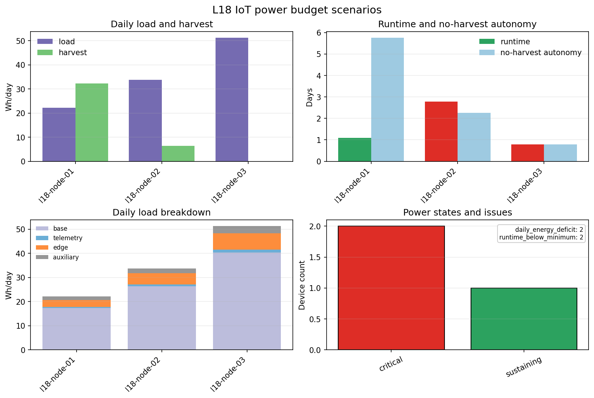

.. _user_guide_iot_power_management:

Power Management
================

Power management estimates whether field IoT nodes can survive the planned
deployment. The :mod:`pycsamt.iot.power` helpers combine battery capacity,
reserve, active/sleep duty cycle, regulator losses, telemetry windows,
edge-processing overhead, auxiliary loads, and optional solar harvesting.

The examples below use synthetic L18-style field nodes. That is the right
level for this page because power budgeting depends on device operations,
not EDI impedance files. The three scenarios represent a solar-assisted
node, a marginal node with high telemetry demand, and a critical node with
small battery capacity and no harvesting.

Build Device Power Profiles
---------------------------

Use :class:`pycsamt.iot.DevicePowerProfile` when several field nodes share
the same recorder hardware. The profile stores hardware draw; each
:class:`pycsamt.iot.EnergyConfig` stores deployment-specific conditions.

.. code-block:: python
   :linenos:

   from pycsamt.iot import DevicePowerProfile

   profile = DevicePowerProfile(
       "amt-recorder",
       active_power_w=1.6,
       sleep_power_w=0.12,
       telemetry_power_w=3.0,
       edge_power_w=0.35,
   )

   configs = [
       profile.apply(
           battery_wh=160.0,
           duty_cycle=0.35,
           solar_wh_per_day=38.0,
           charge_efficiency=0.85,
           reserve_fraction=0.20,
           regulator_efficiency=0.88,
           telemetry_seconds_per_day=420.0,
           edge_duty_cycle=0.35,
           auxiliary_wh_per_day=1.5,
           min_runtime_days=7.0,
           device_id="l18-node-01",
       ),
       profile.apply(
           battery_wh=95.0,
           duty_cycle=0.55,
           solar_wh_per_day=8.0,
           charge_efficiency=0.80,
           reserve_fraction=0.20,
           regulator_efficiency=0.85,
           telemetry_seconds_per_day=900.0,
           edge_duty_cycle=0.55,
           auxiliary_wh_per_day=2.0,
           min_runtime_days=7.0,
           device_id="l18-node-02",
       ),
       profile.apply(
           battery_wh=48.0,
           duty_cycle=0.85,
           solar_wh_per_day=0.0,
           reserve_fraction=0.15,
           regulator_efficiency=0.82,
           telemetry_seconds_per_day=1500.0,
           edge_duty_cycle=0.80,
           auxiliary_wh_per_day=3.0,
           min_runtime_days=7.0,
           device_id="l18-node-03",
       ),
   ]

Estimate One Device
-------------------

Use :func:`pycsamt.iot.estimate_energy_budget` for a single device. The
estimate reports daily load, daily harvest, net daily draw, runtime, state,
and machine-readable issues.

.. code-block:: python
   :linenos:

   from pycsamt.iot import estimate_energy_budget, power_summary_table

   estimate = estimate_energy_budget(configs[1])
   table = power_summary_table(estimate, device_ids=[configs[1].device_id])
   print(
       table[
           [
               "device_id",
               "state",
               "runtime_days",
               "load_wh_per_day",
               "harvest_wh_per_day",
               "net_wh_per_day",
               "energy_margin_wh_per_day",
               "issues",
           ]
       ].to_string(index=False)
   )

Output:

.. code-block:: text

     device_id    state  runtime_days  load_wh_per_day  harvest_wh_per_day  net_wh_per_day  energy_margin_wh_per_day                                     issues
   l18-node-02 critical       2.77963        33.741765                 6.4       27.341765                -27.341765 daily_energy_deficit;runtime_below_minimum

Estimate A Deployment
---------------------

Use :func:`pycsamt.iot.estimate_deployment_energy` when several nodes must
be compared. ``runtime_days`` is infinite when daily harvest is greater
than or equal to daily load.

.. code-block:: python
   :linenos:

   from pycsamt.iot import estimate_deployment_energy

   deployment = estimate_deployment_energy(configs)
   print(
       deployment[
           [
               "device_id",
               "state",
               "runtime_days",
               "autonomy_days_no_harvest",
               "load_wh_per_day",
               "harvest_wh_per_day",
               "net_wh_per_day",
               "issues",
           ]
       ].copy().round(
           {
               "runtime_days": 2,
               "autonomy_days_no_harvest": 2,
               "load_wh_per_day": 2,
               "harvest_wh_per_day": 2,
               "net_wh_per_day": 2,
           }
       ).to_string(index=False)
   )

Output:

.. code-block:: text

     device_id      state  runtime_days  autonomy_days_no_harvest  load_wh_per_day  harvest_wh_per_day  net_wh_per_day                                     issues
   l18-node-01 sustaining           inf                      5.77            22.19                32.3          -10.11
   l18-node-02   critical          2.78                      2.25            33.74                 6.4           27.34 daily_energy_deficit;runtime_below_minimum
   l18-node-03   critical          0.80                      0.80            51.30                 0.0           51.30 daily_energy_deficit;runtime_below_minimum

Encode Power Telemetry
----------------------

An :class:`~pycsamt.iot.EnergyEstimate` can be encoded as a ``power``
packet and added to a :class:`pycsamt.iot.FieldSession`. This keeps power
evidence next to edge QC, synchronisation, and station metadata.

.. code-block:: python
   :linenos:

   from pycsamt.iot import DeviceConfig, FieldSession

   devices = [
       DeviceConfig(
           cfg.device_id,
           station=f"00{i}A",
           channels=["ex", "ey", "hx", "hy"],
       )
       for i, cfg in enumerate(configs, start=1)
   ]
   session = FieldSession("WILLY-L18-POWER-DEMO", devices=devices)

   for idx, (device, cfg) in enumerate(zip(devices, configs)):
       packet = estimate_energy_budget(cfg).to_packet(
           device,
           timestamp=1_700_000_000.0 + 60.0 * idx,
           survey_id=session.survey_id,
       )
       session.add_packet(packet)

   packet = session.packets[1]
   print(f"topic: {packet.topic}")
   print(f"state: {packet.payload['state']}")
   print(f"runtime_days: {packet.payload['runtime_days']:.2f}")
   print(f"payload keys: {', '.join(sorted(packet.payload))}")

Output:

.. code-block:: text

   topic: pycsamt/WILLY-L18-POWER-DEMO/002A/l18-node-02/power
   state: critical
   runtime_days: 2.78
   payload keys: autonomy_days_no_harvest, auxiliary_wh_per_day, average_power_w, edge_wh_per_day, energy_margin_wh_per_day, harvest_wh_per_day, issues, load_wh_per_day, net_wh_per_day, reserve_wh, runtime_days, runtime_hours, state, telemetry_wh_per_day, usable_battery_wh

Plot Power Budgets
------------------

The plotting helper summarises daily load and harvest, runtime, no-harvest
autonomy, daily load components, and state counts.

.. code-block:: python
   :linenos:

   from pathlib import Path

   from pycsamt.iot import plot_power_budget

   out_dir = Path("docs/source/images/user_guide/iot")
   out_dir.mkdir(parents=True, exist_ok=True)

   plot_power_budget(
       configs,
       figsize=(10.8, 7.2),
       title="L18 IoT power budget scenarios",
       output_path=(
           out_dir / "user-guide-iot-power-management-01.png"
       ).as_posix(),
       close=True,
   )

Field Interpretation
--------------------

``l18-node-01`` is sustaining because harvested energy exceeds daily load.
Its no-harvest autonomy is still finite, so the deployment remains exposed
to cloudy weather or panel failure. ``l18-node-02`` and ``l18-node-03``
both have a daily energy deficit and fall below the seven-day minimum
runtime. The third node is the highest-risk case because it has small
battery capacity, high duty cycle, long telemetry windows, and no harvest.

In field planning, revise the critical nodes before deployment: reduce
duty cycle, shorten telemetry windows, add battery capacity, add solar
harvesting, or lower auxiliary load. Record the final budget in the
acquisition manifest so runtime assumptions remain auditable.
