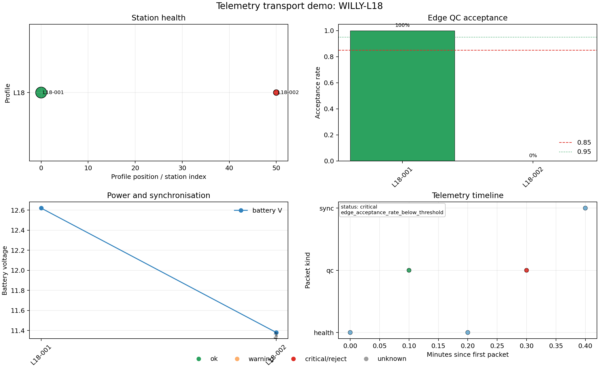

.. _user_guide_iot_telemetry:

Telemetry Transports
====================

Telemetry is the message layer between IoT field hardware and the rest of
the pyCSAMT acquisition workflow. A :term:`telemetry packet` carries a
device id, timestamp, canonical topic, packet kind, QoS flag, retained
flag, and a JSON-serialisable payload. The same packet can be sent to
MQTT, HTTP, serial, WebSocket, a JSON-lines file, or a dry-run recorder —
the transport changes, the packet does not.

Use dry-run clients while developing notebooks, dashboards, and examples:
they validate packets and record what would have been sent without opening
network or hardware connections. Use the file transport when you want an
offline replay log that can be read back later.

Create Canonical Packets
------------------------

Start by declaring the field devices. A :class:`~pycsamt.iot.core.DeviceConfig`
knows the station, acquisition channels, preferred protocol, and
canonical topic layout. Use
:meth:`~pycsamt.iot.core.TelemetryPacket.from_device` so the topic is
built consistently rather than assembled by hand at every call site.

.. code-block:: pycon

   >>> from pycsamt.iot import DeviceConfig, PacketKind, TelemetryPacket
   >>> devices = [
   ...     DeviceConfig(
   ...         "l18-node-01", station="L18-001", protocol="mqtt",
   ...         sample_rate_hz=256.0, channels=["ex", "ey", "hx", "hy"],
   ...     ),
   ...     DeviceConfig(
   ...         "l18-node-02", station="L18-002", protocol="mqtt",
   ...         sample_rate_hz=256.0, channels=["ex", "ey", "hx", "hy"],
   ...     ),
   ... ]
   >>> packets = [
   ...     TelemetryPacket.from_device(
   ...         devices[0], timestamp=1_700_000_000.0, survey_id="WILLY-L18-TELEMETRY",
   ...         kind=PacketKind.HEALTH,
   ...         payload={
   ...             "station": "L18-001", "battery_v": 12.62,
   ...             "temperature_c": 31.4, "firmware": "iot-demo-0.4.0",
   ...         },
   ...         qos=1,
   ...     ),
   ...     TelemetryPacket.from_device(
   ...         devices[0], timestamp=1_700_000_006.0, survey_id="WILLY-L18-TELEMETRY",
   ...         kind=PacketKind.QC,
   ...         payload={
   ...             "station": "L18-001", "method": "amt",
   ...             "channels": ["ex", "ey", "hx", "hy"],
   ...             "accepted": True, "decision": "accept",
   ...             "finite_coverage": 0.994, "frequency_band_hz": [2.0, 512.0],
   ...         },
   ...         qos=1,
   ...     ),
   ...     TelemetryPacket.from_device(
   ...         devices[1], timestamp=1_700_000_012.0, survey_id="WILLY-L18-TELEMETRY",
   ...         kind=PacketKind.HEALTH,
   ...         payload={
   ...             "station": "L18-002", "battery_v": 11.38,
   ...             "temperature_c": 33.1, "firmware": "iot-demo-0.4.0",
   ...         },
   ...         qos=1,
   ...     ),
   ...     TelemetryPacket.from_device(
   ...         devices[1], timestamp=1_700_000_018.0, survey_id="WILLY-L18-TELEMETRY",
   ...         kind=PacketKind.QC,
   ...         payload={
   ...             "station": "L18-002", "method": "amt",
   ...             "channels": ["ex", "ey", "hx", "hy"],
   ...             "accepted": False, "decision": "reject",
   ...             "finite_coverage": 0.861, "frequency_band_hz": [2.0, 512.0],
   ...             "reasons": ["finite_coverage_below_threshold"],
   ...         },
   ...         qos=1,
   ...     ),
   ...     TelemetryPacket.from_device(
   ...         devices[1], timestamp=1_700_000_024.0, survey_id="WILLY-L18-TELEMETRY",
   ...         kind=PacketKind.SYNC,
   ...         payload={
   ...             "station": "L18-002", "quality": "fair",
   ...             "clock_offset_ms": 4.8, "drift_ppm": 2.1,
   ...         },
   ...         qos=0,
   ...     ),
   ... ]
   >>> first = packets[0]
   >>> print(f"device_id: {first.device_id}")
   device_id: l18-node-01
   >>> print(f"kind: {first.kind.value}")
   kind: health
   >>> print(f"topic: {first.topic}")
   topic: pycsamt/WILLY-L18-TELEMETRY/L18-001/l18-node-01/health
   >>> print(f"qos: {first.qos}")
   qos: 1
   >>> print(f"retained: {first.retained}")
   retained: False
   >>> print(f"payload_keys: {', '.join(sorted(first.payload))}")
   payload_keys: battery_v, firmware, station, temperature_c

That topic is not free-form — ``DeviceConfig.topic`` always builds it as
``pycsamt/{survey_id}/{station}/{device_id}/{kind}`` (dropping the survey
segment when *survey_id* is omitted), so any two devices reporting the
same :term:`AMT` survey land under the same prefix and a monitoring
dashboard can subscribe with one wildcard instead of one pattern per
device.

Record A Dry-Run Transport
--------------------------

Use :func:`~pycsamt.iot.protocols.build_telemetry_client` for every
transport. The default ``dry_run=True`` is deliberate: examples and tests
can use MQTT, HTTP, serial, WebSocket, or LoRa-style names without
needing a broker, port, modem, or optional client library.

.. code-block:: pycon

   >>> from pycsamt.iot import build_telemetry_client
   >>> client = build_telemetry_client(
   ...     "mqtt", endpoint="mqtt://field-gateway.local:1883", dry_run=True,
   ... )
   >>> client.subscribe("pycsamt/WILLY-L18-TELEMETRY/+/+/qc")
   >>> for packet in packets[:2]:
   ...     ack = client.send(packet)
   >>> print(f"protocol: {ack.protocol}")
   protocol: mqtt
   >>> print(f"ack_ok: {ack.ok}")
   ack_ok: True
   >>> print(f"ack_detail: {ack.detail}")
   ack_detail: dry-run packet recorded
   >>> print(f"recorded_packets: {len(client.sent)}")
   recorded_packets: 2
   >>> print(f"subscriptions: {', '.join(client.subscriptions)}")
   subscriptions: pycsamt/WILLY-L18-TELEMETRY/+/+/qc
   >>> print(f"healthcheck: {client.healthcheck()}")
   healthcheck: True

JSONL Write And Replay
----------------------

The file transport is the most useful offline transport. It writes one
packet dictionary per line, can be read back by another file client, and
does not require any optional dependencies.

.. code-block:: pycon

   >>> from pathlib import Path
   >>> result_dir = Path("results")
   >>> result_dir.mkdir(exist_ok=True)
   >>> jsonl_path = result_dir / "iot-telemetry-demo.jsonl"
   >>> if jsonl_path.exists():
   ...     jsonl_path.unlink()
   >>> with build_telemetry_client(
   ...     "file", endpoint=str(jsonl_path), dry_run=False, append=False,
   ... ) as file_client:
   ...     for packet in packets:
   ...         ack = file_client.send(packet)
   ...     print(f"protocol: {ack.protocol}")
   ...     print(f"ack_ok: {ack.ok}")
   ...     print(f"detail: {ack.detail}")
   ...     print(f"sent_packets: {len(file_client.sent)}")
   protocol: file
   ack_ok: True
   detail: appended to results\iot-telemetry-demo.jsonl
   sent_packets: 5
   >>> reader = build_telemetry_client("file", endpoint=str(jsonl_path), dry_run=False)
   >>> rows = reader.read_all()
   >>> print(f"jsonl_rows: {len(rows)}")
   jsonl_rows: 5
   >>> print(f"first_row_kind: {rows[0]['kind']}")
   first_row_kind: health
   >>> print(f"first_row_station: {rows[0]['payload']['station']}")
   first_row_station: L18-001

A second, independent client reading the same path back confirms the
round trip: five rows, in send order, each a plain dictionary rather than
a live ``TelemetryPacket`` — exactly the shape a later offline analysis
or a restarted node would need to pick the stream back up.

Inspect Packet Tables
---------------------

Use :func:`~pycsamt.iot.monitoring.packet_table` for a flat packet
inventory and :func:`~pycsamt.iot.monitoring.telemetry_summary` for
counts by device/topic. These tables are useful before monitoring
because they reveal missing packet kinds, wrong topics, or devices that
stopped reporting.

.. code-block:: pycon

   >>> from pycsamt.iot import packet_table, telemetry_summary
   >>> packet_df = packet_table(packets)
   >>> print(
   ...     packet_df[
   ...         ["device_id", "kind", "timestamp", "payload_keys"]
   ...     ].to_string(index=False)
   ... )
     device_id   kind    timestamp                                                                        payload_keys
   l18-node-01 health 1700000000.0                                            battery_v;firmware;station;temperature_c
   l18-node-01     qc 1700000006.0         accepted;channels;decision;finite_coverage;frequency_band_hz;method;station
   l18-node-02 health 1700000012.0                                            battery_v;firmware;station;temperature_c
   l18-node-02     qc 1700000018.0 accepted;channels;decision;finite_coverage;frequency_band_hz;method;reasons;station
   l18-node-02   sync 1700000024.0                                           clock_offset_ms;drift_ppm;quality;station
   >>> summary = telemetry_summary(packets)
   >>> print(summary[["device_id", "topic", "n_packet"]].to_string(index=False))
     device_id                                                  topic  n_packet
   l18-node-01 pycsamt/WILLY-L18-TELEMETRY/L18-001/l18-node-01/health         1
   l18-node-01     pycsamt/WILLY-L18-TELEMETRY/L18-001/l18-node-01/qc         1
   l18-node-02 pycsamt/WILLY-L18-TELEMETRY/L18-002/l18-node-02/health         1
   l18-node-02     pycsamt/WILLY-L18-TELEMETRY/L18-002/l18-node-02/qc         1
   l18-node-02   pycsamt/WILLY-L18-TELEMETRY/L18-002/l18-node-02/sync         1

Both nodes reported exactly once per packet kind here, so the summary is
unremarkable by design — in a real deployment this is the table to scan
first for a device that has a ``health`` row but no ``qc`` row, or a
topic count that dropped mid-survey.

Telemetry In A Session
----------------------

Add packets to a :term:`field session` when you want telemetry to
interact with station metadata, monitoring thresholds, and dashboards.
The example below is intentionally synthetic and deterministic: station
``L18-002`` rejects one QC packet, so the :term:`monitoring status` is
marked critical. :doc:`basic_session` derives the :term:`packet success
rate`, :term:`edge acceptance rate`, and :term:`packet gap` formulas
behind ``status`` in full; here the same status is read off a stream that
was built from real telemetry packets and transports rather than
hand-built packet dicts.

.. code-block:: pycon

   >>> from pycsamt.iot import FieldSession, MonitoringConfig, StationConfig
   >>> stations = [
   ...     StationConfig(
   ...         "L18-001", profile="L18", position_m=0.0,
   ...         lat=7.501, lon=-5.201, channels=["ex", "ey", "hx", "hy"],
   ...     ),
   ...     StationConfig(
   ...         "L18-002", profile="L18", position_m=50.0,
   ...         lat=7.502, lon=-5.198, channels=["ex", "ey", "hx", "hy"],
   ...     ),
   ... ]
   >>> session = FieldSession(
   ...     "WILLY-L18-TELEMETRY", devices=devices, stations=stations,
   ...     monitoring_config=MonitoringConfig(
   ...         method="amt", expected_interval_s=6.0, max_gap_s=18.0,
   ...         min_edge_acceptance_rate=0.75, min_battery_v=11.2,
   ...         required_channels=["ex", "ey", "hx", "hy"],
   ...     ),
   ... )
   >>> session.add_packets(packets)
   >>> status = session.assess(now=1_700_000_030.0)
   >>> print(f"level: {status.level.value}")
   level: critical
   >>> print(f"n_packet: {status.n_packet}")
   n_packet: 5
   >>> print(f"packet_success_rate: {status.packet_success_rate:.3f}")
   packet_success_rate: 1.000
   >>> print(f"edge_acceptance_rate: {status.edge_acceptance_rate:.3f}")
   edge_acceptance_rate: 0.500
   >>> print(f"max_gap_s: {status.max_gap_s:.1f}")
   max_gap_s: 6.0
   >>> print(f"issues: {', '.join(status.issues) or '-'}")
   issues: edge_acceptance_rate_below_threshold

The packet stream is complete — every send above succeeded, so
``packet_success_rate`` is a perfect ``1.000`` — but ``edge_acceptance_rate``
is only ``0.500`` because one of the two QC packets carried
``decision: reject``. Transport health and content quality are
independent axes, and this status shows a session where the first is
perfect and the second is not.

The Telemetry Dashboard
-----------------------

Use :func:`~pycsamt.iot.plot.plot_field_dashboard` to visualise the same
session. This figure combines station status, edge-QC acceptance, power
or synchronisation status, and packet timing.

.. code-block:: pycon

   >>> from pathlib import Path
   >>> from pycsamt.iot import plot_field_dashboard
   >>> out_dir = Path("docs/source/images/user_guide/iot")
   >>> out_dir.mkdir(parents=True, exist_ok=True)
   >>> fig = plot_field_dashboard(
   ...     session, now=1_700_000_030.0, station_axis="profile",
   ...     title="Telemetry transport demo: WILLY-L18",
   ... )
   >>> fig.savefig(out_dir / "user-guide-iot-telemetry-01.png", dpi=180)

The station-health panel puts ``L18-001`` green at chainage 0 and
``L18-002`` red at chainage 50, and the acceptance panel repeats the same
verdict as bars: 100% for ``L18-001`` against 0% for ``L18-002``, exactly
the one rejected QC packet from above. The power panel shows both
stations' single battery reading — 12.62 V and 11.38 V — connected by a
line that is not a real trend, just the only two samples available; the
rotated label at ``L18-002`` reads ``fair``, the sync quality carried on
that station's one ``sync`` packet, since there is no separate power
packet to report a power state. The timeline in the bottom right spans
the 24 real seconds between the first and last packet (shown as 0.4
minutes), with the rejected QC packet rendering red against three blue
"unknown" points — health and sync packets carry no ``accepted`` field,
so the timeline correctly declines to guess a colour for them rather than
defaulting to green.

Transport Choices
-----------------

The transport name controls the client returned by
:func:`~pycsamt.iot.protocols.build_telemetry_client`.

.. list-table::
   :header-rows: 1
   :widths: 18 34 48

   * - Protocol
     - Client
     - Typical use
   * - ``file``
     - :class:`~pycsamt.iot.protocols.FileTelemetryClient`
     - Offline logging, replay, tests, documentation.
   * - ``mqtt``
     - :class:`~pycsamt.iot.protocols.MQTTTelemetryClient`
     - Field broker publishing and topic subscriptions.
   * - ``http``
     - :class:`~pycsamt.iot.protocols.HTTPTelemetryClient`
     - Gateway POST requests to an API endpoint.
   * - ``serial``
     - :class:`~pycsamt.iot.protocols.SerialTelemetryClient`
     - UART links to local acquisition hardware.
   * - ``websocket``
     - :class:`~pycsamt.iot.protocols.WebSocketTelemetryClient`
     - Live dashboard streams.
   * - ``lora``
     - :class:`~pycsamt.iot.protocols.TelemetryClient`
     - Dry-run recorder unless a project-specific transport is added.

MQTT, serial, and WebSocket use optional third-party libraries only when a
real connection is opened. Keep ``dry_run=True`` in notebooks, CI jobs,
and documentation examples unless you intentionally want to contact a
field endpoint.

Backoff And Retry
-----------------

Remote nodes lose their link. Wrap any client in a
:term:`store-and-forward` :class:`~pycsamt.iot.protocols.StoreAndForwardClient`
so a failed send queues the packet instead of dropping it;
:meth:`~pycsamt.iot.protocols.store_forward.StoreAndForwardClient.flush`
later drains the backlog in order, and an optional spool file carries it
across a restart. The demo below stands in a transport that is
deliberately down for its first three send attempts, so the queueing,
backoff, and eventual drain are all visible in real output rather than
asserted in a comment:

.. code-block:: pycon

   >>> from pycsamt.iot import StoreAndForwardClient
   >>> from pycsamt.iot.protocols.base import (
   ...     BaseTelemetryClient, IoTProtocol, TelemetryError,
   ... )
   >>> class FlakyClient(BaseTelemetryClient):
   ...     """Stands in for a real HTTP/MQTT client whose uplink is down."""
   ...     protocol = IoTProtocol.HTTP
   ...     def __init__(self, *, fail_times: int = 3, **kwargs):
   ...         super().__init__(dry_run=False, **kwargs)
   ...         self._fail_times = fail_times
   ...         self._attempts = 0
   ...     def _transport_send(self, packet):
   ...         self._attempts += 1
   ...         if self._attempts <= self._fail_times:
   ...             raise TelemetryError(
   ...                 f"simulated uplink outage (attempt {self._attempts})"
   ...             )
   ...         return f"sent after outage (attempt {self._attempts})"
   >>> uplink = FlakyClient(endpoint="https://hub/ingest", fail_times=3)
   >>> buffered = StoreAndForwardClient(
   ...     uplink, max_queue=5000, base_backoff_s=2.0, max_backoff_s=60.0,
   ... )
   >>> ack1 = buffered.send(packets[0])
   >>> print(f"send health#1: ok={ack1.ok} detail={ack1.detail!r} pending={buffered.pending}")
   send health#1: ok=False detail='queued: simulated uplink outage (attempt 1)' pending=1
   >>> ack2 = buffered.send(packets[2])
   >>> print(f"send health#2: ok={ack2.ok} detail={ack2.detail!r} pending={buffered.pending}")
   send health#2: ok=False detail='queued behind backlog' pending=2
   >>> print(f"next_retry_delay_s: {buffered.next_retry_delay_s}")
   next_retry_delay_s: 2.0
   >>> for i in range(1, 4):
   ...     sent = buffered.flush()
   ...     print(
   ...         f"flush #{i}: sent={sent} pending={buffered.pending} "
   ...         f"next_retry_delay_s={buffered.next_retry_delay_s}"
   ...     )
   flush #1: sent=0 pending=2 next_retry_delay_s=2.0
   flush #2: sent=0 pending=2 next_retry_delay_s=4.0
   flush #3: sent=2 pending=0 next_retry_delay_s=0.0

The first send attempts a real delivery — because the queue starts empty
— fails, and queues; the second never even tries the transport, since a
backlog is never overtaken by fresh packets (order-preserving,
at-least-once delivery). Each failed flush increments an internal failure
counter :math:`n`, and ``next_retry_delay_s`` grows as

.. math::

   \mathrm{delay} =
   \min\!\left(b \cdot 2^{\,n-1},\ b_{\max}\right), \qquad n \ge 1,

with base delay :math:`b=` ``base_backoff_s`` and ceiling
:math:`b_{\max}=` ``max_backoff_s`` — here :math:`2.0 \to 4.0` seconds
after the two failed flushes above, before the third flush finally
succeeds (the uplink stops failing after its third attempt) and drains
both packets in order, resetting the delay to ``0.0``.

Bounded Queue Overflow
----------------------

``max_queue`` bounds the buffer with a drop-oldest policy: once it is
full, the newest packet is always kept and the oldest is discarded,
because live survey monitoring cares more about the current state than a
stale backlog entry.

.. code-block:: pycon

   >>> overflow = StoreAndForwardClient(
   ...     FlakyClient(endpoint="https://hub/ingest", fail_times=99),
   ...     max_queue=3,
   ... )
   >>> for i in range(5):
   ...     p = TelemetryPacket.from_device(
   ...         devices[0], timestamp=1_700_000_000.0 + i,
   ...         kind=PacketKind.HEALTH, payload={"seq": i},
   ...     )
   ...     _ = overflow.send(p)
   >>> print(f"pending: {overflow.pending}, n_dropped: {overflow.n_dropped}")
   pending: 3, n_dropped: 2
   >>> print(f"kept seqs: {[pkt.payload['seq'] for pkt in overflow.queue]}")
   kept seqs: [2, 3, 4]

Five packets went in, but a ``fail_times=99`` uplink never accepts one, so
every send queues and the buffer immediately starts evicting: seqs ``0``
and ``1`` are gone, and ``[2, 3, 4]`` — the three most recent — are what
remain. This is a distinct failure mode from the acceptance-rate story
above: nothing here is about packet *content* being rejected, only about
*delivery* falling behind a hard capacity limit. A node that queues
through a temporary outage and later drains its backlog never shows up as
a missing packet in the tables earlier on this page — it just arrives
late and in order, with the same at-least-once delivery guarantee as the
rest of the transport layer. For real surveys, keep topic names stable
across the acquisition campaign and persist file logs or broker exports
with the processing report, so that a backlog like this one is auditable
after the fact rather than silently lost. :doc:`monitoring` picks up from
here, turning packet streams like the ones on this page into the
threshold checks behind ``status.level`` and ``status.issues``.
