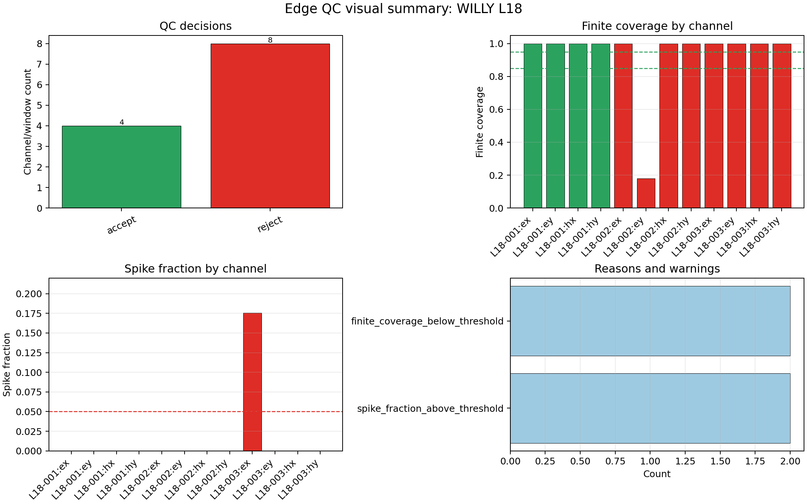
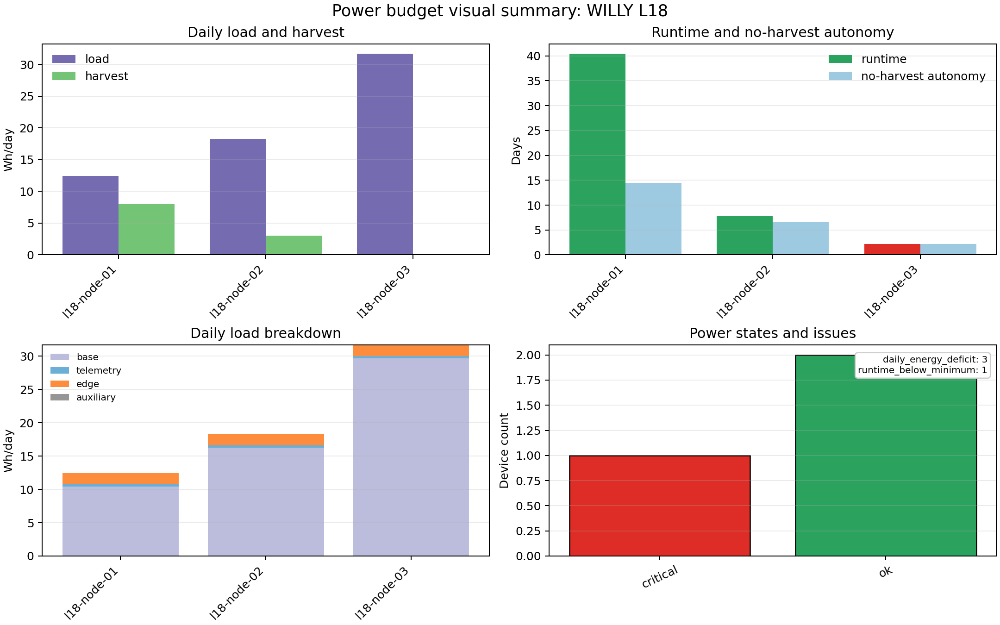
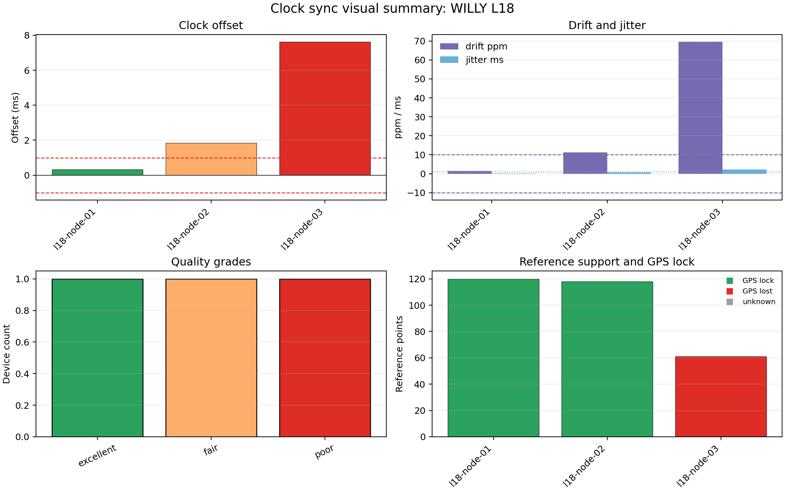

.. _user_guide_iot_visualization:

Visualization
=============

The IoT plotting layer lives in :mod:`pycsamt.iot.plot` and is re-exported
from :mod:`pycsamt.iot`. These figures are :term:`operational acquisition
plot`\ s: they show telemetry health, :term:`edge decision`\ s,
:term:`power budget`, and clock synchronisation before the data are
converted into impedance products or inversion inputs. Every function
covered on this page has already appeared once elsewhere in this
guide — :func:`~pycsamt.iot.plot.plot_field_dashboard` in
:doc:`basic_session` and :doc:`telemetry`,
:func:`~pycsamt.iot.plot.plot_edge_qc_summary` in :doc:`edge_qc` — but
always attached to the topic that page was teaching. Here they are the
subject: what each panel actually plots, where its numbers come from, and
which function to reach for first.

The plotting functions accept high-level objects such as
:class:`~pycsamt.iot.session.FieldSession`, :term:`telemetry packet`\ s,
:term:`energy estimate`\ s, :term:`synchronisation status` objects, or
serialised mappings. Each returned :term:`Matplotlib figure` also carries
the :term:`normalised plot data` used to draw the panels in a
``fig.pycsamt_iot_*`` attribute. That makes report generation auditable:
the image and the plotted rows stay together, so a reviewer can
reconstruct exactly what a bar or point represents without re-deriving it
from the raw packets.

Building A Visualisation Session
--------------------------------

This example uses :term:`synthetic data` built deterministically from a
fixed seed. It creates three stations on profile ``L18``: one healthy,
one with poor :term:`finite coverage` on one channel, and one with a
spike on another. Each station gets a QC packet (run through the same
:class:`~pycsamt.iot.edge.EdgeProcessor` introduced in :doc:`edge_qc`), a
health packet, a power packet, and a sync packet, so every one of the
four plotting functions below has real data to draw. With :math:`N_s=3`
stations and four packets each, the total is :math:`4N_s=12`.

.. code-block:: pycon

   >>> import numpy as np
   >>> from pycsamt.iot import (
   ...     DeviceConfig, EdgeProcessingConfig, EdgeProcessor, EnergyConfig,
   ...     FieldSession, MonitoringConfig, PacketKind, StationConfig,
   ...     TelemetryPacket, estimate_energy_budget,
   ... )
   >>> survey_id = "WILLY-L18-VISUAL"
   >>> station_ids = ["L18-001", "L18-002", "L18-003"]
   >>> positions_m = [0.0, 50.0, 100.0]
   >>> coords = [(7.501, -5.201), (7.502, -5.198), (7.503, -5.195)]
   >>> devices = [
   ...     DeviceConfig(
   ...         f"l18-node-{i + 1:02d}", station=sid,
   ...         channels=["ex", "ey", "hx", "hy"], sample_rate_hz=256.0,
   ...     )
   ...     for i, sid in enumerate(station_ids)
   ... ]
   >>> stations = [
   ...     StationConfig(
   ...         sid, profile="L18", position_m=pos, lat=lat, lon=lon,
   ...         channels=["ex", "ey", "hx", "hy"],
   ...     )
   ...     for sid, pos, (lat, lon) in zip(station_ids, positions_m, coords)
   ... ]
   >>> session = FieldSession(
   ...     survey_id, devices=devices, stations=stations,
   ...     monitoring_config=MonitoringConfig(
   ...         method="amt", expected_interval_s=6.0, max_gap_s=18.0,
   ...         min_edge_acceptance_rate=0.70, min_battery_v=11.2,
   ...         required_channels=["ex", "ey", "hx", "hy"],
   ...     ),
   ... )
   >>> processor = EdgeProcessor(
   ...     EdgeProcessingConfig(
   ...         decimation=1, finite_threshold=0.85, warn_finite_threshold=0.95,
   ...         channel_names=["ex", "ey", "hx", "hy"], spike_threshold=4.0,
   ...         max_spike_fraction=0.12,
   ...     )
   ... )
   >>> rng = np.random.default_rng(42)
   >>> battery_v = [12.55, 11.84, 10.92]
   >>> temperature_c = [30.1, 31.4, 33.2]
   >>> battery_wh = [180.0, 120.0, 70.0]
   >>> active_power_w = [1.2, 1.6, 2.1]
   >>> duty_cycle = [0.25, 0.35, 0.55]
   >>> solar_wh_per_day = [8.0, 3.0, 0.0]
   >>> sync_specs = [
   ...     {"offset_ms": 0.32, "drift_ppm": 1.4, "jitter_ms": 0.16,
   ...      "gps_lock": True, "n_reference_points": 120, "quality": "excellent"},
   ...     {"offset_ms": 1.84, "drift_ppm": 11.2, "jitter_ms": 0.72,
   ...      "gps_lock": True, "n_reference_points": 118, "quality": "fair"},
   ...     {"offset_ms": 7.62, "drift_ppm": 69.5, "jitter_ms": 2.15,
   ...      "gps_lock": False, "n_reference_points": 61, "quality": "poor"},
   ... ]
   >>> for idx, device in enumerate(devices):
   ...     data = rng.normal(size=(256, 4))
   ...     if idx == 1:
   ...         data[20:230, 1] = np.nan
   ...     if idx == 2:
   ...         data[80:125, 0] = 15.0
   ...     edge = processor.process(data)
   ...     qc_packet = edge.to_packet(
   ...         device, timestamp=1_700_000_000.0 + idx * 6.0,
   ...         survey_id=survey_id, qos=1,
   ...     )
   ...     qc_packet.payload["station"] = device.station
   ...     qc_packet.payload["method"] = "amt"
   ...     _ = session.add_packet(qc_packet)
   ...     health = TelemetryPacket.from_device(
   ...         device, timestamp=1_700_000_002.0 + idx * 6.0,
   ...         survey_id=survey_id, kind=PacketKind.HEALTH,
   ...         payload={
   ...             "station": device.station, "battery_v": battery_v[idx],
   ...             "temperature_c": temperature_c[idx],
   ...         },
   ...     )
   ...     _ = session.add_packet(health)
   ...     power_config = EnergyConfig(
   ...         battery_wh=battery_wh[idx], active_power_w=active_power_w[idx],
   ...         sleep_power_w=0.18, duty_cycle=duty_cycle[idx],
   ...         solar_wh_per_day=solar_wh_per_day[idx], telemetry_power_w=2.0,
   ...         telemetry_seconds_per_day=600.0, edge_power_w=0.35,
   ...         edge_duty_cycle=0.20, min_runtime_days=5.0,
   ...         device_id=device.device_id,
   ...     )
   ...     power_packet = estimate_energy_budget(power_config).to_packet(
   ...         device, timestamp=1_700_000_004.0 + idx * 6.0, survey_id=survey_id,
   ...     )
   ...     power_packet.payload["station"] = device.station
   ...     _ = session.add_packet(power_packet)
   ...     sync_payload = dict(sync_specs[idx], station=device.station)
   ...     _ = session.add_packet(
   ...         TelemetryPacket.from_device(
   ...             device, timestamp=1_700_000_006.0 + idx * 6.0,
   ...             survey_id=survey_id, kind=PacketKind.SYNC, payload=sync_payload,
   ...         )
   ...     )
   >>> print((session.survey_id, session.n_devices, session.n_stations, session.n_packets))
   ('WILLY-L18-VISUAL', 3, 3, 12)

The Field Dashboard
-------------------

:func:`~pycsamt.iot.plot.plot_field_dashboard` is the at-a-glance
:term:`field dashboard`: station health, edge-QC acceptance, power or
synchronisation state, and packet timing in four panels. Internally it
starts from ``session.to_pipeline_input()`` and the packet stream, then
joins the latest battery voltage, runtime, power state, clock offset, and
sync quality onto each station row. A station is marked critical when its
power state is critical, its sync quality is poor, or its acceptance
rate is below 0.85; it is marked warning when the acceptance rate is
below 0.95 or when power/sync is warning/fair. The acceptance panel
displays :math:`A_i=n_{\mathrm{accepted},i}/n_{\mathrm{qc},i}` for each
station, and the timeline uses minutes since the first finite packet
timestamp.

.. code-block:: pycon

   >>> from pycsamt.iot import plot_field_dashboard
   >>> dashboard = plot_field_dashboard(
   ...     session, now=1_700_000_030.0, station_axis="profile",
   ...     title="IoT field dashboard: WILLY L18",
   ... )
   >>> dashboard_data = dashboard.pycsamt_iot_dashboard
   >>> print(f"dashboard_stations: {len(dashboard_data['stations'])}")
   dashboard_stations: 3
   >>> print(f"dashboard_packets: {len(dashboard_data['packets'])}")
   dashboard_packets: 12
   >>> print(f"monitoring_level: {dashboard_data['monitoring']['level']}")
   monitoring_level: critical
   >>> print(f"issues: {', '.join(dashboard_data['issues']) or '-'}")
   issues: battery_below_threshold, edge_acceptance_rate_below_threshold, required_channels_missing

``station_axis`` only changes one of the four panels: ``"profile"`` lays
stations out by chainage, while ``"map"`` uses longitude/latitude — and
since every station here carries real coordinates, both are worth seeing
side by side rather than picking one arbitrarily. The script below
rebuilds the session and saves the ``"profile"`` dashboard shown as the
first figure further down:

.. code-dropdown:: ../../../scripts/generate_user_guide_iot_visualization_figures.py
   :language: python
   :pyobject: make_field_dashboard_profile
   :linenos:
   :title: View profile-view dashboard source code

The map variant changes nothing but that one keyword argument — same
session, same thresholds, just ``station_axis="map"`` — and saves the
second figure:

.. code-dropdown:: ../../../scripts/generate_user_guide_iot_visualization_figures.py
   :language: python
   :pyobject: make_field_dashboard_map
   :linenos:
   :title: View map-view dashboard source code

.. grid:: 1 1 2 2

   .. grid-item::

      .. image:: ../../images/user_guide/iot/user-guide-iot-visualization-01.png
         :width: 100%

   .. grid-item::

      .. image:: ../../images/user_guide/iot/user-guide-iot-visualization-05.png
         :width: 100%

The station-health panel is the only thing that changes between the two:
chainage 0/50/100 m becomes longitude/latitude, and ``L18-001`` stays the
one large green marker in both. The other three panels — acceptance,
power/sync, timeline — read from the same station and packet rows
regardless of axis choice, so they are pixel-identical between the two
figures. Reach for ``"map"`` once a survey is no longer a single straight
line and chainage stops being a meaningful x-axis; use ``"profile"`` for
ordinary line work, which is the more common case and the default this
guide otherwise uses.

Edge QC Detail
--------------

Use :func:`~pycsamt.iot.plot.plot_edge_qc_summary` when the dashboard
indicates that edge quality is the problem — the same function
:doc:`edge_qc` introduced on synthetic windows, now reading straight from
a session. It accepts a :class:`~pycsamt.iot.session.FieldSession`, one
or more QC telemetry packets, or raw
:class:`~pycsamt.iot.edge.EdgeProcessingResult` objects, and normalises
whichever it receives into one row per station/channel pair. From that
row set it counts decisions, plots :term:`finite coverage` against the
configured warning/rejection thresholds, plots :term:`robust spike
fraction`, and tallies rejection or warning reasons — each window-level
reason once per window, each channel-level reason once per channel,
exactly as derived in :doc:`edge_qc`.

.. code-block:: pycon

   >>> from pycsamt.iot import plot_edge_qc_summary
   >>> qc_fig = plot_edge_qc_summary(session, title="Edge QC visual summary: WILLY L18")
   >>> qc_rows = qc_fig.pycsamt_iot_edge_qc
   >>> print(f"qc_rows: {len(qc_rows)}")
   qc_rows: 12
   >>> print(f"qc_decisions: {sorted({row['decision'] for row in qc_rows})}")
   qc_decisions: ['accept', 'reject']
   >>> print(f"qc_channels: {sorted({row['channel'] for row in qc_rows})}")
   qc_channels: ['ex', 'ey', 'hx', 'hy']

.. code-dropdown:: ../../../scripts/generate_user_guide_iot_visualization_figures.py
   :language: python
   :pyobject: make_edge_qc_summary
   :linenos:
   :title: View edge-QC summary source code

All four of ``L18-001``'s channels are green and accepted; all eight
channels across the other two stations are red and rejected, matching
the dashboard's stream-wide acceptance already shown above. The coverage
panel isolates exactly where: ``L18-002:ey`` alone drops to about 0.18,
the injected NaN block from the session-building step, while every other
channel — including ``L18-002``'s other three — sits at a clean 1.0. The
spike panel is the mirror image, flagging only ``L18-003:ex``, where the
15.0 outlier was injected. The reasons panel totals two occurrences of
each failure kind, not four or eight: one window-level reason per
rejected station plus one matching channel-level reason from the specific
channel that triggered it, counted the way :doc:`edge_qc` derived rather
than repeated once per channel in the row set.

Power Budgets
-------------

Use :func:`~pycsamt.iot.plot.plot_power_budget` to compare daily load,
harvest, runtime, and power states. The input can be a session containing
power packets, a list of :class:`~pycsamt.iot.power.EnergyConfig`
objects, power telemetry packets, or energy estimates. The first panel
compares daily load :math:`L_i` with harvested energy :math:`H_i`; the
runtime panel compares estimated runtime
:math:`T_i=E_{\mathrm{usable},i}/\max(L_i-H_i,0)` with :term:`no-harvest
autonomy`; the breakdown panel stacks base, telemetry, edge-processing,
and auxiliary load components so the sum returns :math:`L_i`. The final
panel counts :term:`power state` values and lists the most common issues.

.. code-block:: pycon

   >>> from pycsamt.iot import plot_power_budget
   >>> power_fig = plot_power_budget(session, title="Power budget visual summary: WILLY L18")
   >>> power_rows = power_fig.pycsamt_iot_power_budget
   >>> print(f"power_rows: {len(power_rows)}")
   power_rows: 3
   >>> print(f"power_states: {sorted({row['state'] for row in power_rows})}")
   power_states: ['critical', 'ok']
   >>> print(
   ...     "runtime_days: "
   ...     + ", ".join(
   ...         "inf" if np.isinf(row["runtime_days"]) else f"{row['runtime_days']:.2f}"
   ...         for row in power_rows
   ...     )
   ... )
   runtime_days: 40.42, 7.86, 2.21

.. code-dropdown:: ../../../scripts/generate_user_guide_iot_visualization_figures.py
   :language: python
   :pyobject: make_power_budget
   :linenos:
   :title: View power-budget source code

``l18-node-03`` is the node to worry about: its load/harvest panel shows
a full purple load bar and no green harvest bar at all — zero solar input
was deliberately configured for that node — and its runtime bar in the
second panel barely clears the x-axis at 2.21 days, coloured red for
``critical`` while the other two stay green. The breakdown panel shows
why the load itself is so much higher than the other two nodes: base load
dominates every bar, but ``l18-node-03``'s base load alone (about 29.7
Wh/day) is nearly triple ``l18-node-01``'s (about 10.4 Wh/day), consistent
with its higher configured
``active_power_w`` and duty cycle. The states panel's issue list —
``daily_energy_deficit`` on three devices, ``runtime_below_minimum`` on
one — makes explicit that a negative harvest margin and an unacceptably
short runtime are two different thresholds, not the same check reported
twice.

Clock Synchronisation
---------------------

Use :func:`~pycsamt.iot.plot.plot_sync_quality` to inspect offset, drift,
jitter, reference support, GPS lock, and quality grades. Threshold
arguments draw reference lines but do not mutate the data. Each sync row
carries the same quantities used by the clock-sync audit: :term:`clock
offset` :math:`o_i`, :term:`clock drift` :math:`d_i`, :term:`timing
jitter` :math:`j_i`, :term:`GPS lock`, and the number of reference
points. The visual thresholds are overlays only: a tolerance line at
:math:`|o|=o_{\max}`, a drift line at :math:`|d|=d_{\max}`, and a jitter
line at :math:`j=j_{\max}`.

.. code-block:: pycon

   >>> from pycsamt.iot import plot_sync_quality
   >>> sync_fig = plot_sync_quality(
   ...     session, title="Clock sync visual summary: WILLY L18",
   ...     tolerance_ms=1.0, max_drift_ppm=10.0, max_jitter_ms=1.0,
   ... )
   >>> sync_rows = sync_fig.pycsamt_iot_sync_quality
   >>> print(f"sync_rows: {len(sync_rows)}")
   sync_rows: 3
   >>> print(f"sync_quality: {sorted({row['quality'] for row in sync_rows})}")
   sync_quality: ['excellent', 'fair', 'poor']
   >>> print(f"gps_lock_values: {[row['gps_lock'] for row in sync_rows]}")
   gps_lock_values: [True, True, False]

.. code-dropdown:: ../../../scripts/generate_user_guide_iot_visualization_figures.py
   :language: python
   :pyobject: make_sync_quality
   :linenos:
   :title: View clock-sync source code

``l18-node-03`` again stands out, and for a related but distinct reason:
its clock offset clears the 1 ms tolerance line by more than 7×, and its
drift bar is the only one anywhere near the 10 ppm line — nearly 70 ppm,
almost seven times the threshold — while its jitter stays comparatively
modest.
The reference-support panel explains part of why: that node has only 61
reference points against 118-120 for the other two, and is the only one
that lost GPS lock, so its clock has both worse raw timing and less data
backing the estimate. Quality grades run one node per bucket here purely
because the synthetic data was built that way; a real deployment would
usually show several nodes sharing each grade.

Choosing The Right Plot
-----------------------

.. list-table::
   :header-rows: 1
   :widths: 28 32 40

   * - Function
     - Best input
     - Use it for
   * - :func:`~pycsamt.iot.plot.plot_field_dashboard`
     - :class:`~pycsamt.iot.session.FieldSession`
     - Survey status, station health, packet timing, acceptance rates.
   * - :func:`~pycsamt.iot.plot.plot_edge_qc_summary`
     - Session, QC packets, or edge results
     - Rejection reasons, finite coverage, spike fractions.
   * - :func:`~pycsamt.iot.plot.plot_power_budget`
     - Session, power packets, energy configs, or estimates
     - Runtime, harvest/load balance, power states.
   * - :func:`~pycsamt.iot.plot.plot_sync_quality`
     - Session, sync packets, or sync status rows
     - Offset, drift, jitter, GPS lock, synchronisation grades.

Use the dashboard first when reviewing a live or replayed acquisition
session. If it reports a telemetry issue, inspect the packet tables and
monitoring summary from :doc:`monitoring`. If it reports edge-acceptance
problems, move to the QC summary above. If a station is losing voltage or
runtime margin, use the power plot; if packet timing or GPS lock looks
suspicious, use the sync plot — in this example's session, that chain of
reasoning leads to ``l18-node-03`` from three independent directions at
once. These figures do not replace MT/AMT/CSAMT response plots. They
explain the condition of the acquisition system that produced the data,
which is exactly the context needed before deciding whether a station
should enter the geophysical processing workflow.
