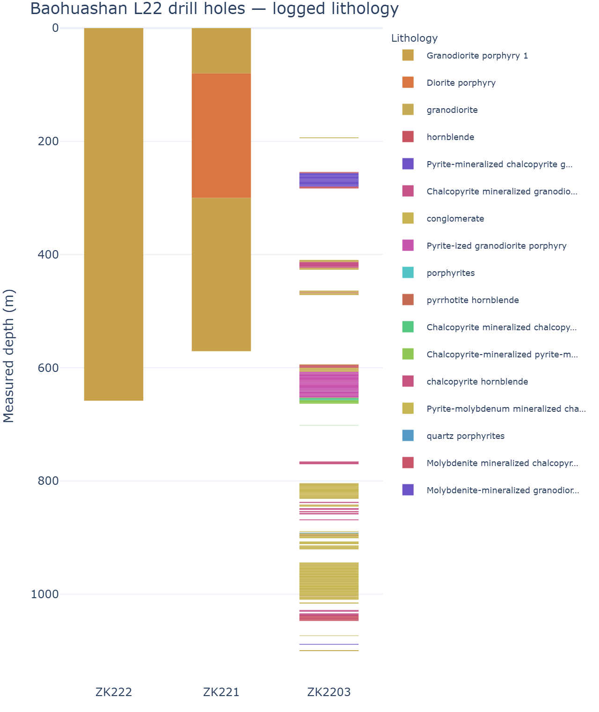
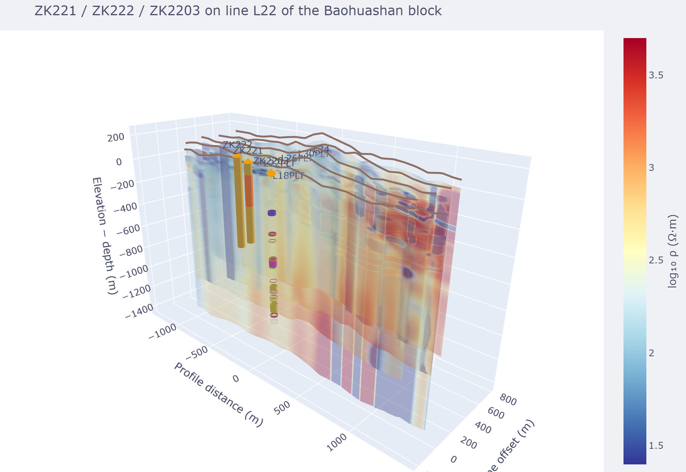

.. _map_boreholes:

Boreholes in Map View
=====================

Map View can carry boreholes alongside a survey: as coloured tubes
inside the 3-D section, as collar markers on the 2-D basemap, and as a
side-by-side strip log. Every view derives from one canonical
:doc:`PCBH document </user_guide/geology/borehole>` — the single source
of truth — so importing, editing, and exporting all round-trip through
``.pcbh.json``.

Where the pieces live
---------------------

.. list-table::
   :header-rows: 1
   :widths: 30 70

   * - Concern
     - Module / entry point
   * - Format, validation, desurvey
     - :mod:`pycsamt.format.borehole` (``read_pcbh``, ``PCBHDocument``)
   * - Spreadsheet ingestion
     - :func:`pycsamt.format.borehole.inspect_workbook`,
       :func:`~pycsamt.format.borehole.boreholes_from_xlsx`
   * - Placing a hole in the 3-D scene
     - :func:`pycsamt.map.borehole_align.align_boreholes_to_scene`
   * - Plotly figures (strip log, tubes, collars)
     - ``pycsamt.app._borehole`` (shared by the web and Map View apps)
   * - The Map View UI
     - the **Boreholes** rail section and **Borehole Studio** modal

The worked example is the Baohuashan Cu–Mo AMT block. Kouabena et al.
(2025, *Ore Geology Reviews* 185, 106798) drilled **three holes on line
L22 — ZK221, ZK222, ZK2203 —** to confirm the mineralization predicted
from the resistivity model. ZK2203's 1101 m core record is in
``PAGEO-paper/geo/Lithgology and depth.xlsx``; the three built,
georeferenced holes and the reproducible build script are in
``PAGEO-paper/boreholes/`` (see that folder's ``README.md`` for full
provenance — which parts are logged and which are digitized from the
published figures).

Importing a field spreadsheet
-----------------------------

Core logs rarely arrive tidy. ``inspect_workbook`` reports each sheet's
shape and its likely header rows without a bulk read:

.. code-block:: pycon

   >>> from pycsamt.format.borehole import inspect_workbook
   >>> outline = inspect_workbook("PAGEO-paper/geo/Lithgology and depth.xlsx")
   >>> for sheet in outline.sheets:
   ...     print(sheet.name, sheet.n_rows, sheet.n_cols,
   ...           sheet.header_candidates)
   Lithgology and depth 176 17 [0, 1, 2, 3]
   岩心牌 521 254 [0, 1, 2, 7, 9, 10, 11]

The Baohuashan ZK2203 workbook has a three-row merged header and a
*Rock name* / *Hole depth (m)* From/To layout, and it carries **no
collar coordinates**. Map the columns by index, supply the collar out
of band, and import permissively:

.. code-block:: pycon

   >>> from pycsamt.format.borehole import boreholes_from_xlsx
   >>> document, report = boreholes_from_xlsx(
   ...     "PAGEO-paper/geo/Lithgology and depth.xlsx",
   ...     sheet="Lithgology and depth",
   ...     header_row=3,
   ...     columns={"interval.lithology": 9,
   ...              "interval.from_md": 10,
   ...              "interval.to_md": 11},
   ...     constants={"borehole.id": "ZK2203"},
   ...     collars={"ZK2203": {"x": 700607.3, "y": 3556977.9,
   ...                          "z": 167.0, "crs": "EPSG:32650"}},
   ...     strict=False,
   ... )
   >>> hole = document.boreholes[0]
   >>> hole.id, hole.total_depth_md, len(hole.interval_logs["lithology"])
   ('ZK2203', 1100.52, 172)

``report`` records every alias pick, the injected collar, and any
rejected row. The result is a plain :class:`~pycsamt.format.borehole.
PCBHDocument` — write it with ``write_pcbh``. The paper's build script
``PAGEO-paper/boreholes/build_boreholes.py`` does exactly this for all
three L22 confirmation holes (ZK221, ZK222, ZK2203, drilled by Kouabena
et al. 2025), attaching the ZK2203 core sample tags and the published
Cu-Mo mineralization intervals, and writes
``PAGEO-paper/boreholes/baohuashan_l22.pcbh.json``.

   ``strip_log_figure(document)`` — the "linear" view of the three L22
   holes. ZK2203 carries its full 172-interval core log (193--1101 m,
   real unlogged gaps preserved); ZK221 and ZK222 carry only the
   published host lithology (granodiorite porphyry 1, with a
   diorite-porphyry interval in ZK221).

A ``.xlsx`` whose header row already reads ``Rock name``, ``From``,
``To`` needs no ``columns=`` at all — the alias table resolves it, and a
single-hole sheet only needs a ``collars=`` position.

Inserting a hole into the 3-D section
-------------------------------------

The 3-D volume builders (:doc:`fence, block, iso-surface, depth-slice
<volume>`) do not work in easting/northing. They work in a local
*profile space*: ``x`` along strike, ``y`` cross-strike, ``z``
elevation with depth downward from a topography datum. Dropping a
collar's real coordinates straight in would put it kilometres away.

:func:`pycsamt.map.geometry.survey_frame` fits the survey's local frame
(the same one the volume uses), and
:func:`pycsamt.map.borehole_align.align_boreholes_to_scene` walks each
desurveyed trajectory into it:

.. code-block:: pycon

   >>> from pycsamt.map import load_lines
   >>> from pycsamt.map.geometry import survey_frame, survey_uv
   >>> from pycsamt.map.borehole_align import (
   ...     align_boreholes_to_scene, surface_from_sections)
   >>> from pycsamt.format.borehole import read_pcbh
   >>> data = load_lines("PAGEO-paper/data/processed_edi",
   ...                    detect="folder", recursive=True)   # 128 stations
   >>> document = read_pcbh(
   ...     "PAGEO-paper/boreholes/baohuashan_l22.pcbh.json")   # 3 holes
   >>> ids = [s.id for s in data.stations]
   >>> frame = survey_frame([s.latitude for s in data.stations],
   ...                      [s.longitude for s in data.stations],
   ...                      [s.line for s in data.stations])
   >>> uv = survey_uv(ids, [s.latitude for s in data.stations],
   ...                [s.longitude for s in data.stations],
   ...                [s.line for s in data.stations])
   >>> terrain = surface_from_sections([([uv[i][0] for i in ids],
   ...                                    [s.elevation for s in data.stations])])
   >>> us = [uv[i][0] for i in ids]; vs = [uv[i][1] for i in ids]
   >>> bounds = (min(us), max(us), min(vs), max(vs), -3000.0, 500.0)
   >>> alignment = align_boreholes_to_scene(
   ...     document, frame, datum="surface", surface=terrain,
   ...     scene_bounds=bounds)
   >>> {h.borehole_id: h.relation for h in alignment.placed}
   {'ZK222': 'inside', 'ZK221': 'inside', 'ZK2203': 'inside'}

Each :class:`~pycsamt.map.borehole_align.AlignedHole` carries its
centerline and vocabulary-coloured interval segments already in scene
coordinates, plus an ``inside`` / ``edge`` / ``outside`` / ``unplaced``
relation and any datum warnings.
``pycsamt.app._borehole.scene_borehole_traces`` turns it into ``Mesh3d``
tubes (or fat poly-lines).

   The three L22 confirmation holes on the Baohuashan fence section.
   Collars (digitized from Kouabena et al. 2025 Fig. 12b, ≈ stations
   22-13 / 22-14 / 22-16) sit on the draped terrain line; the tubes
   descend through the imaged volume, clustered on the medium-resistivity
   anomaly they were drilled to test. ZK2203's segmented column matches
   the strip log above.

The Borehole Studio
-------------------

In Map View, the **Boreholes** rail button opens a workspace with a
**strip log** / **3-D holes** toggle, and **Studio** opens a modal with
five tabs:

* **Import** — drop a ``.pcbh.json``, a combined interval CSV, or an
  ``.xlsx`` (pick the sheet and header row, optionally type a
  ``x, y, z`` collar);
* **Collars** / **Layers** — editable tables, validated live against the
  PCBH schema, with a strip-log preview;
* **Survey** — a read-only desurvey preview (deviated trajectories enter
  via import);
* **Preview** — the strip log and the validation report.

The **Import** tab's spreadsheet section also shows the sheet's headers
as *Borehole id / Lithology / Depth from / Depth to* dropdowns
(auto-guessed by alias, overridable), so a merged multi-row header like
the ZK2203 core sheet's imports without touching a script.

**Apply to view** writes the document into the session. The hole then
renders in the 3-D section, on the 2-D basemap, and in the Boreholes
section. **Export** writes canonical ``.pcbh.json``.

Targets and points of interest (PCPT)
-------------------------------------

Not every annotation is a logged hole. :mod:`pycsamt.format.pointset`
adds a small ``.pcpt.json`` format for drill targets, planned collars,
samples, and anomalies — a flat list of named positions, each with a
location and an optional depth window. The paper's
``baohuashan_l26_context.pcpt.json`` carries the previous L26 holes
CK261, CK262 and the proposed location H01:

.. code-block:: pycon

   >>> from pycsamt.format import read_points
   >>> l26 = read_points(
   ...     "PAGEO-paper/boreholes/baohuashan_l26_context.pcpt.json")
   >>> [(p.id, p.kind) for p in l26.points]
   [('CK262', 'sample'), ('CK261', 'sample'), ('H01', 'planned_borehole')]
   >>> l26.lonlat()["H01"]
   (32.127936, 119.124532)

``points_from_csv`` and ``points_from_xlsx`` build the same object from a
one-point-per-row table (``id``, ``lon``/``lat`` or ``x``/``y``,
optional ``depth_from`` / ``depth_to`` / ``kind`` / ``note``).

The Studio's **Import** tab has a *Points / targets* drop that accepts
``.pcpt.json``, CSV, or ``.xlsx``. Map View draws the points as
kind-coloured markers on the 2-D basemap and as depth-stemmed markers in
the 3-D scene, independent of any borehole, and the PCPT store travels
in the session snapshot alongside the PCBH one.

.. note::

   Reading ``.xlsx`` needs ``openpyxl`` (installed indirectly with
   ``pandas``). The combined-CSV and spreadsheet importers share one
   ``assemble_interval_document`` core, so their reports, limits, and
   metre / ohm-metre unit requirement are identical.
