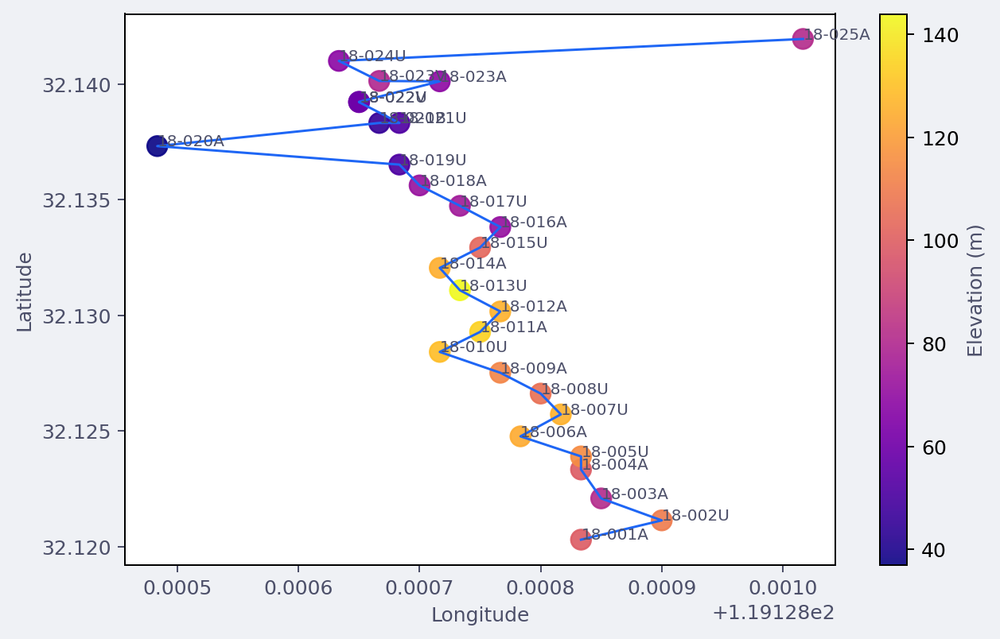

Exporting Map Figures
=====================

Use :func:`pycsamt.map.export_figure` when you want the
:term:`figure export` format to be inferred from the path or supplied
through :class:`pycsamt.map.ExportOptions`.

The export helpers work with the figure objects returned by station,
profile, 3-D, overlay, and :class:`pycsamt.map.MapView` workflows.
They intentionally stay small: they create parent directories, route to
the right backend method, and return the output path.

That returned :class:`pathlib.Path` is part of the reproducibility
contract.  A script can write a map, record the exact artifact path, and
later compare the file suffix, size, or serialized
:term:`figure specification` without repeating the plotting step.

Choosing An Export Helper
-------------------------

Use the helper that matches your goal:

``write_html``
   Save an interactive Plotly figure as HTML.

``save_png``
   Save a Matplotlib figure or a Plotly figure as PNG.

``write_image``
   Save a Plotly :term:`static image export` in any format supported by
   Plotly image export, such as PNG, SVG, PDF, or WebP.

``write_json``
   Save a Plotly figure JSON specification.

``write_dict``
   Save a serialized figure dictionary as JSON text.

``figure_to_dict``
   Return a Python dictionary without writing a file.

``export_figure``
   Dispatch to the correct helper from an
   :class:`pycsamt.map.ExportOptions` object.

Output Directories
------------------

All write helpers create parent directories automatically.

.. code-block:: python

   from pycsamt.map import write_html

   path = write_html(fig, "outputs/maps/station.html")
   print(path)
   print(path.exists())

If the directory does not exist, it is created before the figure is
written.

Captured output:

.. code-block:: text

   outputs/maps/station.html
   True

HTML
----

HTML is the safest default for Plotly station, profile, and 3-D maps.
It preserves hover text, legends, zooming, panning, map tiles, and 3-D
rotation.

.. code-block:: python

   from pycsamt.map import ExportOptions, export_figure

   path = export_figure(
       fig,
       ExportOptions(path="station.html"),
   )
   print("html export suffix", path.suffix)
   print("html export kb", round(path.stat().st_size / 1024, 1))

Captured output from the sample station figure:

.. code-block:: text

   html export suffix .html
   html export kb 10.8

You can also call the direct helper:

.. code-block:: python

   from pycsamt.map import write_html

   path = write_html(
       fig,
       "station.html",
       include_plotlyjs="cdn",
   )
   print("html direct name", path.name)
   print(
       "html direct has cdn",
       "plotly" in path.read_text(encoding="utf-8").lower(),
   )

Captured output:

.. code-block:: text

   html direct name station_cdn.html
   html direct has cdn True

``include_plotlyjs`` is passed to Plotly's ``write_html`` method.
Common values are:

``"cdn"``
   Keep files smaller by loading Plotly JavaScript from a CDN.

``True``
   Embed Plotly JavaScript inside the HTML file for offline sharing.

``False``
   Do not include Plotly JavaScript.  Use only when the surrounding
   page already loads Plotly.

The file-size tradeoff is deterministic: ``include_plotlyjs=True``
embeds the JavaScript runtime in every file, while ``"cdn"`` stores a
small HTML document that loads Plotly externally.  For archiving field
deliverables, prefer ``True`` when offline review matters; for
lightweight docs or dashboards, ``"cdn"`` is usually enough.

Explicit Format
---------------

If the path has no suffix, set ``format``.  ``format`` may be provided
with or without a leading dot.

.. code-block:: python

   path = export_figure(
       fig,
       ExportOptions(path="station", format="html"),
   )
   print("explicit format path", path.name)
   print("explicit format exists", path.exists())

   try:
       export_figure(fig, ExportOptions(path="station_no_suffix"))
   except ValueError as exc:
       print("missing format error", exc)

Without a suffix or explicit format, ``export_figure`` raises
``ValueError`` rather than guessing.

Captured output:

.. code-block:: text

   explicit format path station_no_suffix
   explicit format exists True
   missing format error Export path must include an extension or ExportOptions.format must be set.

The dispatch rule is simple.  Let :math:`e` be the lower-case suffix of
``path`` unless ``format`` is supplied; then ``format`` replaces
:math:`e`.  ``.html`` and ``.htm`` route to HTML, ``.png`` routes to
``save_png``, ``.json`` and ``.dict`` route to serialized figure
exports, and other non-empty suffixes are passed to Plotly
``write_image``.

PNG
---

Matplotlib figures are written with ``savefig``.  Plotly figures use
``write_image`` and require :term:`Kaleido` for
:term:`static image export`.

.. code-block:: python

   export_figure(
       fig,
       ExportOptions(path="station.png", scale=2.0),
   )

Direct helper:

.. code-block:: python

   from pycsamt.map import save_png

   save_png(
       fig,
       "station.png",
       width=1400,
       height=900,
       scale=2.0,
   )

For Plotly figures, ``width``, ``height``, and ``scale`` are forwarded
to Plotly image export.  For Matplotlib figures, Plotly-specific keys
are filtered out before calling ``savefig``.

.. code-block:: python

   from pycsamt.map import StationMapOptions, plot_station_map
   path = save_png(
       plot_station_map(
           data,
           options=StationMapOptions(
               backend="matplotlib",
               overlay="elevation",
           ),
       ),
       "station_static.png",
       dpi=200,
       bbox_inches="tight",
   )
   print("png path", path.name)
   print("png kb", round(path.stat().st_size / 1024, 1))

Captured output from a Matplotlib station figure:

.. code-block:: text

   png path station_static.png
   png kb 133.0

   A Matplotlib station-map PNG written through ``save_png``.  Plotly
   PNG/SVG/PDF export follows the same helper name, but uses Kaleido
   under the hood.

Static Plotly images require :term:`Kaleido`.  If Kaleido is missing,
pyCSAMT raises an ``ImportError`` with a clearer message.

Other Static Image Formats
--------------------------

Use :func:`pycsamt.map.write_image` for non-PNG Plotly image formats:

.. code-block:: python

   from pycsamt.map import write_image

   write_image(fig, "station.svg", width=1200, height=800)
   write_image(fig, "profile.pdf", width=1400, height=900)

``export_figure`` also routes unknown suffixes to ``write_image``.
This lets Plotly decide whether a format is supported.

JSON And Dict Export
--------------------

``write_json`` uses Plotly's JSON methods when available and falls
back to dictionary export.  ``write_dict`` writes the figure dictionary
as JSON text.

.. code-block:: python

   from pycsamt.map import write_dict, write_json

   json_path = write_json(fig, "station.json")
   print(
       "json suffix",
       json_path.suffix,
       "kb",
       round(json_path.stat().st_size / 1024, 1),
   )

   try:
       dict_path = write_dict(fig, "station.dict")
       print(
           "dict suffix",
           dict_path.suffix,
           "kb",
           round(dict_path.stat().st_size / 1024, 1),
       )
   except TypeError as exc:
       print("dict export error", exc)

Captured output:

.. code-block:: text

   json suffix .json kb 9.9
   dict export error Object of type ndarray is not JSON serializable

Use JSON or dict exports when you want to archive the figure
specification, compare figure output in tests, or post-process traces
in another tool.

For Plotly figures that contain NumPy-backed arrays, prefer
``write_json`` because Plotly's JSON encoder knows how to serialize
those arrays.  ``write_dict`` is intentionally plain ``json.dumps`` and
is best for already JSON-serializable dictionaries.

.. code-block:: python

   from pycsamt.map import figure_to_dict

   spec = figure_to_dict(fig)
   trace_types = [trace.get("type") for trace in spec.get("data", [])]
   print("dict trace count", len(trace_types))
   print("dict trace types", trace_types)

Captured output:

.. code-block:: text

   dict trace count 2
   dict trace types ['scattermap', 'scattermap']

``figure_to_dict`` requires a Plotly-like object with ``to_dict`` or
``to_plotly_json``.  Matplotlib figures do not expose this contract.

The dictionary returned by ``figure_to_dict`` is useful for in-memory
inspection, but it is not guaranteed to contain only JSON-native
values.  Use ``write_json`` when the goal is a portable file.

ExportOptions Reference
-----------------------

:class:`pycsamt.map.ExportOptions` stores the common export controls:

``path``
   Output path.

``format``
   Optional format override.  Use this when ``path`` has no suffix or
   when you want to force a specific export route.

``width`` and ``height``
   Static image dimensions for Plotly image export.

``scale``
   Static Plotly image scale factor.  Defaults to ``2.0``.

``include_plotlyjs``
   Passed to Plotly HTML export.  Defaults to ``"cdn"``.

Batch Export
------------

Because the helpers return :class:`pathlib.Path`, batch workflows can
record or log output paths easily.

.. code-block:: python

   from pycsamt.map import (
       ExportOptions,
       StationMapOptions,
       export_figure,
       plot_station_map,
   )

   overlays = ["index", "elevation", "rho", "phase"]
   outputs = []

   for overlay in overlays:
       fig = plot_station_map(
           data,
           options=StationMapOptions(
               overlay=overlay,
               frequency=100.0,
           ),
       )
       outputs.append(
           export_figure(
               fig,
               ExportOptions(
                   path=f"outputs/station_{overlay}.html",
               ),
           )
       )

   print("batch outputs", [path.name for path in outputs])
   print("batch count", len(outputs))

Captured output:

.. code-block:: text

   batch outputs ['station_index.html', 'station_elevation.html', 'station_rho.html', 'station_phase.html']
   batch count 4

MapView Export
--------------

:class:`pycsamt.map.MapView` uses the same export machinery.  It builds
the requested view, creates ``ExportOptions``, and calls
``export_figure`` internally.

.. code-block:: python

   from pycsamt.map import MapView

   mv = MapView(data)
   path = mv.export(
       "outputs/fence.html",
       view="map3d",
       mode="fence",
       depth_range=(0.0, 2500.0),
   )
   print("mapview export", path.name)
   print("mapview kb", round(path.stat().st_size / 1024, 1))

This keeps application-style workflows and direct function workflows on
the same export path.

Captured output:

.. code-block:: text

   mapview export fence.html
   mapview kb 454.0

Round-Trip And Testing Workflows
--------------------------------

JSON and dictionary exports are useful when you want to inspect or test
figure content without rendering images.

.. code-block:: python

   from pycsamt.map import figure_to_dict

   spec = figure_to_dict(fig)
   trace_types = [trace.get("type") for trace in spec["data"]]
   print(trace_types)
   assert "scatter" in trace_types or "scattermap" in trace_types

Captured output from printing ``trace_types``:

.. code-block:: text

   ['scattermap', 'scattermap']

For persistent artifacts, prefer ``write_json``:

.. code-block:: python

   from pycsamt.map import write_json

   write_json(fig, "outputs/station_spec.json")

Recommended Formats
-------------------

Station maps
   Use HTML for inspection and PNG/SVG for reports.

Profile pseudosections
   Use HTML while tuning options, then PNG/SVG/PDF for publication
   drafts.

3-D maps
   Prefer HTML.  Static images capture only one camera angle.

Automated tests
   Use ``figure_to_dict`` or ``write_json`` rather than pixel images.

Troubleshooting
---------------

``TypeError: HTML export requires a Plotly-like figure``
   ``write_html`` only works with figures exposing ``write_html``.
   Matplotlib figures should be saved with ``save_png`` or
   ``fig.savefig``.

``ImportError`` mentioning Kaleido
   Plotly :term:`static image export` needs :term:`Kaleido`.  Install
   the full/docs environment or export HTML instead.

``ValueError`` about extension or format
   ``export_figure`` needs a file suffix such as ``.html`` or
   ``.png``, or an explicit ``ExportOptions.format``.

Unexpected Matplotlib keyword behavior
   ``save_png`` removes Plotly-only keys such as ``scale``, ``width``,
   and ``height`` before calling Matplotlib ``savefig``.  Use
   Matplotlib options like ``dpi`` and ``bbox_inches`` for static
   Matplotlib figures.

Dictionary export fails
   The object must expose ``to_dict`` or ``to_plotly_json``.  Use JSON
   or dict export for Plotly-like figures, not plain Matplotlib figures.
