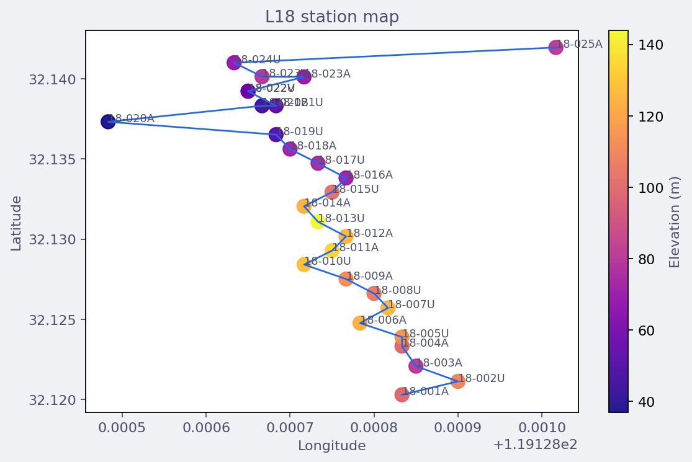

Loading Map Data
================

The mapping package uses one normalized object,
:class:`pycsamt.map.MapData`, for every station map, profile
:term:`pseudosection`, and 3-D view.  In the documentation this object
is also referenced as :term:`MapData`: the loader's reproducible record
of stations, profile membership, source objects, and metadata.  You
rarely need to build it by hand.  Most public plotting functions accept
the same inputs directly and call the normalizer for you.

Use this page when you want explicit control over loading, line
grouping, or pre-flight checks before drawing a map.

Loading Philosophy
------------------

The loader follows the science API rather than the web app internals.
It delegates :term:`EDI` parsing to
:func:`pycsamt.emtools._core.ensure_sites`, then extracts the small
mapping contract needed by the renderers:

* station identifier;
* latitude, longitude, and elevation when available;
* profile or survey-line name;
* the original EDI-like object, including its :term:`impedance tensor`
  ``Z`` object.

This means a code workflow and the web workflow can start from the
same survey files, but code users can inspect, group, transform, and
export each intermediate object.  The contract is deliberately small:
if station :math:`i` is normalized as
:math:`s_i=(\mathrm{id}_i,\phi_i,\lambda_i,h_i,\ell_i,i)`, then the
renderers read the same station identifier, latitude
:math:`\phi_i`, longitude :math:`\lambda_i`, elevation :math:`h_i`,
line name :math:`\ell_i`, and zero-based index :math:`i` everywhere.
That shared tuple is what keeps station, profile, and 3-D views from
silently disagreeing about order or line membership.

Input Types
-----------

All loading helpers accept flexible EDI sources:

``str`` or ``pathlib.Path``
   A single :term:`EDI` file or a directory containing EDI files.

sequence of paths
   A list or tuple of EDI files.  A sequence of directories is treated
   as one line per directory by :func:`pycsamt.map.load_lines`.

EDI-like iterable
   :term:`EDI-like object` instances with station metadata and a ``Z``
   attribute, including
   objects already loaded elsewhere in pyCSAMT.

``Sites``-like container
   Any object accepted by ``ensure_sites``.  Containers exposing
   ``as_list()`` are unpacked into EDI-like objects.

``MapData``
   Returned unchanged, so it is safe to pass normalized data through
   higher-level builders.

Regardless of the input form, the normalizer tries to produce the same
mathematical object: an ordered station set
:math:`S=(s_0,\ldots,s_{N-1})` and a partition of that set into
profile lines :math:`L_1,\ldots,L_K`.  A partition means each station
belongs to one resolved line, while the combined survey still keeps the
global index :math:`i` needed for reproducible sorting and exports.

Single-Line Loading
-------------------

For one profile line, call :func:`pycsamt.map.ensure_map_data`
directly or pass the source to a plotting helper.

.. code-block:: pycon

   >>> from pycsamt.map import (
   ...     StationMapOptions,
   ...     ensure_map_data,
   ...     plot_station_map,
   ... )

   >>> source = "data/AMT/WILLY_DATA/L18PLT"

   >>> data = ensure_map_data(source, recursive=True)
   >>> print(data.station_ids)
   ('18-001A', '18-002U', '18-003A', '18-004A', '18-005U', '18-006A', '18-007U', '18-008U', '18-009A', '18-010U', '18-011A', '18-012A', '18-013U', '18-014A', '18-015U', '18-016A', '18-017U', '18-018A', '18-019U', '18-020A', '18-021U', '18-021B', '18-022U', '18-022V', '18-023A', '18-023V', '18-024U', '18-025A')
   >>> print(data.lines)
   ('line',)
   >>> print(data.has_geo)
   True

   >>> options = StationMapOptions(
   ...     backend="matplotlib",
   ...     overlay="elevation",
   ...     title="L18 station map",
   ... )
   >>> fig = plot_station_map(data, options=options)

The three printed values confirm that station order, line membership,
and geographic coverage survived normalization.  The same normalized
records produce the static map below; explicitly setting the overlay is
important because the default color variable is station index, not
elevation.

   Station locations loaded from ``data/AMT/WILLY_DATA/L18PLT`` and
   colored by elevation.  The line doubles back near its northern end,
   and several labels overlap there; both features come from the survey
   geometry rather than from loading errors.  The elevation colors vary
   independently of that geometry, with the highest part of the line
   concentrated around stations ``18-011A`` to ``18-014A``.

``ensure_map_data`` does not force every station to have geographic
coordinates.  ``data.has_geo`` tells you whether all normalized
stations have finite latitude and longitude.  If coordinates are
missing, profile views can still use station order or distance, while
geographic station maps may need CRS or coordinate preprocessing.  In
set notation, ``data.has_geo`` is true only when
:math:`\phi_i,\lambda_i \in \mathbb{R}` for every station
:math:`s_i \in S`; missing or non-finite coordinates are represented as
``None`` before a renderer decides how to proceed.

Multiple-Line Loading
---------------------

Use :func:`pycsamt.map.load_lines` when a survey is split across
several folders or when you want one combined object for 3-D fence,
block, or depth-slice views.

.. code-block:: pycon

   >>> from pycsamt.map import load_lines

   >>> data = load_lines(
   ...     "data/AMT/WILLY_DATA",
   ...     detect="folder",
   ...     recursive=True,
   ... )

   >>> print(data.lines)
   ('L18PLT', 'L22PLT', 'L26PLT', 'L30PLT', 'L34PLT')
   >>> print(data.metadata["n_lines"])
   5
   >>> print(data.station_ids[:5])
   ('18-001A', '18-002U', '18-003A', '18-004A', '18-005U')

Each station is re-indexed across the combined survey and tagged with
its resolved line name.  The renderers then use ``data.profiles`` to
draw separate profiles or offset lines in 3-D.  For five loaded lines,
the combined station set is still one sequence
:math:`S=(s_0,\ldots,s_{N-1})`, but each station carries a line label
:math:`\ell_i \in \{L18PLT,L22PLT,L26PLT,L30PLT,L34PLT\}`.  This is
why a station map can show all stations together while a fence or
pseudosection view can split them back into their profile lines.

Grouping Modes
--------------

When ``load_lines`` receives one directory, the ``detect`` option
decides how files become lines.

``detect="folder"``
   Group by immediate parent folder.  This is the best option for
   layouts such as ``WILLY_DATA/L18PLT/*.edi`` and
   ``WILLY_DATA/L22PLT/*.edi``.  A flat folder becomes one line named
   after the folder.

``detect="flat"``
   Treat every discovered EDI file under the directory as one line.
   Use this for a single profile stored in a nested directory tree.

``detect="auto"``
   Group by station-ID prefix.  Numeric prefixes are normalized with an
   ``L`` prefix.  For example, station files beginning with ``22`` are
   grouped under ``L22``.  Use this when line folders are not reliable
   but station naming is consistent.

You can inspect the grouping without loading impedance data by calling
:func:`pycsamt.map.resolve_line_groups`.

.. code-block:: pycon

   >>> from pycsamt.map import resolve_line_groups

   >>> groups = resolve_line_groups(
   ...     "data/AMT/WILLY_DATA",
   ...     detect="folder",
   ... )

   >>> for line, source in groups.items():
   ...     print(line, len(source))
   L18PLT 28
   L22PLT 25
   L26PLT 25
   L30PLT 25
   L34PLT 25

The grouping operation is simply the line partition before data
normalization.  For a directory source :math:`D`, ``detect="folder"``
maps each discovered EDI path :math:`p` to the immediate parent name
:math:`g(p)`.  ``detect="flat"`` uses one constant group for all paths,
and ``detect="auto"`` derives :math:`g(p)` from the station-name prefix.
Writing that rule down matters for reproducibility because changing
only the grouping rule can change profile labels even when the EDI
files are identical.

Explicit Line Mapping
---------------------

The most reproducible multi-line workflow is an explicit mapping:

.. code-block:: pycon

   >>> from pycsamt.map import load_lines

   >>> data = load_lines({
   ...     "L18": "data/AMT/WILLY_DATA/L18PLT",
   ...     "L22": "data/AMT/WILLY_DATA/L22PLT",
   ...     "L26": "data/AMT/WILLY_DATA/L26PLT",
   ... })
   >>> print(data.lines)
   ('L18', 'L22', 'L26')
   >>> print(len(data.stations))
   78

Mapping values may be directories, file lists, or EDI-like iterables.
This is useful in notebooks and scripts where line names should be
stable even if folder names later change.  An explicit mapping fixes
the function :math:`g(p)=\ell` in the script itself, so the line label
comes from the mapping key rather than from a mutable folder name.

If your EDI-like objects do not carry line metadata, but you already
know station membership, pass ``line_map`` to
:func:`pycsamt.map.ensure_map_data`.

.. code-block:: pycon

   >>> from pycsamt.map import ensure_map_data

   >>> data = ensure_map_data(
   ...     edis,
   ...     line_map={
   ...         "L18": ["S001", "S002", "S003"],
   ...         "L22": ["S101", "S102", "S103"],
   ...     },
   ... )

Line metadata embedded on the EDI object takes priority.  The fallback
order is:

* ``line``;
* ``profile``;
* ``survey_line``;
* ``Line``;
* ``Profile``;
* station lookup in ``line_map``;
* default line name ``"line"``.

That priority order is deterministic.  If two sources could assign a
line name, the first non-empty value in the list wins, and the resulting
line label is stored on each :term:`station record`.

Normalized Contract
-------------------

:term:`MapData` exposes the surface that all map renderers share.  A
compact inspection avoids printing the full EDI objects:

.. code-block:: pycon

   >>> print(type(data.station_ids).__name__, len(data.station_ids))
   tuple 78
   >>> print(data.lines, data.has_geo)
   ('L18', 'L22', 'L26') True
   >>> print(len(data.iter_edis()), len(data.stations), len(data.profiles))
   78 78 3

Each :class:`pycsamt.map.StationRecord` contains one
:term:`station record`:

.. code-block:: pycon

   >>> station = data.stations[0]
   >>> print(
   ...     station.id, station.latitude, station.longitude,
   ...     station.elevation, station.line, station.index,
   ... )
   18-001A 32.1203 119.12883333333333 99.0 L18 0

``station.source`` is the original EDI-like object.  Keep it when you
need to inspect impedance arrays, frequencies, or file-level metadata
after loading.

The profile contract is similarly compact.  Each
:class:`pycsamt.map.ProfileLine` is a :term:`profile line` with a
``name`` and an ordered tuple of stations.  The order is the loader
order, so any derived coordinate such as along-line station number is
reproducible from the normalized object.

Pre-Flight Checks
-----------------

A good loading workflow checks the normalized survey before plotting:

.. code-block:: pycon

   >>> from pycsamt.map import (
   ...     ensure_map_data,
   ...     select_frequency,
   ...     value_at_frequency_details,
   ... )

   >>> data = ensure_map_data("data/AMT/WILLY_DATA/L18PLT")
   >>> first_edi = data.iter_edis()[0]
   >>> freq = first_edi.Z.freq
   >>> selection = select_frequency(freq, requested=100.0)

   >>> if selection is None:
   ...     raise RuntimeError("No finite positive frequency was found.")

   >>> print("requested:", selection.requested)
   requested: 100.0
   >>> print("actual:", selection.actual)
   actual: 102.4
   >>> print("relative delta:", selection.relative_delta)
   relative delta: 0.024000000000000056

   >>> values = value_at_frequency_details(
   ...     data,
   ...     frequency=selection.actual,
   ...     quantity="rho",
   ...     component="xy",
   ... )
   >>> print("stations with values:", len(values))
   stations with values: 28

This is especially helpful when different stations have slightly
different :term:`frequency grid`\ s.  Map extraction chooses the
nearest finite positive frequency per station and can enforce a
tolerance when you need a strict match.  For a requested frequency
:math:`f_r` and a station grid
:math:`F_i=\{f_{i0},\ldots,f_{im}\}`, the selected sample is

.. math::
   :label: map-loading-nearest-frequency

   k_i = \operatorname*{arg\,min}_k |f_{ik}-f_r|,
   \qquad
   f_i^\* = f_{ik_i}.

Equation :eq:`map-loading-nearest-frequency` makes the selection
deterministic; if two samples are equally near, NumPy's first-minimum
rule selects the first one in the recorded array.  The reported relative
delta is :math:`|f_i^\*-f_r|/|f_r|` when :math:`f_r` is positive.  Once the
frequency index is selected, the requested :term:`impedance tensor`
component is read from

.. math::
   :label: map-loading-impedance-tensor

   \mathbf{Z}(f_i^\*) =
   \begin{bmatrix}
   Z_{xx}(f_i^\*) & Z_{xy}(f_i^\*) \\
   Z_{yx}(f_i^\*) & Z_{yy}(f_i^\*)
   \end{bmatrix}.

where ``component="xy"`` selects :math:`Z_{xy}` in
:eq:`map-loading-impedance-tensor`.  EDI parsing has already converted
that component into apparent resistivity and phase arrays.  Their field-unit
convention is

.. math::
   :label: map-loading-rho-phase

   \rho_{a,ab}(f) = 0.2\,\frac{|Z_{ab}(f)|^2}{f},
   \qquad
   \varphi_{ab}(f) = \operatorname{atan2}
   \left(\Im Z_{ab}(f),\Re Z_{ab}(f)\right)\frac{180}{\pi}.

The map extractor reads the stored :math:`\rho_{a,ab}` or
:math:`\varphi_{ab}` at index :math:`k_i`; it does not recompute them.
Consequently, another user needs the same input EDI files, requested
:math:`f_r`, component, quantity, and tolerance to reproduce the values.

Handling Missing or Partial Data
--------------------------------

The loader is designed for field surveys, where not every file is
perfect.

* Files without valid impedance are skipped by value-extraction helpers
  instead of breaking the whole map.
* Non-finite coordinates become ``None`` on ``StationRecord``.
* If no line name is available, stations are grouped into ``"line"``.
* Empty groups are ignored by ``load_lines``.
* A ``MapData`` with no stations is still a valid object; renderers can
  return empty figures rather than crashing.

For strict workflows, validate the counts yourself:

.. code-block:: pycon

   >>> data = load_lines("data/AMT/WILLY_DATA", detect="folder")

   >>> if not data.stations:
   ...     raise RuntimeError("No stations were loaded.")
   >>> if not data.has_geo:
   ...     raise RuntimeError("Station map requires geographic coordinates.")
   >>> if len(data.lines) < 2:
   ...     raise RuntimeError("Expected a multi-line survey.")
   >>> print(f"ready: {len(data.stations)} stations on {len(data.lines)} lines")
   ready: 128 stations on 5 lines

Using Loaded Data
-----------------

Once loaded, pass the same ``MapData`` object to station, profile, and
3-D builders.  This avoids re-reading files and keeps grouping
consistent across views.  The station-map example earlier on this page
shows that hand-off and its rendered result; :doc:`station`,
:doc:`profile`, and :doc:`volume` develop the corresponding views
without repeating their figures here.

Use the export helpers to save any resulting figure:

.. code-block:: pycon

   >>> from pycsamt.map import write_html

   >>> write_html(station_fig, "outputs/stations.html")

``write_html`` returns ``None``, so a successful call has no terminal
output.  Its observable result is ``outputs/stations.html``.

Troubleshooting
---------------

``FileNotFoundError``
   The path passed to ``load_lines`` or ``ensure_map_data`` does not
   exist.  Resolve project-relative paths before loading.

``ValueError: Unknown detect mode``
   ``detect`` must be one of ``"folder"``, ``"flat"``, or ``"auto"``.

No stations in the output
   Check that EDI files were discovered and that ``ensure_sites`` can
   read them.  Start with ``resolve_line_groups`` to confirm grouping.

Station map is empty
   Inspect ``data.has_geo``.  Geographic maps require finite latitude
   and longitude unless you first reproject or provide coordinates.

Pseudosection has gaps
   Some stations may be missing impedance values, or the requested
   frequency/period may not be present within tolerance.  Inspect
   ``value_at_frequency_details`` for selected-frequency metadata.
