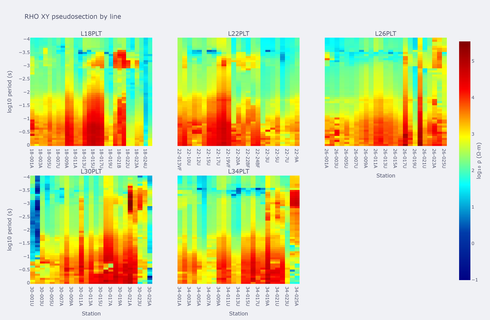
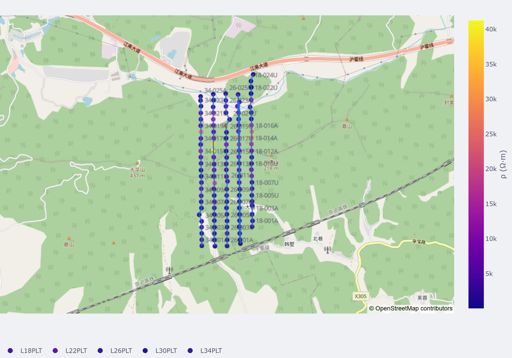

MapView Session
===============

:class:`pycsamt.map.MapView` is the :term:`MapView session` object: it
keeps one normalized survey in memory and renders multiple map views
from it without re-parsing EDI files each time.  It is the most
convenient API for multi-line surveys and repeated exports, and it is
a thin façade over the same builders used by :doc:`station`,
:doc:`profile`, and :doc:`volume` -- so anything you already know about
those options carries over directly.

Create A Session
----------------

.. code-block:: python

   from pycsamt.map import MapView

   mv = MapView.from_folder(
       "data/AMT/WILLY_DATA",
       detect="folder",
   )

   print(mv.lines)
   print(mv.stations[:5])
   print(mv.n_stations)

Output:

.. code-block:: text

   ('L18PLT', 'L22PLT', 'L26PLT', 'L30PLT', 'L34PLT')
   ('18-001A', '18-002U', '18-003A', '18-004A', '18-005U')
   128

``detect="folder"`` groups the five ``WILLY_DATA`` line folders into
five :term:`profile line`\ s of one :term:`MapData` object, following
the same grouping rules described in :doc:`loading`.  ``mv.n_stations``
is simply the total station count across every line, :math:`N=\sum_k
N_k=128` here, and it is this combined :math:`N` -- not any single
line's count -- that the station, pseudosection, and 3-D renderers all
see once they read from ``mv.data``.

Render Views
------------

.. code-block:: python

   station = mv.station(overlay="elevation")
   pseudo = mv.pseudosection(component="xy", by_line=True)
   volume = mv.map3d(mode="fence", depth_range=(0.0, 2000.0))

Output:

.. code-block:: text

   station traces: 10
   pseudosection panels: 5
   map3d surfaces: 15

Each call reuses the survey already held by ``mv`` instead of reloading
it, so the three views below are guaranteed to describe the same 128
stations. ``station()`` colors every station marker by its elevation
and draws one profile trace per line; because all five lines share one
color scale here, elevations stay comparable from line to line rather
than each line auto-scaling to its own range.

``pseudosection()`` grids the :math:`Z_{xy}` :term:`apparent
resistivity` on a :math:`\log_{10}` color scale against station
position and period, giving the data-space :term:`pseudosection` view
described in :doc:`profile`. ``by_line=True`` matters for a five-line
survey like this one: without it, every line's stations are
concatenated onto one x-axis, which reads as a single continuous
section even though ``L18PLT``, ``L22PLT``, ... are unrelated
traverses; with it, each line gets its own panel in a grid, still
sharing one color scale so panels stay comparable to each other.

``map3d(mode="fence", ...)`` goes one step further and turns that same
period axis into a pseudo-depth axis, station by station, using
:math:`\delta \approx 503\sqrt{\bar\rho\,T}` -- the :term:`fence view`
relation, with :math:`\bar\rho` the per-period median apparent
resistivity along each line and :math:`T` the period in seconds.
``depth_range=(0.0, 2000.0)`` then simply clips that pseudo-depth axis
to the top 2 km, which is why the fence curtains below stop well short
of the deepest periods seen in the pseudosection.

.. grid:: 1 1 2 2

   .. grid-item::

      .. image:: ../../images/user_guide/map/user-guide-map-mapview-01.png
         :width: 100%

   .. grid-item::

      .. image:: ../../images/user_guide/map/user-guide-map-mapview-03.png
         :width: 100%

The per-line pseudosection grid is wider than a half-width column can
show clearly, so it gets a full-width row of its own:

Generic Figure Dispatch
------------------------

.. code-block:: python

   fig = mv.figure("station", overlay="rho", frequency=10.0)

Output:

.. code-block:: text

   dispatched figure type: Figure

Supported view names are ``station``, ``profile``, ``pseudosection``,
and ``map3d``.  ``figure()`` is a plain lookup into that mapping
followed by a call to the matching method, so
``mv.figure("station", overlay="rho", frequency=10.0)`` is exactly
equivalent to ``mv.station(overlay="rho", frequency=10.0)``; the
generic form is convenient when the view name is itself a variable, for
example a dropdown value coming from the map-view platform.

Export
------

.. code-block:: python

   mv.export(
       "station.html",
       view="station",
       overlay="rho",
       frequency=10.0,
   )

   mv.export_all("out/maps", fmt="html")

Output:

.. code-block:: text

   station.html: 24 kb
   out/maps/station.html: 24 kb
   out/maps/pseudosection.html: 172 kb
   out/maps/map3d.html: 2232 kb

``export`` builds the requested view then writes it with
:func:`pycsamt.map.export_figure`, so the same format inference and
Kaleido requirements described in :doc:`export` apply here.
``export_all`` repeats that for several views at once -- by default
``station``, ``pseudosection``, and ``map3d`` -- writing one file per
view into the target directory and returning their paths keyed by view
name. The 3-D fence file is by far the largest of the three because it
embeds every station curtain and the terrain overlay as Plotly mesh
data, not just a flat image.

Launch The Platform
--------------------

``MapView.launch`` and :func:`pycsamt.map.open_app` hand the session to
the optional map-view platform.  The GUI dependencies are optional and
are not required for code-first rendering.
