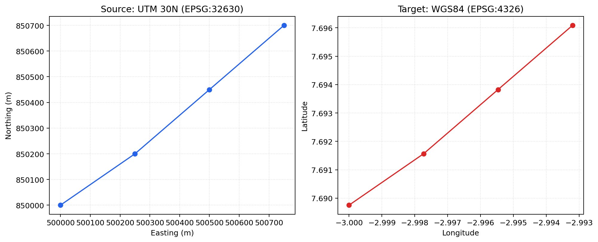
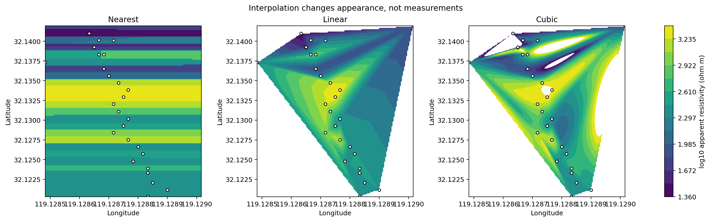
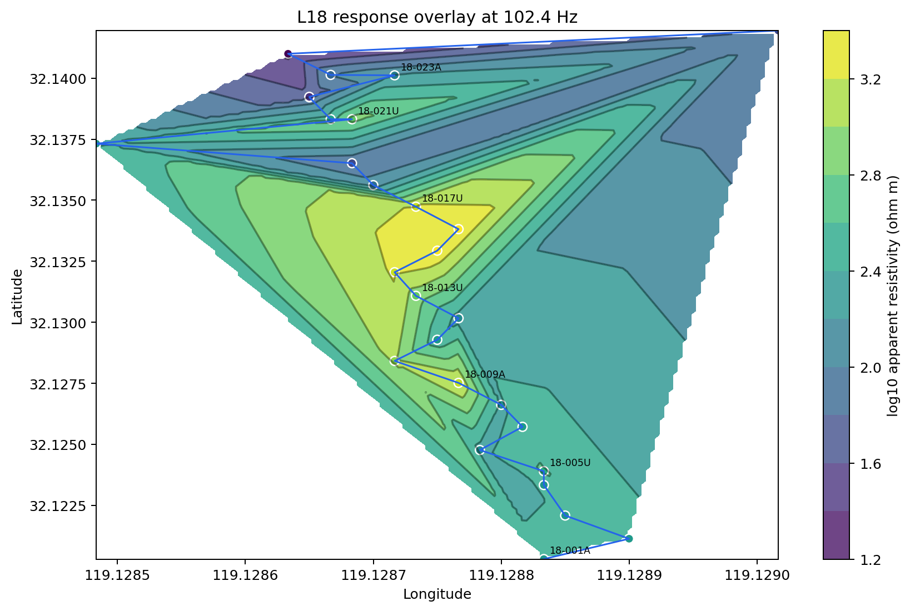
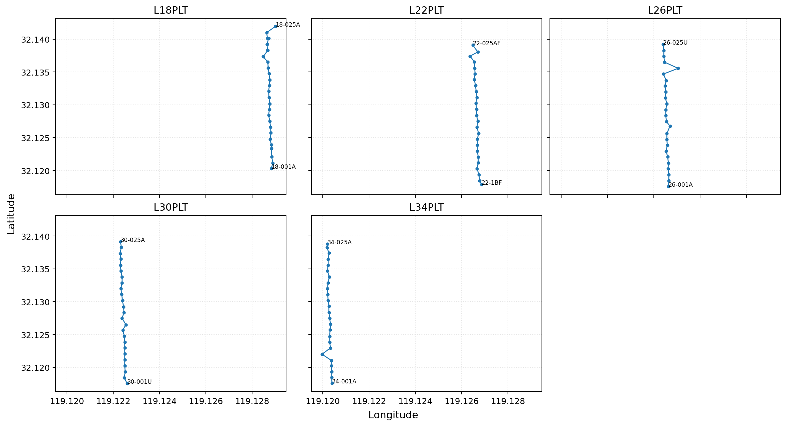
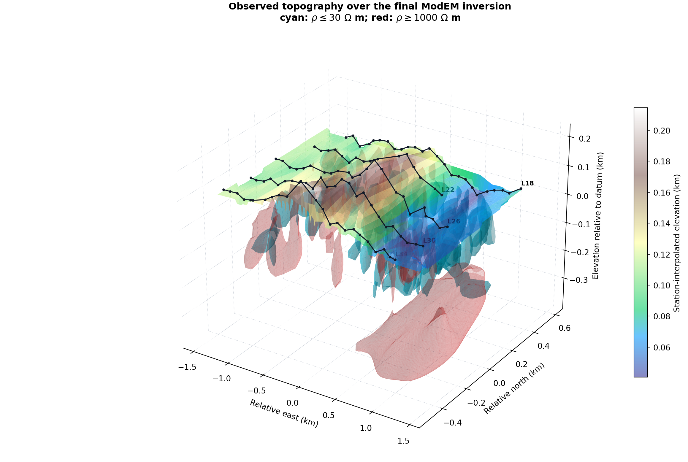

Map Overlays
============

Overlay helpers add coordinate transforms, basemaps, contours, labels,
profile lines, or terrain to figures assembled by the user.  They do not
create a second survey model: every visual layer should remain traceable
to coordinates and values from the same :term:`MapData`.

Use :class:`pycsamt.map.StationMap` or :class:`pycsamt.map.MapView` for
standard maps.  The lower-level helpers on this page are useful when a
computed value, custom composition, or application callback needs direct
control over individual traces.

Coordinates Before Decoration
-----------------------------

Web basemaps expect geographic longitude and latitude.  Projected field
coordinates must therefore be transformed explicitly rather than merely
renamed:

.. code-block:: pycon

   >>> import numpy as np
   >>> from pycsamt.map import CRSConfig, transform_xy

   >>> east = np.array([500000.0, 500250.0])
   >>> north = np.array([850000.0, 850200.0])
   >>> lon, lat = transform_xy(
   ...     east,
   ...     north,
   ...     crs=CRSConfig(source=32630, target=4326),
   ... )
   >>> np.round(lon, 6).tolist()
   [-3.0, -2.997733]
   >>> np.round(lat, 6).tolist()
   [7.689755, 7.691564]

For station :math:`i`, the operation is

.. math::
   :label: map-overlay-crs-transform

   (\lambda_i,\phi_i)
   =T_{\mathrm{src}\rightarrow4326}(x_i,y_i),

where :math:`T` includes the source datum and projection.  With
``always_xy=True``—the default—arguments remain ``x, y`` and WGS84
output remains longitude, latitude even when CRS metadata advertises a
different axis order.

   The same four positions in UTM Zone 30N and WGS84.  Their numerical
   scales change completely while their ordering and geometry remain
   consistent.  Plotting the left-hand numbers directly on a geographic
   basemap would place the survey incorrectly.

:func:`pycsamt.map.resolve_crs_info` provides auditable descriptions:

.. code-block:: pycon

   >>> from pycsamt.map import normalize_epsg, resolve_crs_info
   >>> normalize_epsg(32630)
   'EPSG:32630'
   >>> print(resolve_crs_info("utm", zone=30, hemisphere="N"))
   EPSG:32630 UTM Zone 30N (WGS 84)

Basemap Extent And Style
------------------------

:func:`pycsamt.map.build_basemap_layout` returns a
:class:`pycsamt.map.BasemapConfig`, not a complete figure:

.. code-block:: pycon

   >>> from pycsamt.map import build_basemap_layout
   >>> basemap = build_basemap_layout(lon, lat, bearing=12.0)
   >>> print(basemap.style, basemap.zoom, basemap.bearing)
   open-street-map 14 12.0
   >>> {key: round(value, 6) for key, value in basemap.center.items()}
   {'lat': 7.690659, 'lon': -2.998867}

The center is the mean of finite coordinate pairs.  Zoom is selected
from their largest geographic span and constrained to a practical range.
Missing coordinates produce a world view centered at zero.  Native
token-free styles include ``open-street-map``, ``carto-positron``, and
``carto-darkmatter``; ESRI names such as ``esri-satellite`` resolve to a
``white-bg`` base plus a raster layer.

Measured Points And Interpolated Surfaces
-----------------------------------------

A :term:`contour overlay` estimates values between scattered samples.
For finite observations :math:`(x_i,y_i,v_i)` it constructs a regular
grid and evaluates

.. math::
   :label: map-overlay-interpolation

   \widehat v_{jk}=I(x'_j,y'_k\mid\{x_i,y_i,v_i\}_{i=1}^{n}).

The interpolation operator :math:`I` is an assumption, not an additional
measurement.  SciPy supplies linear or requested scattered interpolation
when available; the portable fallback assigns the nearest station value.

.. code-block:: pycon

   >>> from pycsamt.map import interpolate_overlay_grid
   >>> xi, yi, grid = interpolate_overlay_grid(
   ...     lon, lat, np.array([100.0, 120.0]), grid_size=12
   ... )
   Traceback (most recent call last):
   ...
   ValueError: At least three finite points are required.

Three points are the mathematical minimum, but rarely provide enough
support for geological interpretation.

   Nearest, linear, and cubic interpolation of the same 28 measured
   L18 apparent-resistivity values at 102.4 Hz.  White markers are the
   observations.  Nearest interpolation is blocky, linear interpolation
   is piecewise planar, and cubic interpolation introduces smooth extrema;
   differences away from markers are produced by :math:`I`, not the EDI
   files.

Build a Plotly contour trace when the interpolation is appropriate:

.. code-block:: pycon

   >>> from pycsamt.map import build_contour_overlay
   >>> contour = build_contour_overlay(
   ...     np.array([2.0, 2.1, 2.2]),
   ...     np.array([1.0, 1.1, 1.0]),
   ...     np.array([100.0, 120.0, 80.0]),
   ...     levels=8,
   ...     mode="both",
   ... )
   >>> print(contour.type, len(contour.x), len(contour.y))
   contour 80 80

``grid_size`` controls numerical resolution, not information content.
Increasing it creates more pixels without creating more field samples.

Lines, Labels, And Response Values
----------------------------------

Line and label helpers return either Cartesian ``Scatter`` or geographic
``Scattermap`` traces according to ``geo``:

.. code-block:: pycon

   >>> from pycsamt.map import (
   ...     build_profile_line_overlay,
   ...     build_station_label_overlay,
   ... )
   >>> line = build_profile_line_overlay(lon, lat, geo=True, name="L18")
   >>> labels = build_station_label_overlay(
   ...     lon, lat, ["S00", "S01"], geo=True
   ... )
   >>> print(line.type, labels.type, tuple(labels.text))
   scattermap scattermap ('S00', 'S01')

The line follows normalized station order.  It communicates acquisition
geometry; it does not interpolate the electromagnetic value along the
polyline.

   L18 apparent resistivity at the selected 102.4 Hz sample.  Measured
   markers remain visible over the linear contour surface, the blue line
   shows station order, and only every fourth station is labelled to keep
   the dense northern turn legible.  The large triangular regions near
   the turn have weak spatial support and should be read cautiously.

Multiple Lines Without Visual Crowding
--------------------------------------

For a multi-line survey, small multiples often communicate geometry more
clearly than 128 labels on one map:

.. code-block:: pycon

   >>> from pycsamt.map import load_lines
   >>> data = load_lines("data/AMT/WILLY_DATA", detect="folder")
   >>> print(data.lines)
   ('L18PLT', 'L22PLT', 'L26PLT', 'L30PLT', 'L34PLT')
   >>> sum(2 for _profile in data.profiles)
   10

Two traces per profile—one line and one label trace—give ten traces.
In a combined interactive map, labels can instead be limited to endpoints
or exposed through hover text.

   Five profile overlays on identical coordinate limits.  Endpoint labels
   identify acquisition direction without covering every marker, while
   the grid makes differences in line position and shape directly
   comparable.

Topography Is Geometry, Not Response
------------------------------------

:func:`pycsamt.map.build_topography_overlay` returns ``Mesh3d`` for
scattered elevations and ``Surface`` for a two-dimensional grid:

.. code-block:: pycon

   >>> from pycsamt.map import build_topography_overlay
   >>> mesh = build_topography_overlay(
   ...     np.array([0.0, 1.0, 0.0]),
   ...     np.array([0.0, 0.0, 1.0]),
   ...     np.array([100.0, 120.0, 110.0]),
   ...     opacity=0.55,
   ... )
   >>> print(mesh.type, mesh.opacity)
   mesh3d 0.55

For scattered stations, vertices are :math:`(x_i,y_i,h_i)`.  A mesh
connects those supports but does not improve elevation accuracy between
them.

   Observed station elevations draped above the final bundled ModEM
   inversion.  Black tracks and points retain the five acquisition lines;
   the terrain colors show the station-interpolated elevation surface.
   Below it, cyan marks the 30-ohm-metre conductive boundary and translucent
   red marks the 1000-ohm-metre resistive boundary.  Their relation to relief
   is now visible without making the terrain opaque or enclosing the model in
   solid panes.

The terrain is still an overlay rather than an inversion response.  Its
interpolation is constrained only where stations provide elevations, whereas
the two subsurface shells come from the final ModEM resistivity mesh.  A
spatial coincidence between relief and a shell is therefore an observation
to test, not evidence that topography caused or validates the anomaly.

.. code-dropdown:: ../../../scripts/generate_map_volume_figures.py
   :language: python
   :pyobject: make_modem_topography_overlay
   :linenos:
   :title: View topography-and-ModEM overlay source code

Composing A Custom Figure
-------------------------

Overlay helpers return ordinary Plotly objects:

.. code-block:: pycon

   >>> import plotly.graph_objects as go
   >>> fig = go.Figure()
   >>> fig.add_trace(contour)
   Figure({
   ...
   })
   >>> fig.update_layout(
   ...     map=dict(
   ...         style=basemap.style,
   ...         center=basemap.center,
   ...         zoom=basemap.zoom,
   ...         bearing=basemap.bearing,
   ...     )
   ... )
   Figure({
   ...
   })

Do not mix Cartesian contour traces with geographic map traces in the
same axes.  For a geographic filled contour, use the station-map
``contour_image`` path described in :doc:`station`.

Troubleshooting
---------------

``ImportError`` during CRS conversion
   Install ``pyproj`` through the geographic or full dependency extra.

``ValueError: At least three finite points are required.``
   Remove incomplete rows and confirm at least three coordinate/value
   triples remain.  Prefer markers when spatial support is weak.

Contour artifacts cross empty areas
   Interpolation operates inside a geometric footprint, not geological
   boundaries.  Retain measured markers, compare interpolation methods,
   or mask unsupported regions.

Labels overlap
   Label endpoints or a regular subset, use hover text for the remainder,
   or use small multiples as above.

Basemap opens at world scale
   No finite longitude/latitude pairs reached the layout helper.  Inspect
   ``data.has_geo`` and verify the source :term:`CRS`.
