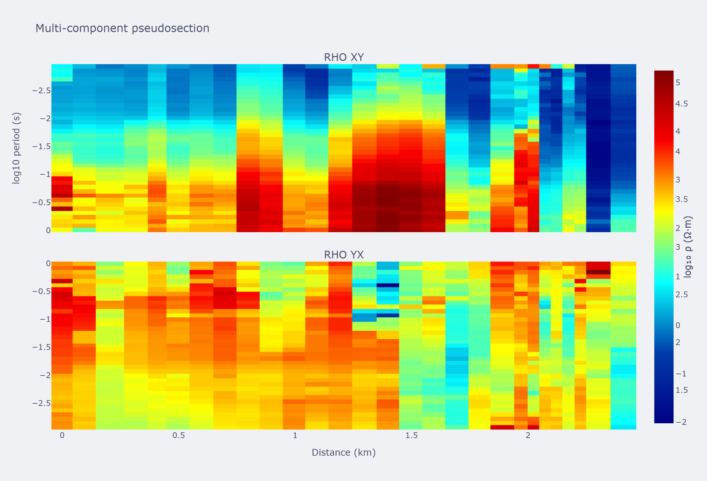
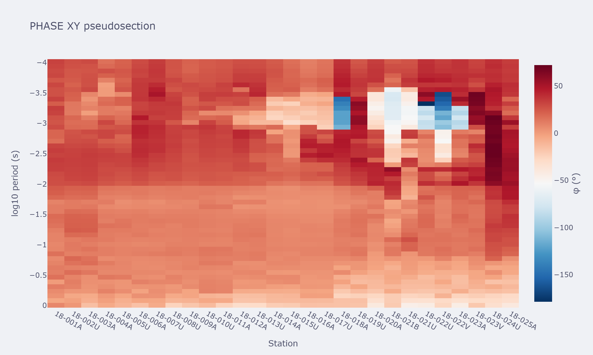
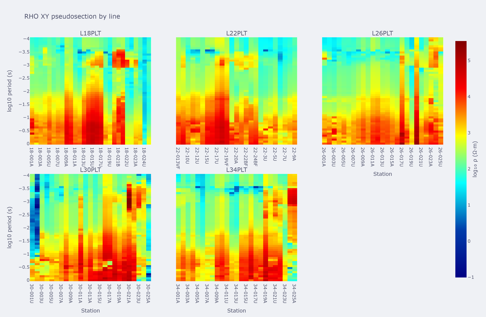
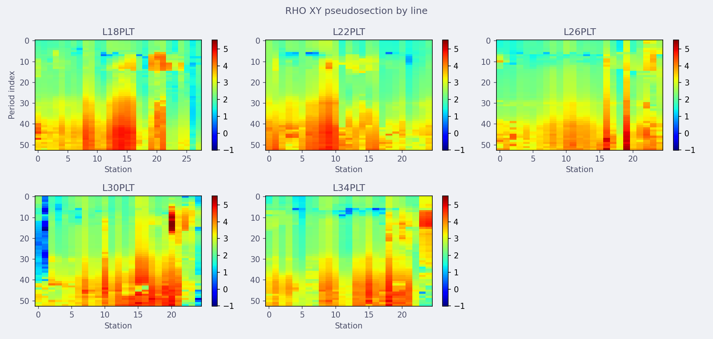

Profile Maps And Pseudosections
===============================

Profile maps show :term:`apparent resistivity` or :term:`phase` as a
function of station position and period. They are quick-look data
:term:`pseudosection`\ s, not inversion sections: every panel below is
built straight from measured :term:`impedance tensor` values, gridded
for display, with no forward model or regularization involved.
:mod:`pycsamt.map.profile` is also what :doc:`mapview`'s
``MapView.pseudosection`` and ``MapView.profile`` call underneath, and
what :func:`pycsamt.map.plot_profile_map` and
:func:`pycsamt.map.plot_pseudosection` share: today the two entry
points build the exact same figure, since ``build_profile_map`` simply
forwards to ``build_pseudosection``. They are kept as separate named
functions so that a future profile-view (station-versus-quantity,
without the period axis) can diverge without breaking either name.

Function API
------------

Use :func:`pycsamt.map.plot_pseudosection` for one-shot scripts and
notebooks. Rendering options are passed with
:class:`pycsamt.map.ProfileMapOptions`.

.. code-block:: python

   from pycsamt.map import ProfileMapOptions, plot_pseudosection

   fig = plot_pseudosection(
       "data/AMT/WILLY_DATA/L18PLT",
       options=ProfileMapOptions(
           quantity="rho",
           components=("xy", "yx"),
           period_range=(0.001, 10.0),
           x_axis="distance",
       ),
   )
   print("panels:", len(fig.data))
   print(
       "x range (km):",
       round(float(min(fig.data[0].x)), 2),
       "-",
       round(float(max(fig.data[0].x)), 2),
   )
   print("period rows:", len(fig.data[0].y))

Output:

.. code-block:: text

   panels: 2
   x range (km): 0.0 - 2.41
   period rows: 39

Passing ``components=("xy", "yx")`` builds two stacked heatmap panels
-- one per component -- through the same multi-component path used
whenever more than one component is requested. Because
``period_range=(0.001, 10.0)`` keeps only periods inside that window,
the pseudosection has 39 period rows here instead of every period
present in the raw EDI files.

Builder API
-----------

Use :class:`pycsamt.map.ProfileMap` when you want an immutable builder
style. ``with_quantity``, ``with_component``, and ``with_components``
return new builders that reuse the same normalized data.

.. code-block:: python

   from pycsamt.map import ProfileMap

   fig = (
       ProfileMap("data/AMT/WILLY_DATA/L18PLT")
       .with_quantity("phase")
       .with_component("xy")
       .pseudosection()
   )
   print("panels:", len(fig.data))
   print("stations:", len(fig.data[0].x))
   print("period rows:", len(fig.data[0].y))

Output:

.. code-block:: text

   panels: 1
   stations: 28
   period rows: 53

``with_component("xy")`` sets both ``component`` and ``components`` to
a single-element tuple, so this always renders one panel -- unlike
passing ``components=`` directly to :class:`pycsamt.map.ProfileMapOptions`,
where the plural field is what decides single- versus multi-panel
rendering (see :ref:`profile-components-gotcha` below). ``.figure()``
is available on the same builder for a profile-view figure, which
today renders identically to ``.pseudosection()``.

Quantities And Components
--------------------------

``quantity`` accepts ``"rho"`` / ``"resistivity"`` and ``"phase"`` /
``"phi"``. Components use the shared component parser: ``xx``, ``xy``,
``yx``, ``yy`` read one :term:`impedance tensor` element directly, and
two derived modes combine the off-diagonal (geoelectric-strike-facing)
elements :math:`Z_{xy}` and :math:`Z_{yx}`:

``avg``
   The arithmetic mean of the two off-diagonal values, for both
   quantities: :math:`\bar\rho=(\rho_{xy}+\rho_{yx})/2` and
   :math:`\bar\varphi=(\varphi_{xy}+\varphi_{yx})/2`.

``det``
   A :term:`determinant response`-style summary. For phase it is
   identical to ``avg`` -- :math:`\varphi_{\det}=\bar\varphi`. For
   resistivity it is the *geometric* mean instead,
   :math:`\rho_{\det}=\sqrt{|\rho_{xy}\,\rho_{yx}|}`, which is closer
   in spirit to a true rotation-invariant determinant response than a
   plain average, without requiring the full complex
   :math:`\det(\mathbf{Z})` computation.

The difference is visible directly on ``L18PLT``, comparing the median
value each mode produces over the same stations and periods:

.. code-block:: python

   import numpy as np

   from pycsamt.map import ProfileMapOptions, plot_pseudosection

   for comp in ("xy", "yx", "det", "avg"):
       fig = plot_pseudosection(
           "data/AMT/WILLY_DATA/L18PLT",
           options=ProfileMapOptions(
               component=comp, components=(comp,), log_rho=False
           ),
       )
       z = np.asarray(fig.data[0].z, dtype=float)
       print(f"{comp}: median rho = {np.nanmedian(z):.1f} ohm.m")

Output:

.. code-block:: text

   xy: median rho = 435.8 ohm.m
   yx: median rho = 225.6 ohm.m
   det: median rho = 317.9 ohm.m
   avg: median rho = 440.2 ohm.m

``det`` (317.9) sits close to :math:`\sqrt{435.8\times225.6}\approx313.6`
-- the small gap is expected, since the code takes the median of the
per-period geometric means rather than the geometric mean of the two
medians. ``avg`` (440.2) is pulled toward the larger ``xy`` value
instead, as an arithmetic mean would. Repeating the same loop with
``quantity="phase"`` shows the ``det`` == ``avg`` equivalence for
phase directly:

.. code-block:: text

   xy: median phase = 13.6 deg
   yx: median phase = -153.4 deg
   det: median phase = -64.5 deg
   avg: median phase = -64.5 deg

Axes
----

``x_axis="station"``
   Use station IDs, in loaded order, along the horizontal axis.

``x_axis="distance"``
   Use cumulative :term:`station distance` in kilometres instead, so
   unevenly spaced stations are positioned proportionally rather than
   at equal ticks.

.. code-block:: python

   from pycsamt.map import ProfileMapOptions, plot_pseudosection

   fig_station = plot_pseudosection(
       "data/AMT/WILLY_DATA/L18PLT",
       options=ProfileMapOptions(
           component="xy", components=("xy",), x_axis="station"
       ),
   )
   fig_distance = plot_pseudosection(
       "data/AMT/WILLY_DATA/L18PLT",
       options=ProfileMapOptions(
           component="xy", components=("xy",), x_axis="distance"
       ),
   )
   print("station x (first 5):", list(fig_station.data[0].x[:5]))
   print(
       "distance x km (first 5):",
       [round(v, 3) for v in fig_distance.data[0].x[:5]],
   )

Output:

.. code-block:: text

   station x (first 5): ['18-001A', '18-002U', '18-003A', '18-004A', '18-005U']
   distance x km (first 5): [0.0, 0.092, 0.198, 0.336, 0.398]

The uneven gaps between ``0.0``, ``0.092``, ``0.198``, ... already show
that ``18-003A`` and ``18-004A`` are farther apart than
``18-001A``/``18-002U``, information a plain station-index axis
discards. If any station in the survey is missing a finite coordinate,
:term:`station distance` falls back to station order instead of
raising, so a distance axis degrades gracefully rather than silently
lying about spacing.

By-Line Grids
-------------

A survey normalized from several :term:`profile line`\ s -- for
example every ``WILLY_DATA`` folder together, loaded with
:func:`pycsamt.map.load_lines` as in :doc:`loading` -- has stations
from every line. By default they are concatenated onto one x-axis,
which reads as a single continuous section even though the lines are
unrelated traverses. Set ``by_line=True`` to render one panel per line
instead, arranged in a grid with ``line_cols`` columns (3 by default)
and one shared color scale so panels stay comparable to each other:

.. code-block:: python

   from pycsamt.map import ProfileMapOptions, load_lines, plot_pseudosection

   data = load_lines("data/AMT/WILLY_DATA", detect="folder")
   print("lines:", data.lines)

   fig = plot_pseudosection(
       data,
       options=ProfileMapOptions(component="xy", by_line=True, line_cols=3),
   )
   print("panels:", len(fig.data))
   print("titles:", [a.text for a in fig.layout.annotations])

Output:

.. code-block:: text

   lines: ('L18PLT', 'L22PLT', 'L26PLT', 'L30PLT', 'L34PLT')
   panels: 5
   titles: ['L18PLT', 'L22PLT', 'L26PLT', 'L30PLT', 'L34PLT']

``by_line`` only has line names to split on when the input ``MapData``
actually carries them. Passing a bare parent folder such as
``"data/AMT/WILLY_DATA"`` straight to :func:`pycsamt.map.plot_pseudosection`
does **not** rediscover per-folder lines the way
:func:`pycsamt.map.load_lines` does -- every station collapses onto one
generic line named ``"line"``, and ``by_line`` quietly falls back to a
single panel. Load with ``detect="folder"`` (or supply a ``line_map``)
first, then pass the resulting :class:`pycsamt.map.MapData` through, as
above. The same option works with ``backend="matplotlib"`` for static
report figures:

.. code-block:: python

   mpl_fig = plot_pseudosection(
       data,
       options=ProfileMapOptions(
           component="xy", by_line=True, line_cols=3, backend="matplotlib"
       ),
   )

Filtering And Value Ranges
---------------------------

``period_range``, ``phase_range``, and ``value_range`` filter the
long-form table before it is pivoted into a grid, so they change how
much data reaches the figure rather than just how it is colored.
``period_range`` keeps rows whose period falls inside the window;
``phase_range`` additionally restricts phase rows by value when
``quantity="phase"``; ``value_range`` restricts rows by value for any
quantity and also becomes the heatmap's ``zmin``/``zmax`` (converted to
:math:`\log_{10}` first when ``log_rho=True``).

.. code-block:: python

   from pycsamt.map import ProfileMapOptions, plot_pseudosection

   fig_all = plot_pseudosection(
       "data/AMT/WILLY_DATA/L18PLT",
       options=ProfileMapOptions(component="xy", components=("xy",)),
   )
   fig_period = plot_pseudosection(
       "data/AMT/WILLY_DATA/L18PLT",
       options=ProfileMapOptions(
           component="xy", components=("xy",), period_range=(0.001, 1.0)
       ),
   )
   fig_value = plot_pseudosection(
       "data/AMT/WILLY_DATA/L18PLT",
       options=ProfileMapOptions(
           component="xy",
           components=("xy",),
           value_range=(10.0, 5000.0),
           log_rho=False,
       ),
   )
   print("unfiltered period rows:", len(fig_all.data[0].y))
   print("period_range=(0.001, 1.0) rows:", len(fig_period.data[0].y))
   print(
       "value_range colorbar zmin/zmax:",
       fig_value.data[0].zmin,
       fig_value.data[0].zmax,
   )

Output:

.. code-block:: text

   unfiltered period rows: 53
   period_range=(0.001, 1.0) rows: 39
   value_range colorbar zmin/zmax: 10.0 5000.0

With ``log_rho=True`` (the default), passing ``value_range=(10.0,
5000.0)`` would instead report ``zmin/zmax`` as
:math:`\log_{10}10=1.0` and :math:`\log_{10}5000\approx3.7`, since the
range is converted to match the log-scaled color data.

Backends
--------

``plotly`` is the interactive default and produces the heatmaps shown
above. ``matplotlib`` produces static figures for reports and batch
processing, using ``imshow`` per panel with a shared color range in
both the multi-component and by-line grid layouts. Unknown backends
raise ``ValueError`` rather than silently falling back (see
Troubleshooting). Both backends honor ``theme`` (``"light"``,
``"dark"``, ``"publication"``) through the same color palette used
across :mod:`pycsamt.map`.

.. _profile-components-gotcha:

Options Reference
------------------

:class:`pycsamt.map.ProfileMapOptions` stores every profile/pseudosection
control:

``quantity``
   ``"rho"``/``"resistivity"`` or ``"phase"``/``"phi"``. Defaults to
   ``"rho"``.

``component``
   The single component used by ``by_line=True`` and by the builder's
   ``with_component``. Defaults to ``"xy"``.

``components``
   The tuple of components rendered when ``by_line`` is not set.
   **This is the field that decides single- versus multi-panel
   rendering** -- ``len(options.components) > 1`` triggers the stacked
   multi-component layout regardless of what ``component`` (singular)
   is set to. Defaults to ``("xy", "yx")``, so a bare
   ``ProfileMapOptions(component="xy")`` still renders both ``xy`` and
   ``yx`` panels unless ``components=("xy",)`` is set too -- exactly
   what ``with_component`` does for you on the builder API.

``theme``
   ``"light"``, ``"dark"``, or ``"publication"``.

``backend``
   ``"plotly"`` or ``"matplotlib"``.

``period_range``, ``phase_range``, ``value_range``
   Optional ``(min, max)`` filters; see Filtering And Value Ranges.

``x_axis``
   ``"station"`` or ``"distance"``; see Axes.

``log_rho``
   Whether resistivity is color-scaled in :math:`\log_{10}`. Defaults
   to ``True``.

``height_per_panel``
   Pixel height budget per row for the Plotly multi-component and
   by-line grid layouts. Defaults to ``260``.

``cmap``
   Optional color map override. Defaults to Jet for resistivity and
   RdBu_r for phase.

``by_line``, ``line_cols``
   See By-Line Grids.

``show_errbar``
   Accepted for forward compatibility but not yet wired into any
   renderer -- setting it currently has no visible effect. Pseudosection
   panels are heatmaps, not point/line plots, so a per-station error
   bar does not have an obvious meaning on this view yet; treat it as
   reserved.

Troubleshooting
----------------

Two ``xy``/``yx`` panels appear even though I only wanted one component
   ``components`` (plural), not ``component``, controls panel count.
   Pass ``components=("xy",)`` explicitly, or use the builder's
   ``with_component`` / ``with_components``.

Empty figure with "No profile data available"
   Every row was filtered out, usually by ``period_range``,
   ``phase_range``, or ``value_range`` excluding all the data, or the
   source has no readable :term:`impedance tensor` for the requested
   component.

``by_line=True`` still renders one merged panel
   The input has no real per-station line assignment. Load with
   :func:`pycsamt.map.load_lines` (``detect="folder"`` or an explicit
   mapping) before calling ``plot_pseudosection``, as shown in By-Line
   Grids, instead of pointing straight at a multi-line parent folder.

``ValueError: Unknown profile backend: ...``
   ``backend`` must be ``"plotly"`` or ``"matplotlib"``.

Distance axis looks identical to station order
   Some station is missing a finite latitude/longitude, so
   :term:`station distance` fell back to plain station index. Check
   ``data.has_geo`` (see :doc:`loading`) before relying on
   ``x_axis="distance"``.

Colors have gaps or look washed out
   With ``log_rho=True``, non-positive resistivity values become
   ``NaN`` before coloring, which shows as a gap rather than an error.
   Set ``log_rho=False`` if the source can contain non-positive values
   you still want visible.
