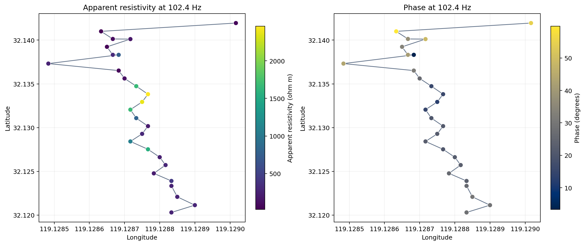
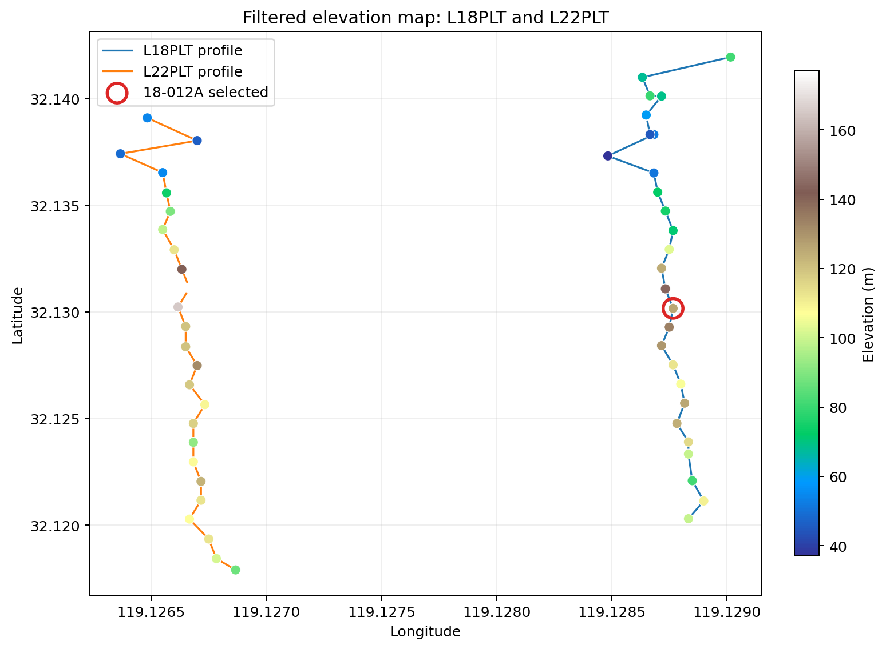
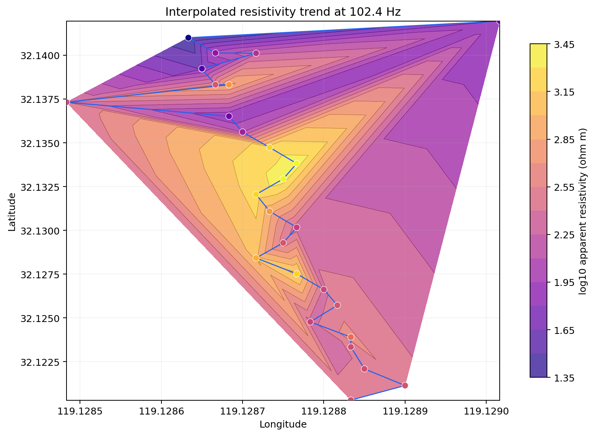

Station Maps
============

:term:`Station map`\ s show station positions, line traces, labels, and
:term:`scalar overlay` values.  Use them for survey :term:`QC`,
coverage inspection, and quick comparison of per-station quantities.

The station-map API is intentionally code-first.  It accepts the same
sources described in :doc:`loading`: EDI folders, EDI files, file
lists, EDI-like objects, ``Sites`` containers, or an already-normalized
:class:`pycsamt.map.MapData` / :term:`MapData` object.

What A Station Map Shows
------------------------

A station map combines three kinds of information:

* station locations or station order;
* optional profile-line traces and station labels;
* one scalar value per station, called the ``overlay``.

If the normalized table contains finite latitude and longitude values,
the Plotly backend builds a geographic map; rows with incomplete pairs
appear as gaps.  If neither coordinate axis is usable, it falls back to
a profile-style station-index plot rather than failing.
In normalized form, station :math:`s_i` contributes a coordinate pair
:math:`(\lambda_i,\phi_i)` when longitude and latitude are finite, and
an overlay value :math:`v_i`.  Geographic maps draw
:math:`(\lambda_i,\phi_i,v_i)`; fallback maps draw
:math:`(i,v_i)`, where :math:`i` is the zero-based station index.  This
keeps the diagnostic reproducible even before coordinate cleanup is
complete.

Function API
------------

Use :func:`pycsamt.map.plot_station_map` for one-shot scripts and
notebooks.  Rendering options are passed with
:class:`pycsamt.map.StationMapOptions`.

.. code-block:: pycon

   >>> from pycsamt.map import (
   ...     StationMapOptions,
   ...     ensure_map_data,
   ...     plot_station_map,
   ...     value_at_frequency_details,
   ... )

   >>> source = "data/AMT/WILLY_DATA/L18PLT"
   >>> data = ensure_map_data(source)
   >>> options = StationMapOptions(
   ...     overlay="rho",
   ...     frequency=10.0,
   ...     frequency_tolerance=2.0,
   ...     component="xy",
   ...     show_profiles=True,
   ...     show_labels=True,
   ... )
   >>> fig = plot_station_map(data, options=options)
   >>> print(len(fig.data), tuple(trace.type for trace in fig.data))
   2 ('scattermap', 'scattermap')

   >>> selected = value_at_frequency_details(
   ...     data,
   ...     frequency=10.0,
   ...     quantity="rho",
   ...     component="xy",
   ...     tolerance=2.0,
   ... )
   >>> print(len(selected))
   28
   >>> sorted({item.selection.actual for item in selected.values()})
   [10.16]

The function returns a Plotly figure by default.  You can display it in
a notebook with ``fig.show()`` or export it with the helpers described
in :doc:`export`.

The two traces are the station markers and the profile line.  The
requested 10 Hz sample is taken from the nearest available
:term:`frequency grid` value, 10.16 Hz, for every station in this sample
line.

Reusing Loaded Data
-------------------

For repeated maps, load once and reuse the same
:class:`pycsamt.map.MapData`.

In v2.1, the normalizer delegates to the more robust
:func:`pycsamt.emtools._core.ensure_sites`.  Its default ``"auto"``
ordering uses coordinate-derived :term:`chainage` only when the sites
form a credible profile; otherwise it preserves input order.  The
decision is recorded on ``data.sites.ordering``, so a plot can report
why its station sequence changed or remained unchanged.

.. code-block:: pycon

   >>> from pycsamt.map import (
   ...     StationMapOptions,
   ...     ensure_map_data,
   ...     plot_station_map,
   ...     value_at_frequency_details,
   ... )

   >>> data = ensure_map_data("data/AMT/WILLY_DATA/L18PLT")
   >>> report = data.sites.ordering
   >>> print(report["requested"], report["applied"], report["n_sites"])
   auto chainage 28
   >>> print(round(report["span_m"], 1), round(report["linearity"], 4))
   2403.0 0.9999

   >>> rho_options = StationMapOptions(
   ...     overlay="rho", frequency=100.0, component="xy"
   ... )
   >>> rho = plot_station_map(data, options=rho_options)

   >>> phase_options = StationMapOptions(
   ...     overlay="phase",
   ...     frequency=100.0,
   ...     component="xy",
   ...     cmap="Cividis",
   ... )
   >>> phase = plot_station_map(data, options=phase_options)
   >>> print(len(rho.data), len(phase.data))
   2 2

   >>> rho_values = value_at_frequency_details(
   ...     data, frequency=100.0, quantity="rho", component="xy"
   ... )
   >>> phase_values = value_at_frequency_details(
   ...     data, frequency=100.0, quantity="phase", component="xy"
   ... )
   >>> print(round(min(v.value for v in rho_values.values()), 3),
   ...       round(max(v.value for v in rho_values.values()), 3))
   22.899 2461.779
   >>> print(round(min(v.value for v in phase_values.values()), 3),
   ...       round(max(v.value for v in phase_values.values()), 3))
   3.313 59.84

   The same loaded :term:`MapData` rendered twice: once as
   :math:`\rho_{a,xy}` and once as :math:`\varphi_{xy}` at the selected
   102.4 Hz sample.  The central part of the profile contains the
   strongest resistive values, whereas the largest phases occur mainly
   near the northern end.  Their spatial patterns are therefore not
   interchangeable: a bright resistivity marker does not automatically
   imply a large phase at the same station.

Builder API
-----------

Use :class:`pycsamt.map.StationMap` when you want an immutable builder
style.  ``with_overlay`` and ``with_options`` return new builders that
reuse the same normalized data.

.. code-block:: pycon

   >>> from pycsamt.map import StationMap

   >>> builder = StationMap("data/AMT/WILLY_DATA/L18PLT")
   >>> depth_builder = builder.with_overlay("skin_depth", frequency=10.0)
   >>> clean_builder = depth_builder.with_options(show_labels=False)
   >>> fig = clean_builder.figure()
   >>> print(len(fig.data), fig.data[0].mode)
   2 markers

This pattern is convenient when a notebook or application lets a user
switch overlays without re-reading the EDI files.

The original ``builder`` is unchanged: each method returns a new
builder with a copied options dataclass while all three builders point
to the same normalized :term:`MapData`.

Overlays
--------

Supported overlay names include:

``index`` or ``station``
   Station index along the line.

``elevation``
   Station elevation, when present.

``rho`` or ``resistivity``
   :term:`Apparent resistivity` at the nearest frequency.

``phase``
   :term:`Phase` at the nearest frequency.

``skin_depth`` or ``depth``
   Skin-depth scale computed from apparent resistivity and the actual
   selected frequency.

custom column name
   If the overlay name matches a column in the station table, that
   column is used.  Otherwise the station index is used as a safe
   fallback and the colorbar is labelled with the requested overlay
   name.

Frequency-Based Overlays
------------------------

``rho``, ``phase``, and ``skin_depth`` need a frequency.  The map uses
the nearest finite positive frequency for each station.  Use
``frequency_tolerance`` when the match must be strict.

.. code-block:: pycon

   >>> from pycsamt.map import (
   ...     StationMapOptions,
   ...     plot_station_map,
   ...     value_at_frequency_details,
   ... )

   >>> options = StationMapOptions(
   ...     overlay="rho",
   ...     frequency=100.0,
   ...     frequency_tolerance=5.0,
   ...     component="xy",
   ...     log_color=True,
   ...     value_range=(10.0, 10000.0),
   ... )
   >>> fig = plot_station_map(data, options=options)
   >>> matched = value_at_frequency_details(
   ...     data,
   ...     frequency=100.0,
   ...     quantity="rho",
   ...     component="xy",
   ...     tolerance=5.0,
   ... )
   >>> print(len(matched))
   28
   >>> sorted({item.selection.actual for item in matched.values()})
   [102.4]
   >>> sorted({round(item.selection.relative_delta, 3)
   ...         for item in matched.values()})
   [0.024]

The ``component`` option accepts the same component names used by the
map core helpers:

``"xy"``, ``"yx"``, ``"xx"``, ``"yy"``
   Individual impedance tensor components.

``"avg"``
   Average of ``xy`` and ``yx``.

``"det"``
   Determinant-style derived value for resistivity, or an average for
   phase.

When ``log_color=True``, only positive values are transformed with
``log10``.  Non-positive values become gaps in the color scale.
For a requested frequency :math:`f_r`, station :math:`i` selects
:math:`f_i^\*` by minimizing :math:`|f_{ik}-f_r|` over its finite
positive grid.  A finite tolerance :math:`\tau` keeps the station only
when :math:`|f_i^\*-f_r|\le\tau`.  Together, the index, selected
frequency, and acceptance rule are

.. math::
   :label: station-map-frequency-match

   k_i = \operatorname*{arg\,min}_{k:\,f_{ik}>0}|f_{ik}-f_r|,
   \qquad
   f_i^\* = f_{ik_i},
   \qquad
   |f_i^\*-f_r|\leq\tau.

After the selection in :eq:`station-map-frequency-match`, the ``xy``
apparent-resistivity overlay is

.. math::
   :label: station-map-apparent-resistivity

   v_i = \rho_{a,xy}(f_i^\*) =
   0.2\,\frac{|Z_{xy}(f_i^\*)|^2}{f_i^\*}.

Equation :eq:`station-map-apparent-resistivity` states the physical
field-unit convention.  During plotting, pyCSAMT reads the resistivity
and phase arrays already computed by the EDI parser at index :math:`k_i`
rather than recomputing them from :math:`Z`.  For phase,
:math:`v_i=\arg Z_{xy}(f_i^\*)` in degrees.  For skin depth, the map uses

.. math::
   :label: station-map-skin-depth

   v_i = \delta_i \approx 503
   \sqrt{\frac{\rho_{a,xy}(f_i^\*)}{f_i^\*}}\ \mathrm{m}.

Equation :eq:`station-map-skin-depth` is a penetration-depth scale for
an equivalent uniform conductor, not a recovered interface depth.  Keep
``frequency``, ``frequency_tolerance``, ``component``, and
``log_color`` fixed when comparing exported maps.

Labels, Lines, And Selection
----------------------------

Station maps can label stations, draw line traces, filter lines, and
highlight one station.

.. code-block:: pycon

   >>> from pycsamt.map import StationMapOptions, load_lines, plot_station_map

   >>> data = load_lines("data/AMT/WILLY_DATA", detect="folder")

   >>> options = StationMapOptions(
   ...     overlay="elevation",
   ...     line_filter=("L18PLT", "L22PLT"),
   ...     selected_id="18-012A",
   ...     show_profiles=True,
   ...     show_labels=False,
   ...     marker_size=9,
   ... )
   >>> fig = plot_station_map(data, options=options)
   >>> print(data.lines)
   ('L18PLT', 'L22PLT', 'L26PLT', 'L30PLT', 'L34PLT')
   >>> print(len(fig.data), tuple(trace.type for trace in fig.data))
   4 ('scattermap', 'scattermap', 'scattermap', 'scattermap')
   >>> tuple(len(trace.lat) for trace in fig.data)
   (28, 28, 25, 25)

``line_filter`` compares against normalized line names in
``data.lines``.  ``selected_id`` increases the selected station marker
size; it does not remove other stations.

   Filtering keeps only ``L18PLT`` and ``L22PLT`` for display, revealing
   two roughly north--south profiles separated in longitude.  The red
   ring enlarges the real station ``18-012A`` without creating a new
   trace or removing any record.  Elevation changes along both lines,
   but the color pattern alone should not be read as a continuous
   topographic surface between them.

Basemaps
--------

Geographic station maps use public Plotly basemap styles by default.
The theme controls the default:

``theme="light"``
   Uses ``"open-street-map"`` unless ``basemap`` is set.

``theme="dark"``
   Uses ``"carto-darkmatter"`` unless ``basemap`` is set.

Pass ``basemap`` to choose a specific style.

.. code-block:: pycon

   >>> fig = plot_station_map(
   ...     data,
   ...     options=StationMapOptions(
   ...         overlay="index",
   ...         basemap="carto-positron",
   ...         bearing=15.0,
   ...     ),
   ... )
   >>> print(fig.layout.map.style, fig.layout.map.bearing)
   carto-positron 15.0

The map package also supports token-free ESRI raster basemaps through
the shared basemap helpers.  Common style names include
``"esri-satellite"``, ``"esri-topo"``, and ``"esri-natgeo"``.

Density And Contour Layers
--------------------------

For quick spatial trends, enable a :term:`density layer`:

.. code-block:: pycon

   >>> data = ensure_map_data("data/AMT/WILLY_DATA/L18PLT")
   >>> fig = plot_station_map(
   ...     data,
   ...     options=StationMapOptions(
   ...         overlay="rho",
   ...         frequency=100.0,
   ...         show_contours=True,
   ...         contour_opacity=0.45,
   ...     ),
   ... )
   >>> print(len(fig.data), tuple(trace.type for trace in fig.data))
   3 ('densitymap', 'scattermap', 'scattermap')

``show_contours`` adds a density-style Plotly map layer when at least
three finite coordinate/value triples are available.

For a filled image layer similar to a Surfer-style contour map, enable
``contour_image``:

.. code-block:: pycon

   >>> fig = plot_station_map(
   ...     data,
   ...     options=StationMapOptions(
   ...         overlay="rho",
   ...         frequency=100.0,
   ...         contour_image=True,
   ...         contour_mode="filled+lines",
   ...         contour_levels=16,
   ...         contour_opacity=0.55,
   ...     ),
   ... )
   >>> len(fig.layout.map.layers)
   1

``contour_image`` rasterizes contours to a transparent PNG and inserts
it below station markers as a map image layer.  It returns no layer
when there are fewer than three finite points or when log scaling would
leave fewer than three positive values.

For elevation maps, ``elevation_mode="contours"`` is the clearer shortcut.
It enables the contour layer for Plotly and draws native ``contourf`` and
contour lines for Matplotlib.  The default ``elevation_mode="markers"``
preserves the original behavior.  Linear interpolation is the default
because it remains within the local values supported by the stations;
the Matplotlib result is additionally clipped to the observed elevation
range after optional smoothing.

   A static rendering of the contour idea: the station
   :math:`\log_{10}(\rho_a)` values are interpolated before the measured
   markers are drawn over the result.  The yellow zones in the central
   profile follow high measured values, but the broad triangular bands
   near the northern fold are controlled by sparse geometry.  They are
   interpolation support, not evidence for a triangular subsurface
   body.  Interpret the markers first and the filled surface only as a
   visual trend between them.

Themes And Color Scales
-----------------------

Station maps share the map theme and color utilities.

.. code-block:: pycon

   >>> options = StationMapOptions(
   ...     overlay="phase",
   ...     frequency=100.0,
   ...     theme="publication",
   ...     cmap="Turbo",
   ...     opacity=0.85,
   ...     title="L18 phase at 100 Hz",
   ... )
   >>> fig = plot_station_map(data, options=options)
   >>> print(fig.layout.title.text, fig.data[0].marker.opacity)
   L18 phase at 100 Hz 0.85

Use ``value_range=(min, max)`` for stable comparisons across multiple
maps.  This is especially important when exporting a sequence of maps
for a report.
If two maps use different automatic color limits, the same value can
appear as different colors.  A fixed range makes the color transform a
single function :math:`c(v)` across the full sequence, which is the
more reproducible choice for reports.

Backends
--------

``plotly`` is the interactive default.  ``matplotlib`` produces static
figures for reports and batch processing.

.. code-block:: pycon

   >>> from pycsamt.map import StationMapOptions, plot_station_map

   >>> fig = plot_station_map(
   ...     "data/AMT/WILLY_DATA/L18PLT",
   ...     options=StationMapOptions(backend="matplotlib"),
   ... )
   >>> type(fig).__name__
   'Figure'

Backend behavior differs slightly:

``plotly``
   Produces interactive geographic maps when coordinates exist, and
   station-index plots when they do not.

``matplotlib``
   Produces a static Matplotlib figure.  It uses longitude/latitude
   when available and station index/value otherwise.

Unknown backends raise ``ValueError``.

Coordinate Fallback
-------------------

Station maps do not require coordinates to produce a useful diagnostic
view.  When the latitude and longitude columns contain usable values,
the Plotly backend attempts a geographic map and leaves incomplete rows
as gaps.  If the coordinate axes are unavailable, it creates a
Cartesian station-index plot.

.. code-block:: pycon

   >>> from pycsamt.map import ensure_map_data

   >>> data = ensure_map_data("data/AMT/WILLY_DATA/L18PLT")
   >>> print("has geo", data.has_geo)
   has geo True

   >>> if not data.has_geo:
   ...     print("Using profile fallback because coordinates are incomplete.")

For production geographic maps, validate ``data.has_geo`` before
plotting when every station must appear at a real location, and fix
coordinates through your survey metadata or CRS preprocessing.

Exporting Station Maps
----------------------

Use the export helpers to save figures consistently:

.. code-block:: pycon

   >>> from pycsamt.map import (
   ...     StationMapOptions,
   ...     plot_station_map,
   ...     save_png,
   ...     write_html,
   ... )

   >>> plotly_fig = plot_station_map(data)
   >>> static_fig = plot_station_map(
   ...     data, options=StationMapOptions(backend="matplotlib")
   ... )
   >>> print(write_html(plotly_fig, "outputs/stations.html").as_posix())
   outputs/stations.html
   >>> print(save_png(static_fig, "outputs/stations.png").as_posix())
   outputs/stations.png

PNG export calls ``savefig`` directly for Matplotlib figures.  Exporting
a Plotly figure to PNG instead requires a static image backend such as
Kaleido; HTML export does not.

Troubleshooting
---------------

Empty figure
   No stations were loaded, or filtering removed every line.  Inspect
   ``data.station_ids`` and ``data.lines``.

Map appears as a station-index plot
   No finite geographic coordinates were available.  Check
   ``data.has_geo`` and your station metadata.

``rho`` or ``phase`` colors are missing
   The requested frequency may not exist within
   ``frequency_tolerance``, or the station may not have a valid ``Z``
   object.  Try removing the tolerance to inspect nearest-frequency
   behavior.

Contours do not appear
   The density and contour-image layers need at least three finite
   coordinate/value triples.  They are skipped silently when there is
   not enough data.

Colorbars differ between maps
   Set the same ``value_range`` and ``log_color`` options on each map.
