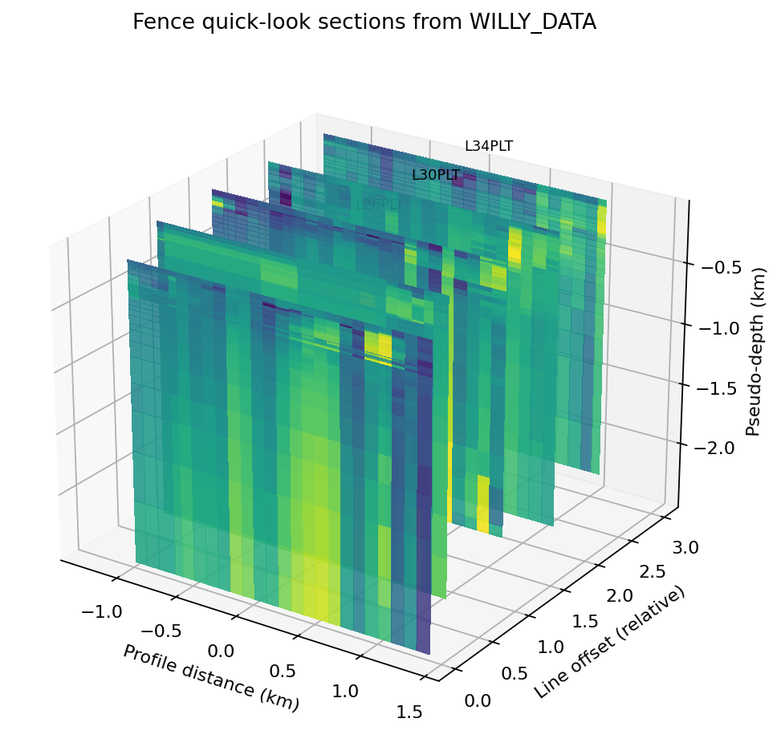
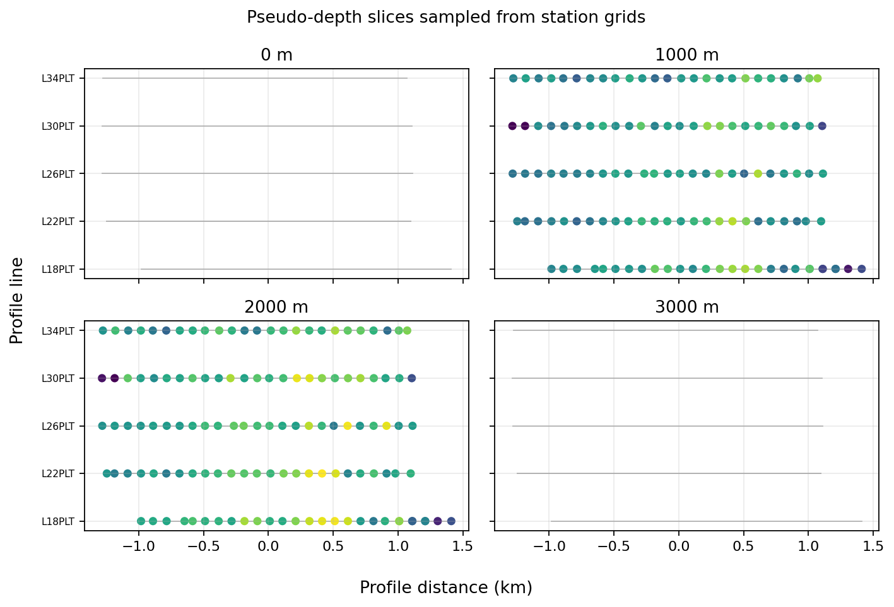
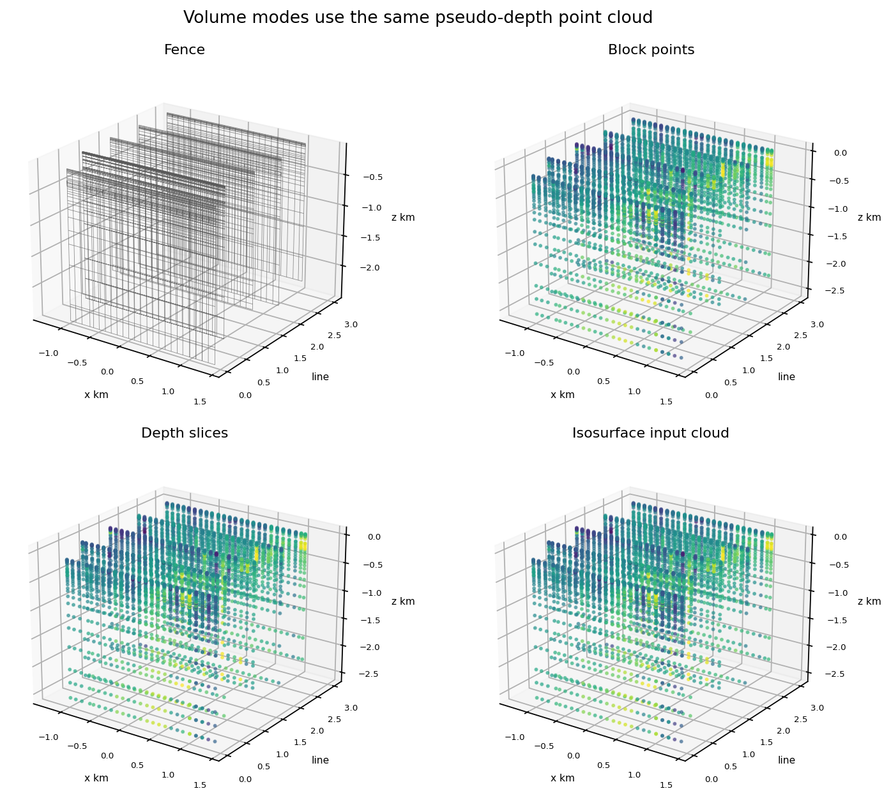

3-D Quick-Look Maps
===================

The volume tools build :term:`3-D quick-look map` visualizations from
profile :term:`pseudosection` data.  They estimate
:term:`pseudo-depth` from :term:`apparent resistivity` and period, then
render the values as :term:`fence view`, :term:`block volume`,
:term:`depth slice`, or :term:`isosurface` views.

.. warning::

   These maps are not inversion models.  Use them to inspect trends,
   compare lines, and communicate quick-look targets.  Geological
   interpretation should be checked against inversion and QC products.

What The 3-D Map Represents
---------------------------

The 3-D map module does not read an inversion mesh for ordinary EDI
volume maps.  It starts from the same impedance-derived pseudosection
table used by the profile tools, then places each period sample at an
approximate :term:`skin depth` scale:

.. math::

   z \approx 503 \sqrt{\rho_a T}

where :math:`\rho_a` is apparent resistivity in ohm metres and
:math:`T=1/f` is period in seconds.  This is a quick-look depth proxy.
It is useful for comparing survey lines and screening targets, but it
should not be treated as a recovered earth model.  In the EDI path,
pyCSAMT first builds a station-by-period table
:math:`V_{jk}=v(s_k,T_j)` and a matching apparent-resistivity table
:math:`R_{jk}=\rho_a(s_k,T_j)`.  The pseudo-depth for period
:math:`T_j` is then

.. math::

   z_j = 503\sqrt{\widetilde{\rho}_{a,j}T_j},
   \qquad
   \widetilde{\rho}_{a,j}=\operatorname{median}_k R_{jk},

so every station in a line shares the same period-to-depth coordinate
while the color still varies station by station.

The displayed color can be apparent resistivity or phase:

``quantity="resistivity"`` or ``quantity="rho"``
   Color by apparent resistivity.

``quantity="phase"``
   Color by :term:`phase`, while apparent resistivity is still used to
   derive pseudo-depth and to apply ``rho_range`` filters.

Data Preparation
----------------

For a single line, pass the EDI folder directly.  For multi-line 3-D
views, load all lines first so line names and station ordering are
stable across every mode.

.. code-block:: python

   from pycsamt.map import load_lines

   data = load_lines(
       "data/AMT/WILLY_DATA",
       detect="folder",
       recursive=True,
   )

   print(data.lines)
   print(data.station_ids[:5])

Captured output:

.. code-block:: text

   ('L18PLT', 'L22PLT', 'L26PLT', 'L30PLT', 'L34PLT')
   ('18-001A', '18-002U', '18-003A', '18-004A', '18-005U')

The volume builder groups stations by ``StationRecord.line``.  If no
line metadata is available, every station is placed into a single line
named ``"line"``.
When coordinates are available, station longitude/latitude are
projected to an internal survey coordinate system: along-line distance
:math:`u_i` becomes the scene ``x`` coordinate, and cross-line position
:math:`v_i` becomes the line offset.  If real geometry is missing, the
builder falls back to index-based spacing so the figure remains a
diagnostic rather than failing.

Function API
------------

Use :func:`pycsamt.map.plot_volume_map` or the equivalent
:func:`pycsamt.map.plot_3d_map` for one-shot figures.

.. code-block:: python

   from pycsamt.map import VolumeMapOptions, plot_volume_map

   fig = plot_volume_map(
       data,
       options=VolumeMapOptions(
           mode="fence",
           quantity="resistivity",
           component="xy",
           depth_range=(0.0, 2000.0),
           period_range=(0.001, 10.0),
           show_stations=True,
       ),
   )

The returned object is a Plotly figure.  Use ``fig.show()`` in a
notebook or export it with :doc:`export`.

Captured output:

.. code-block:: text

   function traces 16
   function trace types ('surface', 'scatter3d', 'scatter3d', 'surface', 'scatter3d', 'scatter3d', 'surface', 'scatter3d', 'scatter3d', 'surface', 'scatter3d', 'scatter3d', 'surface', 'scatter3d', 'scatter3d', 'scatter3d')
   function profiles ('L18PLT', 'L22PLT', 'L26PLT', 'L30PLT', 'L34PLT')
   function depth spans {'L18PLT': (232.2, 1980.7, 17), 'L22PLT': (298.5, 1790.5, 16), 'L26PLT': (236.1, 1862.8, 18), 'L30PLT': (292.9, 1792.6, 16), 'L34PLT': (315.8, 1935.6, 16)}

   Static preview of the fence concept.  The Plotly figure remains
   interactive; this image documents the same line grouping and
   pseudo-depth range for reproducible reports.

Builder API
-----------

Use :class:`pycsamt.map.VolumeMap` when you want to reuse normalized
data and switch modes or quantities without reloading files.
``VolumeMap`` is an alias of :class:`pycsamt.map.Map3D`.

.. code-block:: python

   from pycsamt.map import VolumeMap

   fig = (
       VolumeMap("data/AMT/WILLY_DATA/L18PLT")
       .with_mode("surface")
       .with_quantity("phase")
       .with_component("xy")
       .figure()
   )

The builder methods are immutable: each call returns a new builder that
shares the same ``MapData`` but carries different options.

Captured output:

.. code-block:: text

   builder traces 1
   builder trace types ('isosurface',)

.. code-block:: python

   base = VolumeMap(data).with_options(
       depth_range=(0.0, 2500.0),
       component="xy",
   )

   fence = base.with_mode("fence").figure()
   slices = base.with_mode("depth").with_options(n_slices=6).figure()

Captured output:

.. code-block:: text

   base fence traces 15 ('surface', 'scatter3d', 'scatter3d', 'surface', 'scatter3d', 'scatter3d', 'surface', 'scatter3d', 'scatter3d', 'surface', 'scatter3d', 'scatter3d', 'surface', 'scatter3d', 'scatter3d')
   base depth traces 11 ('surface', 'surface', 'surface', 'surface', 'surface', 'surface', 'scatter3d', 'scatter3d', 'scatter3d', 'scatter3d', 'scatter3d')

Modes
-----

``fence``
   One pseudo-depth surface per survey line.  This is the best first
   view for multi-line surveys because it keeps each profile readable.

``block``
   :term:`Block volume` rendering from all finite pseudo-depth samples.  It is
   useful for a compact 3-D impression, but can hide line structure on
   sparse surveys.

``depth``
   Horizontal :term:`pseudo-depth` slices.  Values are interpolated at the
   slice depths generated from ``depth_range`` or from the available
   pseudo-depth span.

``surface``
   :term:`Isosurface`\ s across the pseudo-depth point cloud.  Use
   ``iso_range`` and ``surface_count`` to control which value shells
   are visible.

Mode Examples
-------------

Fence view with one draped surface per line:

.. code-block:: python

   fig = plot_volume_map(
       data,
       options=VolumeMapOptions(
           mode="fence",
           quantity="resistivity",
           component="xy",
           show_labels=True,
           show_contours=True,
       ),
   )

Captured output:

.. code-block:: text

   fence traces 15 types ('surface', 'scatter3d', 'scatter3d', 'surface', 'scatter3d', 'scatter3d', 'surface', 'scatter3d', 'scatter3d', 'surface', 'scatter3d', 'scatter3d', 'surface', 'scatter3d', 'scatter3d')
   fence depth min max 46.4 42688.6

Block volume view:

.. code-block:: python

   fig = plot_volume_map(
       data,
       options=VolumeMapOptions(
           mode="block",
           opacity=0.35,
           surface_count=18,
       ),
   )

Captured output:

.. code-block:: text

   block traces 1 types ('volume',)
   block depth min max 46.4 42688.6

Depth slices:

.. code-block:: python

   fig = plot_volume_map(
       data,
       options=VolumeMapOptions(
           mode="depth",
           depth_range=(0.0, 3000.0),
           n_slices=7,
           show_contours=True,
       ),
   )

Captured output:

.. code-block:: text

   depth traces 12 types ('surface', 'surface', 'surface', 'surface', 'surface', 'surface', 'surface', 'scatter3d', 'scatter3d', 'scatter3d', 'scatter3d', 'scatter3d')
   depth depth min max 46.4 2893.0
   depth slice depths [0.0, 500.0, 1000.0, 1500.0, 2000.0, 2500.0, 3000.0]

   Four sampled pseudo-depth slices shown as a compact static preview.
   The Plotly depth mode creates one surface per requested slice.

Isosurface view:

.. code-block:: python

   fig = plot_volume_map(
       data,
       options=VolumeMapOptions(
           mode="surface",
           iso_range=(1.0, 3.0),
           surface_count=5,
           opacity=0.55,
       ),
   )

Captured output:

.. code-block:: text

   surface traces 1 types ('isosurface',)
   surface depth min max 46.4 42688.6

   Fence, block, depth-slice, and isosurface-style views all start from
   the same pseudosection-derived point cloud; the mode changes how that
   cloud is gridded and rendered.

Filtering
---------

``depth_range`` clips the pseudo-depth axis.  ``period_range`` filters
the periods before grid construction.  ``rho_range`` masks samples by
apparent resistivity, even when the displayed quantity is phase.

``iso_range`` controls the value range used by isosurface rendering.

Use ``value_range`` to keep colorbars comparable across multiple
figures:

.. code-block:: python

   options = VolumeMapOptions(
       mode="fence",
       quantity="resistivity",
       log_color=True,
       value_range=(10.0, 10000.0),
       rho_range=(10.0, 10000.0),
       period_range=(0.001, 5.0),
       depth_range=(0.0, 2500.0),
   )

``rho_range`` filters in physical apparent-resistivity units.  When
``log_color=True``, ``value_range`` is converted to log10 color space
for resistivity colorbars.

Captured output:

.. code-block:: text

   filter profiles 5
   filter periods first line 19
   filter value range color (1.0, 4.0)

The filter order is worth keeping explicit in scripts.  ``period_range``
removes rows before pseudo-depth grids are built.  ``depth_range`` clips
the resulting :math:`z_j` values.  ``rho_range`` masks cells whose
physical apparent resistivity falls outside the requested interval.  If
``log_color=True``, only the displayed color values are transformed to
:math:`\log_{10}(\rho_a)`; the depth estimate and ``rho_range`` filter
stay in physical units.

Components
----------

The ``component`` option selects the impedance component used to build
the pseudosection table:

``"xy"``, ``"yx"``, ``"xx"``, ``"yy"``
   Individual tensor components.

``"avg"``
   Average of ``xy`` and ``yx``.

``"det"``
   Determinant-style derived value for resistivity, or average phase.

Use the same component for volume maps that you use in profile
pseudosections when you want the 2-D and 3-D views to compare directly.

Line Spacing And Azimuth
------------------------

``line_spacing`` controls the offset between profile lines in the 3-D
scene.  ``azimuth`` rotates those line offsets.

.. code-block:: python

   fig = plot_volume_map(
       data,
       options=VolumeMapOptions(
           mode="fence",
           line_spacing=1.5,
           azimuth=30.0,
       ),
   )

With ``azimuth=0``, line offsets appear along the scene ``y`` axis.
With ``azimuth=90``, offsets are shifted into the ``x`` direction.
For a line offset :math:`d_\ell` and azimuth :math:`\alpha`, the plotted
coordinates are

.. math::

   x' = u + d_\ell\sin\alpha,
   \qquad
   y' = d_\ell\cos\alpha.

Captured output:

.. code-block:: text

   spacing traces 15 ('surface', 'scatter3d', 'scatter3d', 'surface', 'scatter3d', 'scatter3d', 'surface', 'scatter3d', 'scatter3d', 'surface', 'scatter3d', 'scatter3d', 'surface', 'scatter3d', 'scatter3d')

Topography And Terrain
----------------------

By default, depth is plotted downward from a flat surface.  Enable
``topography`` to use station elevations from the loaded EDI metadata:

.. code-block:: python

   fig = plot_volume_map(
       data,
       options=VolumeMapOptions(
           mode="fence",
           topography=True,
           show_terrain=True,
       ),
   )

When ``topography=True``, the vertical axis is labelled
``Elevation - depth (m)`` and each pseudo-depth surface is shifted by
the station elevations.  ``show_terrain=True`` adds a terrain trace at
the top of each line.  If elevations are missing, zeros are used for
those stations.

Captured output:

.. code-block:: text

   topography traces 15 ('surface', 'scatter3d', 'scatter3d', 'surface', 'scatter3d', 'scatter3d', 'surface', 'scatter3d', 'scatter3d', 'surface', 'scatter3d', 'scatter3d', 'surface', 'scatter3d', 'scatter3d')

With topography enabled, a displayed vertical coordinate is
:math:`z' = h_i - z_j`, where :math:`h_i` is station elevation and
:math:`z_j` is pseudo-depth.  With topography disabled, :math:`h_i=0`
for every station.

Station Markers
---------------

Set ``show_stations=True`` to add station markers at the survey
surface.

.. code-block:: python

   fig = plot_volume_map(
       data,
       options=VolumeMapOptions(
           mode="fence",
           show_stations=True,
           station_symbol="diamond",
           station_size=5,
           station_color="#111827",
       ),
   )

Markers use the same line offsets and optional topography shift as the
volume surfaces.

Captured output:

.. code-block:: text

   station marker traces 16 ('surface', 'scatter3d', 'scatter3d', 'surface', 'scatter3d', 'scatter3d', 'surface', 'scatter3d', 'scatter3d', 'surface', 'scatter3d', 'scatter3d', 'surface', 'scatter3d', 'scatter3d', 'scatter3d')
   station marker last name stations

Color And Theme Controls
------------------------

Volume maps support the shared map themes and Plotly color scales:

.. code-block:: python

   fig = plot_volume_map(
       data,
       options=VolumeMapOptions(
           mode="depth",
           theme="dark",
           cmap="Turbo",
           opacity=0.75,
           title="Depth slices: XY resistivity",
       ),
   )

For resistivity, ``log_color=True`` is the default.  For phase, values
are shown linearly and the colorbar title becomes ``Phase (deg)``.

Exporting 3-D Views
-------------------

HTML is the safest export for 3-D Plotly figures because it preserves
rotation, zoom, hover labels, and all surfaces:

.. code-block:: python

   from pycsamt.map import write_html

   write_html(fig, "outputs/volume_fence.html")

Static image export is possible when a Plotly image backend such as
Kaleido is installed:

.. code-block:: python

   from pycsamt.map import save_png

   save_png(fig, "outputs/volume_fence.png", width=1600, height=1000)

Troubleshooting
---------------

Empty 3-D figure
   No pseudosection rows could be built.  Check that stations have a
   valid ``Z`` object with frequency, resistivity, and phase arrays.

Only one line appears
   Line metadata may be missing.  Use :func:`pycsamt.map.load_lines`
   with an explicit mapping or ``detect="folder"`` before plotting.

Depth range removes everything
   The pseudo-depth estimate may be outside your requested
   ``depth_range``.  Temporarily remove the range and inspect the full
   extent.

Phase map still responds to ``rho_range``
   This is expected.  Apparent resistivity is still used to estimate
   pseudo-depth and to apply resistivity masks.

Isosurfaces look empty
   ``iso_range`` may not overlap the color-space values.  For
   resistivity with ``log_color=True``, use log10 values in
   ``iso_range``.

Terrain is flat
   Elevations may be missing or non-finite.  The terrain shift uses
   station elevations from the normalized ``StationRecord`` objects.
