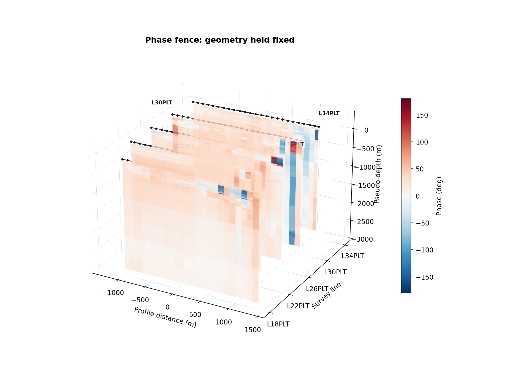
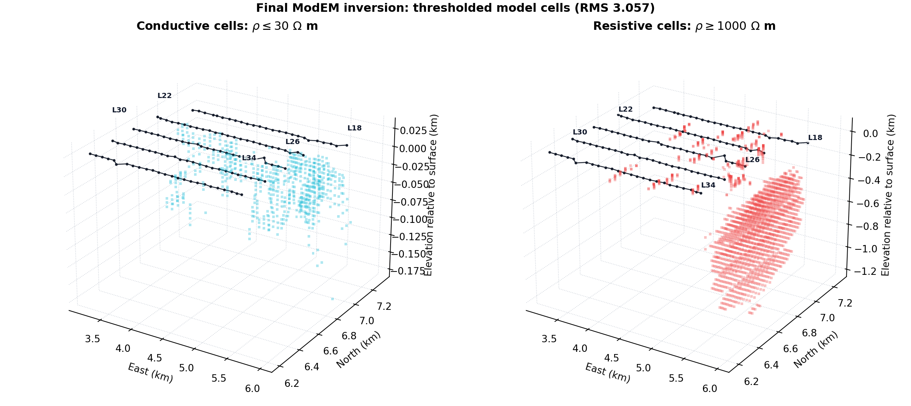
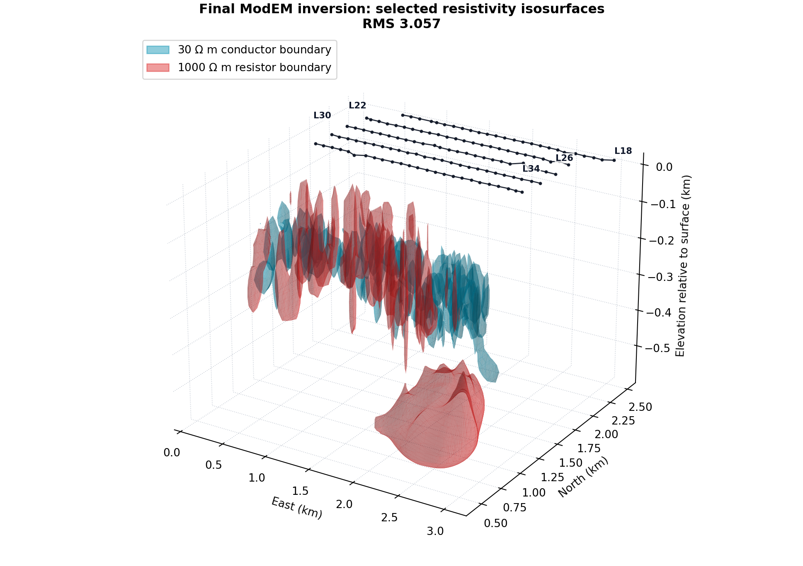
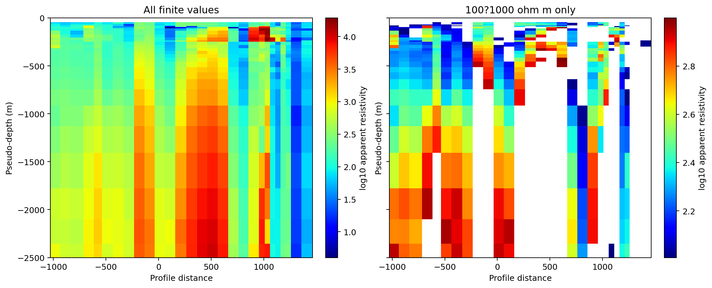

3-D Quick-Look Maps
===================

The volume tools build :term:`3-D quick-look map` visualizations from
profile :term:`pseudosection` data.  They estimate
:term:`pseudo-depth` from :term:`apparent resistivity` and period, then
render the values as :term:`fence view`, :term:`block volume`,
:term:`depth slice`, or :term:`isosurface` views.

.. warning::

   These maps are not inversion models.  Use them to inspect trends,
   compare lines, and communicate quick-look targets.  Geological
   interpretation should be checked against inversion and QC products.

What The 3-D Map Represents
---------------------------

The 3-D map module does not read an inversion mesh for ordinary EDI
volume maps.  It starts from the same impedance-derived pseudosection
table used by the profile tools, then places each period sample at an
approximate :term:`skin depth` scale:

.. math::
   :label: volume-skin-depth

   z \approx 503 \sqrt{\rho_a T}

where :math:`\rho_a` is apparent resistivity in ohm metres and
:math:`T=1/f` is period in seconds.  This is a quick-look depth proxy.
It is useful for comparing survey lines and screening targets, but it
should not be treated as a recovered earth model.  In the EDI path,
pyCSAMT first builds a station-by-period table
:math:`V_{jk}=v(s_k,T_j)` and a matching apparent-resistivity table
:math:`R_{jk}=\rho_a(s_k,T_j)`.  The pseudo-depth for period
:math:`T_j` is then

.. math::
   :label: volume-line-depth

   z_j = 503\sqrt{\widetilde{\rho}_{a,j}T_j},
   \qquad
   \widetilde{\rho}_{a,j}=\operatorname{median}_k R_{jk},

so every station in a line shares the same period-to-depth coordinate
while the color still varies station by station.
Equations :eq:`volume-skin-depth` and :eq:`volume-line-depth` define a
penetration-depth scale, not a recovered cell elevation.  The rendered
subsurface coordinate is negative, with ``0`` at the surface and larger
depth magnitudes extending downward.

The displayed color can be apparent resistivity or phase:

``quantity="resistivity"`` or ``quantity="rho"``
   Color by apparent resistivity.

``quantity="phase"``
   Color by :term:`phase`, while apparent resistivity is still used to
   derive pseudo-depth and to apply ``rho_range`` filters.

Data Preparation
----------------

For a single line, pass the EDI folder directly.  For multi-line 3-D
views, load all lines first so line names and station ordering are
stable across every mode.

.. code-block:: pycon

   >>> from pycsamt.map import load_lines

   >>> data = load_lines(
   ...     "data/AMT/WILLY_DATA",
   ...     detect="folder",
   ...     recursive=True,
   ... )

   >>> print(data.lines)
   ('L18PLT', 'L22PLT', 'L26PLT', 'L30PLT', 'L34PLT')
   >>> print(data.station_ids[:5])
   ('18-001A', '18-002U', '18-003A', '18-004A', '18-005U')

The volume builder groups stations by ``StationRecord.line``.  If no
line metadata is available, every station is placed into a single line
named ``"line"``.
When coordinates are available, station longitude/latitude are
projected to an internal survey coordinate system: along-line distance
:math:`u_i` becomes the scene ``x`` coordinate, and cross-line position
:math:`v_i` becomes the line offset.  If real geometry is missing, the
builder falls back to index-based spacing so the figure remains a
diagnostic rather than failing.

Function API
------------

Use :func:`pycsamt.map.plot_volume_map` or the equivalent
:func:`pycsamt.map.plot_3d_map` for one-shot figures.

.. code-block:: pycon

   >>> from pycsamt.map import VolumeMapOptions, plot_volume_map

   >>> fig = plot_volume_map(
   ...     data,
   ...     options=VolumeMapOptions(
   ...         mode="fence",
   ...         quantity="resistivity",
   ...         component="xy",
   ...         depth_range=(0.0, 2000.0),
   ...         period_range=(0.001, 10.0),
   ...         show_stations=True,
   ...     ),
   ... )
   >>> print(len(fig.data), tuple(trace.type for trace in fig.data))
   16 ('surface', 'scatter3d', 'scatter3d', 'surface', 'scatter3d', 'scatter3d', 'surface', 'scatter3d', 'scatter3d', 'surface', 'scatter3d', 'scatter3d', 'surface', 'scatter3d', 'scatter3d', 'scatter3d')

The returned object is a Plotly figure.  Use ``fig.show()`` in a
notebook or export it with :doc:`export`.

.. figure:: ../../images/user_guide/map/map_volume_fence_preview.png
   :alt: Fence quick-look sections for the WILLY_DATA survey.
   :align: center
   :width: 86%

   Five resistivity curtains with ``0`` at the top and negative
   pseudo-depth downward.  Surface markers retain acquisition support;
   transparent panes and dotted grid lines preserve depth reference
   without enclosing the data in a visually heavy box.

Holding geometry fixed while changing the displayed quantity separates
structural layout from response choice:

.. code-block:: pycon

   >>> phase = plot_volume_map(
   ...     data,
   ...     options=VolumeMapOptions(
   ...         mode="fence",
   ...         quantity="phase",
   ...         component="xy",
   ...         depth_range=(0.0, 2500.0),
   ...         show_stations=True,
   ...     ),
   ... )
   >>> print(len(phase.data), phase.data[-1].name)
   16 stations

   Phase colors on the same pseudo-depth geometry.  Apparent resistivity
   still controls the depth estimate, so this is a phase-colored
   penetration-scale view rather than an independent phase-derived depth
   model.  Black surface tracks retain station support; the survey-line axis
   and alternating endpoint annotations identify ``L18PLT`` through
   ``L34PLT`` without covering the curtain interiors.  Compare it with the resistivity fence to
   distinguish geometry shared by construction from response patterns that
   genuinely differ.

.. code-dropdown:: ../../../scripts/generate_map_volume_figures.py
   :language: python
   :pyobject: make_phase_fence
   :linenos:
   :title: View labeled phase-fence source code

Builder API
-----------

Use :class:`pycsamt.map.VolumeMap` when you want to reuse normalized
data and switch modes or quantities without reloading files.
``VolumeMap`` is an alias of :class:`pycsamt.map.Map3D`.

.. code-block:: pycon

   >>> from pycsamt.map import VolumeMap
   >>> fig = (
   ...     VolumeMap("data/AMT/WILLY_DATA/L18PLT")
   ...     .with_mode("surface")
   ...     .with_quantity("phase")
   ...     .with_component("xy")
   ...     .figure()
   ... )
   >>> print(len(fig.data), tuple(trace.type for trace in fig.data))
   1 ('isosurface',)

The builder methods are immutable: each call returns a new builder that
shares the same ``MapData`` but carries different options.

.. code-block:: pycon

   >>> base = VolumeMap(data).with_options(
   ...     depth_range=(0.0, 2500.0),
   ...     component="xy",
   ... )
   >>> fence = base.with_mode("fence").figure()
   >>> slices = base.with_mode("depth").with_options(n_slices=6).figure()
   >>> print(len(fence.data), len(slices.data))
   15 11
   >>> print(tuple(trace.type for trace in slices.data))
   ('surface', 'surface', 'surface', 'surface', 'surface', 'surface', 'scatter3d', 'scatter3d', 'scatter3d', 'scatter3d', 'scatter3d')

Modes
-----

``fence``
   One pseudo-depth surface per survey line.  This is the best first
   view for multi-line surveys because it keeps each profile readable.

``block``
   :term:`Block volume` rendering from all finite pseudo-depth samples.  It is
   useful for a compact 3-D impression, but can hide line structure on
   sparse surveys.

``depth``
   Horizontal :term:`pseudo-depth` slices.  Values are interpolated at the
   slice depths generated from ``depth_range`` or from the available
   pseudo-depth span.

``surface``
   :term:`Isosurface`\ s across the pseudo-depth point cloud.  Use
   ``iso_range`` and ``surface_count`` to control which value shells
   are visible.

Mode Examples
-------------

Fence view with one draped surface per line:

.. code-block:: pycon

   >>> fig = plot_volume_map(
   ...     data,
   ...     options=VolumeMapOptions(
   ...         mode="fence",
   ...         quantity="resistivity",
   ...         component="xy",
   ...         show_labels=True,
   ...         show_contours=True,
   ...     ),
   ... )
   >>> print(len(fig.data), tuple(trace.type for trace in fig.data))
   15 ('surface', 'scatter3d', 'scatter3d', 'surface', 'scatter3d', 'scatter3d', 'surface', 'scatter3d', 'scatter3d', 'surface', 'scatter3d', 'scatter3d', 'surface', 'scatter3d', 'scatter3d')
   >>> import numpy as np
   >>> z = np.concatenate([
   ...     np.asarray(trace.z, dtype=float).ravel()
   ...     for trace in fig.data if trace.type == "surface"
   ... ])
   >>> print(round(abs(np.nanmax(z)), 1), round(abs(np.nanmin(z)), 1))
   46.4 42688.6

Block volume view:

.. code-block:: pycon

   >>> fig = plot_volume_map(
   ...     data,
   ...     options=VolumeMapOptions(
   ...         mode="block",
   ...         opacity=0.35,
   ...         surface_count=18,
   ...     ),
   ... )
   >>> print(len(fig.data), fig.data[0].type, fig.data[0].surface.count)
   1 volume 18

Depth slices:

.. code-block:: pycon

   >>> fig = plot_volume_map(
   ...     data,
   ...     options=VolumeMapOptions(
   ...         mode="depth",
   ...         depth_range=(0.0, 3000.0),
   ...         n_slices=7,
   ...         show_contours=True,
   ...     ),
   ... )
   >>> surfaces = [trace for trace in fig.data if trace.type == "surface"]
   >>> print(len(fig.data), len(surfaces))
   12 7
   >>> print([float(trace.z[0][0]) for trace in surfaces])
   [-0.0, -500.0, -1000.0, -1500.0, -2000.0, -2500.0, -3000.0]

.. figure:: ../../images/user_guide/map/map_volume_depth_slices_preview.png
   :alt: Four independent pseudo-depth maps for the WILLY_DATA survey.
   :align: center
   :width: 94%

   Four sampled pseudo-depth slices shown as independent contour maps.
   The depth is printed beside every map, and no side wall or connecting
   surface is drawn between adjacent levels.  This separation prevents
   the eye from mistaking a rendering edge for a vertical anomaly.  White
   dotted tracks and dark station points retain the five acquisition lines,
   while filled contours make lateral gradients between those lines easier
   to follow.  Features between lines are interpolated and therefore have
   weaker support than features crossed by a station track.

The interactive Plotly result still contains one trace per requested
depth.  Toggle individual traces in the legend when stacked planes obscure
one another, or present them as the independent small multiples above for
a static report.

.. code-dropdown:: ../../../scripts/generate_map_volume_figures.py
   :language: python
   :pyobject: make_separated_depth_slices
   :linenos:
   :title: View independent-depth-slice source code

Isosurface view:

.. code-block:: pycon

   >>> fig = plot_volume_map(
   ...     data,
   ...     options=VolumeMapOptions(
   ...         mode="surface",
   ...         iso_range=(1.0, 3.0),
   ...         surface_count=5,
   ...         opacity=0.55,
   ...     ),
   ... )
   >>> print(len(fig.data), fig.data[0].type, fig.data[0].surface.count)
   1 isosurface 5

The same four viewing ideas become more informative when the source is an
inverted mesh rather than a pseudo-depth cloud.  The following overview uses
the final bundled ModEM result, which is loaded explicitly in the next part.

.. figure:: ../../images/user_guide/map/map_volume_modes_overview.png
   :alt: Four volume views of the final Willy ModEM inversion model.
   :align: center
   :width: 96%

   Four views of the same final ModEM inversion mesh.  Curtains expose
   vertical changes on selected northing planes; thresholded cells isolate
   conductive and resistive end members; separated horizontal slices retain
   their model depths; and isosurfaces summarize the corresponding
   resistivity boundaries.  Transparent panes and dotted grids retain scale
   without hiding the model.

.. code-dropdown:: ../../../scripts/generate_map_volume_figures.py
   :language: python
   :pyobject: make_modem_modes_overview
   :linenos:
   :title: View ModEM mode-comparison source code

For EDI input, fence preserves measured line topology most directly, while
block and isosurface views require cross-line interpolation.  In the figure
above, however, every panel samples a genuine inversion mesh; changing the
view changes which cells or boundaries are exposed, not the underlying
resistivity solution.  Rendering continuity still must not be confused with
model resolution.

ModEM Inversion Volumes
-----------------------

The preceding EDI examples use pseudo-depth.  A ModEM ``.rho`` result is
different: it is an inverted resistivity mesh with explicit east, north,
and depth cells.  The bundled Willy result can be loaded together with its
matching response file, and :func:`pycsamt.map.load_modem_lines` selects the
latest compatible pair automatically.

.. code-block:: pycon

   >>> from pycsamt.map import load_modem_lines
   >>> inversion = load_modem_lines(
   ...     "data/modem/willy_27freq_watex_line02_sample",
   ...     fetch_elevation=False,
   ... )
   >>> print(inversion.lines)
   ('18', '22', '26', '30', '34')
   >>> print(len(inversion.stations), inversion.metadata["rms"])
   125 3.057151
   >>> print({
   ...     line: section["rho"].shape
   ...     for line, section in inversion.metadata["sections"].items()
   ... })
   {'18': (41, 25), '22': (41, 25), '26': (41, 25), '30': (41, 25), '34': (41, 25)}

These arrays are vertical curtains sampled through the inversion mesh at
the ModEM stations.  They bypass the skin-depth calculation in
:eq:`volume-line-depth`; consequently their vertical coordinates are model
cell depths and their colors are inverted resistivity.

A threshold turns the full range into a target-oriented view.  Here the
conductive block retains only cells at or below 30 ohm metres:

.. code-block:: pycon

   >>> conductive = plot_volume_map(
   ...     inversion,
   ...     options=VolumeMapOptions(
   ...         mode="block",
   ...         rho_range=(0.01, 30.0),
   ...         value_range=(0.01, 30.0),
   ...         log_color=True,
   ...         opacity=0.25,
   ...         surface_count=18,
   ...     ),
   ... )
   >>> print(len(conductive.data), conductive.data[0].type)
   1 volume

The complementary resistive view uses ``rho_range=(1000.0, 10000.0)``.
Showing both thresholds separately is normally clearer than allowing the
resistive background to hide a compact conductor.

   Thresholded cells from the final inversion model.  Cyan identifies the
   shallow, discontinuous volume at or below 30 ohm metres; red identifies
   cells at or above 1000 ohm metres, including the more continuous body on
   the eastern side.  Black surface tracks and labels locate lines L18,
   L22, L26, L30, and L34 above both threshold classes.  Thresholds define
   visualization classes, not unique lithologies, and should be interpreted
   with sensitivity, resolution, and geological constraints.

.. code-dropdown:: ../../../scripts/generate_map_volume_figures.py
   :language: python
   :pyobject: make_modem_threshold_blocks
   :linenos:
   :title: View ModEM threshold-volume source code

An isosurface replaces the visible cells by a boundary at a chosen
resistivity.  For logarithmic colors, ``iso_range`` is expressed in
:math:`\log_{10}` space, whereas ``rho_range`` remains in physical units:

.. code-block:: pycon

   >>> conductor_shell = plot_volume_map(
   ...     inversion,
   ...     options=VolumeMapOptions(
   ...         mode="surface",
   ...         rho_range=(0.01, 30.0),
   ...         iso_range=(-2.0, 1.4771212547),
   ...         log_color=True,
   ...         surface_count=4,
   ...         opacity=0.35,
   ...     ),
   ... )
   >>> shell = conductor_shell.data[0]
   >>> print(shell.type, shell.surface.count, shell.isomin, round(shell.isomax, 3))
   isosurface 4 -2.0 1.477

   The 30-ohm-metre and 1000-ohm-metre boundaries reveal body continuity
   more clearly than opaque blocks.  Black surface tracks, station markers,
   and labels locate lines L18 through L34 above the shells.  Overlap in
   projection does not mean that one cell satisfies both thresholds: each
   translucent shell marks a different crossing of the continuous rendering
   field.  Rotate the HTML figure and inspect each shell independently before
   assigning geometry.

.. code-dropdown:: ../../../scripts/generate_map_volume_figures.py
   :language: python
   :pyobject: make_modem_isosurfaces
   :linenos:
   :title: View ModEM isosurface source code

Filtering
---------

``depth_range`` clips the pseudo-depth axis.  ``period_range`` filters
the periods before grid construction.  ``rho_range`` masks samples by
apparent resistivity, even when the displayed quantity is phase.

``iso_range`` controls the value range used by isosurface rendering.

Use ``value_range`` to keep colorbars comparable across multiple
figures:

.. code-block:: pycon

   >>> options = VolumeMapOptions(
   ...     mode="fence",
   ...     quantity="resistivity",
   ...     log_color=True,
   ...     value_range=(10.0, 10000.0),
   ...     rho_range=(10.0, 10000.0),
   ...     period_range=(0.001, 5.0),
   ...     depth_range=(0.0, 2500.0),
   ... )
   >>> filtered = plot_volume_map(data, options=options)
   >>> surfaces = [trace for trace in filtered.data if trace.type == "surface"]
   >>> print(len(surfaces), surfaces[0].cmin, surfaces[0].cmax)
   5 1.0 4.0

``rho_range`` filters in physical apparent-resistivity units.  When
``log_color=True``, ``value_range`` is converted to log10 color space
for resistivity colorbars.

The filter order is worth keeping explicit in scripts.  ``period_range``
removes rows before pseudo-depth grids are built.  ``depth_range`` clips
the resulting :math:`z_j` values.  ``rho_range`` masks cells whose
physical apparent resistivity falls outside the requested interval.  If
``log_color=True``, only the displayed color values are transformed to
:math:`\log_{10}(\rho_a)`; the depth estimate and ``rho_range`` filter
stay in physical units.

The masking consequence is easier to see on a single curtain:

   The same L18 section before and after retaining only 100--1000
   ohm-metre cells.  White gaps in the filtered view are deliberately
   excluded values, not missing stations or transparent geological
   bodies.  Archive the physical ``rho_range`` with the figure.

Components
----------

The ``component`` option selects the impedance component used to build
the pseudosection table:

``"xy"``, ``"yx"``, ``"xx"``, ``"yy"``
   Individual tensor components.

``"avg"``
   Average of ``xy`` and ``yx``.

``"det"``
   Determinant-style derived value for resistivity, or average phase.

Use the same component for volume maps that you use in profile
pseudosections when you want the 2-D and 3-D views to compare directly.

Line Spacing And Azimuth
------------------------

``line_spacing`` controls the offset between profile lines in the 3-D
scene.  ``azimuth`` rotates those line offsets.

.. code-block:: pycon

   >>> fig = plot_volume_map(
   ...     data,
   ...     options=VolumeMapOptions(
   ...         mode="fence",
   ...         line_spacing=1.5,
   ...         azimuth=30.0,
   ...     ),
   ... )
   >>> print(len(fig.data), tuple(trace.type for trace in fig.data[:3]))
   15 ('surface', 'scatter3d', 'scatter3d')

With ``azimuth=0``, line offsets appear along the scene ``y`` axis.
With ``azimuth=90``, offsets are shifted into the ``x`` direction.
For a line offset :math:`d_\ell` and azimuth :math:`\alpha`, the plotted
coordinates are

.. math::
   :label: volume-line-rotation

   x' = u + d_\ell\sin\alpha,
   \qquad
   y' = d_\ell\cos\alpha.

Equation :eq:`volume-line-rotation` changes scene placement for fence
and depth views.  Block mode deliberately remains axis-aligned because
Plotly volume reconstruction requires a rectilinear grid.

Topography And Terrain
----------------------

By default, depth is plotted downward from a flat surface.  Enable
``topography`` to use station elevations from the loaded EDI metadata:

.. code-block:: pycon

   >>> fig = plot_volume_map(
   ...     data,
   ...     options=VolumeMapOptions(
   ...         mode="fence",
   ...         topography=True,
   ...         show_terrain=True,
   ...     ),
   ... )
   >>> print(fig.layout.scene.zaxis.title.text)
   Elevation - depth (m)
   >>> print(len(fig.data), tuple(trace.type for trace in fig.data[:3]))
   15 ('surface', 'scatter3d', 'scatter3d')

When ``topography=True``, the vertical axis is labelled
``Elevation - depth (m)`` and each pseudo-depth surface is shifted by
the station elevations.  ``show_terrain=True`` adds a terrain trace at
the top of each line.  If elevations are missing, zeros are used for
those stations.

With topography enabled, a displayed vertical coordinate is
:math:`z' = h_i - z_j`, where :math:`h_i` is station elevation and
:math:`z_j` is pseudo-depth.  With topography disabled, :math:`h_i=0`
for every station.

Station Markers
---------------

Set ``show_stations=True`` to add station markers at the survey
surface.

.. code-block:: pycon

   >>> fig = plot_volume_map(
   ...     data,
   ...     options=VolumeMapOptions(
   ...         mode="fence",
   ...         show_stations=True,
   ...         station_symbol="diamond",
   ...         station_size=5,
   ...         station_color="#111827",
   ...     ),
   ... )
   >>> print(len(fig.data), fig.data[-1].type, fig.data[-1].name)
   16 scatter3d stations

Markers use the same line offsets and optional topography shift as the
volume surfaces.

Color And Theme Controls
------------------------

Volume maps support the shared map themes and Plotly color scales:

.. code-block:: pycon

   >>> fig = plot_volume_map(
   ...     data,
   ...     options=VolumeMapOptions(
   ...         mode="depth",
   ...         theme="dark",
   ...         cmap="Turbo",
   ...         opacity=0.75,
   ...         title="Depth slices: XY resistivity",
   ...     ),
   ... )
   >>> print(fig.layout.title.text, fig.data[0].opacity)
   Depth slices: XY resistivity 0.75

For resistivity, ``log_color=True`` is the default.  For phase, values
are shown linearly and the colorbar title becomes ``Phase (deg)``.

Exporting 3-D Views
-------------------

HTML is the safest export for 3-D Plotly figures because it preserves
rotation, zoom, hover labels, and all surfaces:

.. code-block:: pycon

   >>> from pycsamt.map import write_html
   >>> output = write_html(fig, "outputs/volume_depth.html")
   >>> print(output.as_posix())
   outputs/volume_depth.html

Static image export is possible when a Plotly image backend such as
Kaleido is installed:

.. code-block:: pycon

   >>> from pycsamt.map import save_png
   >>> output = save_png(
   ...     fig,
   ...     "outputs/volume_depth.png",
   ...     width=1600,
   ...     height=1000,
   ... )
   >>> print(output.as_posix())
   outputs/volume_depth.png

Troubleshooting
---------------

Empty 3-D figure
   No pseudosection rows could be built.  Check that stations have a
   valid ``Z`` object with frequency, resistivity, and phase arrays.

Only one line appears
   Line metadata may be missing.  Use :func:`pycsamt.map.load_lines`
   with an explicit mapping or ``detect="folder"`` before plotting.

Depth range removes everything
   The pseudo-depth estimate may be outside your requested
   ``depth_range``.  Temporarily remove the range and inspect the full
   extent.

Phase map still responds to ``rho_range``
   This is expected.  Apparent resistivity is still used to estimate
   pseudo-depth and to apply resistivity masks.

Isosurfaces look empty
   ``iso_range`` may not overlap the color-space values.  For
   resistivity with ``log_color=True``, use log10 values in
   ``iso_range``.

Terrain is flat
   Elevations may be missing or non-finite.  The terrain shift uses
   station elevations from the normalized ``StationRecord`` objects.
