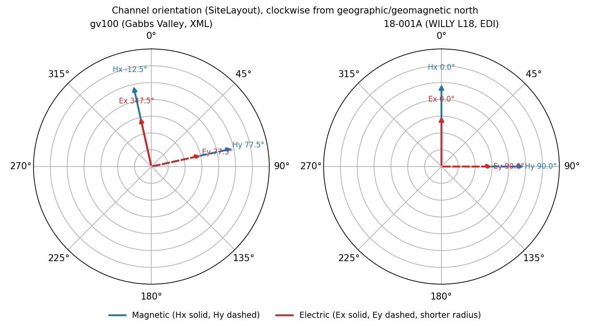

.. _user_guide_metadata_channels_and_orientation:

Channels and Orientation
========================

.. currentmodule:: pycsamt.metadata

A transfer function is a matrix, but the matrix only means something
once its rows and columns are tied to physical channels.
:class:`ChannelMeta` describes one measured channel -- field type,
orientation angle, and sensor position -- and :class:`SiteLayout`
groups the full set of input and output channels that define a
station's measurement geometry. :class:`OrientationMeta` then records
how the *data* -- the transfer-function matrix itself -- relates to
geographic north, independently of that physical geometry. Both are
:term:`format-neutral metadata`, mapping to EMTF XML's
``<SiteLayout>`` and ``<Orientation>``/``<RotationInfo>`` elements and
populated identically whether the source was EDI or XML.

Keeping site layout and orientation as two separate classes is
deliberate, not incidental. As :class:`OrientationMeta`'s own
docstring states: it describes the orientation of the *data*, not the
physical sensor geometry, so that a transfer function can later be
rotated for processing while the physical channel layout it was
actually measured with stays exactly as recorded. Rotation is
scientific processing; ``SiteLayout`` is a historical fact about where
the sensors sat.

Reading a Real Site Layout
--------------------------

``data/gv_data/xml/gv100.xml`` -- the real Gabbs Valley document
already used in :doc:`provenance_and_bibliography` -- carries a
``<SiteLayout>`` block with the standard MT convention: the two
horizontal magnetic channels as input, and the vertical magnetic plus
both electric dipoles as output.

.. note::

   Public-domain USGS data; see :doc:`provenance_and_bibliography` for
   the required citation.

.. code-block:: pycon

   >>> from pycsamt.emtf import EMTF

   >>> tf_gv = EMTF.from_xml("data/gv_data/xml/gv100.xml")
   >>> layout = tf_gv.site_layout
   >>> print(layout.input_names, layout.output_names)
   ('Hx', 'Hy') ('Hz', 'Ex', 'Ey')
   >>> print(layout.n_input, layout.n_output)
   2 3

   >>> hx = layout.get_channel("Hx")
   >>> print(hx)
   ChannelMeta(name='Hx', field_type='magnetic', orientation=-12.5, tilt=None, x=0.0, y=0.0, z=0.0, x2=None, ...)

   >>> ex = layout.get_channel("Ex", role="output")
   >>> print(ex)
   ChannelMeta(name='Ex', field_type='electric', orientation=347.459250694624, tilt=None, x=0.0, y=0.0, z=0.0, x2=50.8, ...)
   >>> print(ex.is_electric, ex.has_second_endpoint)
   True True
   >>> print(hx.has_second_endpoint)
   False

:meth:`~SiteLayout.get_channel` searches both groups by default;
``role="output"`` above restricts the search when a name could exist
on either side (it cannot here, but a symmetric processing scheme
might reuse a name). :attr:`~ChannelMeta.has_second_endpoint` is
``True`` for ``Ex`` because an electric dipole has two electrodes --
the real ``x2=50.8`` above is the second electrode's position 50.8 m
from the first along the local ``x`` axis -- while a magnetic coil is
a point sensor and never carries ``x2``/``y2``/``z2``.

Not every field the real station recorded made it into
``ChannelMeta``, and that is also by design. The vertical channel's
free-text field notes elsewhere in the same document say
``gv100a.hz.measurement_tilt = 90.0`` -- physically correct, a
vertical coil -- but the structured ``<SiteLayout>`` element's
``<Magnetic name="Hz" .../>`` tag carries no ``tilt`` attribute at
all, so ``ChannelMeta`` leaves it unset instead of inferring 90° from
the channel's name:

.. code-block:: pycon

   >>> hz = layout.get_channel("Hz")
   >>> print(hz.tilt)
   None

Field Types and Manual Construction
-----------------------------------

``field_type`` accepts common aliases -- ``"e"``/``"electric"``,
``"h"``/``"b"``/``"magnetic"``, ``"other"`` -- and normalizes them to
one of three canonical values at construction:

.. code-block:: pycon

   >>> from pycsamt.metadata import ChannelMeta, SiteLayout

   >>> manual = ChannelMeta(name="Hx", field_type="h", orientation=-12.5, x=0.0, y=0.0, z=0.0)
   >>> print(manual.field_type)
   magnetic

   >>> try:
   ...     ChannelMeta(name="Bad", field_type="unknown")
   ... except ValueError as exc:
   ...     print(type(exc).__name__, exc)
   ValueError field_type must describe electric, magnetic, or other data

:class:`SiteLayout` rejects a channel name that collides
case-insensitively with another channel in the *same* group -- the
same identity discipline as :term:`Station identity` applied one level
down, at the channel rather than the station:

.. code-block:: pycon

   >>> try:
   ...     SiteLayout(
   ...         input_channels=[
   ...             ChannelMeta(name="Hx", field_type="h"),
   ...             ChannelMeta(name="hx", field_type="h"),
   ...         ]
   ...     )
   ... except ValueError as exc:
   ...     print(type(exc).__name__, exc)
   ValueError duplicate channel name in input_channels

Two Real Layouts Compared
-------------------------

The WILLY L18 EDI line used throughout :doc:`site_and_survey` has the
same input/output structure as the Gabbs Valley XML document, despite
coming from an unrelated survey and a different processing chain:

.. code-block:: pycon

   >>> from pathlib import Path
   >>> from pycsamt.seg.edi import EDIFile

   >>> edi = EDIFile(Path("data/AMT/WILLY_DATA/L18PLT/18-001A.edi"))
   >>> tf_willy = EMTF.from_edi(edi)
   >>> print(tf_willy.site_layout.input_names, tf_willy.site_layout.output_names)
   ('Hx', 'Hy') ('Hz', 'Ex', 'Ey')

The figure below plots each station's horizontal channel orientations
on a compass, magnetic channels solid/dashed in blue and electric
channels solid/dashed in red at a shorter radius so a near-identical
direction does not hide one arrow behind the other:

.. code-block:: python

   import numpy as np
   import matplotlib.pyplot as plt

   def channel_angles(layout):
       out = {}
       for group in (layout.input_channels, layout.output_channels):
           for ch in group:
               if ch.name.lower() != "hz" and ch.orientation is not None:
                   out[ch.name] = ch.orientation
       return out

   gv_angles = channel_angles(tf_gv.site_layout)
   willy_angles = channel_angles(tf_willy.site_layout)

   radius = {"Hx": 1.0, "Hy": 1.0, "Ex": 0.62, "Ey": 0.62}
   colors = {"Hx": "#1f77b4", "Hy": "#1f77b4", "Ex": "#d62728", "Ey": "#d62728"}
   styles = {"Hx": "-", "Ex": "-", "Hy": "--", "Ey": "--"}

   fig, axes = plt.subplots(1, 2, figsize=(9, 5), subplot_kw={"projection": "polar"})
   for ax, angles, title in zip(
       axes,
       (gv_angles, willy_angles),
       ("gv100 (Gabbs Valley, XML)", "18-001A (WILLY L18, EDI)"),
   ):
       ax.set_theta_zero_location("N")
       ax.set_theta_direction(-1)
       for name, angle in angles.items():
           theta = np.deg2rad(angle)
           r = radius[name]
           ax.annotate(
               "", xy=(theta, r), xytext=(0, 0),
               arrowprops=dict(arrowstyle="-|>", color=colors[name], lw=2, ls=styles[name]),
           )
           ax.text(theta, r + 0.18, f"{name} {angle:.1f}°", ha="center", va="center",
                    fontsize=8, color=colors[name])
       ax.set_ylim(0, 1.4)
       ax.set_yticklabels([])
       ax.set_title(title, fontsize=10, pad=24)
   fig.tight_layout()

   Horizontal channel orientations for both real stations. In each
   case ``Ex`` points in almost exactly the same direction as ``Hx``,
   and ``Ey`` almost exactly matches ``Hy`` -- the electric dipoles
   were laid out along the same reference axes as the magnetic coils.

The two stations differ in how exact that agreement is. WILLY's
``Hx``/``Ex`` are both precisely :math:`0^\circ` and
``Hy``/``Ey`` both precisely :math:`90^\circ` -- a nominal orthogonal
layout with no measured deviation recorded. Gabbs Valley's ``Hx`` sits
at :math:`-12.5^\circ` while ``Ex`` sits at
:math:`347.459250694624^\circ \equiv -12.540749^\circ`, a real
:math:`0.04^\circ` difference consistent with as-built electrode
placement not landing on the coil azimuth exactly -- the kind of
small, genuine field tolerance a nominal-only layout would hide.

Orientation Mode and Rotation History
-------------------------------------

Neither real document declares an explicit orientation ``mode``:

.. code-block:: pycon

   >>> print(tf_gv.orientation)
   OrientationMeta(mode=None, angle_to_geographic_north=None, rotation_info='EDI ZROT is constant at 347.5 deg relative to...', extra=dict(len=0, keys=[]))
   >>> print(tf_gv.orientation.is_orthogonal, tf_gv.orientation.follows_site_layout)
   False False

   >>> print(tf_willy.orientation)
   OrientationMeta(mode=None, angle_to_geographic_north=None, rotation_info='EDI ZROT is constant at 0 deg relative to HEA...', extra=dict(len=5, keys=['edi_coordsys', 'edi_had_zrot', 'edi_had_trot', ...]))

Both carry a human-readable ``rotation_info`` instead: the EDI
adapter recognized a constant ``ZROT`` in each file but, because
neither file's ``HEAD.COORDSYS`` says ``"geographic"`` (Gabbs Valley
says ``"Geomagnetic North"``), it declined to promote that angle into
``angle_to_geographic_north`` -- exactly the pattern already seen in
:doc:`provenance_and_bibliography`. Since ``mode`` is ``None`` rather
than either recognized value, both convenience properties correctly
report ``False`` for both stations: pycsamt does not guess that an
undeclared mode means "probably orthogonal."

Constructing ``OrientationMeta`` directly shows the accepted modes
and the one constraint tying them to ``angle_to_geographic_north``:

.. code-block:: pycon

   >>> from pycsamt.metadata import OrientationMeta

   >>> layout_mode = OrientationMeta(mode="site_layout")
   >>> print(layout_mode.mode, layout_mode.follows_site_layout)
   sitelayout True

   >>> orthogonal_mode = OrientationMeta(mode="orthogonal", angle_to_geographic_north=12.3)
   >>> print(orthogonal_mode.mode, orthogonal_mode.is_orthogonal, orthogonal_mode.angle_to_geographic_north)
   orthogonal True 12.3

   >>> try:
   ...     OrientationMeta(mode="sitelayout", angle_to_geographic_north=10.0)
   ... except ValueError as exc:
   ...     print(type(exc).__name__, exc)
   ValueError sitelayout orientation is defined by channel geometry; angle_to_geographic_north must be None

``"site_layout"``/``"site-layout"``/``"layout"`` are accepted spellings
that all normalize to ``"sitelayout"``. The last error is a real
consistency check, not pedantry: ``"sitelayout"`` mode means the
transfer function is still expressed in the physical channel frame
recorded by ``SiteLayout``, so an *additional* rotation angle to
geographic north would describe two contradictory things at once.

Choosing the Right Object
-------------------------

.. list-table::
   :header-rows: 1
   :widths: 30 30 40

   * - Need
     - Object
     - Notes
   * - One channel's field type, orientation, and geometry
     - :class:`ChannelMeta`
     - ``x2``/``y2``/``z2`` set only for dipoles (see :attr:`~ChannelMeta.has_second_endpoint`).
   * - The full set of channels a matrix's axes are defined against
     - :class:`SiteLayout`
     - Rejects duplicate names within a group; look up with :meth:`~SiteLayout.get_channel`.
   * - How the transfer-function matrix relates to geographic north
     - :class:`OrientationMeta`
     - Independent of physical geometry; ``mode`` is never guessed from other fields.

Next Steps
----------

* :doc:`site_and_survey` covers station identity and campaign-level
  aggregation;
* :doc:`provenance_and_bibliography` covers who created and processed
  a document and how to cite it;
* :doc:`instrument` covers the acquisition system that recorded these
  channels.
