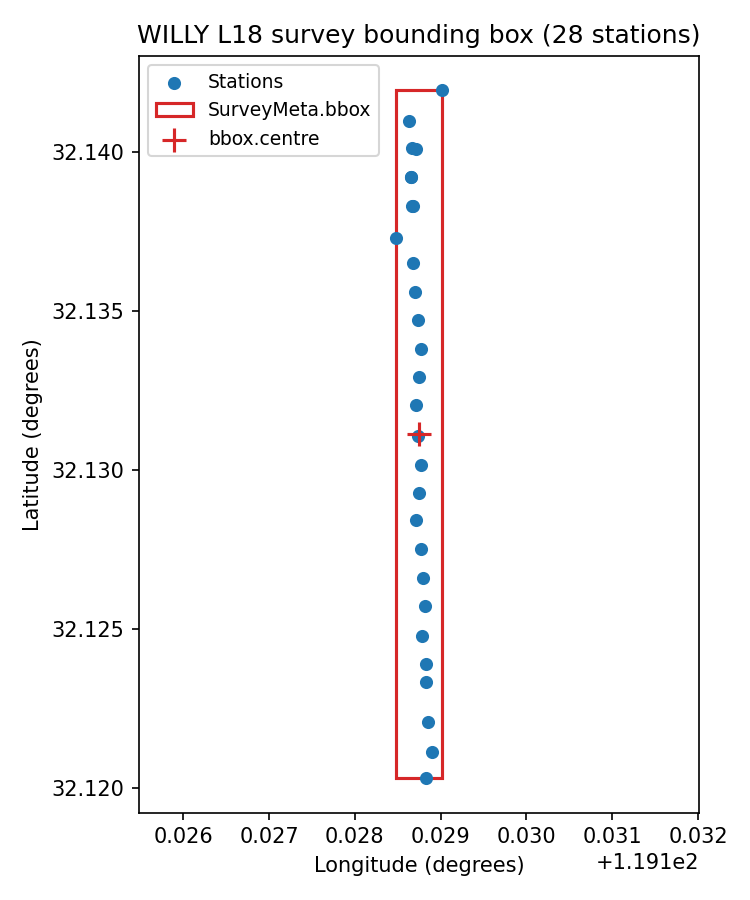

.. _user_guide_metadata_site_and_survey:

Site and Survey Metadata
========================

.. currentmodule:: pycsamt.metadata

:class:`SiteMeta` and :class:`LocationMeta` describe one station -- its
identity, geographic position, and acquisition interval -- while
:class:`SurveyMeta` and :class:`BBox` describe the campaign that
collected it. Both are :term:`format-neutral metadata`: the same
objects are produced whether the underlying file is a historical EDI
or an EMTF XML document, so a station's project name, coordinates, or
survey affiliation is recorded once rather than being re-derived
separately for each format.

These are not the identity-editing tools covered in
:doc:`../site/metadata`. :class:`~pycsamt.site.metadata.SiteMetadataEditor`
rewrites EDI ``HEAD``/``INFO`` fields on a :class:`~pycsamt.site.base.Site`
or :class:`~pycsamt.site.base.Sites` collection and enforces its own
:term:`Station identity` invariant across object, ``HEAD``, and
``SECTID``. ``SiteMeta`` and ``SurveyMeta`` are one level below that:
plain, validated data objects that a format adapter reads from or
writes into a file, with no editing workflow, transaction, or audit
trail of their own. A single real EDI file will show below why this
distinction is not academic -- the two layers can legitimately resolve
a station's identity differently.

Location and Identity Fields
----------------------------

:class:`LocationMeta` holds latitude, longitude, elevation, datum,
elevation units, and optional magnetic declination. :class:`SiteMeta`
wraps a :class:`LocationMeta` together with project, survey, country,
site identifier, human-readable name, acquisition interval, and who
acquired it. Both validate eagerly in ``__post_init__``, so an invalid
object cannot exist even transiently:

.. code-block:: pycon

   >>> from pycsamt.metadata import SiteMeta, LocationMeta

   >>> loc = LocationMeta(latitude=32.1203, longitude=119.128833, elevation=99.0)
   >>> print(loc)
   LocationMeta(latitude=32.1203, longitude=119.128833, elevation=99.0, datum='WGS84', elevation_units='meters', declination=None, declination_epoch=None, extra=dict(len=0, keys=[]))

   >>> site_meta = SiteMeta(
   ...     project="Copper-gold exploration",
   ...     survey="WILLY_L18",
   ...     year_collected=2023,
   ...     site_id="18-001A",
   ...     name="Chuzhou North",
   ...     location=loc,
   ...     acquired_by="EarthAI-Tech",
   ... )
   >>> print(site_meta)
   SiteMeta(project='Copper-gold exploration', survey='WILLY_L18', year_collected=2023, country=None, site_id='18-001A', name='Chuzhou North', location=LocationMeta(latitude=32.1203, longitude=119.128833, elevation=99.0, datum='WGS84', elevation_units='meters', declination=None, declination_epoch=None, extra=dict(len=0, keys=[])), acquired_by='EarthAI-Tech', ...)
   >>> print(site_meta.preferred_name)
   Chuzhou North

The trailing ``...`` is :class:`~pycsamt.api.property.PyCSAMTObject`'s
generic ``__repr__`` capping display at eight fields, not a sign that
``start``/``end`` were dropped -- both classes still carry every field
declared on the dataclass. :attr:`~SiteMeta.preferred_name` falls back
to ``site_id`` only when ``name`` is empty; had ``name`` been omitted
above, it would have returned ``"18-001A"`` instead.

Coordinate validation rejects a non-finite or out-of-range latitude or
longitude at construction time rather than letting it reach a
downstream projection or map:

.. math::
   :label: eq-metadata-location-domain

   -90 \le \phi \le 90,
   \qquad
   -180 \le \lambda \le 180,
   \qquad
   \phi, \lambda, h \in \mathbb{R}_{\mathrm{finite}},

where :math:`\phi`, :math:`\lambda`, and :math:`h` are latitude,
longitude, and elevation.

.. code-block:: pycon

   >>> try:
   ...     LocationMeta(latitude=91.0, longitude=0.0)
   ... except ValueError as exc:
   ...     print(type(exc).__name__, exc)
   ValueError latitude must be finite and within [-90, 90]

Elevation, declination, and declination epoch are checked for
finiteness only -- :eq:`eq-metadata-location-domain` bounds latitude
and longitude but leaves elevation unbounded, since a station can
legitimately sit below sea level or on a high plateau.

Two Independent Identity Resolvers
----------------------------------

A real file from the repository's WILLY L18 line shows how ``SiteMeta``
and :class:`~pycsamt.site.base.Site` can disagree about a station's
identity, and why that is by design rather than a bug.

.. code-block:: pycon

   >>> from pathlib import Path
   >>> from pycsamt.seg.edi import EDIFile
   >>> from pycsamt.site import Sites
   >>> from pycsamt.site.base import Site
   >>> from pycsamt.emtf import EMTF

   >>> data_root = Path("data/AMT/WILLY_DATA")
   >>> l18_paths = sorted((data_root / "L18PLT").glob("*.edi"))
   >>> print(len(l18_paths))
   28

   >>> edi_bare = EDIFile(l18_paths[0])
   >>> print(edi_bare.get_section("head").dataid)
   23-18-001A
   >>> tf_bare = EMTF.from_edi(edi_bare)
   >>> print(tf_bare.site.site_id)
   23-18-001A

   >>> site = Site(EDIFile(l18_paths[0]))
   >>> print(site.name)
   18-001A
   >>> print(site.site_meta.site_id)
   18-001A
   >>> print(site.site_meta is site.tf.site)
   True

``18-001A.edi`` genuinely stores ``HEAD.DATAID = "23-18-001A"`` on
disk. Converting the bare :class:`~pycsamt.seg.edi.EDIFile` with
:meth:`EMTF.from_edi` preserves that value verbatim in
``SiteMeta.site_id`` -- the EMTF-XML design principle that a scientific
object must not fabricate or silently normalize identity applies here
too. ``Site``, by contrast, documents that its constructor rewrites
``HEAD.DATAID`` (and ``station``, if absent) to the file stem so that
name-based lookup, ordering, and export stay consistent across a whole
:class:`~pycsamt.site.base.Sites` collection (see :term:`Station
identity`); ``site.tf`` is then materialized from that *already
renamed* EDI object, so ``site.site_meta.site_id`` reports the
normalized stem instead of the raw ``DATAID``. Both are correct for
what they are asked to do. The practical rule: build ``SiteMeta``
straight from a bare EDI object when the on-disk identifiers must be
preserved as delivered (an audit or provenance record, for example),
and go through ``Site``/``Sites`` first when consistent lookup and
export naming matter more than reproducing the raw file bytes.

Campaign-Level Aggregation
--------------------------

:class:`SurveyMeta` describes the campaign rather than one station.
:meth:`SurveyMeta.from_sites` derives it from a whole
:class:`~pycsamt.site.base.Sites` collection, computing a
:class:`BBox` from every station's coordinates and counting stations
along the way:

.. code-block:: pycon

   >>> from pycsamt.metadata import SurveyMeta, BBox

   >>> sites = Sites([EDIFile(p) for p in l18_paths])
   >>> print(len(sites))
   28

   >>> survey = SurveyMeta.from_sites(
   ...     sites,
   ...     name="WILLY_L18_2023",
   ...     method="amt",
   ...     project="Copper-gold exploration",
   ...     operator="EarthAI-Tech",
   ... )
   >>> print(survey)
   SurveyMeta(name='WILLY_L18_2023'  method=AMT  n=28)
   >>> print(survey.bbox)
   BBox(lat=[32.1203, 32.1420]  lon=[119.1285, 119.1290])
   >>> print(survey.is_complete)
   True
   >>> print(survey.duration_days)
   None
   >>> print(survey.summary())
   Survey: 'WILLY_L18_2023'  method=AMT
     Project : Copper-gold exploration
     Operator: EarthAI-Tech
     Area    : lat [32.12, 32.14]  lon [119.13, 119.13]  centre (32.131°N, 119.129°E)
     Stations: 28

``method="amt"`` was upper-cased and validated against the fixed set
of known EM methods in ``__post_init__``; an unrecognized method raises
immediately rather than silently storing free text.
:attr:`~SurveyMeta.duration_days` is ``None`` because
:meth:`~SurveyMeta.from_sites` only derives station count and the
bounding box from the collection -- it does not inspect each station's
acquisition dates, so ``date_start``/``date_end`` stay unset unless
passed explicitly as keyword arguments.
:attr:`~SurveyMeta.is_complete` only checks that ``name``, ``method``,
``bbox``, and ``n_stations`` are populated; it does not require dates,
so a campaign still mid-acquisition can already report ``True``.

Bounding-Box Geometry
---------------------

:class:`BBox` is a plain axis-aligned rectangle in decimal degrees. Its
convenience properties turn the four corner values into the quantities
a survey-design or map workflow actually needs:

.. code-block:: pycon

   >>> bbox = survey.bbox
   >>> print(bbox.centre)
   (32.131125, 119.12875)
   >>> print(bbox.area_deg2)
   1.1546666666742875e-05
   >>> print(bbox.span_lat, bbox.span_lon)
   0.021650000000001057 0.0005333333333368273
   >>> print(sites[0].coords[:2] in bbox)
   True
   >>> print((0.0, 0.0) in bbox)
   False

``in`` and :meth:`~BBox.contains` are equivalent for a ``(lat, lon)``
pair; ``__contains__`` additionally accepts a bare number to test
latitude membership alone. The area, :math:`\approx 1.15\times10^{-5}`
square degrees, is not a meaningful footprint here: L18 is a
north-south line, so :attr:`~BBox.span_lon` is roughly forty times
smaller than :attr:`~BBox.span_lat` and the "area" mostly reflects a
sliver, not a surveyed region. ``BBox`` still earns its keep on a line
survey -- as the fast, exact containment test used above -- but its
:attr:`~BBox.area_deg2` is only informative for area surveys with
comparable latitude and longitude extents.

The figure below reproduces this geometry directly, drawing every
station, the bounding box computed above, and its centre:

.. code-block:: python

   import matplotlib.pyplot as plt
   from matplotlib.patches import Rectangle

   lats = [s.coords[0] for s in sites]
   lons = [s.coords[1] for s in sites]

   fig, ax = plt.subplots(figsize=(5, 6))
   ax.scatter(lons, lats, s=28, c="#1f77b4", zorder=3, label="Stations")
   rect = Rectangle(
       (bbox.lon_min, bbox.lat_min),
       bbox.span_lon,
       bbox.span_lat,
       fill=False,
       edgecolor="#d62728",
       linewidth=1.5,
       zorder=2,
       label="SurveyMeta.bbox",
   )
   ax.add_patch(rect)
   centre_lat, centre_lon = bbox.centre
   ax.scatter(
       [centre_lon], [centre_lat],
       marker="+", s=140, c="#d62728", zorder=4, label="bbox.centre",
   )
   ax.set_xlabel("Longitude (degrees)")
   ax.set_ylabel("Latitude (degrees)")
   ax.set_title("WILLY L18 survey bounding box (28 stations)")
   ax.set_xlim(bbox.lon_min - 0.003, bbox.lon_max + 0.003)
   ax.legend(loc="upper left", fontsize=9)
   fig.tight_layout()

   Every L18 station with the ``SurveyMeta.bbox`` rectangle and centre
   overlaid. Two stations sit measurably west of the main line -- real
   line jogs, not a plotting artifact -- which is exactly why the box
   is wider than a perfectly straight line would need.

Serialization and EDI Round-Trip
--------------------------------

Unlike ``SiteMeta``/``LocationMeta``, which only expose the generic
:meth:`~pycsamt.api.property.PyCSAMTObject.to_dict` inherited from
``PyCSAMTObject``, ``SurveyMeta`` defines its own JSON and YAML
round-trip and can push its fields into an EDI ``HEAD`` section:

.. code-block:: pycon

   >>> from tempfile import TemporaryDirectory

   >>> with TemporaryDirectory() as tmp:
   ...     json_path = Path(tmp) / "survey.json"
   ...     survey.to_json(json_path)
   ...     print(json_path.read_text()[:120] + " ...")
   ...     survey_reloaded = SurveyMeta.from_json(json_path)
   ...     print(survey_reloaded.bbox)
   ...     print(survey_reloaded.bbox == survey.bbox)
   {
     "name": "WILLY_L18_2023",
     "project": "Copper-gold exploration",
     "operator": "EarthAI-Tech",
     "method": "AMT",
     ...
   BBox(lat=[32.1203, 32.1420]  lon=[119.1285, 119.1290])
   True

   >>> print(survey.to_yaml())
   bbox:
     lat_max: 32.14195
     lat_min: 32.1203
     lon_max: 119.12901666666666
     lon_min: 119.12848333333332
   crs: WGS84
   date_end: null
   date_start: null
   method: AMT
   n_stations: 28
   name: WILLY_L18_2023
   notes: ''
   operator: EarthAI-Tech
   project: Copper-gold exploration

   >>> head = sites[0].edi.get_section("head")
   >>> print(head.project, head.acqby)
   None None
   >>> survey.update_edi_head(head)
   >>> print(head.project, head.acqby)
   Copper-gold exploration EarthAI-Tech

:meth:`~SurveyMeta.to_yaml` requires PyYAML, raising a clear
``ImportError`` naming the missing dependency rather than failing
inside a generic serializer if it is absent.
:meth:`~SurveyMeta.update_edi_head` only writes ``project`` and
``operator`` (mapped to ``acqby``) today, and only when the
corresponding ``SurveyMeta`` field is not ``None`` -- it will not
overwrite an existing ``HEAD`` value with a blank one, but it also will
not yet push ``bbox``, ``method``, or acquisition dates into EDI; those
remain JSON/YAML-only until a future EDI mapping is added.

SiteMeta Inside an EMTF Document
--------------------------------

A :class:`~pycsamt.emtf.document.EMTF` document holds ``site`` as one
of its format-neutral metadata slots (:attr:`EMTF.site`), alongside the
legacy ``station``/``lat``/``lon``/``elev`` fields kept for backward
compatibility with code written against the older
:class:`~pycsamt.core.base.TFBundle` model. When both are supplied, the
document enforces that they agree:

.. code-block:: pycon

   >>> from pycsamt.emtf import EMTF

   >>> tf_ok = EMTF(site=site_meta)
   >>> print(tf_ok.lat, tf_ok.lon)
   32.1203 119.128833

   >>> try:
   ...     EMTF(site=site_meta, lat=0.0)
   ... except ValueError as exc:
   ...     print(type(exc).__name__, exc)
   ValueError legacy lat conflicts with SiteMeta: 0.0 != 32.1203

   >>> tf_consistent = EMTF(site=site_meta, lat=32.1203)
   >>> print(tf_consistent.lat)
   32.1203

``tf_ok`` leaves ``lat``/``lon`` unset explicitly, so
:class:`~pycsamt.emtf.document.EMTF` fills them from
``site_meta.location`` automatically -- this is how ``tf_bare.lat``
was populated for free in the identity example above. Passing a
legacy ``lat`` that actually disagrees with ``SiteMeta`` raises rather
than silently picking one value, because the EMTF-XML design principle
that conversions must never silently discard or override scientifically
relevant content applies just as much to two representations of the
*same* document as it does to two different file formats. Passing the
same, consistent value is accepted -- the check compares values, not
whether the field was supplied.

Choosing the Right Object
-------------------------

.. list-table::
   :header-rows: 1
   :widths: 30 34 36

   * - Need
     - Object
     - Notes
   * - One station's identity, position, and dates
     - :class:`SiteMeta` / :class:`LocationMeta`
     - Coordinate-validated at construction; no EDI-editing workflow.
   * - Campaign-level bounding area and station count
     - :class:`SurveyMeta` / :class:`BBox`
     - Build with :meth:`SurveyMeta.from_sites`; JSON/YAML round-trip.
   * - Rewriting EDI ``HEAD``/``INFO`` with an audit trail
     - :class:`~pycsamt.site.metadata.SiteMetadataEditor`
     - See :doc:`../site/metadata`; enforces :term:`Station identity`.
   * - A station's metadata as part of a full transfer-function document
     - :attr:`~pycsamt.emtf.document.EMTF.site`
     - Cross-checked against legacy ``lat``/``lon``/``elev`` on conflict.

Next Steps
----------

* :doc:`provenance_and_bibliography` covers who created and processed a
  document and how to cite it;
* :doc:`channels_and_orientation` covers the channel geometry that
  gives a transfer-function matrix's axes physical meaning;
* :doc:`../site/metadata` covers renaming, batch-editing, and
  exporting EDI ``HEAD``/``INFO`` fields with a full audit trail.
