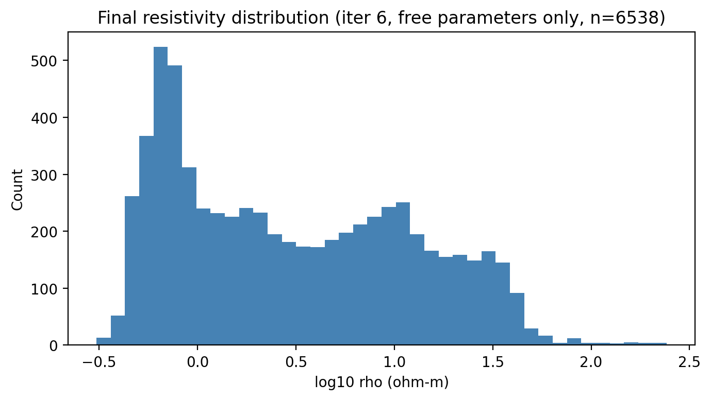
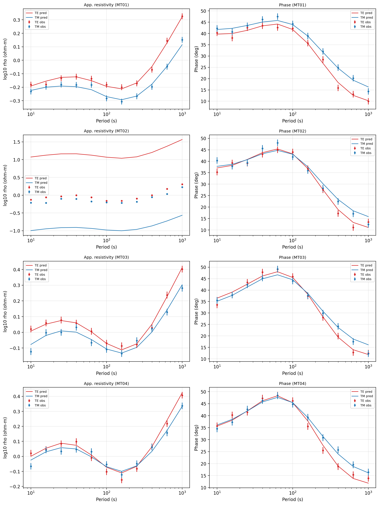
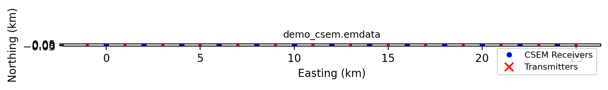
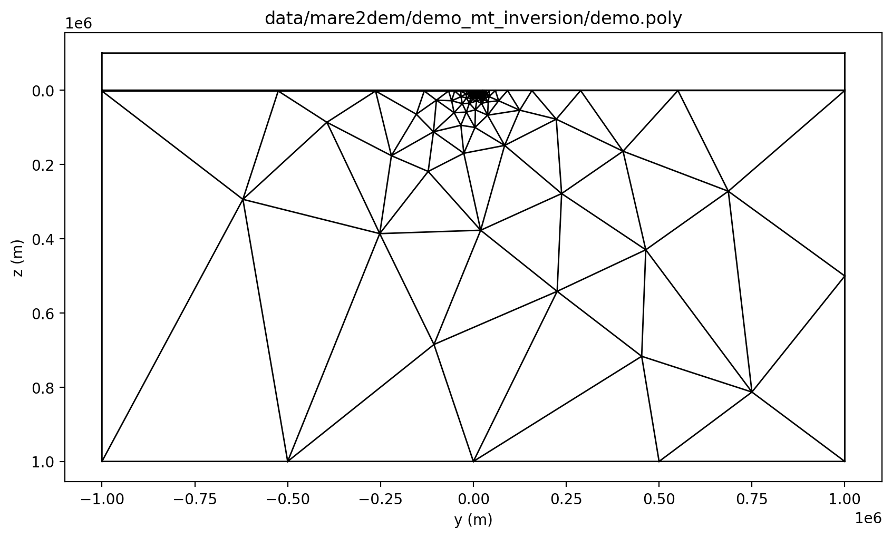

.. _models_mare2dem:

MARE2DEM
========

:mod:`pycsamt.models.mare2dem` provides the pyCSAMT integration layer for
MARE2DEM, a 2.5-D finite-element electromagnetic modelling and inversion
code. MARE2DEM supports magnetotelluric (MT) and controlled-source
electromagnetic (:term:`CSEM`) workflows, adaptive triangular meshes,
topography, and MPI execution.

pyCSAMT does not vendor the compiled MARE2DEM executable. Instead, it provides
the tools needed to manage a MARE2DEM project around that executable:

* configuration templates for source, binary, MPI, and file-name settings;
* source download/build/location helpers;
* native ``.emdata``, ``.resistivity``, ``.poly``, ``.settings``, log, group
  RMS, and data-group readers/writers;
* survey builders for MT and CSEM synthetic or prepared data files;
* ZMM-to-MARE2DEM MT data conversion;
* geometry utilities for topography, UTM conversion, profile projection,
  polygon simplification, triangle-region assignment, and area-of-interest
  estimation;
* input builders, runners, result loaders, plotting helpers, model-difference
  utilities, merge tools, and synthetic-noise helpers.

This page is a practical guide to those pieces. It focuses on how a user
should prepare, run, inspect, and archive a MARE2DEM project from pyCSAMT.

When To Use MARE2DEM
-----------------------

Use the MARE2DEM integration when a project needs a native 2.5-D finite-element
workflow rather than a pyCSAMT built-in inversion. Common reasons include:

* a survey geometry that is naturally profile-based but not adequately treated
  by a simple 1-D or 2-D approximation;
* MT, CSEM, or combined data that must be represented in MARE2DEM's native
  ``.emdata`` format;
* topography, seafloor, receiver, or transmitter geometry that should be
  explicitly represented;
* adaptive triangular discretization through Triangle/:term:`PSLG`
  ``.poly`` geometry;
* existing MARE2DEM project files that need Python-side validation,
  conversion, plotting, or result loading;
* an HPC workflow where native input files are prepared locally, run on a
  cluster, and loaded back into pyCSAMT afterward.

MARE2DEM is not the fastest path for every inversion. If you only need a
high-level backend-neutral 2-D run, start with :doc:`choosing_backend`.
MARE2DEM is most valuable when the native file set and engine-specific control
are part of the scientific workflow.

Package Map
-------------

The public MARE2DEM package surface is intentionally broad. It includes low
level file readers, high level lifecycle helpers, and project utilities.

.. list-table::
   :header-rows: 1
   :widths: 26 34 40

   * - Area
     - Main objects
     - Purpose
   * - Configuration
     - ``Mare2DEMConfig``
     - Stores source location, compiler overrides, binary/MPI settings,
       inversion controls, initial model value, and default file names.
   * - Source and binary
     - ``SourceManager``
     - Locates, downloads, builds, and reports status for the external
       MARE2DEM source tree and executable.
   * - Build inputs
     - ``InputBuilder``
     - Writes a MARE2DEM run directory from an existing ``.emdata`` file, an
       ``EMDataFile`` object, or MT/CSEM survey configuration objects.
   * - Execute
     - ``Mare2DEMRunner``
     - Builds the command line, handles MPI options, runs the executable from
       the working directory, and can return an ``InversionResult``.
   * - Load results
     - ``InversionResult``, ``Mare2DEMLog``, ``GroupRMSLog``
     - Scans output directories, parses iteration logs, exposes RMS history,
       convergence state, final model, observed data, and response data.
   * - Native I/O
     - ``read_emdata``, ``write_emdata``, ``read_resistivity``,
       ``write_resistivity``, ``read_poly``, ``write_poly``,
       ``write_settings``
     - Reads and writes MARE2DEM-native project files.
   * - Data management
     - ``MTSurveyConfig``, ``CSEMSurveyConfig``, ``make_data_file``,
       ``read_zmm``, ``make_mt_data_from_zmm``, ``merge_data_files``
     - Builds, converts, and merges MT/CSEM data products.
   * - Geometry
     - ``parse_topo``, ``lonlat_to_utm``, ``project_onto_line``,
       ``get_line_orientation``, ``simplify_poly``, ``get_triangle_regions``
     - Handles topography, survey projection, coordinate conversion, polygon
       cleanup, and triangle-region utilities.
   * - QC and interpretation
     - ``NoiseConfig``, ``add_synthetic_noise``, ``diff_resistivity``,
       ``PlotConvergence``, ``PlotSurveyLayout``, ``plot_poly``
     - Supports synthetic tests, model comparison, convergence review, survey
       layout QC, and mesh/geometry inspection.

Configuration
---------------

``Mare2DEMConfig`` is the source-of-truth object for MARE2DEM runs. It is a
plain dataclass, so it can be created in Python, written as a
:term:`configuration file` template, edited outside Python, and loaded again.

.. code-block:: pycon
   :linenos:

   >>> from pycsamt.models.mare2dem import Mare2DEMConfig

   >>> cfg = Mare2DEMConfig(
   ...     source_dir="/opt/mare2dem/source",
   ...     binary="MARE2DEM",
   ...     use_mpi=True,
   ...     n_procs=16,
   ...     mpi_command="mpirun",
   ...     max_iterations=120,
   ...     target_rms=1.0,
   ...     initial_rho=10.0,
   ...     data_file="line12.emdata",
   ...     resistivity_file="line12.resistivity",
   ...     settings_file="line12.settings",
   ... )

   >>> cfg.to_template("runs/line12_mare2dem_v01/mare2dem.yml")
   >>> loaded = Mare2DEMConfig.from_file("runs/line12_mare2dem_v01/mare2dem.yml")
   >>> print(loaded.binary, loaded.max_iterations, loaded.resistivity_stem)
   MARE2DEM 120 line12

The configuration groups five concerns.

.. list-table::
   :header-rows: 1
   :widths: 24 34 42

   * - Concern
     - Fields
     - Meaning
   * - Source management
     - ``source_dir``, ``fc_compiler``, ``cc_compiler``
     - Where the Fortran source lives and which compiler commands should be
       used when building.
   * - Binary and MPI
     - ``binary``, ``use_mpi``, ``n_procs``, ``mpi_command``
     - How pyCSAMT should locate and launch the executable.
   * - Inversion control
     - ``max_iterations``, ``target_rms``
     - Iteration limit and normalized RMS target written into the native
       model/settings files.
   * - Initial model
     - ``initial_rho``
     - Starting homogeneous half-space resistivity, in ohm metres.
   * - File names
     - ``data_file``, ``resistivity_file``, ``settings_file``
     - Native file names used by builders and runners.

The ``resistivity_stem`` property returns the stem of
``resistivity_file``. MARE2DEM receives this stem on the command line and then
derives related filenames from it. For example, ``line12.resistivity`` is
passed as ``line12``, which is exactly what ``loaded.resistivity_stem``
printed above.

Source And Binary Management
-------------------------------

``SourceManager`` handles the external source tree. It resolves a source
directory in this order:

1. the explicit ``source_dir`` argument passed to ``SourceManager``;
2. ``Mare2DEMConfig.source_dir``;
3. the ``PYCSAMT_MARE2DEM_SOURCE`` environment variable;
4. the package ``_source/`` directory when it is writable, which is common in
   editable development installs;
5. a platform user-data directory.

Unlike :doc:`occam2d`, pyCSAMT does not bundle MARE2DEM's Fortran source, so
step 4 never actually resolves anything for MARE2DEM -- there is no compiled
binary to discover on a typical machine, and none is bundled for this
documentation build either. Use ``status`` first, before trying to download
or build anything:

.. code-block:: pycon
   :linenos:

   >>> from pycsamt.models.mare2dem import Mare2DEMConfig, SourceManager

   >>> cfg = Mare2DEMConfig(source_dir="/opt/mare2dem/source")
   >>> source = SourceManager(config=cfg, verbose=1)

   >>> source.print_status()
   MARE2DEM SourceManager status
   ────────────────────────────────────────
     source_dir  : /opt/mare2dem/source
     downloaded  : False
     built       : False
     binary      : (not found)
     FC compiler : mpifort
     CC compiler : mpicc
     MKLROOT     : (not found — required)

When source code is not present, ``download`` can use Git or a source archive.
When source code is present but the binary is missing, ``build`` compiles the
external code.

.. code-block:: pycon
   :linenos:

   >>> from pycsamt.models.mare2dem import SourceManager

   >>> source = SourceManager(source_dir="/opt/mare2dem/source", verbose=1)

   >>> # Network access and compiler availability are environment-dependent.
   >>> # source.download(method="auto")
   >>> # source.build(clean_first=False)

Compilation is system-dependent. In many environments MARE2DEM requires MPI
Fortran/C tooling and Intel MKL/ScaLAPACK/BLACS support -- the missing
``MKLROOT`` in the status above is exactly that requirement showing up before
a build is even attempted. On Windows, build from WSL or another Unix-like
environment rather than a native Windows shell.

Binary Resolution
--------------------

``Mare2DEMRunner`` resolves the executable through:

1. ``Mare2DEMConfig.binary`` on ``PATH``;
2. ``<source_dir>/<binary>``;
3. the platform user-data binary location.

Use ``runner.command`` as a dry-run check before launching an inversion.

.. code-block:: pycon
   :linenos:

   >>> from pycsamt.models.mare2dem import Mare2DEMConfig, Mare2DEMRunner

   >>> cfg = Mare2DEMConfig(
   ...     binary="MARE2DEM",
   ...     use_mpi=True,
   ...     n_procs=8,
   ...     mpi_command="mpirun",
   ...     resistivity_file="line12.resistivity",
   ... )

   >>> runner = Mare2DEMRunner("runs/line12_mare2dem_v01/native", config=cfg)
   >>> print(runner.command("line12"))
   mpirun -np 8 MARE2DEM line12

For cluster workflows, put the command string and the loaded module list in
the run :term:`provenance manifest`. The same native directory can then be
executed by a job scheduler and loaded later with ``InversionResult``.

Native Files
--------------

MARE2DEM projects revolve around :term:`native file`\ s. pyCSAMT treats these
as first-class scientific records, not temporary build artifacts.

.. list-table::
   :header-rows: 1
   :widths: 22 28 50

   * - File
     - Reader/writer
     - Role
   * - ``.emdata``
     - ``read_emdata``, ``write_emdata``
     - Observed or synthetic MT/CSEM/DC data, receiver/transmitter metadata,
       UTM origin, frequencies, and data rows.
   * - ``*_MARE2DEM.emdata`` or ``.resp``
     - ``read_emdata``
     - Predicted response data produced by the engine.
   * - ``.resistivity``
     - ``read_resistivity``, ``write_resistivity``
     - Resistivity parameters, free/fixed flags, bounds, prejudice values, and
       references to data, settings, and polygon files.
   * - ``.poly``
     - ``read_poly``, ``write_poly``
     - Triangle :term:`PSLG` geometry: nodes, segments, holes, and regions.
   * - ``.settings``
     - ``write_settings``
     - Parallel decomposition and inversion settings.
   * - ``.emdata_group``
     - ``read_data_group``, ``write_data_group``
     - Group definitions used for grouped RMS diagnostics.
   * - Group RMS logs
     - ``read_group_rms_log``
     - Per-group RMS evolution, useful for diagnosing which data families are
       controlling the inversion.
   * - Iteration logs
     - ``Mare2DEMLog``
     - Iteration number, RMS misfit, roughness, Lagrange multiplier, and
       convergence state.

The validation helpers classify common MARE2DEM files by filename pattern
alone -- unlike the Occam2D and ModEM validators, they do not need the file
to exist or read its contents, so they also work as a naming-convention
check before a file has been written:

.. code-block:: pycon
   :linenos:

   >>> from pycsamt.models.mare2dem import detect_file_type, is_response_file

   >>> print(detect_file_type("line12.emdata"))
   Mare2DEMFileType.EMDATA
   >>> print(detect_file_type("line12.resistivity"))
   Mare2DEMFileType.RESISTIVITY
   >>> print(is_response_file("line12_MARE2DEM.emdata"))
   True

Build A Run Directory
------------------------

``InputBuilder`` writes a minimal MARE2DEM input set. It can start from an
existing ``.emdata`` file, an in-memory ``EMDataFile``, or MT/CSEM survey
configuration objects. This example starts from a real bundled synthetic MT
line:

.. code-block:: pycon
   :linenos:

   >>> from pycsamt.models.mare2dem import InputBuilder, Mare2DEMConfig

   >>> cfg = Mare2DEMConfig(
   ...     initial_rho=10.0,
   ...     max_iterations=120,
   ...     target_rms=1.0,
   ...     data_file="line12.emdata",
   ...     resistivity_file="line12.resistivity",
   ...     settings_file="line12.settings",
   ... )

   >>> builder = InputBuilder(config=cfg, verbose=1)
   >>> files = builder.build(
   ...     "data/mare2dem/demo_mt_inversion/demo_mt_synth.emdata",
   ...     workdir="runs/line12_mare2dem_v01/native",
   ... )

   >>> print(files["data"].name, files["model"].name, files["settings"].name)
   line12.emdata line12.resistivity line12.settings

The builder writes:

* the data file, copied or generated into the run directory;
* a homogeneous starting ``.resistivity`` file based on ``initial_rho``;
* a ``.settings`` file.

For production inversions, the generated starting model is often only the
first step. Review the ``.resistivity`` and ``.poly`` inputs before launching
the external code.

Create MT Data
----------------

``MTSurveyConfig`` and ``make_data_file`` are useful for synthetic tests or
for constructing simple MT-native files from survey arrays.

.. code-block:: pycon
   :linenos:

   >>> import numpy as np

   >>> from pycsamt.models.mare2dem import MTSurveyConfig, make_data_file

   >>> mt = MTSurveyConfig(
   ...     frequencies=np.logspace(-3, 3, 25),
   ...     rx_y=np.linspace(-6000.0, 6000.0, 31),
   ...     rx_type="land",
   ...     lTE=True,
   ...     lTM=True,
   ...     lTipper=False,
   ... )

   >>> em = make_data_file(
   ...     "runs/line12_mare2dem_v01/native/line12_mt.emdata",
   ...     topo=0.0,
   ...     mt=mt,
   ... )

   >>> print(em.n_data)
   3100

For real MT processing, pyCSAMT also includes ZMM readers and converters
(``read_zmm``, ``make_mt_data_from_zmm``). No ZMM sample ships with pyCSAMT,
so they are not exercised with captured output here -- ``read_zmm(path)``
returns a ``ZMMStation`` with ``.name``, ``.latitude``/``.longitude``, and
impedance/tipper arrays, and ``make_mt_data_from_zmm`` accepts a list of such
files plus error-floor and topography options, mirroring ``make_data_file``.

Check the generated data rows carefully. Conversion utilities help with file
mechanics, but the interpreter still owns station selection, component
choice, frequency band selection, and error-floor policy.

Create CSEM Data
-------------------

``CSEMSurveyConfig`` builds a controlled-source survey with transmitter and
receiver layout parameters.

.. code-block:: pycon
   :linenos:

   >>> import numpy as np

   >>> from pycsamt.models.mare2dem import CSEMSurveyConfig, make_data_file

   >>> csem = CSEMSurveyConfig(
   ...     frequencies=np.array([0.25, 0.5, 1.0, 2.0]),
   ...     rx_y=np.linspace(-4000.0, 4000.0, 17),
   ...     tx_y=np.array([-2500.0, 0.0, 2500.0]),
   ...     rx_type="marine",
   ...     tx_type="edipole",
   ...     lEx=True,
   ...     lEy=True,
   ...     lBx=True,
   ...     lBy=True,
   ... )

   >>> em = make_data_file(
   ...     "runs/csem_line_v01/native/csem_line.emdata",
   ...     topo=-1000.0,
   ...     csem=csem,
   ... )

   >>> print(em.n_data)
   1632

``rx_type`` and ``tx_type`` look like the same kind of setting but are not:
``rx_type`` is a placement mode (``"land"``, ``"marine"``, ``"amphibious"``),
while ``tx_type`` is a dipole physics type and only understands
``"edipole"`` or ``"bdipole"``. Passing a placement word such as
``"marine"`` as ``tx_type`` does not raise an error -- it is silently
written to the ``.emdata`` file's Type column as the literal string
``"marine"``, which downstream pyCSAMT code that reads that column back
(for example the merge tools in `Merge And Noise Utilities`_) treats as
``"bdipole"``, since only an exact ``"edipole"`` match counts otherwise. A
towed marine CSEM transmitter is normally an electric dipole, so the
correct value here is ``tx_type="edipole"``, not ``tx_type="marine"``.

For CSEM projects, geometry QC is essential. Plot receiver/transmitter
locations, confirm signs and offsets, and record whether coordinates are
local profile coordinates, UTM coordinates, or a transformed system -- see
`Plotting And QC`_ below for ``PlotSurveyLayout``.

Merge And Noise Utilities
----------------------------

MARE2DEM workflows often require combining data families or creating
synthetic observations from a forward response. pyCSAMT provides utilities
for both. Merging a real bundled MT line with a real bundled CSEM line
demonstrates a genuine joint-data use case:

.. code-block:: pycon
   :linenos:

   >>> from pycsamt.models.mare2dem import merge_data_files

   >>> merged = merge_data_files(
   ...     [
   ...         "data/mare2dem/demo_mt_inversion/demo_mt_synth.emdata",
   ...         "data/mare2dem/demo_csem/demo_csem.emdata",
   ...     ],
   ...     "runs/joint_v01/native/joint.emdata",
   ... )

   >>> print(merged.n_data)
   852

Synthetic noise is useful for controlled tests and algorithm validation.
Setting ``seed`` makes the result reproducible -- record it in the run
:term:`provenance manifest` alongside the noise parameters:

.. code-block:: pycon
   :linenos:

   >>> from pycsamt.models.mare2dem import (
   ...     NoiseConfig,
   ...     add_synthetic_noise,
   ...     read_emdata,
   ...     write_emdata,
   ... )

   >>> response = read_emdata("data/mare2dem/demo_mt_inversion/demo.6.resp")
   >>> noise = NoiseConfig(
   ...     mt_rel_noise=0.05,
   ...     mt_abs_noise_tipper=0.01,
   ... )

   >>> synthetic = add_synthetic_noise(response, noise, seed=42)
   >>> write_emdata(synthetic, "runs/synthetic_v01/native/synthetic.emdata")
   >>> print(synthetic.n_data, response.n_data)
   572 572

Do not treat noisy synthetic data as field data. Keep synthetic sources,
random seeds, and noise parameters in the provenance notes.

Geometry And Topography
--------------------------

The MARE2DEM integration includes geometry helpers because geometry mistakes
are one of the easiest ways to produce convincing but wrong models.

.. list-table::
   :header-rows: 1
   :widths: 32 68

   * - Helper
     - Use
   * - ``parse_topo``, ``topo_depth``, ``topo_slope``
     - Read and interpolate topography/seafloor profiles and compute local
       slopes.
   * - ``lonlat_to_utm``, ``utm_to_lonlat``
     - Convert coordinates with ``pyproj`` when available and a pure-Python
       WGS-84 fallback otherwise.
   * - ``get_line_orientation``, ``project_onto_line``
     - Estimate profile orientation and project stations onto a survey line.
   * - ``dp_simplify``, ``simplify_poly``
     - Simplify polylines and remove collinear polygon nodes.
   * - ``get_intersections``, ``do_rects_overlap``
     - Find segment intersections with bounding-box pre-filtering.
   * - ``triangle_centroids``, ``triangle_areas``, ``get_centroids``
     - Compute area-weighted centroids and triangle geometry summaries.
   * - ``estimate_area_of_interest``
     - Estimate a practical modelling area from survey geometry.
   * - ``get_triangle_regions``
     - Assign finite-element regions for Triangle-based meshes.

Example profile projection:

.. code-block:: pycon
   :linenos:

   >>> import numpy as np

   >>> from pycsamt.models.mare2dem import (
   ...     get_line_orientation,
   ...     lonlat_to_utm,
   ...     project_onto_line,
   ... )

   >>> lon = np.array([11.501, 11.507, 11.514])
   >>> lat = np.array([3.842, 3.845, 3.849])

   >>> east, north, zone, south_hemi = lonlat_to_utm(lon, lat)
   >>> azimuth = get_line_orientation(north, east)
   >>> cross_profile, along_profile = project_onto_line(
   ...     north,
   ...     east,
   ...     north[0],
   ...     east[0],
   ...     azimuth,
   ... )

   >>> print(f"zone {zone}, southern hemisphere: {south_hemi}")
   zone 32, southern hemisphere: False
   >>> print(along_profile)
   [   0.          744.48607367 1639.22643014]

``lonlat_to_utm`` returns ``south_hemi`` as a plain boolean, not the ``"N"``/
``"S"`` letter some other UTM tools use -- ``False`` here means the three
points (all near latitude 3.8°) are in the northern hemisphere, matching
their positive latitude.

For production documentation, include a small figure or table showing
original coordinates, projected distances, and topography values. That
record is often as important as the inversion result.

Grid And Mesh Utilities
--------------------------

The package includes helpers for constructing MARE2DEM geometry and models
from gridded resistivity information. ``grid_to_mare2dem`` takes the grid as
three 2-D arrays shaped like a ``numpy.meshgrid`` output -- ``Y`` and ``Z``
are coordinate grids, not axis vectors, and ``Rho`` is the cell-centred
resistivity on that same grid:

.. code-block:: pycon
   :linenos:

   >>> import numpy as np

   >>> from pycsamt.models.mare2dem import grid_to_mare2dem

   >>> y_c = np.linspace(-2000.0, 2000.0, 20)
   >>> z_c = np.linspace(50.0, 1000.0, 12)
   >>> Y, Z = np.meshgrid(y_c, z_c)
   >>> Rho = np.full((12, 20), 100.0)
   >>> Rho[3:6, 8:12] = 10.0  # a shallow conductive block

   >>> files = grid_to_mare2dem(
   ...     Y, Z, Rho,
   ...     out_dir="runs/grid_model_v01/native",
   ...     model_name="line12",
   ...     data_file="line12.emdata",
   ... )

   >>> print(files["poly"].name, files["resistivity"].name)
   line12.poly line12.0.resistivity

Always inspect the written ``.poly`` and ``.resistivity`` files before using
them in an inversion -- ``plot_poly`` (see `Plotting And QC`_) is the fastest
way to confirm the padding and region layout came out as expected.

Run MARE2DEM
--------------

Once native files are prepared and the executable is available, use
``Mare2DEMRunner`` to launch the run.

.. code-block:: pycon
   :linenos:

   >>> from pycsamt.models.mare2dem import Mare2DEMConfig, Mare2DEMRunner

   >>> cfg = Mare2DEMConfig.from_file("runs/line12_mare2dem_v01/mare2dem.yml")
   >>> runner = Mare2DEMRunner("runs/line12_mare2dem_v01/native", config=cfg, verbose=1)

   >>> # Check the command before running it.
   >>> print(runner.command(cfg.resistivity_stem))
   mpirun -np 16 MARE2DEM line12

   >>> # Run locally only once the binary above actually resolves.
   >>> try:
   ...     runner.run(cfg.resistivity_stem, timeout=5)
   ... except FileNotFoundError as exc:
   ...     print(exc)
   MARE2DEM binary 'MARE2DEM' not found on PATH or in the source directory. Build it first:  SourceManager().download(); SourceManager().build()

There is no pre-compiled MARE2DEM binary bundled with pyCSAMT -- like
:doc:`occam2d` and :doc:`modem`, it must be built locally, and this
documentation build has no binary either. ``run`` returns an
``InversionResult`` by default once a real run finishes. Set
``load_result=False`` if you only want process execution and will load
results later.

.. code-block:: pycon
   :linenos:

   >>> # result = runner.run(
   >>> #     cfg.resistivity_stem,
   >>> #     use_mpi=True,
   >>> #     n_procs=16,
   >>> #     extra_args=None,
   >>> #     timeout=None,
   >>> #     load_result=True,
   >>> # )

For long inversions, prefer scheduler-managed execution. Build the native
directory with pyCSAMT, submit the command on the cluster, then use
``InversionResult`` after the files are complete.

Inspect Results
------------------

``InversionResult`` scans a run directory for recognized output files and
exposes the main products.

None of the sections above actually launched MARE2DEM -- there is no
compiled binary in a documentation-build environment. From here on, the
examples load a genuinely finished run instead: the bundled
``data/mare2dem/demo_mt_inversion`` sample, a real converged 6-iteration MT
inversion.

.. code-block:: pycon
   :linenos:

   >>> from pycsamt.models.mare2dem import InversionResult

   >>> result = InversionResult("data/mare2dem/demo_mt_inversion")

   >>> print(result.converged, result.final_rms, result.n_iterations)
   True 1.002 6

``result.model`` is populated from whichever ``.resistivity`` file the
directory scan happens to encounter first -- it is **not** guaranteed to be
the highest-numbered iteration. This sample directory keeps both
``demo.0.resistivity`` (the starting half-space) and ``demo.6.resistivity``
(the converged final model), and because ``"demo.0"`` sorts before
``"demo.6"``, ``result.model`` here silently resolves to the *starting*
model:

.. code-block:: pycon
   :linenos:

   >>> print(result.model.resistivity_file, result.model.iteration)
   demo.0.resistivity 0

Nothing raises or warns about this. When a directory holds more than one
resistivity snapshot, load the specific file you actually want with
``read_resistivity`` instead of trusting ``result.model``:

.. code-block:: pycon
   :linenos:

   >>> from pycsamt.models.mare2dem import read_resistivity

   >>> model_final = read_resistivity(
   ...     "data/mare2dem/demo_mt_inversion/demo.6.resistivity"
   ... )
   >>> print(model_final.resistivity_file, model_final.num_regions)
   demo.6.resistivity 6540

The log parser exposes the RMS, roughness, and Lagrange-multiplier
(:math:`\log_{10}\mu`) history per iteration.

.. code-block:: pycon
   :linenos:

   >>> from pycsamt.models.mare2dem import Mare2DEMLog

   >>> log = Mare2DEMLog("data/mare2dem/demo_mt_inversion/demo.logfile")

   >>> print(log.final_rms, log.converged)
   1.002 True
   >>> print(log.rms_history())
   [6.875, 3.336, 1.719, 1.074, 1.001, 1.002]
   >>> print([round(rec.roughness, 3) for rec in log.iterations])
   [1.407, 7.278, 20.39, 36.76, 39.39, 37.44]

``Mare2DEMLog`` has no ``roughness_history()`` method -- roughness (and
``rms``, ``lambda_``) live on each entry of ``log.iterations``, a list of
``IterationRecord`` objects, one per completed iteration. The trade-off here
is exactly the one the :term:`objective function` implies: as RMS drops by
more than 6x (6.875 to 1.001) over the first five iterations, roughness
climbs nearly 28-fold (1.41 to a peak of 39.4) -- the smoothest model that
still fits the data is far less smooth than the uniform starting
half-space, and roughness keeps climbing even in iteration 6, where RMS has
already flattened.

Group RMS logs should be reviewed when the inversion combines data types,
components, stations, or source groups.

.. code-block:: pycon
   :linenos:

   >>> from pycsamt.models.mare2dem import read_group_rms_log

   >>> group_log = read_group_rms_log(
   ...     "data/mare2dem/demo_csem_mt/demo.group_rms.log"
   ... )
   >>> print(group_log.headers)
   ['Iteration', 'Total RMS', 'CSEM', 'MT']
   >>> print(group_log.rms_log[-1])
   [20.     0.998  0.912  1.038]

A low total RMS can hide a poor fit to one group. Inspect total RMS, group
RMS, response residuals, and model roughness together -- here the joint
run's total RMS (0.998) is a blend that looks slightly better than either
the CSEM group (0.912) or the MT group (1.038) taken alone.

Plotting And QC
------------------

The plotting helpers are designed for quality control and interpretation.
All figures below use the same converged ``demo_mt_inversion`` result loaded
above, plus the bundled CSEM sample for survey-layout QC.

.. list-table::
   :header-rows: 1
   :widths: 32 68

   * - Plot helper
     - Use
   * - ``PlotConvergence``
     - RMS and convergence history from logs.
   * - ``PlotSurveyLayout``
     - Receiver/transmitter layout in map/profile coordinates.
   * - ``PlotRxParams``
     - Receiver geometry and parameter checks.
   * - ``PlotTxParams``
     - Transmitter geometry and parameter checks.
   * - ``plot_poly``
     - :term:`PSLG`/``.poly`` geometry inspection.
   * - ``PlotModel``
     - Model-section visualization support.
   * - ``PlotResponse``
     - Observed/predicted response inspection.

.. code-block:: pycon
   :linenos:

   >>> from pycsamt.models.mare2dem import Mare2DEMLog, PlotConvergence

   >>> log = Mare2DEMLog("data/mare2dem/demo_mt_inversion/demo.logfile")
   >>> fig = PlotConvergence(log).plot()
   >>> fig.savefig("runs/line12_mare2dem_v01/figures/convergence.png", dpi=200)

.. figure:: ../../images/user_guide/models/mare2dem_convergence.png
   :alt: MARE2DEM RMS misfit dropping from 6.9 to 1.0 over 6 iterations.
   :align: center
   :width: 70%

   A clean, fast convergence -- RMS falls from 6.9 to 1.0 in just 6
   iterations and stays there. This is a useful contrast with
   :doc:`modem`'s bundled sample, which stalls at RMS 3.06 after 74
   iterations: convergence behaviour varies enormously between real runs,
   which is exactly why it needs checking every time rather than assumed.

``PlotModel`` draws a true triangulated section when Triangle's
``.node``/``.ele`` mesh files are present next to the ``.resistivity`` file.
This bundled sample does not include them (they are regenerated by Triangle
during a run, not archived here), so ``PlotModel`` falls back to a plain
histogram of every region's resistivity -- and that fallback has two rough
edges worth knowing about: it labels the axis ``"log10 rho"`` while actually
plotting linear values, and it does not separate :term:`free parameter`
regions from fixed ones such as the boundary padding cell held at
:math:`10^{12}\,\Omega\cdot\mathrm{m}`. Filtering to free parameters and
taking ``log10`` explicitly gives a far more useful view of the same file:

.. code-block:: pycon
   :linenos:

   >>> import numpy as np

   >>> from pycsamt.models.mare2dem import read_resistivity

   >>> model_final = read_resistivity(
   ...     "data/mare2dem/demo_mt_inversion/demo.6.resistivity"
   ... )
   >>> rho = np.asarray(model_final.resistivity)[:, 0]
   >>> free = np.asarray(model_final.free_parameter).ravel()
   >>> free_rho = rho[free != 0]  # drop air/ocean/boundary regions
   >>> print(free_rho.size, round(free_rho.min(), 3), round(free_rho.max(), 3))
   6538 0.307 242.08

   The converged model's free-parameter resistivity is clearly bimodal: one
   mode around 0.6-1 ohm-m and a second, broader mode around 8-15 ohm-m,
   with a long tail out to 242 ohm-m. Neither mode is visible at all in the
   library's default (unfiltered, linear-axis) fallback histogram, where the
   single :math:`10^{12}` boundary region compresses everything else into
   one bin.

.. code-block:: pycon
   :linenos:

   >>> from pycsamt.models.mare2dem import PlotResponse

   >>> fig = PlotResponse(result).plot()
   >>> fig.savefig("runs/line12_mare2dem_v01/figures/response.png", dpi=200)

   Station-level response fits for the first four MT receivers. MT01, MT03,
   and MT04 track the observed apparent resistivity and phase closely, but
   MT02's predicted TE and TM curves sit roughly one log10 unit away from
   its own observations -- a ten-fold resistivity mismatch at a single
   station, invisible in the overall RMS of 1.002. This is precisely the
   "low total RMS can hide a poor fit to one group" caution from `Inspect
   Results`_, playing out at the station level instead of the group level.

.. code-block:: pycon
   :linenos:

   >>> from pathlib import Path

   >>> from pycsamt.models.mare2dem import PlotSurveyLayout, read_emdata

   >>> em = read_emdata("data/mare2dem/demo_csem/demo_csem.emdata")
   >>> fig = PlotSurveyLayout(em).plot()
   >>> ax = fig.axes[0]
   >>> ax.set_title(Path(em.path).name, fontsize=9)  # default title is the full path
   >>> fig.savefig("runs/csem_line_v01/figures/survey_layout.png", dpi=200)

``PlotSurveyLayout`` titles the figure with ``str(em.path)`` -- the full
path used to read the file, absolute if that is what was passed in. Resetting
the title to just the filename keeps the figure shareable without leaking a
local directory layout.

   Receivers and transmitters for the bundled CSEM demo, interleaved along
   one straight ~26 km line. The equal-aspect map view is correct, not a
   rendering glitch -- a genuinely linear towed/fixed CSEM deployment looks
   exactly this flat when Easting and Northing share a scale.

.. code-block:: pycon
   :linenos:

   >>> from pycsamt.models.mare2dem import plot_poly

   >>> ax = plot_poly(
   ...     "data/mare2dem/demo_mt_inversion/demo.poly",
   ...     savefig="runs/line12_mare2dem_v01/figures/poly.png",
   ...     dpi=200,
   ... )

   The coarse boundary :term:`PSLG` behind the triangulated model -- padding
   triangles reaching out to +-1000 km and 1000 km depth, with a dense
   cluster of small seed regions near :math:`y=0` where the actual survey
   sits. Triangle refines this outline into the fine mesh MARE2DEM solves
   on; ``plot_poly`` shows the outline pyCSAMT wrote, before that
   refinement.

Before presenting a final model, review at least:

* station and transmitter geometry;
* topography or bathymetry representation;
* mesh or polygon geometry;
* RMS history and convergence status;
* group RMS history;
* observed/predicted response fits;
* model smoothness, bounds, and fixed/free parameter behavior.

Model Comparison
-------------------

``diff_resistivity`` compares two ``.resistivity`` files, typically to
inspect how a model changed between iterations, parameter choices, or
preprocessing decisions. Comparing the bundled sample's starting and final
models quantifies the same change `Inspect Results`_ described qualitatively:

.. code-block:: pycon
   :linenos:

   >>> from pycsamt.models.mare2dem import diff_resistivity

   >>> diff = diff_resistivity(
   ...     "data/mare2dem/demo_mt_inversion/demo.0.resistivity",
   ...     "data/mare2dem/demo_mt_inversion/demo.6.resistivity",
   ...     "runs/comparison_v01/demo_iter6_minus_iter0.resistivity",
   ... )
   >>> print(diff)
   ResistivityFile(num_regions=6540, anisotropy='isotropic', target_misfit=1.0)

Use model differences as diagnostics, not as standalone geological evidence.
Pair them with data-fit changes and model regularization changes.

Recommended Run Layout
-------------------------

Keep source/build material separate from scientific run directories.

.. code-block:: text
   :linenos:

   external/
     mare2dem/
       source/
       build_notes.md

   runs/
     survey_alpha/
       line12_mare2dem_v01/
         mare2dem.yml
         provenance.yml
         native/
           line12.emdata
           line12.poly
           line12.resistivity
           line12.settings
           demo.logfile
           line12_MARE2DEM.emdata
           line12.group_rms.log
         qc/
           survey_layout.png
           convergence.png
           response.png
         exports/
           line12_snapshot.zip

Use versioned run names. MARE2DEM uses simple native filenames, so running
several experiments in one directory can easily mix stale outputs with new
inputs -- and, as `Inspect Results`_ showed, can leave ``InversionResult``
loading the wrong iteration's model without any error.

Pre-Run Checklist
--------------------

Before launch:

* load ``Mare2DEMConfig`` from the edited template;
* confirm source directory and executable resolution;
* check ``runner.command`` and record it;
* confirm MPI process count and scheduler settings;
* verify that ``.emdata``, ``.resistivity``, ``.settings``, and ``.poly`` files
  exist when required;
* inspect station, transmitter, and profile coordinates;
* inspect topography or seafloor representation;
* confirm frequency band, components, and error floors;
* confirm ``tx_type`` is a real dipole type (``"edipole"``/``"bdipole"``),
  not a placement word borrowed from ``rx_type``;
* move old output files out of the run directory;
* record pyCSAMT version, MARE2DEM source/binary path, and compiler/MPI
  context.

Post-Run Checklist
----------------------

After completion:

* read the main log before plotting;
* check ``result.converged``, ``result.final_rms``, and iteration count;
* if more than one ``.resistivity`` snapshot is in the directory, load the
  intended one explicitly with ``read_resistivity`` rather than trusting
  ``result.model``;
* review RMS and roughness histories per iteration, from ``log.iterations``;
* review group RMS where groups are used;
* confirm response-file timestamps match the intended run;
* compare observed and predicted responses -- per station, not only in
  aggregate;
* inspect the final model against bounds and fixed/free parameter flags;
* archive native input and output files with the configuration and provenance.

Common Mistakes
------------------

Using a stale response file
    If the binary fails, an old ``*_MARE2DEM.emdata`` file can remain in the
    directory. Check timestamps and logs before loading results.

Passing the wrong stem
    MARE2DEM receives the resistivity stem, not usually the full project path.
    ``Mare2DEMRunner`` normalizes the stem, but users should still keep
    filenames consistent.

Mixing coordinate systems
    Longitude/latitude, UTM, and local profile distance are different records.
    State which system is used in every generated native file.

Treating total RMS as enough
    Total RMS can hide poor fits to one component, station range, source, or
    data family -- station MT02 in `Plotting And QC`_ fit ten times worse
    than the model's overall RMS suggested. Review group RMS and response
    residuals per station.

Ignoring build provenance
    MARE2DEM behavior can depend on source revision, compiler, MKL/ScaLAPACK,
    MPI runtime, and cluster environment. Record them.

Trusting ``result.model`` in a multi-iteration directory
    ``InversionResult`` keeps the first ``.resistivity`` file its directory
    scan happens to encounter, not the highest-numbered one. When a
    directory holds more than one snapshot -- common right after a run, or
    in an archived comparison folder -- load the specific file with
    ``read_resistivity`` instead.

Confusing ``tx_type`` with ``rx_type``
    ``rx_type`` describes placement (``"land"``, ``"marine"``,
    ``"amphibious"``); ``tx_type`` describes dipole physics (``"edipole"``,
    ``"bdipole"``) and silently falls back to ``"bdipole"`` for anything
    else it is given, with no error.

Next Steps
------------

* :doc:`configuration_and_io` for source-of-truth configuration and archive
  practice.
* :doc:`choosing_backend` for deciding when MARE2DEM is the right integration.
* :ref:`inversion_concepts` for regularized inversion and misfit concepts.
* :doc:`../../api/models` for generated API reference pages.
