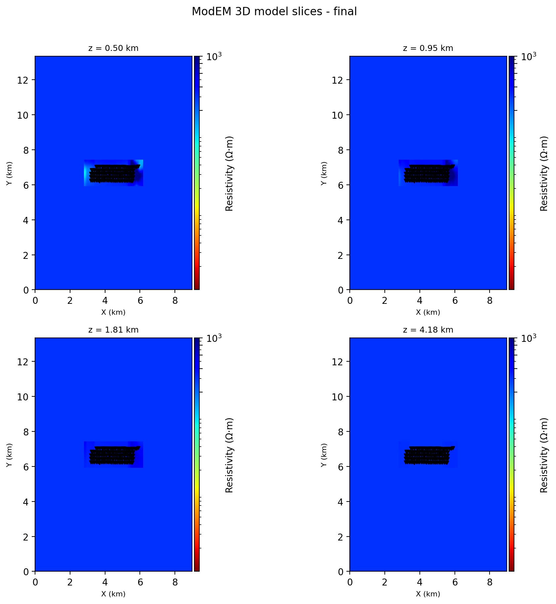
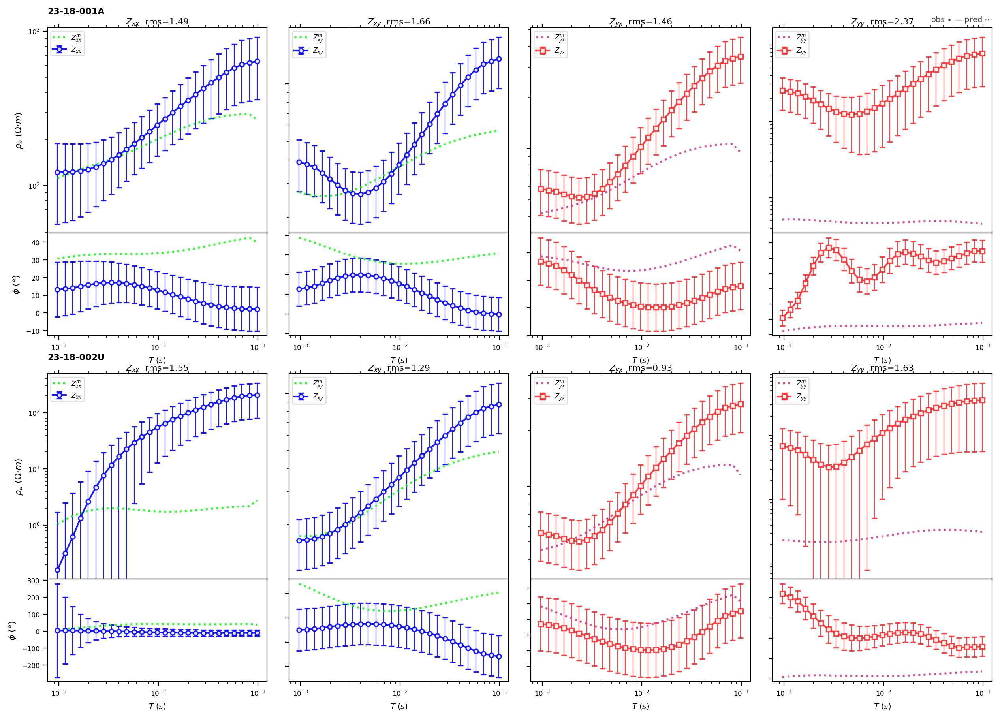
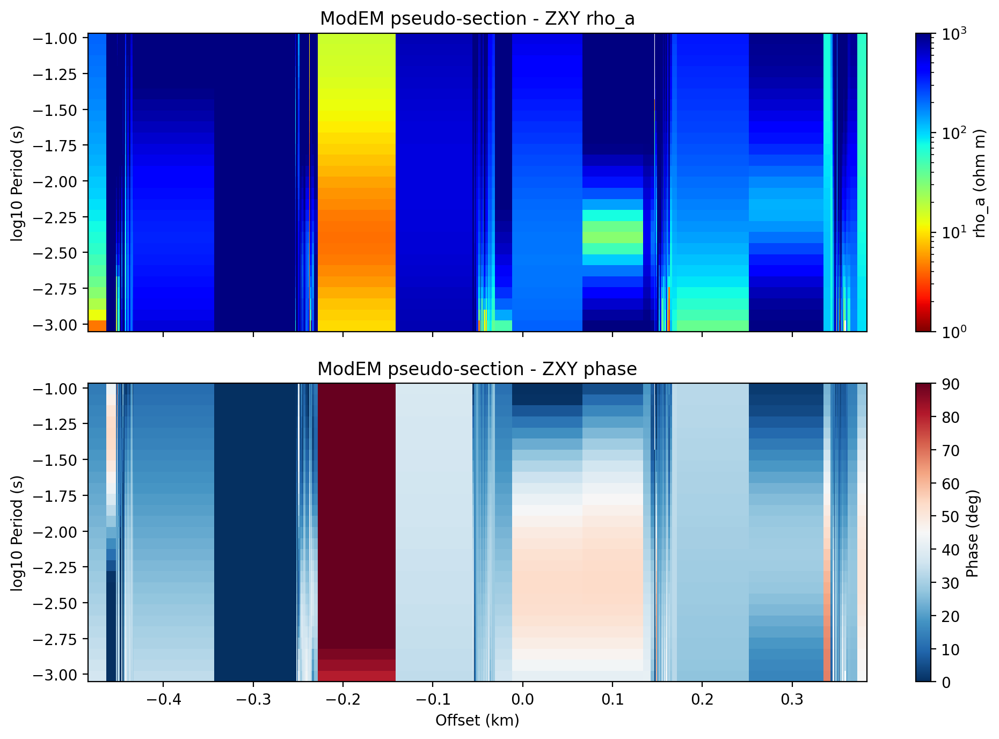
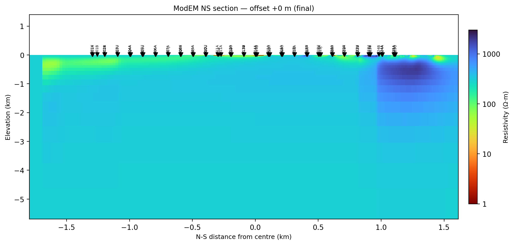

.. _models_modem:

ModEM
=====

:mod:`pycsamt.models.modem` is the ModEM integration layer in pyCSAMT v2. It
does not reimplement the ModEM solver. Instead, it gives Python objects for
preparing ModEM input files, checking native file types, launching an external
ModEM executable, loading completed runs, and plotting the results.

ModEM projects are file-oriented. A reproducible run is normally defined by an
observed data file, an initial model file, an inversion-control file, and, for
3-D inversions, a :term:`covariance` file. The solver then produces iteration
models, predicted responses, and logs. pyCSAMT keeps those files explicit so a
project can move between Python, command-line ModEM, and archived
:term:`native file` folders without losing provenance.

When To Use ModEM
-------------------

Use ModEM when the survey, interpretation target, or legacy project requires a
native ModEM workflow.

Good ModEM candidates include:

* MT or AMT surveys with stations distributed over an area, not only one line;
* geological settings where off-profile structure is expected to affect the
  response;
* projects that need 3-D inversion, covariance masks, or region-specific
  smoothing;
* existing ModEM projects that pyCSAMT should validate, plot, or archive;
* forward-response checks against a known ModEM model;
* backend-neutral pyCSAMT inversion workflows where the numerical solver is an
  external ModEM executable.

For simple 2-D CSAMT profile inversions, :doc:`occam2d` may be more direct.
For large 3-D MT or AMT modelling, ModEM is usually the more appropriate
native backend.

Dimensionality
----------------

ModEM supports both 2-D and 3-D modes in pyCSAMT. The mode controls the model
class, file set, executable name, and whether a covariance file is expected.

.. list-table::
   :header-rows: 1
   :widths: 18 26 26 30

   * - Mode
     - Main model object
     - Native model file
     - Typical use
   * - ``"2d"``
     - :class:`pycsamt.models.modem.ModEmModel2D`
     - ``.rho``
     - Profile inversion, TE/TM or selected impedance components.
   * - ``"3d"``
     - :class:`pycsamt.models.modem.ModEmModel3D`
     - ``.ws`` for starting models; ``.rho`` or ``.ws`` products
     - Area surveys, full impedance tensors, and 3-D covariance control.

.. list-table::
   :header-rows: 1
   :widths: 22 28 25 25

   * - Mode
     - Default executable
     - Covariance file
     - Default builder output
   * - ``"2d"``
     - ``Mod2DMT``
     - Not created by :class:`~pycsamt.models.modem.InputBuilder`
     - ``data``, ``model``, ``control``
   * - ``"3d"``
     - ``Mod3DMT``
     - Created from the 3-D model grid
     - ``data``, ``model``, ``covariance``, ``control``

Package Map
-------------

The public ModEM API is grouped around native file roles.

.. list-table::
   :header-rows: 1
   :widths: 28 72

   * - Object or function group
     - Role
   * - :class:`pycsamt.models.modem.ModEmConfig`
     - Stores data settings, dimensionality, grid controls, covariance
       controls, inversion-control values, file names, executable names, and
       MPI settings.
   * - :class:`pycsamt.models.modem.InputBuilder`
     - Builds a consistent ModEM input directory from EDI-like station objects
       or a populated :class:`~pycsamt.models.modem.ModEmData`.
   * - :class:`pycsamt.models.modem.ModEmData`
     - Reads, writes, and builds ModEM observed or predicted data files.
   * - :class:`pycsamt.models.modem.ModEmModel2D`
     - Reads, writes, and creates 2-D ModEM resistivity models.
   * - :class:`pycsamt.models.modem.ModEmModel3D`
     - Reads, writes, and creates 3-D ModEM resistivity models.
   * - :class:`pycsamt.models.modem.ModEmCovariance`
     - Represents 3-D smoothing coefficients, region masks, and smoothing
       exceptions.
   * - :class:`pycsamt.models.modem.ModEmControl`
     - Reads and writes the ``.inv`` nonlinear inversion-control file.
   * - :class:`pycsamt.models.modem.ModEmRunner`
     - Assembles and runs external ModEM inversion or forward commands.
   * - :class:`pycsamt.models.modem.InversionResult`
     - Scans a run directory and loads models, responses, covariance, control,
       and logs.
   * - :class:`pycsamt.models.modem.ModEmLog`
     - Parses iteration number, RMS, objective value, model norm, lambda, and
       alpha from a ModEM log.
   * - ``PlotMisfit``, ``PlotModel2D``, ``PlotModel3D``,
       ``PlotResponse``, ``PlotPseudo``
     - Matplotlib diagnostics for convergence, model inspection, station
       responses, and pseudo-sections.
   * - ``pycsamt.models.modem.plot.PlotSection``
     - Vertical curtain through a 3-D model along a profile line, with
       optional terrain and station-name context. Not re-exported at the
       package top level; import it from ``.plot`` directly.
   * - ``detect_file_type`` and ``is_*`` validators
     - Identify ModEM data, model, covariance, control, and log files before
       reading or routing them.
   * - ``read_z3d_old``, ``write_z3d_old``, ``convert_z3d``,
       ``read_mackie3d``, ``write_meshtools3d``, and related utilities
     - Convert older impedance, Mackie, MeshTools, and interpolation-oriented
       file formats.

Configuration
---------------

Most workflows start with :class:`~pycsamt.models.modem.ModEmConfig`. The same
configuration object is passed to the builder, runner, control file, model
factory, covariance factory, and result loader.

.. code-block:: pycon
   :linenos:

   >>> from pycsamt.models.modem import ModEmConfig

   >>> cfg = ModEmConfig(
   ...     mode="3d",
   ...     component_type="Full_Impedance",
   ...     error_floor_z=0.05,
   ...     initial_rho=100.0,
   ...     nx=24,
   ...     ny=24,
   ...     nz=36,
   ...     cell_size_h=500.0,
   ...     cell_size_v_top=10.0,
   ...     depth_scale=1.18,
   ...     n_padding_xy=8,
   ...     smooth_x=0.2,
   ...     smooth_y=0.2,
   ...     smooth_z=0.1,
   ...     n_smooth_iter=2,
   ...     max_iterations=80,
   ...     target_rms=1.05,
   ...     binary_3d="Mod3DMT",
   ...     use_mpi=True,
   ...     n_procs=16,
   ... )

   >>> cfg.write_template("runs/modem_3d_v01/modem_config.yml")

The template can be edited and loaded again:

.. code-block:: pycon
   :linenos:

   >>> from pycsamt.models.modem import ModEmConfig

   >>> cfg = ModEmConfig.from_file("runs/modem_3d_v01/modem_config.yml", strict=True)
   >>> print(cfg.mode, cfg.binary_name)
   3d Mod3DMT

Use a ``.py``, ``.json``, ``.yml``, or ``.yaml`` suffix -- the same formats
:mod:`pycsamt.models.config_io` supports everywhere else in pyCSAMT. A
``.ini`` suffix is silently accepted by ``write_template`` (it falls back to
the default ``.py`` writer while keeping the ``.ini`` name), but
``from_file`` then rejects that same file, because it dispatches strictly on
the file extension: ``ValueError: Unsupported config suffix. Use .py, .json,
.yml, or .yaml.`` Pick a real suffix from the start.

Important settings are grouped as follows.

.. list-table::
   :header-rows: 1
   :widths: 28 72

   * - Setting group
     - Main fields
   * - Dimensionality
     - ``mode`` controls ``"2d"`` or ``"3d"`` behavior. ``cfg.is_3d`` and
       ``cfg.binary_name`` are convenience properties.
   * - Data block
     - ``component_type``, ``sign_convention``, ``units``,
       ``error_floor_z``, ``error_floor_z_floor``, ``freq_min``,
       ``freq_max``.
   * - 2-D grid
     - ``nx_2d``, ``nz_2d``, ``n_airlayers_2d``, ``cell_size_h_2d``,
       ``cell_size_v_top_2d``, ``depth_scale_2d``, ``n_padding_x_2d``.
   * - 3-D grid
     - ``nx``, ``ny``, ``nz``, ``n_airlayers``, ``cell_size_h``,
       ``cell_size_v_top``, ``depth_scale``, ``n_padding_xy``.
   * - Regularization
     - ``smooth_x``, ``smooth_y``, ``smooth_z``, ``n_smooth_iter``.
   * - Nonlinear inversion
     - ``max_iterations``, ``target_rms``, ``initial_lambda``,
       ``lambda_divisor``, ``initial_alpha``, ``rms_diff_tol``,
       ``lambda_exit``.
   * - File names
     - ``data_file``, ``model_file``, ``covariance_file``, ``control_file``,
       ``log_file``, ``output_stem``.
   * - Execution
     - ``binary_2d``, ``binary_3d``, ``use_mpi``, ``n_procs``,
       ``mpi_command``.

The nonlinear-inversion group drives the same :term:`NLCG` search that writes
``Modular_NLCG`` files: ``initial_lambda`` and ``lambda_divisor`` schedule the
trade-off parameter, ``initial_alpha`` sets the first line-search step, and
``rms_diff_tol``/``lambda_exit`` decide when the search has stalled rather
than converged.

Native Files
--------------

A ModEM run folder should be understandable without Python. pyCSAMT therefore
writes and reads the same :term:`native file` roles that the executable uses.

.. list-table::
   :header-rows: 1
   :widths: 22 22 56

   * - File role
     - Python object
     - Notes
   * - Observed data
     - ``ModEmData``
     - ASCII data blocks grouped by component type. Built from EDI-like
       station objects or read from existing ModEM files.
   * - 2-D model
     - ``ModEmModel2D``
     - ``.rho`` resistivity model with horizontal and vertical cell widths.
   * - 3-D model
     - ``ModEmModel3D``
     - ``.ws`` starting model or 3-D ``.rho``/``.ws`` products loaded from a
       run directory.
   * - Covariance
     - ``ModEmCovariance``
     - 3-D earth-only smoothing file. It stores smoothing arrays, exceptions,
       and integer masks.
   * - Control
     - ``ModEmControl``
     - ``.inv`` file with output stem, lambda controls, target RMS, and
       iteration limits.
   * - Log
     - ``ModEmLog``
     - Parsed convergence history from ModEM text logs.
   * - Predicted data
     - ``ModEmData``
     - Loaded by :class:`~pycsamt.models.modem.InversionResult` as
       ``data_pred`` when a predicted response file is present.

Validate files before routing them into a workflow. ``detect_file_type``
returns a plain string, not an object with a ``.value`` attribute -- compare
it against ``ModEmFileType`` constants or other strings directly:

.. code-block:: pycon
   :linenos:

   >>> from pathlib import Path

   >>> from pycsamt.models.modem import ModEmFileType, detect_file_type

   >>> sample_dir = Path("data/modem/willy_27freq_watex_line02_sample")
   >>> for path in sorted(sample_dir.iterdir()):
   ...     kind = detect_file_type(path)
   ...     if kind != ModEmFileType.UNKNOWN:
   ...         print(path.name, kind)
   27-freq-run-watex01.cov covariance
   27-freq-run-watex01.dat data
   27-freq-run-watex01.rho model_3d
   inv.ctrl control
   Modular_NLCG.log log
   Modular_NLCG_000.dat data
   Modular_NLCG_000.rho model_3d
   Modular_NLCG_030.dat data
   Modular_NLCG_030.res data
   Modular_NLCG_030.rho model_3d
   Modular_NLCG_073.dat data
   Modular_NLCG_073.res data
   Modular_NLCG_073.rho model_3d

``run.slurm``, ``fwd.ctrl``, ``fort.2000``, ``CSUr2.err``, and ``README.txt``
are correctly left out -- they are real files in this bundled sample
directory, just not ones ``detect_file_type`` claims to recognize.
``.res`` residual files are classified as ``data`` alongside the ``.dat``
files they pair with.

Data Files And Components
----------------------------

:class:`~pycsamt.models.modem.ModEmData` stores observed or predicted response
rows. pyCSAMT can read existing ModEM data files or build new ones from
station objects.

When building from EDI-like objects, each station should provide:

* a station name;
* station coordinates or latitude/longitude/elevation metadata;
* positive frequencies;
* complex impedance values shaped like ``(n_frequency, 2, 2)``;
* impedance errors or uncertainty estimates.

The configuration selects which response components are written. Supported
``component_type`` values include:

.. list-table::
   :header-rows: 1
   :widths: 34 66

   * - ``component_type``
     - Components written
   * - ``"Full_Impedance"``
     - ``ZXX``, ``ZXY``, ``ZYX``, ``ZYY``
   * - ``"Off_Diagonal_Impedance"``
     - ``ZXY``, ``ZYX``
   * - ``"TE_Impedance"``
     - ``TE``
   * - ``"TM_Impedance"``
     - ``TM``
   * - ``"Determinant_Impedance"``
     - ``ZDet``
   * - ``"Full_Vertical_Components"``
     - ``HZX``, ``HZY``
   * - ``"Phase_Tensor"``
     - ``PTxx``, ``PTxy``, ``PTyx``, ``PTyy``

``ModEmData.from_edi`` accepts the same kind of survey source as the Occam2D
builder -- a :class:`~pycsamt.site.Sites` container, not a bare path string:

.. code-block:: pycon
   :linenos:

   >>> from pycsamt.models.modem import ModEmConfig, ModEmData
   >>> from pycsamt.site import Sites

   >>> sites = Sites.from_any("data/AMT/WILLY_DATA/L18PLT")

   >>> cfg = ModEmConfig(
   ...     mode="3d",
   ...     component_type="Off_Diagonal_Impedance",
   ...     error_floor_z=0.05,
   ...     freq_min=1e-3,
   ...     freq_max=1e3,
   ... )

   >>> data = ModEmData.from_edi(sites, config=cfg)
   >>> data.write("runs/modem_3d_v01/native/ModEMData.dat")

   >>> print(data.n_sites, data.n_periods, data.component_types)
   28 53 ['Off_Diagonal_Impedance']

.. important::

   ModEM data files depend on consistent local coordinates. The pyCSAMT writer
   stores local ``x``, ``y``, and ``z`` coordinates used by the model builder.
   Confirm projection, station order, and units before inversion. Do not mix
   metres, kilometres, and geographic degrees inside the same run folder.

Build A 3-D Input Set
------------------------

:class:`~pycsamt.models.modem.InputBuilder` creates the standard 3-D input
set: observed data, starting model, covariance, and control file.

.. code-block:: pycon
   :linenos:

   >>> from pathlib import Path

   >>> from pycsamt.models.modem import InputBuilder, ModEmConfig
   >>> from pycsamt.site import Sites

   >>> sites = Sites.from_any("data/AMT/WILLY_DATA/L18PLT")

   >>> workdir = Path("runs/modem_3d_v01/native")
   >>> cfg = ModEmConfig(
   ...     mode="3d",
   ...     component_type="Full_Impedance",
   ...     initial_rho=100.0,
   ...     nx=28,
   ...     ny=28,
   ...     nz=38,
   ...     n_airlayers=5,
   ...     cell_size_h=500.0,
   ...     cell_size_v_top=10.0,
   ...     depth_scale=1.18,
   ...     n_padding_xy=8,
   ...     smooth_x=0.2,
   ...     smooth_y=0.2,
   ...     smooth_z=0.1,
   ...     n_smooth_iter=2,
   ... )

   >>> builder = InputBuilder(config=cfg)
   >>> files = builder.build(
   ...     sites,
   ...     workdir=workdir,
   ...     data_filename=cfg.data_file,
   ...     model_filename="m0.ws",
   ...     cov_filename=cfg.covariance_file,
   ...     ctrl_filename=cfg.control_file,
   ... )

   >>> for role, path in sorted(files.items()):
   ...     print(role, path.name)
   control ModEM.inv
   covariance ModEM.cov
   data ModEMData.dat
   model m0.ws

The returned mapping contains ``data``, ``model``, ``covariance``, and
``control``. The builder also keeps the populated objects on
``builder.data``, ``builder.model``, ``builder.covariance``, and
``builder.control`` for inspection.

Build A 2-D Input Set
------------------------

The 2-D builder path writes data, a 2-D half-space model, and a control file.
It does not create a 3-D covariance file.

.. code-block:: pycon
   :linenos:

   >>> from pycsamt.models.modem import InputBuilder, ModEmConfig

   >>> cfg = ModEmConfig(
   ...     mode="2d",
   ...     component_type="TE_Impedance",
   ...     initial_rho=100.0,
   ...     nx_2d=120,
   ...     nz_2d=60,
   ...     n_airlayers_2d=5,
   ...     cell_size_h_2d=100.0,
   ...     cell_size_v_top_2d=10.0,
   ...     depth_scale_2d=1.18,
   ...     n_padding_x_2d=8,
   ...     max_iterations=60,
   ... )

   >>> files = InputBuilder(config=cfg).build(
   ...     sites,
   ...     workdir="runs/modem_2d_v01/native",
   ...     data_filename="ModEMData.dat",
   ...     model_filename="m0.rho",
   ...     ctrl_filename="ModEM.inv",
   ... )

   >>> print(sorted(files))
   ['control', 'data', 'model']
   >>> assert "covariance" not in files

Build From Existing Data
---------------------------

Use ``build_from_data`` when the observed data object has already been read,
filtered, or edited. In this mode the builder creates the model, covariance
when needed, and control file. The caller is responsible for writing the data
file itself.

.. code-block:: pycon
   :linenos:

   >>> from pycsamt.models.modem import InputBuilder, ModEmConfig, ModEmData

   >>> cfg = ModEmConfig(mode="3d")
   >>> data = ModEmData.read(
   ...     "data/modem/willy_27freq_watex_line02_sample/27-freq-run-watex01.dat"
   ... )
   >>> data.write("runs/modem_3d_v02/native/ModEMData.dat")

   >>> files = InputBuilder(config=cfg).build_from_data(
   ...     data,
   ...     workdir="runs/modem_3d_v02/native",
   ...     model_filename="m0.ws",
   ...     cov_filename="ModEM.cov",
   ...     ctrl_filename="ModEM.inv",
   ... )
   >>> print(sorted(files))
   ['control', 'covariance', 'model']

Models
--------

The model objects store cell widths and resistivity values. Internally,
resistivity is stored in natural-log units because ModEM solves for log
resistivity. The ``rho_linear`` property returns resistivity in linear
``ohm m`` units for plotting and interpretation.

Create and inspect a 3-D starting model:

.. code-block:: pycon
   :linenos:

   >>> from pycsamt.models.modem import ModEmData, ModEmModel3D, ModEmConfig

   >>> cfg = ModEmConfig(mode="3d", initial_rho=100.0)
   >>> data = ModEmData.read("runs/modem_3d_v01/native/ModEMData.dat")

   >>> model = ModEmModel3D.halfspace(data, config=cfg)
   >>> model.write("runs/modem_3d_v01/native/m0.ws")

   >>> print(model.shape)
   (35, 30, 40)
   >>> print(model.n_air)
   5
   >>> print(model.rho_linear.min(), model.rho_linear.max())
   100.00000000000004 999999999999.999

The maximum is not a bug: air cells are assigned an enormous placeholder
resistivity (:math:`\sim 10^{12}\,\Omega\cdot\mathrm{m}`) rather than
:math:`\infty`, so ``rho_linear.max()`` on a fresh half-space always reports
the air value, not anything about the earth model.

Create and inspect a 2-D starting model:

.. code-block:: pycon
   :linenos:

   >>> from pycsamt.models.modem import ModEmData, ModEmModel2D, ModEmConfig

   >>> cfg = ModEmConfig(mode="2d", initial_rho=100.0)
   >>> data = ModEmData.read("runs/modem_2d_v01/native/ModEMData.dat")

   >>> model = ModEmModel2D.halfspace(data, config=cfg)
   >>> model.write("runs/modem_2d_v01/native/m0.rho")

   >>> print(model.nx, model.nz)
   42 55
   >>> print(model.x_nodes[-1], model.z_nodes[-1])
   50861.204999999994 455021.9075001069

The half-space factories are intentionally conservative. They are useful for a
first run, but a production inversion usually deserves a deliberate mesh
review: station spacing, padding, first-layer thickness, air layers, expected
:term:`skin depth`\ s, and target depth all matter.

Covariance
------------

The :term:`covariance` file is central to 3-D ModEM interpretation. It
controls the model :term:`regularization` term through smoothing
coefficients and integer masks. pyCSAMT creates a uniform active earth region
by default, then lets advanced users edit masks and exceptions before writing
the file.

.. code-block:: pycon
   :linenos:

   >>> from pycsamt.models.modem import ModEmCovariance

   >>> cov = ModEmCovariance.from_model(model, config=cfg)
   >>> cov.exceptions.append((1, 2, 0.0))  # turn off smoothing across two regions
   >>> cov.write("runs/modem_3d_v01/native/ModEM.cov")

Mask values follow the ModEM convention:

* ``0`` is reserved for air;
* ``9`` is reserved for ocean;
* ``1`` through ``8`` are user-defined earth regions.

``ModEmCovariance.from_model`` excludes air layers from the covariance grid.
``model.shape`` is ``(nz, ny, nx)`` -- for the 3-D starting model built above
that is ``(35, 30, 40)``, so ``model.nz`` is ``35``, not the ``nx=40`` most
readers' eyes land on first. With ``model.n_air=5``, the covariance carries
``model.nz - model.n_air = 30`` layers.

Control Files
----------------

:class:`~pycsamt.models.modem.ModEmControl` stores the nonlinear inversion
settings written to the ``.inv`` file.

.. code-block:: pycon
   :linenos:

   >>> from pycsamt.models.modem import ModEmConfig, ModEmControl

   >>> cfg = ModEmConfig(
   ...     output_stem="ModEM_out",
   ...     initial_lambda=10.0,
   ...     lambda_divisor=100.0,
   ...     initial_alpha=10.0,
   ...     rms_diff_tol=5e-4,
   ...     target_rms=1.05,
   ...     lambda_exit=1e-4,
   ...     max_iterations=100,
   ... )

   >>> control = ModEmControl.from_config(cfg)
   >>> control.write("runs/modem_3d_v01/native/ModEM.inv")

The control file does not replace data-quality assessment. A low target RMS is
meaningful only when uncertainty floors, component selection, and bad-period
masking are realistic.

Run ModEM
-----------

:class:`~pycsamt.models.modem.ModEmRunner` assembles the external command and
can execute it with :func:`subprocess.run`. The executable is resolved from
``PATH`` or from the run directory and local ``_source/2D`` or ``_source/3D``
subdirectories.

Always inspect the command first:

.. code-block:: pycon
   :linenos:

   >>> from pycsamt.models.modem import ModEmConfig, ModEmRunner

   >>> cfg = ModEmConfig(
   ...     mode="3d",
   ...     binary_3d="Mod3DMT",
   ...     use_mpi=True,
   ...     n_procs=16,
   ...     mpi_command="mpirun",
   ... )

   >>> runner = ModEmRunner("runs/modem_3d_v01/native", config=cfg)
   >>> command = runner.command(
   ...     "m0.ws",
   ...     "ModEMData.dat",
   ...     "ModEM.inv",
   ...     covariance="ModEM.cov",
   ... )
   >>> print(command)
   mpirun -np 16 Mod3DMT -I NLCG m0.ws ModEMData.dat ModEM.inv ModEM.cov

Run the inversion only after file paths, executable names, and MPI settings
are correct:

.. code-block:: pycon
   :linenos:

   >>> # result = runner.run(
   >>> #     "m0.ws",
   >>> #     "ModEMData.dat",
   >>> #     "ModEM.inv",
   >>> #     covariance="ModEM.cov",
   >>> #     timeout=24 * 3600,
   >>> #     load_result=True,
   >>> # )

There is no bundled, pre-compiled ``Mod3DMT`` binary -- like :doc:`occam2d`'s
Fortran executable, ModEM must be compiled locally, so ``runner.run`` stays
commented out here rather than showing a fabricated result. ``command()``
above is exactly what would be launched, and inspecting it costs nothing.

For a forward response check, call ``run_forward``:

.. code-block:: pycon
   :linenos:

   >>> # runner.run_forward(
   >>> #     "m0.ws",
   >>> #     "ModEMData.dat",
   >>> #     timeout=3600,
   >>> #     load_result=False,
   >>> # )

.. warning::

   The runner is a subprocess wrapper around an external executable. It cannot
   make a physically poor mesh, incorrect component selection, or inconsistent
   coordinate system valid. Treat the generated command as a reproducibility
   aid, not as a scientific approval stamp.

Load Results
--------------

:class:`~pycsamt.models.modem.InversionResult` scans a completed run directory
and loads what it finds: logs, controls, covariance, data files, and iteration
models.

None of the sections above actually launched ModEM -- there is no compiled
binary in a documentation-build environment. From here on, the examples load
a genuinely finished run instead: the compact ``willy_27freq_watex_line02_sample``
bundled with pyCSAMT, built specifically for documentation and gallery use
from a real 3-D MT inversion (see its ``README.txt`` for provenance). It keeps
only three representative iteration snapshots -- 0, 30, and 73 -- rather than
every step the production run wrote.

.. code-block:: pycon
   :linenos:

   >>> from pycsamt.models.modem import InversionResult

   >>> result = InversionResult("data/modem/willy_27freq_watex_line02_sample")

   >>> print(result.mode, result.n_iter)
   3d 74
   >>> print(round(result.final_rms, 4), round(result.best_rms, 4))
   3.0572 3.0572
   >>> print(sorted(result.models))
   ['iter_0000', 'iter_0030', 'iter_0073']

   >>> final_model = result.model_final
   >>> observed = result.data_obs
   >>> predicted = result.data_pred
   >>> print(final_model.shape, observed.n_sites)
   (41, 50, 288) 125

``result.n_iter`` (74) counts iterations recorded in the log, not how many
``.rho`` snapshots are physically present -- only 3 of those 74 models are
bundled. ``final_rms`` equals ``best_rms`` here only because this particular
run's RMS happened to keep falling, slowly, all the way to iteration 73; nothing
in the loader guarantees that in general, which is exactly why both numbers
exist separately. An RMS of 3.06 is well above the target of 1.0 -- this run
did not converge, and every plot in the next two sections should be read with
that in mind.

The result loader recognizes common ModEM output naming patterns, including
numbered ``Modular_NLCG`` products. The lowest numbered response can be used
as an observed-data fallback and the highest numbered response can be used as
the predicted response when explicit filenames are not available.

Log Diagnostics
------------------

Use :class:`~pycsamt.models.modem.ModEmLog` when the convergence history is
the primary diagnostic.

.. code-block:: pycon
   :linenos:

   >>> from pycsamt.models.modem import ModEmLog

   >>> log = ModEmLog.read(
   ...     "data/modem/willy_27freq_watex_line02_sample/Modular_NLCG.log"
   ... )

   >>> print(log.n_iter, round(log.final_rms, 4), log.best_iter)
   74 3.0572 73
   >>> print(round(log.rms[0], 4), round(log.rms[-1], 4))
   3.5197 3.0572
   >>> print(log.lagrange[:5])
   [20. 20. 20. 20. 20.]

Review more than the final RMS. Sudden RMS stalls, unstable lambda changes,
or a best iteration far earlier than the final iteration can indicate
overfitting, inconsistent errors, or a regularization setting that should be
revisited. Here ``best_iter`` (73) *is* the final iteration, which is the
unremarkable case; a best iteration well before the end is the pattern
actually worth stopping for.

Plotting
----------

The ModEM plotters operate on
:class:`~pycsamt.models.modem.InversionResult` objects and return Matplotlib
figures. All of the figures below come from the same
``willy_27freq_watex_line02_sample`` result loaded above.

.. code-block:: pycon
   :linenos:

   >>> from pathlib import Path

   >>> from pycsamt.models.modem import PlotMisfit, PlotModel3D, PlotPseudo, PlotResponse

   >>> Path("runs/modem_3d_v01/figures").mkdir(parents=True, exist_ok=True)

   >>> fig = PlotMisfit(result=result).plot()
   >>> fig.savefig("runs/modem_3d_v01/figures/rms.png", dpi=200)

   >>> fig = PlotModel3D(
   ...     result=result,
   ...     depths=[500, 1000, 2000, 4000],
   ...     rho_min=1.0,
   ...     rho_max=1000.0,
   ... ).plot()
   >>> fig.savefig("runs/modem_3d_v01/figures/model_slices.png", dpi=200)

   >>> stations = list(result.data_obs.site_names)[:2]
   >>> fig = PlotResponse(result=result, stations=stations, max_stations=2).plot()
   >>> fig.savefig("runs/modem_3d_v01/figures/responses.png", dpi=200)

   >>> fig = PlotPseudo(result=result, component="ZXY").plot()
   >>> fig.savefig("runs/modem_3d_v01/figures/pseudo_zxy.png", dpi=200)

.. figure:: ../../images/user_guide/models/modem_misfit_convergence.png
   :alt: ModEM RMS misfit by iteration, stalling around 3.06 well above the RMS=1 target line.
   :align: center
   :width: 80%

   RMS drops from 3.52 to 3.06 over 74 iterations but never gets close to the
   dashed target line at 1.0. Two long flat stretches (iterations 5-25 and
   40-55) suggest the search was making very slow progress well before it
   stopped -- worth checking against ``log.lagrange`` and the control file's
   ``rms_diff_tol`` before trusting the final model.

   Four depth slices through ``model_final``, all essentially uniform at
   this color scale. That is not a plotting mistake -- it is what a model
   looks like after an inversion that stalled at RMS 3.06: with the data
   still fit this poorly, the regularization has not been pushed hard enough
   by the data misfit to build much lateral contrast. A suspiciously
   featureless model slice is a reason to check the convergence plot, not a
   reason to conclude the subsurface is uniform.

   Station-level detail behind that RMS 3.06: for both stations, the
   predicted curves (dotted) track the observed apparent resistivity
   (solid, with error bars) at short period but drift away at long period,
   and the phase panels barely follow the observed trend at all in three of
   the four off-diagonal components. This is what "did not converge" looks
   like at the response level, not just as a single summary number.

   ``component="ZXY"`` pseudo-section over all 125 stations. The banded
   structure -- alternating resistive and conductive columns rather than a
   smooth lateral trend -- reflects that this is an areal 3-D deployment
   sampled along an arbitrary station ordering, not a single profile line;
   compare with :doc:`occam2d`'s pseudosection, which is genuinely
   profile-ordered by :term:`chainage`.

For 2-D results, use :class:`pycsamt.models.modem.PlotModel2D` the same way:

.. code-block:: pycon
   :linenos:

   >>> from pycsamt.models.modem import InversionResult, PlotModel2D

   >>> result_2d = InversionResult("runs/modem_2d_v01/native")
   >>> fig = PlotModel2D(result=result_2d, depth_max=5000.0).plot()
   >>> fig.savefig("runs/modem_2d_v01/figures/model_section.png", dpi=200)

No finished 2-D ModEM sample ships with pyCSAMT, so this one is shown without
a captured figure -- ``runs/modem_2d_v01/native`` here is the half-space
starting model built earlier, not a converged result.

A Vertical Section Through The 3-D Model
-------------------------------------------

For 3-D results, a single vertical curtain along a profile line is often more
useful for interpretation than isolated depth slices. ``PlotSection`` (import
it from ``pycsamt.models.modem.plot``, not the package top level) extracts one:

.. code-block:: pycon
   :linenos:

   >>> from pycsamt.models.modem.plot import PlotSection

   >>> plotter = PlotSection(
   ...     result=result,
   ...     direction="NS",
   ...     profile_offset=0.0,
   ...     which="final",
   ...     depth_max=5000.0,
   ...     rho_min=1.0,
   ...     rho_max=3000.0,
   ...     cmap="turbo_r",
   ...     show_station_names=True,
   ... )
   >>> fig = plotter.plot()
   >>> ax = fig.axes[0]

   >>> ylo, _ = ax.get_ylim()  # (-5.696, 0.0): 0 is the surface, at the axes top
   >>> ax.set_ylim(ylo, 1.4)   # reserve headroom so labels don't collide with the title
   >>> fig.savefig("runs/modem_3d_v01/figures/section_ns.png", dpi=200)

Station-name labels are drawn starting exactly at the surface line and
growing upward, with no headroom reserved above it -- without the
``set_ylim`` adjustment they overlap the title directly. This is the same
class of matplotlib default seen in :doc:`occam2d`'s rotated station labels:
nothing places text safely on its own, so the caller reserves the room.

   A resistive body (dark blue/purple, exceeding the 3000 ohm-m color
   ceiling) sits under the stations between roughly +0.9 and +1.5 km,
   confined to the top ~1.3 km -- the same profile-relative signature
   ``PlotModel3D``'s depth slices above were too uniform-looking to convey.
   With RMS still at 3.06, treat this as a candidate feature to re-run and
   re-check, not a finished interpretation.

Conversion And Utility Tools
-------------------------------

The ModEM package also exposes utility functions for existing projects and
format conversion.

.. list-table::
   :header-rows: 1
   :widths: 30 70

   * - Utility group
     - Examples
   * - Impedance files
     - ``ZBlock``, ``ImpedanceFile``, ``read_z3d_old``,
       ``write_z3d_old``, ``read_z2d_old``, ``write_z2d_old``,
       ``write_z3d_list``, ``write_z2d_list``, ``convert_z3d``,
       ``convert_z2d``.
   * - Mackie formats
     - ``read_mackie2d``, ``write_mackie2d``, ``read_mackie3d``,
       ``write_mackie3d``.
   * - MeshTools export
     - ``write_meshtools3d``.
   * - Interpolation
     - ``interp_model3d``, ``interp_z3d``.
   * - Units and transforms
     - ``skin_depth``, ``imp_units_factor``, ``loge_to_log10``,
       ``log10_to_loge``, ``loge_to_linear``, ``linear_to_loge``.

``skin_depth`` implements the same :math:`\delta \approx 503\sqrt{\rho T}`
relation used throughout pyCSAMT's :term:`skin depth` diagnostics, taking
period rather than frequency:

.. code-block:: pycon
   :linenos:

   >>> from pycsamt.models.modem import skin_depth

   >>> print(round(skin_depth(period=1.0, rho=100.0), 1))
   5032.9

These helpers are most useful when a project arrives with older ModEM,
Mackie, or impedance-list files and pyCSAMT is being used as a bridge into a
clean v2 run directory.

Backend-Neutral Workflows
----------------------------

The native objects above are the most explicit way to work with ModEM. pyCSAMT
also exposes ModEM through the backend-neutral inversion interface.

.. code-block:: pycon
   :linenos:

   >>> from pycsamt.inversion import InversionConfig, InversionWorkflow
   >>> from pycsamt.site import Sites

   >>> inv_cfg = InversionConfig(
   ...     method="mt",
   ...     dimension="3d",
   ...     backend="modem",
   ...     data="data/AMT/WILLY_DATA/L18PLT",
   ...     workdir="runs/modem_3d_backend_neutral/native",
   ...     run_external=False,
   ...     backend_options={
   ...         "config": {
   ...             "component_type": "Full_Impedance",
   ...             "initial_rho": 100.0,
   ...             "binary_3d": "Mod3DMT",
   ...             "use_mpi": True,
   ...             "n_procs": 16,
   ...         },
   ...     },
   ... )
   >>> workflow = InversionWorkflow(inv_cfg)
   >>> sites = Sites.from_any(inv_cfg.data)
   >>> outcome = workflow.run(data=sites)
   >>> print(outcome.status, outcome.rms)
   loaded nan

``status="loaded"`` here does not mean an inversion ran -- ``rms`` is
``nan`` right next to it. The Occam2D backend only reports ``"loaded"``
once it has reconstructed a real resistivity grid from an actual iteration
file; the ModEM backend's loaded-check is coarser (`` "has anything
InversionResult can parse" ``), and a just-built starting model already
satisfies that after ``InputBuilder`` runs, whether or not ModEM ever
executed. Check ``rms`` -- or, better, ``result.n_iter`` -- before treating
``status="loaded"`` from this backend as evidence of a finished run.

With ``run_external=False``, the backend prepares or validates the run folder
and reports the command that would be executed. Set ``run_external=True`` only
when the external ModEM executable is installed and the run directory has been
reviewed.

Recommended Run Layout
-------------------------

A stable ModEM project layout separates native inputs, figures, and notes:

.. code-block:: text
   :linenos:

   runs/
     modem_3d_v01/
       README.md
       config/
         modem_config.yml
       native/
         ModEMData.dat
         m0.ws
         ModEM.cov
         ModEM.inv
         Modular_NLCG.log
         Modular_NLCG_030.rho
         Modular_NLCG_030.dat
       figures/
         rms.png
         model_slices.png
         responses.png
         section_ns.png
       exports/
         final_model.vtk

Keep hand-edited files under version control when possible. Large model
outputs and response grids can be archived separately if repository size is a
concern.

Pre-Run Checklist
--------------------

Before starting a ModEM inversion, verify:

* station coordinates use one local coordinate system and metre units;
* periods and frequencies are in the intended range;
* impedance sign convention and units match the executable expectation;
* component selection is appropriate for the survey dimensionality;
* error floors are realistic and bad periods have been removed or masked;
* horizontal cell size reflects station spacing and target resolution;
* vertical first-layer thickness and depth growth resolve shallow structure;
* padding extends far enough from the station footprint;
* air layers and ocean or inactive masks are correct;
* covariance smoothing values and exceptions are scientifically justified;
* the dry-run command points to the intended executable and files;
* MPI process count matches the machine and executable build.

Post-Run Checklist
----------------------

After a run finishes, review:

* RMS history and best iteration, not only final RMS;
* response fits by station, period, and component;
* residual concentration around specific stations or period bands;
* model updates near boundaries, air layers, and padding cells;
* sensitivity of interpretation to error floors and covariance settings;
* consistency between final model features and known geology;
* reproducibility of the run directory, configuration, command, and code
  version.

Common Mistakes
------------------

``The command is ready but the executable cannot be found.``
   Check ``binary_2d`` or ``binary_3d`` in :class:`ModEmConfig`. The runner
   searches ``PATH``, the working directory, and local ``_source`` folders.

``The 3-D run is missing a covariance file.``
   Build the input set with ``mode="3d"`` or create
   :class:`ModEmCovariance` from the 3-D model and pass it to the runner.

``The model loads but plotted station positions look wrong.``
   Recheck coordinate origin, projection, and units before trusting any
   response or model diagnostics.

``The RMS is low but the model has unrealistic detail.``
   Inspect uncertainty floors, removed periods, smoothing values, covariance
   masks, and response residuals. A visually detailed model is not necessarily
   better constrained.

``The result loader did not find a predicted response.``
   Confirm the output stem in the control file and inspect the run directory
   for numbered ``Modular_NLCG`` response files.

``A config template written with a ".ini" suffix will not load back.``
   ``write_template`` accepts the path anyway and writes Python-format
   content into it; ``from_file`` then rejects the same file because it reads
   the extension, not the content. Use ``.py``, ``.json``, ``.yml``, or
   ``.yaml``.

``The backend-neutral result says "loaded" but nothing was ever run.``
   Check ``result.rms`` too. The ModEM backend reports ``"loaded"`` as soon
   as ``InversionResult`` can parse anything in the workdir, which includes a
   freshly built starting model -- it is not the stronger guarantee the
   Occam2D backend gives for the same status string.

Next Steps
------------

* :doc:`../../tutorials/prepare_modem_inversion` walks through preparing a
  real 3-D ModEM run end to end, including horizontal and vertical mesh
  design.
* :doc:`choosing_backend` explains when ModEM is preferable to other model
  backends.
* :doc:`configuration_and_io` gives the shared model-backend configuration
  and file-layout policy.
* :doc:`occam2d` documents the 2-D Occam-style alternative.
* :ref:`inversion_concepts` introduces misfit, regularization, and inversion
  diagnostics.
* :doc:`../../api/models` links to generated API pages for the ModEM objects.
