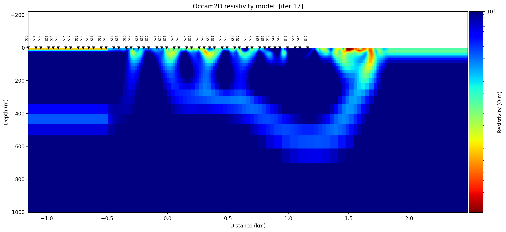
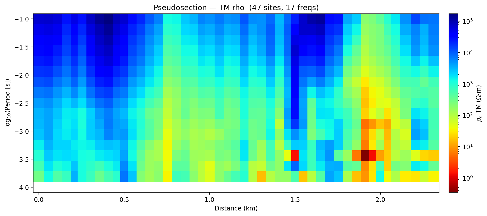
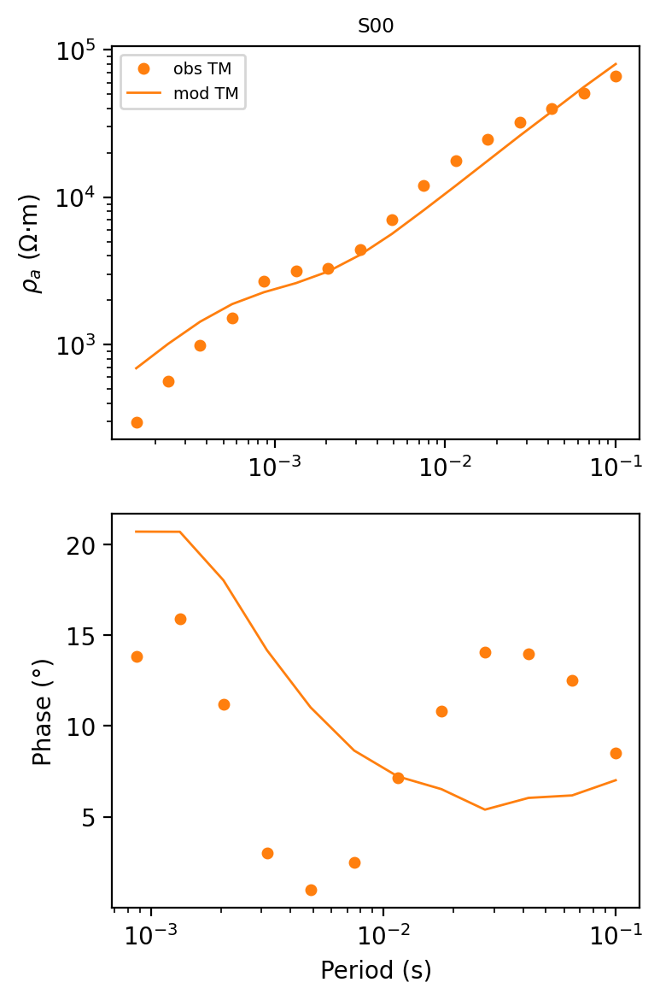
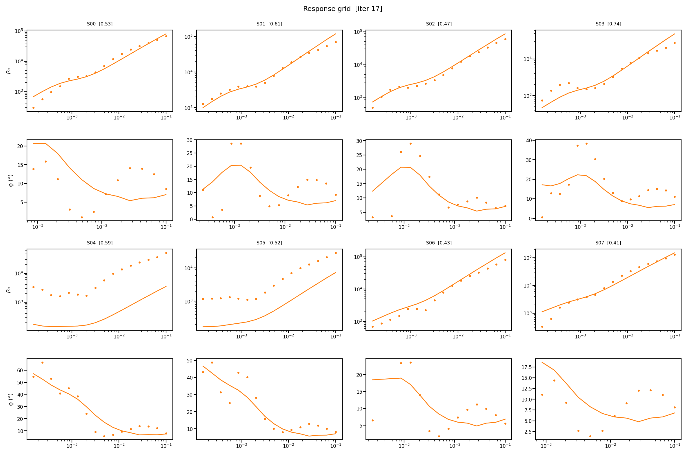

.. _models_occam2d:

Occam2D
=======

:mod:`pycsamt.models.occam2d` provides the pyCSAMT interface to an
Occam2DMT-style smooth 2-D inversion workflow. It prepares native input files,
can run the external Fortran executable, loads iteration and response outputs,
and provides plotting helpers for models, responses, pseudosections, misfit
curves, station-level residuals, and 1-D station extracts.

Occam inversion is deliberately conservative. It seeks the smoothest model
that fits the data to an acceptable normalized :term:`RMS misfit`. For a
residual vector :math:`r`, the usual RMS diagnostic is

.. math::

   \mathrm{RMS} =
   \sqrt{\frac{1}{N}\sum_{i=1}^{N} r_i^2}.

Occam iteration files store model parameters as log10 resistivity,
:math:`m = \log_{10}(\rho)`. pyCSAMT preserves that convention in
``InversionResult.rho_2d`` and converts to physical resistivity only when a
plot or downstream calculation needs it.

When To Use Occam2D
--------------------

Occam2D is a good first production engine when:

* stations follow a profile and can be represented by 2-D geometry;
* the dominant resistivity structure is expected to be approximately 2-D;
* a smooth model is scientifically appropriate;
* TE/TM apparent resistivity and phase are the primary inversion data;
* the deliverable must include :term:`native file`\ s: Occam data, mesh,
  model, startup, iteration, response, and log files;
* the interpreter wants a reproducible external-code workflow rather than
  only an in-memory inversion result.

Occam2D is not a blocky geology engine. A sharp geological contact may appear
as a smooth gradient because the :term:`regularization` intentionally spreads
structure unless the data require a sharper transition.

Package Map
------------

The Occam2D package is organized around the native inversion lifecycle.

.. list-table::
   :header-rows: 1
   :widths: 26 34 40

   * - Area
     - Main objects
     - Purpose
   * - Configuration
     - ``OccamConfig``
     - Stores data selection, error floors, mesh options, startup controls,
       file names, and binary discovery name.
   * - Input construction
     - ``InputBuilder``
     - Builds data, mesh, model, and startup files from a survey source.
   * - Native data
     - ``OccamData``
     - Reads/writes Occam data files and builds data rows from EDI/Sites-like
       sources.
   * - Mesh and model
     - ``OccamMesh``, ``OccamModel``
     - Build/read finite-element mesh geometry and the model-parameter mapping.
   * - Startup and iterations
     - ``OccamStartup``, ``OccamIter``
     - Represent the iteration-zero startup file and non-zero iteration output
       files.
   * - Execution
     - ``OccamRunner``
     - Finds or compiles the executable, patches startup controls when
       requested, launches the solver, and captures stdout/stderr logs.
   * - Results
     - ``InversionResult``
     - Scans a completed run, loads mesh/model/data/log/iteration/response
       files, reconstructs ``rho_2d``, and exports ``iter2dat``.
   * - Diagnostics
     - ``OccamResponse``, ``OccamLog``
     - Parse response residuals and convergence history.
   * - Plotting
     - ``PlotModel``, ``PlotResponse``, ``PlotPseudo``, ``PlotMisfit``,
       ``PlotSounding1D``, ``PlotSiteMisfit``, ``PlotResponseGrid``,
       ``PlotStation1DFit``
     - Visual QC and interpretation views.
   * - Validation
     - ``detect_file_type`` and ``is_*`` helpers
     - Recognize data, mesh, model, startup, iteration, response, and log files.

Configuration
--------------

``OccamConfig`` is the source-of-truth object for a native Occam2D run. It can
be created in Python, written to a :term:`configuration file` template, edited,
and loaded again.

.. code-block:: pycon
   :linenos:

   >>> from pycsamt.models.occam2d import OccamConfig

   >>> cfg = OccamConfig(
   ...     modes=["TE", "TM"],
   ...     error_floor_rho=0.05,
   ...     error_floor_phase=0.5,
   ...     freq_min=0.1,
   ...     freq_max=1000.0,
   ...     n_layers=36,
   ...     n_airlayers=5,
   ...     cell_size_horizontal=75.0,
   ...     cell_size_vertical_top=10.0,
   ...     depth_scale=1.18,
   ...     n_padding_x=8,
   ...     max_iterations=80,
   ...     target_misfit=1.0,
   ...     initial_rho=100.0,
   ...     data_file="OccamDataFile.dat",
   ...     mesh_file="Occam2DMesh",
   ...     model_file="Occam2DModel",
   ...     startup_file="Startup",
   ...     binary_name="Occam2D",
   ... )

   >>> cfg.to_template("runs/profile_a_occam2d_v01/occam2d.yml")
   >>> loaded = OccamConfig.from_file("runs/profile_a_occam2d_v01/occam2d.yml")
   >>> print(loaded.modes, loaded.n_layers, loaded.cell_size_horizontal, loaded.target_misfit)
   ['TE', 'TM'] 36 75.0 1.0

The configuration groups four concerns.

.. list-table::
   :header-rows: 1
   :widths: 24 36 40

   * - Concern
     - Fields
     - Meaning
   * - Data selection
     - ``modes``, ``error_floor_rho``, ``error_floor_phase``,
       ``freq_min``, ``freq_max``
     - Which data rows are written and how minimum uncertainties are enforced.
   * - Mesh geometry
     - ``n_layers``, ``n_airlayers``, ``cell_size_horizontal``,
       ``cell_size_vertical_top``, ``depth_scale``, ``n_padding_x``
     - Finite-element discretization near stations, at depth, and near lateral
       boundaries.
   * - Startup controls
     - ``max_iterations``, ``target_misfit``, ``roughness_type``,
       ``diagonal_penalties``, ``stepsize_cut_count``, ``debug_level``,
       ``initial_rho``, ``lagrange_start``
     - Values written to the :term:`startup file`, including the initial
       :term:`Lagrange multiplier` (``lagrange_start``) and how many times
       its step size may be cut during one iteration's line search
       (``stepsize_cut_count``).
   * - Files and binary
     - ``data_file``, ``mesh_file``, ``model_file``, ``startup_file``,
       ``binary_name``
     - Native file names inside the run directory and executable name used by
       the runner.

Use strict loading for project work. Unknown keys usually mean spelling
mistakes or stale configuration files.

.. code-block:: pycon
   :linenos:

   >>> from pycsamt.models.occam2d import OccamConfig

   >>> cfg = OccamConfig.from_file("runs/profile_a_occam2d_v01/occam2d.yml")

   >>> # old_occam2d.yml is the same file with one retired key appended:
   >>> # "convergence_tol: 0.001"
   >>> try:
   ...     OccamConfig.from_file("runs/profile_a_occam2d_v01/old_occam2d.yml")
   ... except ValueError as exc:
   ...     print(exc)
   Unknown configuration parameter(s): convergence_tol

   >>> # Migration only: ignore retired or unknown keys while cleaning old files.
   >>> migrated = OccamConfig.from_file(
   ...     "runs/profile_a_occam2d_v01/old_occam2d.yml",
   ...     strict=False,
   ... )
   >>> print(cfg.n_layers, migrated.n_layers)
   36 36

``strict=False`` does not fall back to defaults for the whole file -- it drops
only the keys the current ``OccamConfig`` no longer defines (``convergence_tol``
here) and keeps every other value exactly as written, so ``migrated.n_layers``
still comes back as the ``36`` that was actually saved. ``strict=True`` on the
same file refuses to guess and raises instead, which is what makes it the
right default for everyday project work: a misspelled key fails loudly rather
than silently reverting that one field to its ``OccamConfig`` default.

Native Files
-------------

Occam2D projects should be archived as :term:`native file` sets. The final
image alone is not enough to reproduce the inversion.

.. list-table::
   :header-rows: 1
   :widths: 22 26 52

   * - File
     - Object
     - Role
   * - ``OccamDataFile.dat``
     - ``OccamData``
     - Observed data rows, station names, offsets, frequencies, Occam
       :term:`type code`\ s, datum values, and uncertainties.
   * - ``Occam2DMesh``
     - ``OccamMesh``
     - Finite-element :term:`mesh` geometry, including air layers, earth
       layers, horizontal cells, and padding cells.
   * - ``Occam2DModel``
     - ``OccamModel``
     - Mapping from mesh cells to inversion parameters.
   * - ``Startup``
     - ``OccamStartup``
     - :term:`Startup file`: data/model/mesh names, target misfit, iteration
       controls, starting parameters.
   * - ``*.iter``
     - ``OccamIter``
     - :term:`Iteration file`\ s containing log10-resistivity parameter
       values and iteration diagnostics.
   * - ``*.resp``
     - ``OccamResponse``
     - :term:`Response file`: modeled responses and residual information for
       an iteration.
   * - ``*.logfile`` or ``LogFile*``
     - ``OccamLog``
     - Convergence history and run-level diagnostic messages.
   * - ``occam_stdout.log`` and ``occam_stderr.log``
     - ``OccamRunner``
     - Captured process streams from pyCSAMT-launched runs.

The validation helpers can classify files when scanning a run directory. They
key off content, not extension, so a renamed file is still recognized
correctly:

.. code-block:: pycon
   :linenos:

   >>> from pycsamt.models.occam2d.validation import detect_file_type

   >>> for path in [
   ...     "data/occam2D/OccamDataFile.dat",
   ...     "data/occam2D/Occam2DMesh",
   ...     "data/occam2D/Startup",
   ... ]:
   ...     print(path, detect_file_type(path))
   data/occam2D/OccamDataFile.dat data
   data/occam2D/Occam2DMesh mesh
   data/occam2D/Startup startup

Build Input Files
-------------------

``InputBuilder`` constructs the four files required before an external Occam2D
run can start. It consumes a :class:`~pycsamt.site.Sites` container, not a
bare directory string, so a survey source is normalized once, up front, with
:func:`~pycsamt.site.Sites.from_any`.

.. code-block:: pycon
   :linenos:

   >>> from pycsamt.models.occam2d import InputBuilder, OccamConfig
   >>> from pycsamt.site import Sites

   >>> sites = Sites.from_any("data/AMT/WILLY_DATA/L18PLT")

   >>> cfg = OccamConfig(
   ...     modes=["TE", "TM"],
   ...     freq_min=0.1,
   ...     freq_max=1000.0,
   ...     error_floor_rho=0.05,
   ...     error_floor_phase=0.5,
   ...     n_layers=32,
   ...     target_misfit=1.0,
   ... )

   >>> builder = InputBuilder(
   ...     sites,
   ...     workdir="runs/profile_a_occam2d_v01/native",
   ...     config=cfg,
   ...     verbose=1,
   ... )
   >>> builder.build(title="Profile A Occam2D inversion")

   >>> print(builder.summary())
   InputBuilder summary
     workdir   : runs/profile_a_occam2d_v01/native
     sites     : 28
     freqs     : 39
     data pts  : 4368
     mesh      : 42 x 37 cells
     params    : 512
     modes     : ['TE', 'TM']

The build chain is fixed:

1. ``OccamData.from_edi`` converts the survey source into Occam data rows.
2. ``OccamMesh.from_data`` builds a mesh from station offsets and mesh options.
3. ``OccamModel.from_mesh`` maps mesh cells to inversion parameters.
4. ``OccamStartup.from_model`` writes the initial parameter vector and run
   controls.

One-shot overrides passed to ``build`` update the stored configuration before
files are written.

.. code-block:: pycon
   :linenos:

   >>> builder.build(
   ...     modes=["TM"],
   ...     n_layers=40,
   ...     cell_size=50.0,
   ...     error_floor_rho=0.07,
   ...     freq_min=0.2,
   ...     freq_max=500.0,
   ...     title="Profile A TM-only sensitivity run",
   ... )
   >>> print(builder.summary())
   InputBuilder summary
     workdir   : runs/profile_a_occam2d_v01/native
     sites     : 28
     freqs     : 35
     data pts  : 1960
     mesh      : 66 x 45 cells
     params    : 1120
     modes     : ['TM']

Narrowing the frequency band and switching to a single mode roughly halved the
data count (4368 to 1960), and the finer 50 m cell size more than doubled the
mesh (42x37 to 66x45 cells) and free parameters (512 to 1120). Because these
overrides persist on ``builder.config``, write the resulting configuration to
the run directory if this build is the one that gets kept.

Data Rows And Type Codes
--------------------------

Occam2D data files written by pyCSAMT use TE/TM apparent resistivity and phase
rows, distinguished by :term:`type code`:

* ``"TE"`` selects the :math:`Z_{xy}` component, written as type codes 1
  (:math:`\rho_a`) and 2 (phase);
* ``"TM"`` selects the :math:`Z_{yx}` component, written as type codes 5
  (:math:`\rho_a`) and 6 (phase);
* apparent resistivity is stored as :math:`\log_{10}(\rho_a)`;
* phase is stored in degrees;
* ``error_floor_rho`` is relative, for example ``0.05`` for five percent;
* ``error_floor_phase`` is absolute, in degrees.

Inspect the data object before running -- this reads back the TM-only file
just written above.

.. code-block:: pycon
   :linenos:

   >>> from pycsamt.models.occam2d import OccamData

   >>> data = OccamData.read("runs/profile_a_occam2d_v01/native/OccamDataFile.dat")

   >>> print(data.n_sites, data.n_frequencies, data.n_data)
   28 35 1960
   >>> print(data.sites[:5])
   ['18-025A', '18-024U', '18-023V', '18-023A', '18-022V']
   >>> print(data.offsets[:5])
   [-2403.  -2297.8 -2201.6 -2199.7 -2101.7]

Station order and offsets matter because the mesh and pseudosections are built
around that profile geometry -- notice the offsets are already sorted by
:term:`chainage`, not by the original EDI file order.

Mesh And Model Review
-----------------------

The mesh and model determine what kind of smoothness the inversion can
express. Before launching a long external run, inspect:

* horizontal cell width near stations;
* number of padding cells on each side;
* top cell thickness and depth growth factor;
* number of air layers and earth layers;
* total number of model parameters;
* whether the mesh is far wider and deeper than the interpreted target.

.. code-block:: pycon
   :linenos:

   >>> from pycsamt.models.occam2d import OccamMesh, OccamModel

   >>> mesh = OccamMesh.read("runs/profile_a_occam2d_v01/native/Occam2DMesh")
   >>> model = OccamModel.read("runs/profile_a_occam2d_v01/native/Occam2DModel")

   >>> print(mesh.n_xcells, mesh.n_zcells)
   66 45
   >>> print(model.n_params)
   1120

Fine cells can improve near-surface representation, but they also increase
runtime and may exaggerate the apparent resolution of poorly constrained
structure. Padding moves boundaries away from the profile but also increases
mesh size.

Run Occam2D
------------

``OccamRunner`` executes a prepared native directory. It does not build input
files; use ``InputBuilder`` first when starting from EDI data.

Occam2D is an external Fortran program, and pyCSAMT does not ship a
pre-compiled executable. Build it first by following
:ref:`occam2d_compilation`. The recommended command is:

.. code-block:: bash

   pycsamt build occam2d --auto-install

After a successful build, pass the executable path printed by that command to
the runner. This example finds the packaged source directory and handles the
Windows ``.exe`` suffix:

.. code-block:: pycon
   :linenos:

   >>> import os
   >>> from pathlib import Path

   >>> import pycsamt.models.occam2d as occam2d
   >>> from pycsamt.models.occam2d import OccamRunner

   >>> binary_name = "Occam2D.exe" if os.name == "nt" else "Occam2D"
   >>> binary = Path(occam2d.__file__).resolve().parent / "_source" / binary_name
   >>> if not binary.is_file():
   ...     raise FileNotFoundError(
   ...         f"{binary} was not built; see the Occam2D compilation guide"
   ...     )

   >>> runner = OccamRunner(
   ...     workdir="runs/profile_a_occam2d_v01/native",
   ...     binary_path=binary,
   ...     startup_file="Startup",
   ...     verbose=1,
   ... )
   >>> print(runner.discover_binary(auto_compile=False))
   .../pycsamt/models/occam2d/_source/Occam2D

Run only after the native input directory and startup file have been checked:

.. code-block:: python
   :linenos:

   exit_code = runner.run(
       max_iter=80,
       target_misfit=1.0,
       auto_compile=False,
   )
   if exit_code != 0:
       raise RuntimeError(
           f"Occam2D failed with exit code {exit_code}; "
           f"see {runner.stderr_log}"
       )

The run block is intentionally not a doctest: it launches the external solver
and writes ``occam_stdout.log`` and ``occam_stderr.log`` in the run directory.
Passing ``auto_compile=False`` makes the documented build step explicit and
prevents an unexpected compilation attempt when a queued run starts.

Binary discovery follows this order:

1. explicit ``binary_path``;
2. ``Occam2D`` or ``Occam2D.exe`` in the run directory;
3. executable on ``PATH``;
4. bundled ``_source`` directory, if ``auto_compile=True``.

Automatic compilation uses the bundled Fortran source under
``pycsamt/models/occam2d/_source`` and a compiler such as ``gfortran`` through
``make``. The dedicated :ref:`occam2d_compilation` workflow provides the
scripted, cross-platform build and clearer toolchain diagnostics. For
reproducible production work, prefer an explicit binary path and record
compiler provenance separately.

``run`` can patch the startup file in place when ``max_iter`` or
``target_misfit`` is supplied. Archive the startup file that was actually run,
not only the template that created it.

Asynchronous execution is available for scripts that need to poll an external
process. This too requires a real binary, so it is shown for reference only:

.. code-block:: pycon
   :linenos:

   >>> runner = OccamRunner("runs/profile_a_occam2d_v01/native")

   >>> # process = runner.run_async(auto_compile=False)
   >>> # while runner.is_running:
   >>> #     ...
   >>> # exit_code = runner.wait()

For HPC usage, build and validate the native directory locally, then submit
the equivalent ``Occam2D Startup`` command through the scheduler. Load the
completed directory afterward with ``InversionResult``.

Backend-Neutral Occam2D Runs
------------------------------

The backend-neutral inversion API can drive the same native workflow through
``backend="occam2d"``.

.. code-block:: pycon
   :linenos:

   >>> from pycsamt.inversion import InversionConfig, InversionWorkflow
   >>> from pycsamt.site import Sites

   >>> cfg = InversionConfig(
   ...     method="mt",
   ...     dimension="2d",
   ...     backend="occam2d",
   ...     data="data/AMT/WILLY_DATA/L18PLT",
   ...     workdir="runs/profile_a_occam2d_backend_neutral",
   ...     run_external=False,
   ...     backend_options={
   ...         "config": {
   ...             "modes": ["TE", "TM"],
   ...             "n_layers": 32,
   ...             "target_misfit": 1.0,
   ...         },
   ...     },
   ... )
   >>> workflow = InversionWorkflow(cfg)
   >>> sites = Sites.from_any(cfg.data)
   >>> result = workflow.run(data=sites)
   >>> print(result.status, sorted(result.files))
   ready ['data', 'mesh', 'model', 'startup']

The ``backend_options`` key that carries native settings is ``"config"``, not
a made-up name such as ``"occam_config"``: the Occam2D adapter only looks for
``backend_options["config"]`` and otherwise falls back to
``OccamConfig()`` defaults, silently. With the wrong key, this example would
still return ``status="ready"`` -- everything *looks* fine -- but the run
would have used the default 30 layers instead of the requested 32, with no
warning anywhere. Prefer the native ``InputBuilder`` path from the previous
sections when the native controls matter enough that you want to construct
and inspect ``OccamConfig`` directly rather than trust a nested dictionary.

With ``run_external=False``, pyCSAMT prepares or validates the native
directory without requiring the external binary to run. This is useful for
documentation, cluster workflows, and dry-run checks.

Load Results
-------------

``InversionResult`` scans a completed run directory. If ``iteration`` is not
specified, it loads the highest numbered ``.iter`` file. It tries to match the
corresponding ``.resp`` file and reconstructs a log10-resistivity grid from the
mesh, model, and iteration vector.

None of the sections above actually launched Occam2D -- there is no compiled
binary in a documentation-build environment. From here on, the examples load
a genuinely finished run instead: the ``data/occam2D`` sample bundled with
pyCSAMT, which already contains a converged 17-iteration inversion.

.. code-block:: pycon
   :linenos:

   >>> from pycsamt.models.occam2d import InversionResult

   >>> result = InversionResult("data/occam2D")

   >>> print(result.summary())
   InversionResult
     workdir    : data/occam2D
     iterations : 1
     final RMS  : 0.9977
     converged  : True

   >>> print(result.final_rms, result.n_iterations)
   0.9977012 1
   >>> print(result.rho_2d.shape if result.rho_2d is not None else None)
   (31, 576)

   >>> selected = InversionResult("data/occam2D", iteration=17)
   >>> selected.iter2dat("runs/profile_a_occam2d_v01/exports/profile_a_iter17.dat")

``n_iterations`` is the count of ``.iter`` files *found in the directory*
(here, just one: ``ITER17.iter``), not the iteration number of the model that
was reached -- that number is ``result.best_iter.iteration``, which is ``17``.
Do not read ``n_iterations`` as "how many iterations this run took."

The loader is tolerant of missing optional files. Missing logs or response
files leave the corresponding attributes as ``None``. A missing run directory
raises ``NotADirectoryError``.

Response And Misfit Diagnostics
---------------------------------

``OccamResponse`` reads modeled responses and residuals. Use it to understand
which sites, frequencies, or components are controlling the misfit.

.. code-block:: pycon
   :linenos:

   >>> from pycsamt.models.occam2d import OccamResponse

   >>> response = OccamResponse.read("data/occam2D/RESP17.resp")

   >>> print(response.rms)
   1.022063686697463
   >>> print({k: round(v, 3) for k, v in list(response.misfit_per_site().items())[:5]})
   {1: 0.532, 2: 0.614, 3: 0.471, 4: 0.736, 5: 0.594}
   >>> print({k: round(v, 3) for k, v in list(response.misfit_per_frequency().items())[:5]})
   {1: 0.816, 2: 0.886, 3: 1.136, 4: 0.913, 5: 0.638}

``response.rms`` (1.022, recomputed here directly from the response table's
own residual column) is close to but not identical to ``result.final_rms``
(0.998, read from ``ITER17.iter``'s own ``misfit_value`` field) -- the two
numbers come from independent records of the same run and should agree
approximately, not exactly. Weighted residuals depend on the error column in
the Occam data file. If error floors are too small, the inversion may chase
noise. If they are too large, the model may stop before fitting reliable
signal.

Log And Convergence
---------------------

``OccamLog`` parses convergence history from Occam log files. Use the log
together with the selected iteration file; do not judge a run only by the
final model image.

.. code-block:: pycon
   :linenos:

   >>> from pycsamt.models.occam2d import OccamLog

   >>> log = OccamLog.read("data/occam2D/LogFile.logfile")

   >>> print(log.converged, log.n_iter, log.best_iteration)
   True 17 16
   >>> print(round(log.rms[-1], 4) if log.rms.size else None)
   1.0131
   >>> print(log.summary())
   OccamLog: 17 iterations | initial RMS 1.4528 -> final RMS 1.0131 | best iter 16 (RMS 0.9977) | converged: True

Two things are worth noticing together. First, RMS is not monotonic: the
log's *best* iteration is 16 (RMS 0.9977), one step before the *last*
iteration 17 (RMS 1.0131) that ``InversionResult`` loads by default -- the
run ticked slightly worse on its final step. Second, the log's own
iteration-17 entry (1.0131) does not match ``ITER17.iter``'s internally
stored ``misfit_value`` (0.9977) from the `Response And Misfit Diagnostics`_
example above; the two files record RMS independently. Compare the log trace
and the selected ``.iter`` file rather than trusting either number alone, and
when the log's best iteration differs from the highest-numbered one, load it
explicitly with ``InversionResult(workdir, iteration=...)``.

Review:

* starting RMS and final RMS;
* whether the run reached target misfit;
* whether roughness changes stabilize;
* whether the best-looking model corresponds to a sensible iteration;
* whether response residuals improve where the data are trustworthy.

Plotting And QC
-----------------

The plotting helpers are designed to replace common Occam2DMT MATLAB
post-processing views. All of the figures below come from the same
``data/occam2D`` sample loaded above.

.. list-table::
   :header-rows: 1
   :widths: 32 68

   * - Plot helper
     - Use
   * - ``PlotModel`` or ``result.plot_model()``
     - Plot the reconstructed 2-D resistivity section.
   * - ``PlotResponse`` or ``result.plot_response()``
     - Compare observed and modeled responses.
   * - ``PlotPseudo`` or ``result.plot_pseudo()``
     - Plot observed-data :term:`pseudosection`\ s.
   * - ``PlotMisfit`` or ``result.plot_misfit()``
     - Plot RMS/convergence metrics by iteration.
   * - ``PlotSounding1D``
     - Extract station-centered 1-D profiles from the 2-D model.
   * - ``PlotSiteMisfit``
     - Plot per-site residual diagnostics.
   * - ``PlotResponseGrid``
     - Inspect response behavior across many sites/frequencies at once.
   * - ``PlotStation1DFit`` and ``plot_station_1d_fit``
     - Review station-level 1-D fit style diagnostics.

.. code-block:: pycon
   :linenos:

   >>> result.plot_misfit()
   >>> result.plot_pseudo(mode="TM", data_type="rho")
   >>> result.plot_response(stations=["S00"])

The bundled sample only carries TM-mode rows (:term:`type code`\ s 5/6), so
``mode="TE"`` would raise ``RuntimeError: PlotPseudo: no data with type code 1``
here; pick the mode that is actually present in the data being plotted.
Likewise, ``plot_response`` selects stations through ``stations=[...]``
(names or one-based indices) -- passing an unrelated keyword such as
``site=0`` is silently absorbed and quietly falls back to plotting up to nine
auto-sampled stations instead of the one intended, with no error at all.

.. figure:: ../../images/user_guide/models/occam2d_misfit_convergence.png
   :alt: Occam2D RMS misfit and roughness by iteration, with a dashed line at the RMS=1 target.
   :align: center
   :width: 85%

   RMS drops steadily from 1.45 toward the target of 1.0 through iteration
   14-16, while roughness climbs the entire time as the :term:`regularization`
   lets the model depart further from the near-uniform starting half-space.
   The uptick at iteration 17 is the same non-monotonic step called out in
   `Log And Convergence`_: RMS got very slightly worse on the very last
   iteration even as roughness kept rising.

``result.plot_model()`` alone shows the full mesh depth (6 km here), which
buries the near-surface structure in a couple of screen pixels. Passing
``depth_max`` crops the view to where the interesting structure actually is,
and since ``PlotModel`` only marks stations with unlabelled triangles, station
names can be added afterward directly on the returned ``Axes``.

``PlotModel`` also centers its x-axis on the mesh's own cell-center mean, not
on the stations. This particular mesh has :term:`padding <mesh>` on only one
side -- it reaches 1.82 km past the last station, S46, but 0 km past the
first, S00 -- so the mesh mean sits about 665 m (roughly 13 average
station-spacings) to the right of the stations' own mean. The practical
effect is a profile that reads as shifted toward the padding-heavy side.
Re-centering on the stations instead means shifting the pcolormesh image by
that same offset, using an affine transform so the resistivity image itself
moves rather than being redrawn:

.. code-block:: pycon
   :linenos:

   >>> import matplotlib.transforms as mtransforms
   >>> from pycsamt.models.occam2d import PlotModel

   >>> plotter = PlotModel(result, depth_max=1000.0, figsize=(14, 6.5))
   >>> fig = plotter.plot()
   >>> ax = fig.axes[0]

   >>> cell_centers = (result.mesh.x_nodes[:-1] + result.mesh.x_nodes[1:]) / 2.0
   >>> x_shift_mesh = float(cell_centers.mean())
   >>> x_shift_station = float(result.data.offsets.mean())
   >>> delta_km = (x_shift_mesh - x_shift_station) / 1000.0
   >>> print(round(delta_km, 4))
   0.6651

   >>> quad = ax.collections[0]  # the pcolormesh image
   >>> quad.set_transform(mtransforms.Affine2D().translate(delta_km, 0) + ax.transData)

   >>> station_x = ax.lines[0].get_xdata() + delta_km  # shift the triangles too
   >>> ax.lines[0].set_xdata(station_x)

   >>> xlo, xhi = ax.get_xlim()  # follow the same shift -- a transform alone
   >>> ax.set_xlim(xlo + delta_km, xhi + delta_km)  # does not move the view

   >>> ylo, _ = ax.get_ylim()               # (1004.0, 0.0): depth axis is inverted
   >>> for x, name in zip(station_x, result.data.sites):
   ...     ax.text(x, -0.06 * ylo, name, rotation=90, ha="center", va="bottom",
   ...             fontsize=6, rotation_mode="anchor")
   >>> ax.set_ylim(ylo, -0.22 * ylo)         # reserve headroom for the labels

Two things are easy to miss here. First, rotated text is anchored on its
*unrotated* bounding box unless told otherwise, which visibly shifts
90-degree labels off to one side of the point they are meant to mark;
``rotation_mode="anchor"`` applies ``ha``/``va`` after rotation instead, so
each label lines up exactly above its triangle. Second, a transform only
changes where an artist is *drawn* -- it does not touch the axes' own view
limits, so without explicitly shifting ``xlim`` by the same ``delta_km`` the
view keeps showing the old, unshifted window: part of the resistivity image
would run off the right edge while a blank gap opens up on the left where
the mesh used to be. The full mesh width -- padding included -- stays
visible; only the coordinate the profile is centered on changes.

   The same model as before, cropped to 1 km depth instead of the full 6 km
   mesh, re-centered on the stations rather than on the mesh's own
   padding-skewed mean, and still showing the full mesh width on both
   sides -- nothing is cropped out. A series of separate near-surface
   conductive fingers (green/yellow, mostly above 100-300 m) sit under
   stations S16 through roughly S42, with S00-S15 and S43-S46 over resistive
   background, and the wide resistive margin to the right of S46 is visibly
   mesh padding rather than surveyed ground. That asymmetry -- padding on
   one side only -- is worth checking with real numbers rather than assumed
   away, exactly the "is the mesh far wider than the interpreted target"
   question from `Mesh And Model Review`_.

   The observed-data pseudosection this model is trying to fit. Two
   near-surface, short-period low-resistivity patches stand out around
   1.5 km and 1.9-2.0 km distance -- worth checking against the model
   section above for static-shift-like artefacts before they are
   interpreted geologically.

   Station S00 in isolation via ``plot_response(stations=["S00"])``. The
   apparent-resistivity fit (top) is close across the whole period range, but
   the phase fit (bottom) is not: the smooth model traces a gentle decline
   while the observed phase scatters between roughly 1 deg and 16 deg with no
   trend the model reproduces. A coherent resistivity section with a poor
   phase fit like this one is not, by itself, reliable geological evidence.

``PlotResponseGrid`` scans several stations at once instead of one figure per
station. Its per-panel title RMS reads ``[n/a]`` for every station in this
sample, because the title is computed from ``obs``/``pred``/error columns
inside the response file, and this particular ``.resp`` file's error column
is all zero -- there is nothing to divide by. ``response.misfit_per_site()``
from the previous section reads the same file's own precomputed weighted
residual column instead, which is real and usable, so the two numbers can be
patched into the titles after the figure is built:

.. code-block:: pycon
   :linenos:

   >>> from pycsamt.models.occam2d import PlotResponseGrid

   >>> stations = result.data.sites[:8]
   >>> n_cols = 4
   >>> fig = PlotResponseGrid(result, stations=stations, n_cols=n_cols).plot()

   >>> rms_by_site = result.response.misfit_per_site()
   >>> for si, name in enumerate(stations):
   ...     pg_row, col = divmod(si, n_cols)
   ...     ax_rho = fig.axes[(2 * pg_row) * n_cols + col]  # top axes of the pair
   ...     rms_val = rms_by_site.get(si + 1)                # 1-based site index
   ...     ax_rho.set_title(f"{name}  [{rms_val:.2f}]", fontsize="xx-small")

   Fit quality is clearly uneven across the profile: S00-S03, S06, and S07
   track the model reasonably well in apparent resistivity, while S04 and S05
   sit an order of magnitude below the model curve at short period. What is
   *not* obvious from the plots alone is that S04 (RMS 0.59) and S05
   (RMS 0.52) are not the worst-fitting stations here -- S03 is (RMS 0.74),
   despite tracking the observed resistivity closely. Occam's weighted
   residual mixes rho and phase rows for the whole period range into one
   number per site, so a single per-site RMS can still hide exactly which
   component or period band is driving the misfit; the grid of curves is
   what actually shows that, not the number in the title.

Before interpretation, compare the section against residual plots. A coherent
anomaly with poor response fit is not reliable geological evidence.

Recommended Run Layout
------------------------

Keep one run directory per scientific experiment.

.. code-block:: text
   :linenos:

   runs/
     profile_a_occam2d_v01/
       occam2d.yml
       provenance.yml
       native/
         OccamDataFile.dat
         Occam2DMesh
         Occam2DModel
         Startup
         ITER17.iter
         RESP17.resp
         LogFile.logfile
         occam_stdout.log
         occam_stderr.log
       qc/
         pseudosection.png
         convergence.png
         response_fit_site_S00.png
         section_iter17.png
       exports/
         profile_a_iter17.dat
         run_snapshot.zip

Avoid launching new experiments in an old output directory. Occam-style native
files often have simple names, and stale ``.iter`` or ``.resp`` files can be
mistaken for fresh output.

Pre-Run Checklist
-------------------

Before launching:

* load ``OccamConfig`` from the edited template;
* confirm station order and profile offsets;
* inspect selected modes and frequency band;
* confirm apparent-resistivity and phase error floors;
* inspect mesh dimensions, padding, and depth growth;
* inspect model parameter count;
* confirm startup file references the intended data, mesh, and model files;
* confirm the executable path and compiler provenance;
* move old iteration, response, and log files out of the native directory;
* record the exact command and runtime environment.

Post-Run Checklist
--------------------

After completion:

* read stdout/stderr logs if pyCSAMT launched the run;
* load the run with ``InversionResult``;
* confirm the selected iteration number and final RMS;
* inspect convergence history, and compare it against the selected
  ``.iter`` file's own misfit value rather than assuming they agree;
* inspect per-site and per-frequency misfit;
* compare observed and modeled responses;
* plot the pseudosection and final model together;
* export ``iter2dat`` only after confirming the selected iteration;
* archive the native input and output files with the configuration.

Common Mistakes
-----------------

Interpreting smooth gradients too literally
    Occam regularization intentionally smooths structure. A gradient may
    represent a sharper geological contact that is not resolved by the data.

Ignoring station geometry
    The data, mesh, pseudosection, and model section all depend on station
    ordering and offsets. Check them before running.

Using unrealistic error floors
    Too-small floors can force the inversion to fit noise; too-large floors can
    underfit useful signal.

Mixing old and new output files
    If a run fails, old ``.iter`` or ``.resp`` files can remain. Check
    timestamps and log files before loading.

Forgetting startup patching
    Passing ``max_iter`` or ``target_misfit`` to ``OccamRunner.run`` modifies
    ``Startup`` in place. Archive the modified file.

Passing plotting keywords by guesswork
    ``plot_response`` takes ``stations=[...]``, not ``site=...``. An unknown
    keyword is silently absorbed rather than rejected, so the plot still
    renders -- just not the one that was asked for. Check the keyword names in
    the API reference rather than assuming an argument name.

Trusting one ``backend_options`` key without checking the adapter
    The Occam2D backend reads native settings from
    ``backend_options["config"]``. Any other key name is ignored, and the run
    silently falls back to ``OccamConfig()`` defaults with no warning.

Next Steps
-----------

* :doc:`configuration_and_io` for source-of-truth configuration and native file
  archive practice.
* :doc:`compilation` builds ``Occam2D`` from the vendored source, on
  Windows, Linux, or macOS.
* :doc:`choosing_backend` for deciding when Occam2D is the right model
  integration.
* :doc:`../../tutorials/prepare_occam2d_inversion` for a practical Occam2D
  workflow.
* :ref:`inversion_concepts` for Occam-style objective functions and
  regularization.
* :doc:`../../api/models` for generated API details.
