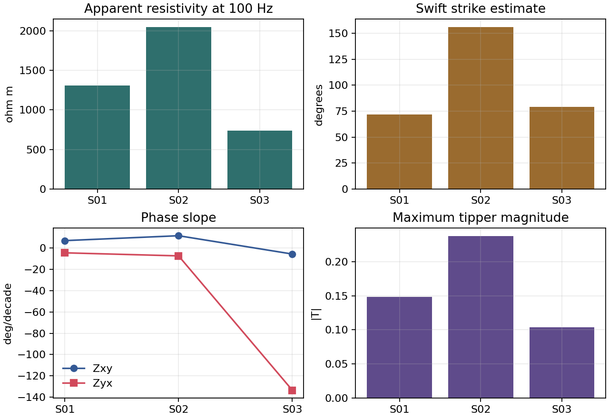

.. _site_computed_diagnostics:

Computed Diagnostics
====================

.. currentmodule:: pycsamt.site.compute

The :mod:`pycsamt.site.compute` module provides lightweight station
diagnostics for :term:`EDI-like object`\ s and site collections. These
functions do not modify the input data. They read :term:`impedance tensor`,
:term:`frequency grid`, and :term:`tipper` arrays, then return compact
numerical summaries for :term:`quality control`, survey preparation, and early
interpretation.

Use computed diagnostics before heavier processing when you need to answer
questions such as:

* does each station have a usable impedance tensor?
* what :term:`geoelectric strike` angle is suggested by the tensor structure?
* what :term:`apparent resistivity` is observed near a frequency of interest?
* does :term:`phase` vary smoothly across the band used for inversion?
* is the tipper response small, large, missing, or spatially variable?

The common thread is reproducibility. Each diagnostic reduces the same recorded
arrays to a small number of documented quantities, so another user can repeat
the calculation from the same EDI files and check the same station table.

Input Contract
--------------

The diagnostics accept either one EDI-like object or an iterable of EDI-like
objects. In practice this means:

* a :class:`pycsamt.seg.edi.EDIFile`;
* a :class:`pycsamt.site.base.Site`;
* a :class:`pycsamt.site.base.Sites` collection;
* a list, tuple, or other iterable of EDI-like objects.

The object must expose the data needed by the selected diagnostic:

.. list-table::
   :header-rows: 1
   :widths: 24 36 40

   * - Diagnostic
     - Required arrays
     - Missing-data behaviour
   * - :func:`strike_estimate`
     - Frequency vector and impedance tensor shaped ``(n_freq, 2, 2)``.
     - Returns ``NaN`` when tensor or frequency data are missing.
   * - :func:`res_at_freq`
     - Frequency vector and impedance tensor shaped ``(n_freq, 2, 2)``.
     - Returns ``NaN`` resistivity values when required data are missing.
   * - :func:`phase_slope`
     - Frequency vector and impedance tensor shaped ``(n_freq, 2, 2)``.
     - Returns ``NaN`` slopes when the requested band is empty or unusable.
   * - :func:`tipper_magnitude`
     - Frequency vector and tipper array shaped ``(n_freq, 2)``.
     - Returns ``NaN`` summary values, or an empty per-frequency result.

For deterministic diagnostics on incomplete data, prepare the site first with
:func:`pycsamt.site.edit.fill_missing` or filter the survey with
:func:`pycsamt.site.selection.keep_finite_z`.

Return Types
------------

The module follows one consistent rule:

.. list-table::
   :header-rows: 1
   :widths: 30 70

   * - Input
     - Return value
   * - Single site
     - A scalar or dictionary.
   * - Iterable of sites
     - A :class:`pandas.DataFrame`.
   * - Iterable of sites with ``api=True``
     - A pyCSAMT ``APIFrame`` wrapper around the DataFrame, when API view
       support is enabled.

The following examples use a small synthetic EDI-like class so the printed
output is reproducible without relying on local survey files. Real workflows
usually replace the ``sites`` list with ``Sites.from_path("path/to/edi")``.

.. code-block:: pycon

   >>> import numpy as np

   >>> from pycsamt.site.compute import (
   ...     phase_slope,
   ...     res_at_freq,
   ...     strike_estimate,
   ...     tipper_magnitude,
   ... )

   >>> class ZBlock:
   ...     def __init__(self, freq, z):
   ...         self.freq = freq
   ...         self.z = z
   ...
   >>> class TipBlock:
   ...     def __init__(self, tipper):
   ...         self.tipper = tipper
   ...
   >>> class DemoSite:
   ...     def __init__(self, name, freq, z, tipper):
   ...         self.name = name
   ...         self.Z = ZBlock(freq, z)
   ...         self.Tip = TipBlock(tipper)
   ...
   ...     def get_section(self, name):
   ...         return getattr(self, name, None)
   ...
   >>> freq = np.array([10.0, 30.0, 100.0, 300.0, 1000.0])
   >>> base = (1 + 0.18j) * np.sqrt(freq / 100.0)
   >>> logf = np.log10(freq / 100.0)

   >>> def make_site(name, scale, diagonal, tip_scale, phase_xy, phase_yx):
   ...     z = np.zeros((freq.size, 2, 2), dtype=complex)
   ...     z[:, 0, 0] = diagonal * base
   ...     z[:, 1, 1] = -0.6 * diagonal * base
   ...     z[:, 0, 1] = (
   ...         scale * base * (1 + 0.05j) * np.exp(1j * phase_xy * logf)
   ...     )
   ...     z[:, 1, 0] = (
   ...         -0.85 * scale * base * (1 - 0.04j)
   ...         * np.exp(1j * phase_yx * logf)
   ...     )
   ...     tip = np.column_stack([
   ...         tip_scale * (0.12 + 0.02j) * np.ones(freq.size),
   ...         tip_scale * (0.06 - 0.01j) * np.linspace(1.0, 1.4, freq.size),
   ...     ])
   ...     return DemoSite(name, freq, z, tip)
   ...
   >>> sites = [
   ...     make_site("S01", 1.00, 0.08, 1.0, 0.12, -0.08),
   ...     make_site("S02", 1.25, 0.15, 1.6, 0.20, -0.13),
   ...     make_site("S03", 0.75, 0.04, 0.7, -0.10, 0.16),
   ... ]

   >>> print("single strike:", strike_estimate(sites[0], method="swift", api=False))
   single strike: 72.0
   >>> print(
   ...     "single rho:",
   ...     {k: round(v, 3) for k, v in res_at_freq(
   ...         sites[0], 150.0, how="nearest", api=False
   ...     ).items()},
   ... )
   single rho: {'res_xy': 1310.819, 'res_yx': 946.216, 'f_used': 100.0}
   >>> print(
   ...     "single slope:",
   ...     {k: round(v, 3) for k, v in phase_slope(
   ...         sites[0], band=(10.0, 1000.0), api=False
   ...     ).items()},
   ... )
   single slope: {'slope_xy': 6.875, 'slope_yx': -4.584}
   >>> print(
   ...     "single tipper:",
   ...     {k: round(v, 3) for k, v in tipper_magnitude(
   ...         sites[0], api=False
   ...     ).items()},
   ... )
   single tipper: {'mean': 0.142, 'median': 0.142, 'max': 0.148}

Diagnostic Map
--------------

.. list-table::
   :header-rows: 1
   :widths: 25 35 40

   * - Function
     - Output
     - Main use
   * - :func:`strike_estimate`
     - ``theta_deg`` in degrees.
     - Quick geoelectric strike estimate for tensor rotation checks and 2-D
       assumption screening.
   * - :func:`res_at_freq`
     - ``res_xy``, ``res_yx``, and ``f_used``.
     - Compare stations at one frequency, select target frequency slices, or
       build compact QC tables.
   * - :func:`phase_slope`
     - ``slope_xy`` and ``slope_yx`` in degrees per frequency decade.
     - Detect abrupt phase behaviour, band-edge problems, or unstable curves.
   * - :func:`tipper_magnitude`
     - Mean, median, max, or per-frequency tipper magnitude.
     - Evaluate vertical magnetic transfer response and possible 3-D
       structure indicators.

Strike Estimate
---------------

:func:`strike_estimate` estimates a 2-D geoelectric strike angle from the
impedance tensor. The tensor at one frequency is

.. math::
   :label: site-diagnostics-impedance-tensor

   \mathbf{Z}(f) =
   \begin{bmatrix}
      Z_{xx}(f) & Z_{xy}(f) \\
      Z_{yx}(f) & Z_{yy}(f)
   \end{bmatrix}.

In an ideal 2-D coordinate frame the diagonal terms are small and the
:term:`off-diagonal component`\ s carry the TE/TM response. The Swift-style
diagnostic therefore rotates the tensor by a trial angle :math:`\theta`,

.. math::
   :label: site-diagnostics-strike-rotation

   \mathbf{Z}'(f,\theta) =
   \mathbf{R}(\theta)\,\mathbf{Z}(f)\,\mathbf{R}(\theta)^\mathsf{T},
   \qquad
   \mathbf{R}(\theta) =
   \begin{bmatrix}
      \cos\theta & \sin\theta \\
      -\sin\theta & \cos\theta
   \end{bmatrix},

and chooses the angle that makes the rotated diagonal energy smallest:

.. math::
   :label: site-diagnostics-strike-objective

   J(\theta) =
   \operatorname{median}_{f}
   \left(
      |Z'_{xx}(f,\theta)|^2 + |Z'_{yy}(f,\theta)|^2
   \right),
   \qquad
   \theta_\mathrm{strike} =
   \arg\min_{\theta \in \{0,\ldots,179\}} J(\theta).

The median over frequency makes the screening value less sensitive to one
noisy band than a simple sum would be. The result is still a diagnostic, not a
final structural interpretation; compare neighbouring stations before rotating
an entire line with :func:`pycsamt.site.edit.rotate` or
:func:`pycsamt.site.edit.rotate_all`.

The minimization in equation :eq:`site-diagnostics-strike-objective` has the
usual 90-degree MT ambiguity: exchanging the two horizontal axes describes
the same pair of principal directions. Compare angles modulo 90 degrees and
use geological continuity, profile direction, and neighbouring stations to
decide which direction should be called strike.

.. code-block:: pycon

   >>> strike_table = strike_estimate(sites, method="swift", api=False)
   >>> print(strike_table.to_string(index=False))
   station method  theta_deg
       S01  swift       72.0
       S02  swift      156.0
       S03  swift       79.0

``method="groom"`` currently uses the same lightweight criterion as
``"swift"``. ``method="phase_diff"`` is a coarse fallback that returns either
0 or 90 degrees from the relative median magnitudes of :math:`Z_{xy}` and
:math:`Z_{yx}`.

Apparent Resistivity At One Frequency
-------------------------------------

:func:`res_at_freq` evaluates apparent resistivity for :math:`Z_{xy}` and
:math:`Z_{yx}` at a requested frequency. For angular frequency
:math:`\omega = 2\pi f`, pyCSAMT uses

.. math::
   :label: site-diagnostics-apparent-resistivity

   \rho_a(f) =
   \frac{|Z(f)|^2}{\mu_0\,\omega}
   =
   \frac{|Z(f)|^2}{\mu_0\,2\pi f},

where :math:`Z(f)` is the selected complex impedance component, :math:`\mu_0`
is magnetic permeability, and :math:`f` is frequency in Hz. Because
:math:`|Z|^2` is used, the sign difference between :math:`Z_{xy}` and
:math:`Z_{yx}` does not by itself change :math:`\rho_a`; differences in their
amplitudes do.

Two frequency-selection modes are available:

``how="nearest"``
   Select the nearest available :term:`native frequency` and report that value
   in ``f_used``.

``how="interp"``
   Compute resistivity at all native frequencies, then interpolate to the
   requested frequency using linear interpolation in frequency.

.. code-block:: pycon

   >>> near = res_at_freq(sites, 150.0, how="nearest", api=False)
   >>> interp = res_at_freq(sites, 150.0, how="interp", api=False)

   >>> print(near.round(3).to_string(index=False))
   station   res_xy   res_yx  f_used
       S01 1310.819  946.216   100.0
       S02 2048.154 1478.463   100.0
       S03  737.336  532.247   100.0
   >>> print(interp.round(3).to_string(index=False))
   station   res_xy   res_yx  f_used
       S01 1310.819  946.216   150.0
       S02 2048.154 1478.463   150.0
       S03  737.336  532.247   150.0

Use ``nearest`` when preserving the exact sampled frequency axis matters. Use
``interp`` when stations have slightly different grids and you need one common
comparison frequency across the survey.

The resistivity columns happen to be identical in these two tables because
the synthetic impedance amplitude is proportional to :math:`\sqrt f`; after
division by :math:`f` in equation
:eq:`site-diagnostics-apparent-resistivity`, its apparent resistivity is
constant. The different ``f_used`` values still expose the distinct selection
rules. A field response that varies with frequency will generally produce
different interpolated values as well.

Phase Slope
-----------

:func:`phase_slope` summarizes how phase changes across a frequency band. For
each off-diagonal component it computes

.. math::
   :label: site-diagnostics-phase

   \phi(f) = \arg(Z(f))\,\frac{180}{\pi},

then fits a straight line against logarithmic frequency:

.. math::
   :label: site-diagnostics-phase-slope

   \phi(f_i) \approx a\,\log_{10}(f_i) + b,
   \qquad
   a =
   \frac{\sum_i (x_i-\bar{x})(\phi_i-\bar{\phi})}
        {\sum_i (x_i-\bar{x})^2},
   \quad x_i=\log_{10}(f_i).

The reported slope :math:`a` is measured in degrees per
:term:`frequency decade`. A value near zero means phase is nearly flat over the
selected band; a large positive or negative value means the component changes
rapidly with frequency and should be inspected before inversion.

.. code-block:: pycon

   >>> slopes = phase_slope(sites, band=(10.0, 1000.0), api=False)
   >>> steep = slopes[
   ...     slopes["slope_xy"].abs().gt(30.0)
   ...     | slopes["slope_yx"].abs().gt(30.0)
   ... ]

   >>> print(slopes.round(3).to_string(index=False))
   station  slope_xy  slope_yx
       S01     6.875    -4.584
       S02    11.459    -7.448
       S03    -5.730  -133.479
   >>> print("steep rows:", len(steep))
   steep rows: 1

The function does not unwrap phase. If phase wraps are important for your
dataset, inspect the curves directly before treating the slope as a physical
trend. In particular, the large negative ``S03`` value is produced by a phase
branch crossing rather than a smooth 133-degree-per-decade physical change.
Unwrap or mask that component before fitting if continuity across the branch
is scientifically justified.

Tipper Magnitude
----------------

:func:`tipper_magnitude` computes the magnitude of the complex tipper vector:

.. math::
   :label: site-diagnostics-tipper-magnitude

   \|\mathbf{T}(f)\| =
   \sqrt{|T_x(f)|^2 + |T_y(f)|^2}.

The square root combines the two horizontal transfer components into one
station-level amplitude per frequency. By default pyCSAMT summarizes those
amplitudes with mean, median, and maximum values; set ``per_freq=True`` when
the frequency-by-frequency curve is needed.

.. code-block:: pycon

   >>> summary = tipper_magnitude(sites, api=False)
   >>> long_table = tipper_magnitude(sites, per_freq=True, api=False)

   >>> print(summary.round(3).to_string(index=False))
   station  mean  median   max
       S01 0.142   0.142 0.148
       S02 0.227   0.227 0.238
       S03 0.099   0.099 0.104
   >>> print(long_table.head().round(3).to_string(index=False))
   station   freq   mag
       S01   10.0 0.136
       S01   30.0 0.139
       S01  100.0 0.142
       S01  300.0 0.145
       S01 1000.0 0.148

The ``mean`` gives the broad response level, ``median`` is less sensitive to
isolated spikes, and ``max`` highlights the strongest tipper band. Absence is
kept distinct from a measured zero response:

.. code-block:: pycon

   >>> saved_tip = sites[0].Tip
   >>> sites[0].Tip = None
   >>> print(tipper_magnitude(sites[0], api=False))
   {'mean': nan, 'median': nan, 'max': nan}
   >>> sites[0].Tip = saved_tip

Restoring the synthetic tipper keeps the later examples independent of this
missing-data check. In a survey table, the three ``NaN`` values mean “not
available”; replacing them with zero would incorrectly assert that a valid
vertical transfer response was measured and found to vanish.

Plotting The Diagnostics
------------------------

The compute module intentionally returns tables rather than owning a plotting
API. When a figure helps a report reader, plot the returned tables directly.
The example below uses a 2 by 2 grid so related diagnostics appear together.

.. code-block:: pycon

   >>> import matplotlib.pyplot as plt

   >>> rho = res_at_freq(sites, 100.0, how="nearest", api=False)
   >>> slopes = phase_slope(sites, band=(10.0, 1000.0), api=False)
   >>> tip = tipper_magnitude(sites, api=False)
   >>> strike = strike_estimate(sites, api=False)

   >>> fig, ax = plt.subplots(2, 2, figsize=(8, 5.5), constrained_layout=True)
   >>> ax = ax.ravel()

   >>> _ = ax[0].bar(rho["station"], rho["res_xy"])
   >>> _ = ax[0].set_title("Apparent resistivity at 100 Hz")
   >>> _ = ax[0].set_ylabel("ohm m")

   >>> _ = ax[1].bar(strike["station"], strike["theta_deg"])
   >>> _ = ax[1].set_title("Swift strike estimate")
   >>> _ = ax[1].set_ylabel("degrees")

   >>> _ = ax[2].plot(slopes["station"], slopes["slope_xy"], marker="o", label="Zxy")
   >>> _ = ax[2].plot(slopes["station"], slopes["slope_yx"], marker="s", label="Zyx")
   >>> _ = ax[2].set_title("Phase slope")
   >>> _ = ax[2].set_ylabel("deg/decade")
   >>> _ = ax[2].legend(frameon=False)

   >>> _ = ax[3].bar(tip["station"], tip["max"])
   >>> _ = ax[3].set_title("Maximum tipper magnitude")
   >>> _ = ax[3].set_ylabel("|T|")

   >>> for axis in ax:
   ...     axis.grid(True, alpha=0.25)
   ...
   >>> fig.savefig("computed_diagnostics_grid.png", dpi=160)

   Computed diagnostics from the reproducible synthetic station set. The grid
   layout keeps resistivity, strike, phase-slope, and tipper checks visible
   together instead of separating them into unrelated figures.

Read across the panels rather than ranking a station from one bar alone.
``S02`` has both the largest apparent resistivity and tipper amplitude, and
its 156-degree estimate is separated from the roughly 72--79 degree estimates
at ``S01`` and ``S03``. After reducing strike modulo 90 degrees, however,
``S02`` is near 66 degrees, so the apparent disagreement is modest. ``S03``
is the clearest QC target because only its ``Zyx`` phase slope departs sharply;
that component-level anomaly should be inspected before any station-wide
rejection.

APIFrame Output
---------------

For collection inputs, pass ``api=True`` when the result should carry pyCSAMT
API metadata in addition to tabular values.

.. code-block:: pycon

   >>> strike = strike_estimate(sites, api=True)
   >>> rho = res_at_freq(sites, 100.0, api=True)
   >>> slopes = phase_slope(sites, (10.0, 1000.0), api=True)
   >>> tipper = tipper_magnitude(sites, api=True)

   >>> print(strike.kind)
   site.compute.strike
   >>> print(rho.kind)
   site.compute.resistivity
   >>> print(slopes.kind)
   site.compute.phase_slope
   >>> print(tipper.kind)
   site.compute.tipper

This is useful when diagnostics are emitted by CLI commands, agents, or
pipelines that preserve result provenance.

Quality-Control Workflow
------------------------

In a real survey, computed diagnostics usually sit between selection/editing
and reporting. The workflow is deliberately ordinary: filter unusable rows,
make missing values explicit when needed, compute station tables, and merge the
results into one review table.

.. code-block:: pycon

   >>> strike = strike_estimate(sites, api=False)
   >>> rho100 = res_at_freq(sites, 100.0, how="nearest", api=False)
   >>> slopes = phase_slope(sites, band=(10.0, 1000.0), api=False)
   >>> tipper = tipper_magnitude(sites, api=False)

   >>> qc = (
   ...     strike
   ...     .merge(rho100, on="station", how="outer")
   ...     .merge(slopes, on="station", how="outer")
   ...     .merge(tipper, on="station", how="outer")
   ... )

   >>> print(qc.round(3).to_string(index=False))
   station method  theta_deg   res_xy   res_yx  f_used  slope_xy  slope_yx  mean  median   max
       S01  swift       72.0 1310.819  946.216   100.0     6.875    -4.584 0.142   0.142 0.148
       S02  swift      156.0 2048.154 1478.463   100.0    11.459    -7.448 0.227   0.227 0.238
       S03  swift       79.0  737.336  532.247   100.0    -5.730  -133.479 0.099   0.099 0.104

Common Mistakes
---------------

Using diagnostics as final interpretation
   These functions are quick screening tools. Confirm important decisions with
   maps, pseudo-sections, tensor plots, and inversion sensitivity tests.

Mixing frequency axes without checking ``f_used``
   In ``nearest`` mode, different stations may use different native
   frequencies. Always inspect ``f_used`` before comparing values.

Ignoring missing arrays
   Missing Z or tipper data are reported as ``NaN`` rather than raising hard
   failures. Filter or fill intentionally before trusting the table.

Over-reading phase slope
   A large phase slope may indicate structure, noise, phase wrapping, or a bad
   frequency band. Use it as a prompt for inspection, not as a standalone
   classifier.

Next Pages
----------

Continue with:

* :doc:`selection` for selecting stations before diagnostics;
* :doc:`editing` for preparing tensors, frequencies, names, and coordinates;
* :doc:`export_reporting` for writing diagnostic summaries into survey
  deliverables;
* :doc:`../../theory/impedance_tensor` for the physical meaning of impedance,
  apparent resistivity, phase, and tensor components.
