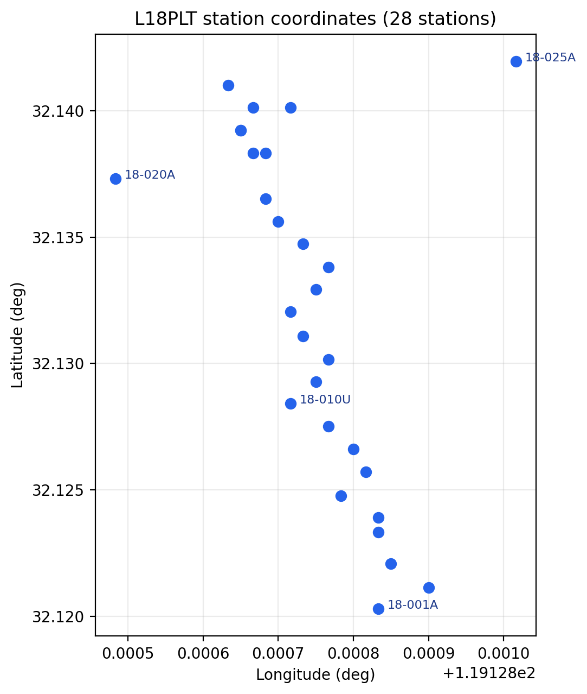
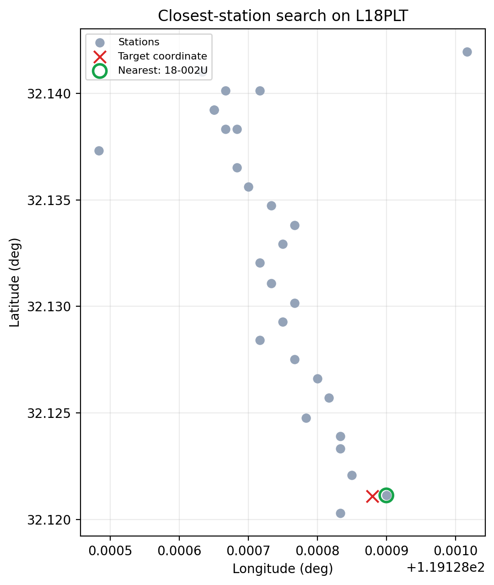

.. _site_containers:

Site Containers
===============

.. currentmodule:: pycsamt.site.base

The :mod:`pycsamt.site.base` module provides the station-centric containers
used throughout the site layer. These containers wrap :term:`EDI` objects
without replacing the lower-level EDI parser. Their purpose is to make common
survey operations easier: station lookup, coordinate access, tensor
inspection, DataFrame export, bulk selection, profile preparation, and
writing cleaned sites back to disk.

The main objects are:

.. list-table::
   :header-rows: 1
   :widths: 24 34 42

   * - Object
     - Scope
     - Main use
   * - :class:`SiteMixin`
     - One :term:`EDI-like object` site.
     - Shared accessors for name, coordinates, frequency, impedance,
       resistivity, phase, tipper, metadata, quality flags, and DataFrame
       export.
   * - :class:`Site`
     - One concrete station.
     - High-level wrapper around one :class:`pycsamt.seg.edi.EDIFile` with a
       stable station identity and convenience edit helpers.
   * - :class:`Sites`
     - Many stations.
     - Ordered collection wrapper with integer indexing, name lookup,
       selection, batch edits, topography alignment, profile conversion, and
       export.
   * - :func:`to_sites`
     - API boundary helper.
     - Coerce compatible EDI-like inputs into a :class:`Sites` container.
   * - :func:`to_edis`
     - API boundary helper.
     - Unwrap :class:`Site` or :class:`Sites` objects back to raw EDI objects
       or an :class:`pycsamt.seg.collection.EDICollection`.

Where Containers Fit
--------------------

The site containers sit above :mod:`pycsamt.seg` and below the higher-level
workflow layers.

.. list-table::
   :header-rows: 1
   :widths: 26 37 37

   * - Layer
     - Main object
     - Responsibility
   * - EDI parsing
     - :class:`pycsamt.seg.edi.EDIFile`
     - Read, store, and write one :term:`EDI` file.
   * - EDI collection
     - :class:`pycsamt.seg.collection.EDICollection`
     - Discover and parse many EDI files from paths, folders, or glob
       patterns.
   * - Site layer
     - :class:`Site`, :class:`Sites`
     - Expose station-oriented accessors, editing, filtering, summaries, and
       survey preparation helpers.
   * - Downstream workflows
     - Selection, diagnostics, export, profiles, inversion, agents.
     - Use prepared site containers as consistent inputs.

Use :class:`EDIFile` or :class:`EDICollection` when you are primarily parsing
SEG-EDI data. Use :class:`Site` or :class:`Sites` when you are preparing,
inspecting, selecting, or editing station data.

Creating One Site
-----------------

Create a :class:`Site` from a parsed :class:`pycsamt.seg.edi.EDIFile`. The
examples on this page use one line of the bundled WILLY AMT survey,
``data/AMT/WILLY_DATA/L18PLT``, so every printed value below is real output
from real stations rather than a sketch.

.. code-block:: python
   :linenos:

   from pycsamt.seg.edi import EDIFile
   from pycsamt.site.base import Site

   edi = EDIFile("data/AMT/WILLY_DATA/L18PLT/18-001A.edi")
   site = Site(edi)

   print(site.name)
   print(site.coords)
   print(site.summary())

.. code-block:: text

   18-001A
   (32.1203, 119.12883333333333, 99.0)
   {'name': '18-001A', 'nfreq': 53, 'lat': 32.1203, 'lon': 119.12883333333333,
    'elev': 99.0, 'components': ['Zxx', 'Zxy', 'Zyx', 'Zyy'], 'tipper': False}

The wrapper keeps the original EDI object available as ``site.edi`` and
through :meth:`Site.to_edi`. Prefer the :class:`Site` accessors for routine
work, and unwrap to EDI only when you need lower-level EDI functionality.

.. code-block:: python
   :linenos:

   raw = site.to_edi()
   detached = site.to_edi(copy=True)

Station Identity
----------------

:term:`Station identity` is normalized from EDI ``HEAD`` fields. The name
resolution order is:

#. ``dataid``;
#. ``station``;
#. ``sitename``;
#. ``name``;
#. ``STATION``;
#. the file stem, when header fields are missing.

When a :class:`Site` is created, the constructor attempts to stabilize the EDI
header so that ``dataid`` and, when absent, ``station`` match the resolved
site stem. This makes name lookup and downstream joins more predictable.

.. code-block:: python
   :linenos:

   site = Site(EDIFile("data/AMT/WILLY_DATA/L18PLT/18-012A.edi"))

   print(site.name)
   print(site.meta)

.. code-block:: text

   18-012A
   {'station': '18-012A', 'lat': 32.13016666666667, 'lon': 119.12876666666666,
    'elev': 126.0, 'dataid': '18-012A'}

Here ``dataid`` already agreed with the file stem, so stabilization left it
untouched; on a file where the header disagreed with the stem, this same
step is what keeps ``site.name`` predictable. Rename a site with
:meth:`Site.rename`:

.. code-block:: python
   :linenos:

   renamed = site.rename("L01_012")

   print(site.name)      # original unchanged
   print(renamed.name)   # new wrapper

.. code-block:: text

   18-012A
   L01_012

Use ``inplace=True`` when the existing wrapper should be modified:

.. code-block:: python
   :linenos:

   site.rename("L01_012", inplace=True)

Coordinates
-----------

Coordinates are exposed as ``(lat, lon, elev)`` in decimal degrees and meters.
Continuing with the renamed ``site`` from the previous section:

.. code-block:: python
   :linenos:

   lat, lon, elev = site.coords
   print(lat, lon, elev)

.. code-block:: text

   32.13016666666667 119.12876666666666 126.0

   The 28 stations of the ``L18PLT`` line plotted from ``site.coords``.
   Real field lines are rarely perfectly straight; ``18-020A`` sits off
   to one side, which is exactly the kind of thing a quick coordinate
   scatter catches before it surprises a profile or map view later.

Update coordinates with :meth:`Site.set_coords`:

.. code-block:: python
   :linenos:

   moved = site.set_coords(10.25, 20.75, 640.0)
   print(moved.coords)

.. code-block:: text

   (10.25, 20.75, 640.0)

Like :meth:`Site.rename`, coordinate updates are copy-returning by default and
in-place when requested:

.. code-block:: python
   :linenos:

   site.set_coords(10.25, 20.75, 640.0, inplace=True)

Array Accessors
---------------

The container exposes the most common station arrays as properties.

.. list-table::
   :header-rows: 1
   :widths: 24 36 40

   * - Property
     - Meaning
     - Shape convention
   * - ``freq``
     - :term:`Frequency grid` in Hz.
     - ``(n_freq,)``.
   * - ``z``
     - Complex :term:`impedance tensor`.
     - Usually ``(n_freq, 2, 2)``; flattened internally as
       ``Zxx, Zxy, Zyx, Zyy`` when exported.
   * - ``z_err``
     - Impedance uncertainty.
     - Aligned with ``z`` when present.
   * - ``rho``
     - :term:`Apparent resistivity`.
     - Aligned with impedance components.
   * - ``phase``
     - Impedance :term:`phase` in degrees.
     - Aligned with impedance components.
   * - ``tipper``
     - Vertical magnetic transfer function (:term:`tipper`).
     - ``(n_freq, 2)`` with ``Tx`` and ``Ty``.
   * - ``meta``
     - Header and optional ``INFO`` metadata.
     - Python dictionary.

Example:

.. code-block:: python
   :linenos:

   print(site.freq)
   print(site.z.shape if site.z is not None else "no Z")
   print(site.quality_flags())

.. code-block:: text

   [1.040e+04 8.707e+03 7.289e+03 6.102e+03 5.108e+03 4.277e+03 3.580e+03
    2.997e+03 2.509e+03 2.101e+03 1.759e+03 1.472e+03 1.233e+03 1.032e+03
    8.639e+02 7.232e+02 6.054e+02 5.069e+02 4.243e+02 3.552e+02 2.974e+02
    2.490e+02 2.084e+02 1.745e+02 1.461e+02 1.223e+02 1.024e+02 8.571e+01
    7.175e+01 6.007e+01 5.029e+01 4.210e+01 3.525e+01 2.951e+01 2.470e+01
    2.068e+01 1.731e+01 1.449e+01 1.213e+01 1.016e+01 8.504e+00 7.119e+00
    5.960e+00 4.990e+00 4.177e+00 3.497e+00 2.928e+00 2.451e+00 2.052e+00
    1.718e+00 1.438e+00 1.204e+00 1.008e+00]
   (53, 2, 2)
   {'has_freq': True, 'has_z': True, 'has_z_err': True, 'has_rho': True,
    'has_phase': True, 'has_tipper': False}

This station carries the full 53-frequency AMT band and a complete impedance
tensor, but no tipper -- ``has_tipper`` is ``False`` rather than missing or
raising, which is what lets the next section branch on it safely.

Quality And Component Checks
----------------------------

Use :meth:`Site.quality_flags` for coarse array availability checks.

.. code-block:: python
   :linenos:

   flags = site.quality_flags()
   print(flags)

   if not flags["has_z"]:
       print(f"{site.name} has no finite impedance tensor")

.. code-block:: text

   {'has_freq': True, 'has_z': True, 'has_z_err': True, 'has_rho': True,
    'has_phase': True, 'has_tipper': False}

Nothing is printed by the ``if`` branch here, because ``has_z`` is ``True``
for this station; the branch only fires for a station whose impedance tensor
is missing or non-finite. Use :meth:`Site.has_component` when a specific
impedance or tipper component matters.

.. code-block:: python
   :linenos:

   if site.has_component("Zxy") and site.has_component("Zyx"):
       print("off-diagonal impedance components are available")

   if site.has_component("tipper"):
       print("tipper is available")

.. code-block:: text

   off-diagonal impedance components are available

The second ``if`` prints nothing, consistent with ``has_tipper`` being
``False`` above -- ``has_component("tipper")`` and ``quality_flags()`` agree
because they read the same underlying arrays. Supported impedance component
names are ``Zxx``, ``Zxy``, ``Zyx``, and ``Zyy``: the diagonal pair and the
:term:`off-diagonal component`\ s ``Zxy``/``Zyx`` checked just above. Tipper
checks accept ``tip``, ``tx``, ``ty``, and ``tipper``.

DataFrame Export
----------------

:meth:`Site.to_dataframe` exports core arrays into frequency-indexed
:class:`pandas.DataFrame` objects. This is the quickest way to inspect one
station in a notebook or build masks for editing.

.. code-block:: python
   :linenos:

   z = site.to_dataframe("z")
   rp = site.to_dataframe("resphase")
   tip = site.to_dataframe("tipper")

   print(z.head())
   print(rp.head())
   print(tip.head())

.. code-block:: text

                     Zxx             Zxy             Zyx           Zyy
   f
   10400.0  51.63+94.43j  1737.0+ 922.4j -2235.0- 754.6j -132.7+278.8j
   8707.0   40.43+70.87j  1681.0+ 929.9j -2176.0- 745.4j -177.3+287.3j
   7289.0   21.00+34.14j  1558.0+ 938.8j -2102.0- 773.9j -239.8+253.6j
   6102.0   47.11+16.06j  1383.0+ 922.5j -2032.0- 783.7j -237.9+180.2j
   5108.0   61.44-90.83j  1261.0+ 844.8j -1776.0- 602.6j -130.9+263.3j

             rho_zxx    phi_zxx    rho_zxy  ...     phi_zyx   rho_zyy     phi_zyy
   f                                        ...
   10400.0  0.222744  61.332181  74.384438  ... -161.343845  1.833437  115.452974
   8707.0   0.152915  60.296056  84.770300  ... -161.090840  2.618045  121.679771
   7289.0   0.044081  58.403736  90.786375  ... -159.787647  3.342489  133.397901
   6102.0   0.081196  18.824462  90.583260  ... -158.909414  2.919320  142.857487
   5108.0   0.470829 -55.924459  90.203917  ... -161.257833  3.385345  116.434339

   [5 rows x 8 columns]
   Empty DataFrame
   Columns: []
   Index: [10400.0, 8707.0, 7289.0, 6102.0, 5108.0]

``tip`` comes back with no columns at all: this station has no tipper, so
``to_dataframe("tipper")`` returns an empty frame that still carries the
correct frequency index rather than raising. Note ``rho_zxx`` here is small
and ``phi_zxx`` swings from positive to negative between rows -- the diagonal
components are far noisier than the off-diagonal ``rho_zxy``/``rho_zyx``
pair, which is typical and part of why interpretation usually leans on the
off-diagonal components first. The accepted ``kind`` values are:

.. list-table::
   :header-rows: 1
   :widths: 24 28 48

   * - Kind
     - Aliases
     - Columns
   * - ``"z"``
     - ``"imp"``, ``"impedance"``
     - ``Zxx``, ``Zxy``, ``Zyx``, ``Zyy``.
   * - ``"resphase"``
     - ``"rp"``, ``"rho_phase"``
     - ``rho_zxx``, ``phi_zxx``, ``rho_zxy``, ``phi_zxy``, and the
       equivalent ``Zyx``/``Zyy`` columns.
   * - ``"tipper"``
     - ``"tip"``, ``"t"``
     - ``Tx``, ``Ty``.

Pass ``api=True`` when a pyCSAMT ``APIFrame`` is required:

.. code-block:: python
   :linenos:

   frame = site.to_dataframe("z", api=True)
   print(frame.kind)
   print(frame.df.head())

.. code-block:: text

   site.z
                     Zxx             Zxy             Zyx           Zyy
   f
   10400.0  51.63+94.43j  1737.0+ 922.4j -2235.0- 754.6j -132.7+278.8j
   8707.0   40.43+70.87j  1681.0+ 929.9j -2176.0- 745.4j -177.3+287.3j
   7289.0   21.00+34.14j  1558.0+ 938.8j -2102.0- 773.9j -239.8+253.6j
   6102.0   47.11+16.06j  1383.0+ 922.5j -2032.0- 783.7j -237.9+180.2j
   5108.0   61.44-90.83j  1261.0+ 844.8j -1776.0- 602.6j -130.9+263.3j

``frame.kind`` is a stable tag (``"site.z"``) rather than a class name, so
code that branches on it does not need to import :class:`Site` just to
recognize what a frame holds.

Creating A Collection
---------------------

Use :class:`Sites` when working with more than one station.

.. code-block:: python
   :linenos:

   from pycsamt.seg.edi import EDIFile
   from pycsamt.site.base import Sites

   edis = [
       EDIFile("data/AMT/WILLY_DATA/L18PLT/18-001A.edi"),
       EDIFile("data/AMT/WILLY_DATA/L18PLT/18-002U.edi"),
       EDIFile("data/AMT/WILLY_DATA/L18PLT/18-003A.edi"),
   ]

   sites = Sites(edis)

   print(len(sites))
   print([site.name for site in sites])

.. code-block:: text

   3
   ['18-001A', '18-002U', '18-003A']

If your input is a directory or glob pattern, parse it first with
:class:`pycsamt.seg.collection.EDICollection`, then wrap it:

.. code-block:: python
   :linenos:

   from pycsamt.seg.collection import EDICollection
   from pycsamt.site.base import Sites

   collection = EDICollection.from_sources("data/AMT/WILLY_DATA/L18PLT")
   sites = Sites(collection)

   print(len(sites))

.. code-block:: text

   28

That is the whole ``L18PLT`` line rather than the three-station subset above
-- ``sites`` is reassigned here, and the rest of this page continues from
this 28-station collection. For API boundaries that may receive several
input types, use :func:`to_sites`:

.. code-block:: python
   :linenos:

   from pycsamt.site.base import to_sites

   sites = to_sites(collection)
   print(len(sites))

.. code-block:: text

   28

Unwrapping Back To EDI
----------------------

The site layer is intentionally reversible. Use :func:`to_edis` when a
workflow has prepared, filtered, renamed, or edited :class:`Site` objects but
the next function expects raw EDI objects.

.. code-block:: python
   :linenos:

   from pycsamt.site.base import to_edis

   raw = to_edis(site)
   edis = to_edis(sites)
   collection = to_edis(sites, as_collection=True)

   print(type(raw).__name__)
   print(len(edis))
   print(type(collection).__name__, len(collection))

.. code-block:: text

   EDIFile
   28
   EDICollection 28

Here ``site`` is the single ``L01_012`` wrapper from the top of this page, so
``raw`` is one :class:`~pycsamt.seg.edi.EDIFile`; ``sites`` is the
28-station collection, so ``edis`` is a plain list and ``collection`` is an
:class:`~pycsamt.seg.collection.EDICollection` of the same length. By
default, unwrapping is shallow: the returned EDI objects are the same
objects stored by the wrappers. Pass ``copy=True`` when the caller should be
able to mutate the returned objects independently.

.. code-block:: python
   :linenos:

   detached_edis = to_edis(sites, copy=True)
   print(len(detached_edis))

.. code-block:: text

   28

The helper also accepts mixed inputs, path-like sources, raw EDI objects, and
existing :class:`~pycsamt.seg.collection.EDICollection` instances. Invalid
items are skipped unless ``strict=True`` is requested.

.. code-block:: python
   :linenos:

   edis = to_edis([site, raw, "data/AMT/WILLY_DATA/L18PLT"], strict=False)
   print(len(edis))

   checked = to_edis(sites, strict=True, progress=True)
   print(len(checked))

.. code-block:: text

   29
   28

``site`` and ``raw`` both point at the same underlying ``L01_012`` EDI
object -- ``raw`` was produced by ``site.to_edi()`` above, so it is not a
second station -- and the directory contributes the other 28, for 29 total
rather than 30. ``progress=True`` draws a text progress bar while unwrapping;
it does not change ``checked`` itself, which is still the 28-station list.
Use the collection methods when you are already holding a :class:`Sites`
instance:

.. code-block:: python
   :linenos:

   edis = sites.to_edis()
   collection = sites.to_edicollection(copy=True)

   print(len(edis))
   print(type(collection).__name__, len(collection))

.. code-block:: text

   28
   EDICollection 28

``Sites.from_any`` is another entry point when you want pyCSAMT's session
normalization to interpret heterogeneous inputs:

.. code-block:: python
   :linenos:

   sites = Sites.from_any("data/AMT/WILLY_DATA/L18PLT")
   print(len(sites))

.. code-block:: text

   28

Collection Lookup
-----------------

:class:`Sites` preserves input order and supports integer indexing,
case-insensitive name lookup, and safe lookup.

.. code-block:: python
   :linenos:

   first = sites[0]
   same = sites.by_index(0)
   station = sites["18-002u"]
   maybe = sites.get("missing")

   print(first.name)
   print(same.name)
   print(station.name)
   print(maybe is None)

.. code-block:: text

   18-001A
   18-001A
   18-002U
   True

The lookup ``"18-002u"`` finds ``18-002U`` regardless of case, which is the
same case-insensitive matching :meth:`Site.rename` and :meth:`Sites.select`
rely on for :term:`station identity`. ``sites["missing"]`` raises
``KeyError``. Use :meth:`Sites.get` when missing stations are acceptable.

The :meth:`Sites.as_list` method returns the underlying EDI objects:

.. code-block:: python
   :linenos:

   edi_objects = sites.as_list()
   print(len(edi_objects), type(edi_objects[0]).__name__)

.. code-block:: text

   28 EDIFile

This is useful when passing a prepared collection into utilities that still
operate directly on EDI objects. For new API boundaries, prefer
:meth:`Sites.to_edis` or :func:`to_edis` because they also support copying,
progress display, strict validation, and collection output.

Mapping And Selection
---------------------

Use :meth:`Sites.map` to apply a lightweight operation to every station:

.. code-block:: python
   :linenos:

   names = sites.map(lambda site: site.name)
   coverage = sites.map(lambda site: site.summary()["nfreq"])

   print(names)
   print(coverage[:8], "...")

.. code-block:: text

   ['18-001A', '18-002U', '18-003A', '18-004A', '18-005U', '18-006A',
    '18-007U', '18-008U', '18-009A', '18-010U', '18-011A', '18-012A',
    '18-013U', '18-014A', '18-015U', '18-016A', '18-017U', '18-018A',
    '18-019U', '18-020A', '18-021B', '18-021U', '18-022U', '18-022V',
    '18-023A', '18-023V', '18-024U', '18-025A']
   [53, 53, 53, 53, 53, 53, 53, 53] ...

Every station on this line shares the same 53-row :term:`frequency grid`, so
``coverage`` is a flat list of ``53``\ s here; on a mixed survey this is the
first place a shorter frequency run would show up. For simple collection
filtering, use :meth:`Sites.select`:

.. code-block:: python
   :linenos:

   subset = sites.select(names=["18-001A", "18-003A"])
   with_zxy = sites.select(predicate=lambda site: site.has_component("Zxy"))

   print(len(subset), [s.name for s in subset])
   print(len(with_zxy))

.. code-block:: text

   2 ['18-001A', '18-003A']
   28

All 28 stations keep an off-diagonal ``Zxy`` component here, so
``with_zxy`` comes back the same size as ``sites``; on noisier data this is
a quick way to see how many stations would survive a component requirement.
For richer selection by glob names, frequency coverage, coordinates,
:term:`chainage`, or data quality, use the functions documented in
:doc:`selection`.

Bulk Edits
----------

:meth:`Sites.edit_all` applies common operations across the collection.

.. code-block:: python
   :linenos:

   renamed = sites.edit_all(
       rename=lambda name: f"LINE01_{name}",
       inplace=False,
   )

   sliced = sites.edit_all(
       freq_slice=slice(1, None),
       inplace=False,
   )

   print([s.name for s in renamed][:5])
   print(len(sliced[0].freq), len(sites[0].freq))

.. code-block:: text

   ['LINE01_18-001A', 'LINE01_18-002U', 'LINE01_18-003A', 'LINE01_18-004A',
    'LINE01_18-005U']
   52 53

``freq_slice=slice(1, None)`` drops the first (highest) frequency from every
station, so each sliced site carries 52 rows against 53 on the untouched
``sites``. The optional ``mask`` callback receives the output of
``site.to_dataframe("z")`` and returns a boolean mask. Rows where the mask is
``False`` are set to ``NaN`` in the impedance tensor.

.. code-block:: python
   :linenos:

   def keep_lower_frequencies(frame):
       cutoff = frame.index.to_series().median()
       return frame.index <= cutoff

   masked = sites.edit_all(mask=keep_lower_frequencies)
   print(masked[0].to_dataframe("z").notna().sum())

.. code-block:: text

   Zxx    27
   Zxy    27
   Zyx    27
   Zyy    27
   dtype: int64

Half of the 53 rows survive the median cutoff, as expected for a mask built
from the frame's own median. Use :mod:`pycsamt.site.edit` when you need more
explicit editing functions such as tensor rotation, coordinate table
assignment, frequency range selection, or resistivity/phase recomputation.

Topography Alignment
--------------------

:meth:`Sites.with_topography` updates site coordinates and elevation from a
table-like object. Station identifiers are matched by normalized names.

.. code-block:: python
   :linenos:

   import pandas as pd

   print(sites["18-001A"].coords)
   print(sites["18-002U"].coords)

   topo = pd.DataFrame(
       {
           "station": ["18-001A", "18-002U"],
           "latitude": [32.1205, 32.1212],
           "longitude": [119.12890, 119.12895],
           "elevation": [101.5, 112.0],
       }
   )

   updated = sites.with_topography(topo, inplace=False)
   print(updated["18-001A"].coords)
   print(updated["18-002U"].coords)

.. code-block:: text

   (32.1203, 119.12883333333333, 99.0)
   (32.12113333333333, 119.12889999999999, 110.0)
   (32.1205, 119.1289, 101.5)
   (32.1212, 119.12895, 112.0)

Only the two named stations moved; the other 26 stations in ``sites`` keep
their original EDI-header coordinates because unmatched stations are left
unchanged. Use this after loading raw EDI files when field GPS or corrected
elevation tables are authoritative.

Closest Site
------------

:meth:`Sites.closest` finds the nearest station to a target coordinate using
:term:`geodetic distance`, which is what makes it meaningful to search by
plain latitude/longitude rather than a projected offset.

.. code-block:: python
   :linenos:

   target_lat, target_lon = 32.1211, 119.12888
   nearest = sites.closest(lat=target_lat, lon=target_lon)

   if nearest is not None:
       print(nearest.name)

.. code-block:: text

   18-002U

The target here is a stand-in for a field GPS fix a few metres from
``18-002U``'s header coordinate; ``closest`` resolves it to that station
without needing an exact match. Add ``tol`` in meters when a maximum
distance is required:

.. code-block:: python
   :linenos:

   nearest = sites.closest(lat=target_lat, lon=target_lon, tol=50.0)
   print(nearest.name if nearest is not None else None)

   too_strict = sites.closest(lat=target_lat, lon=target_lon, tol=1.0)
   print(too_strict)

.. code-block:: text

   18-002U
   None

If the closest station is farther than ``tol``, the method returns ``None``
-- here a 1-metre tolerance is tighter than the actual offset, so the second
call comes back empty even though a station clearly exists nearby.

   Target coordinate (red cross) resolved to the nearest station (green
   ring) among the 28 stations of ``L18PLT``.

Profiles
--------

:meth:`Sites.to_profile` converts station coordinates into a survey-line
profile for line-ordered work, sorting stations by :term:`chainage` rather
than by name. An origin and azimuth define the line; a natural choice is the
first station and the :term:`geodetic distance` bearing toward the last one:

.. code-block:: python
   :linenos:

   from pycsamt.site.location import bearing

   first_s = sites[0]
   last_s = sites.by_index(len(sites) - 1)
   azimuth = bearing(first_s.coords[:2], last_s.coords[:2])
   print(round(azimuth, 3))

.. code-block:: text

   0.411

An azimuth near zero confirms ``L18PLT`` runs almost due north, which is
consistent with the mostly-vertical scatter in the coordinate plot above.

.. code-block:: python
   :linenos:

   origin = (first_s.coords[0], first_s.coords[1])
   profile = sites.to_profile(origin=origin, azimuth=azimuth)

   if hasattr(profile, "chainages"):
       for name, chainage in sorted(
           profile.chainages.items(), key=lambda kv: kv[1]
       )[:6]:
           print(name, round(chainage, 2))
   else:
       print([site.name for site in profile["sites"]])

.. code-block:: text

   18-001A 0.0
   18-002U 92.54
   18-003A 197.96
   18-004A 336.69
   18-005U 399.59
   18-006A 495.75

``18-001A`` sits at the origin by construction, so its chainage is ``0.0``;
each later station's chainage is its signed distance along ``azimuth`` from
that origin. When :class:`pycsamt.site.profile.Profile` is available, the
method returns a rich profile object exposing ``chainages`` as a
``{station: metres}`` dictionary, as above. Otherwise it returns a fallback
dictionary containing ``origin``, ``azimuth``, and line-ordered ``sites``.

For more control over profile inference, chainage, and spacing statistics,
continue to :doc:`location_profile`.

Writing Sites
-------------

:meth:`Sites.write` writes one EDI file per station into a directory.

.. code-block:: python
   :linenos:

   paths = sites.write(
       "outputs/clean_edi",
       template="{station}.edi",
       exist_ok=True,
   )

   for path in paths:
       print(path)

.. code-block:: text

   outputs/clean_edi/18-001A.edi
   outputs/clean_edi/18-002U.edi
   outputs/clean_edi/18-003A.edi
   outputs/clean_edi/18-004A.edi
   outputs/clean_edi/18-005U.edi
   ...
   28 files written

For richer export workflows, including manifest CSV files and zip packages,
use the functions documented in :doc:`export_reporting`.

Common Patterns
---------------

Inspect one station:

.. code-block:: python
   :linenos:

   site = sites["18-001A"]
   print(site.summary())
   print(site.to_dataframe("resphase").head())

.. code-block:: text

   {'name': '18-001A', 'nfreq': 53, 'lat': 32.1203, 'lon': 119.12883333333333,
    'elev': 99.0, 'components': ['Zxx', 'Zxy', 'Zyx', 'Zyy'], 'tipper': False}

Build a QC table:

.. code-block:: python
   :linenos:

   import pandas as pd

   qc = pd.DataFrame([site.summary() for site in sites])
   print(qc[["name", "nfreq", "components", "tipper"]])

.. code-block:: text

         name  nfreq            components  tipper
   0  18-001A     53  [Zxx, Zxy, Zyx, Zyy]   False
   1  18-002U     53  [Zxx, Zxy, Zyx, Zyy]   False
   2  18-003A     53  [Zxx, Zxy, Zyx, Zyy]   False
   ...
   27  18-025A     53  [Zxx, Zxy, Zyx, Zyy]   False

   [28 rows x 4 columns]

A QC table like this is the fastest way to spot a station that fell short of
the survey's frequency count or is missing a component, before it reaches
plotting or inversion. Select, align, and export:

.. code-block:: python
   :linenos:

   selected = sites.select(predicate=lambda site: site.has_component("Zxy"))
   updated = selected.with_topography(topo)
   updated.write("outputs/selected_edi", exist_ok=True)

Common Mistakes
---------------

Assuming every object has ``Sites.from_path``
   Use :class:`pycsamt.seg.collection.EDICollection.from_sources`,
   :meth:`Sites.from_any`, or :func:`to_sites` depending on the input form.

Editing ``site.edi`` directly during routine workflows
   Direct EDI edits are sometimes necessary, but the site helpers keep name,
   coordinate, and array conventions more consistent.

Forgetting copy versus in-place behaviour
   :meth:`Site.rename`, :meth:`Site.set_coords`, :meth:`Site.set_empty`,
   :meth:`Sites.edit_all`, and :meth:`Sites.with_topography` return new
   objects by default unless ``inplace=True`` is used.

Comparing station names before normalization
   Wrap EDI files as :class:`Site` or :class:`Sites` before doing name-based
   joins or lookups, so comparisons see the same resolved
   :term:`station identity` on both sides.

Using ``summary`` as a substitute for data inspection
   ``summary`` is a quick overview. Use :meth:`Site.to_dataframe`,
   :meth:`Site.quality_flags`, and the diagnostics in
   :doc:`computed_diagnostics` for deeper checks.

Next Pages
----------

Continue with:

* :doc:`selection` for station filtering;
* :doc:`editing` for explicit single-site and collection edits;
* :doc:`location_profile` for coordinates, topography, distances, and
  :term:`chainage`;
* :doc:`computed_diagnostics` for strike, resistivity, phase, and tipper
  diagnostics.
